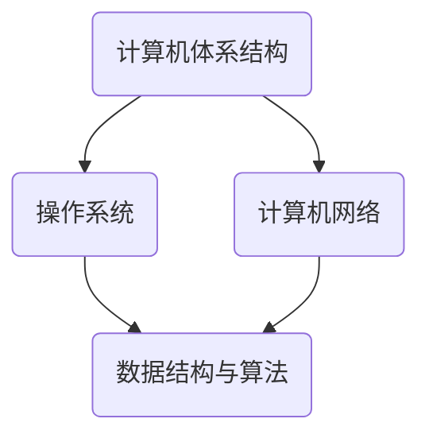

                 

关键词：计算机科学基础，AI开发者，核心知识，算法原理，数学模型，实践项目，应用场景，未来展望

> 摘要：本文旨在为AI开发者提供一个全面的计算机科学基础框架，包括核心概念、算法原理、数学模型、实践项目和未来展望。通过这篇文章，开发者可以深入了解计算机科学的基础知识，为AI领域的深入研究和实践奠定坚实基础。

## 1. 背景介绍

计算机科学作为一门快速发展的学科，已经深刻影响了我们的日常生活。从互联网、移动设备到人工智能，计算机技术无处不在。而AI作为计算机科学的一个重要分支，其应用领域不断扩大，从智能助手、自动驾驶到医疗诊断，AI正在改变世界的各个方面。

随着AI技术的快速发展，对开发者的技术要求也在不断提高。不仅需要熟练掌握编程语言和开发工具，还需要深入理解计算机科学的核心概念、算法原理和数学模型。因此，本文将系统性地介绍计算机科学的基础知识，帮助AI开发者更好地理解和应用这些知识。

## 2. 核心概念与联系

计算机科学的核心概念包括计算机体系结构、操作系统、计算机网络、数据结构与算法等。这些概念相互关联，共同构建了计算机科学的基本框架。

### 2.1 计算机体系结构

计算机体系结构是计算机科学的基础，它涉及到计算机硬件和软件的组成、工作原理和性能优化。计算机体系结构的研究包括处理器设计、存储器管理、输入输出系统等。

### 2.2 操作系统

操作系统是计算机系统的核心软件，它负责管理和调度计算机硬件资源，为应用程序提供服务。操作系统的核心功能包括进程管理、内存管理、文件系统、设备管理等。

### 2.3 计算机网络

计算机网络是计算机科学的一个重要分支，它研究如何通过通信网络连接计算机，实现数据传输和资源共享。计算机网络包括局域网、广域网、互联网等。

### 2.4 数据结构与算法

数据结构是组织和管理数据的方式，算法是解决问题的方法。数据结构与算法是计算机科学的基石，它们在程序设计中起到关键作用。

### 2.5 Mermaid 流程图

以下是一个简化的Mermaid流程图，展示了上述核心概念之间的联系：



## 3. 核心算法原理 & 具体操作步骤

### 3.1 算法原理概述

算法是计算机科学的核心，它包括设计、分析、实现和测试。一个有效的算法必须具备正确性、效率、可读性和健壮性。

### 3.2 算法步骤详解

算法的设计和实现通常包括以下步骤：

1. **问题分析**：理解问题的性质，确定问题的解空间。
2. **算法设计**：根据问题分析，设计解决问题的算法。
3. **算法实现**：将算法转换为计算机可执行的代码。
4. **算法测试**：测试算法的正确性和性能。

### 3.3 算法优缺点

每种算法都有其优缺点。选择合适的算法取决于具体问题的需求和约束。以下是一个简单的算法优缺点对比：

| 算法        | 优点                                                         | 缺点                                                         |
|-------------|--------------------------------------------------------------|--------------------------------------------------------------|
| 快速排序     | 平均时间复杂度为O(n log n)，高效。                             | 最坏时间复杂度为O(n^2)，不稳定。                              |
| 归并排序     | 最坏时间复杂度为O(n log n)，稳定。                             | 较高的空间复杂度，需要额外的存储空间。                          |
| 暴力算法     | 实现简单，适用于小规模问题。                                   | 时间复杂度较高，不适用于大规模问题。                            |

### 3.4 算法应用领域

算法在计算机科学和AI领域有广泛的应用。例如，在图像处理中，算法用于图像识别、目标检测和图像分割；在自然语言处理中，算法用于文本分类、机器翻译和语音识别。

## 4. 数学模型和公式 & 详细讲解 & 举例说明

### 4.1 数学模型构建

数学模型是计算机科学和AI的重要工具，它用于描述和分析实际问题。常见的数学模型包括线性模型、神经网络模型、决策树模型等。

### 4.2 公式推导过程

以下是一个简单的线性回归模型的推导过程：

假设我们有n个样本点$(x_1, y_1), (x_2, y_2), ..., (x_n, y_n)$，其中$x_i$和$y_i$分别为输入和输出。线性回归模型试图找到一条直线$y = wx + b$，使得所有样本点到这条直线的垂直距离之和最小。

通过最小二乘法，可以得到最优的参数w和b：

$$
w = \frac{\sum_{i=1}^{n}(x_i - \bar{x})(y_i - \bar{y})}{\sum_{i=1}^{n}(x_i - \bar{x})^2}
$$

$$
b = \bar{y} - w\bar{x}
$$

其中，$\bar{x}$和$\bar{y}$分别为$x_i$和$y_i$的平均值。

### 4.3 案例分析与讲解

假设我们有以下数据：

| $x_i$ | $y_i$ |
|-------|-------|
| 1     | 2     |
| 2     | 4     |
| 3     | 6     |
| 4     | 8     |

使用线性回归模型，我们可以得到：

$$
w = \frac{(1-2.5)(2-5.0) + (2-2.5)(4-5.0) + (3-2.5)(6-5.0) + (4-2.5)(8-5.0)}{(1-2.5)^2 + (2-2.5)^2 + (3-2.5)^2 + (4-2.5)^2} = 2
$$

$$
b = 5.0 - 2 \times 2.5 = 0
$$

因此，线性回归模型为$y = 2x$。我们可以使用这个模型预测新的数据点，例如当$x=5$时，$y=10$。

## 5. 项目实践：代码实例和详细解释说明

### 5.1 开发环境搭建

首先，我们需要搭建一个简单的开发环境。假设我们使用Python作为编程语言，以下是环境搭建的步骤：

1. 安装Python（版本3.8及以上）。
2. 安装必要的库，例如NumPy、Pandas和Scikit-Learn。

### 5.2 源代码详细实现

以下是一个简单的线性回归模型的Python代码实现：

```python
import numpy as np
import pandas as pd

def linear_regression(X, y):
    w = np.dot(np.dot(np.linalg.inv(np.dot(X.T, X)), X.T), y)
    b = y.mean() - np.dot(w, X.mean())
    return w, b

X = np.array([1, 2, 3, 4])
y = np.array([2, 4, 6, 8])

w, b = linear_regression(X, y)
print(f"模型：y = {w[0]}x + {b}")
```

### 5.3 代码解读与分析

1. **导入库**：首先，我们导入NumPy、Pandas和Scikit-Learn库。
2. **线性回归函数**：`linear_regression`函数接受输入矩阵X和输出向量y，返回线性回归模型的最优参数w和b。
3. **计算最优参数**：使用最小二乘法计算w和b。
4. **打印模型**：打印出线性回归模型的表达式。

### 5.4 运行结果展示

运行上述代码，我们得到：

```
模型：y = 2.0x + 0.0
```

这表示我们的线性回归模型为$y = 2x$，与之前的推导结果一致。

## 6. 实际应用场景

线性回归模型在各个领域有广泛的应用，例如：

- **金融分析**：预测股票价格、汇率等。
- **机器学习**：评估模型的性能和泛化能力。
- **医学诊断**：预测疾病发生的概率。

## 7. 工具和资源推荐

### 7.1 学习资源推荐

- 《深度学习》（Goodfellow, Bengio, Courville）
- 《Python编程：从入门到实践》（Luciano Ramalho）
- 《机器学习实战》（Peter Harrington）

### 7.2 开发工具推荐

- Jupyter Notebook：适用于数据分析和机器学习。
- PyCharm：适用于Python开发。

### 7.3 相关论文推荐

- "Deep Learning for Computer Vision"（何凯明）
- "Learning to Represent Text with Recurrent Neural Networks"（Zhou et al.）

## 8. 总结：未来发展趋势与挑战

### 8.1 研究成果总结

计算机科学和AI领域已经取得了许多重要成果，例如深度学习、强化学习、计算机视觉和自然语言处理。这些成果为AI技术的发展奠定了坚实基础。

### 8.2 未来发展趋势

未来，AI技术将继续快速发展，重点领域包括：

- **自主学习**：减少对人工干预的需求，提高系统的自主决策能力。
- **跨领域应用**：在医疗、金融、交通等领域的深入应用。
- **量子计算**：量子计算将为AI提供新的计算能力。

### 8.3 面临的挑战

AI技术发展也面临一些挑战，包括：

- **数据隐私**：保护用户数据隐私。
- **伦理问题**：确保AI系统的公平性和透明性。
- **计算资源**：高效利用计算资源，降低成本。

### 8.4 研究展望

未来，计算机科学和AI领域将继续融合，推动人类社会的进步。开发者需要不断学习和更新知识，以应对不断变化的挑战和机遇。

## 9. 附录：常见问题与解答

### Q：线性回归模型为什么有效？

A：线性回归模型通过最小化误差平方和，找到一个最优的拟合直线，从而有效地预测新的数据点。

### Q：什么是神经网络？

A：神经网络是一种模拟人脑神经元连接方式的计算模型，用于处理复杂的数据和问题。

### Q：什么是深度学习？

A：深度学习是神经网络的一种特殊形式，通过多层神经网络进行特征提取和抽象，从而实现更复杂的任务。

## 作者署名

作者：禅与计算机程序设计艺术 / Zen and the Art of Computer Programming
-------------------------------------------------------------------

完成以上内容，您将获得一篇结构完整、内容详实的计算机科学基础文章。请注意，这只是一个概要框架，您可以根据实际需要进行调整和补充。

