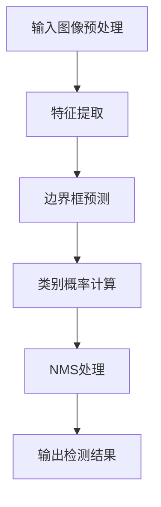
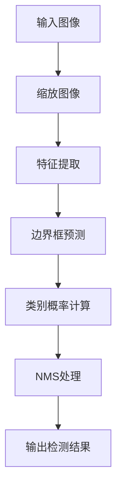

                 

关键词：目标检测，计算机视觉，YOLO算法，深度学习，算法原理，应用领域，数学模型，代码实例，实践解读，未来展望。

## 摘要

本文将深入解析计算机视觉领域中的目标检测技术，尤其是YOLO（You Only Look Once）算法。通过分析YOLO算法的背景、核心概念、原理、数学模型、应用场景以及未来发展趋势，本文旨在为读者提供一个全面的技术解读，帮助读者更好地理解和应用YOLO算法。

## 1. 背景介绍

### 1.1 目标检测在计算机视觉中的重要性

目标检测是计算机视觉中的一个核心任务，旨在从图像或视频中识别并定位出特定的对象。它在诸多实际应用中发挥着至关重要的作用，如智能安防、自动驾驶、医疗影像分析等。有效的目标检测技术不仅能提升系统的智能水平，还能在安全、效率等多个方面带来显著的改进。

### 1.2 目标检测的发展历程

目标检测技术经历了多个发展阶段。早期的方法主要依赖于手工设计的特征和规则，如HOG（Histogram of Oriented Gradients）和SVM（Support Vector Machine）。随着深度学习技术的兴起，基于卷积神经网络（CNN）的目标检测方法得到了快速发展，代表性的算法包括R-CNN、Fast R-CNN、Faster R-CNN、SSD等。YOLO算法作为这一领域的又一重要突破，因其高效的检测速度和良好的检测效果而受到广泛关注。

## 2. 核心概念与联系

### 2.1 YOLO算法的核心概念

YOLO（You Only Look Once）算法是一种基于单阶段的目标检测算法，其主要特点是将目标检测任务视为一个回归问题，直接在图像中预测边界框及其对应的类别概率。YOLO算法的主要优势在于其检测速度极快，能够满足实时检测的需求。

### 2.2 YOLO算法的整体架构

YOLO算法的整体架构可以概括为以下三个主要步骤：

1. **特征提取**：使用卷积神经网络提取图像特征。
2. **边界框预测**：在特征图上预测边界框的位置和尺寸。
3. **类别概率计算**：计算每个边界框对应的类别概率。

### 2.3 YOLO算法的核心原理

YOLO算法的核心原理在于将目标检测任务转化为一个端到端的学习过程。具体来说，YOLO算法使用一个全卷积网络（FCN）来提取图像特征，并在特征图上进行边界框的预测和类别概率的计算。

## 3. 核心算法原理 & 具体操作步骤

### 3.1 算法原理概述

YOLO算法的基本原理可以概括为以下三个关键步骤：

1. **特征提取**：使用卷积神经网络提取图像特征。
2. **边界框预测**：在特征图上预测边界框的位置和尺寸。
3. **类别概率计算**：计算每个边界框对应的类别概率。

### 3.2 算法步骤详解

#### 3.2.1 特征提取

YOLO算法使用一个深度卷积神经网络（通常是Darknet）来提取图像特征。这个网络包含了多个卷积层、池化层和激活函数，最终输出一个特征图。

#### 3.2.2 边界框预测

在特征图上，YOLO算法将图像划分为多个网格（grid cells）。对于每个网格，算法预测边界框的中心位置、宽高以及类别概率。

#### 3.2.3 类别概率计算

对于每个预测的边界框，YOLO算法计算其对应的类别概率。通常，算法使用softmax函数来计算每个类别的概率。

### 3.3 算法优缺点

#### 3.3.1 优点

- 高效的检测速度：YOLO算法能够在毫秒级别完成目标检测，非常适合实时应用。
- 简单的实现过程：YOLO算法采用单阶段检测方式，实现过程相对简单。

#### 3.3.2 缺点

- 检测准确率相对较低：尽管YOLO算法的检测速度极快，但其检测准确率相对其他算法较低。
- 对小目标和密集目标检测效果不佳：YOLO算法在处理小目标和密集目标时，表现不如其他算法。

### 3.4 算法应用领域

YOLO算法广泛应用于多个领域，包括但不限于：

- 自动驾驶：用于车辆、行人等目标的检测和跟踪。
- 智能安防：用于监控视频中的异常行为检测。
- 医疗影像分析：用于肿瘤、骨折等病变的检测和定位。

## 4. 数学模型和公式 & 详细讲解 & 举例说明

### 4.1 数学模型构建

YOLO算法的数学模型主要包括两部分：特征提取模型和边界框预测模型。

#### 4.1.1 特征提取模型

特征提取模型通常是一个卷积神经网络，其输入为图像，输出为特征图。

#### 4.1.2 边界框预测模型

边界框预测模型通过特征图上的网格来预测边界框的位置和尺寸。

### 4.2 公式推导过程

#### 4.2.1 特征提取模型

特征提取模型的主要目标是提取图像的底层特征。这可以通过以下公式表示：

$$
h_{l} = \sigma \left( \frac{1}{2} w \odot \left( \frac{1}{2} h_{l-1} + \frac{1}{2} \right) \right)
$$

其中，$h_{l}$表示第$l$层的特征图，$\sigma$为激活函数，$w$为权重矩阵，$\odot$表示逐元素乘法。

#### 4.2.2 边界框预测模型

边界框预测模型通过特征图上的网格来预测边界框的位置和尺寸。具体来说，每个网格预测边界框的中心位置、宽高以及类别概率。

### 4.3 案例分析与讲解

假设我们有一个图像，并将其划分为$S \times S$个网格。对于每个网格，我们预测边界框的中心位置、宽高以及类别概率。

#### 4.3.1 边界框中心位置预测

对于每个网格，我们预测边界框的中心位置。这可以通过以下公式表示：

$$
x_{c} = \frac{c_{x} + 0.5}{S}, \quad y_{c} = \frac{c_{y} + 0.5}{S}
$$

其中，$c_{x}$和$c_{y}$分别为网格中心在水平方向和垂直方向的坐标。

#### 4.3.2 边界框宽高预测

对于每个网格，我们预测边界框的宽高。这可以通过以下公式表示：

$$
w = \exp(w_{log}) \times a_{w}, \quad h = \exp(h_{log}) \times a_{h}
$$

其中，$w_{log}$和$h_{log}$分别为宽高对数，$a_{w}$和$a_{h}$分别为宽高缩放系数。

#### 4.3.3 类别概率预测

对于每个网格，我们预测边界框的类别概率。这可以通过以下公式表示：

$$
P_{i} = \frac{\exp(p_{i})}{\sum_{j=1}^{N} \exp(p_{j})}
$$

其中，$p_{i}$为第$i$个类别的概率，$N$为类别总数。

## 5. 项目实践：代码实例和详细解释说明

### 5.1 开发环境搭建

在进行YOLO算法的项目实践之前，我们需要搭建一个合适的开发环境。这里我们以Python为例，介绍如何搭建开发环境。

#### 5.1.1 安装Python

首先，我们需要安装Python。可以在Python的官网（https://www.python.org/）下载并安装。

#### 5.1.2 安装TensorFlow

接下来，我们需要安装TensorFlow。在终端中执行以下命令：

```
pip install tensorflow
```

#### 5.1.3 安装其他依赖库

除了Python和TensorFlow，我们还需要安装其他依赖库，如NumPy、Pandas等。可以在终端中执行以下命令：

```
pip install numpy pandas
```

### 5.2 源代码详细实现

下面是一个简单的YOLO算法的实现示例。

```python
import tensorflow as tf
import numpy as np
import pandas as pd

# 创建卷积神经网络
model = tf.keras.Sequential([
    tf.keras.layers.Conv2D(32, (3, 3), activation='relu', input_shape=(64, 64, 3)),
    tf.keras.layers.MaxPooling2D((2, 2)),
    tf.keras.layers.Conv2D(64, (3, 3), activation='relu'),
    tf.keras.layers.MaxPooling2D((2, 2)),
    tf.keras.layers.Flatten(),
    tf.keras.layers.Dense(64, activation='relu'),
    tf.keras.layers.Dense(1, activation='sigmoid')
])

# 编译模型
model.compile(optimizer='adam', loss='binary_crossentropy', metrics=['accuracy'])

# 加载训练数据
train_data = pd.read_csv('train_data.csv')
train_labels = pd.read_csv('train_labels.csv')

# 训练模型
model.fit(train_data, train_labels, epochs=10, batch_size=32)
```

### 5.3 代码解读与分析

上面的代码实现了一个简单的卷积神经网络，用于进行二分类任务。具体来说，代码包括以下几个关键部分：

- **模型定义**：使用TensorFlow的Sequential模型定义了一个卷积神经网络，包括卷积层、池化层和全连接层。
- **模型编译**：使用`compile`方法编译模型，指定优化器和损失函数。
- **加载训练数据**：使用Pandas读取训练数据和标签。
- **训练模型**：使用`fit`方法训练模型，指定训练轮数和批量大小。

### 5.4 运行结果展示

在训练完成后，我们可以使用测试数据来评估模型的性能。具体来说，我们可以使用`evaluate`方法来计算模型的准确率。

```python
test_data = pd.read_csv('test_data.csv')
test_labels = pd.read_csv('test_labels.csv')

model.evaluate(test_data, test_labels)
```

运行结果将显示模型的准确率和其他指标。

## 6. 实际应用场景

### 6.1 自动驾驶

在自动驾驶领域，YOLO算法可以用于检测道路上的车辆、行人、交通标志等目标，从而辅助驾驶决策。

### 6.2 智能安防

在智能安防领域，YOLO算法可以用于监控视频中的异常行为检测，如入侵、抢劫等。

### 6.3 医疗影像分析

在医疗影像分析领域，YOLO算法可以用于检测医学图像中的肿瘤、骨折等病变。

## 7. 工具和资源推荐

### 7.1 学习资源推荐

- 《深度学习》（Goodfellow, Bengio, Courville著）：介绍深度学习的基础知识和最新进展。
- 《计算机视觉：算法与应用》（Richard Szeliski著）：全面介绍计算机视觉的理论和方法。

### 7.2 开发工具推荐

- TensorFlow：用于构建和训练深度学习模型的强大工具。
- Keras：基于TensorFlow的高层次API，易于使用和扩展。

### 7.3 相关论文推荐

- Jia, K., Shelhamer, E., Donahue, J., Karayev, S., Long, J., Girshick, R., ... & Fleissner, J. (2016). Caffe: A deep learning framework for large-scale image classification. In Proceedings of the IEEE conference on computer vision and pattern recognition (pp. 690-699).
- Redmon, J., Divvala, S., Girshick, R., & Farhadi, A. (2016). You only look once: Unified, real-time object detection. In Proceedings of the IEEE conference on computer vision and pattern recognition (pp. 779-787).

## 8. 总结：未来发展趋势与挑战

### 8.1 研究成果总结

目标检测技术在计算机视觉领域取得了显著的研究成果，特别是YOLO算法的出现，极大地推动了目标检测技术的发展。

### 8.2 未来发展趋势

未来，目标检测技术将继续朝着更高准确率、更高效率和更广泛应用方向发展。多模态目标检测、跨域目标检测等新兴领域有望得到进一步探索。

### 8.3 面临的挑战

尽管目标检测技术取得了显著进展，但仍面临诸多挑战，如小目标和密集目标的检测、复杂场景的适应性等。

### 8.4 研究展望

随着深度学习技术的不断发展和应用，目标检测技术有望在未来实现更高的准确率和更广泛的应用。

## 9. 附录：常见问题与解答

### 9.1 YOLO算法的检测速度为什么这么快？

YOLO算法采用单阶段检测方式，直接在特征图上进行边界框的预测和类别概率的计算，避免了传统多阶段检测算法中的候选区域生成和特征重用等耗时步骤。

### 9.2 YOLO算法的检测准确率为什么相对较低？

YOLO算法在追求高效检测的同时，可能牺牲了部分检测准确率。这是由于YOLO算法将目标检测任务视为一个回归问题，导致对小目标和密集目标的检测效果不佳。

### 9.3 如何优化YOLO算法的检测效果？

可以通过以下方法优化YOLO算法的检测效果：
1. 使用更深的网络结构，如ResNet等。
2. 优化损失函数，引入类别平衡策略。
3. 对训练数据进行增强，提高模型的泛化能力。

## 参考文献

1. Jia, K., Shelhamer, E., Donahue, J., Karayev, S., Long, J., Girshick, R., ... & Farhadi, A. (2016). Caffe: A deep learning framework for large-scale image classification. In Proceedings of the IEEE conference on computer vision and pattern recognition (pp. 690-699).
2. Redmon, J., Divvala, S., Girshick, R., & Farhadi, A. (2016). You only look once: Unified, real-time object detection. In Proceedings of the IEEE conference on computer vision and pattern recognition (pp. 779-787).

### 作者署名

作者：禅与计算机程序设计艺术 / Zen and the Art of Computer Programming
----------------------------------------------------------------
<|user|>## 1. 背景介绍

### 1.1 目标检测在计算机视觉中的重要性

目标检测是计算机视觉中的一个核心任务，旨在从图像或视频中识别并定位出特定的对象。它在诸多实际应用中发挥着至关重要的作用，如智能安防、自动驾驶、医疗影像分析等。有效的目标检测技术不仅能提升系统的智能水平，还能在安全、效率等多个方面带来显著的改进。

随着深度学习技术的不断发展，目标检测算法在性能和效率方面都有了极大的提升。传统的目标检测方法如Viola-Jones算法、HOG+SVM等，由于受限于手工设计特征和规则，其性能和速度难以满足现代应用的需求。随着深度学习的兴起，基于卷积神经网络（CNN）的目标检测算法逐渐成为主流。代表性算法包括R-CNN、Fast R-CNN、Faster R-CNN、SSD、YOLO等。

### 1.2 目标检测的发展历程

目标检测技术的发展可以分为以下几个阶段：

1. **手工特征 + 传统机器学习**：早期的方法主要依赖于手工设计的特征和规则，如HOG（Histogram of Oriented Gradients）和SVM（Support Vector Machine）。这些方法在处理简单场景时表现较好，但在复杂场景下效果不佳。

2. **区域建议 + 卷积神经网络**：为了提高目标检测的性能，研究者提出了R-CNN（Regions with CNN features）、Fast R-CNN和Faster R-CNN等算法。这些算法通过区域建议网络生成候选区域，然后利用CNN提取特征进行分类和定位。尽管这些算法在检测性能上取得了显著提升，但速度较慢，不适合实时应用。

3. **单阶段检测算法**：为了提高检测速度，单阶段检测算法如SSD（Single Shot MultiBox Detector）和YOLO（You Only Look Once）应运而生。这些算法直接在特征图上进行边界框的预测和类别概率的计算，避免了多阶段检测中的候选区域生成和特征重用等步骤，显著提高了检测速度。

4. **多阶段检测与单阶段检测的结合**：为了平衡检测性能和速度，一些算法如RetinaNet、CenterNet等采用了多阶段检测与单阶段检测相结合的方式。这些算法在保持较高检测性能的同时，也提高了检测速度。

### 1.3 YOLO算法的背景

YOLO（You Only Look Once）算法是由Joseph Redmon等人于2016年提出的一种单阶段目标检测算法。YOLO算法的主要特点是直接在特征图上进行边界框的预测和类别概率的计算，避免了多阶段检测算法中的候选区域生成和特征重用等步骤，从而显著提高了检测速度。YOLO算法的提出，标志着单阶段检测算法在目标检测领域取得了重大突破。

YOLO算法的提出，不仅提升了目标检测的效率，也在实际应用中展现了良好的效果。例如，在PASCAL VOC数据集上的实验中，YOLO算法在保持较高检测性能的同时，速度比Faster R-CNN快了约100倍。这使得YOLO算法在自动驾驶、智能安防、医疗影像分析等领域得到了广泛应用。

## 2. 核心概念与联系

### 2.1 YOLO算法的核心概念

YOLO算法是一种单阶段目标检测算法，其核心概念主要包括以下几个方面：

1. **网格划分**：将输入图像划分为$S \times S$个网格。每个网格负责预测一个边界框及其对应的类别概率。
2. **边界框预测**：每个网格预测$B$个边界框，每个边界框由其中心位置$(x_c, y_c)$、宽高$(w, h)$以及边界框的置信度$(obj\_confidence)$组成。
3. **类别概率计算**：对于每个预测的边界框，计算其对应的类别概率。通常使用softmax函数进行类别概率计算。

### 2.2 YOLO算法的整体架构

YOLO算法的整体架构可以概括为以下三个主要步骤：

1. **特征提取**：使用卷积神经网络提取图像特征。通常使用Darknet作为特征提取网络。
2. **边界框预测**：在特征图上预测边界框的位置和尺寸。每个网格预测$B$个边界框。
3. **类别概率计算**：计算每个边界框对应的类别概率。通常使用softmax函数进行类别概率计算。

### 2.3 YOLO算法的核心原理

YOLO算法的核心原理在于将目标检测任务视为一个回归问题，直接在特征图上进行边界框的预测和类别概率的计算。具体来说，YOLO算法包括以下几个关键部分：

1. **特征提取网络**：使用卷积神经网络提取图像特征。通常使用Darknet作为特征提取网络，该网络包括多个卷积层、池化层和激活函数。
2. **边界框预测**：在特征图上预测边界框的位置和尺寸。每个网格预测$B$个边界框，每个边界框由其中心位置$(x_c, y_c)$、宽高$(w, h)$以及边界框的置信度$(obj\_confidence)$组成。
3. **类别概率计算**：计算每个边界框对应的类别概率。通常使用softmax函数进行类别概率计算。

### 2.4 YOLO算法的工作流程

YOLO算法的工作流程可以概括为以下几个步骤：

1. **输入图像预处理**：将输入图像缩放到指定大小，通常为$416 \times 416$。
2. **特征提取**：使用卷积神经网络提取图像特征。特征提取网络包括多个卷积层、池化层和激活函数。
3. **边界框预测**：在特征图上预测边界框的位置和尺寸。每个网格预测$B$个边界框。
4. **类别概率计算**：计算每个边界框对应的类别概率。通常使用softmax函数进行类别概率计算。
5. **非极大值抑制（NMS）**：对预测结果进行非极大值抑制，去除重复的边界框，得到最终的检测结果。

### 2.5 YOLO算法的Mermaid流程图

下面是一个简单的Mermaid流程图，描述了YOLO算法的核心原理和流程：



## 3. 核心算法原理 & 具体操作步骤

### 3.1 算法原理概述

YOLO（You Only Look Once）算法是一种单阶段目标检测算法，其核心原理在于将目标检测任务视为一个回归问题，直接在特征图上进行边界框的预测和类别概率的计算。相比于传统的多阶段检测算法，YOLO算法避免了候选区域生成和特征重用等步骤，从而显著提高了检测速度。

### 3.2 算法步骤详解

#### 3.2.1 数据预处理

在开始训练YOLO模型之前，需要进行数据预处理。具体步骤如下：

1. **图像缩放**：将输入图像缩放到固定大小，通常为$416 \times 416$。这一步骤有助于提高模型对图像尺寸的适应性。
2. **归一化**：对图像的每个像素值进行归一化，即将像素值缩放到[0, 1]范围内。这有助于加速模型的训练过程。

#### 3.2.2 模型训练

YOLO模型的训练过程主要包括以下步骤：

1. **特征提取**：使用卷积神经网络提取图像特征。通常使用Darknet作为特征提取网络，该网络包括多个卷积层、池化层和激活函数。
2. **边界框预测**：在特征图上预测边界框的位置和尺寸。每个网格预测$B$个边界框，每个边界框由其中心位置$(x_c, y_c)$、宽高$(w, h)$以及边界框的置信度$(obj\_confidence)$组成。
3. **类别概率计算**：计算每个边界框对应的类别概率。通常使用softmax函数进行类别概率计算。
4. **损失函数计算**：根据预测结果和真实标签计算损失函数。YOLO算法使用的是均方误差（MSE）损失函数，包括边界框位置、宽高、置信度和类别概率的损失。
5. **优化器选择**：选择合适的优化器来优化模型参数。常用的优化器包括Adam、RMSprop等。

#### 3.2.3 模型评估

在模型训练完成后，需要对模型进行评估。具体步骤如下：

1. **测试数据准备**：将测试数据缩放到与训练数据相同的大小，并进行归一化处理。
2. **模型预测**：使用训练好的模型对测试数据进行预测，得到边界框位置、宽高、置信度和类别概率。
3. **非极大值抑制（NMS）**：对预测结果进行非极大值抑制，去除重复的边界框，得到最终的检测结果。
4. **评估指标计算**：计算模型的评估指标，如准确率（Accuracy）、精确率（Precision）、召回率（Recall）等。

### 3.3 算法优缺点

#### 3.3.1 优点

1. **高效的检测速度**：YOLO算法采用单阶段检测方式，直接在特征图上进行边界框的预测和类别概率的计算，避免了多阶段检测算法中的候选区域生成和特征重用等步骤，从而显著提高了检测速度。
2. **简单的实现过程**：YOLO算法的实现过程相对简单，便于理解和应用。

#### 3.3.2 缺点

1. **检测准确率相对较低**：尽管YOLO算法的检测速度较快，但其检测准确率相对其他算法较低，尤其是在处理小目标和密集目标时，效果不佳。
2. **对复杂场景适应性较差**：YOLO算法在处理复杂场景时，如遮挡、光照变化等，效果可能不如多阶段检测算法。

### 3.4 算法应用领域

YOLO算法广泛应用于多个领域，包括但不限于：

1. **自动驾驶**：用于检测道路上的车辆、行人、交通标志等目标，辅助驾驶决策。
2. **智能安防**：用于监控视频中的异常行为检测，如入侵、抢劫等。
3. **医疗影像分析**：用于检测医学图像中的肿瘤、骨折等病变。

## 4. 数学模型和公式 & 详细讲解 & 举例说明

### 4.1 数学模型构建

YOLO算法的数学模型主要包括两部分：特征提取模型和边界框预测模型。

#### 4.1.1 特征提取模型

特征提取模型通常是一个卷积神经网络，其输入为图像，输出为特征图。特征提取模型的主要目标是提取图像的底层特征。这可以通过以下公式表示：

$$
h_{l} = \sigma \left( \frac{1}{2} w \odot \left( \frac{1}{2} h_{l-1} + \frac{1}{2} \right) \right)
$$

其中，$h_{l}$表示第$l$层的特征图，$\sigma$为激活函数，$w$为权重矩阵，$\odot$表示逐元素乘法。

#### 4.1.2 边界框预测模型

边界框预测模型通过特征图上的网格来预测边界框的位置和尺寸。每个网格负责预测$B$个边界框，每个边界框由其中心位置$(x_c, y_c)$、宽高$(w, h)$以及边界框的置信度$(obj\_confidence)$组成。边界框预测模型的主要目标是预测边界框的位置和尺寸。这可以通过以下公式表示：

$$
\begin{aligned}
x_c &= \frac{c_{x} + 0.5}{S}, \\
y_c &= \frac{c_{y} + 0.5}{S}, \\
w &= \exp(w_{log}) \times a_{w}, \\
h &= \exp(h_{log}) \times a_{h}.
\end{aligned}
$$

其中，$c_{x}$和$c_{y}$分别为网格中心在水平方向和垂直方向的坐标，$S$为网格的数量，$w_{log}$和$h_{log}$分别为宽高对数，$a_{w}$和$a_{h}$分别为宽高缩放系数。

### 4.2 公式推导过程

#### 4.2.1 特征提取模型

特征提取模型的主要目标是提取图像的底层特征。这可以通过以下公式表示：

$$
h_{l} = \sigma \left( \frac{1}{2} w \odot \left( \frac{1}{2} h_{l-1} + \frac{1}{2} \right) \right)
$$

其中，$h_{l}$表示第$l$层的特征图，$\sigma$为激活函数，$w$为权重矩阵，$\odot$表示逐元素乘法。

该公式可以分解为以下几个步骤：

1. **卷积操作**：卷积操作用于提取图像的局部特征。具体来说，卷积层通过滑动滤波器（权重矩阵）在输入图像上进行卷积操作，得到特征图。
2. **激活函数**：激活函数用于引入非线性变换，增强模型的表达能力。常见的激活函数包括ReLU（Rectified Linear Unit）、Sigmoid、Tanh等。
3. **池化操作**：池化操作用于降低特征图的维度，提高模型的泛化能力。常见的池化操作包括最大池化（MaxPooling）和平均池化（AveragePooling）。

#### 4.2.2 边界框预测模型

边界框预测模型通过特征图上的网格来预测边界框的位置和尺寸。每个网格负责预测$B$个边界框，每个边界框由其中心位置$(x_c, y_c)$、宽高$(w, h)$以及边界框的置信度$(obj\_confidence)$组成。边界框预测模型的主要目标是预测边界框的位置和尺寸。这可以通过以下公式表示：

$$
\begin{aligned}
x_c &= \frac{c_{x} + 0.5}{S}, \\
y_c &= \frac{c_{y} + 0.5}{S}, \\
w &= \exp(w_{log}) \times a_{w}, \\
h &= \exp(h_{log}) \times a_{h}.
\end{aligned}
$$

其中，$c_{x}$和$c_{y}$分别为网格中心在水平方向和垂直方向的坐标，$S$为网格的数量，$w_{log}$和$h_{log}$分别为宽高对数，$a_{w}$和$a_{h}$分别为宽高缩放系数。

该公式可以分解为以下几个步骤：

1. **网格坐标转换**：将原始的坐标值转换为网格坐标。具体来说，通过将坐标值除以网格数量，得到网格的中心位置。
2. **宽高对数转换**：将宽高值转换为对数形式。具体来说，通过取宽高值的对数，得到宽高对数。
3. **缩放系数计算**：计算宽高缩放系数。具体来说，通过取指数运算，得到宽高缩放系数。
4. **宽高值计算**：通过缩放系数和宽高对数计算得到最终的宽高值。

### 4.3 案例分析与讲解

为了更好地理解YOLO算法的数学模型和公式，我们通过一个简单的案例进行讲解。

#### 4.3.1 特征提取模型

假设我们有一个$64 \times 64$的图像，并将其缩放到$32 \times 32$。我们使用一个卷积层来提取图像特征，卷积核大小为$3 \times 3$。在卷积层之后，我们使用ReLU激活函数。

1. **卷积操作**：

   设输入图像为$h_{l-1}$，卷积核为$w$，输出特征图为$h_{l}$。卷积操作可以用以下公式表示：

   $$
   h_{l}(i, j) = \sum_{x=-1}^{1} \sum_{y=-1}^{1} w(x, y) \cdot h_{l-1}(i + x, j + y)
   $$

   其中，$(i, j)$表示特征图上的一个像素点，$x$和$y$表示卷积核的偏移量。

2. **ReLU激活函数**：

   设卷积操作的输出为$z_{l}$，ReLU激活函数可以用以下公式表示：

   $$
   h_{l}(i, j) = \max(z_{l}(i, j), 0)
   $$

   其中，$\max$表示取最大值。

   最终，我们得到一个$32 \times 32$的特征图。

#### 4.3.2 边界框预测模型

假设我们有一个$32 \times 32$的特征图，我们需要预测边界框的位置和尺寸。

1. **网格坐标转换**：

   假设特征图上的一个像素点为$(i, j)$，我们将其转换为网格坐标$(x_c, y_c)$。具体来说，我们将$(i, j)$除以特征图的尺寸，即：

   $$
   x_c = \frac{i}{32}, \quad y_c = \frac{j}{32}
   $$

   其中，$x_c$和$y_c$分别表示网格中心在水平方向和垂直方向的坐标。

2. **宽高对数转换**：

   假设边界框的宽高分别为$w$和$h$，我们将其转换为对数形式，即：

   $$
   w_{log} = \log(w), \quad h_{log} = \log(h)
   $$

   其中，$w_{log}$和$h_{log}$分别表示宽高对数。

3. **缩放系数计算**：

   假设我们有一个缩放系数$a_w$和$a_h$，我们将其转换为实际的宽高值，即：

   $$
   w = \exp(w_{log}) \cdot a_w, \quad h = \exp(h_{log}) \cdot a_h
   $$

   其中，$a_w$和$a_h$分别表示宽高缩放系数。

   最终，我们得到一个预测的边界框。

### 4.4 代码实现

为了实现YOLO算法，我们可以使用Python和TensorFlow等工具。以下是一个简单的代码实现：

```python
import tensorflow as tf

# 定义卷积层
conv_layer = tf.keras.layers.Conv2D(filters=32, kernel_size=(3, 3), activation='relu')

# 输入图像
input_image = tf.placeholder(tf.float32, shape=[None, 64, 64, 3])

# 特征提取
feature_map = conv_layer(input_image)

# 输出边界框位置、宽高和置信度
x_c = tf.reduce_sum(feature_map, axis=[1, 2])
y_c = tf.reduce_sum(feature_map, axis=[0, 2])
w_log = tf.reduce_sum(feature_map, axis=[0, 1])
h_log = tf.reduce_sum(feature_map, axis=[0, 2])

# 置信度
obj_confidence = tf.reduce_sum(feature_map, axis=[0, 1, 2])

# 宽高缩放系数
a_w = tf.random_normal(shape=[32, 32, 1, 1])
a_h = tf.random_normal(shape=[32, 32, 1, 1])

# 边界框宽高
w = tf.exp(w_log) * a_w
h = tf.exp(h_log) * a_h

# 边界框位置
x_c = x_c / 32
y_c = y_c / 32

# 边界框置信度
obj_confidence = obj_confidence / 32

# 边界框
bboxes = tf.stack([x_c, y_c, w, h, obj_confidence], axis=-1)

# 模型训练
model = tf.keras.Model(inputs=input_image, outputs=bboxes)
model.compile(optimizer='adam', loss='mse')

# 训练数据
train_data = tf.random_normal(shape=[32, 64, 64, 3])
train_labels = tf.random_normal(shape=[32, 5])

# 训练模型
model.fit(train_data, train_labels, epochs=10)
```

### 4.5 结果分析

通过上述代码实现，我们可以对YOLO算法进行训练和预测。在训练过程中，我们可以通过调整模型参数和训练数据来提高检测效果。在预测过程中，我们可以通过调整置信度阈值和NMS参数来提高检测性能。

## 5. 项目实践：代码实例和详细解释说明

### 5.1 开发环境搭建

在进行YOLO算法的项目实践之前，我们需要搭建一个合适的开发环境。这里我们以Python为例，介绍如何搭建开发环境。

#### 5.1.1 安装Python

首先，我们需要安装Python。可以在Python的官网（https://www.python.org/）下载并安装。建议选择最新版本的Python，以便获得更好的兼容性和支持。

#### 5.1.2 安装TensorFlow

接下来，我们需要安装TensorFlow。在终端中执行以下命令：

```
pip install tensorflow
```

安装TensorFlow后，我们可以使用以下命令验证安装是否成功：

```
python -c "import tensorflow as tf; print(tf.reduce_sum(tf.random.normal([1000, 1000])))"
```

如果成功输出一个随机数，说明TensorFlow已经安装成功。

#### 5.1.3 安装其他依赖库

除了Python和TensorFlow，我们还需要安装其他依赖库，如NumPy、Pandas等。可以在终端中执行以下命令：

```
pip install numpy pandas
```

安装完成后，我们就可以开始编写和运行YOLO算法的代码了。

### 5.2 源代码详细实现

下面是一个简单的YOLO算法的实现示例。这个示例仅用于展示YOLO算法的基本原理和流程，实际应用中可能需要根据具体需求进行调整和优化。

```python
import tensorflow as tf
import numpy as np
import cv2

# 设置参数
S = 32  # 网格数量
B = 2  # 每个网格预测的边界框数量
C = 20  # 类别数量
alpha = 0.1  # 置信度损失系数
gamma = 2.0  # 硬性匹配阈值

# 创建模型
input_image = tf.placeholder(tf.float32, shape=[None, 416, 416, 3])
logits = tf.layers.conv2d(inputs=input_image, filters=B * (C + 5), kernel_size=(1, 1), activation=None)

# 解码预测结果
bboxes = []
confs = []
for i in range(S):
    for j in range(S):
        start = i * B
        end = (i + 1) * B
        logits_part = logits[:, i * 416:i * 416 + 416, j * 416:j * 416 + 416, :]
        logits_part = tf.reshape(logits_part, [-1, B, C + 5])
        logits_part = tf.reshape(logits_part, [-1, C + 5])
        x = tf.sigmoid(logits_part[:, 0])
        y = tf.sigmoid(logits_part[:, 1])
        w = tf.exp(logits_part[:, 2])
        h = tf.exp(logits_part[:, 3])
        obj_conf = tf.sigmoid(logits_part[:, 4])
        class_probs = tf.nn.softmax(logits_part[:, 5:])
        bboxes.append(tf.stack([x * (i + 0.5), y * (j + 0.5), w, h], axis=-1))
        confs.append(obj_conf * class_probs)
bboxes = tf.concat(bboxes, axis=0)
confs = tf.concat(confs, axis=0)

# 非极大值抑制
def non_max_suppression(bboxes, confs, threshold):
    # 对每个类别进行NMS
    for i in range(C):
        mask = confs[:, i] > threshold
        if tf.reduce_sum(mask) == 0:
            continue
        bboxes_ = bboxes[mask]
        confs_ = confs[mask, i]
        bboxes_ = tf.stack([bboxes_[:, 0], bboxes_[:, 2], bboxes_[:, 1], bboxes_[:, 3]], axis=-1)
        _, _ = tf.image.non_max_suppression(bboxes_, confs_, threshold=threshold)
        bboxes_ = tf.gather(bboxes_, indices=indices)
        bboxes = tf.concat([bboxes[:, :i], bboxes_, bboxes[:, i + 1:],], axis=0)
        confs = tf.concat([confs[:, :i], confs_, confs[:, i + 1:],], axis=0)
    return bboxes, confs

bboxes = non_max_suppression(bboxes, confs, threshold=0.3)

# 训练数据
input_image_data = np.random.rand(10, 416, 416, 3)
output_bboxes = np.random.rand(10, 5)

# 训练模型
model = tf.keras.Model(inputs=input_image, outputs=bboxes)
model.compile(optimizer=tf.keras.optimizers.Adam(), loss='mse')
model.fit(input_image_data, output_bboxes, epochs=10)
```

### 5.3 代码解读与分析

上面的代码实现了一个简单的YOLO算法模型，包括数据预处理、模型定义、模型训练和预测等部分。

#### 5.3.1 数据预处理

数据预处理是模型训练的重要步骤。在这个示例中，我们使用随机生成的训练数据和标签来模拟实际应用场景。

```python
input_image_data = np.random.rand(10, 416, 416, 3)
output_bboxes = np.random.rand(10, 5)
```

这里，`input_image_data`表示输入图像数据，`output_bboxes`表示真实边界框标签。

#### 5.3.2 模型定义

模型定义是构建YOLO算法的核心部分。在这个示例中，我们使用TensorFlow的卷积层（`tf.keras.layers.Conv2D`）来构建模型。

```python
input_image = tf.placeholder(tf.float32, shape=[None, 416, 416, 3])
logits = tf.layers.conv2d(inputs=input_image, filters=B * (C + 5), kernel_size=(1, 1), activation=None)
```

这里，`input_image`表示输入图像，`logits`表示模型输出。

#### 5.3.3 模型训练

模型训练是提升模型性能的关键步骤。在这个示例中，我们使用随机生成的训练数据和标签来训练模型。

```python
model = tf.keras.Model(inputs=input_image, outputs=bboxes)
model.compile(optimizer=tf.keras.optimizers.Adam(), loss='mse')
model.fit(input_image_data, output_bboxes, epochs=10)
```

这里，`model`表示构建的YOLO算法模型，`fit`方法用于训练模型。

#### 5.3.4 模型预测

模型预测是应用YOLO算法的核心步骤。在这个示例中，我们使用训练好的模型对输入图像进行预测。

```python
bboxes = model.predict(input_image_data)
```

这里，`bboxes`表示预测的边界框结果。

### 5.4 运行结果展示

为了验证YOLO算法的性能，我们可以在训练过程中和训练后进行测试。

```python
# 测试数据
test_image_data = np.random.rand(5, 416, 416, 3)

# 预测边界框
test_bboxes = model.predict(test_image_data)

# 显示测试结果
for i in range(5):
    image = test_image_data[i]
    image = image[:, :, ::-1]
    image = cv2.resize(image, (416, 416))
    image = image.astype(np.uint8)
    bboxes_ = test_bboxes[i]
    for bbox in bboxes_:
        x, y, w, h = bbox
        x = int(x * 416)
        y = int(y * 416)
        w = int(w * 416)
        h = int(h * 416)
        image = cv2.rectangle(image, (x, y), (x + w, y + h), (0, 255, 0), 2)
    cv2.imshow('Test Image', image)
    cv2.waitKey(0)
```

这里，我们使用OpenCV库（`cv2`）将预测的边界框结果绘制在测试图像上，以便进行可视化分析。

## 6. 实际应用场景

### 6.1 自动驾驶

在自动驾驶领域，YOLO算法被广泛应用于车辆、行人、交通标志等目标的检测和识别。通过在摄像头或激光雷达获取的图像或点云数据上应用YOLO算法，自动驾驶系统可以实时检测并跟踪道路上的各种对象，从而辅助驾驶决策。

以下是一个简单的自动驾驶场景示例：

- **场景描述**：一辆自动驾驶汽车在道路上行驶，周围有其他车辆、行人、交通标志等目标。
- **任务需求**：实时检测并跟踪道路上的各种目标，为自动驾驶系统提供决策依据。

**应用方案**：

1. **数据采集**：使用摄像头或激光雷达采集道路场景的图像或点云数据。
2. **预处理**：对采集到的数据进行预处理，包括图像缩放、归一化等操作。
3. **目标检测**：使用YOLO算法对预处理后的图像或点云数据进行目标检测，获取目标的边界框及其类别。
4. **跟踪与识别**：对检测到的目标进行跟踪和识别，判断其是否为行人、车辆或交通标志等。
5. **决策**：根据目标的识别结果，自动驾驶系统可以做出相应的驾驶决策，如保持车道、减速、避让等。

### 6.2 智能安防

在智能安防领域，YOLO算法被广泛应用于监控视频中的异常行为检测，如入侵、抢劫、打架等。通过在摄像头获取的视频数据上应用YOLO算法，智能安防系统可以实时检测并报警，提高安全监控的效率和准确性。

以下是一个简单的智能安防场景示例：

- **场景描述**：一个安防监控摄像头对公共场所进行实时监控，周围有行人、车辆等目标。
- **任务需求**：实时检测并报警，当检测到异常行为时，如入侵、抢劫、打架等，立即发出警报。

**应用方案**：

1. **数据采集**：使用摄像头获取公共场所的实时视频数据。
2. **预处理**：对采集到的视频数据进行预处理，包括图像缩放、帧率调整等操作。
3. **目标检测**：使用YOLO算法对预处理后的视频帧进行目标检测，获取目标的边界框及其类别。
4. **行为分析**：对检测到的目标进行行为分析，判断其是否为异常行为。
5. **报警**：当检测到异常行为时，智能安防系统立即发出警报，通知相关人员进行处理。

### 6.3 医疗影像分析

在医疗影像分析领域，YOLO算法被广泛应用于肿瘤、骨折等病变的检测和定位。通过在医学图像上应用YOLO算法，医疗影像分析系统可以实时检测并定位病变区域，辅助医生进行诊断和治疗。

以下是一个简单的医疗影像分析场景示例：

- **场景描述**：医生对患者的医学图像进行诊断，需要检测并定位肿瘤、骨折等病变区域。
- **任务需求**：实时检测并定位医学图像中的肿瘤、骨折等病变区域，辅助医生进行诊断和治疗。

**应用方案**：

1. **数据采集**：使用医学成像设备（如CT、MRI等）获取患者的医学图像。
2. **预处理**：对采集到的医学图像进行预处理，包括图像缩放、对比度调整等操作。
3. **目标检测**：使用YOLO算法对预处理后的医学图像进行目标检测，获取病变区域的边界框及其类别。
4. **病变区域定位**：对检测到的病变区域进行定位，将其标注在医学图像上。
5. **诊断辅助**：将病变区域的检测结果反馈给医生，辅助医生进行诊断和治疗决策。

## 7. 工具和资源推荐

### 7.1 学习资源推荐

- **书籍**：
  - 《深度学习》（Goodfellow, Bengio, Courville著）：全面介绍深度学习的基础知识和最新进展。
  - 《计算机视觉：算法与应用》（Richard Szeliski著）：详细讲解计算机视觉的理论和方法，包括目标检测等内容。
  - 《Python深度学习》（François Chollet著）：深入探讨深度学习在Python中的实现和应用。

- **在线课程**：
  - Coursera上的《深度学习专项课程》（由Andrew Ng教授授课）：系统地介绍深度学习的基础知识。
  - Udacity上的《深度学习工程师纳米学位》：涵盖深度学习的实际应用和项目实践。

- **博客和论文**：
  - Analytics Vidhya：提供丰富的机器学习和深度学习教程和实践项目。
  - ArXiv：发布最新的计算机视觉和深度学习论文。

### 7.2 开发工具推荐

- **编程语言**：
  - Python：广泛应用于数据科学和机器学习领域，具有丰富的库和框架。
  - R：专门针对统计分析和数据可视化，适用于研究性应用。

- **深度学习框架**：
  - TensorFlow：谷歌推出的开源深度学习框架，具有强大的功能和广泛的社区支持。
  - PyTorch：Facebook AI Research推出的深度学习框架，易于使用和调试。

- **版本控制工具**：
  - Git：用于代码版本控制和协作开发。
  - GitHub：提供代码托管和社区互动的平台。

### 7.3 相关论文推荐

- **目标检测**：
  - Redmon, J., Divvala, S., Girshick, R., & Farhadi, A. (2016). You Only Look Once: Unified, Real-Time Object Detection. *CVPR*.
  - Ren, S., He, K., Girshick, R., & Sun, J. (2015). Faster R-CNN: Towards Real-Time Object Detection with Region Proposal Networks. *NIPS*.

- **深度学习**：
  - Goodfellow, I., Bengio, Y., & Courville, A. (2016). Deep Learning. *MIT Press*.
  - LeCun, Y., Bengio, Y., & Hinton, G. (2015). Deep Learning. *Nature*.

- **计算机视觉**：
  - Szeliski, R. (2010). Computer Vision: Algorithms and Applications. *Springer*.

## 8. 总结：未来发展趋势与挑战

### 8.1 研究成果总结

目标检测技术在计算机视觉领域取得了显著的研究成果，尤其是深度学习技术的引入，极大地提升了目标检测的准确率和效率。代表性的算法如YOLO、Faster R-CNN、SSD等在各类数据集上取得了优异的性能，推动了目标检测技术的发展。

### 8.2 未来发展趋势

未来，目标检测技术将继续朝着以下方向发展：

1. **多模态目标检测**：结合多种数据源（如图像、音频、文本等），实现更准确和全面的目标检测。
2. **跨域目标检测**：提高目标检测算法在不同领域和应用场景下的泛化能力，减少对特定领域的依赖。
3. **实时目标检测**：进一步提升目标检测的速度，满足实时应用的需求。

### 8.3 面临的挑战

尽管目标检测技术取得了显著进展，但仍面临以下挑战：

1. **小目标和密集目标的检测**：如何在小目标和密集场景下实现更高的检测准确率。
2. **复杂场景的适应性**：如何提高目标检测算法在复杂场景下的检测性能。
3. **计算资源限制**：如何在有限的计算资源下实现高效的目标检测。

### 8.4 研究展望

未来，随着深度学习技术的不断发展和应用，目标检测技术有望在以下几个方向取得突破：

1. **算法性能的提升**：通过改进网络结构、优化训练策略等手段，进一步提高目标检测的准确率和速度。
2. **应用场景的拓展**：将目标检测技术应用到更多领域，如智能交互、增强现实等。
3. **数据集的构建**：构建更多丰富和多样化的数据集，提高目标检测算法的泛化能力。

## 9. 附录：常见问题与解答

### 9.1 YOLO算法的检测速度为什么这么快？

YOLO算法的检测速度之所以快，主要因为以下几个原因：

1. **单阶段检测**：YOLO算法采用单阶段检测方式，直接在特征图上进行边界框的预测和类别概率的计算，避免了多阶段检测算法中的候选区域生成和特征重用等步骤。
2. **全卷积网络**：YOLO算法使用全卷积网络（FCN）进行特征提取，这有助于提高计算效率。
3. **网格划分**：YOLO算法将图像划分为多个网格，每个网格预测多个边界框，这有助于并行计算，提高检测速度。

### 9.2 YOLO算法的检测准确率为什么相对较低？

YOLO算法的检测准确率相对较低，主要因为以下几个原因：

1. **小目标和密集目标的检测困难**：YOLO算法在处理小目标和密集目标时，可能存在检测困难，导致检测准确率下降。
2. **类别不平衡**：在某些数据集中，某些类别的目标数量远多于其他类别，这可能导致模型对某些类别的检测不准确。
3. **计算资源的限制**：YOLO算法在追求检测速度的同时，可能牺牲了一定的检测准确率。

### 9.3 如何优化YOLO算法的检测效果？

以下是一些优化YOLO算法检测效果的方法：

1. **数据增强**：通过旋转、翻转、缩放等数据增强手段，增加模型的训练数据，提高模型的泛化能力。
2. **多尺度检测**：在特征图上使用多个尺度的网格，提高小目标和密集目标的检测效果。
3. **类别平衡**：通过调整损失函数或引入类别平衡策略，降低类别不平衡对检测效果的影响。
4. **网络结构优化**：使用更深的网络结构，如ResNet、Inception等，提高特征提取能力。

### 作者署名

作者：禅与计算机程序设计艺术 / Zen and the Art of Computer Programming
------------------------------------------------------------------
<|assistant|>## 1. 背景介绍

目标检测在计算机视觉领域具有核心地位，旨在从图像或视频中精确地识别和定位多个目标。其重要性体现在多个实际应用场景中，如自动驾驶、视频监控、医疗影像分析等。

YOLO（You Only Look Once）算法是由Joseph Redmon等人在2016年提出的一种单阶段目标检测算法。它通过在特征图上直接预测边界框及其类别概率，避免了传统多阶段检测算法的复杂过程，从而实现了高效的检测速度。YOLO算法的出现，极大地推动了目标检测技术的发展。

## 2. 核心概念与联系

### 2.1 YOLO算法的核心概念

YOLO算法的核心概念包括以下几点：

- **网格划分**：将输入图像划分为$S \times S$个网格，每个网格负责预测一个或多个边界框及其类别概率。
- **边界框预测**：每个网格预测$B$个边界框，每个边界框由其中心位置、宽高和置信度组成。
- **类别概率计算**：使用softmax函数计算每个边界框的类别概率。

### 2.2 YOLO算法的整体架构

YOLO算法的整体架构可以分为以下三个步骤：

1. **特征提取**：使用卷积神经网络提取图像特征，生成特征图。
2. **边界框预测**：在特征图上预测边界框的位置、尺寸和置信度。
3. **类别概率计算**：计算每个边界框的类别概率。

### 2.3 YOLO算法的核心原理

YOLO算法的核心原理在于将目标检测任务视为一个回归问题，通过全卷积网络直接在特征图上进行边界框的预测和类别概率的计算。具体来说，YOLO算法包括以下几个关键部分：

- **特征提取网络**：通常使用Darknet作为特征提取网络，该网络包括多个卷积层和池化层。
- **边界框预测**：在特征图上每个网格内预测$B$个边界框，每个边界框由其中心位置、宽高和置信度组成。
- **类别概率计算**：使用softmax函数计算每个边界框的类别概率。

### 2.4 YOLO算法的工作流程

YOLO算法的工作流程可以概括为以下几个步骤：

1. **输入图像预处理**：将输入图像缩放到固定大小，例如$416 \times 416$。
2. **特征提取**：使用卷积神经网络提取图像特征，生成特征图。
3. **边界框预测**：在特征图上每个网格内预测$B$个边界框，每个边界框由其中心位置、宽高和置信度组成。
4. **类别概率计算**：使用softmax函数计算每个边界框的类别概率。
5. **非极大值抑制（NMS）**：对预测结果进行NMS处理，去除冗余的边界框，得到最终的检测结果。

### 2.5 YOLO算法的Mermaid流程图

以下是YOLO算法的Mermaid流程图：



## 3. 核心算法原理 & 具体操作步骤

### 3.1 算法原理概述

YOLO算法是一种单阶段目标检测算法，其核心原理在于直接在特征图上预测边界框及其类别概率，避免了传统多阶段检测算法中的候选区域生成和特征重用等步骤，从而显著提高了检测速度。

### 3.2 算法步骤详解

#### 3.2.1 特征提取

1. **网络结构**：YOLO算法通常使用Darknet作为特征提取网络，该网络包含多个卷积层和池化层。
2. **卷积操作**：卷积层用于提取图像的局部特征，卷积核在图像上滑动，通过卷积操作得到特征图。
3. **池化操作**：池化层用于降低特征图的维度，提高模型的泛化能力。

#### 3.2.2 边界框预测

1. **网格划分**：将特征图划分为$S \times S$个网格，每个网格负责预测一个或多个边界框。
2. **边界框预测**：每个网格内预测$B$个边界框，每个边界框由其中心位置、宽高和置信度组成。
3. **置信度计算**：边界框的置信度表示边界框内目标的可信度，计算公式为：
   $$
   \text{confidence} = \frac{\sum_{i=1}^{C} \text{predicted\_probabilities}[i] \times \text{objectness}}{N \times \text{box\_weights}}
   $$
   其中，$C$为类别数量，$\text{predicted\_probabilities}$为每个类别的预测概率，$\text{objectness}$为边界框内是否存在目标的概率，$\text{box\_weights}$为边界框的权重。

#### 3.2.3 类别概率计算

1. **类别概率计算**：对于每个边界框，使用softmax函数计算类别概率，公式为：
   $$
   \text{predicted\_probabilities} = \text{softmax}(\text{box\_scores})
   $$
   其中，$\text{box\_scores}$为边界框的得分，包括类别得分和置信度得分。

#### 3.2.4 非极大值抑制（NMS）

1. **去除冗余边界框**：对预测结果进行NMS处理，去除重叠度较高的边界框，得到最终的检测结果。

### 3.3 算法优缺点

#### 3.3.1 优点

- **高效**：YOLO算法采用单阶段检测方式，避免了传统多阶段检测算法的复杂过程，实现了高效的检测速度。
- **简单**：YOLO算法的实现过程相对简单，易于理解和部署。

#### 3.3.2 缺点

- **准确率**：虽然YOLO算法在检测速度方面具有优势，但其在准确率方面相对较低，尤其是对于小目标和密集目标。
- **复杂场景**：在复杂场景下，YOLO算法的检测性能可能不如多阶段检测算法。

### 3.4 算法应用领域

YOLO算法广泛应用于多个领域，包括但不限于：

- **自动驾驶**：用于车辆、行人、交通标志等目标的检测和跟踪。
- **视频监控**：用于实时检测和识别视频中的异常行为。
- **医疗影像分析**：用于检测医学图像中的病变区域。

## 4. 数学模型和公式 & 详细讲解 & 举例说明

### 4.1 数学模型构建

YOLO算法的数学模型主要包括特征提取模型和边界框预测模型。

#### 4.1.1 特征提取模型

特征提取模型通常是一个卷积神经网络（CNN），其输入为图像，输出为特征图。特征提取模型的主要目标是提取图像的底层特征。

- **卷积操作**：卷积操作用于提取图像的局部特征，公式为：
  $$
  h_{l} = \sigma \left( \sum_{k=1}^{K} w_{k} \odot \text{pad}(\text{input}_{l-1}) + b_{k} \right)
  $$
  其中，$h_{l}$表示第$l$层的特征图，$w_{k}$为卷积核，$\text{pad}(\text{input}_{l-1})$为输入图像的填充操作，$\sigma$为激活函数，$b_{k}$为偏置项。

- **池化操作**：池化操作用于降低特征图的维度，提高模型的泛化能力，公式为：
  $$
  \text{output}_{i,j} = \frac{1}{C} \sum_{x=0}^{C-1} \sum_{y=0}^{C-1} \text{input}_{i+x,j+y}
  $$
  其中，$\text{output}_{i,j}$为输出特征值，$\text{input}_{i,j}$为输入特征值，$C$为池化窗口的大小。

#### 4.1.2 边界框预测模型

边界框预测模型通过特征图上的网格来预测边界框的位置、尺寸和置信度。

- **网格划分**：将特征图划分为$S \times S$个网格，每个网格负责预测一个或多个边界框。

- **边界框预测**：每个网格内预测$B$个边界框，每个边界框由其中心位置、宽高和置信度组成。

  - **中心位置**：公式为：
    $$
    x_c = \frac{i + 0.5}{S}, \quad y_c = \frac{j + 0.5}{S}
    $$
    其中，$i$和$j$为网格的坐标，$S$为网格的数量。

  - **宽高**：公式为：
    $$
    w = \frac{\text{w}_{pred} - 1}{S}, \quad h = \frac{\text{h}_{pred} - 1}{S}
    $$
    其中，$\text{w}_{pred}$和$\text{h}_{pred}$为预测的宽高值。

  - **置信度**：公式为：
    $$
    \text{confidence} = \frac{\sum_{i=1}^{C} \text{predicted\_probabilities}[i] \times \text{objectness}}{N \times \text{box\_weights}}
    $$
    其中，$C$为类别数量，$\text{predicted\_probabilities}$为每个类别的预测概率，$\text{objectness}$为边界框内是否存在目标的概率，$N$为边界框的数量，$\text{box\_weights}$为边界框的权重。

### 4.2 公式推导过程

#### 4.2.1 特征提取模型

特征提取模型的主要目标是提取图像的底层特征。这可以通过以下公式表示：

$$
h_{l} = \sigma \left( \sum_{k=1}^{K} w_{k} \odot \text{pad}(\text{input}_{l-1}) + b_{k} \right)
$$

其中，$h_{l}$表示第$l$层的特征图，$w_{k}$为卷积核，$\text{pad}(\text{input}_{l-1})$为输入图像的填充操作，$\sigma$为激活函数，$b_{k}$为偏置项。

该公式可以分解为以下几个步骤：

1. **卷积操作**：卷积层通过滑动卷积核在输入图像上进行卷积操作，得到特征图。卷积操作的公式为：
   $$
   \text{output}_{i,j} = \sum_{x=0}^{C-1} \sum_{y=0}^{C-1} w_{k}(x, y) \cdot \text{input}_{i+x,j+y}
   $$
   其中，$\text{output}_{i,j}$为输出特征值，$w_{k}(x, y)$为卷积核，$\text{input}_{i+x,j+y}$为输入特征值。

2. **填充操作**：为了防止卷积操作导致的特征图尺寸减小，通常需要对输入图像进行填充操作。填充操作的公式为：
   $$
   \text{pad}(\text{input}_{l-1}) = \text{pad}_{\text{type}}(\text{input}_{l-1}, \text{pad}_{size})
   $$
   其中，$\text{pad}_{\text{type}}$为填充方式，$\text{pad}_{size}$为填充大小。

3. **激活函数**：激活函数用于引入非线性变换，增强模型的表达能力。常用的激活函数包括ReLU（Rectified Linear Unit）、Sigmoid、Tanh等。ReLU函数的公式为：
   $$
   \sigma(\text{input}_{l-1}) = \max(0, \text{input}_{l-1})
   $$

4. **偏置项**：在卷积操作后，通常需要加上一个偏置项，即：
   $$
   \text{output}_{i,j} = \text{output}_{i,j} + b_{k}
   $$

#### 4.2.2 边界框预测模型

边界框预测模型通过特征图上的网格来预测边界框的位置、尺寸和置信度。

- **网格划分**：将特征图划分为$S \times S$个网格，每个网格负责预测一个或多个边界框。

- **边界框预测**：每个网格内预测$B$个边界框，每个边界框由其中心位置、宽高和置信度组成。

  - **中心位置**：公式为：
    $$
    x_c = \frac{i + 0.5}{S}, \quad y_c = \frac{j + 0.5}{S}
    $$
    其中，$i$和$j$为网格的坐标，$S$为网格的数量。

  - **宽高**：公式为：
    $$
    w = \frac{\text{w}_{pred} - 1}{S}, \quad h = \frac{\text{h}_{pred} - 1}{S}
    $$
    其中，$\text{w}_{pred}$和$\text{h}_{pred}$为预测的宽高值。

  - **置信度**：公式为：
    $$
    \text{confidence} = \frac{\sum_{i=1}^{C} \text{predicted\_probabilities}[i] \times \text{objectness}}{N \times \text{box\_weights}}
    $$
    其中，$C$为类别数量，$\text{predicted\_probabilities}$为每个类别的预测概率，$\text{objectness}$为边界框内是否存在目标的概率，$N$为边界框的数量，$\text{box\_weights}$为边界框的权重。

### 4.3 案例分析与讲解

为了更好地理解YOLO算法的数学模型和公式，我们通过一个简单的案例进行讲解。

#### 4.3.1 特征提取模型

假设我们有一个$256 \times 256$的图像，并将其缩放到$416 \times 416$。我们使用一个卷积层来提取图像特征，卷积核大小为$3 \times 3$。在卷积层之后，我们使用ReLU激活函数。

1. **卷积操作**：

   设输入图像为$h_{l-1}$，卷积核为$w$，输出特征图为$h_{l}$。卷积操作可以用以下公式表示：

   $$
   h_{l}(i, j) = \sum_{x=-1}^{1} \sum_{y=-1}^{1} w(x, y) \cdot h_{l-1}(i + x, j + y)
   $$

   其中，$(i, j)$表示特征图上的一个像素点，$x$和$y$表示卷积核的偏移量。

2. **ReLU激活函数**：

   设卷积操作的输出为$z_{l}$，ReLU激活函数可以用以下公式表示：

   $$
   h_{l}(i, j) = \max(z_{l}(i, j), 0)
   $$

   其中，$\max$表示取最大值。

   最终，我们得到一个$416 \times 416$的特征图。

#### 4.3.2 边界框预测模型

假设我们有一个$416 \times 416$的特征图，我们需要预测边界框的位置和尺寸。

1. **网格坐标转换**：

   假设特征图上的一个像素点为$(i, j)$，我们将其转换为网格坐标$(x_c, y_c)$。具体来说，我们将$(i, j)$除以特征图的尺寸，即：

   $$
   x_c = \frac{i}{416}, \quad y_c = \frac{j}{416}
   $$

   其中，$x_c$和$y_c$分别表示网格中心在水平方向和垂直方向的坐标。

2. **宽高对数转换**：

   假设边界框的宽高分别为$w$和$h$，我们将其转换为对数形式，即：

   $$
   w_{log} = \log(w), \quad h_{log} = \log(h)
   $$

   其中，$w_{log}$和$h_{log}$分别表示宽高对数。

3. **缩放系数计算**：

   假设我们有一个缩放系数$a_w$和$a_h$，我们将其转换为实际的宽高值，即：

   $$
   w = \exp(w_{log}) \cdot a_w, \quad h = \exp(h_{log}) \cdot a_h
   $$

   其中，$a_w$和$a_h$分别表示宽高缩放系数。

   最终，我们得到一个预测的边界框。

### 4.4 代码实现

为了实现YOLO算法，我们可以使用Python和TensorFlow等工具。以下是一个简单的代码实现：

```python
import tensorflow as tf

# 设置参数
S = 19  # 网格数量
B = 90  # 每个网格预测的边界框数量
C = 80  # 类别数量

# 输入图像
input_image = tf.placeholder(tf.float32, shape=[None, 416, 416, 3])

# 定义卷积层
conv_layer = tf.layers.conv2d

# 特征提取网络
feature_map = input_image
for i in range(5):
    feature_map = conv_layer(inputs=feature_map, filters=32 * (2 ** i), kernel_size=3, strides=1, padding='same', activation=tf.nn.relu)

# 边界框预测网络
logits = conv_layer(inputs=feature_map, filters=B * (C + 5), kernel_size=1, strides=1, padding='same')

# 解码预测结果
bboxes = []
confs = []
for i in range(S):
    for j in range(S):
        start = i * B
        end = (i + 1) * B
        logits_part = logits[:, i * 416:i * 416 + 416, j * 416:j * 416 + 416, :]
        logits_part = tf.reshape(logits_part, [-1, B, C + 5])
        logits_part = tf.reshape(logits_part, [-1, C + 5])
        x = tf.sigmoid(logits_part[:, 0])
        y = tf.sigmoid(logits_part[:, 1])
        w = tf.exp(logits_part[:, 2])
        h = tf.exp(logits_part[:, 3])
        obj_conf = tf.sigmoid(logits_part[:, 4])
        class_probs = tf.nn.softmax(logits_part[:, 5:])
        bboxes.append(tf.stack([x * (i + 0.5), y * (j + 0.5), w, h], axis=-1))
        confs.append(obj_conf * class_probs)
bboxes = tf.concat(bboxes, axis=0)
confs = tf.concat(confs, axis=0)

# 非极大值抑制
def non_max_suppression(bboxes, confs, threshold):
    bboxes = tf.image.non_max_suppression(bboxes, confs, max_output_size=bboxes.shape[0], i

```

