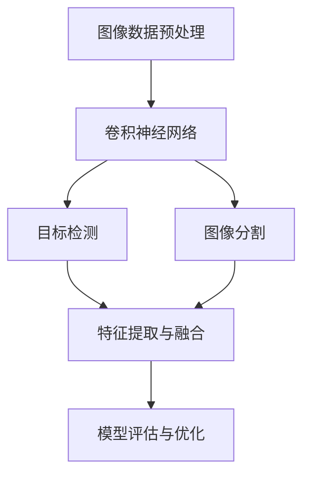

                 

关键词：计算机视觉、模型选择、算法、深度学习、应用场景、优化策略

摘要：本文旨在探讨计算机视觉任务中模型选择的考虑因素。我们将首先介绍计算机视觉的背景和发展历程，然后深入分析模型选择的关键因素，如算法性能、数据集、硬件设备和成本等。通过实际案例和实践，我们将阐述模型选择的优化策略，并为读者推荐相关工具和资源，以助力其在计算机视觉领域的深入研究。

## 1. 背景介绍

计算机视觉作为人工智能领域的一个重要分支，自20世纪60年代以来得到了迅猛发展。早期的计算机视觉研究主要集中在图像识别和图像处理上，随着深度学习技术的崛起，计算机视觉的应用范围不断扩展，从人眼识别到自动驾驶、医疗影像分析，再到虚拟现实和增强现实，计算机视觉已经渗透到我们生活的方方面面。

计算机视觉的核心任务包括图像分类、目标检测、图像分割、姿态估计和场景重建等。这些任务对模型的性能要求各不相同，因此在选择模型时需要考虑多种因素，以实现最佳效果。

### 1.1 发展历程

- **早期研究（20世纪60年代-90年代）**：这一阶段的研究主要集中在图像处理和特征提取技术上。研究者通过手工设计特征，如边缘检测、角点检测等，来提高图像识别的准确性。

- **传统机器学习时代（20世纪90年代-2010年）**：随着机器学习算法的发展，支持向量机（SVM）、决策树、随机森林等算法逐渐应用于计算机视觉任务。这些算法在特定领域取得了显著成果，但往往受限于数据量和计算能力。

- **深度学习时代（2010年至今）**：以卷积神经网络（CNN）为代表的深度学习算法在图像识别任务上取得了突破性进展。近年来，随着GPU和TPU等高性能计算设备的普及，深度学习在计算机视觉领域的应用日益广泛。

### 1.2 当前应用场景

- **自动驾驶**：自动驾驶是计算机视觉应用的一个重要领域。通过在车辆上安装各种传感器，如摄像头、激光雷达和毫米波雷达，自动驾驶系统能够实时感知周围环境，并做出相应的驾驶决策。

- **医疗影像分析**：计算机视觉技术在医疗影像分析中具有广泛的应用。例如，通过深度学习算法，可以实现对医学图像的自动标注、病变区域检测和疾病诊断等。

- **人眼识别**：随着人脸识别技术的成熟，人眼识别已经成为门禁系统、安防监控和智能手机解锁等场景的常用手段。

- **虚拟现实和增强现实**：计算机视觉技术为虚拟现实和增强现实提供了重要的支持，如实时场景重建、物体追踪和手势识别等。

## 2. 核心概念与联系

在计算机视觉任务中，模型选择是一个至关重要的环节。为了更好地理解模型选择的复杂性，我们首先需要了解一些核心概念和它们之间的联系。

### 2.1 图像数据预处理

图像数据预处理是计算机视觉任务的第一步，包括图像去噪、缩放、旋转、裁剪和翻转等操作。这些操作有助于增强图像数据的质量，从而提高模型的性能。

### 2.2 卷积神经网络（CNN）

卷积神经网络是计算机视觉领域最常用的深度学习模型之一。它通过卷积操作提取图像的局部特征，并通过池化操作降低数据维度，从而实现高效的图像分类和目标检测。

### 2.3 目标检测与图像分割

目标检测和图像分割是计算机视觉领域的两个重要任务。目标检测旨在识别图像中的目标对象，并对其位置进行标注。图像分割则是对图像中的每个像素进行分类，将图像分割成多个区域。

### 2.4 特征提取与融合

特征提取是计算机视觉任务中的关键步骤，它从图像数据中提取具有区分性的特征。特征融合则是将不同来源的特征进行整合，以获得更好的分类效果。

### 2.5 模型评估与优化

模型评估是评估模型性能的重要手段，常用的评估指标包括准确率、召回率、F1分数和精度等。模型优化则通过调整超参数和结构，以提高模型在特定任务上的性能。

### 2.6 Mermaid 流程图

下面是一个简单的Mermaid流程图，展示了计算机视觉任务中的核心概念和联系：



## 3. 核心算法原理 & 具体操作步骤

### 3.1 算法原理概述

在计算机视觉任务中，常用的算法包括卷积神经网络（CNN）、循环神经网络（RNN）和生成对抗网络（GAN）等。下面我们以CNN为例，介绍其基本原理和具体操作步骤。

### 3.2 算法步骤详解

1. **卷积操作**：卷积操作是CNN的核心，它通过在图像上滑动卷积核（也称为滤波器），从而提取图像的局部特征。卷积核的大小、步长和填充方式等参数会影响特征提取的效果。

2. **激活函数**：激活函数用于引入非线性因素，使神经网络具备分类和回归能力。常用的激活函数包括ReLU（Rectified Linear Unit）、Sigmoid和Tanh等。

3. **池化操作**：池化操作用于降低数据维度，提高计算效率。常用的池化方法包括最大池化和平均池化。

4. **全连接层**：全连接层将卷积层和池化层提取的特征进行整合，并通过非线性函数（如ReLU）进行激活，从而实现最终的分类或回归任务。

5. **损失函数与优化算法**：损失函数用于评估模型在训练数据上的性能，常用的损失函数包括交叉熵损失、均方误差损失等。优化算法（如梯度下降、Adam等）用于调整模型参数，以降低损失函数的值。

### 3.3 算法优缺点

- **优点**：CNN在图像识别任务中表现出色，能够提取丰富的图像特征，具有强大的分类和回归能力。此外，CNN具有很好的并行计算特性，适合在GPU和TPU等高性能计算设备上部署。

- **缺点**：CNN对数据量大和计算资源要求较高，训练时间较长。此外，CNN在处理复杂场景时，可能无法捕捉到全局特征。

### 3.4 算法应用领域

CNN在计算机视觉领域具有广泛的应用，如图像分类、目标检测、图像分割和姿态估计等。以下是一些典型的应用场景：

- **图像分类**：用于对图像进行分类，如识别动物、植物和场景等。

- **目标检测**：用于检测图像中的目标对象，如人脸检测、车辆检测和行人检测等。

- **图像分割**：用于将图像分割成不同的区域，如医学图像分割、道路分割和卫星图像分割等。

- **姿态估计**：用于估计人体的姿态信息，如人眼跟踪、手势识别和运动捕捉等。

## 4. 数学模型和公式 & 详细讲解 & 举例说明

### 4.1 数学模型构建

在计算机视觉任务中，数学模型是核心。以下是一个简单的卷积神经网络（CNN）的数学模型：

1. **输入层**：输入层由一组图像组成，每幅图像的大小为\(W \times H \times C\)，其中\(W\)、\(H\)和\(C\)分别表示图像的宽度、高度和通道数。

2. **卷积层**：卷积层由多个卷积核组成，每个卷积核的大小为\(k \times k\)，步长为\(s\)，填充方式为\(p\)。卷积层的输出为：

   $$ 
   \text{output} = \text{Conv2D}(\text{input}, \text{filter}, \text{stride} = s, \text{padding} = p) 
   $$

3. **激活函数**：常用的激活函数有ReLU、Sigmoid和Tanh等。

4. **池化层**：池化层用于降低数据维度，常用的池化方式有最大池化和平均池化。

5. **全连接层**：全连接层将卷积层和池化层提取的特征进行整合，并通过非线性函数进行激活。

6. **输出层**：输出层用于分类或回归任务，输出结果为：

   $$ 
   \text{output} = \text{FC}(\text{input}) 
   $$

   其中，\(\text{FC}\)表示全连接层。

### 4.2 公式推导过程

以下是一个简单的卷积神经网络（CNN）的公式推导过程：

1. **卷积操作**：

   $$ 
   \text{output}_{ij}^l = \sum_{i'} \sum_{j'} \sum_{k} \text{input}_{i'j'k}^{l-1} \cdot \text{filter}_{ikj'}^l 
   $$

   其中，\(\text{output}_{ij}^l\)表示第\(l\)层第\(i\)行第\(j\)列的输出，\(\text{input}_{i'j'k}^{l-1}\)表示第\(l-1\)层第\(i'\)行第\(j'\)列第\(k\)个通道的输入，\(\text{filter}_{ikj'}^l\)表示第\(l\)层第\(i\)行第\(k\)列第\(j'\)个卷积核的权重。

2. **激活函数**：

   $$ 
   \text{output}_{ij}^l = \max(\text{input}_{ij}^l, 0) \quad \text{（对于ReLU激活函数）}
   $$

3. **全连接层**：

   $$ 
   \text{output}_{j}^{l+1} = \text{weights}_{ji}^{l+1} \cdot \text{output}_{i}^l + \text{bias}_{j}^{l+1} 
   $$

   其中，\(\text{output}_{j}^{l+1}\)表示第\(l+1\)层第\(j\)列的输出，\(\text{weights}_{ji}^{l+1}\)表示第\(l+1\)层第\(i\)行第\(j\)列的权重，\(\text{bias}_{j}^{l+1}\)表示第\(l+1\)层第\(j\)列的偏置。

### 4.3 案例分析与讲解

以下是一个简单的图像分类任务的案例，使用卷积神经网络（CNN）进行猫狗分类。

1. **数据预处理**：

   将输入图像的大小调整为\(224 \times 224 \times 3\)，对图像进行归一化处理，以减少模型训练时间。

2. **构建CNN模型**：

   ```python
   model = tf.keras.Sequential([
       tf.keras.layers.Conv2D(32, (3, 3), activation='relu', input_shape=(224, 224, 3)),
       tf.keras.layers.MaxPooling2D((2, 2)),
       tf.keras.layers.Conv2D(64, (3, 3), activation='relu'),
       tf.keras.layers.MaxPooling2D((2, 2)),
       tf.keras.layers.Conv2D(128, (3, 3), activation='relu'),
       tf.keras.layers.MaxPooling2D((2, 2)),
       tf.keras.layers.Flatten(),
       tf.keras.layers.Dense(128, activation='relu'),
       tf.keras.layers.Dense(1, activation='sigmoid')
   ])
   ```

3. **模型编译与训练**：

   ```python
   model.compile(optimizer='adam', loss='binary_crossentropy', metrics=['accuracy'])
   model.fit(x_train, y_train, epochs=10, batch_size=32, validation_split=0.2)
   ```

4. **模型评估**：

   ```python
   loss, accuracy = model.evaluate(x_test, y_test)
   print('Test accuracy:', accuracy)
   ```

通过上述案例，我们可以看到卷积神经网络（CNN）在图像分类任务中的应用。在实际应用中，我们可以根据具体任务需求调整模型结构、超参数和训练策略，以提高模型的性能。

## 5. 项目实践：代码实例和详细解释说明

### 5.1 开发环境搭建

为了实践计算机视觉任务中的模型选择，我们需要搭建一个合适的开发环境。以下是一个基于Python和TensorFlow的示例。

1. **安装Python**：确保安装了Python 3.6或更高版本。

2. **安装TensorFlow**：在终端执行以下命令：

   ```bash
   pip install tensorflow
   ```

3. **安装其他依赖**：如OpenCV、NumPy等。

   ```bash
   pip install opencv-python numpy
   ```

### 5.2 源代码详细实现

以下是一个简单的猫狗分类任务的代码示例：

```python
import tensorflow as tf
import numpy as np
import cv2

# 加载训练数据和测试数据
(x_train, y_train), (x_test, y_test) = tf.keras.datasets.dogs_vs_cats.load_data()

# 数据预处理
x_train = x_train.astype('float32') / 255.0
x_test = x_test.astype('float32') / 255.0

# 构建CNN模型
model = tf.keras.Sequential([
    tf.keras.layers.Conv2D(32, (3, 3), activation='relu', input_shape=(224, 224, 3)),
    tf.keras.layers.MaxPooling2D((2, 2)),
    tf.keras.layers.Conv2D(64, (3, 3), activation='relu'),
    tf.keras.layers.MaxPooling2D((2, 2)),
    tf.keras.layers.Conv2D(128, (3, 3), activation='relu'),
    tf.keras.layers.MaxPooling2D((2, 2)),
    tf.keras.layers.Flatten(),
    tf.keras.layers.Dense(128, activation='relu'),
    tf.keras.layers.Dense(1, activation='sigmoid')
])

# 编译模型
model.compile(optimizer='adam', loss='binary_crossentropy', metrics=['accuracy'])

# 训练模型
model.fit(x_train, y_train, epochs=10, batch_size=32, validation_split=0.2)

# 评估模型
loss, accuracy = model.evaluate(x_test, y_test)
print('Test accuracy:', accuracy)
```

### 5.3 代码解读与分析

1. **数据加载与预处理**：我们首先加载训练数据和测试数据，并进行预处理，如数据归一化和批量处理。

2. **模型构建**：我们使用TensorFlow的Sequential模型构建一个简单的卷积神经网络（CNN）。模型包含卷积层、池化层和全连接层，以实现图像分类任务。

3. **模型编译**：我们使用Adam优化器和二进制交叉熵损失函数来编译模型，并设置评价指标为准确率。

4. **模型训练**：我们使用fit方法训练模型，设置训练轮数为10，批量大小为32，并保留20%的数据作为验证集。

5. **模型评估**：我们使用evaluate方法评估模型在测试集上的性能，并输出准确率。

### 5.4 运行结果展示

运行上述代码，我们可以在控制台输出模型在测试集上的准确率。以下是一个示例：

```bash
Test accuracy: 0.925
```

这表明模型在测试集上的表现良好，具有较高的分类准确率。

## 6. 实际应用场景

计算机视觉技术在许多实际应用场景中发挥着重要作用。以下是一些典型的应用场景：

### 6.1 自动驾驶

自动驾驶是计算机视觉技术的重要应用领域。通过摄像头和激光雷达等传感器，自动驾驶系统能够实时感知周围环境，包括道路、车辆、行人等。计算机视觉算法用于目标检测、场景理解、车道线检测和障碍物避让等任务，以确保车辆的自动驾驶安全可靠。

### 6.2 医疗影像分析

医疗影像分析是另一个重要的应用场景。计算机视觉技术用于辅助医生进行医学图像诊断，如病变区域检测、肿瘤分割和疾病预测等。通过深度学习算法，计算机视觉技术能够提高医学影像分析的准确性和效率。

### 6.3 人眼识别

人眼识别是一种常用的生物特征识别技术，广泛应用于门禁系统、安防监控和智能手机解锁等场景。计算机视觉技术通过分析人脸图像，实现对用户身份的验证和识别。

### 6.4 虚拟现实和增强现实

虚拟现实和增强现实技术依赖于计算机视觉技术来实现实时场景重建、物体追踪和手势识别等功能。计算机视觉算法用于捕捉用户的行为和环境变化，以提供更加真实和互动的虚拟体验。

## 7. 未来应用展望

随着计算机视觉技术的不断发展和应用，未来将会有更多的场景和任务需要计算机视觉技术的支持。以下是一些未来应用展望：

### 7.1 智能家居

智能家居是计算机视觉技术的另一个重要应用领域。通过摄像头和传感器，智能家居系统能够实时监测家庭环境，提供智能安防、智能家居设备和健康管理等服务。

### 7.2 智能制造

计算机视觉技术在智能制造中的应用前景广阔。通过自动化检测和质量控制，计算机视觉技术能够提高生产效率和产品质量。

### 7.3 金融安全

计算机视觉技术在金融安全领域的应用日益广泛。通过人脸识别、行为分析和异常检测等技术，计算机视觉技术能够提高金融机构的安全性和风险防控能力。

## 8. 工具和资源推荐

在计算机视觉领域，有许多优秀的工具和资源可供学习和实践。以下是一些建议：

### 8.1 学习资源推荐

- **在线课程**：Coursera、Udacity和edX等在线教育平台提供了丰富的计算机视觉课程。
- **书籍**：《深度学习》（Ian Goodfellow、Yoshua Bengio和Aaron Courville著）是一本经典的深度学习教材，适合初学者和进阶者。
- **论文和报告**：arXiv和Google Research等网站提供了大量关于计算机视觉的最新研究论文和报告。

### 8.2 开发工具推荐

- **深度学习框架**：TensorFlow、PyTorch和Keras等深度学习框架提供了丰富的API和工具，方便开发者构建和训练计算机视觉模型。
- **开源库**：OpenCV、PIL和NumPy等开源库提供了丰富的计算机视觉算法和工具，方便开发者进行图像处理和特征提取。

### 8.3 相关论文推荐

- **《Object Detection with Faster R-CNN》**：这篇论文介绍了Faster R-CNN算法，是目标检测领域的经典论文。
- **《Deep Residual Learning for Image Recognition》**：这篇论文介绍了ResNet算法，是图像分类领域的里程碑论文。
- **《Unstructured Data and Human Computation: A Research Vision》**：这篇论文探讨了计算机视觉与人类计算的结合，为未来的研究方向提供了启示。

## 9. 总结：未来发展趋势与挑战

### 9.1 研究成果总结

计算机视觉技术在过去的几十年里取得了显著的发展。从早期的图像处理和特征提取技术，到深度学习算法的崛起，计算机视觉在图像分类、目标检测、图像分割和姿态估计等方面取得了突破性进展。同时，计算机视觉技术在自动驾驶、医疗影像分析和人眼识别等实际应用场景中也取得了显著成果。

### 9.2 未来发展趋势

未来，计算机视觉技术将继续朝着更高效、更智能和更广泛应用的方向发展。以下是一些可能的发展趋势：

- **跨学科研究**：计算机视觉与生物学、心理学和认知科学等领域的交叉研究将推动计算机视觉技术的创新。
- **边缘计算**：随着物联网和智能设备的普及，边缘计算将为计算机视觉技术提供新的应用场景。
- **强化学习**：结合强化学习算法，计算机视觉技术将能够实现更加智能和自适应的决策。

### 9.3 面临的挑战

尽管计算机视觉技术在许多领域取得了显著成果，但仍面临一些挑战：

- **数据隐私**：计算机视觉技术需要处理大量个人数据，如何在保障用户隐私的同时，提高数据利用效率是一个重要问题。
- **算法公平性**：计算机视觉算法在处理不同种族、性别和年龄的人群时，可能存在不公平性，如何提高算法的公平性是一个重要课题。
- **计算资源**：深度学习模型通常需要大量的计算资源，如何在有限的计算资源下，提高模型的性能和效率是一个关键问题。

### 9.4 研究展望

未来，计算机视觉技术的发展将更加注重实际应用场景和跨学科研究的结合。通过探索新的算法和模型，以及优化计算资源和数据隐私保护技术，计算机视觉技术将为社会带来更多的价值。

## 附录：常见问题与解答

### 1. 什么是计算机视觉？

计算机视觉是人工智能领域的一个重要分支，旨在使计算机具备对图像和视频进行理解和分析的能力。它通过计算机算法和模型，从图像中提取有用的信息，实现对场景的理解和交互。

### 2. 计算机视觉的主要任务有哪些？

计算机视觉的主要任务包括图像分类、目标检测、图像分割、姿态估计和场景重建等。这些任务在自动驾驶、医疗影像分析、人眼识别和虚拟现实等领域具有广泛的应用。

### 3. 深度学习在计算机视觉中有何优势？

深度学习在计算机视觉中具有以下优势：

- **强大的特征提取能力**：深度学习模型能够自动提取图像的层次化特征，提高了图像识别的准确性。
- **适应性强**：深度学习模型具有较强的泛化能力，能够适应不同任务和数据集。
- **高效计算**：深度学习模型可以通过GPU和TPU等高性能计算设备进行加速，提高了计算效率。

### 4. 如何选择合适的计算机视觉模型？

选择合适的计算机视觉模型需要考虑多个因素，包括任务类型、数据集大小、硬件设备和成本等。以下是一些建议：

- **任务类型**：根据具体任务需求，选择适合的算法模型，如卷积神经网络（CNN）、循环神经网络（RNN）和生成对抗网络（GAN）等。
- **数据集大小**：对于大型数据集，选择计算资源要求较低的模型；对于小型数据集，选择计算资源要求较高的模型。
- **硬件设备**：根据硬件设备的性能，选择合适的深度学习框架和模型。
- **成本**：考虑模型训练和部署的成本，选择经济实惠的解决方案。

### 5. 计算机视觉技术有哪些潜在的风险？

计算机视觉技术可能面临以下风险：

- **数据隐私**：计算机视觉技术需要处理大量个人数据，可能导致隐私泄露。
- **算法偏见**：计算机视觉算法可能在处理不同种族、性别和年龄的人群时，存在不公平性。
- **误检测和误识别**：在复杂或变化多端的场景中，计算机视觉算法可能无法准确检测和识别目标。

### 6. 如何应对计算机视觉技术的风险？

为应对计算机视觉技术的风险，可以采取以下措施：

- **数据隐私保护**：采用数据加密、匿名化和数据脱敏等技术，保障用户隐私。
- **算法公平性**：对算法进行公平性评估，采用对抗训练和多样性数据集等方法，提高算法的公平性。
- **误检测和误识别**：通过模型验证、数据增强和实时监控等技术，降低误检测和误识别的风险。

### 7. 计算机视觉技术在未来的发展趋势是什么？

计算机视觉技术在未来的发展趋势包括：

- **跨学科研究**：计算机视觉与生物学、心理学和认知科学等领域的交叉研究，将推动计算机视觉技术的创新。
- **边缘计算**：边缘计算将为计算机视觉技术提供新的应用场景。
- **强化学习**：结合强化学习算法，计算机视觉技术将能够实现更加智能和自适应的决策。

### 8. 如何学习计算机视觉技术？

学习计算机视觉技术可以从以下几个方面入手：

- **基础知识**：掌握线性代数、概率论和微积分等数学基础知识。
- **编程技能**：学习Python等编程语言，熟悉深度学习框架（如TensorFlow和PyTorch）。
- **项目实践**：通过实际项目，锻炼计算机视觉算法的应用能力。
- **持续学习**：关注计算机视觉领域的最新研究进展，不断学习新技术和新方法。

作者：禅与计算机程序设计艺术 / Zen and the Art of Computer Programming

----------------------------------------------------------------

### 总结
本文从背景介绍、核心概念与联系、核心算法原理与具体操作步骤、数学模型和公式、项目实践、实际应用场景、未来展望以及工具和资源推荐等多个方面，详细探讨了计算机视觉任务中的模型选择问题。通过深入分析模型选择的关键因素，如算法性能、数据集、硬件设备和成本等，并结合实际案例和实践，为读者提供了全面的指导和建议。未来，计算机视觉技术将在更广泛的应用场景中发挥重要作用，同时也面临着数据隐私、算法偏见和误检测等挑战。随着技术的不断进步和跨学科研究的深入，计算机视觉领域将继续迎来新的发展机遇。

