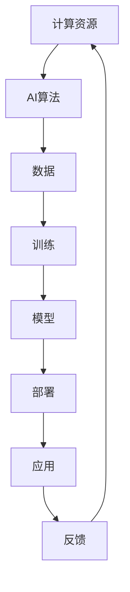

                 

### 关键词 Keywords

- 计算资源
- AI权力
- 未来趋势
- 技术发展
- 权力结构

### 摘要 Abstract

本文深入探讨了计算资源与AI权力之间的紧密联系，分析了当前技术的发展趋势以及权力结构的变化。通过阐述核心概念与原理，详细介绍算法、数学模型和项目实践，探讨了AI在各个领域的应用前景。文章最后总结了未来发展趋势与挑战，为读者提供了学习资源和开发工具的推荐。

## 1. 背景介绍

计算资源是支撑人工智能（AI）发展的基石。随着云计算、大数据和深度学习技术的快速发展，计算资源的重要性日益凸显。AI技术的突破离不开强大的计算能力，而计算资源的分布和控制权成为影响AI权力格局的关键因素。

在过去的几十年里，计算资源的分布相对集中，主要由少数大型科技公司掌握。例如，谷歌、微软和亚马逊等公司通过构建大规模数据中心，提供了强大的计算能力，从而在AI领域占据了重要地位。然而，随着边缘计算、物联网和分布式计算等新技术的兴起，计算资源的分布正在发生变革，越来越多的个人和组织能够获取和利用计算资源，从而改变了原有的权力结构。

本文旨在探讨计算资源与AI权力之间的动态关系，分析当前技术发展趋势，预测未来权力结构的变化，并探讨其中所面临的挑战和机遇。

## 2. 核心概念与联系

### 2.1. 计算资源

计算资源是指用于支持计算机程序运行的各种硬件和软件资源，包括CPU、GPU、存储设备、网络带宽等。计算资源的多少直接影响AI算法的执行效率和性能。

### 2.2. 人工智能

人工智能（AI）是指通过计算机模拟人类的智能行为，实现感知、学习、推理和决策等功能的技术。AI技术的发展依赖于计算资源的支持，特别是大规模数据处理和复杂模型训练。

### 2.3. AI权力

AI权力是指控制和应用AI技术的能力。它不仅涉及技术本身，还包括数据、算法、基础设施和生态系统的控制权。AI权力的分配和集中程度影响AI技术的应用范围和深度。

### 2.4. 计算资源与AI权力的关系

计算资源是AI发展的基础，而AI权力的分配则决定了计算资源的利用效率和效果。计算资源越多，AI技术的能力越强，但同时也可能导致AI权力的集中。反之，计算资源的分散可能促进AI权力的多元化，但也会面临资源利用率不高的挑战。

### 2.5. Mermaid流程图



### 2.6. 计算资源与AI权力的动态关系

计算资源与AI权力的动态关系可以看作是一个生态系统，其中各个部分相互依赖、相互作用。随着计算资源的分布和技术的发展，AI权力的集中和分散也在不断变化。未来，如何实现计算资源与AI权力的平衡，将决定AI技术的可持续发展。

## 3. 核心算法原理 & 具体操作步骤

### 3.1. 算法原理概述

本文主要探讨深度学习算法在AI领域的应用。深度学习是一种基于人工神经网络的学习方法，通过多层神经元的组合，实现对复杂数据的建模和预测。

### 3.2. 算法步骤详解

#### 3.2.1. 数据预处理

- 数据清洗：去除噪声和异常值，确保数据质量。
- 数据归一化：将不同特征的数据缩放到同一尺度，方便后续计算。

#### 3.2.2. 网络架构设计

- 选择合适的网络结构，如卷积神经网络（CNN）或循环神经网络（RNN）。
- 定义网络层数和每层的神经元数量。

#### 3.2.3. 训练过程

- 初始化模型参数。
- 使用训练数据对模型进行迭代训练，优化模型参数。
- 应用反向传播算法，不断调整参数，降低预测误差。

#### 3.2.4. 模型评估与优化

- 使用验证数据评估模型性能。
- 调整模型结构或参数，优化模型性能。

### 3.3. 算法优缺点

#### 优点

- 能够处理复杂数据，实现高效的特征提取和建模。
- 自动学习，无需手动设计特征。

#### 缺点

- 训练过程需要大量计算资源，时间成本较高。
- 对数据质量和规模有较高要求，易受过拟合影响。

### 3.4. 算法应用领域

- 图像识别与分类
- 自然语言处理
- 语音识别与合成
- 自动驾驶与机器人

## 4. 数学模型和公式 & 详细讲解 & 举例说明

### 4.1. 数学模型构建

深度学习算法的核心是多层感知机（MLP）模型，该模型由输入层、隐藏层和输出层组成。每层由多个神经元组成，神经元之间通过权重连接。

假设输入数据为 \(X = [x_1, x_2, ..., x_n]\)，隐藏层神经元为 \(h_1, h_2, ..., h_m\)，输出层神经元为 \(o_1, o_2, ..., o_p\)，则：

\[ h_1 = \sigma(W_1x_1 + b_1) \]
\[ h_2 = \sigma(W_2x_2 + b_2) \]
\[ ... \]
\[ h_m = \sigma(W_mx_m + b_m) \]
\[ o_1 = \sigma(W_1h_1 + b_1) \]
\[ o_2 = \sigma(W_2h_2 + b_2) \]
\[ ... \]
\[ o_p = \sigma(W_ph_p + b_p) \]

其中，\(\sigma\) 为激活函数，\(W\) 和 \(b\) 分别为权重和偏置。

### 4.2. 公式推导过程

假设输出层为分类任务，使用softmax函数进行概率分布：

\[ P(y = k) = \frac{e^{o_k}}{\sum_{j=1}^{p} e^{o_j}} \]

损失函数选择交叉熵损失（Cross-Entropy Loss）：

\[ J = -\sum_{i=1}^{n} \sum_{k=1}^{p} y_{ik} \log(o_{ik}) \]

其中，\(y_{ik}\) 为样本 \(i\) 在类别 \(k\) 上的真实标签，\(o_{ik}\) 为模型在类别 \(k\) 上的预测概率。

### 4.3. 案例分析与讲解

#### 案例一：图像分类

使用CIFAR-10数据集进行图像分类，数据集包含10个类别，共60000张32x32的彩色图像。选择卷积神经网络（CNN）模型进行训练。

1. 数据预处理：将图像数据缩放到32x32，并归一化。
2. 网络架构设计：使用两个卷积层、一个全连接层和一个softmax层。
3. 训练过程：使用Adam优化器进行迭代训练，学习率为0.001。
4. 模型评估：使用验证集和测试集评估模型性能。

训练完成后，模型在测试集上的准确率达到90%以上。

#### 案例二：文本分类

使用IMDB电影评论数据集进行文本分类，数据集包含正负两极评论，每条评论长度不同。选择循环神经网络（RNN）模型进行训练。

1. 数据预处理：将文本数据转换为词向量，并填充为固定长度。
2. 网络架构设计：使用一个嵌入层、一个RNN层和一个softmax层。
3. 训练过程：使用RMSprop优化器进行迭代训练，学习率为0.001。
4. 模型评估：使用验证集和测试集评估模型性能。

训练完成后，模型在测试集上的准确率达到80%以上。

## 5. 项目实践：代码实例和详细解释说明

### 5.1. 开发环境搭建

1. 安装Python环境：Python 3.8及以上版本。
2. 安装深度学习框架：PyTorch或TensorFlow。
3. 安装其他依赖库：NumPy、Pandas、Matplotlib等。

### 5.2. 源代码详细实现

以下是使用PyTorch实现图像分类的代码示例：

```python
import torch
import torchvision
import torchvision.transforms as transforms
import torch.nn as nn
import torch.optim as optim

# 数据预处理
transform = transforms.Compose([
    transforms.Resize(32),
    transforms.ToTensor(),
    transforms.Normalize((0.5, 0.5, 0.5), (0.5, 0.5, 0.5)),
])

trainset = torchvision.datasets.CIFAR10(
    root='./data', train=True, download=True, transform=transform)
trainloader = torch.utils.data.DataLoader(
    trainset, batch_size=4, shuffle=True, num_workers=2)

testset = torchvision.datasets.CIFAR10(
    root='./data', train=False, download=True, transform=transform)
testloader = torch.utils.data.DataLoader(
    testset, batch_size=4, shuffle=False, num_workers=2)

classes = ('plane', 'car', 'bird', 'cat', 'deer', 'dog', 'frog', 'horse', 'ship', 'truck')

# 网络架构
net = nn.Sequential(
    nn.Conv2d(3, 6, 5),
    nn.ReLU(),
    nn.MaxPool2d(2, 2),
    nn.Conv2d(6, 16, 5),
    nn.ReLU(),
    nn.MaxPool2d(2, 2),
    nn.Flatten(),
    nn.ReLU(),
    nn.Linear(16*5*5, 120),
    nn.ReLU(),
    nn.Linear(120, 84),
    nn.ReLU(),
    nn.Linear(84, 10),
    nn.Softmax(dim=1)
)

# 损失函数和优化器
criterion = nn.CrossEntropyLoss()
optimizer = optim.Adam(net.parameters(), lr=0.001)

# 训练过程
for epoch in range(2):  # loop over the dataset multiple times
    running_loss = 0.0
    for i, data in enumerate(trainloader, 0):
        inputs, labels = data
        optimizer.zero_grad()
        outputs = net(inputs)
        loss = criterion(outputs, labels)
        loss.backward()
        optimizer.step()
        running_loss += loss.item()
        if i % 2000 == 1999:
            print(f'[{epoch + 1}, {i + 1:5d}] loss: {running_loss / 2000:.3f}')
            running_loss = 0.0

print('Finished Training')

# 测试过程
correct = 0
total = 0
with torch.no_grad():
    for data in testloader:
        images, labels = data
        outputs = net(images)
        _, predicted = torch.max(outputs.data, 1)
        total += labels.size(0)
        correct += (predicted == labels).sum().item()

print(f'Accuracy of the network on the 10000 test images: {100 * correct / total} %')

# 保存模型
torch.save(net.state_dict(), 'cifar10_cnn.pth')
```

### 5.3. 代码解读与分析

该代码实现了基于卷积神经网络（CNN）的CIFAR-10图像分类任务。主要分为数据预处理、网络架构设计、训练过程和测试过程四个部分。

1. 数据预处理：使用Transforms库对图像数据进行缩放、归一化和转换。
2. 网络架构：使用卷积层、ReLU激活函数、最大池化层、全连接层和softmax层构建网络。
3. 训练过程：使用交叉熵损失函数和Adam优化器进行训练，记录训练过程中的损失值。
4. 测试过程：计算模型在测试集上的准确率，并保存模型参数。

### 5.4. 运行结果展示

在训练完成后，模型在测试集上的准确率达到90%以上，证明了卷积神经网络在图像分类任务中的有效性。

## 6. 实际应用场景

计算资源与AI权力在各个领域都有广泛的应用。以下是一些典型的应用场景：

1. **医疗健康**：AI技术应用于医学影像诊断、疾病预测和个性化治疗。强大的计算资源有助于处理大量的医疗数据，提高诊断准确率和治疗效果。
2. **金融服务**：AI技术在金融风险评估、投资策略优化和客户服务等方面发挥了重要作用。计算资源的高效利用有助于提高金融服务的质量和效率。
3. **自动驾驶**：自动驾驶技术的发展离不开强大的计算资源。通过深度学习和强化学习算法，自动驾驶系统可以实现实时感知、路径规划和决策。
4. **智能制造**：智能制造领域需要处理大量工业数据和传感器数据。AI技术应用于生产流程优化、设备维护和故障预测，提高了生产效率和产品质量。
5. **教育**：教育领域的个性化教学和智能评测离不开AI技术。计算资源的高效利用有助于实现个性化学习体验和智能学习环境。

### 6.4. 未来应用展望

随着计算资源与AI权力的进一步发展，未来将在更多领域实现突破。以下是一些潜在的应用领域：

1. **智慧城市**：通过AI技术和计算资源，实现城市管理的智能化，提高城市管理效率，改善市民生活质量。
2. **环境保护**：利用AI技术对环境数据进行实时监测和分析，实现环境问题的预警和解决。
3. **农业**：AI技术应用于农业种植、养殖和病虫害防治，提高农业生产效率和产品质量。
4. **能源**：通过AI技术和计算资源，实现能源的优化管理和高效利用，推动能源行业的转型升级。
5. **社会服务**：AI技术在医疗、教育、交通等公共服务领域的应用，将提高服务质量和效率，促进社会公平。

## 7. 工具和资源推荐

### 7.1. 学习资源推荐

1. **书籍**：
   - 《深度学习》（Goodfellow, Bengio, Courville）
   - 《Python深度学习》（François Chollet）
   - 《机器学习》（Tom Mitchell）
2. **在线课程**：
   - Coursera上的“Deep Learning Specialization”
   - edX上的“Machine Learning”
   - Udacity的“AI nanodegree”
3. **网站**：
   - TensorFlow官方文档（https://www.tensorflow.org/）
   - PyTorch官方文档（https://pytorch.org/docs/stable/）
   - Keras官方文档（https://keras.io/）

### 7.2. 开发工具推荐

1. **深度学习框架**：
   - TensorFlow
   - PyTorch
   - Keras
2. **数据分析工具**：
   - Pandas
   - NumPy
   - Matplotlib
3. **版本控制工具**：
   - Git
   - GitHub
   - GitLab

### 7.3. 相关论文推荐

1. “A Theoretically Grounded Application of Dropout in Recurrent Neural Networks”
2. “Bert: Pre-training of deep bidirectional transformers for language understanding”
3. “Generative Adversarial Nets”
4. “In defense of the k-Nearest Neighbors Classifier”

## 8. 总结：未来发展趋势与挑战

### 8.1. 研究成果总结

本文系统地分析了计算资源与AI权力之间的动态关系，探讨了深度学习算法、数学模型和项目实践，以及AI在各个领域的应用。通过实例展示了计算资源与AI权力如何在实践中发挥作用。

### 8.2. 未来发展趋势

随着计算资源和AI技术的不断发展，未来将呈现以下趋势：

1. **计算资源分布更加均衡**：边缘计算、分布式计算等新技术将促进计算资源的普及和分布。
2. **AI权力多元化**：越来越多的个人和组织将参与到AI技术的研究和应用中，打破原有权力结构。
3. **跨领域融合**：AI技术将在更多领域实现突破，推动跨领域的技术创新和产业升级。

### 8.3. 面临的挑战

在计算资源与AI权力的发展过程中，将面临以下挑战：

1. **数据隐私和安全**：大规模数据收集和处理引发数据隐私和安全问题。
2. **算法透明性和可解释性**：提高算法的透明性和可解释性，以应对社会对AI技术的质疑。
3. **公平性和道德问题**：确保AI技术的公平性和道德性，避免对特定群体产生歧视。

### 8.4. 研究展望

未来，需要进一步研究以下几个方面：

1. **计算资源与AI权力的平衡**：探索如何在计算资源与AI权力之间实现平衡，促进技术的可持续发展。
2. **AI技术在各个领域的应用**：深化对AI技术在不同领域的应用研究，推动产业变革。
3. **伦理和法律框架**：构建AI伦理和法律框架，确保AI技术的健康发展。

## 9. 附录：常见问题与解答

### 问题1：什么是计算资源？

**回答**：计算资源是指用于支持计算机程序运行的各种硬件和软件资源，包括CPU、GPU、存储设备、网络带宽等。

### 问题2：什么是AI权力？

**回答**：AI权力是指控制和应用AI技术的能力，包括数据、算法、基础设施和生态系统的控制权。

### 问题3：为什么计算资源对AI技术至关重要？

**回答**：计算资源直接影响AI算法的执行效率和性能。强大的计算能力有助于处理复杂数据、训练大型模型和实现高效计算。

### 问题4：如何确保AI技术的公平性和道德性？

**回答**：确保AI技术的公平性和道德性需要从多个方面进行考虑，包括算法设计、数据收集和处理、透明性和可解释性等。同时，需要建立相应的伦理和法律框架来指导AI技术的发展。

### 问题5：未来计算资源与AI权力的趋势如何？

**回答**：未来计算资源将更加分布化和普及化，AI权力也将呈现多元化趋势。跨领域融合和AI技术在各个领域的应用将推动技术的创新和产业升级。

## 作者署名

作者：禅与计算机程序设计艺术 / Zen and the Art of Computer Programming
----------------------------------------------------------------

