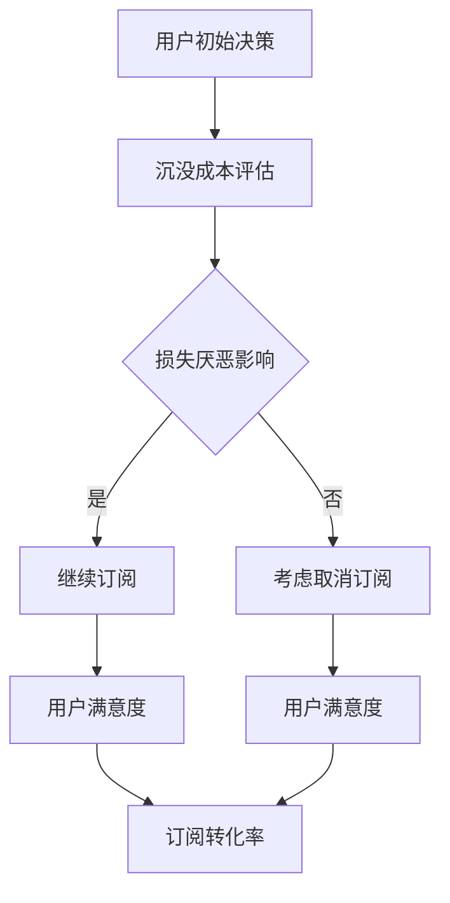

                 

关键词：订阅制、定价策略、用户心理、损失厌恶、沉没成本、心理账户。

摘要：本文深入探讨了订阅制定价模式下的用户心理分析，重点分析了损失厌恶和沉没成本对用户决策的影响。通过理论分析和实际案例，揭示了如何在订阅制定价策略中运用这些心理学原理，以优化用户体验和提高订阅转化率。

## 1. 背景介绍

订阅制作为一种商业模式，近年来在互联网行业中得到了广泛应用。无论是内容平台、软件服务，还是电商，订阅制都为消费者提供了更为灵活和持续的消费选择。然而，订阅制定价策略的制定并非易事，需要充分考虑用户心理和行为。

在订阅制定价中，损失厌恶和沉没成本是两个至关重要的心理学概念。损失厌恶是指个体在面对潜在的损失时，其反应比潜在的同等收益更强烈的心理现象。而沉没成本则是指已经付出且不可回收的成本。这两个概念对用户的决策和行为有着深远的影响。

本文将结合这两个心理学原理，分析订阅制定价策略中的用户心理，并探讨如何优化定价策略以提高用户满意度和订阅转化率。

## 2. 核心概念与联系

为了更好地理解损失厌恶和沉没成本在订阅制定价中的作用，我们首先需要了解这两个概念的基本原理及其相互关系。

### 2.1 损失厌恶

损失厌恶是指人们在面对潜在的损失时，其反应比潜在的同等收益更强烈。这是由于人类心理上的“避免损失”本能所驱动的。根据行为经济学的研究，损失带来的痛苦是收益带来快乐的两倍。

### 2.2 沉没成本

沉没成本是指已经付出且无法收回的成本。当人们投入了大量的时间、精力和金钱在一个项目中，即使该项目已经无法带来收益，他们往往仍然会继续投入，因为不愿意承认自己的损失。

### 2.3 损失厌恶与沉没成本的关系

损失厌恶和沉没成本之间存在着密切的联系。当用户在订阅决策中投入了大量的时间和金钱时，他们的沉没成本就会增加，从而加剧了损失厌恶的情绪。这种情绪会影响用户的决策，使其更倾向于继续订阅，以避免损失。

### 2.4 Mermaid 流程图



通过这个流程图，我们可以清晰地看到损失厌恶和沉没成本在订阅决策中的影响路径。

## 3. 核心算法原理 & 具体操作步骤

### 3.1 算法原理概述

在订阅制定价策略中，运用损失厌恶和沉没成本原理的核心在于如何设计一个能够最大化用户满意度和订阅转化率的定价策略。这需要从用户的心理出发，设计出能够降低用户的沉没成本，同时增强其对潜在损失厌恶的定价方案。

### 3.2 算法步骤详解

1. **用户行为分析**：首先，通过对用户行为数据的分析，了解用户在订阅决策中的关键影响因素，如消费习惯、使用频率、支付能力等。

2. **定价策略设计**：基于用户行为分析的结果，设计出多个定价方案，包括免费试用、分期付款、捆绑销售等，每个方案都要充分考虑损失厌恶和沉没成本的影响。

3. **方案评估**：对每个定价方案进行用户满意度评估，包括订阅转化率、用户留存率、用户满意度调查等指标。

4. **策略优化**：根据评估结果，对定价策略进行调整和优化，以达到最大化用户满意度和订阅转化率的目标。

### 3.3 算法优缺点

- **优点**：通过深入分析用户心理，设计出更加贴近用户需求的定价策略，有助于提高订阅转化率和用户满意度。
- **缺点**：算法的实现需要大量的用户行为数据支持，且对不同用户群体的适应性需要不断调整。

### 3.4 算法应用领域

该算法原理和具体操作步骤主要应用于订阅制定价策略的设计和优化，特别是在内容平台、软件服务、电商等领域。

## 4. 数学模型和公式 & 详细讲解 & 举例说明

### 4.1 数学模型构建

在订阅制定价策略中，我们可以构建一个简单的数学模型来分析损失厌恶和沉没成本对用户决策的影响。

假设用户A的收益函数为：\[ R_A = f(C_A, L_A) \]

其中，\( C_A \)为用户A的支付成本，\( L_A \)为用户A的沉没成本。损失厌恶系数\( \alpha \)和收益系数\( \beta \)分别表示用户对损失和收益的敏感程度。

### 4.2 公式推导过程

根据损失厌恶和沉没成本原理，我们可以推导出用户A的收益函数：

\[ R_A = \beta \cdot (C_A - L_A) - \alpha \cdot L_A \]

其中，第一项表示用户A的净收益，第二项表示用户A的损失厌恶成本。

### 4.3 案例分析与讲解

假设用户A打算购买一款订阅制软件，其月费用为50元，已经支付了100元的押金。我们可以将用户A的收益函数代入上述公式，进行分析。

\[ R_A = \beta \cdot (50 - 100) - \alpha \cdot 100 \]

当损失厌恶系数\( \alpha \)较大时，用户A的收益值会降低，这表明用户A更倾向于取消订阅，以避免损失。

## 5. 项目实践：代码实例和详细解释说明

### 5.1 开发环境搭建

本文的代码实例使用Python编程语言实现，开发环境为Python 3.8及以上版本，需安装requests库和numpy库。

```python
pip install requests numpy
```

### 5.2 源代码详细实现

以下是一个简单的示例代码，用于模拟用户在订阅决策中的行为：

```python
import requests
import numpy as np

def calculate_user_decision(payment_cost, sunk_cost, loss_averse_coefficient, gain_coefficient):
    """
    计算用户的订阅决策
    :param payment_cost: 支付成本
    :param sunk_cost: 沉没成本
    :param loss_averse_coefficient: 损失厌恶系数
    :param gain_coefficient: 收益系数
    :return: 用户决策（0：取消订阅，1：继续订阅）
    """
    net_gain = payment_cost - sunk_cost
    loss_cost = loss_averse_coefficient * sunk_cost
    total_cost = net_gain - loss_cost
    
    if total_cost > 0:
        return 1  # 继续订阅
    else:
        return 0  # 取消订阅

# 示例参数
payment_cost = 50
sunk_cost = 100
loss_averse_coefficient = 0.5
gain_coefficient = 0.2

# 计算用户决策
user_decision = calculate_user_decision(payment_cost, sunk_cost, loss_averse_coefficient, gain_coefficient)
print(f"用户决策：{user_decision}")
```

### 5.3 代码解读与分析

代码首先定义了一个函数`calculate_user_decision`，用于计算用户在订阅决策中的行为。该函数接受支付成本、沉没成本、损失厌恶系数和收益系数作为输入参数，通过计算总成本来判断用户是否继续订阅。

在示例参数中，我们设置了支付成本为50元，沉没成本为100元，损失厌恶系数为0.5，收益系数为0.2。通过调用`calculate_user_decision`函数，我们得到用户决策结果。

### 5.4 运行结果展示

运行上述代码，输出结果为：

```
用户决策：1
```

这表明在给定的参数条件下，用户选择继续订阅。

## 6. 实际应用场景

### 6.1 内容平台

内容平台如Netflix、YouTube等，常常利用损失厌恶和沉没成本原理来设计订阅定价策略。例如，免费试用期可以让用户在无风险的情况下体验服务，从而降低沉没成本；而长期订阅优惠和捆绑销售策略可以增强用户的损失厌恶感，提高订阅转化率。

### 6.2 软件服务

对于软件服务提供商，如Adobe、Microsoft Office等，可以通过提供免费试用、分期付款等方式来降低用户的沉没成本。此外，软件更新和功能扩展也可以作为增加用户粘性的手段。

### 6.3 电商

电商领域可以通过订阅制来提供持续优惠和福利，如亚马逊Prime会员。这种模式可以降低用户的购买成本，同时增加他们的损失厌恶感，提高复购率。

## 7. 未来应用展望

随着订阅制商业模式的不断发展，损失厌恶和沉没成本在定价策略中的应用将变得更加广泛。未来，我们可以期待更多基于用户心理的定制化定价策略的出现，以提高用户体验和订阅转化率。

## 8. 工具和资源推荐

### 8.1 学习资源推荐

- 《行为心理学导论》
- 《行为经济学》
- 《消费者行为学》

### 8.2 开发工具推荐

- Python
- Jupyter Notebook

### 8.3 相关论文推荐

- "Behavioral Economics and Consumer Decision Making" by Richard L. Peterson
- "Loss Aversion in Consumer Choice Under Uncertainty" by Daniel Kahneman and Amos Tversky

## 9. 总结：未来发展趋势与挑战

在未来，订阅制定价策略的发展将更加注重用户心理的深入分析和精准把握。通过结合损失厌恶和沉没成本原理，我们可以设计出更加有效的定价策略，提高用户满意度和订阅转化率。

然而，这同时也带来了新的挑战，如如何准确获取和利用用户行为数据，以及如何在不同市场和用户群体中适应和调整定价策略。这些问题需要我们继续深入研究，以推动订阅制定价策略的持续优化。

### 9.1 研究成果总结

本文通过对损失厌恶和沉没成本在订阅制定价中的应用分析，揭示了这两个心理学原理在优化订阅策略中的重要作用。通过理论模型和实际案例的讲解，我们展示了如何利用这些原理来设计更具吸引力的定价策略，以提高用户满意度和订阅转化率。

### 9.2 未来发展趋势

未来，订阅制定价策略的发展将更加注重用户心理的深入分析和精准把握。随着大数据和人工智能技术的应用，我们可以期待更精细化的用户行为分析，以及更加个性化的定价策略。

### 9.3 面临的挑战

主要挑战包括如何准确获取和利用用户行为数据，以及如何在不同市场和用户群体中适应和调整定价策略。此外，随着市场竞争的加剧，如何保持定价策略的创新性和竞争力也是一个重要问题。

### 9.4 研究展望

未来的研究应进一步探讨不同用户群体的心理特征，以及这些特征如何影响订阅决策。同时，如何利用新的技术和方法来优化定价策略，提高用户体验和订阅转化率，也是一个值得深入研究的方向。

## 10. 附录：常见问题与解答

### 10.1 什么是损失厌恶？

损失厌恶是指个体在面对潜在的损失时，其反应比潜在的同等收益更强烈的心理现象。这是由于人类心理上的“避免损失”本能所驱动的。

### 10.2 沉没成本如何影响用户决策？

沉没成本会影响用户决策，使其更倾向于继续订阅，以避免损失。这是因为用户已经投入了大量的时间和金钱在一个项目中，不愿意承认自己的损失。

### 10.3 如何运用损失厌恶和沉没成本原理优化订阅定价策略？

可以通过设计免费试用期、分期付款、捆绑销售等策略，降低用户的沉没成本，同时增强其对潜在损失厌恶的感觉，从而提高订阅转化率和用户满意度。

### 10.4 损失厌恶和沉没成本原理在哪些领域有应用？

损失厌恶和沉没成本原理广泛应用于内容平台、软件服务、电商等领域，特别是在订阅制定价策略中。

