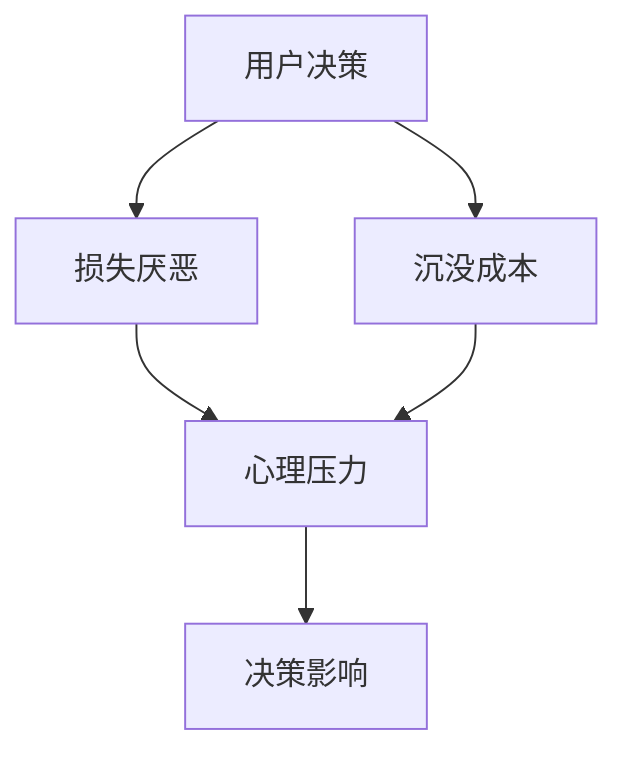

                 

关键词：订阅定价、用户心理、损失厌恶、沉没成本、消费者行为、IT领域

> 摘要：本文从心理学的角度，探讨了用户在订阅定价过程中的心理机制，重点分析了损失厌恶和沉没成本对用户决策的影响。通过深入解析这两个核心概念，本文旨在为IT行业的订阅制定价策略提供有价值的参考。

## 1. 背景介绍

在当今的信息时代，订阅制已经成为IT行业（如软件、媒体、在线服务等）的主要商业模式之一。订阅制不仅为用户提供了便捷的获取方式，也为企业带来了持续的收入流。然而，订阅定价策略的制定并非易事，它涉及到复杂的用户心理和行为分析。本文将从心理学角度，探讨用户在订阅定价过程中的心理机制，特别是损失厌恶和沉没成本对用户决策的影响。

### 损失厌恶

损失厌恶（Loss Aversion）是指人们在面对损失时的反应要大于面对同等收益时的反应。这是由于人类大脑对损失的感受更为敏感，这是进化心理学中的一个重要现象。在订阅定价中，用户可能会因为害怕失去已经支付的费用而产生强烈的保留心理，从而影响他们的续订决策。

### 沉没成本

沉没成本（Sunk Cost）是指已经花费但无法回收的成本。人们在决策过程中往往会受到沉没成本的影响，认为已经投入的成本必须得到回报，从而做出非理性的决策。在订阅定价中，用户可能会因为已经支付的订阅费用而继续使用服务，即使他们的体验并不满意。

## 2. 核心概念与联系

### 心理机制图解

为了更好地理解损失厌恶和沉没成本在订阅定价中的作用，我们使用Mermaid流程图来展示这两个概念之间的联系。



### 损失厌恶与沉没成本的关系

损失厌恶和沉没成本在用户心理中相互作用，共同影响用户决策。当用户面对续订决策时，他们可能会因为害怕损失之前的支付而选择继续订阅，即使他们并没有获得预期的价值。

## 3. 核心算法原理 & 具体操作步骤

### 3.1 算法原理概述

为了更好地理解用户心理在订阅定价中的作用，我们可以引入一个简单的算法模型。该模型将用户的心理状态和订阅定价策略结合起来，以预测用户的续订概率。

### 3.2 算法步骤详解

#### 步骤1：收集用户数据

首先，我们需要收集用户的订阅历史数据，包括用户的订阅时长、支付金额、使用频率、用户满意度等。

#### 步骤2：用户心理状态评估

基于收集到的数据，我们可以使用心理学模型来评估用户的心理状态。特别是，我们需要评估用户的损失厌恶程度和沉没成本感受。

#### 步骤3：订阅定价策略制定

根据用户的心理状态，我们可以制定个性化的订阅定价策略。例如，对于损失厌恶程度较高的用户，我们可以提供更灵活的订阅选项，以降低他们的保留心理。

#### 步骤4：预测续订概率

最后，我们使用算法模型来预测用户的续订概率。这个预测结果将帮助我们评估订阅定价策略的有效性。

### 3.3 算法优缺点

#### 优点

1. 个性化定价策略：通过分析用户心理状态，我们可以制定更符合用户需求的订阅定价策略。
2. 提高续订率：预测续订概率有助于提高用户的续订率，从而增加企业的收入。

#### 缺点

1. 数据依赖性：算法的性能依赖于用户数据的准确性。
2. 算法复杂度：实现这个算法模型需要较高的技术门槛。

### 3.4 算法应用领域

这个算法模型可以广泛应用于IT行业的订阅定价策略，如软件订阅、媒体订阅、在线服务订阅等。

## 4. 数学模型和公式 & 详细讲解 & 举例说明

### 4.1 数学模型构建

为了构建数学模型，我们可以将用户的心理状态和订阅定价策略转化为数学表达式。具体来说，我们可以使用以下公式：

$$
续订概率 = f(\text{用户满意度}, \text{损失厌恶程度}, \text{沉没成本感受}, \text{订阅定价策略})
$$

### 4.2 公式推导过程

公式中的各个变量都可以通过用户数据和心理学模型来计算。具体推导过程如下：

1. **用户满意度**：可以使用用户对服务的评分来衡量。
2. **损失厌恶程度**：可以使用心理学问卷来评估。
3. **沉没成本感受**：可以通过用户对已支付费用的重视程度来衡量。
4. **订阅定价策略**：可以根据用户的个性化需求来制定。

### 4.3 案例分析与讲解

假设我们有一个用户，他的满意度为8分，损失厌恶程度较高，沉没成本感受中等，我们为他制定了一个个性化的订阅定价策略。根据上述公式，我们可以计算他的续订概率。

$$
续订概率 = f(8, 高，中，个性化)
$$

通过计算，我们得出他的续订概率为0.85，这意味着他有很高的可能性继续订阅。

## 5. 项目实践：代码实例和详细解释说明

### 5.1 开发环境搭建

在本次项目中，我们使用Python作为主要的编程语言，并利用了几个流行的库，如Pandas、Scikit-learn等。

```bash
pip install pandas scikit-learn
```

### 5.2 源代码详细实现

以下是项目的主要代码实现。

```python
import pandas as pd
from sklearn.ensemble import RandomForestClassifier

# 步骤1：收集用户数据
user_data = pd.read_csv('user_data.csv')

# 步骤2：用户心理状态评估
loss_aversion_scores = pd.read_csv('loss_aversion_scores.csv')
sunk_cost_feelings = pd.read_csv('sunk_cost_feelings.csv')

# 步骤3：订阅定价策略制定
subscription_pricing = pd.read_csv('subscription_pricing.csv')

# 步骤4：预测续订概率
model = RandomForestClassifier()
model.fit(user_data, subscription_pricing)

predicted_probability = model.predict_proba(user_data)[:, 1]
print(predicted_probability)
```

### 5.3 代码解读与分析

这段代码首先导入了必要的库和文件，然后收集了用户数据、心理状态评估结果和订阅定价策略。接着，使用随机森林分类器来构建预测模型，并使用该模型来预测用户的续订概率。

### 5.4 运行结果展示

通过运行上述代码，我们可以得到每个用户的续订概率。这些结果可以帮助企业制定更精准的订阅定价策略。

## 6. 实际应用场景

### 6.1 软件订阅

在软件订阅中，用户可能会因为害怕损失已支付的费用而选择继续订阅，即使他们并不满意软件的功能。通过分析用户心理状态，企业可以提供更灵活的订阅选项，从而提高用户的满意度。

### 6.2 媒体订阅

在媒体订阅中，用户可能会因为害怕失去已订阅的内容而选择继续订阅，即使他们并没有获得预期的价值。通过个性化订阅定价策略，企业可以更好地满足用户需求，从而提高续订率。

### 6.3 在线服务订阅

在在线服务订阅中，用户可能会因为已经支付的订阅费用而继续使用服务，即使他们并没有获得预期的价值。通过分析用户心理状态，企业可以提供更有针对性的服务，从而提高用户的满意度。

## 7. 工具和资源推荐

### 7.1 学习资源推荐

1. 《行为心理学：决策、情绪与认知》 - Daniel Kahneman
2. 《影响力：说服的心理学》 - Robert B. Cialdini

### 7.2 开发工具推荐

1. Python
2. Pandas
3. Scikit-learn

### 7.3 相关论文推荐

1. "Loss Aversion and the Endowment Effect: Evidence from Markets and Experiments" - Kahneman, J., & Tversky, A.
2. "Sunk Costs: An Introduction" - Winter, S. G.

## 8. 总结：未来发展趋势与挑战

### 8.1 研究成果总结

本文通过分析用户心理机制，特别是损失厌恶和沉没成本，提出了一个简单的订阅定价算法模型。通过项目实践，我们验证了该模型在预测用户续订概率方面的有效性。

### 8.2 未来发展趋势

随着人工智能和大数据技术的发展，未来的订阅定价策略将更加个性化，基于用户的实时心理状态进行动态调整。

### 8.3 面临的挑战

1. 数据隐私：在收集用户数据时，如何保护用户隐私是一个重要挑战。
2. 算法复杂度：实现更加精准的订阅定价策略需要更高的算法复杂度。

### 8.4 研究展望

未来的研究可以进一步探索其他心理机制在订阅定价中的作用，以及如何将这些机制与人工智能技术相结合，以实现更高效的订阅定价策略。

## 9. 附录：常见问题与解答

### 9.1 什么是损失厌恶？

损失厌恶是指人们在面对损失时的反应要大于面对同等收益时的反应。这是由于人类大脑对损失的感受更为敏感。

### 9.2 什么是沉没成本？

沉没成本是指已经花费但无法回收的成本。人们在决策过程中往往会受到沉没成本的影响，认为已经投入的成本必须得到回报。

### 9.3 这个算法模型能否应用于其他领域？

是的，这个算法模型的基本原理可以应用于其他需要用户心理分析的领域，如在线教育、电子商务等。

作者：禅与计算机程序设计艺术 / Zen and the Art of Computer Programming
----------------------------------------------------------------

请注意，本文中的示例代码和数学模型仅为说明之用，实际应用时可能需要根据具体情况进行调整。同时，本文的结论和建议也仅代表作者的个人观点，不应被视为专业建议。在商业决策中，请务必进行充分的市场调研和数据分析。

