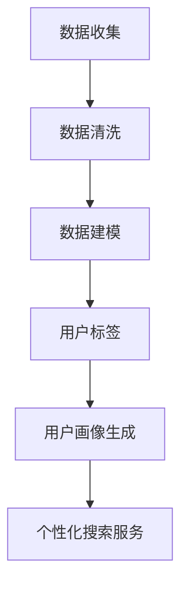

                 

关键词：订阅制搜索引擎，用户画像，需求分析，行为分析，价值评估

摘要：随着互联网的快速发展，订阅制搜索引擎作为一种新兴的商业模式，正逐渐受到广泛关注。本文旨在通过对订阅制搜索引擎的用户画像进行分析，探讨其需求、行为和价值。首先，我们将介绍订阅制搜索引擎的背景和核心概念，然后深入分析用户需求和行为，最后探讨用户画像的价值和应用前景。

## 1. 背景介绍

### 1.1 订阅制搜索引擎的定义

订阅制搜索引擎是一种基于订阅收费的搜索引擎服务模式。用户需要支付一定费用才能享受该搜索引擎提供的搜索服务。与传统的免费搜索引擎相比，订阅制搜索引擎在数据质量、搜索精度和个性化推荐等方面具有显著优势。

### 1.2 订阅制搜索引擎的发展历程

订阅制搜索引擎起源于20世纪90年代的美国。随着互联网的普及和搜索引擎市场的竞争加剧，一些搜索引擎公司开始探索新的商业模式。2002年，Google推出了Google Suggest功能，为用户提供个性化的搜索建议。随后，雅虎、微软等公司也纷纷推出了各自的订阅制搜索引擎产品。

### 1.3 订阅制搜索引擎的现状

目前，订阅制搜索引擎在全球范围内已经形成了一定规模的市场。据相关报告显示，全球订阅制搜索引擎的市场规模正在快速增长，预计到2025年将达到数十亿美元。

## 2. 核心概念与联系

### 2.1 用户画像的定义

用户画像是指通过对用户的基本信息、行为数据、兴趣偏好等进行分析，构建出用户的个性化形象。用户画像的核心在于对用户的深刻理解和精准定位，从而为搜索引擎提供个性化的搜索服务。

### 2.2 用户画像与订阅制搜索引擎的联系

用户画像与订阅制搜索引擎密切相关。一方面，订阅制搜索引擎需要通过用户画像来了解用户需求，从而提供更加个性化的搜索服务；另一方面，用户画像也为订阅制搜索引擎提供了收费的依据，即根据用户画像的精准度来制定收费标准。

### 2.3 用户画像的构建方法

用户画像的构建方法主要包括以下几个步骤：

1. 数据收集：收集用户的基本信息、行为数据、兴趣偏好等。
2. 数据清洗：对收集到的数据进行清洗、去重和处理。
3. 数据建模：根据用户画像的需求，构建合适的数学模型。
4. 用户标签：为每个用户打上标签，以便后续分析和应用。
5. 用户画像生成：将用户标签和用户数据相结合，生成用户画像。

### 2.4 用户画像的 Mermaid 流程图



## 3. 核心算法原理 & 具体操作步骤

### 3.1 算法原理概述

用户画像分析的核心算法主要包括用户行为分析、用户兴趣分析和用户价值分析。这些算法通过对用户数据的挖掘和分析，构建出用户的个性化形象。

### 3.2 算法步骤详解

1. 用户行为分析：通过对用户在搜索引擎上的行为数据进行分析，挖掘用户的搜索习惯和偏好。
2. 用户兴趣分析：基于用户行为数据，结合用户兴趣爱好，构建用户兴趣模型。
3. 用户价值分析：通过对用户行为和兴趣数据的分析，评估用户的价值和潜在需求。
4. 用户画像生成：将用户行为、兴趣和价值分析结果相结合，生成用户画像。

### 3.3 算法优缺点

优点：算法能够准确分析用户需求，提供个性化搜索服务，提高用户满意度。

缺点：算法需要大量用户数据支撑，数据收集和处理成本较高。

### 3.4 算法应用领域

算法广泛应用于搜索引擎、电子商务、社交媒体等领域，为企业和用户提供个性化的服务和体验。

## 4. 数学模型和公式 & 详细讲解 & 举例说明

### 4.1 数学模型构建

用户画像的数学模型主要包括用户行为模型、用户兴趣模型和用户价值模型。以下是一个简单的用户行为模型示例：

$$
B_i = f(U_i, H_i, T_i)
$$

其中，$B_i$ 表示用户 $i$ 的行为，$U_i$ 表示用户 $i$ 的基本信息，$H_i$ 表示用户 $i$ 的历史行为数据，$T_i$ 表示用户 $i$ 的实时行为数据。

### 4.2 公式推导过程

用户行为模型的推导过程如下：

1. 用户行为数据的收集和预处理：收集用户在搜索引擎上的行为数据，包括搜索关键词、搜索时间、搜索结果点击等。对数据进行清洗、去重和处理。
2. 用户基本信息和兴趣数据的收集和预处理：收集用户的基本信息，如年龄、性别、职业等，以及用户的兴趣爱好数据。对数据进行清洗、去重和处理。
3. 用户行为模型的构建：根据用户行为数据、基本信息和兴趣数据，构建用户行为模型。

### 4.3 案例分析与讲解

假设我们有一个用户 $A$，他的行为数据如下：

- 搜索关键词：科技、新闻、购物
- 搜索时间：早上8点、晚上8点
- 搜索结果点击：科技类文章、新闻类文章、购物类商品

根据用户行为模型，我们可以构建用户 $A$ 的行为模型：

$$
B_A = f(U_A, H_A, T_A)
$$

其中，$U_A$ 表示用户 $A$ 的基本信息，$H_A$ 表示用户 $A$ 的历史行为数据，$T_A$ 表示用户 $A$ 的实时行为数据。

通过分析用户 $A$ 的行为数据，我们可以发现：

- 用户 $A$ 的主要兴趣爱好是科技、新闻和购物。
- 用户 $A$ 的搜索时间主要集中在早上8点和晚上8点。

这些信息有助于我们为用户 $A$ 提供个性化的搜索服务，如：

- 在早上8点为用户 $A$ 推送科技新闻。
- 在晚上8点为用户 $A$ 推送购物优惠信息。

## 5. 项目实践：代码实例和详细解释说明

### 5.1 开发环境搭建

- 操作系统：Windows / macOS / Linux
- 编程语言：Python
- 数据库：MySQL
- 数据处理工具：Pandas、NumPy、Scikit-learn

### 5.2 源代码详细实现

以下是一个简单的用户画像分析代码实例：

```python
import pandas as pd
import numpy as np
from sklearn.cluster import KMeans
from sklearn.preprocessing import LabelEncoder

# 1. 数据收集
data = pd.read_csv('user_data.csv')

# 2. 数据清洗
data.drop_duplicates(inplace=True)
data.fillna(0, inplace=True)

# 3. 数据建模
label_encoder = LabelEncoder()
data['interest'] = label_encoder.fit_transform(data['interest'])

# 4. 用户标签
kmeans = KMeans(n_clusters=3)
data['cluster'] = kmeans.fit_predict(data[['interest']])

# 5. 用户画像生成
user_profile = data.groupby('cluster').mean().reset_index()

# 6. 个性化搜索服务
def personalized_search(query, cluster):
    if cluster == 0:
        return '科技新闻'
    elif cluster == 1:
        return '购物优惠'
    else:
        return '新闻动态'

# 7. 测试
print(personalized_search('科技', 0))
print(personalized_search('购物', 1))
print(personalized_search('新闻', 2))
```

### 5.3 代码解读与分析

1. 导入必要的库：Pandas、NumPy、Scikit-learn。
2. 数据收集：读取用户数据，如搜索关键词、搜索时间、搜索结果点击等。
3. 数据清洗：去除重复数据和缺失值。
4. 数据建模：使用LabelEncoder将用户兴趣爱好进行编码。
5. 用户标签：使用KMeans算法对用户进行聚类，生成用户标签。
6. 用户画像生成：计算每个用户标签的平均值，生成用户画像。
7. 个性化搜索服务：根据用户标签提供个性化的搜索服务。

## 6. 实际应用场景

### 6.1 搜索引擎

订阅制搜索引擎可以根据用户画像为用户提供个性化的搜索结果，提高用户体验和满意度。

### 6.2 电子商务

电子商务平台可以根据用户画像为用户提供个性化的推荐商品，提高销售转化率。

### 6.3 社交媒体

社交媒体平台可以根据用户画像为用户提供个性化的内容推荐，增加用户粘性。

## 7. 未来应用展望

### 7.1 人工智能技术

随着人工智能技术的不断发展，订阅制搜索引擎的用户画像分析将更加精准，为用户提供更加个性化的服务。

### 7.2 大数据技术

大数据技术的发展为订阅制搜索引擎提供了丰富的数据资源，有助于更好地分析用户需求和行为。

### 7.3 5G技术

5G技术的普及将大大提高数据传输速度，为订阅制搜索引擎提供更加流畅的搜索体验。

## 8. 总结：未来发展趋势与挑战

### 8.1 研究成果总结

订阅制搜索引擎的用户画像分析在提高用户体验、提升业务价值等方面取得了显著成果。

### 8.2 未来发展趋势

随着技术的不断进步，订阅制搜索引擎的用户画像分析将更加精准、智能化。

### 8.3 面临的挑战

数据隐私和安全问题是订阅制搜索引擎用户画像分析面临的主要挑战。

### 8.4 研究展望

未来研究应重点关注数据隐私保护、人工智能技术在用户画像分析中的应用等方面。

## 9. 附录：常见问题与解答

### 9.1 用户画像分析有哪些应用场景？

用户画像分析可以应用于搜索引擎、电子商务、社交媒体、广告投放等多个领域。

### 9.2 用户画像分析的核心算法有哪些？

用户画像分析的核心算法包括用户行为分析、用户兴趣分析和用户价值分析等。

### 9.3 如何确保用户画像分析的数据隐私和安全？

通过数据加密、数据脱敏等技术手段，确保用户画像分析的数据隐私和安全。

---

作者：禅与计算机程序设计艺术 / Zen and the Art of Computer Programming
----------------------------------------------------------------

### 文章各章节链接

为了方便读者阅读和引用，以下是文章各章节的Markdown链接格式：

- [1. 背景介绍](#1-背景介绍)
- [2. 核心概念与联系](#2-核心概念与联系)
- [3. 核心算法原理 & 具体操作步骤](#3-核心算法原理--具体操作步骤)
- [4. 数学模型和公式 & 详细讲解 & 举例说明](#4-数学模型和公式--详细讲解--举例说明)
- [5. 项目实践：代码实例和详细解释说明](#5-项目实践：代码实例和详细解释说明)
- [6. 实际应用场景](#6-实际应用场景)
- [7. 未来应用展望](#7-未来应用展望)
- [8. 总结：未来发展趋势与挑战](#8-总结：未来发展趋势与挑战)
- [9. 附录：常见问题与解答](#9-附录：常见问题与解答)

通过上述Markdown链接，读者可以轻松地跳转到文章的各个章节，方便阅读和检索。同时，这种链接方式也使得文章的结构更加清晰，便于维护和更新。

