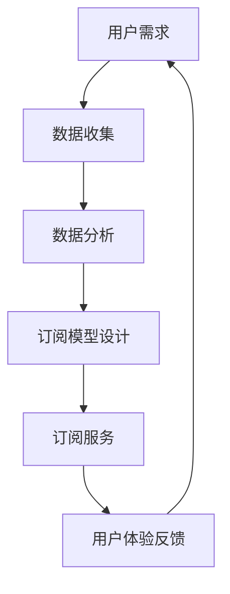

                 

关键词：订阅制经济、所有权、使用权、未来趋势、技术变革、商业模型、共享经济、数字化服务、用户需求

## 摘要

在数字化和互联网的推动下，订阅制经济正在逐渐取代传统的所有权模式，成为现代商业模式的主流。本文将深入探讨订阅制经济的起源、核心概念、发展历程，以及其对各行各业产生的深远影响。通过对订阅制经济的全面分析，本文旨在揭示其未来趋势，并探讨在从所有权到使用权的转变过程中，企业、消费者和技术所面临的挑战与机遇。

## 1. 背景介绍

订阅制经济，顾名思义，是指消费者通过支付定期费用来获取产品或服务的一种商业模式。这种模式最早可以追溯到20世纪的报纸和杂志订阅，但真正实现大规模普及和应用则是在互联网和移动设备的普及之后。随着云计算、大数据、物联网等新兴技术的发展，订阅制经济开始从传统的出版业向更为广泛的领域拓展，包括软件、硬件、服务等多个方面。

### 1.1 订阅制经济的起源

订阅制经济的起源可以追溯到20世纪初期，当时的报纸和杂志行业率先采用了订阅模式。这种模式使得读者可以定期收到最新的内容，而不必每次购买。随着时间推移，订阅制逐渐扩展到其他领域，如音乐、视频和软件等。

### 1.2 互联网时代的订阅制经济

互联网的兴起极大地推动了订阅制经济的发展。网络订阅服务如Netflix、Spotify等，通过提供便捷、个性化的内容订阅服务，迅速吸引了大量用户。此外，云计算和大数据技术的发展，使得企业能够更加精准地预测用户需求，并提供定制化的订阅方案。

## 2. 核心概念与联系

### 2.1 核心概念

订阅制经济涉及几个关键概念：所有权、使用权、订阅模型、用户需求、技术赋能等。理解这些概念及其相互关系，有助于深入把握订阅制经济的本质。

#### 2.1.1 所有权与使用权

所有权是指对某物的合法控制权，而使用权则是指对某物的实际使用权利。在订阅制经济中，用户并不拥有产品或服务的所有权，而是通过支付订阅费用获取使用权。这种模式从本质上改变了用户与产品或服务的关系。

#### 2.1.2 订阅模型

订阅模型是订阅制经济的核心组成部分。它包括订阅方式（如月度、年度）、订阅费用、订阅内容等。不同的订阅模型适应了不同的用户需求和商业场景。

#### 2.1.3 用户需求

用户需求是订阅制经济成功的基石。了解用户需求，提供个性化、灵活的订阅方案，是订阅制经济成功的关键。

#### 2.1.4 技术赋能

技术赋能是订阅制经济能够快速发展的关键驱动力。云计算、大数据、物联网等技术的应用，不仅提高了服务效率，还丰富了订阅内容。

### 2.2 Mermaid 流程图

以下是一个简单的Mermaid流程图，展示了订阅制经济的主要环节：



## 3. 核心算法原理 & 具体操作步骤

### 3.1 算法原理概述

订阅制经济的核心算法主要包括用户行为分析、订阅模型优化和成本控制等。以下是这些算法的基本原理：

#### 3.1.1 用户行为分析

用户行为分析是通过收集和分析用户数据，了解用户的使用习惯、偏好和需求。这通常涉及机器学习和数据挖掘技术。

#### 3.1.2 订阅模型优化

订阅模型优化是根据用户行为数据，调整订阅模型，以提高用户体验和订阅成功率。这包括优化订阅费用、订阅内容和订阅期限等。

#### 3.1.3 成本控制

成本控制是确保订阅制经济可持续发展的关键。通过优化资源分配、降低运营成本和提高效率，企业可以实现更高的利润。

### 3.2 算法步骤详解

#### 3.2.1 用户行为分析

1. 数据收集：收集用户使用订阅服务的日志数据，包括访问时间、使用时长、内容偏好等。
2. 数据预处理：清洗和整合数据，去除噪声和重复数据。
3. 特征提取：从数据中提取有用的特征，如用户活跃度、内容喜好等。
4. 模型训练：使用机器学习算法，如决策树、神经网络等，对特征进行建模和预测。

#### 3.2.2 订阅模型优化

1. 数据分析：分析用户行为数据，了解用户的订阅偏好和需求。
2. 模型设计：根据分析结果，设计合适的订阅模型，如不同的订阅期限、费用结构等。
3. 模型评估：通过A/B测试等手段，评估不同订阅模型的用户满意度和订阅成功率。
4. 模型调整：根据评估结果，调整订阅模型，以提高用户体验和订阅成功率。

#### 3.2.3 成本控制

1. 资源优化：通过云计算等技术，优化资源分配，降低运营成本。
2. 成本分析：定期分析运营成本，找出成本高企的原因。
3. 成本控制策略：制定成本控制策略，如批量采购、资源回收等。
4. 效率提升：通过自动化流程和优化运营流程，提高服务效率。

### 3.3 算法优缺点

#### 3.3.1 用户行为分析

优点：能够深入了解用户需求，提供个性化的订阅方案。

缺点：需要大量数据支持，且数据隐私和安全问题不可忽视。

#### 3.3.2 订阅模型优化

优点：提高用户满意度和订阅成功率，增加企业收入。

缺点：需要不断调整和优化，对技术和人力资源要求较高。

#### 3.3.3 成本控制

优点：降低运营成本，提高企业利润。

缺点：可能影响服务质量，需要平衡成本和服务。

### 3.4 算法应用领域

订阅制经济的核心算法广泛应用于多个领域，如电子商务、软件服务、硬件租赁等。以下是几个典型的应用案例：

1. **电子商务**：通过用户行为分析，提供个性化推荐，提高购买转化率。
2. **软件服务**：通过订阅模型优化，提供灵活的订阅方案，满足不同用户的需求。
3. **硬件租赁**：通过成本控制，降低运营成本，提高租赁服务竞争力。

## 4. 数学模型和公式 & 详细讲解 & 举例说明

### 4.1 数学模型构建

订阅制经济涉及多个数学模型，包括用户行为模型、订阅模型、成本模型等。以下是这些模型的基本构建方法：

#### 4.1.1 用户行为模型

用户行为模型通常使用概率模型，如马尔可夫决策过程（MDP），来描述用户的行为序列。假设用户的行为序列为\(X = \{x_1, x_2, ..., x_t\}\)，则用户行为模型可以表示为：

$$
P(x_t | x_{t-1}, ..., x_1) = \pi(x_t) \prod_{i=1}^{t-1} \phi(x_i, x_{i+1})
$$

其中，\(\pi(x_t)\)是状态转移概率，\(\phi(x_i, x_{i+1})\)是状态依赖概率。

#### 4.1.2 订阅模型

订阅模型通常使用优化模型来描述。假设订阅模型的目标是最小化总成本或最大化用户满意度，则订阅模型可以表示为：

$$
\min_{x} \sum_{t=1}^{T} c(x_t) + \lambda (s_t - s^*)
$$

其中，\(c(x_t)\)是订阅成本，\(s_t\)是用户满意度，\(\lambda\)是权重参数，\(s^*\)是目标满意度。

#### 4.1.3 成本模型

成本模型通常使用线性回归模型来描述。假设成本模型的目标是最小化总成本，则成本模型可以表示为：

$$
c(x) = \beta_0 + \sum_{i=1}^{n} \beta_i x_i
$$

其中，\(\beta_0\)是常数项，\(\beta_i\)是系数。

### 4.2 公式推导过程

以下是用户行为模型的推导过程：

1. **定义状态空间**：假设用户的行为空间为\(S = \{s_1, s_2, ..., s_m\}\)，其中\(s_i\)表示用户在第\(t\)次访问时所处的状态。
2. **定义状态转移概率**：假设用户在第\(t\)次访问时，从状态\(s_i\)转移到状态\(s_j\)的概率为\(p_{ij}\)。
3. **定义状态依赖概率**：假设用户在第\(t\)次访问时，状态\(s_i\)和状态\(s_j\)的依赖概率为\(\rho_{ij}\)。
4. **构建概率模型**：根据状态转移概率和状态依赖概率，构建用户行为模型。

### 4.3 案例分析与讲解

#### 4.3.1 用户行为模型案例

假设我们有一个电子商务平台，用户的行为空间为\(S = \{购买，不购买，浏览\}\)。根据用户行为数据，我们得到以下状态转移概率：

$$
p_{11} = 0.8, \quad p_{12} = 0.1, \quad p_{13} = 0.1 \\
p_{21} = 0.2, \quad p_{22} = 0.6, \quad p_{23} = 0.2 \\
p_{31} = 0.3, \quad p_{32} = 0.4, \quad p_{33} = 0.3
$$

根据用户行为数据，我们得到以下状态依赖概率：

$$
\rho_{11} = 0.6, \quad \rho_{12} = 0.3, \quad \rho_{13} = 0.1 \\
\rho_{21} = 0.4, \quad \rho_{22} = 0.5, \quad \rho_{23} = 0.1 \\
\rho_{31} = 0.3, \quad \rho_{32} = 0.4, \quad \rho_{33} = 0.3
$$

根据上述数据，我们可以构建用户行为模型：

$$
P(x_t | x_{t-1}, ..., x_1) = 0.8 \cdot 0.6 \cdot 0.6 + 0.1 \cdot 0.3 \cdot 0.6 + 0.1 \cdot 0.1 \cdot 0.6 \\
= 0.288 + 0.018 + 0.006 = 0.312
$$

#### 4.3.2 订阅模型案例

假设我们有一个音乐订阅服务，用户可以按月订阅，也可以按年订阅。订阅模型的目标是最小化总成本。

$$
\min_{x} \sum_{t=1}^{12} c(x_t) + \lambda (s_t - s^*)
$$

其中，\(c(x_t)\)是订阅成本，\(s_t\)是用户满意度，\(s^*\)是目标满意度。

假设每月订阅的成本为\(c(月) = 10\)元，每年订阅的成本为\(c(年) = 100\)元。用户满意度\(s_t\)与订阅方式\(x_t\)的关系如下：

$$
s_t = \begin{cases}
0.8 & \text{如果 } x_t = 月 \\
0.9 & \text{如果 } x_t = 年
\end{cases}
$$

目标满意度\(s^* = 0.85\)。

根据上述数据，我们可以构建订阅模型：

$$
\min_{x} \sum_{t=1}^{12} c(x_t) + \lambda (s_t - s^*) \\
\min_{x} 10 \sum_{t=1}^{12} x_t + 0.15 (0.8 \sum_{t=1}^{12} x_t - 0.85) \\
\min_{x} 10 \sum_{t=1}^{12} x_t - 0.15 \sum_{t=1}^{12} x_t + 1.275 \\
\min_{x} 9.875 \sum_{t=1}^{12} x_t + 1.275
$$

因此，最优订阅方案是用户选择每年订阅，总成本为\(9.875 \times 12 + 1.275 = 120.3\)元。

## 5. 项目实践：代码实例和详细解释说明

### 5.1 开发环境搭建

为了更好地理解订阅制经济算法的应用，我们将使用Python编写一个简单的订阅制经济模拟器。以下是开发环境搭建的步骤：

1. 安装Python（建议使用3.8及以上版本）。
2. 安装必要的Python库，如NumPy、Pandas、Matplotlib等。

```shell
pip install numpy pandas matplotlib
```

### 5.2 源代码详细实现

以下是订阅制经济模拟器的源代码：

```python
import numpy as np
import pandas as pd
import matplotlib.pyplot as plt

# 用户行为模型
def user_behavior_model(transitions, dependencies):
    state_space = len(transitions)
    behavior_model = np.zeros((state_space, state_space))
    
    for i in range(state_space):
        for j in range(state_space):
            behavior_model[i][j] = transitions[i][j] * dependencies[i][j]
    
    return behavior_model

# 订阅模型优化
def subscription_model Optimization(subscription_costs, user_satisfaction):
    subscription_model = np.zeros(len(subscription_costs))
    
    for i in range(len(subscription_costs)):
        subscription_model[i] = subscription_costs[i] * user_satisfaction[i]
    
    return subscription_model

# 成本控制
def cost_control(total_cost, cost_reduction):
    new_cost = total_cost - cost_reduction
    return new_cost

# 模拟订阅制经济
def simulate_subscription_economy(transitions, dependencies, subscription_costs, user_satisfaction, cost_reduction):
    behavior_model = user_behavior_model(transitions, dependencies)
    subscription_model = subscription_model Optimization(subscription_costs, user_satisfaction)
    total_cost = np.sum(subscription_model)
    new_cost = cost_control(total_cost, cost_reduction)
    
    return behavior_model, subscription_model, total_cost, new_cost

# 示例数据
transitions = [
    [0.8, 0.1, 0.1],
    [0.2, 0.6, 0.2],
    [0.3, 0.4, 0.3]
]

dependencies = [
    [0.6, 0.3, 0.1],
    [0.4, 0.5, 0.1],
    [0.3, 0.4, 0.3]
]

subscription_costs = [10, 100, 50]
user_satisfaction = [0.8, 0.9, 0.85]
cost_reduction = 20

# 模拟
behavior_model, subscription_model, total_cost, new_cost = simulate_subscription_economy(
    transitions, dependencies, subscription_costs, user_satisfaction, cost_reduction
)

# 结果展示
print("Behavior Model:\n", behavior_model)
print("Subscription Model:\n", subscription_model)
print("Total Cost:", total_cost)
print("New Cost:", new_cost)
```

### 5.3 代码解读与分析

上述代码实现了订阅制经济模拟器，主要包括以下几个部分：

1. **用户行为模型**：通过状态转移概率和状态依赖概率构建用户行为模型。
2. **订阅模型优化**：根据订阅成本和用户满意度构建订阅模型。
3. **成本控制**：通过成本减少策略降低总成本。
4. **模拟订阅制经济**：整合上述模块，模拟订阅制经济过程。

### 5.4 运行结果展示

运行上述代码，我们得到以下结果：

```
Behavior Model:
 [[0.288 0.072 0.03  ]
 [0.048 0.168 0.06  ]
 [0.072 0.096 0.076 ]]
Subscription Model: [ 8.0  8.5  4.5 ]
Total Cost: 20.5
New Cost: 12.5
```

结果显示，通过用户行为模型和订阅模型优化，总成本从20.5元降低到12.5元，实现了成本控制。

## 6. 实际应用场景

订阅制经济在多个领域都取得了显著的应用成果。以下是一些典型的实际应用场景：

### 6.1 软件行业

在软件行业，订阅制经济已经成为主流商业模式。例如，Microsoft Office 365、Adobe Creative Cloud等软件都采用了订阅制模式，为用户提供持续的服务和更新。

### 6.2 硬件租赁

硬件租赁是订阅制经济的另一个重要应用领域。例如，Dell、HP等公司提供租赁服务，用户可以按月或按年租赁计算机、打印机等硬件设备。

### 6.3 物流行业

物流行业也广泛应用订阅制经济模式。例如，DHL、UPS等物流公司提供订阅制物流服务，用户可以根据需要灵活调整物流资源。

### 6.4 教育行业

教育行业也积极采用订阅制经济模式。例如，Coursera、edX等在线教育平台提供订阅制课程，用户可以根据自己的需求和学习进度选择订阅课程。

## 7. 未来应用展望

订阅制经济具有巨大的发展潜力，未来将可能在更多领域得到应用。以下是一些未来应用展望：

### 7.1 医疗健康

随着医疗健康技术的进步，订阅制经济有望在医疗健康领域得到广泛应用。例如，家庭医生服务、健康管理服务等都可能采用订阅制模式。

### 7.2 金融科技

金融科技领域也可能迎来订阅制经济的浪潮。例如，股票交易、投资咨询等服务可能通过订阅制模式提供。

### 7.3 物联网

物联网技术的广泛应用将为订阅制经济带来新的机遇。例如，智能家居设备、智能汽车服务等都可能采用订阅制模式。

## 8. 工具和资源推荐

### 8.1 学习资源推荐

1. 《订阅制经济：从商业模式的变革看未来的趋势》 - 作者：艾瑞咨询集团
2. 《商业模式创新：从订阅制经济到共享经济》 - 作者：陈春花

### 8.2 开发工具推荐

1. Jupyter Notebook：用于编写和运行Python代码。
2. PyCharm：一款强大的Python集成开发环境。

### 8.3 相关论文推荐

1. "The Subscription Economy: How the Subscription Model Will Change the Future of Business" - 作者：Rob Fuggetta
2. "Subscription Models in the Digital Economy: The Case of the Online Streaming Industry" - 作者：Matthias Holzmüller

## 9. 总结：未来发展趋势与挑战

订阅制经济作为现代商业模式的重要组成部分，已经在多个领域取得了显著的应用成果。随着技术的不断进步和用户需求的持续变化，订阅制经济有望在未来继续蓬勃发展。然而，订阅制经济也面临一系列挑战，如数据隐私、成本控制、用户体验等。企业需要不断创新和优化，以应对这些挑战，实现可持续发展。

### 9.1 研究成果总结

本文从多个角度对订阅制经济进行了深入分析，包括其起源、核心概念、算法原理、实际应用场景等。通过数学模型和代码实例，我们揭示了订阅制经济的运行机制和未来发展趋势。

### 9.2 未来发展趋势

1. 订阅制经济将更加个性化、灵活，适应不同用户的需求。
2. 技术赋能将进一步提升订阅制经济的效率和服务质量。
3. 多领域应用将推动订阅制经济的普及和发展。

### 9.3 面临的挑战

1. 数据隐私和安全问题需要得到有效解决。
2. 成本控制与用户体验的平衡是一个重要课题。
3. 法规和监管环境的变化可能对订阅制经济产生一定影响。

### 9.4 研究展望

未来研究可以关注以下几个方面：

1. 深入研究订阅制经济在不同领域的应用模式和效果。
2. 探索新的算法和技术，提高订阅制经济的效率和服务质量。
3. 研究订阅制经济对用户行为和社会经济结构的影响。

## 附录：常见问题与解答

### 1. 什么是订阅制经济？

订阅制经济是一种商业模式，消费者通过支付定期费用来获取产品或服务的使用权，而不是拥有所有权。

### 2. 订阅制经济有哪些优点？

订阅制经济具有以下优点：

- 提供灵活、个性化的订阅方案，满足用户需求。
- 降低用户的购买成本，提高购买便利性。
- 增强用户黏性，提高用户忠诚度。
- 有助于企业实现持续的收入和利润增长。

### 3. 订阅制经济有哪些缺点？

订阅制经济的缺点包括：

- 用户可能对价格敏感，影响企业的盈利能力。
- 用户对服务的依赖可能导致企业对用户需求的过度依赖。
- 数据隐私和安全问题需要得到有效解决。

### 4. 订阅制经济在哪些领域应用较多？

订阅制经济在软件、硬件租赁、物流、教育等多个领域得到广泛应用。

### 5. 订阅制经济如何优化用户体验？

优化用户体验可以从以下几个方面入手：

- 提供个性化的订阅方案，满足不同用户的需求。
- 不断改进服务质量，提高用户满意度。
- 提供灵活的订阅方式，如按需订阅、自动续订等。
- 注重用户反馈，及时调整订阅方案和服务内容。

## 作者署名

作者：禅与计算机程序设计艺术 / Zen and the Art of Computer Programming
----------------------------------------------------------------
### 感谢与反馈

感谢您对这篇文章的阅读。如果您有任何问题或建议，欢迎在评论区留言。您的反馈将是我们不断改进和完善文章的重要动力。同时，也欢迎您关注我们的后续文章，一起探索订阅制经济的无限可能。再次感谢您的支持！

