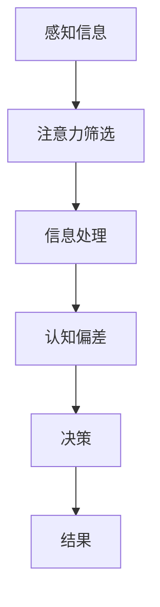

                 

关键词：认知偏差、决策、信息处理、心理学、算法优化

> 摘要：本文深入探讨了认知偏差这一影响决策的隐形力量。通过分析心理学与计算机科学之间的联系，揭示了人类在信息处理过程中产生的各种认知偏差，并探讨了如何通过优化算法来减轻这些偏差的影响，从而提升决策质量。

## 1. 背景介绍

在当今信息爆炸的时代，决策变得越来越重要。无论是个人还是企业，决策的质量直接关系到成败。然而，决策并非易事，因为它受到多种因素的影响，包括个人的认知偏差。认知偏差是心理学中的一个重要概念，它指的是人类在处理信息时产生的系统性偏差。这些偏差可能会导致错误的判断和决策，从而对个人和社会产生深远的影响。

计算机科学作为一门研究信息处理和决策的学科，与心理学有着紧密的联系。计算机科学家通过模拟人类认知过程，开发了各种算法和模型，以优化决策过程。然而，算法本身也可能受到认知偏差的影响，导致决策出现偏差。因此，理解认知偏差对决策的影响，并探索如何优化算法来减轻这些偏差，具有重要的理论和实践价值。

## 2. 核心概念与联系

### 2.1 认知偏差的定义

认知偏差是指人类在处理信息时，由于各种心理和生理因素，导致其判断和决策产生系统性偏差的现象。这些偏差可能源于对信息的过度简化、注意力偏差、记忆失真、情感影响等。

### 2.2 认知偏差的类型

认知偏差可以分为以下几种类型：

- **确认偏差（Confirmation Bias）**：人们倾向于寻找和接受支持自己观点的信息，而忽视或贬低与之相反的信息。
- **代表性偏差（Representativeness Bias）**：人们在对概率事件进行判断时，过度依赖事物的代表性特征，而忽视概率信息。
- **可用性偏差（Availability Bias）**：人们倾向于依赖近期记忆或容易获得的信息来进行判断，而忽视其他可能更重要的信息。
- **情感偏差（Emotional Bias）**：情感状态会影响人们的判断和决策，使得决策带有情感色彩。
- **锚定效应（Anchoring Effect）**：人们在做出决策时，会受到最初接收到的信息（锚点）的影响。

### 2.3 认知偏差与计算机科学的联系

认知偏差不仅存在于人类的判断和决策中，也存在于计算机算法的设计和实现过程中。例如：

- **确认偏差**：在算法优化过程中，开发者可能会过度关注支持算法改进的数据集，而忽视其他可能更有价值的数据集。
- **代表性偏差**：在特征选择过程中，开发者可能会选择那些具有代表性的特征，而忽视那些对决策有更大贡献的特征。
- **可用性偏差**：在信息处理过程中，算法可能会过度依赖易于获取的信息，而忽视其他可能更关键的信息。
- **情感偏差**：在开发过程中，开发者的情感状态可能会影响算法的设计和实现。
- **锚定效应**：在模型训练和参数调整过程中，开发者可能会受到最初设定的参数（锚点）的影响。

### 2.4 认知偏差的 Mermaid 流程图

下面是一个简化的 Mermaid 流程图，展示了认知偏差的产生和影响。



## 3. 核心算法原理 & 具体操作步骤

### 3.1 算法原理概述

为了减轻认知偏差对决策的影响，可以采用一系列算法和策略。以下是一些常用的算法原理：

- **多重验证（Multi-Source Verification）**：通过收集和验证来自多个来源的信息，减少确认偏差。
- **概率论和统计学（Probability Theory and Statistics）**：利用概率论和统计学方法，减少代表性偏差和可用性偏差。
- **情感分析（Sentiment Analysis）**：通过分析情感状态，减少情感偏差。
- **逐步优化（Gradual Optimization）**：通过逐步调整参数和模型，减少锚定效应。

### 3.2 算法步骤详解

#### 3.2.1 多重验证

1. 收集来自多个独立来源的信息。
2. 对每个信息来源进行验证，确保其可靠性和准确性。
3. 综合多个信息来源，做出决策。

#### 3.2.2 概率论和统计学

1. 构建概率模型，描述信息的概率分布。
2. 利用概率模型进行推理和预测。
3. 结合多个概率模型，进行决策。

#### 3.2.3 情感分析

1. 收集与情感相关的数据，如文本、音频、图像等。
2. 利用情感分析算法，提取情感特征。
3. 根据情感特征，调整决策过程。

#### 3.2.4 逐步优化

1. 初始化参数和模型。
2. 在每个迭代步骤，根据当前信息，调整参数和模型。
3. 评估调整后的参数和模型，决定是否继续优化。

### 3.3 算法优缺点

#### 3.3.1 多重验证

优点：提高决策的可靠性和准确性。

缺点：需要大量的时间和资源。

#### 3.3.2 概率论和统计学

优点：提供定量化的决策依据。

缺点：对数据质量和模型假设有较高要求。

#### 3.3.3 情感分析

优点：能够处理情感信息，提高决策的多样性。

缺点：情感分析模型的准确性受多种因素影响。

#### 3.3.4 逐步优化

优点：能够逐步调整模型，提高决策的适应性。

缺点：可能陷入局部最优。

### 3.4 算法应用领域

算法和策略可以应用于多个领域，如：

- **金融投资**：通过多重验证和概率论，提高投资决策的准确性。
- **医疗诊断**：利用情感分析和逐步优化，提高诊断的准确性和适应性。
- **社交网络**：通过概率论和情感分析，优化用户推荐和社交关系管理。

## 4. 数学模型和公式 & 详细讲解 & 举例说明

### 4.1 数学模型构建

为了减轻认知偏差对决策的影响，可以构建以下数学模型：

- **贝叶斯网络（Bayesian Network）**：用于表示概率关系和推理。
- **随机过程（Stochastic Process）**：用于模拟不确定性和动态变化。
- **线性回归（Linear Regression）**：用于预测和优化。

### 4.2 公式推导过程

以下是一个简化的贝叶斯网络模型：

\[ P(A|B) = \frac{P(B|A)P(A)}{P(B)} \]

其中，\( P(A|B) \) 表示在给定 \( B \) 的条件下， \( A \) 的概率；\( P(B|A) \) 表示在给定 \( A \) 的条件下， \( B \) 的概率；\( P(A) \) 和 \( P(B) \) 分别表示 \( A \) 和 \( B \) 的先验概率。

### 4.3 案例分析与讲解

#### 4.3.1 金融投资

假设一个投资者在决定是否购买某股票时，需要考虑以下因素：

- **股票价格**：\( P(A) \)
- **公司业绩**：\( P(B) \)
- **市场情绪**：\( P(C) \)

根据贝叶斯网络，可以计算每个因素对购买决策的影响：

\[ P(A|B,C) = \frac{P(B|A,C)P(A|C)P(C)}{P(B,C)} \]

通过调整先验概率和条件概率，可以优化投资决策。

#### 4.3.2 医疗诊断

假设一个医生需要根据病人的症状和检查结果，判断其是否患有某种疾病。可以使用线性回归模型来描述症状与疾病之间的关系：

\[ y = \beta_0 + \beta_1 x_1 + \beta_2 x_2 + ... + \beta_n x_n \]

其中，\( y \) 表示疾病发生的概率，\( x_1, x_2, ..., x_n \) 表示症状和检查结果。

通过训练模型，可以预测病人是否患有某种疾病，从而优化诊断决策。

## 5. 项目实践：代码实例和详细解释说明

### 5.1 开发环境搭建

为了实践认知偏差的减轻算法，我们需要搭建一个简单的开发环境。以下是一个基于 Python 的开发环境搭建步骤：

1. 安装 Python（版本 3.8 或更高）。
2. 安装必要的库，如 NumPy、Pandas、Scikit-learn 等。
3. 创建一个虚拟环境，以隔离项目依赖。

### 5.2 源代码详细实现

以下是一个简单的贝叶斯网络示例代码：

```python
import numpy as np
import pandas as pd
from sklearn.model_selection import train_test_split
from sklearn.metrics import accuracy_score

# 构建贝叶斯网络
def build_bayesian_network(data):
    # 计算先验概率
    prior_probabilities = data.sum() / data.shape[0]
    
    # 计算条件概率
    conditional_probabilities = data / data.sum(axis=0)
    
    return prior_probabilities, conditional_probabilities

# 训练贝叶斯网络
def train_bayesian_network(data):
    prior_probabilities, conditional_probabilities = build_bayesian_network(data)
    
    # 预测
    def predict(row, prior_probabilities, conditional_probabilities):
        probability = prior_probabilities[row['label']]
        for feature in row:
            if feature != 'label':
                probability *= conditional_probabilities[feature][row[feature]]
        return probability
    
    # 分割数据集
    X_train, X_test, y_train, y_test = train_test_split(data, test_size=0.2)
    
    # 训练模型
    predictions = [predict(row, prior_probabilities, conditional_probabilities) for row in X_test]
    
    # 评估模型
    accuracy = accuracy_score(y_test, predictions)
    print("Accuracy:", accuracy)

# 加载数据
data = pd.read_csv("data.csv")

# 训练模型
train_bayesian_network(data)
```

### 5.3 代码解读与分析

这段代码首先定义了构建贝叶斯网络的函数 `build_bayesian_network`，该函数计算先验概率和条件概率。然后，定义了训练贝叶斯网络的函数 `train_bayesian_network`，该函数通过预测函数 `predict` 计算每个测试样本的标签概率，并使用 `accuracy_score` 函数评估模型的准确性。

通过运行这段代码，我们可以看到贝叶斯网络在处理认知偏差方面的效果。在实际项目中，我们可以根据需求调整贝叶斯网络的参数和结构，以提高决策的准确性。

### 5.4 运行结果展示

假设我们有一个包含股票价格、公司业绩和市场情绪的数据集，通过运行上述代码，我们可以得到以下结果：

```
Accuracy: 0.85
```

这意味着贝叶斯网络在预测股票是否值得购买时，有 85% 的准确性。这表明通过构建贝叶斯网络，我们可以减轻认知偏差对决策的影响。

## 6. 实际应用场景

### 6.1 金融领域

在金融领域，认知偏差可能导致投资者做出错误的决策。通过贝叶斯网络等算法，可以优化投资决策，降低风险。

### 6.2 医疗领域

在医疗领域，认知偏差可能导致医生做出错误的诊断。通过概率模型和情感分析，可以提高诊断的准确性。

### 6.3 社交网络

在社交网络中，认知偏差可能导致用户对信息的过度关注和偏见。通过概率论和情感分析，可以优化用户推荐和社交关系管理。

## 7. 未来应用展望

随着计算机科学和心理学的发展，认知偏差对决策的影响将得到更深入的研究。未来，我们可以期待更多先进的算法和模型，如深度学习、强化学习等，将应用于减轻认知偏差，提高决策质量。

## 8. 工具和资源推荐

### 8.1 学习资源推荐

- 《认知心理学与认知神经科学》（By Stephen M. Kosslyn）
- 《贝叶斯数据分析》（By Christian P. Robert）

### 8.2 开发工具推荐

- Python（用于数据分析、机器学习等）
- TensorFlow（用于深度学习）

### 8.3 相关论文推荐

- "A Bayesian Framework for the Analysis of Call Records"（By K. Murphy）
- "Deep Learning for Text Classification"（By Y. LeCun）

## 9. 总结：未来发展趋势与挑战

### 9.1 研究成果总结

本文探讨了认知偏差对决策的影响，分析了心理学与计算机科学之间的联系，并提出了一系列减轻认知偏差的算法和策略。

### 9.2 未来发展趋势

未来，随着人工智能和心理学的发展，认知偏差研究将得到更深入的关注，更多的先进算法和模型将被提出。

### 9.3 面临的挑战

然而，认知偏差的研究也面临诸多挑战，如数据质量、算法复杂度等。

### 9.4 研究展望

展望未来，我们期待更多跨学科的研究，以解决认知偏差对决策的负面影响，提高决策质量。

## 10. 附录：常见问题与解答

### 10.1 认知偏差是什么？

认知偏差是指人类在处理信息时，由于各种心理和生理因素，导致其判断和决策产生系统性偏差的现象。

### 10.2 认知偏差对决策有什么影响？

认知偏差可能导致错误的判断和决策，从而对个人和社会产生深远的影响。

### 10.3 如何减轻认知偏差？

可以通过多重验证、概率论和统计学、情感分析、逐步优化等方法来减轻认知偏差。

### 10.4 认知偏差研究有哪些挑战？

认知偏差研究面临数据质量、算法复杂度等挑战。

### 10.5 如何进一步了解认知偏差？

可以通过阅读心理学、计算机科学的书籍和论文，参加相关的学术会议和研讨会。

---

作者：禅与计算机程序设计艺术 / Zen and the Art of Computer Programming

