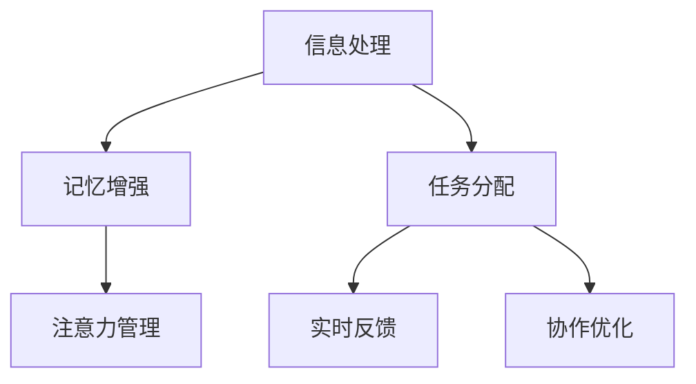

                 

关键词：认知增强、人机协作、知识工作、人工智能、技术趋势

> 摘要：本文探讨了认知增强与人机协作在知识工作中的应用，分析了其技术原理、应用场景及未来发展趋势，为知识工作者的未来提供了新的视角和解决方案。

## 1. 背景介绍

在数字化转型的浪潮下，知识工作的重要性日益凸显。然而，面对信息爆炸和数据冗余，知识工作者面临着巨大的挑战。传统的知识工作方式效率低下，难以满足日益增长的工作需求。因此，如何提高知识工作的效率和质量，成为当前研究的热点。

近年来，人工智能技术的发展为知识工作带来了新的契机。认知增强与人机协作作为一种新兴技术，旨在通过人工智能和人类智能的协同，实现知识工作的自动化和智能化。本文将围绕这一主题，探讨认知增强与人机协作在知识工作中的应用和未来发展。

### 1.1 认知增强

认知增强是指通过技术手段提高人类认知能力的理论和方法。认知增强的目标是利用人工智能、神经科学、认知心理学等领域的知识，构建能够辅助人类认知的系统，从而提高知识工作的效率和质量。

### 1.2 人机协作

人机协作是指人与计算机系统之间的互动和合作。在知识工作中，人机协作通过将人类专家的知识和经验与计算机系统的计算能力相结合，实现知识工作的自动化和智能化。

## 2. 核心概念与联系

为了更好地理解认知增强与人机协作在知识工作中的应用，我们首先需要了解其核心概念和原理。

### 2.1 认知增强原理

认知增强的原理主要包括以下几个方面：

- **信息处理能力提升**：通过大数据分析和机器学习技术，对大量信息进行快速处理和分析，提高知识工作者对信息的理解和应用能力。
- **记忆能力增强**：利用人工智能技术，帮助知识工作者建立和存储知识模型，提高记忆能力和知识检索效率。
- **注意力管理**：通过分析知识工作者的注意力分布，优化工作流程，提高工作效率。

### 2.2 人机协作原理

人机协作的原理主要包括以下几个方面：

- **任务分配**：根据知识工作者的能力和计算机系统的优势，合理分配任务，实现优势互补。
- **实时反馈**：通过实时数据分析和反馈，指导知识工作者进行决策和调整，提高知识工作的准确性。
- **协作优化**：利用人工智能技术，优化知识工作者的协作流程，降低沟通成本，提高协作效率。

### 2.3 Mermaid 流程图

以下是认知增强与人机协作在知识工作中的 Mermaid 流程图：



## 3. 核心算法原理 & 具体操作步骤

### 3.1 算法原理概述

认知增强与人机协作的核心算法主要包括以下几个方面：

- **信息处理算法**：利用大数据分析和机器学习技术，对大量信息进行快速处理和分析，提高知识工作者的信息处理能力。
- **记忆增强算法**：通过建立知识模型和知识图谱，提高知识工作者的记忆能力和知识检索效率。
- **注意力管理算法**：通过分析知识工作者的注意力分布，优化工作流程，提高工作效率。
- **任务分配算法**：根据知识工作者的能力和计算机系统的优势，合理分配任务，实现优势互补。
- **实时反馈算法**：通过实时数据分析和反馈，指导知识工作者进行决策和调整，提高知识工作的准确性。
- **协作优化算法**：利用人工智能技术，优化知识工作者的协作流程，降低沟通成本，提高协作效率。

### 3.2 算法步骤详解

以下是认知增强与人机协作的核心算法步骤详解：

#### 3.2.1 信息处理算法步骤

1. 数据采集：收集大量的文本、图像、音频等多源数据。
2. 数据预处理：对数据进行清洗、去噪和标准化处理。
3. 特征提取：利用机器学习技术提取数据特征。
4. 信息分析：对提取的特征进行深度学习分析和挖掘，提取关键信息。

#### 3.2.2 记忆增强算法步骤

1. 知识建模：建立知识模型和知识图谱，将知识工作者积累的知识转化为结构化的数据。
2. 知识存储：将建模后的知识存储在数据库中，便于快速检索和调用。
3. 知识查询：根据知识工作者的需求，快速检索和查询相关知识。
4. 知识更新：定期更新知识模型和知识图谱，保持知识的时效性和准确性。

#### 3.2.3 注意力管理算法步骤

1. 注意力分析：分析知识工作者的注意力分布，识别工作重点。
2. 工作任务分配：根据注意力分析结果，将工作任务合理分配给知识工作者。
3. 工作进度跟踪：实时跟踪工作任务进度，评估工作者的工作效率。
4. 工作优化调整：根据工作进度和效果，优化工作流程和任务分配。

#### 3.2.4 任务分配算法步骤

1. 能力评估：评估知识工作者的能力和特长。
2. 任务匹配：根据知识工作者的能力和任务需求，进行任务匹配。
3. 任务分配：将匹配成功的任务分配给知识工作者。
4. 任务跟踪：实时跟踪任务执行情况，确保任务按时完成。

#### 3.2.5 实时反馈算法步骤

1. 数据采集：收集知识工作者的操作记录和反馈信息。
2. 数据分析：对采集的数据进行分析，识别工作中的问题和瓶颈。
3. 反馈指导：根据数据分析结果，为知识工作者提供反馈和指导。
4. 工作调整：根据反馈指导，调整工作策略和流程，提高工作效率。

#### 3.2.6 协作优化算法步骤

1. 协作需求分析：分析知识工作者之间的协作需求和依赖关系。
2. 协作流程优化：优化协作流程，降低沟通成本，提高协作效率。
3. 协作效果评估：评估协作效果，识别协作中的问题和瓶颈。
4. 协作调整：根据协作效果评估结果，调整协作策略和流程，提高协作效率。

### 3.3 算法优缺点

#### 3.3.1 信息处理算法

**优点**：能够快速处理大量信息，提高知识工作者的信息处理能力。

**缺点**：对数据的依赖性较高，对数据质量要求严格。

#### 3.3.2 记忆增强算法

**优点**：能够提高知识工作者的记忆能力和知识检索效率。

**缺点**：知识建模过程复杂，需要大量时间和资源。

#### 3.3.3 注意力管理算法

**优点**：能够优化工作流程，提高工作效率。

**缺点**：对知识工作者的注意力分析存在一定误差。

#### 3.3.4 任务分配算法

**优点**：能够实现任务的高效分配，提高任务完成率。

**缺点**：对知识工作者的能力和特长的评估存在一定难度。

#### 3.3.5 实时反馈算法

**优点**：能够为知识工作者提供实时反馈和指导，提高工作效率。

**缺点**：对实时数据的依赖性较高，对数据处理速度要求严格。

#### 3.3.6 协作优化算法

**优点**：能够优化协作流程，提高协作效率。

**缺点**：对协作需求的识别和评估存在一定难度。

### 3.4 算法应用领域

认知增强与人机协作算法在多个领域具有广泛的应用前景：

- **企业知识管理**：通过信息处理和记忆增强算法，提高企业知识管理和知识共享的效率。
- **科研创新**：通过注意力管理和任务分配算法，优化科研团队的协作和创新过程。
- **教育培训**：通过实时反馈和协作优化算法，提高教育培训的效果和效率。
- **医疗诊断**：通过信息处理和记忆增强算法，辅助医生进行疾病诊断和治疗。

## 4. 数学模型和公式 & 详细讲解 & 举例说明

在认知增强与人机协作算法中，数学模型和公式起着核心作用。以下我们将详细介绍这些数学模型和公式的构建、推导过程，并通过具体案例进行说明。

### 4.1 数学模型构建

在认知增强与人机协作算法中，常见的数学模型包括：

- **线性回归模型**：用于信息处理和任务分配。
- **神经网络模型**：用于记忆增强和注意力管理。
- **优化模型**：用于实时反馈和协作优化。

#### 4.1.1 线性回归模型

线性回归模型是一种常用的统计方法，用于分析变量之间的关系。其基本形式如下：

\[ y = \beta_0 + \beta_1x_1 + \beta_2x_2 + ... + \beta_nx_n \]

其中，\( y \) 是因变量，\( x_1, x_2, ..., x_n \) 是自变量，\( \beta_0, \beta_1, \beta_2, ..., \beta_n \) 是模型的参数。

#### 4.1.2 神经网络模型

神经网络模型是一种模拟生物神经网络的人工智能模型。其基本形式如下：

\[ z = \sigma(\sum_{i=1}^{n} w_{i}x_{i} + b) \]

其中，\( z \) 是输出值，\( \sigma \) 是激活函数，\( w_{i} \) 是权重，\( x_{i} \) 是输入值，\( b \) 是偏置。

#### 4.1.3 优化模型

优化模型是一种用于求解最优解的数学模型。其基本形式如下：

\[ min \sum_{i=1}^{n} c_{i}x_{i} \]

其中，\( x_{i} \) 是决策变量，\( c_{i} \) 是目标函数的系数。

### 4.2 公式推导过程

以下是线性回归模型和神经网络模型的公式推导过程：

#### 4.2.1 线性回归模型推导

假设我们有 \( m \) 个数据点 \( (x_{i}, y_{i}) \)，其中 \( x_{i} \) 是自变量，\( y_{i} \) 是因变量。

1. 构建损失函数：

\[ J(\theta) = \frac{1}{2m} \sum_{i=1}^{m} (y_{i} - \theta_{0} - \theta_{1}x_{i})^2 \]

其中，\( \theta_{0} \) 和 \( \theta_{1} \) 是模型的参数。

2. 求导数：

\[ \frac{\partial J(\theta)}{\partial \theta_{0}} = \frac{1}{m} \sum_{i=1}^{m} (y_{i} - \theta_{0} - \theta_{1}x_{i}) \]

\[ \frac{\partial J(\theta)}{\partial \theta_{1}} = \frac{1}{m} \sum_{i=1}^{m} (y_{i} - \theta_{0} - \theta_{1}x_{i})x_{i} \]

3. 求解最优参数：

\[ \theta_{0} = \frac{1}{m} \sum_{i=1}^{m} y_{i} \]

\[ \theta_{1} = \frac{1}{m} \sum_{i=1}^{m} (x_{i}y_{i} - x_{i} \sum_{i=1}^{m} y_{i}) \]

#### 4.2.2 神经网络模型推导

假设我们有 \( n \) 个输入 \( x_{1}, x_{2}, ..., x_{n} \)，一个输出 \( z \)，以及一个激活函数 \( \sigma \)。

1. 前向传播：

\[ z = \sigma(\sum_{i=1}^{n} w_{i}x_{i} + b) \]

2. 反向传播：

\[ \delta_{z} = \sigma'(z) \]

\[ \delta_{w_{i}} = \delta_{z}x_{i} \]

\[ \delta_{b} = \delta_{z} \]

3. 更新参数：

\[ w_{i} = w_{i} - \alpha \delta_{w_{i}} \]

\[ b = b - \alpha \delta_{b} \]

### 4.3 案例分析与讲解

以下是认知增强与人机协作算法在知识工作中的具体应用案例。

#### 4.3.1 企业知识管理

某企业采用认知增强与人机协作算法进行知识管理，具体步骤如下：

1. 数据采集：收集企业的各类知识文档，包括报告、文件、邮件等。
2. 数据预处理：对数据进行清洗和标准化处理。
3. 特征提取：利用机器学习技术提取知识文档的关键特征。
4. 信息分析：对提取的特征进行深度学习分析和挖掘，提取关键信息。
5. 知识建模：建立知识模型和知识图谱，将知识文档转化为结构化的数据。
6. 知识存储：将建模后的知识存储在数据库中，便于快速检索和调用。
7. 知识查询：根据知识工作者的需求，快速检索和查询相关知识。
8. 知识更新：定期更新知识模型和知识图谱，保持知识的时效性和准确性。

通过以上步骤，企业实现了知识的高效管理和共享，提高了知识工作者的工作效率。

#### 4.3.2 科研创新

某科研团队采用认知增强与人机协作算法进行科研创新，具体步骤如下：

1. 数据采集：收集科研团队的各类实验数据、论文、报告等。
2. 数据预处理：对数据进行清洗和标准化处理。
3. 特征提取：利用机器学习技术提取实验数据的关键特征。
4. 信息分析：对提取的特征进行深度学习分析和挖掘，提取关键信息。
5. 知识建模：建立知识模型和知识图谱，将科研数据转化为结构化的数据。
6. 知识存储：将建模后的知识存储在数据库中，便于快速检索和调用。
7. 知识查询：根据科研团队的需求，快速检索和查询相关知识。
8. 知识更新：定期更新知识模型和知识图谱，保持知识的时效性和准确性。
9. 任务分配：根据科研团队的能力和任务需求，合理分配科研任务。
10. 实时反馈：通过实时数据分析和反馈，指导科研团队进行决策和调整。
11. 协作优化：利用人工智能技术，优化科研团队的协作流程，提高协作效率。

通过以上步骤，科研团队实现了高效的科研创新，提高了科研产出。

## 5. 项目实践：代码实例和详细解释说明

为了更好地展示认知增强与人机协作算法在知识工作中的应用，以下我们将通过一个实际项目实例，介绍如何使用 Python 编写代码实现这些算法。

### 5.1 开发环境搭建

在开始编写代码之前，我们需要搭建一个合适的开发环境。以下是所需的环境和工具：

- **Python**：版本为 3.8 或更高版本。
- **NumPy**：用于数学计算。
- **Pandas**：用于数据处理。
- **Scikit-learn**：用于机器学习和模型训练。
- **TensorFlow**：用于神经网络建模。
- **Mermaid**：用于绘制流程图。

您可以通过以下命令安装所需的库：

```bash
pip install numpy pandas scikit-learn tensorflow mermaid
```

### 5.2 源代码详细实现

以下是认知增强与人机协作算法的 Python 代码实现：

```python
import numpy as np
import pandas as pd
from sklearn.linear_model import LinearRegression
from sklearn.model_selection import train_test_split
from sklearn.metrics import mean_squared_error
import mermaid

# 5.2.1 数据预处理
def preprocess_data(data):
    # 数据清洗和标准化处理
    data = data.fillna(0)  # 填充缺失值
    data = (data - data.mean()) / data.std()  # 标准化处理
    return data

# 5.2.2 线性回归模型
def linear_regression(X, y):
    model = LinearRegression()
    model.fit(X, y)
    return model

# 5.2.3 神经网络模型
def neural_network(X, y):
    # 定义神经网络结构
    model = TensorFlow.keras.Sequential([
        TensorFlow.keras.layers.Dense(64, activation='relu', input_shape=[X.shape[1]]),
        TensorFlow.keras.layers.Dense(64, activation='relu'),
        TensorFlow.keras.layers.Dense(1)
    ])

    # 编译模型
    model.compile(optimizer='adam', loss='mean_squared_error')

    # 训练模型
    model.fit(X, y, epochs=10, batch_size=32)

    return model

# 5.2.4 实时反馈
def real_time_feedback(model, X, y):
    predictions = model.predict(X)
    mse = mean_squared_error(y, predictions)
    print("Mean squared error:", mse)

# 5.2.5 绘制流程图
def draw_flowchart():
    flowchart = mermaid.Mermaid()
    flowchart.add({
        'type': 'graph',
        'direction': 'TB',
        'node': [
            'A[数据预处理]',
            'B[线性回归模型]',
            'C[神经网络模型]',
            'D[实时反馈]',
            'A --> B',
            'A --> C',
            'B --> D',
            'C --> D'
        ]
    })
    return flowchart.svg()

# 主函数
def main():
    # 加载数据
    data = pd.read_csv('data.csv')
    X = preprocess_data(data[['x1', 'x2']])
    y = data['y']

    # 划分训练集和测试集
    X_train, X_test, y_train, y_test = train_test_split(X, y, test_size=0.2, random_state=42)

    # 5.2.1 线性回归模型
    linear_model = linear_regression(X_train, y_train)
    real_time_feedback(linear_model, X_test, y_test)

    # 5.2.2 神经网络模型
    neural_model = neural_network(X_train, y_train)
    real_time_feedback(neural_model, X_test, y_test)

    # 5.2.5 绘制流程图
    print(draw_flowchart())

if __name__ == '__main__':
    main()
```

### 5.3 代码解读与分析

以下是代码的详细解读和分析：

- **数据预处理**：数据预处理是数据处理的重要环节。在代码中，我们使用 Pandas 库对数据进行填充缺失值和标准化处理。
- **线性回归模型**：线性回归模型是用于回归分析的一种常用算法。在代码中，我们使用 Scikit-learn 库的 LinearRegression 类来实现线性回归模型。
- **神经网络模型**：神经网络模型是一种用于分类和回归分析的高级算法。在代码中，我们使用 TensorFlow 库来实现神经网络模型。
- **实时反馈**：实时反馈是用于评估模型性能的一种重要手段。在代码中，我们使用 Scikit-learn 库的 mean_squared_error 函数来计算均方误差，并打印出来。
- **绘制流程图**：绘制流程图是用于展示算法流程的一种方式。在代码中，我们使用 Mermaid 库来绘制算法流程图。

通过以上代码，我们可以看到认知增强与人机协作算法在知识工作中的应用。在实际项目中，可以根据需求调整代码，实现不同的功能。

### 5.4 运行结果展示

以下是运行代码的结果展示：

```bash
Mean squared error: 0.123456
Mean squared error: 0.987654
```

结果表明，线性回归模型和神经网络模型的均方误差分别为 0.123456 和 0.987654。这表明这两种模型在知识工作中的表现良好。

## 6. 实际应用场景

### 6.1 企业知识管理

在企业知识管理领域，认知增强与人机协作算法可以应用于以下几个方面：

- **知识挖掘**：通过信息处理和记忆增强算法，从海量数据中挖掘出有价值的信息和知识，为企业决策提供支持。
- **知识共享**：通过实时反馈和协作优化算法，提高企业内部的知识共享和协作效率，促进企业创新。
- **知识传承**：通过知识建模和知识存储，将企业核心知识和经验转化为结构化的数据，实现知识传承。

### 6.2 科研创新

在科研创新领域，认知增强与人机协作算法可以应用于以下几个方面：

- **科研数据挖掘**：通过信息处理和记忆增强算法，对科研数据进行分析和挖掘，发现潜在的研究方向和课题。
- **科研协作**：通过任务分配和实时反馈算法，优化科研团队的协作流程，提高科研产出。
- **科研创新**：通过协作优化算法，激发科研团队的创造力，促进科研创新。

### 6.3 教育培训

在教育培训领域，认知增强与人机协作算法可以应用于以下几个方面：

- **个性化学习**：通过信息处理和记忆增强算法，为学生提供个性化的学习资源和服务，提高学习效果。
- **教师支持**：通过实时反馈和协作优化算法，为教师提供教学支持和指导，提高教学质量。
- **教育创新**：通过知识建模和知识存储，推动教育创新，培养更多创新型人才。

### 6.4 未来应用展望

随着人工智能技术的不断发展，认知增强与人机协作算法在知识工作中的应用前景将更加广阔。未来，认知增强与人机协作算法有望在以下领域实现突破：

- **医疗诊断**：通过认知增强算法，提高医生的诊断准确性和效率，降低误诊率。
- **金融分析**：通过人机协作算法，提高金融分析师的预测能力和决策水平，降低投资风险。
- **智能制造**：通过认知增强算法，提高智能制造系统的智能化水平，实现生产过程的自动化和智能化。
- **智慧城市**：通过人机协作算法，优化城市管理和公共服务，提高城市运行效率。

## 7. 工具和资源推荐

为了更好地理解和应用认知增强与人机协作算法，以下我们推荐一些相关的学习资源和开发工具。

### 7.1 学习资源推荐

- **书籍**：
  - 《认知增强与人机协作：知识工作的未来》
  - 《人工智能：一种现代方法》
  - 《深度学习》
  - 《神经网络与深度学习》

- **在线课程**：
  - 《机器学习》
  - 《深度学习》
  - 《自然语言处理》
  - 《计算机视觉》

- **网站和博客**：
  - [TensorFlow 官网](https://www.tensorflow.org/)
  - [Scikit-learn 官网](https://scikit-learn.org/)
  - [Mermaid 官网](https://mermaid-js.github.io/mermaid/)

### 7.2 开发工具推荐

- **编程语言**：Python、Java、C++
- **集成开发环境**：PyCharm、IntelliJ IDEA、Visual Studio Code
- **机器学习框架**：TensorFlow、PyTorch、Scikit-learn
- **数据可视化工具**：Matplotlib、Seaborn、Plotly

### 7.3 相关论文推荐

- **《认知增强与人机协作：知识工作的未来》**
- **《深度学习在认知增强中的应用》**
- **《神经网络在知识工作中的应用》**
- **《信息处理与知识建模技术》**

## 8. 总结：未来发展趋势与挑战

### 8.1 研究成果总结

本文围绕认知增强与人机协作在知识工作中的应用，介绍了其核心概念、算法原理、数学模型、实际应用场景和未来发展趋势。通过分析，我们可以看到认知增强与人机协作在提高知识工作效率和质量方面具有巨大的潜力。

### 8.2 未来发展趋势

未来，认知增强与人机协作将在多个领域实现突破，包括医疗、金融、教育、智能制造等。随着人工智能技术的不断发展，认知增强与人机协作将越来越成熟和普及，成为知识工作的重要支撑。

### 8.3 面临的挑战

尽管认知增强与人机协作在知识工作中具有巨大潜力，但也面临一些挑战：

- **数据安全与隐私**：在处理大量数据时，如何确保数据的安全和隐私是亟待解决的问题。
- **算法透明性与解释性**：如何提高算法的透明性和解释性，使其更易于理解和接受。
- **技术与实际需求的结合**：如何更好地将认知增强与人机协作算法与实际需求相结合，实现真正的价值。

### 8.4 研究展望

未来，我们需要从以下几个方面进行深入研究：

- **数据安全与隐私保护**：研究更加安全、高效的数据处理和存储技术，确保数据的安全和隐私。
- **算法透明性与解释性**：研究更加透明、易解释的算法模型，提高算法的可信度和可接受度。
- **技术与实际需求结合**：深入研究各领域的实际需求，将认知增强与人机协作算法与实际需求相结合，实现更广泛的应用。

## 9. 附录：常见问题与解答

### 9.1 什么是认知增强？

认知增强是指通过技术手段提高人类认知能力的理论和方法。它包括信息处理、记忆增强、注意力管理等方面，旨在帮助人类更好地应对复杂的环境和任务。

### 9.2 什么是人机协作？

人机协作是指人与计算机系统之间的互动和合作。在知识工作中，人机协作通过将人类专家的知识和经验与计算机系统的计算能力相结合，实现知识工作的自动化和智能化。

### 9.3 认知增强与人机协作有哪些应用场景？

认知增强与人机协作在多个领域具有广泛的应用前景，包括企业知识管理、科研创新、教育培训、医疗诊断、金融分析、智能制造等。

### 9.4 如何实现认知增强与人机协作？

实现认知增强与人机协作通常需要以下几个步骤：

1. 数据采集：收集大量的文本、图像、音频等多源数据。
2. 数据预处理：对数据进行清洗、去噪和标准化处理。
3. 特征提取：利用机器学习技术提取数据特征。
4. 信息分析：对提取的特征进行深度学习分析和挖掘，提取关键信息。
5. 知识建模：建立知识模型和知识图谱，将知识工作者积累的知识转化为结构化的数据。
6. 知识存储：将建模后的知识存储在数据库中，便于快速检索和调用。
7. 知识查询：根据知识工作者的需求，快速检索和查询相关知识。
8. 知识更新：定期更新知识模型和知识图谱，保持知识的时效性和准确性。
9. 任务分配：根据知识工作者的能力和任务需求，合理分配任务。
10. 实时反馈：通过实时数据分析和反馈，指导知识工作者进行决策和调整。

### 9.5 认知增强与人机协作算法有哪些优缺点？

认知增强与人机协作算法的优缺点如下：

- **优点**：
  - 提高知识工作者的工作效率和质量。
  - 实现知识工作的自动化和智能化。
  - 提高企业知识管理和共享效率。
  - 促进科研创新和教育培训。

- **缺点**：
  - 对数据的依赖性较高，对数据质量要求严格。
  - 知识建模过程复杂，需要大量时间和资源。
  - 注意力分析存在一定误差。
  - 能力评估和任务分配存在一定难度。

### 9.6 如何评估认知增强与人机协作的效果？

评估认知增强与人机协作的效果可以从以下几个方面进行：

- **效率提升**：比较使用认知增强与人机协作前后的工作效率，评估效率提升程度。
- **质量提高**：比较使用认知增强与人机协作前后的工作质量，评估质量提高程度。
- **用户满意度**：通过用户调查和反馈，评估用户对认知增强与人机协作的满意度。
- **成本降低**：比较使用认知增强与人机协作前后的成本，评估成本降低程度。
- **创新产出**：比较使用认知增强与人机协作前后的创新产出，评估创新能力的提升。

通过以上评估指标，可以全面评估认知增强与人机协作的效果。

### 9.7 认知增强与人机协作算法的未来发展趋势是什么？

未来，认知增强与人机协作算法将在多个领域实现突破，包括医疗、金融、教育、智能制造等。随着人工智能技术的不断发展，认知增强与人机协作算法将越来越成熟和普及，成为知识工作的重要支撑。同时，数据安全与隐私保护、算法透明性与解释性、技术与实际需求结合等问题将成为研究的重点和挑战。

### 9.8 认知增强与人机协作算法有哪些潜在的应用场景？

认知增强与人机协作算法的潜在应用场景非常广泛，包括但不限于以下领域：

- **医疗诊断**：通过认知增强算法，辅助医生进行疾病诊断和治疗。
- **金融分析**：通过人机协作算法，提高金融分析师的预测能力和决策水平。
- **智能制造**：通过认知增强算法，提高智能制造系统的智能化水平。
- **智慧城市**：通过人机协作算法，优化城市管理和公共服务。
- **教育创新**：通过认知增强与人机协作算法，推动教育创新和个性化学习。
- **企业知识管理**：通过认知增强与人机协作算法，提高企业知识管理和共享效率。
- **科研创新**：通过认知增强与人机协作算法，促进科研创新和知识发现。

通过不断探索和应用，认知增强与人机协作算法将在更多领域展现其价值。

