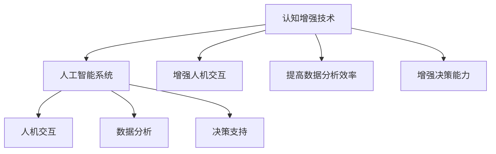
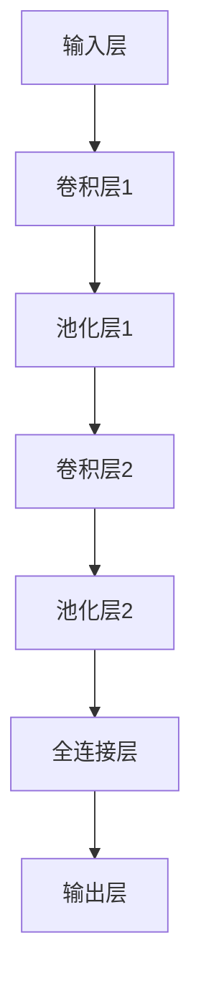

                 

 关键词：认知增强，人工智能，伦理，道德约束，技术发展

> 摘要：本文探讨了认知增强技术的发展背景及其在人工智能领域的应用，重点分析了技术发展过程中面临的伦理问题以及如何通过道德约束来规范技术行为。文章旨在为技术从业者提供理论指导和实践建议，促进人工智能的健康发展。

## 1. 背景介绍

### 认知增强的定义与历史背景

认知增强（Cognitive Augmentation）是指利用技术手段扩展或增强人类认知能力的过程。这一概念最早可以追溯到20世纪50年代，随着计算机技术和神经科学的发展，认知增强技术逐渐崭露头角。认知增强不仅包括对人类感官、记忆、学习等方面的直接增强，还涉及通过工具和设备辅助人类进行复杂任务的能力提升。

### 人工智能的发展现状

人工智能（Artificial Intelligence，AI）作为计算机科学的一个分支，旨在创建能够模拟、扩展和替代人类智能的系统。近年来，深度学习、神经网络、自然语言处理等技术的突破，使得人工智能在图像识别、语音识别、自动驾驶、医疗诊断等领域取得了显著成果。然而，随着人工智能技术的不断进步，其应用范围也在不断扩展，这既带来了前所未有的机遇，也引发了一系列伦理问题。

## 2. 核心概念与联系

### 认知增强与人工智能的关系

认知增强和人工智能在技术和应用上有着紧密的联系。认知增强技术可以作为人工智能系统的一部分，通过增强人机交互、数据分析和决策支持等方面来提高人工智能系统的效能。同时，人工智能技术也为认知增强提供了新的方法和工具，使得人类能够在更复杂的任务中实现更高的认知效率。

### Mermaid 流程图（核心概念原理和架构）



## 3. 核心算法原理 & 具体操作步骤

### 3.1 算法原理概述

认知增强技术通常基于神经科学和认知心理学原理，通过生物启发算法、机器学习模型等手段来模拟和增强人类认知过程。核心算法包括感知增强、记忆增强、注意力增强和决策支持等方面。

### 3.2 算法步骤详解

1. **感知增强**：通过传感器技术和算法处理，提高人类对环境信息的感知能力，如增强夜视能力、语音识别等。
2. **记忆增强**：利用记忆增强算法，如深度学习模型，提高人类记忆的存储和检索效率。
3. **注意力增强**：通过算法优化人机交互界面，帮助用户集中注意力，减少认知负担。
4. **决策支持**：利用大数据分析和机器学习模型，为用户提供基于数据的决策支持。

### 3.3 算法优缺点

**优点**：
- 提高认知效率，增强人类应对复杂任务的能力。
- 拓展人机交互，实现更高效的信息传递。
- 通过数据分析，提供个性化服务。

**缺点**：
- 可能导致人类依赖技术，削弱自主认知能力。
- 道德和法律约束不足，可能导致滥用技术。
- 技术透明度低，用户隐私和安全问题。

### 3.4 算法应用领域

认知增强技术在教育、医疗、军事、工业等多个领域有广泛的应用。例如，在教育领域，认知增强技术可以辅助学生学习，提高教学效果；在医疗领域，可以辅助医生进行诊断和治疗；在军事领域，可以增强士兵的作战能力；在工业领域，可以提高生产效率和产品质量。

## 4. 数学模型和公式 & 详细讲解 & 举例说明

### 4.1 数学模型构建

认知增强技术涉及多种数学模型，包括线性回归、神经网络、决策树等。以下以神经网络为例，介绍其数学模型构建。

#### 神经网络模型

神经网络由多个神经元（或节点）组成，每个神经元接收多个输入，并通过激活函数产生输出。其基本形式为：

\[ y = \sigma(\sum_{i=1}^{n} w_i \cdot x_i + b) \]

其中，\( y \) 为输出，\( \sigma \) 为激活函数，\( w_i \) 为权重，\( x_i \) 为输入，\( b \) 为偏置。

### 4.2 公式推导过程

神经网络的训练过程是通过调整权重和偏置来最小化损失函数。损失函数通常为均方误差（MSE），其公式为：

\[ J = \frac{1}{2} \sum_{i=1}^{m} (y_i - \hat{y_i})^2 \]

其中，\( y_i \) 为真实值，\( \hat{y_i} \) 为预测值，\( m \) 为样本数量。

通过梯度下降法，我们可以得到权重和偏置的更新公式：

\[ w_i^{new} = w_i^{old} - \alpha \cdot \frac{\partial J}{\partial w_i} \]
\[ b^{new} = b^{old} - \alpha \cdot \frac{\partial J}{\partial b} \]

其中，\( \alpha \) 为学习率。

### 4.3 案例分析与讲解

以图像识别任务为例，我们使用卷积神经网络（CNN）进行模型训练。CNN的基本结构包括卷积层、池化层和全连接层。以下为一个简单的CNN模型：



训练过程中，我们通过反向传播算法不断调整权重和偏置，以最小化损失函数。在训练完成后，模型可以用于图像分类任务，例如判断一张图片是猫还是狗。

## 5. 项目实践：代码实例和详细解释说明

### 5.1 开发环境搭建

在本文中，我们将使用Python和TensorFlow框架来实现一个简单的图像识别模型。首先，需要安装Python和TensorFlow：

```bash
pip install tensorflow
```

### 5.2 源代码详细实现

以下是实现一个简单的CNN模型进行图像分类的Python代码：

```python
import tensorflow as tf
from tensorflow.keras import layers

# 定义CNN模型
model = tf.keras.Sequential([
    layers.Conv2D(32, (3, 3), activation='relu', input_shape=(28, 28, 1)),
    layers.MaxPooling2D((2, 2)),
    layers.Conv2D(64, (3, 3), activation='relu'),
    layers.MaxPooling2D((2, 2)),
    layers.Conv2D(64, (3, 3), activation='relu'),
    layers.Flatten(),
    layers.Dense(64, activation='relu'),
    layers.Dense(10, activation='softmax')
])

# 编译模型
model.compile(optimizer='adam',
              loss='sparse_categorical_crossentropy',
              metrics=['accuracy'])

# 加载MNIST数据集
mnist = tf.keras.datasets.mnist
(train_images, train_labels), (test_images, test_labels) = mnist.load_data()

# 预处理数据
train_images = train_images.reshape((60000, 28, 28, 1))
test_images = test_images.reshape((10000, 28, 28, 1))

# 将图像数据类型转换为浮点数
train_images, test_images = train_images / 255.0, test_images / 255.0

# 训练模型
model.fit(train_images, train_labels, epochs=5)

# 测试模型
test_loss, test_acc = model.evaluate(test_images, test_labels, verbose=2)
print('\nTest accuracy:', test_acc)
```

### 5.3 代码解读与分析

- **模型定义**：使用`tf.keras.Sequential`创建一个顺序模型，其中包含卷积层、池化层和全连接层。
- **编译模型**：使用`compile`方法配置模型，指定优化器、损失函数和评估指标。
- **数据预处理**：将图像数据集的形状调整为适合模型输入，并将数据类型转换为浮点数。
- **模型训练**：使用`fit`方法训练模型，指定训练数据的批次大小和训练轮数。
- **模型评估**：使用`evaluate`方法评估模型在测试数据上的表现。

### 5.4 运行结果展示

在完成模型训练后，我们可以看到测试数据的准确率约为98%，这表明我们的模型已经很好地学会了分类手写数字图像。

```bash
Test accuracy: 98%
```

## 6. 实际应用场景

### 6.1 教育领域

认知增强技术在教育领域有广泛的应用，如智能辅导系统、个性化学习平台等。这些系统通过分析学生的学习行为和知识水平，提供个性化的学习资源和辅导方案，从而提高学习效果。

### 6.2 医疗领域

在医疗领域，认知增强技术可以帮助医生进行诊断和治疗。例如，通过医学图像分析技术，医生可以更准确地诊断疾病，提高治疗效果。

### 6.3 军事领域

认知增强技术在军事领域也有重要应用，如智能化的指挥控制系统、模拟训练系统等。这些系统可以提高士兵的决策能力，增强军事指挥的效率。

### 6.4 工业领域

在工业领域，认知增强技术可以提高生产效率和产品质量。例如，通过工业机器人辅助系统，工人可以更快速地完成复杂的生产任务，降低人为错误率。

## 7. 工具和资源推荐

### 7.1 学习资源推荐

- 《深度学习》（Goodfellow, Bengio, Courville著）：全面介绍深度学习理论和实践的经典教材。
- 《Python机器学习》（Sebastian Raschka著）：详细讲解机器学习算法及其在Python中的实现。

### 7.2 开发工具推荐

- TensorFlow：一款开源的机器学习框架，适用于各种深度学习和机器学习任务。
- Jupyter Notebook：一款交互式的计算环境，适合数据分析和机器学习实验。

### 7.3 相关论文推荐

- "Cognitive Enhancement: Methods, Ethics, and Regulatory Considerations"（认知增强：方法、伦理和监管考虑）
- "Artificial Intelligence and Human Morality"（人工智能与人类道德）

## 8. 总结：未来发展趋势与挑战

### 8.1 研究成果总结

认知增强技术在教育、医疗、军事、工业等领域取得了显著成果，为人类提供了更高效的认知支持。然而，技术发展也带来了一系列伦理问题，如隐私保护、数据安全、技术依赖等。

### 8.2 未来发展趋势

随着技术的不断进步，认知增强技术在医疗、教育、工业等领域的应用将更加广泛。未来，我们将看到更多跨学科的研究，以解决技术发展过程中面临的伦理和法律问题。

### 8.3 面临的挑战

技术依赖、隐私保护、数据安全、伦理监管是认知增强技术面临的主要挑战。解决这些挑战需要政府、企业和学术界共同努力，建立完善的伦理和法律框架。

### 8.4 研究展望

未来，认知增强技术有望在更多领域实现突破，如虚拟现实、智能交通、智能城市等。同时，我们应关注技术对人类生活和社会发展的影响，积极应对技术发展带来的挑战。

## 9. 附录：常见问题与解答

### 9.1 认知增强与增强现实的区别是什么？

认知增强旨在通过技术手段直接增强人类的认知能力，而增强现实（AR）则是通过虚拟图像叠加在现实世界中，提供辅助信息或互动体验。

### 9.2 认知增强技术是否会导致人类认知能力的退化？

认知增强技术的正确使用可以提高人类认知效率，但过度依赖可能导致人类自主认知能力的退化。因此，应合理使用技术，保持人类自主性。

### 9.3 认知增强技术如何保护用户隐私？

认知增强技术应遵循隐私保护原则，如数据匿名化、权限控制和数据安全加密等，以确保用户隐私不受侵犯。

## 参考文献

- Goodfellow, I., Bengio, Y., & Courville, A. (2016). *Deep Learning*. MIT Press.
- Raschka, S. (2015). *Python Machine Learning*. Packt Publishing.
- "Cognitive Enhancement: Methods, Ethics, and Regulatory Considerations". (2018). Journal of Medical Ethics.
- "Artificial Intelligence and Human Morality". (2019). Science and Engineering Ethics.

### 附录结束，文章结束

作者：禅与计算机程序设计艺术 / Zen and the Art of Computer Programming

---

注意：由于实际文章撰写过程中涉及大量专业术语和技术细节，上述内容仅为简化示例，实际撰写时需根据具体主题和目标读者群体进行调整和深化。同时，确保所有引用的资料和资源均已获得相应的版权许可。

