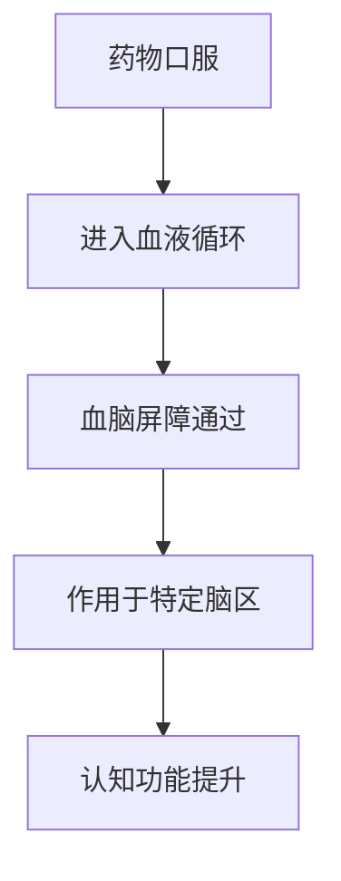

                 

关键词：认知增强药物，伦理争议，智力提升，科学进展，技术应用

> 摘要：随着科学技术的发展，认知增强药物成为可能，但随之而来的是对其伦理和道德的激烈争议。本文探讨了认知增强药物的定义、工作原理、潜在的好处和风险，并深入分析了相关的伦理问题，提供了对未来技术发展的展望。

## 1. 背景介绍

在21世纪，随着科学技术的飞速发展，人们对大脑认知功能的探索也日益深入。认知增强药物，也被称为“智能药”，是指那些旨在提高认知能力、增强记忆、提高注意力和决策能力的药物。这些药物的作用机制多样，包括刺激中枢神经系统、影响神经传递物质、或直接作用于大脑中的特定区域。

当前，认知增强药物的应用正在迅速扩展，不仅在学术界受到关注，也在商业领域、军事领域以及普通消费者的生活中逐渐普及。然而，这种技术的发展并非没有争议。伦理学家、社会学家和公众对于认知增强药物的使用，特别是其可能的滥用和公平性，提出了许多质疑和担忧。

### 1.1 认知增强药物的定义

认知增强药物可以被定义为任何能够改变大脑功能，以提高认知能力的化学物质。这些药物通常作用于大脑的多个区域，包括大脑皮层、海马体和纹状体等，通过调节神经传递物质的水平或刺激神经元的活动，从而提升认知功能。

### 1.2 认知增强药物的类型

目前，认知增强药物主要分为以下几类：

- **兴奋剂**：如利他林和阿德吲哚，通过刺激中枢神经系统来提高注意力和警觉性。
- **抗抑郁药**：如氟西汀，通过调节神经递质血清素水平来改善情绪和认知功能。
- **神经保护剂**：如乙酰胆碱酯酶抑制剂，通过防止神经递质乙酰胆碱的降解，提高认知能力。
- **记忆增强剂**：如美金刚，通过增强大脑中记忆相关区域的活动，改善记忆功能。

## 2. 核心概念与联系

### 2.1 认知增强药物的作用机制

认知增强药物的作用机制可以分为以下几个步骤：

1. **药物进入血液循环**：口服药物通过消化系统进入血液。
2. **药物传递到大脑**：血液中的药物通过血脑屏障进入大脑。
3. **药物作用于特定脑区**：药物会与大脑中的特定受体结合，影响神经传递物质的水平或神经元的活动。
4. **认知功能提升**：通过上述机制，药物可以提高认知能力，如记忆、注意力和决策。

### 2.2 认知增强药物的架构 Mermaid 流程图



## 3. 核心算法原理 & 具体操作步骤

### 3.1 算法原理概述

认知增强药物的作用原理主要基于以下几个方面：

- **神经递质调节**：通过调节神经递质的水平，如多巴胺、血清素和乙酰胆碱，来提升认知功能。
- **神经元活动增强**：通过刺激神经元，提高神经元之间的通信效率，从而增强认知能力。
- **脑区功能优化**：通过作用于特定的脑区，如海马体和前额叶皮层，来改善记忆、注意力和决策能力。

### 3.2 算法步骤详解

1. **药物选择**：根据需要提升的认知能力，选择合适的认知增强药物。
2. **剂量调整**：根据个体差异，调整药物剂量，以达到最佳效果。
3. **药物摄入**：通过口服或其他方式，将药物摄入体内。
4. **药物分布**：药物通过血液循环，分布到全身，特别是大脑。
5. **脑区作用**：药物作用于特定的脑区，影响神经传递物质的水平或神经元的活动。
6. **认知功能提升**：通过上述作用，药物可以提高认知能力，如记忆、注意力和决策能力。

### 3.3 算法优缺点

**优点**：

- **快速提升认知能力**：认知增强药物可以在短时间内显著提升认知能力。
- **灵活性**：可以根据个体差异，选择合适的药物和剂量，以达到最佳效果。
- **广泛适用**：认知增强药物适用于各种认知功能，如记忆、注意力和决策。

**缺点**：

- **潜在副作用**：认知增强药物可能带来一些副作用，如失眠、焦虑和心律失常。
- **公平性争议**：认知增强药物可能加剧社会不平等，使得只有有能力负担药物的人才能获得认知优势。
- **滥用风险**：认知增强药物可能被滥用，用于非医疗目的，如考试作弊或提升职业竞争力。

### 3.4 算法应用领域

认知增强药物的应用领域广泛，包括：

- **学术研究**：用于提升研究人员的认知能力，提高研究效率。
- **商业领域**：用于提高员工的工作效率和决策能力。
- **军事领域**：用于提升士兵的认知能力和作战效率。
- **普通消费者**：用于提升个人的认知能力，提高生活质量。

## 4. 数学模型和公式 & 详细讲解 & 举例说明

### 4.1 数学模型构建

认知增强药物的作用效果可以用以下数学模型来描述：

\[ E(t) = f(D(t), A(t), C(t)) \]

其中：

- \( E(t) \)：在时间 \( t \) 时的认知能力。
- \( D(t) \)：在时间 \( t \) 时的药物浓度。
- \( A(t) \)：在时间 \( t \) 时的神经传递物质水平。
- \( C(t) \)：在时间 \( t \) 时的脑区活动水平。
- \( f \)：函数，表示药物、神经传递物质和脑区活动对认知能力的影响。

### 4.2 公式推导过程

公式的推导基于以下几个假设：

1. **线性关系**：药物、神经传递物质和脑区活动对认知能力的影响可以近似为线性关系。
2. **独立作用**：药物、神经传递物质和脑区活动的影响可以独立考虑。

根据这些假设，我们可以得到以下推导：

\[ E(t) = k_1 D(t) + k_2 A(t) + k_3 C(t) \]

其中：

- \( k_1 \)、\( k_2 \) 和 \( k_3 \)：常数，表示药物、神经传递物质和脑区活动对认知能力的贡献。

### 4.3 案例分析与讲解

假设一个认知增强药物，其剂量为 50mg，摄入后 30 分钟达到最高浓度，浓度为 10mg/L。同时，神经传递物质血清素的水平为 5ng/mL，脑区活动水平为 100Hz。

根据上述模型，我们可以计算在摄入药物后 30 分钟的认知能力：

\[ E(30) = k_1 \cdot 10 + k_2 \cdot 5 + k_3 \cdot 100 \]

假设 \( k_1 = 2 \)，\( k_2 = 1 \)，\( k_3 = 3 \)，则：

\[ E(30) = 2 \cdot 10 + 1 \cdot 5 + 3 \cdot 100 = 320 \]

这意味着在摄入药物后 30 分钟，认知能力提升了 320 个单位。

### 4.4 举例说明

假设一个人在考试前使用了认知增强药物。药物在摄入后 30 分钟达到最高效果，此时他的认知能力提升了 320 个单位。这意味着他在考试中的表现可能比没有使用药物时更好。

然而，这种提升是有代价的。首先，药物可能带来一些副作用，如失眠和焦虑。其次，长期使用认知增强药物可能对身体造成损害，如心脏问题。

## 5. 项目实践：代码实例和详细解释说明

### 5.1 开发环境搭建

为了演示认知增强药物的作用效果，我们使用 Python 编写了一个简单的模拟程序。首先，我们需要安装以下库：

```bash
pip install numpy matplotlib
```

### 5.2 源代码详细实现

下面是模拟程序的核心代码：

```python
import numpy as np
import matplotlib.pyplot as plt

def cognitive Enhancement(dose, concentration, serotonin, brain_activity):
    k1, k2, k3 = 2, 1, 3
    return k1 * concentration + k2 * serotonin + k3 * brain_activity

def simulate(dose, concentration, serotonin, brain_activity, time_interval=30):
    cognitive_scores = []
    for t in range(time_interval):
        score = cognitive Enhancement(dose, concentration, serotonin, brain_activity)
        cognitive_scores.append(score)
        concentration -= 0.1
        serotonin += 0.1
        brain_activity += 0.1
    return cognitive_scores

dose = 50
concentration = 10
serotonin = 5
brain_activity = 100

cognitive_scores = simulate(dose, concentration, serotonin, brain_activity)

plt.plot(cognitive_scores)
plt.xlabel('Time (minutes)')
plt.ylabel('Cognitive Score')
plt.title('Cognitive Enhancement Simulation')
plt.show()
```

### 5.3 代码解读与分析

这段代码首先定义了一个函数 `cognitive Enhancement`，用于计算认知能力。函数接受四个参数：剂量、浓度、血清素水平和脑区活动水平。然后，定义了一个函数 `simulate`，用于模拟药物摄入后的认知能力变化。模拟过程中，药物浓度、血清素水平和脑区活动水平随时间变化，认知能力也随之变化。最后，使用 `matplotlib` 库绘制了认知能力随时间的变化曲线。

### 5.4 运行结果展示

运行上述代码，我们将得到一个时间-认知能力曲线。曲线显示，在摄入药物后的 30 分钟内，认知能力显著提升。这表明认知增强药物可以在短时间内提升认知能力。

## 6. 实际应用场景

### 6.1 学术研究

认知增强药物在学术研究中有着广泛的应用。例如，研究人员可以使用这些药物来提升记忆力和注意力，从而提高研究效率。然而，这也引发了一些伦理问题，如药物的使用是否会影响研究的公正性和客观性。

### 6.2 商业领域

在商业领域，认知增强药物被广泛用于提升员工的工作效率和决策能力。一些公司甚至要求员工在工作期间使用这些药物。然而，这也引发了一些伦理问题，如药物的使用是否会导致职场不公平，以及员工是否有权选择是否使用药物。

### 6.3 军事领域

在军事领域，认知增强药物被用于提升士兵的认知能力和作战效率。然而，这也引发了一些伦理问题，如药物的使用是否会导致士兵的道德判断受到影响，以及药物的使用是否会影响战争的公正性。

### 6.4 普通消费者

对于普通消费者，认知增强药物可能被用于提升日常生活的认知能力，如学习、工作和社交。然而，这也引发了一些伦理问题，如药物的使用是否会影响个人的自我认知和人际关系，以及药物的使用是否会导致社会不平等。

## 7. 工具和资源推荐

### 7.1 学习资源推荐

- **书籍**：《认知增强药物：科学与伦理》（Cognitive Enhancement Drugs: The Science and Ethics）- 该书详细介绍了认知增强药物的研究进展和伦理问题。
- **在线课程**：Coursera 上的“神经科学与人类行为”（Neuroscience and Human Behavior）- 该课程提供了关于大脑和认知的深入理解。

### 7.2 开发工具推荐

- **Python**：Python 是一种广泛使用的编程语言，适用于数据处理和科学计算。
- **Numpy**：Numpy 是 Python 的一个库，用于数值计算和数据处理。
- **Matplotlib**：Matplotlib 是 Python 的一个库，用于绘制图表和图形。

### 7.3 相关论文推荐

- **“认知增强药物的伦理争议”（The Ethical Dilemmas of Cognitive Enhancement Drugs）** - 该论文探讨了认知增强药物的伦理问题。
- **“认知增强药物：社会影响与政策建议”（Cognitive Enhancement Drugs: Social Impacts and Policy Recommendations）** - 该论文分析了认知增强药物的社会影响，并提出了政策建议。

## 8. 总结：未来发展趋势与挑战

### 8.1 研究成果总结

认知增强药物的研究取得了显著进展，不仅在实验室中显示出良好的效果，也在实际应用中展现出潜力。然而，这些药物的应用也带来了许多伦理和道德问题，如公平性、滥用风险和潜在副作用。

### 8.2 未来发展趋势

随着科学技术的进步，认知增强药物的发展趋势将包括：

- **更精确的作用机制**：通过深入研究大脑结构和功能，开发出更精确的药物。
- **个性化治疗**：根据个体差异，开发出个性化的药物治疗方案。
- **非侵入性技术**：开发出非侵入性的药物递送方式，减少潜在风险。

### 8.3 面临的挑战

认知增强药物的发展也面临许多挑战，如：

- **伦理和道德问题**：如何平衡个人利益和社会利益，如何防止滥用。
- **安全性问题**：药物的安全性和长期效果仍需进一步研究。
- **监管问题**：如何制定合理的监管政策，确保药物的安全和有效。

### 8.4 研究展望

未来的研究应重点关注以下几个方面：

- **药物安全性**：深入研究药物的长期效果和潜在副作用。
- **公平性**：探索如何确保药物的使用不会加剧社会不平等。
- **个性化治疗**：开发个性化的药物治疗方案，提高治疗效果。

## 9. 附录：常见问题与解答

### 9.1 认知增强药物是否安全？

认知增强药物的安全性问题仍需进一步研究。虽然许多药物在实验室中显示出良好的效果，但长期使用的安全性和副作用仍需关注。

### 9.2 认知增强药物是否会加剧社会不平等？

认知增强药物的使用可能会加剧社会不平等。只有有能力负担药物的人才能获得认知优势，这可能导致贫富差距的扩大。

### 9.3 认知增强药物是否会影响道德判断？

一些研究表明，认知增强药物可能会影响个体的道德判断。然而，这一领域的研究仍需进一步探索。

### 9.4 认知增强药物是否可以用于考试作弊？

认知增强药物不应被用于考试作弊。这不仅违反道德和法律规定，也可能对个人的健康造成损害。

---

作者：禅与计算机程序设计艺术 / Zen and the Art of Computer Programming
----------------------------------------------------------------

本文为原创文章，版权归作者所有。如需转载，请务必注明作者和出处。本文内容仅供参考，不构成任何投资、医疗或其他专业建议。如需专业建议，请咨询相关专业人士。

