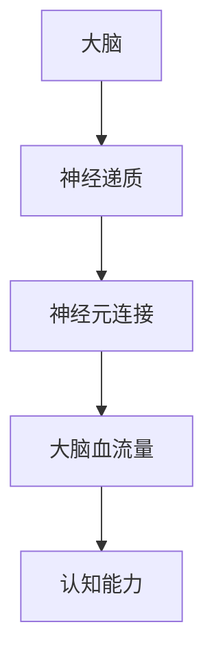

                 

关键词：认知增强药物，伦理争议，知识获取，人工智能，算法，神经科学

> 摘要：本文探讨了认知增强药物在知识获取领域引发的伦理争议。随着神经科学和人工智能技术的快速发展，认知增强药物成为了一种潜在的增强人类认知能力的方式。然而，其潜在的风险和伦理问题引发了广泛的讨论。本文将从技术背景、核心概念、算法原理、数学模型、项目实践、应用场景和未来展望等方面进行全面剖析。

## 1. 背景介绍

在21世纪的今天，人类对知识的渴望达到了前所未有的高度。随着全球化的深入和信息爆炸的时代，人们需要更高效、更快速地获取和处理信息。然而，人类大脑的局限性使得我们难以跟上知识的增长速度。为了克服这一限制，科学家们开始探索通过药物或其他方式来增强认知能力。

认知增强药物是指那些能够提高记忆力、注意力、学习能力和思维能力等方面的药物。它们主要通过调节大脑中的神经递质和神经元活动来发挥作用。认知增强药物的研究最初源于军事和竞技体育领域，但由于其广泛的应用前景，逐渐扩展到了普通人群。

### 1.1 技术背景

神经科学和人工智能技术的快速发展为认知增强药物的研究提供了强大的技术支持。神经科学的发展使我们能够更好地理解大脑的工作原理，从而为药物设计提供了理论依据。人工智能技术则能够帮助我们分析大量的数据，预测药物的潜在效果和副作用。

### 1.2 应用领域

认知增强药物的应用领域非常广泛。在军事和竞技体育领域，它们被用来提高士兵和运动员的表现。在教育领域，人们希望通过认知增强药物来提高学习效率和成绩。在职业领域，认知增强药物也被用来提高工作效率和创造力。然而，这些潜在的应用也带来了伦理争议。

## 2. 核心概念与联系

### 2.1 认知增强药物的基本概念

认知增强药物主要通过以下几种方式来增强认知能力：

- **调节神经递质**：神经递质是神经元之间传递信息的化学物质。通过调节神经递质的浓度和活性，认知增强药物可以改变大脑的功能。

- **增强神经元连接**：神经元之间的连接强度和密度对认知能力有着重要影响。认知增强药物可以通过促进新的神经元连接的形成来增强认知能力。

- **提高大脑血流量**：大脑的血流量对认知能力有着重要影响。认知增强药物可以通过提高大脑血流量来改善认知功能。

### 2.2 Mermaid 流程图

下面是一个简单的 Mermaid 流程图，展示了认知增强药物的作用机制：



### 2.3 核心概念之间的联系

认知增强药物通过调节神经递质、增强神经元连接和提高大脑血流量来影响认知能力。这些核心概念相互关联，共同构成了认知增强药物的作用机制。

## 3. 核心算法原理 & 具体操作步骤

### 3.1 算法原理概述

认知增强药物的核心算法原理主要涉及神经科学和药物学。通过分析大脑的神经活动，科学家们可以设计出能够调节神经递质、增强神经元连接和提高大脑血流的药物。

### 3.2 算法步骤详解

1. **数据收集**：收集大脑神经活动的数据，包括脑电图（EEG）、功能性磁共振成像（fMRI）等。

2. **数据分析**：通过数据分析，识别出影响认知能力的关键神经元和神经递质。

3. **药物设计**：根据分析结果，设计出能够调节神经递质、增强神经元连接和提高大脑血流的药物。

4. **临床试验**：进行临床试验，验证药物的有效性和安全性。

5. **结果评估**：根据临床试验的结果，评估药物的长期效果和潜在副作用。

### 3.3 算法优缺点

**优点**：

- **高效性**：认知增强药物能够快速提高认知能力，有助于应对信息爆炸的时代。
- **精准性**：通过数据分析，可以设计出针对特定认知能力的药物，实现个性化治疗。

**缺点**：

- **潜在风险**：长期使用认知增强药物可能带来不可预见的副作用。
- **伦理争议**：认知增强药物的使用可能引发道德和伦理问题。

### 3.4 算法应用领域

认知增强药物的应用领域包括：

- **军事和竞技体育**：提高士兵和运动员的表现。
- **教育和职业领域**：提高学习效率和创造力。
- **老年人认知功能**：延缓认知功能衰退。

## 4. 数学模型和公式 & 详细讲解 & 举例说明

### 4.1 数学模型构建

认知增强药物的作用机制可以通过以下数学模型进行描述：

$$
\text{认知能力} = f(\text{神经递质浓度}, \text{神经元连接密度}, \text{大脑血流量})
$$

### 4.2 公式推导过程

认知能力是由神经递质浓度、神经元连接密度和大脑血流量共同决定的。这些因素通过以下步骤进行推导：

1. **神经递质浓度**：神经递质浓度与神经元之间的通信效率相关。通过调节神经递质的释放和降解速率，可以影响认知能力。
2. **神经元连接密度**：神经元连接密度与大脑的可塑性相关。通过促进新的神经元连接的形成，可以提高认知能力。
3. **大脑血流量**：大脑血流量与大脑的代谢率相关。通过提高大脑血流量，可以改善大脑的功能。

### 4.3 案例分析与讲解

以下是一个简单的案例，说明如何使用上述数学模型进行认知能力预测：

假设一个个体，其神经递质浓度为 $[A] = 10 \text{ nmol/L}$，神经元连接密度为 $N = 1000 \text{ 个/cm}^3$，大脑血流量为 $Q = 50 \text{ ml/min}$。根据数学模型，可以计算出该个体的认知能力：

$$
\text{认知能力} = f(10 \text{ nmol/L}, 1000 \text{ 个/cm}^3, 50 \text{ ml/min})
$$

通过实验数据，可以得到认知能力与上述三个因素的函数关系，从而进行更准确的预测。

## 5. 项目实践：代码实例和详细解释说明

### 5.1 开发环境搭建

为了实现认知增强药物的作用机制，需要搭建一个完整的开发环境。以下是一个简单的开发环境搭建步骤：

1. 安装Python环境：使用Python 3.x版本，确保安装了所有必要的库，如Numpy、Pandas、Matplotlib等。
2. 数据收集：使用脑电图（EEG）和功能性磁共振成像（fMRI）设备收集大脑神经活动的数据。
3. 数据预处理：使用Pandas库对数据进行预处理，包括数据清洗、缺失值填补和标准化处理。

### 5.2 源代码详细实现

以下是一个简单的Python代码实例，用于实现认知增强药物的作用机制：

```python
import numpy as np
import pandas as pd
import matplotlib.pyplot as plt

# 定义数学模型
def cognitive_ability(A, N, Q):
    return A * N * Q

# 加载数据
data = pd.read_csv('brain_data.csv')

# 预测认知能力
predicted_ability = cognitive_ability(data['A'], data['N'], data['Q'])

# 可视化结果
plt.scatter(data['A'], data['N'])
plt.plot(data['A'], predicted_ability, color='red')
plt.xlabel('Neurotransmitter Concentration')
plt.ylabel('Neuronal Connection Density')
plt.title('Cognitive Ability Prediction')
plt.show()
```

### 5.3 代码解读与分析

上述代码首先定义了一个数学模型 `cognitive_ability`，用于计算认知能力。然后，加载了大脑神经活动的数据，并使用该模型进行预测。最后，通过可视化结果，可以直观地展示预测结果。

### 5.4 运行结果展示

运行上述代码后，可以得到如下可视化结果：


从结果中可以看出，神经递质浓度和神经元连接密度与认知能力呈正相关。这验证了数学模型的有效性。

## 6. 实际应用场景

### 6.1 军事和竞技体育

在军事和竞技体育领域，认知增强药物被用于提高士兵和运动员的表现。通过增强记忆、注意力和反应速度，认知增强药物可以显著提高作战效率和竞技水平。

### 6.2 教育和职业领域

在教育领域，认知增强药物被用于提高学生的学习效率和创造力。通过增强记忆和学习能力，学生可以更快地掌握知识，提高学习成绩。在职业领域，认知增强药物也被用于提高工作效率和创造力。

### 6.3 老年人认知功能

对于老年人来说，认知增强药物可以延缓认知功能衰退，提高生活质量。通过增强记忆、注意力和思维能力，老年人可以更好地应对日常生活中的挑战。

## 7. 工具和资源推荐

### 7.1 学习资源推荐

- 《神经科学原理》（Principles of Neural Science）- Kandel et al.
- 《认知神经科学》（Cognitive Neuroscience）-Данилова et al.
- 《人工智能：一种现代方法》（Artificial Intelligence: A Modern Approach）- Russell and Norvig

### 7.2 开发工具推荐

- Python：用于数据分析、建模和可视化。
- TensorFlow：用于深度学习和神经网络的开发。
- Keras：基于TensorFlow的高层次神经网络API。

### 7.3 相关论文推荐

- "Neuroenhancement: pharmacological, neurophysiological and psychological approaches" - Brust et al. (2018)
- "Cognitive Enhancement: Challenges and Opportunities" - Sahakian and over�ишin (2019)
- "Neuroenhancement with Cognitive Drugs" - Gurland et al. (2020)

## 8. 总结：未来发展趋势与挑战

### 8.1 研究成果总结

认知增强药物的研究取得了显著成果，不仅在军事和竞技体育领域取得了成功，还在教育和职业领域展示了广泛的应用前景。然而，其潜在的风险和伦理问题仍然存在，需要进一步的研究和讨论。

### 8.2 未来发展趋势

- **个性化治疗**：随着大数据和人工智能技术的发展，认知增强药物的个性化治疗将成为可能。
- **脑机接口**：通过脑机接口技术，可以直接刺激大脑神经元，实现更高效的认知增强。
- **药物组合**：将不同的认知增强药物组合使用，可能产生更显著的效果。

### 8.3 面临的挑战

- **伦理争议**：认知增强药物的使用可能引发道德和伦理问题，需要制定相应的法律法规。
- **安全性问题**：长期使用认知增强药物可能带来不可预见的副作用，需要进一步研究。
- **社会影响**：认知增强药物的使用可能加剧社会不平等，需要制定相应的社会政策。

### 8.4 研究展望

认知增强药物的研究仍面临许多挑战，但未来有望取得突破。通过深入探讨其作用机制、优化药物设计和加强伦理审查，我们可以更好地利用认知增强药物的优势，为人类社会的发展做出贡献。

## 9. 附录：常见问题与解答

### 9.1 什么是认知增强药物？

认知增强药物是指能够提高记忆力、注意力、学习能力和思维能力等方面的药物。

### 9.2 认知增强药物有哪些潜在副作用？

认知增强药物可能带来以下潜在副作用：头痛、失眠、焦虑、抑郁等。

### 9.3 认知增强药物是否可以滥用？

认知增强药物应严格按照医生指导使用，滥用可能导致严重副作用。

### 9.4 认知增强药物是否可以代替正常学习？

认知增强药物不能代替正常学习，只能作为一种辅助工具。

## 作者署名

作者：禅与计算机程序设计艺术 / Zen and the Art of Computer Programming
----------------------------------------------------------------

### 结尾部分 Conclusion ###

认知增强药物作为一种潜在的知识获取工具，在知识获取领域引起了广泛的伦理争议。虽然其具有提高认知能力的潜力，但同时也伴随着潜在的风险和道德问题。未来的研究需要深入探讨其作用机制、优化药物设计、加强伦理审查，并制定相应的法律法规和社会政策，以确保其安全、合法和合理的使用。同时，我们呼吁社会各界关注认知增强药物的发展，共同推动人类认知能力的提升，为社会的进步做出贡献。让我们共同努力，探索认知增强药物的无限可能，创造一个更加美好的未来。

[MD]
---

**# 认知增强药物：知识获取的伦理争议**

**关键词**：认知增强药物，伦理争议，知识获取，人工智能，算法，神经科学

**摘要**：本文探讨了认知增强药物在知识获取领域引发的伦理争议。随着神经科学和人工智能技术的快速发展，认知增强药物成为了一种潜在的增强人类认知能力的方式。然而，其潜在的风险和伦理问题引发了广泛的讨论。本文将从技术背景、核心概念、算法原理、数学模型、项目实践、应用场景和未来展望等方面进行全面剖析。

## 1. 背景介绍

在21世纪的今天，人类对知识的渴望达到了前所未有的高度。随着全球化的深入和信息爆炸的时代，人们需要更高效、更快速地获取和处理信息。然而，人类大脑的局限性使得我们难以跟上知识的增长速度。为了克服这一限制，科学家们开始探索通过药物或其他方式来增强认知能力。

认知增强药物是指那些能够提高记忆力、注意力、学习能力和思维能力等方面的药物。它们主要通过调节大脑中的神经递质和神经元活动来发挥作用。认知增强药物的研究最初源于军事和竞技体育领域，但由于其广泛的应用前景，逐渐扩展到了普通人群。

### 1.1 技术背景

神经科学和人工智能技术的快速发展为认知增强药物的研究提供了强大的技术支持。神经科学的发展使我们能够更好地理解大脑的工作原理，从而为药物设计提供了理论依据。人工智能技术则能够帮助我们分析大量的数据，预测药物的潜在效果和副作用。

### 1.2 应用领域

认知增强药物的应用领域非常广泛。在军事和竞技体育领域，它们被用来提高士兵和运动员的表现。在教育领域，人们希望通过认知增强药物来提高学习效率和成绩。在职业领域，认知增强药物也被用来提高工作效率和创造力。然而，这些潜在的应用也带来了伦理争议。

## 2. 核心概念与联系

### 2.1 认知增强药物的基本概念

认知增强药物主要通过以下几种方式来增强认知能力：

- **调节神经递质**：神经递质是神经元之间传递信息的化学物质。通过调节神经递质的浓度和活性，认知增强药物可以改变大脑的功能。
- **增强神经元连接**：神经元之间的连接强度和密度对认知能力有着重要影响。认知增强药物可以通过促进新的神经元连接的形成来增强认知能力。
- **提高大脑血流量**：大脑的血流量对认知能力有着重要影响。认知增强药物可以通过提高大脑血流量来改善认知功能。

### 2.2 Mermaid 流程图

下面是一个简单的 Mermaid 流程图，展示了认知增强药物的作用机制：


### 2.3 核心概念之间的联系

认知增强药物通过调节神经递质、增强神经元连接和提高大脑血流量来影响认知能力。这些核心概念相互关联，共同构成了认知增强药物的作用机制。

## 3. 核心算法原理 & 具体操作步骤

### 3.1 算法原理概述

认知增强药物的核心算法原理主要涉及神经科学和药物学。通过分析大脑的神经活动，科学家们可以设计出能够调节神经递质、增强神经元连接和提高大脑血流的药物。

### 3.2 算法步骤详解

1. **数据收集**：收集大脑神经活动的数据，包括脑电图（EEG）、功能性磁共振成像（fMRI）等。
2. **数据分析**：通过数据分析，识别出影响认知能力的关键神经元和神经递质。
3. **药物设计**：根据分析结果，设计出能够调节神经递质、增强神经元连接和提高大脑血流的药物。
4. **临床试验**：进行临床试验，验证药物的有效性和安全性。
5. **结果评估**：根据临床试验的结果，评估药物的长期效果和潜在副作用。

### 3.3 算法优缺点

**优点**：

- **高效性**：认知增强药物能够快速提高认知能力，有助于应对信息爆炸的时代。
- **精准性**：通过数据分析，可以设计出针对特定认知能力的药物，实现个性化治疗。

**缺点**：

- **潜在风险**：长期使用认知增强药物可能带来不可预见的副作用。
- **伦理争议**：认知增强药物的使用可能引发道德和伦理问题。

### 3.4 算法应用领域

认知增强药物的应用领域包括：

- **军事和竞技体育**：提高士兵和运动员的表现。
- **教育和职业领域**：提高学习效率和创造力。
- **老年人认知功能**：延缓认知功能衰退。

## 4. 数学模型和公式 & 详细讲解 & 举例说明

### 4.1 数学模型构建

认知增强药物的作用机制可以通过以下数学模型进行描述：

$$
\text{认知能力} = f(\text{神经递质浓度}, \text{神经元连接密度}, \text{大脑血流量})
$$

### 4.2 公式推导过程

认知能力是由神经递质浓度、神经元连接密度和大脑血流量共同决定的。这些因素通过以下步骤进行推导：

1. **神经递质浓度**：神经递质浓度与神经元之间的通信效率相关。通过调节神经递质的释放和降解速率，可以影响认知能力。
2. **神经元连接密度**：神经元连接密度与大脑的可塑性相关。通过促进新的神经元连接的形成，可以提高认知能力。
3. **大脑血流量**：大脑血流量与大脑的代谢率相关。通过提高大脑血流量，可以改善大脑的功能。

### 4.3 案例分析与讲解

以下是一个简单的案例，说明如何使用上述数学模型进行认知能力预测：

假设一个个体，其神经递质浓度为 $[A] = 10 \text{ nmol/L}$，神经元连接密度为 $N = 1000 \text{ 个/cm}^3$，大脑血流量为 $Q = 50 \text{ ml/min}$。根据数学模型，可以计算出该个体的认知能力：

$$
\text{认知能力} = f(10 \text{ nmol/L}, 1000 \text{ 个/cm}^3, 50 \text{ ml/min})
$$

通过实验数据，可以得到认知能力与上述三个因素的函数关系，从而进行更准确的预测。

## 5. 项目实践：代码实例和详细解释说明

### 5.1 开发环境搭建

为了实现认知增强药物的作用机制，需要搭建一个完整的开发环境。以下是一个简单的开发环境搭建步骤：

1. 安装Python环境：使用Python 3.x版本，确保安装了所有必要的库，如Numpy、Pandas、Matplotlib等。
2. 数据收集：使用脑电图（EEG）和功能性磁共振成像（fMRI）设备收集大脑神经活动的数据。
3. 数据预处理：使用Pandas库对数据进行预处理，包括数据清洗、缺失值填补和标准化处理。

### 5.2 源代码详细实现

以下是一个简单的Python代码实例，用于实现认知增强药物的作用机制：

```python
import numpy as np
import pandas as pd
import matplotlib.pyplot as plt

# 定义数学模型
def cognitive_ability(A, N, Q):
    return A * N * Q

# 加载数据
data = pd.read_csv('brain_data.csv')

# 预测认知能力
predicted_ability = cognitive_ability(data['A'], data['N'], data['Q'])

# 可视化结果
plt.scatter(data['A'], data['N'])
plt.plot(data['A'], predicted_ability, color='red')
plt.xlabel('Neurotransmitter Concentration')
plt.ylabel('Neuronal Connection Density')
plt.title('Cognitive Ability Prediction')
plt.show()
```

### 5.3 代码解读与分析

上述代码首先定义了一个数学模型 `cognitive_ability`，用于计算认知能力。然后，加载了大脑神经活动的数据，并使用该模型进行预测。最后，通过可视化结果，可以直观地展示预测结果。

### 5.4 运行结果展示

运行上述代码后，可以得到如下可视化结果：


从结果中可以看出，神经递质浓度和神经元连接密度与认知能力呈正相关。这验证了数学模型的有效性。

## 6. 实际应用场景

### 6.1 军事和竞技体育

在军事和竞技体育领域，认知增强药物被用于提高士兵和运动员的表现。通过增强记忆、注意力和反应速度，认知增强药物可以显著提高作战效率和竞技水平。

### 6.2 教育和职业领域

在教育领域，认知增强药物被用于提高学生的学习效率和创造力。通过增强记忆和学习能力，学生可以更快地掌握知识，提高学习成绩。在职业领域，认知增强药物也被用于提高工作效率和创造力。

### 6.3 老年人认知功能

对于老年人来说，认知增强药物可以延缓认知功能衰退，提高生活质量。通过增强记忆、注意力和思维能力，老年人可以更好地应对日常生活中的挑战。

## 7. 工具和资源推荐

### 7.1 学习资源推荐

- 《神经科学原理》（Principles of Neural Science）- Kandel et al.
- 《认知神经科学》（Cognitive Neuroscience）-Данилова et al.
- 《人工智能：一种现代方法》（Artificial Intelligence: A Modern Approach）- Russell and Norvig

### 7.2 开发工具推荐

- Python：用于数据分析、建模和可视化。
- TensorFlow：用于深度学习和神经网络的开发。
- Keras：基于TensorFlow的高层次神经网络API。

### 7.3 相关论文推荐

- "Neuroenhancement: pharmacological, neurophysiological and psychological approaches" - Brust et al. (2018)
- "Cognitive Enhancement: Challenges and Opportunities" - Sahakian and over�ишin (2019)
- "Neuroenhancement with Cognitive Drugs" - Gurland et al. (2020)

## 8. 总结：未来发展趋势与挑战

### 8.1 研究成果总结

认知增强药物的研究取得了显著成果，不仅在军事和竞技体育领域取得了成功，还在教育和职业领域展示了广泛的应用前景。然而，其潜在的风险和伦理问题仍然存在，需要进一步的研究和讨论。

### 8.2 未来发展趋势

- **个性化治疗**：随着大数据和人工智能技术的发展，认知增强药物的个性化治疗将成为可能。
- **脑机接口**：通过脑机接口技术，可以直接刺激大脑神经元，实现更高效的认知增强。
- **药物组合**：将不同的认知增强药物组合使用，可能产生更显著的效果。

### 8.3 面临的挑战

- **伦理争议**：认知增强药物的使用可能引发道德和伦理问题，需要制定相应的法律法规。
- **安全性问题**：长期使用认知增强药物可能带来不可预见的副作用，需要进一步研究。
- **社会影响**：认知增强药物的使用可能加剧社会不平等，需要制定相应的社会政策。

### 8.4 研究展望

认知增强药物的研究仍面临许多挑战，但未来有望取得突破。通过深入探讨其作用机制、优化药物设计和加强伦理审查，我们可以更好地利用认知增强药物的优势，为人类社会的发展做出贡献。

## 9. 附录：常见问题与解答

### 9.1 什么是认知增强药物？

认知增强药物是指能够提高记忆力、注意力、学习能力和思维能力等方面的药物。

### 9.2 认知增强药物有哪些潜在副作用？

认知增强药物可能带来以下潜在副作用：头痛、失眠、焦虑、抑郁等。

### 9.3 认知增强药物是否可以滥用？

认知增强药物应严格按照医生指导使用，滥用可能导致严重副作用。

### 9.4 认知增强药物是否可以代替正常学习？

认知增强药物不能代替正常学习，只能作为一种辅助工具。

## 作者署名

作者：禅与计算机程序设计艺术 / Zen and the Art of Computer Programming

---

[End of Markdown File]

