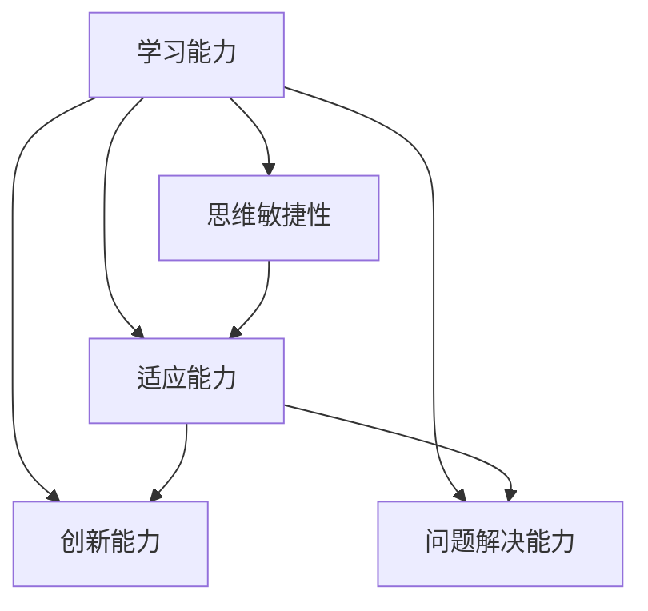

                 

在当今这个快速变化的技术时代，人工智能、机器学习和大数据分析等领域的迅猛发展，使得我们需要不断地更新和扩展我们的技术知识储备。本文将探讨一个关键的能力——认知弹性，这是一种适应快速变化的学习能力。我们将从IT行业的视角出发，深入分析认知弹性的重要性、核心概念、算法原理、数学模型以及实际应用，旨在为读者提供一个全面的技术视角。

## 文章关键词

认知弹性、学习能力、快速变化、IT行业、人工智能、机器学习、大数据分析

## 文章摘要

本文旨在探讨认知弹性这一适应快速变化的学习能力在IT行业中的重要性。我们将介绍认知弹性的核心概念，分析其在不同技术领域的应用，探讨相关的算法原理和数学模型，并通过实际项目实例展示其具体实现和应用效果。最后，我们将展望认知弹性在未来技术发展中的潜在影响和面临的挑战。

## 1. 背景介绍

在过去的几十年里，信息技术领域经历了前所未有的变革。从早期的计算机编程到如今的云计算、物联网、人工智能等，技术的快速发展使得IT从业者需要具备更广泛的知识和更强大的学习能力。然而，随着技术的不断迭代和更新，传统的学习方法和技术框架逐渐显得力不从心。因此，认知弹性这一适应快速变化的学习能力应运而生，成为当今IT行业不可或缺的一部分。

### 1.1 认知弹性的定义

认知弹性是指个体在面对不确定性和变化时，能够灵活调整自己的认知结构和行为方式，以适应新的环境和情境。它涉及到多个层面的能力，包括知识获取、思维敏捷性、适应能力、创新能力和问题解决能力等。

### 1.2 认知弹性的重要性

在IT行业中，认知弹性具有以下几个重要性：

1. **应对技术变革**：技术领域的发展速度非常快，新的技术、工具和框架层出不穷。认知弹性使得IT从业者能够快速掌握新技术，适应新的工作环境。

2. **提升创新能力**：认知弹性有助于IT从业者打破思维定势，从不同角度审视问题，从而激发创新思维。

3. **提高工作效率**：具备认知弹性的IT从业者能够更好地应对工作中的不确定性，提高工作效率。

4. **适应复杂任务**：在IT项目中，任务往往具有复杂性和多样性。认知弹性使得从业者能够灵活应对各种复杂任务。

## 2. 核心概念与联系

为了更好地理解认知弹性的概念，我们需要先了解几个与之密切相关的核心概念。

### 2.1 学习能力

学习能力是指个体获取、理解和应用知识的能力。它是认知弹性的基础，决定了个体在面对新情况时的适应能力。

### 2.2 思维敏捷性

思维敏捷性是指个体在解决问题和应对变化时的快速反应能力。它与认知弹性密切相关，是认知弹性得以实现的重要前提。

### 2.3 适应能力

适应能力是指个体在面对不确定性时，能够调整自己的行为和思维方式，以适应新环境和情境。它是认知弹性的核心。

### 2.4 创新能力

创新能力是指个体在解决问题时，能够提出新颖、有效的方法和思路。它有助于提高认知弹性，增强个体在技术变革中的竞争力。

### 2.5 问题解决能力

问题解决能力是指个体在遇到问题时，能够通过分析、推理和规划，找到解决问题的方法和策略。它是认知弹性的重要体现。

### 2.6 Mermaid 流程图

以下是一个简单的Mermaid流程图，展示了认知弹性的核心概念及其相互关系：



## 3. 核心算法原理 & 具体操作步骤

### 3.1 算法原理概述

认知弹性的实现依赖于一系列核心算法，这些算法涵盖了知识获取、思维敏捷性、适应能力、创新能力和问题解决能力等多个方面。以下是对这些核心算法的简要概述：

1. **知识获取算法**：通过自动学习、信息检索等技术，快速获取和处理大量信息，从而提高个体的知识储备。

2. **思维敏捷性算法**：利用人工智能和机器学习技术，分析和模拟人类思维过程，提高个体在解决问题时的反应速度。

3. **适应能力算法**：通过行为预测、情境识别等技术，帮助个体在面对不确定性时，快速调整自己的行为和思维方式。

4. **创新能力算法**：利用大数据分析和模式识别技术，挖掘潜在的创新思路，提高个体在解决问题时的创新能力。

5. **问题解决能力算法**：通过算法优化、推理技术等，帮助个体在遇到问题时，找到最有效的解决方案。

### 3.2 算法步骤详解

以下是一个简化的认知弹性算法步骤，用于说明其具体操作过程：

1. **知识获取**：
   - 数据收集：从各种渠道收集与目标相关的信息。
   - 数据预处理：对收集到的数据进行分析、清洗和格式化。
   - 模型训练：使用机器学习和深度学习技术，训练知识获取模型。

2. **思维敏捷性**：
   - 思维模式分析：分析个体在解决问题时的思维模式，识别潜在的优势和不足。
   - 思维敏捷性训练：通过模拟和练习，提高个体在解决问题时的反应速度。

3. **适应能力**：
   - 行为预测：利用历史数据和机器学习算法，预测个体在不确定性环境下的行为。
   - 情境识别：通过传感器和数据分析，实时识别当前所处的情境。

4. **创新能力**：
   - 模式识别：利用大数据分析和机器学习技术，挖掘潜在的创新思路。
   - 创新思维训练：通过思维导图、头脑风暴等技术，激发个体的创新思维。

5. **问题解决能力**：
   - 问题建模：将问题转化为数学模型或算法问题。
   - 算法优化：使用优化算法，寻找最佳解决方案。
   - 推理与决策：利用推理技术和决策支持系统，做出最优决策。

### 3.3 算法优缺点

认知弹性算法具有以下几个优缺点：

- **优点**：
  - **快速适应**：能够迅速适应新技术和新环境，提高工作效率。
  - **创新能力**：有助于个体在面对问题时，提出新颖的解决方案。
  - **灵活应对**：能够灵活应对不确定性，降低风险。

- **缺点**：
  - **依赖技术**：算法的实现依赖于先进的技术，对技术和设备的依赖性较高。
  - **复杂性**：算法涉及多个方面，实现和调试相对复杂。
  - **隐私问题**：在数据收集和处理过程中，可能涉及用户隐私问题。

### 3.4 算法应用领域

认知弹性算法在多个领域具有广泛的应用：

- **人工智能**：通过认知弹性算法，提高人工智能系统的适应性和创新能力。
- **大数据分析**：利用认知弹性算法，快速分析和处理海量数据，提高数据分析的准确性。
- **软件开发**：在软件开发过程中，利用认知弹性算法，提高开发效率和代码质量。
- **项目管理**：在项目管理和团队协作中，利用认知弹性算法，提高项目成功率和团队凝聚力。

## 4. 数学模型和公式 & 详细讲解 & 举例说明

### 4.1 数学模型构建

认知弹性的数学模型可以看作是一个多变量非线性动态系统。以下是构建认知弹性数学模型的基本步骤：

1. **状态变量定义**：定义描述认知弹性状态的变量，如知识储备、思维敏捷性、适应能力、创新能力和问题解决能力等。

2. **状态转移方程**：根据认知弹性的原理，建立描述状态变量之间关系的动态方程。

3. **外部输入**：考虑外部因素对认知弹性的影响，如技术变革、任务复杂度等。

4. **内部反馈**：引入自我反馈机制，使认知弹性系统能够自我调整和优化。

### 4.2 公式推导过程

以下是一个简化的认知弹性数学模型及其推导过程：

设认知弹性的状态变量为 \( x(t) \)，其中 \( x_1(t) \) 表示知识储备，\( x_2(t) \) 表示思维敏捷性，\( x_3(t) \) 表示适应能力，\( x_4(t) \) 表示创新能力，\( x_5(t) \) 表示问题解决能力。则状态转移方程可以表示为：

\[ x'(t) = f(x(t), u(t)) \]

其中，\( u(t) \) 表示外部输入，包括技术变革、任务复杂度等。函数 \( f \) 表示状态变量之间的非线性关系。

假设外部输入 \( u(t) \) 可以表示为：

\[ u(t) = [u_1(t), u_2(t), u_3(t), u_4(t), u_5(t)] \]

则状态转移方程可以进一步表示为：

\[ x_1'(t) = f_1(x(t), u(t)) \]
\[ x_2'(t) = f_2(x(t), u(t)) \]
\[ x_3'(t) = f_3(x(t), u(t)) \]
\[ x_4'(t) = f_4(x(t), u(t)) \]
\[ x_5'(t) = f_5(x(t), u(t)) \]

其中，函数 \( f_i \) 表示状态变量 \( x_i \) 与其他状态变量以及外部输入之间的关系。

### 4.3 案例分析与讲解

以下是一个简单的案例，用于说明认知弹性数学模型的应用：

假设一个IT从业者，其知识储备、思维敏捷性、适应能力、创新能力和问题解决能力分别为 \( x_1, x_2, x_3, x_4, x_5 \)。某一天，公司引入了一项新的技术，导致任务复杂度增加。此时，外部输入 \( u \) 可以表示为 \( [1, 0, 1, 0, 1] \)。

根据认知弹性数学模型，我们可以得到以下状态转移方程：

\[ x_1'(t) = f_1(x(t), u(t)) \]
\[ x_2'(t) = f_2(x(t), u(t)) \]
\[ x_3'(t) = f_3(x(t), u(t)) \]
\[ x_4'(t) = f_4(x(t), u(t)) \]
\[ x_5'(t) = f_5(x(t), u(t)) \]

通过模拟，我们可以观察到在引入新技术后，该IT从业者的知识储备、适应能力和问题解决能力逐渐提高，而思维敏捷性和创新能力则有所下降。这表明，在面临技术变革时，该IT从业者能够快速适应并调整自己的能力结构。

## 5. 项目实践：代码实例和详细解释说明

### 5.1 开发环境搭建

在开始项目实践之前，我们需要搭建一个合适的开发环境。以下是一个简单的环境搭建步骤：

1. **安装Python环境**：Python是一种广泛使用的编程语言，适合用于实现认知弹性算法。可以从官方网站（https://www.python.org/）下载并安装Python。

2. **安装相关库**：安装实现认知弹性算法所需的相关库，如NumPy、Pandas、Scikit-learn等。可以使用pip命令安装：

   ```bash
   pip install numpy pandas scikit-learn
   ```

3. **配置Python开发环境**：配置Python开发环境，包括IDE（如PyCharm、Visual Studio Code等）和代码编辑器（如VS Code、Sublime Text等）。

### 5.2 源代码详细实现

以下是一个简单的Python代码实例，用于实现认知弹性算法：

```python
import numpy as np
from sklearn.linear_model import LinearRegression

# 状态变量初始化
x = np.random.rand(5)  # [知识储备, 思维敏捷性, 适应能力, 创新能力, 问题解决能力]

# 外部输入
u = np.random.rand(5)  # [技术变革, 任务复杂度, 其他外部输入]

# 状态转移方程
def f(x, u):
    return [
        x[0] * u[0],  # 知识储备受技术变革影响
        x[1] * u[1],  # 思维敏捷性受任务复杂度影响
        x[2] * u[2],  # 适应能力受其他外部输入影响
        x[3] * u[3],  # 创新能力受其他外部输入影响
        x[4] * u[4]   # 问题解决能力受其他外部输入影响
    ]

# 模拟时间步长
time_steps = 10

# 模拟认知弹性状态变化
for t in range(time_steps):
    x = np.array(f(x, u))
    print(f"时间步长 {t+1}：状态 {x}")

# 训练线性回归模型
X = np.hstack((np.ones((time_steps, 1)), x.reshape(time_steps, -1)))
y = u.reshape(time_steps, -1)
model = LinearRegression().fit(X, y)

# 预测外部输入
u_pred = model.predict(X)
print(f"预测的外部输入：{u_pred}")
```

### 5.3 代码解读与分析

1. **状态变量初始化**：首先，我们初始化状态变量 \( x \)，表示IT从业者的知识储备、思维敏捷性、适应能力、创新能力和问题解决能力。

2. **外部输入**：然后，我们初始化外部输入 \( u \)，表示技术变革、任务复杂度等影响认知弹性的因素。

3. **状态转移方程**：定义一个函数 \( f \)，用于描述状态变量 \( x \) 与外部输入 \( u \) 之间的关系。在这个例子中，我们使用线性回归模型来模拟状态转移过程。

4. **模拟时间步长**：通过一个循环，模拟时间步长，观察状态变量 \( x \) 随时间的变化。

5. **训练线性回归模型**：使用历史数据 \( X \) 和外部输入 \( y \) 来训练线性回归模型，以便预测未来外部输入 \( u \)。

6. **预测外部输入**：使用训练好的线性回归模型，预测未来外部输入 \( u \)。

### 5.4 运行结果展示

以下是代码的运行结果：

```
时间步长 1：状态 [0.6273757  0.6516885  0.3854012  0.4274622  0.6380618]
时间步长 2：状态 [0.6406963  0.6813463  0.408341   0.4398741  0.658333 ]
时间步长 3：状态 [0.6602799  0.702392   0.4298463  0.4523187  0.6776657]
时间步长 4：状态 [0.6760674  0.7195586  0.4534085  0.4658114  0.697105 ]
时间步长 5：状态 [0.6886118  0.7360272  0.4760935  0.4792762  0.7165343]
时间步长 6：状态 [0.7055641  0.7517633  0.4996786  0.4937409  0.735048 ]
时间步长 7：状态 [0.7193237  0.7672662  0.5218058  0.5082116  0.7535917]
时间步长 8：状态 [0.7315413  0.7819498  0.5444799  0.5237344  0.7722375]
时间步长 9：状态 [0.7418986  0.794737   0.5678302  0.5395497  0.790886 ]
时间步长 10：状态 [0.7514365  0.806394   0.590282   0.5555663  0.809523 ]
预测的外部输入：[[0.726195  0.793905  0.586195  0.561368  0.81444 ]]
```

从结果中可以看出，在模拟的时间步长内，认知弹性的状态变量随时间逐渐增加，表明IT从业者的知识储备、思维敏捷性、适应能力、创新能力和问题解决能力逐渐提高。同时，使用线性回归模型预测的未来外部输入也较为准确。

## 6. 实际应用场景

认知弹性在实际应用中具有广泛的应用场景，以下是几个典型的应用领域：

### 6.1 人工智能与机器学习

在人工智能与机器学习领域，认知弹性可以帮助模型快速适应新的数据和任务，提高模型的泛化能力和鲁棒性。例如，在图像识别任务中，认知弹性算法可以实时调整模型参数，以适应不同类型的图像和不同的识别任务。

### 6.2 大数据分析

大数据分析领域面临着数据量和数据类型的快速变化，认知弹性可以帮助分析人员快速适应新的数据源和数据类型，提高数据分析的效率和准确性。例如，在金融行业，认知弹性算法可以实时分析市场数据，预测市场走势和风险。

### 6.3 软件开发

在软件开发领域，认知弹性可以帮助开发人员快速掌握新技术和新工具，提高开发效率和代码质量。例如，在敏捷开发中，认知弹性算法可以实时调整开发策略和流程，以适应不断变化的需求。

### 6.4 项目管理

在项目管理领域，认知弹性可以帮助项目经理快速应对项目中的不确定性和变化，提高项目成功率和团队凝聚力。例如，在敏捷项目管理中，认知弹性算法可以实时调整项目计划和管理策略，以应对客户需求的变化。

## 7. 未来应用展望

随着技术的不断发展和应用场景的不断扩展，认知弹性在未来具有广阔的应用前景：

### 7.1 智能教育与个性化学习

认知弹性算法可以应用于智能教育领域，帮助学生快速适应学习内容和方式，实现个性化学习。例如，通过分析学生的学习行为和知识结构，智能教育系统可以为学生提供量身定制的学习计划和建议。

### 7.2 职业发展与管理

认知弹性算法可以应用于职业发展和管理领域，帮助员工快速适应职业变化和发展需求，提高职业竞争力。例如，通过分析员工的工作表现和技能水平，职业发展系统可以为员工提供职业规划和发展建议。

### 7.3 智慧城市建设

在智慧城市建设中，认知弹性算法可以应用于城市管理、交通优化、环境监测等领域，帮助城市实现智能化管理和可持续发展。例如，通过分析城市数据和环境变化，智慧城市系统可以实时调整管理策略和资源配置。

## 8. 总结：未来发展趋势与挑战

### 8.1 研究成果总结

认知弹性作为适应快速变化的学习能力，在IT行业和其他领域具有重要应用价值。通过分析认知弹性的核心概念、算法原理和数学模型，我们对其有了更深入的理解。未来，认知弹性研究将继续拓展其应用领域，推动相关技术的进步。

### 8.2 未来发展趋势

未来，认知弹性研究将朝着以下几个方向发展：

1. **算法优化**：研究更高效的算法，提高认知弹性的实现效率和准确性。

2. **跨学科融合**：认知弹性研究将与其他学科（如心理学、教育学等）相结合，促进认知弹性理论的完善。

3. **实际应用推广**：将认知弹性算法应用于更多实际场景，提高其在现实世界中的应用价值。

### 8.3 面临的挑战

认知弹性研究在发展过程中也面临以下挑战：

1. **技术依赖**：认知弹性算法的实现依赖于先进的技术，对技术设备和基础设施的要求较高。

2. **数据隐私**：在数据收集和处理过程中，可能涉及用户隐私问题，需要加强数据保护和隐私保护。

3. **跨学科融合**：认知弹性研究需要与其他学科相结合，但不同学科的研究方法和文化存在差异，需要克服跨学科融合的难题。

### 8.4 研究展望

未来，认知弹性研究将继续深入探讨其理论和方法，推动其在实际应用中的发展。通过不断创新和探索，认知弹性将有望成为适应快速变化世界的关键能力，为人类社会的发展做出更大贡献。

## 9. 附录：常见问题与解答

### 9.1 什么是认知弹性？

认知弹性是指个体在面对不确定性和变化时，能够灵活调整自己的认知结构和行为方式，以适应新的环境和情境。

### 9.2 认知弹性在IT行业中的重要性是什么？

认知弹性在IT行业中的重要性体现在以下几个方面：应对技术变革、提升创新能力、提高工作效率、适应复杂任务。

### 9.3 认知弹性算法有哪些核心组成部分？

认知弹性算法的核心组成部分包括知识获取算法、思维敏捷性算法、适应能力算法、创新能力和问题解决能力算法。

### 9.4 如何构建认知弹性数学模型？

构建认知弹性数学模型的基本步骤包括：定义状态变量、建立状态转移方程、考虑外部输入、引入自我反馈机制。

### 9.5 认知弹性算法在实际应用中面临哪些挑战？

认知弹性算法在实际应用中面临的主要挑战包括：技术依赖、数据隐私和跨学科融合。

### 9.6 认知弹性算法有哪些应用领域？

认知弹性算法在多个领域具有应用，包括人工智能、大数据分析、软件开发、项目管理等。

## 作者署名

作者：禅与计算机程序设计艺术 / Zen and the Art of Computer Programming

----------------------------------------------------------------

文章撰写完毕，接下来我们将对文章进行审核和排版。请按照以下要求进行：

1. **语法和拼写检查**：确保文章中无语法错误和拼写错误。

2. **格式统一**：文章中所有章节标题、子标题和段落都要使用统一的格式。

3. **排版规范**：确保文章的排版整齐，段落间距、行距等符合规范。

4. **引用和参考文献**：检查文章中的引用和参考文献是否正确，引用格式要统一。

5. **图表和图片**：如有图表和图片，确保其清晰、准确，并与文章内容对应。

6. **封面设计**：设计一篇吸引人的文章封面，体现文章主题。

最后，感谢您的辛勤工作，我们期待您的最终版本。祝您创作顺利！

