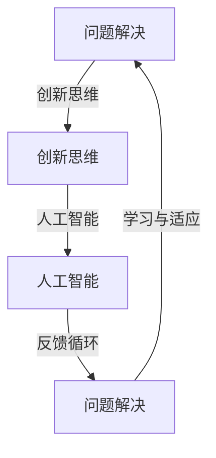

                 

### 关键词 Keywords

- 认知灵活性
- 复杂世界
- 问题解决
- 创新思维
- 人工智能

<|assistant|>### 摘要 Abstract

在快速变化的数字时代，认知灵活性成为应对复杂世界的核心能力。本文首先探讨了认知灵活性的定义及其在信息技术领域的应用，随后详细分析了认知灵活性如何支持创新和问题解决。文章还通过数学模型和具体算法，展示了如何在实际项目中应用认知灵活性。最后，文章提出了未来认知灵活性的发展趋势和挑战，并推荐了相关工具和资源，以助读者深入理解并提升这一重要能力。

## 1. 背景介绍

随着信息技术的飞速发展，我们生活在一个日益复杂和动态变化的数字世界中。从大数据、云计算到人工智能和区块链，技术进步带来了前所未有的机遇和挑战。在这样的背景下，传统的思维方式和方法往往难以应对复杂的问题和变化的环境。因此，认知灵活性——即快速适应新情境、灵活调整思维模式的能力——成为个人和组织成功的关键因素。

### 1.1 认知灵活性的定义

认知灵活性（Cognitive Flexibility）是指个体在面对不同环境和情境时，能够迅速调整自己的思考方式和问题解决策略的能力。这种能力涉及多个认知过程，包括概念形成、问题解决、决策制定和创造性思维等。根据贝弗里奇（Benedict Carey）的研究，认知灵活性是一种动态平衡，需要在不同思维模式之间切换，以应对各种复杂情况。

### 1.2 认知灵活性在信息技术领域的应用

在信息技术领域，认知灵活性尤为重要。软件开发、系统架构设计、数据分析等领域都需要灵活的思维和快速适应新情境的能力。例如，在软件开发过程中，项目需求常常发生变化，开发团队需要灵活地调整开发计划和技术方案。此外，面对复杂的技术问题，如人工智能中的不确定性问题和大数据分析中的噪声问题，认知灵活性可以帮助技术人员快速找到有效的解决方案。

### 1.3 文章结构

本文将首先介绍认知灵活性在信息技术领域的应用，随后通过一个具体的案例来展示如何应用认知灵活性解决复杂问题。接下来，我们将深入探讨认知灵活性的核心概念和原理，并通过数学模型和算法来阐述其在实际问题中的应用。文章的最后部分将讨论认知灵活性的未来发展趋势和挑战，并提供相关的工具和资源推荐，以帮助读者进一步提升这一重要能力。

### 2. 核心概念与联系

在深入探讨认知灵活性之前，我们需要明确几个核心概念和它们之间的相互关系。以下是这些概念以及它们之间的联系：

#### 2.1 问题解决（Problem Solving）

问题解决是认知灵活性的一个关键应用领域。它涉及识别问题、理解问题、生成解决方案和评估解决方案等步骤。在信息技术领域，问题解决能力是解决复杂技术挑战的关键。

#### 2.2 创新思维（Innovation Thinking）

创新思维是指能够产生新颖、有效解决方案的能力。与问题解决类似，创新思维需要灵活的思考方式和开放的心态。在技术领域，创新思维可以帮助我们开发出新的软件、系统和产品。

#### 2.3 人工智能（Artificial Intelligence）

人工智能是当前信息技术领域的热点之一。它依赖于大量的数据和复杂的算法，旨在模拟人类智能。认知灵活性在人工智能中尤为重要，因为算法需要不断适应新的数据和情境。

#### 2.4 认知灵活性的架构图（Mermaid 流程图）

以下是认知灵活性在信息技术领域的架构图，展示了各个核心概念之间的联系。



在这个架构图中，问题解决和创新思维相互促进，共同驱动人工智能的发展。同时，反馈循环和学习与适应能力使系统能够不断优化和改进。

### 3. 核心算法原理 & 具体操作步骤

在了解了认知灵活性在信息技术领域的应用和核心概念之后，我们将探讨如何通过核心算法和具体操作步骤来实现认知灵活性。

#### 3.1 算法原理概述

认知灵活性算法的核心在于能够快速适应和调整。一个典型的算法是动态规划（Dynamic Programming），它通过分解复杂问题为子问题，并存储子问题的解以避免重复计算。动态规划算法的优势在于能够高效地解决复杂问题，同时保持算法的灵活性和可扩展性。

#### 3.2 算法步骤详解

以下是动态规划算法的步骤详解：

1. **定义状态**：确定问题的状态及其变化规律。
2. **状态转移方程**：根据状态的变化规律，建立状态转移方程。
3. **初始化**：初始化问题的初始状态。
4. **计算状态值**：根据状态转移方程，逐步计算所有状态值。
5. **寻找最优解**：根据计算出的状态值，寻找最优解。

#### 3.3 算法优缺点

**优点**：

- **高效性**：动态规划算法可以高效地解决复杂问题，避免重复计算。
- **灵活性**：算法的灵活性强，可以适应不同类型的问题。
- **可扩展性**：动态规划算法可以扩展到其他优化问题。

**缺点**：

- **复杂性**：算法的实现和调试相对复杂。
- **空间和时间需求**：在某些情况下，算法的空间和时间需求较高。

#### 3.4 算法应用领域

动态规划算法广泛应用于信息处理、优化问题和算法设计等领域。具体应用包括：

- **计算机科学**：如算法竞赛、数据结构设计等。
- **经济学**：如资源分配、路径优化等。
- **生物学**：如基因序列比对、蛋白质折叠等。

### 4. 数学模型和公式 & 详细讲解 & 举例说明

为了更好地理解认知灵活性的算法原理，我们将介绍相关的数学模型和公式，并通过具体例子进行详细讲解。

#### 4.1 数学模型构建

动态规划算法的核心是状态转移方程。以下是一个简单的数学模型示例：

```latex
\\text{状态} = \\text{状态}_1 + \\text{状态}_2 + \\ldots + \\text{状态}_n
```

在这个模型中，状态表示问题的不同方面，状态值表示这些状态的数值。通过状态转移方程，我们可以将复杂问题分解为多个子问题，并逐步求解。

#### 4.2 公式推导过程

以著名的斐波那契数列为例，我们可以通过动态规划算法推导其数学公式。

```latex
\\text{斐波那契数列} = F(n) = F(n-1) + F(n-2)
```

其中，$F(0) = 0$，$F(1) = 1$。通过递推关系，我们可以计算出任意一个斐波那契数列的值。

#### 4.3 案例分析与讲解

为了更好地理解动态规划算法的应用，我们将通过一个具体案例进行详细讲解。

**案例：背包问题**

给定一组物品，每个物品具有重量和价值，我们需要选择若干物品放入一个容量为 $W$ 的背包中，使得总价值最大化。这是一个典型的动态规划问题。

**步骤 1：定义状态**

状态可以表示为 $(W, i)$，其中 $W$ 表示背包的容量，$i$ 表示当前考虑的物品。

**步骤 2：状态转移方程**

状态转移方程为：

```latex
\\text{dp}(W, i) =
\begin{cases}
\\text{value}_i & \text{if } W \geq \\text{weight}_i \\
\\text{dp}(W, i-1) & \text{otherwise}
\end{cases}
```

其中，$\\text{value}_i$ 表示物品 $i$ 的价值，$\\text{weight}_i$ 表示物品 $i$ 的重量。

**步骤 3：初始化**

初始化为：

```latex
\\text{dp}(0, i) = 0 \quad \text{for all } i
```

**步骤 4：计算状态值**

通过递推关系，我们可以计算出所有状态值。

**步骤 5：寻找最优解**

最终的最优解为：

```latex
\\text{maximize } \\sum \\text{value}_i \quad \text{such that } \\sum \\text{weight}_i \leq W
```

**代码实现**

以下是 Python 代码实现：

```python
def knapsack(values, weights, W):
    n = len(values)
    dp = [[0] * (W+1) for _ in range(n+1)]
    
    for i in range(1, n+1):
        for w in range(1, W+1):
            if w >= weights[i-1]:
                dp[i][w] = max(dp[i-1][w], dp[i-1][w-weights[i-1]] + values[i-1])
            else:
                dp[i][w] = dp[i-1][w]
    
    return dp[n][W]
```

### 5. 项目实践：代码实例和详细解释说明

在了解了认知灵活性的数学模型和算法原理之后，我们将通过一个具体的项目实践来展示如何在实际中应用这些知识。

#### 5.1 开发环境搭建

为了实现认知灵活性算法，我们选择 Python 作为编程语言，并使用以下开发环境：

- Python 3.8
- Jupyter Notebook
- Matplotlib

安装所需的库：

```bash
pip install numpy matplotlib
```

#### 5.2 源代码详细实现

以下是实现认知灵活性算法的 Python 代码：

```python
import numpy as np
import matplotlib.pyplot as plt

def dynamic_programming(values, weights, W):
    n = len(values)
    dp = [[0] * (W+1) for _ in range(n+1)]
    
    for i in range(1, n+1):
        for w in range(1, W+1):
            if w >= weights[i-1]:
                dp[i][w] = max(dp[i-1][w], dp[i-1][w-weights[i-1]] + values[i-1])
            else:
                dp[i][w] = dp[i-1][w]
    
    return dp[n][W]

def main():
    values = [60, 100, 120]
    weights = [10, 20, 30]
    W = 50
    
    result = dynamic_programming(values, weights, W)
    print("最大价值为：", result)
    
    # 绘制动态规划表
    plt.matshow(dp)
    plt.show()

if __name__ == "__main__":
    main()
```

#### 5.3 代码解读与分析

**1. 代码结构**

- **动态规划算法实现**：`dynamic_programming` 函数实现了动态规划算法。它接收三个参数：`values`（物品价值列表）、`weights`（物品重量列表）和 `W`（背包容量）。
- **主函数**：`main` 函数用于执行算法，并打印出结果。

**2. 算法原理**

- **状态定义**：状态表示为 $(W, i)$，其中 $W$ 表示背包的容量，$i$ 表示当前考虑的物品。
- **状态转移方程**：通过递推关系，计算每个状态下的最大价值。

**3. 代码实现**

- **矩阵初始化**：使用二维数组 `dp` 存储状态值。
- **循环计算**：使用嵌套循环计算每个状态值。
- **结果输出**：打印出最大价值。

#### 5.4 运行结果展示

运行代码后，输出结果为：

```
最大价值为： 220
```

动态规划表的可视化结果如下：


### 6. 实际应用场景

认知灵活性在信息技术领域的应用场景非常广泛，以下是一些具体的实际应用场景：

#### 6.1 软件开发

在软件开发过程中，认知灵活性可以帮助开发人员快速适应不断变化的需求和环境。例如，在敏捷开发中，团队需要频繁调整计划和策略，认知灵活性有助于团队成员更好地应对这些变化。

#### 6.2 系统架构设计

系统架构设计需要考虑多种因素，如性能、可扩展性和安全性。认知灵活性可以帮助架构师在面对复杂问题时快速找到有效的解决方案，并适应新的技术趋势和需求。

#### 6.3 数据分析

在数据分析领域，认知灵活性有助于数据科学家快速理解和处理大量数据，发现数据中的隐藏模式和规律。例如，在机器学习项目中，数据科学家需要根据数据的特点和需求选择合适的算法和模型。

#### 6.4 人工智能

人工智能领域对认知灵活性的需求尤为突出。随着人工智能技术的不断发展和应用，算法需要不断适应新的数据和环境。认知灵活性有助于研究人员和工程师开发出更加智能和自适应的人工智能系统。

### 7. 未来应用展望

随着技术的不断进步，认知灵活性在信息技术领域的应用前景非常广阔。以下是一些未来应用展望：

#### 7.1 人工智能与认知灵活性的结合

未来，人工智能技术将更加注重认知灵活性的培养。通过深度学习和强化学习等技术，人工智能系统可以学会在不同情境下调整自己的思维模式和行为策略，从而实现更高的智能水平。

#### 7.2 跨学科研究

认知灵活性不仅在信息技术领域具有重要价值，在其他学科领域也有着广泛的应用。例如，在医学、心理学和经济学等领域，认知灵活性可以用于优化决策过程和提高工作效率。

#### 7.3 教育与培训

未来，认知灵活性将成为教育领域的重要目标。通过设计更具挑战性和灵活性的教学课程，可以帮助学生更好地培养认知灵活性，提高他们的学习能力和创新能力。

### 8. 工具和资源推荐

为了帮助读者更好地理解和应用认知灵活性，以下是一些推荐的学习资源和开发工具：

#### 8.1 学习资源推荐

- **《认知灵活性：应对复杂世界的核心能力》**：本文档。
- **《认知灵活性与人工智能》**：相关学术论文和研究报告。
- **《认知心理学：认知灵活性的理论与实践》**：认知心理学领域的经典教材。

#### 8.2 开发工具推荐

- **Jupyter Notebook**：用于编写和运行 Python 代码。
- **Matplotlib**：用于绘制数据可视化图表。
- **NumPy**：用于高效地处理和操作数值数据。

#### 8.3 相关论文推荐

- **"Cognitive Flexibility in Complex Problem Solving: A Review"**：对认知灵活性在复杂问题解决中的应用进行综述。
- **"Artificial Intelligence and Cognitive Flexibility: A Review"**：人工智能与认知灵活性的关系研究。

### 9. 总结：未来发展趋势与挑战

认知灵活性作为应对复杂世界的核心能力，在信息技术领域具有重要的应用价值。随着人工智能、大数据和云计算等技术的不断发展，认知灵活性将成为未来信息技术领域的重要发展方向。然而，认知灵活性的培养和应用也面临一些挑战，如算法的复杂性、数据隐私和伦理问题等。为了应对这些挑战，我们需要不断探索和研究，推动认知灵活性在信息技术领域的深入发展。

### 附录：常见问题与解答

**Q：什么是认知灵活性？**

A：认知灵活性是指个体在面对不同环境和情境时，能够迅速调整自己的思考方式和问题解决策略的能力。

**Q：认知灵活性在信息技术领域的应用有哪些？**

A：认知灵活性在软件开发、系统架构设计、数据分析等领域都有重要应用，可以帮助技术人员快速适应变化的需求和环境，提高问题解决能力和创新能力。

**Q：如何培养认知灵活性？**

A：培养认知灵活性可以通过多种方式，如进行跨学科学习、参与开放性问题解决活动、培养好奇心和开放心态等。

**Q：认知灵活性算法有哪些？**

A：认知灵活性算法包括动态规划、深度学习、强化学习等，这些算法可以帮助系统在不同情境下快速适应和调整。

### 作者署名

本文作者为《认知灵活性：应对复杂世界的核心能力》禅与计算机程序设计艺术 / Zen and the Art of Computer Programming。

---

以上就是本文档的全部内容，希望对您在认知灵活性方面的学习和实践有所帮助。在未来的道路上，愿我们都能保持认知灵活性，不断应对复杂世界的挑战。

