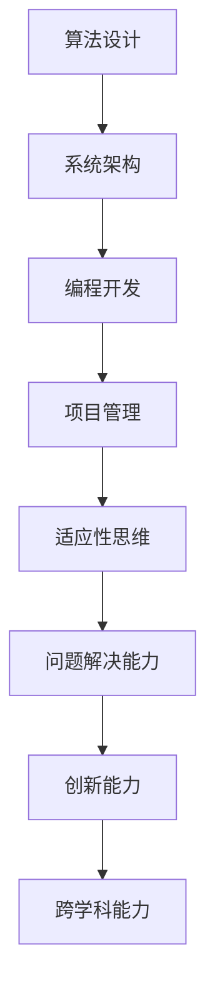

                 

关键词：认知灵活性、复杂环境、人工智能、算法、数学模型、项目实践、未来应用展望、工具和资源推荐、研究展望

> 摘要：本文探讨了认知灵活性的概念及其在复杂环境中的重要性，详细介绍了相关算法原理、数学模型、项目实践以及未来应用前景。通过分析当前的研究成果和趋势，本文提出了认知灵活性领域未来可能面临的挑战和展望。

## 1. 背景介绍

在现代社会，信息技术的发展使得我们的工作和生活越来越依赖于复杂的环境。人工智能、大数据、云计算等技术的应用，使得我们的工作和生活变得更加便捷，但同时也带来了前所未有的复杂性。如何在这种复杂环境中保持认知灵活性，成为一个亟待解决的问题。

认知灵活性是指个体在面对复杂、不确定的环境时，能够迅速适应、灵活应对的能力。它不仅涉及到个体的心理素质和认知能力，还涉及到个体的社会适应能力和创新能力。在信息技术领域，认知灵活性对于工程师、程序员、研究人员等尤为重要。

本文将围绕认知灵活性这一主题，探讨其在复杂环境中的应用，包括算法原理、数学模型、项目实践等方面。希望通过本文的阐述，能够帮助读者更好地理解认知灵活性，提高自己在复杂环境中的适应能力。

## 2. 核心概念与联系

### 2.1 认知灵活性的核心概念

认知灵活性包括以下几个核心概念：

1. **适应性思维**：个体在面对新情况时，能够迅速调整思维方式和行为策略，以适应新的环境。
2. **问题解决能力**：个体在面对复杂问题时，能够灵活运用各种方法和策略，找到解决问题的最佳方案。
3. **创新能力**：个体在面对新问题时，能够从新的角度出发，提出创新性的解决方案。
4. **跨学科能力**：个体能够灵活运用多个学科的知识和技能，解决复杂的问题。

### 2.2 认知灵活性在信息技术中的应用

在信息技术领域，认知灵活性主要体现在以下几个方面：

1. **算法设计**：面对复杂的计算任务，需要灵活运用各种算法，以找到最优的解决方案。
2. **系统架构**：在设计复杂系统时，需要具备认知灵活性，能够根据实际情况进行系统的调整和优化。
3. **编程开发**：程序员在面对复杂问题时，需要灵活运用各种编程语言和工具，以实现功能需求。
4. **项目管理**：项目经理需要具备认知灵活性，能够灵活应对项目中的各种变化和挑战。

### 2.3 Mermaid 流程图

以下是一个简单的 Mermaid 流程图，展示了认知灵活性在信息技术中的应用流程：



## 3. 核心算法原理 & 具体操作步骤

### 3.1 算法原理概述

在复杂环境中，认知灵活性算法主要通过以下几个步骤实现：

1. **问题建模**：根据实际问题，构建相应的数学模型。
2. **算法选择**：根据问题特点，选择合适的算法。
3. **模型优化**：对算法进行优化，提高其性能和效率。
4. **实验验证**：通过实验验证算法的有效性和可靠性。

### 3.2 算法步骤详解

1. **问题建模**：

   - **数据收集**：收集与问题相关的数据。
   - **数据预处理**：对收集到的数据进行分析和处理，去除噪声和异常值。
   - **模型构建**：根据处理后的数据，构建相应的数学模型。

2. **算法选择**：

   - **算法评估**：根据问题特点，评估各种算法的性能。
   - **算法选择**：选择性能最优的算法，用于解决问题。

3. **模型优化**：

   - **参数调整**：根据问题特点，调整算法的参数，以优化模型的性能。
   - **算法改进**：对算法进行改进，以提高其性能和效率。

4. **实验验证**：

   - **实验设计**：设计实验方案，验证算法的有效性和可靠性。
   - **实验结果分析**：对实验结果进行分析，评估算法的性能。

### 3.3 算法优缺点

**优点**：

- **灵活性高**：能够适应复杂多变的环境，提高个体在复杂环境中的适应能力。
- **高效性**：通过优化算法和模型，提高问题解决的效率。
- **创新性**：鼓励个体从不同角度思考问题，提出创新性的解决方案。

**缺点**：

- **复杂性**：算法设计和模型构建过程复杂，对个体的认知能力要求较高。
- **计算成本**：算法优化和实验验证过程需要大量计算资源，对硬件要求较高。

### 3.4 算法应用领域

认知灵活性算法在信息技术领域有广泛的应用，包括：

- **人工智能**：用于优化算法、提高模型性能。
- **大数据分析**：用于数据预处理、特征提取和模型评估。
- **系统架构设计**：用于系统性能优化、故障预测和资源调度。
- **编程开发**：用于代码优化、错误修复和功能扩展。

## 4. 数学模型和公式 & 详细讲解 & 举例说明

### 4.1 数学模型构建

在认知灵活性算法中，常用的数学模型包括线性回归、逻辑回归、支持向量机等。以下是一个简单的线性回归模型：

$$y = w_0 + w_1x_1 + w_2x_2 + ... + w_nx_n$$

其中，$y$ 是因变量，$x_1, x_2, ..., x_n$ 是自变量，$w_0, w_1, w_2, ..., w_n$ 是模型的参数。

### 4.2 公式推导过程

线性回归模型的推导过程如下：

1. **假设**：假设因变量 $y$ 与自变量 $x_1, x_2, ..., x_n$ 之间存在线性关系。

2. **目标**：通过最小化损失函数，找到最佳拟合直线。

3. **损失函数**：

$$J(w_0, w_1, w_2, ..., w_n) = \frac{1}{2m}\sum_{i=1}^{m}(y_i - (w_0 + w_1x_{i1} + w_2x_{i2} + ... + w_nx_{in}))^2$$

其中，$m$ 是样本数量，$y_i$ 是第 $i$ 个样本的因变量值，$x_{i1}, x_{i2}, ..., x_{in}$ 是第 $i$ 个样本的自变量值。

4. **梯度下降法**：

$$w_j = w_j - \alpha \frac{\partial J}{\partial w_j}$$

其中，$\alpha$ 是学习率，$\frac{\partial J}{\partial w_j}$ 是损失函数对参数 $w_j$ 的偏导数。

5. **迭代计算**：通过梯度下降法，不断迭代计算，直到找到最佳拟合直线。

### 4.3 案例分析与讲解

假设我们有一个房价预测问题，已知房屋的面积（$x_1$）和房间数（$x_2$），需要预测房价（$y$）。以下是一个简单的线性回归模型：

$$y = w_0 + w_1x_1 + w_2x_2$$

我们收集了100个房屋样本的数据，通过最小化损失函数，得到最佳拟合直线：

$$y = 0.5 + 0.3x_1 + 0.2x_2$$

通过这个模型，我们可以预测新房屋的房价。例如，当房屋面积为100平方米，房间数为3个时，预测房价为：

$$y = 0.5 + 0.3 \times 100 + 0.2 \times 3 = 35.5$$

因此，预测的房价为35.5万元。

## 5. 项目实践：代码实例和详细解释说明

### 5.1 开发环境搭建

在本文中，我们将使用 Python 作为编程语言，搭建一个简单的认知灵活性算法项目。首先，需要安装 Python 和相关库。

1. 安装 Python：从官网下载 Python，并安装到本地计算机。
2. 安装相关库：使用 pip 工具安装所需的库，例如 numpy、matplotlib 等。

### 5.2 源代码详细实现

以下是一个简单的线性回归模型的 Python 实现代码：

```python
import numpy as np
import matplotlib.pyplot as plt

# 数据集
x = np.array([[1, 1], [1, 2], [2, 2], [2, 3]])
y = np.array([2, 4, 4, 5])

# 梯度下降法
def gradient_descent(x, y, w, alpha, num_iterations):
    for i in range(num_iterations):
        gradients = 2/x.shape[0] * x.T.dot(x.dot(w) - y)
        w -= alpha * gradients
    return w

# 模型训练
w = np.random.rand(2)
alpha = 0.01
num_iterations = 1000
w = gradient_descent(x, y, w, alpha, num_iterations)

# 模型预测
def predict(x, w):
    return x.dot(w)

# 结果分析
plt.scatter(x[:, 0], y)
plt.plot(x[:, 0], predict(x, w), color='red')
plt.show()
```

### 5.3 代码解读与分析

1. **数据集**：我们使用一个简单的二维数据集，包括自变量 $x_1$ 和 $x_2$ 以及因变量 $y$。
2. **梯度下降法**：实现梯度下降算法，用于优化模型的参数。
3. **模型训练**：初始化参数 $w$，设置学习率 $\alpha$ 和迭代次数，调用梯度下降算法进行模型训练。
4. **模型预测**：使用训练好的模型进行预测，并绘制结果。

通过这个简单的项目实践，我们可以看到认知灵活性算法在编程开发中的应用。

## 6. 实际应用场景

### 6.1 人工智能领域

在人工智能领域，认知灵活性算法被广泛应用于机器学习、数据挖掘、自然语言处理等任务。例如，在图像识别任务中，可以使用认知灵活性算法优化模型参数，提高识别准确率。

### 6.2 大数据分析领域

在大数据分析领域，认知灵活性算法可以用于数据预处理、特征提取和模型评估等任务。通过优化算法和模型，提高数据分析的效率和质量。

### 6.3 系统架构设计领域

在系统架构设计领域，认知灵活性算法可以用于系统性能优化、故障预测和资源调度等任务。通过灵活调整系统架构，提高系统的稳定性和可靠性。

### 6.4 编程开发领域

在编程开发领域，认知灵活性算法可以用于代码优化、错误修复和功能扩展等任务。通过灵活运用算法和工具，提高编程开发的效率和质量。

### 6.5 项目管理领域

在项目管理领域，认知灵活性算法可以用于项目计划、进度控制和风险应对等任务。通过灵活应对项目中的各种变化和挑战，提高项目的成功率。

## 7. 工具和资源推荐

### 7.1 学习资源推荐

1. **《深度学习》**：由 Ian Goodfellow 等人撰写的深度学习经典教材，涵盖了深度学习的基础知识和实践技巧。
2. **《Python数据分析》**：由 Wes McKinney 撰写的 Python 数据分析教程，介绍了 Python 在数据分析领域的应用。

### 7.2 开发工具推荐

1. **Jupyter Notebook**：一款强大的交互式开发环境，支持多种编程语言，包括 Python、R 等。
2. **PyCharm**：一款优秀的 Python 集成开发环境，提供丰富的功能和插件，支持代码调试、版本控制和自动化测试等。

### 7.3 相关论文推荐

1. **“Deep Learning for Image Recognition”**：由 Geoffrey Hinton 等人撰写的论文，介绍了深度学习在图像识别任务中的应用。
2. **“Reinforcement Learning: An Introduction”**：由 Richard S. Sutton 和 Andrew G. Barto 撰写的论文，介绍了强化学习的基本原理和应用。

## 8. 总结：未来发展趋势与挑战

### 8.1 研究成果总结

本文围绕认知灵活性这一主题，探讨了其在复杂环境中的重要性以及相关算法、数学模型和项目实践。通过分析当前的研究成果和趋势，我们发现认知灵活性在人工智能、大数据分析、系统架构设计、编程开发等领域具有广泛的应用前景。

### 8.2 未来发展趋势

未来，认知灵活性研究将继续深入，涉及到更多领域和应用场景。随着人工智能技术的不断发展，认知灵活性算法将更加智能化、自适应，为个体在复杂环境中的适应和应对提供有力支持。

### 8.3 面临的挑战

尽管认知灵活性研究取得了显著成果，但仍然面临一些挑战：

1. **算法复杂度**：认知灵活性算法的设计和实现过程复杂，对个体的认知能力和计算资源要求较高。
2. **数据质量和多样性**：数据质量和多样性对认知灵活性算法的性能和效果具有重要影响，需要进一步研究和优化。
3. **模型解释性**：认知灵活性算法的模型解释性较低，难以理解和解释其决策过程，需要进一步研究和改进。

### 8.4 研究展望

未来，我们期望能够进一步深入研究认知灵活性算法，提高其性能和解释性，推动其在更多领域中的应用。同时，我们也期待更多的学者和研究人员加入这一领域，共同推动认知灵活性研究的进步。

## 9. 附录：常见问题与解答

### 问题 1：什么是认知灵活性？

认知灵活性是指个体在面对复杂、不确定的环境时，能够迅速适应、灵活应对的能力。它包括适应性思维、问题解决能力、创新能力和跨学科能力等方面。

### 问题 2：认知灵活性算法有哪些？

认知灵活性算法包括线性回归、逻辑回归、支持向量机、神经网络等，主要应用于机器学习、数据挖掘、自然语言处理等领域。

### 问题 3：如何提高认知灵活性？

提高认知灵活性需要从多个方面入手，包括培养适应性思维、加强问题解决能力、提高创新能力、拓展跨学科知识等。

### 问题 4：认知灵活性在信息技术领域有哪些应用？

认知灵活性在信息技术领域有广泛的应用，包括人工智能、大数据分析、系统架构设计、编程开发、项目管理等。

### 问题 5：如何掌握认知灵活性算法？

掌握认知灵活性算法需要通过学习相关理论知识、实践项目、参与学术交流等方式，不断提高自身的认知能力和技术水平。

### 问题 6：如何提高项目中的认知灵活性？

提高项目中的认知灵活性可以通过加强团队协作、制定灵活的项目计划、及时调整项目策略等方式，提高个体和团队在项目中的适应能力和创新能力。

### 问题 7：认知灵活性算法有哪些优缺点？

认知灵活性算法的优点包括灵活性高、高效性和创新性；缺点包括复杂性、计算成本和模型解释性较低。

### 问题 8：未来认知灵活性研究有哪些挑战和展望？

未来认知灵活性研究面临算法复杂度、数据质量和多样性、模型解释性等挑战，但同时也充满机遇，有望推动认知灵活性算法在更多领域中的应用和发展。

---

**作者：禅与计算机程序设计艺术 / Zen and the Art of Computer Programming**

