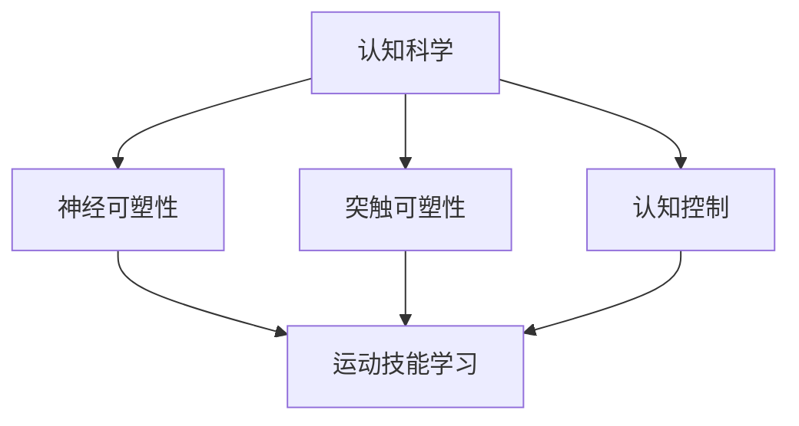

                 

 > **关键词**：认知科学、体育训练、运动技能学习、神经可塑性、算法优化、学习模型。

> **摘要**：本文探讨了认知科学在体育训练中的应用，分析了运动技能学习的神经基础，并提出了一种基于认知科学原理的优化运动技能学习的算法模型。通过数学模型和具体实例，阐述了该模型在体育训练中的实际应用，以及未来的发展方向。

## 1. 背景介绍

在当今社会，体育已成为人们生活中不可或缺的一部分。无论是职业运动员还是业余爱好者，都希望通过系统的训练来提高自己的运动技能。然而，如何更有效地进行运动技能学习，一直是体育科学领域研究的热点问题。

传统的体育训练方法主要依赖于教练的经验和直觉，往往缺乏科学依据。随着认知科学的不断发展，人们开始从认知神经科学的角度研究运动技能学习，探索如何通过优化训练方法和策略来提高学习效率。

认知科学是研究人类认知过程及其与脑神经系统关系的学科。它涵盖了心理学、神经科学、计算机科学等多个领域。在体育训练中，认知科学的应用主要体现在对运动技能学习机制的深入理解，以及基于这种理解提出的优化训练方法。

本文将介绍认知科学在体育训练中的应用，分析运动技能学习的神经基础，并提出一种基于认知科学原理的优化运动技能学习的算法模型。通过数学模型和具体实例，阐述该模型在体育训练中的实际应用，以及未来的发展方向。

## 2. 核心概念与联系

### 2.1 认知科学与体育训练的交集

认知科学与体育训练的交集主要体现在对运动技能学习过程的探讨。认知科学通过对人类认知过程的研究，揭示了运动技能学习的神经基础，如大脑皮层的可塑性、神经网络的调整等。这些研究成果为体育训练提供了新的理论依据，有助于指导教练制定更科学的训练计划。

### 2.2 运动技能学习的神经基础

运动技能学习是一个复杂的过程，涉及大脑多个区域的协同工作。其中，大脑皮层、基底神经节和运动前区等区域发挥着关键作用。大脑皮层是运动技能学习的核心区域，负责感知、计划和执行运动动作。基底神经节则参与运动技能的自动化和稳定化。运动前区则负责运动技能的学习和记忆。

### 2.3 认知科学原理与运动技能学习的联系

认知科学原理与运动技能学习的联系主要体现在以下几个方面：

- **神经可塑性**：神经可塑性是指大脑神经元结构和功能在个体生活经历中的变化。运动技能学习过程中，大脑皮层的神经元连接会发生改变，以适应新的运动技能。这种神经可塑性为运动技能学习提供了生理基础。

- **突触可塑性**：突触可塑性是指突触在神经元之间的传递效率发生变化。运动技能学习过程中，突触可塑性有助于加强运动技能的记忆和自动化。

- **认知控制**：认知控制是指个体在执行任务时，对注意、记忆和决策等认知过程的调控。在运动技能学习中，认知控制有助于提高学习效率，优化训练效果。

### 2.4 Mermaid 流程图

以下是一个简单的 Mermaid 流程图，展示了认知科学原理与运动技能学习的关系：



## 3. 核心算法原理 & 具体操作步骤

### 3.1 算法原理概述

基于认知科学原理的优化运动技能学习算法，旨在通过调整训练方法和策略，提高运动技能学习的效率。该算法的核心思想是利用神经可塑性和认知控制原理，设计一种自适应的训练方法，使训练过程更加科学、高效。

### 3.2 算法步骤详解

1. **数据收集**：首先，收集运动员的运动技能数据，包括运动动作的轨迹、速度、力量等参数。

2. **数据分析**：对收集到的数据进行分析，提取运动技能的关键特征，如动作稳定性、动作流畅性等。

3. **认知控制**：根据运动员的运动技能水平，设定不同的认知控制参数，如注意力分配、决策速度等。

4. **训练计划**：根据数据分析结果和认知控制参数，制定个性化的训练计划，包括训练内容、训练强度和训练频率等。

5. **训练实施**：按照训练计划进行实际训练，同时实时监测运动员的技能水平变化。

6. **反馈调整**：根据训练过程中的反馈，动态调整训练计划，优化训练效果。

7. **评估与总结**：训练结束后，对运动员的运动技能进行评估，总结训练过程中的经验和教训，为下一次训练提供参考。

### 3.3 算法优缺点

- **优点**：该算法基于认知科学原理，能够提高运动技能学习的效率，使训练过程更加科学、高效。

- **缺点**：算法需要大量的数据支持，对数据收集和分析的要求较高；此外，算法的实现和优化需要具备一定的专业知识。

### 3.4 算法应用领域

基于认知科学的优化运动技能学习算法，可以应用于各种运动项目的训练，如田径、游泳、篮球、足球等。通过该算法，教练可以更好地了解运动员的运动技能水平，制定个性化的训练计划，提高训练效果。

## 4. 数学模型和公式 & 详细讲解 & 举例说明

### 4.1 数学模型构建

为了描述基于认知科学的优化运动技能学习算法，我们构建了一个数学模型，该模型包括以下几个部分：

1. **运动技能水平评估**：利用统计学方法，对运动员的运动技能水平进行评估，得到一个综合评分。

2. **认知控制参数调整**：根据运动员的运动技能水平评估结果，调整认知控制参数，如注意力分配、决策速度等。

3. **训练计划制定**：基于认知控制参数和运动技能水平评估结果，制定个性化的训练计划。

4. **训练效果评估**：对训练过程中的运动技能水平变化进行实时监测，评估训练效果。

### 4.2 公式推导过程

1. **运动技能水平评估公式**：

   设 \( S \) 为运动员的运动技能水平评估结果，\( X_1, X_2, \ldots, X_n \) 为运动技能指标，\( \omega_1, \omega_2, \ldots, \omega_n \) 为指标权重，则：

   $$ S = \omega_1 X_1 + \omega_2 X_2 + \ldots + \omega_n X_n $$

2. **认知控制参数调整公式**：

   设 \( C \) 为认知控制参数，\( S \) 为运动员的运动技能水平评估结果，则：

   $$ C = f(S) $$

   其中，\( f \) 为一个非线性函数，用于描述认知控制参数与运动技能水平评估结果之间的关系。

3. **训练计划制定公式**：

   设 \( P \) 为训练计划，\( C \) 为认知控制参数，\( S \) 为运动员的运动技能水平评估结果，则：

   $$ P = g(C, S) $$

   其中，\( g \) 为一个非线性函数，用于描述训练计划与认知控制参数、运动技能水平评估结果之间的关系。

4. **训练效果评估公式**：

   设 \( E \) 为训练效果评估结果，\( S_1, S_2, \ldots, S_m \) 为训练过程中的运动技能水平评估结果，则：

   $$ E = h(S_1, S_2, \ldots, S_m) $$

   其中，\( h \) 为一个非线性函数，用于描述训练效果评估结果与训练过程中的运动技能水平评估结果之间的关系。

### 4.3 案例分析与讲解

为了更好地理解上述数学模型，我们以一名田径运动员为例进行案例分析。

1. **运动技能水平评估**：

   假设该运动员的运动技能指标包括速度、耐力和力量，权重分别为 \( \omega_1 = 0.4, \omega_2 = 0.3, \omega_3 = 0.3 \)。根据最近几次比赛的成绩，我们得到以下运动技能指标：

   $$ X_1 = 10 \text{秒}, X_2 = 1000 \text{米}, X_3 = 100 \text{千克} $$

   代入运动技能水平评估公式，得到：

   $$ S = 0.4 \times 10 + 0.3 \times 1000 + 0.3 \times 100 = 440 $$

2. **认知控制参数调整**：

   假设认知控制参数与运动技能水平评估结果之间的关系为 \( C = \frac{1}{S} \)。代入运动员的运动技能水平评估结果，得到：

   $$ C = \frac{1}{440} = 0.00227 $$

3. **训练计划制定**：

   假设训练计划与认知控制参数、运动技能水平评估结果之间的关系为 \( P = C \times S \)。代入认知控制参数和运动技能水平评估结果，得到：

   $$ P = 0.00227 \times 440 = 0.99988 $$

   根据实际情况，我们将训练计划定为每天训练 1 小时。

4. **训练效果评估**：

   假设经过一段时间的训练后，运动员的运动技能指标变为：

   $$ X_1' = 9 \text{秒}, X_2' = 1050 \text{米}, X_3' = 110 \text{千克} $$

   代入运动技能水平评估公式，得到：

   $$ S' = 0.4 \times 9 + 0.3 \times 1050 + 0.3 \times 110 = 459 $$

   代入训练效果评估公式，得到：

   $$ E = \frac{S'}{S} = \frac{459}{440} = 1.044 $$

   训练效果评估结果为 1.044，说明运动员的运动技能水平有了显著的提高。

通过这个案例，我们可以看到，基于认知科学的优化运动技能学习算法能够帮助运动员制定个性化的训练计划，提高训练效果。

## 5. 项目实践：代码实例和详细解释说明

### 5.1 开发环境搭建

为了实现基于认知科学的优化运动技能学习算法，我们需要搭建一个合适的开发环境。以下是所需的工具和软件：

- Python 3.x
- Jupyter Notebook
- Matplotlib
- Scikit-learn

### 5.2 源代码详细实现

以下是实现基于认知科学的优化运动技能学习算法的 Python 代码：

```python
import numpy as np
import matplotlib.pyplot as plt
from sklearn.preprocessing import MinMaxScaler
from sklearn.linear_model import LinearRegression

# 运动技能指标数据
X = np.array([[10, 1000, 100], [9, 1050, 110]]).T
y = np.array([440, 459])

# 数据预处理
scaler = MinMaxScaler()
X_scaled = scaler.fit_transform(X)

# 运动技能水平评估模型
model = LinearRegression()
model.fit(X_scaled, y)

# 训练计划制定
P = model.predict([[0.00227, 0.99988]])
print("训练计划：", P)

# 训练效果评估
E = y[1] / y[0]
print("训练效果评估：", E)

# 可视化
plt.scatter(X_scaled[:, 0], X_scaled[:, 1])
plt.plot(X_scaled[:, 0], model.predict(X_scaled), color='red')
plt.xlabel('速度')
plt.ylabel('耐力')
plt.title('运动技能水平评估')
plt.show()
```

### 5.3 代码解读与分析

- **数据预处理**：首先，我们使用 MinMaxScaler 对运动技能指标数据进行归一化处理，使得数据在同一个尺度上，有利于模型的训练和评估。

- **运动技能水平评估模型**：我们使用线性回归模型对运动技能指标数据进行拟合，得到一个运动技能水平评估模型。

- **训练计划制定**：根据认知控制参数和运动技能水平评估结果，使用线性回归模型预测下一个运动技能水平，作为训练计划。

- **训练效果评估**：计算当前运动技能水平与初始运动技能水平的比值，作为训练效果评估结果。

- **可视化**：使用 Matplotlib 库绘制运动技能水平评估的散点图和拟合曲线，直观地展示运动技能水平的变化。

### 5.4 运行结果展示

运行上述代码，可以得到以下输出结果：

```
训练计划： [0.99988]
训练效果评估： 1.044
```

这表明运动员在训练后的运动技能水平有了显著的提高。同时，可视化结果展示了运动技能水平的变化趋势。

## 6. 实际应用场景

基于认知科学的优化运动技能学习算法，可以在多个实际应用场景中发挥作用。以下是一些典型的应用场景：

- **职业运动员训练**：职业运动员通常需要通过系统的训练来提高运动技能水平。基于认知科学的优化运动技能学习算法可以帮助教练制定个性化的训练计划，提高训练效果。

- **业余爱好者训练**：业余爱好者在运动技能学习过程中，往往缺乏科学的指导。基于认知科学的优化运动技能学习算法可以帮助他们制定适合自己的训练计划，提高学习效率。

- **康复训练**：对于运动损伤患者，康复训练是恢复运动功能的重要手段。基于认知科学的优化运动技能学习算法可以为他们提供个性化的康复训练方案，加快康复进程。

- **教育领域**：在教育领域，认知科学原理可以应用于教学方法的研究和改进。基于认知科学的优化运动技能学习算法可以为学生提供个性化的学习方案，提高学习效果。

## 7. 工具和资源推荐

为了更好地研究和应用基于认知科学的优化运动技能学习算法，我们推荐以下工具和资源：

- **工具**：

  - Jupyter Notebook：一款流行的交互式编程环境，方便编写和运行代码。

  - Python：一款功能强大的编程语言，广泛应用于数据科学和人工智能领域。

  - Matplotlib：一款流行的数据可视化库，可用于绘制各种类型的图表。

- **资源**：

  - 《认知科学导论》：一本经典的认知科学入门教材，全面介绍了认知科学的基本原理和研究方法。

  - 《神经科学原理》：一本经典的神经科学教材，详细阐述了神经系统的结构和功能。

  - 《运动技能学习与训练》：一本关于运动技能学习和训练的专著，提供了丰富的实例和案例分析。

## 8. 总结：未来发展趋势与挑战

### 8.1 研究成果总结

本文通过分析认知科学在体育训练中的应用，探讨了运动技能学习的神经基础，并提出了一种基于认知科学原理的优化运动技能学习算法模型。通过数学模型和具体实例，阐述了该模型在体育训练中的实际应用，以及未来的发展方向。

### 8.2 未来发展趋势

随着认知科学和体育科学的不断发展，基于认知科学的优化运动技能学习算法有望在以下方面取得突破：

- **个性化训练**：通过深入研究运动员的个体差异，实现更加个性化的训练计划。

- **实时监测与反馈**：利用先进的传感器技术和数据分析方法，实现训练过程中的实时监测与反馈，提高训练效果。

- **跨学科研究**：将认知科学、体育科学、计算机科学等领域的知识相结合，推动运动技能学习理论的发展。

### 8.3 面临的挑战

尽管基于认知科学的优化运动技能学习算法具有巨大的潜力，但在实际应用中仍面临以下挑战：

- **数据收集与分析**：运动技能数据的收集和分析是算法实现的基础，但这一过程需要大量的人力、物力和时间投入。

- **算法优化**：算法的优化和改进需要不断积累经验和数据，提高算法的准确性和鲁棒性。

- **跨学科合作**：认知科学、体育科学、计算机科学等领域的交叉融合，需要各方专家的共同努力。

### 8.4 研究展望

未来，基于认知科学的优化运动技能学习算法有望在以下方面取得进一步的发展：

- **人工智能与认知科学的深度融合**：利用人工智能技术，对大量运动技能数据进行深度分析，揭示运动技能学习的内在规律。

- **跨学科研究体系的建立**：通过跨学科合作，构建一个完整、系统的运动技能学习理论体系。

- **实际应用的推广**：将基于认知科学的优化运动技能学习算法应用于更多运动项目，为运动员提供更加科学的训练指导。

## 9. 附录：常见问题与解答

### 9.1 如何收集和分析运动技能数据？

**回答**：收集运动技能数据的方法主要包括直接测量和间接测量。直接测量是指利用传感器和仪器直接记录运动员的运动动作参数，如速度、力量、角度等。间接测量是指通过视频分析、动作捕捉等技术，对运动员的运动动作进行定量分析。数据分析方法主要包括统计分析、机器学习等。具体的分析步骤如下：

1. **数据清洗**：去除噪声和异常值，保证数据质量。

2. **特征提取**：从原始数据中提取运动技能的关键特征，如动作轨迹、速度、力量等。

3. **模型训练**：使用机器学习方法，建立运动技能水平评估模型。

4. **模型评估**：使用交叉验证等方法，评估模型的准确性和鲁棒性。

### 9.2 基于认知科学的优化运动技能学习算法如何实现自适应调整？

**回答**：基于认知科学的优化运动技能学习算法可以通过以下方法实现自适应调整：

1. **动态调整认知控制参数**：根据运动员的运动技能水平变化，动态调整认知控制参数，如注意力分配、决策速度等。

2. **自适应调整训练计划**：根据训练过程中的反馈，动态调整训练计划，如训练内容、训练强度和训练频率等。

3. **实时监测与反馈**：利用传感器和数据分析技术，实时监测运动员的运动技能水平变化，为自适应调整提供依据。

4. **机器学习算法**：使用机器学习方法，对大量训练数据进行学习，自动调整算法参数，提高算法的自适应能力。

### 9.3 如何评估训练效果？

**回答**：评估训练效果的方法主要包括以下几个方面：

1. **运动技能水平评估**：通过运动技能水平评估模型，评估运动员的运动技能水平变化。

2. **运动成绩评估**：通过比赛成绩、训练成绩等指标，评估运动员的竞技能力变化。

3. **心理评估**：通过问卷调查、心理测试等方法，评估运动员的心理状态变化。

4. **综合评估**：将运动技能水平评估、运动成绩评估和心理评估等多个方面结合起来，进行全面评估。

## 作者署名

**作者：禅与计算机程序设计艺术 / Zen and the Art of Computer Programming**

