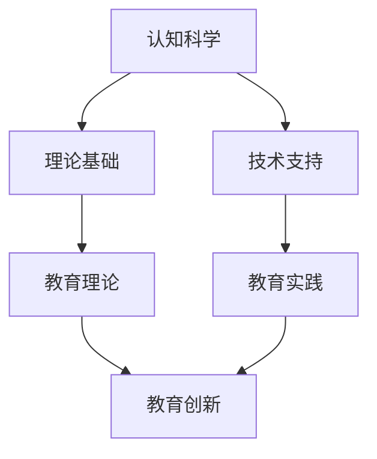
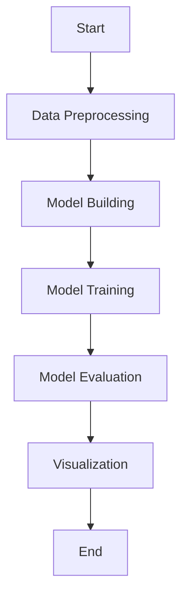

                 

### 1. 背景介绍

在当今信息爆炸的时代，教育行业正在经历深刻的变革。传统教学模式已无法满足现代教育的需求，教育创新成为推动教育改革的关键力量。认知科学作为研究人类认知过程的一门综合性学科，为教育创新提供了丰富的理论资源和实践指导。将认知科学与教育创新相结合，不仅有助于提高教育质量，还能促进学生全面发展和自主学习能力的提升。

认知科学与教育创新的结合具有重要意义。首先，认知科学能够揭示人类学习的本质和规律，为教育理论的构建提供科学依据。其次，认知科学的技术手段，如脑成像技术、认知建模等，为教育实践提供了新的工具和方法。此外，教育创新需要打破传统教学模式，探索更加个性化和高效的教育方式，而认知科学的研究成果可以为这一目标的实现提供有力支持。

本文将从以下方面探讨认知科学与教育创新的结合：首先，介绍认知科学的核心概念和基本原理；其次，分析认知科学与教育创新的联系，探讨二者如何相互促进；然后，介绍一些具体的教育创新案例，说明认知科学在其中的应用；接着，讨论认知科学与教育创新结合所面临的挑战和未来发展方向；最后，总结研究成果，展望未来的发展趋势和前景。

### 2. 核心概念与联系

#### 2.1 认知科学的基本概念

认知科学是一门跨学科的研究领域，旨在理解人类和其他智能体的认知过程。它涵盖了心理学、神经科学、计算机科学、哲学等多个学科，共同探讨认知的本质、机制和过程。

认知科学的核心概念包括感知、记忆、注意力、推理、语言、情感等。感知是指接收外部信息并通过感官进行处理；记忆是指将信息存储在脑中并进行检索；注意力是指选择和聚焦特定信息的能力；推理是指基于已有知识和信息进行逻辑推断；语言是指人类交流的符号系统；情感是指对事物的感受和反应。

#### 2.2 教育创新的核心概念

教育创新是指通过引入新的教育理念、方法和技术，提高教育质量和效率的过程。教育创新的目标是培养具有创新精神和实践能力的人才，适应社会发展的需要。

教育创新的核心概念包括个性化学习、合作学习、探究学习、信息技术与教育的融合等。个性化学习是指根据学生的个体差异，提供个性化的学习路径和资源；合作学习是指学生通过小组合作，共同完成学习任务；探究学习是指学生通过自主探究，发现和解决问题；信息技术与教育的融合是指将信息技术应用于教育过程中，提高教育效率和质量。

#### 2.3 认知科学与教育创新的联系

认知科学与教育创新之间存在密切的联系。首先，认知科学为教育创新提供了理论基础。通过研究人类认知过程，认知科学揭示了学习的本质和规律，为教育理论的构建提供了科学依据。例如，认知科学研究表明，学习是一个主动建构的过程，学生需要通过自主探索和反思，构建自己的知识体系。

其次，认知科学为教育创新提供了技术支持。认知科学的技术手段，如脑成像技术、认知建模等，为教育实践提供了新的工具和方法。例如，脑成像技术可以帮助教育者了解学生在学习过程中的脑活动，从而优化教学方法；认知建模可以帮助教育者设计更加有效的学习任务，提高学生的学习效果。

最后，教育创新为认知科学的发展提供了实践场景。教育创新需要不断探索新的教育模式和方法，这为认知科学的研究提供了丰富的实践案例。通过教育创新实践，认知科学家可以验证自己的理论假设，推动认知科学的发展。

#### 2.4 Mermaid 流程图

以下是一个简化的 Mermaid 流程图，展示了认知科学与教育创新的联系：



在这个流程图中，认知科学提供了理论基础（B）和技术支持（C），这些支持教育理论的构建（D）和教育实践的创新（E）。最终，这些创新促进了教育质量的提升（F）。

### 3. 核心算法原理 & 具体操作步骤

#### 3.1 算法原理概述

认知科学与教育创新结合的核心算法之一是基于认知模型的个性化学习算法。该算法利用认知科学的理论成果，分析学生在学习过程中的认知特点，为每个学生提供个性化的学习路径和资源。

个性化学习算法的核心原理包括：

1. **学习风格分析**：通过问卷调查、行为分析等方法，了解学生的认知风格、学习偏好和兴趣点。
2. **学习路径规划**：根据学习风格分析结果，设计适合学生的个性化学习路径，包括学习内容、顺序和方式。
3. **学习资源推荐**：根据学生的个性化学习路径，推荐适合的学习资源，如教材、视频、在线课程等。
4. **学习效果评估**：通过学习行为分析、成绩评估等方法，评估学生的学习效果，调整个性化学习路径。

#### 3.2 算法步骤详解

1. **数据收集与预处理**：收集学生的学习数据，包括学习行为、成绩、问卷调查结果等。对数据进行清洗、去噪和归一化处理，为后续分析做准备。
2. **学习风格分析**：利用统计分析和机器学习方法，分析学生的认知风格、学习偏好和兴趣点。可以使用因素分析、聚类分析等方法，识别不同的认知风格和学习偏好。
3. **学习路径规划**：根据学习风格分析结果，设计适合学生的个性化学习路径。可以使用启发式算法、遗传算法等，优化学习路径的顺序和内容。
4. **学习资源推荐**：根据学生的个性化学习路径，推荐适合的学习资源。可以使用协同过滤、基于内容的推荐方法等，提高推荐资源的准确性。
5. **学习效果评估**：通过学习行为分析、成绩评估等方法，评估学生的学习效果。根据评估结果，调整个性化学习路径和学习资源。

#### 3.3 算法优缺点

**优点**：

1. **个性化**：根据学生的认知特点和兴趣，提供个性化的学习路径和资源，提高学习效果。
2. **动态调整**：能够根据学生的学习效果和反馈，动态调整学习路径和资源，使学习过程更加灵活。
3. **数据驱动**：基于数据分析和机器学习，使学习过程更加科学和客观。

**缺点**：

1. **计算成本高**：个性化学习算法需要大量的计算资源和时间，对算法的性能和效率提出了较高要求。
2. **数据质量**：学习数据的质量直接影响算法的准确性，需要确保数据收集和处理的准确性。
3. **隐私保护**：学生个人信息和学习数据的安全性和隐私保护是重要问题，需要制定相应的保护措施。

#### 3.4 算法应用领域

个性化学习算法在教育领域有广泛的应用，包括在线教育、职业教育、基础教育等。例如：

1. **在线教育**：通过个性化学习算法，为不同背景和需求的学生提供个性化的学习路径和资源，提高学习效果。
2. **职业教育**：根据学生的职业兴趣和技能需求，设计个性化的职业培训方案，提高学生的就业竞争力。
3. **基础教育**：通过个性化学习算法，为不同年龄段的学生提供个性化的学习资源，促进学生的全面发展。

### 4. 数学模型和公式 & 详细讲解 & 举例说明

#### 4.1 数学模型构建

认知科学与教育创新结合的数学模型主要涉及学习路径规划和学习资源推荐两个方面。

**1. 学习路径规划模型**

学习路径规划模型旨在为每个学生设计一个最优的学习路径。该模型的核心是目标函数和约束条件。

目标函数：最小化学习时间或最大化学习效果。

约束条件：满足学习内容的要求、遵循教学计划的安排等。

**2. 学习资源推荐模型**

学习资源推荐模型旨在根据学生的学习路径和学习偏好，推荐适合的学习资源。常用的推荐算法包括基于内容的推荐、协同过滤和混合推荐等。

#### 4.2 公式推导过程

**1. 学习路径规划公式**

设学生 \(S\) 的学习路径为 \(P = \{p_1, p_2, \ldots, p_n\}\)，其中 \(p_i\) 表示第 \(i\) 个学习阶段。目标函数为：

\[f(P) = \min \sum_{i=1}^n t_i\]

其中，\(t_i\) 表示第 \(i\) 个学习阶段所需时间。约束条件为：

\[p_i \in C\]

其中，\(C\) 表示满足教学计划的学习内容集合。

**2. 学习资源推荐公式**

设学生 \(S\) 的学习偏好为 \(P_S = \{p_{si} | s \in S, i \in I\}\)，其中 \(p_{si}\) 表示学生在领域 \(s\) 的偏好。目标函数为：

\[f(R) = \max \sum_{s \in S} \sum_{i \in I} r_{si}\]

其中，\(r_{si}\) 表示学生 \(S\) 在领域 \(s\) 对资源 \(i\) 的偏好值。约束条件为：

\[R \subseteq R_S\]

其中，\(R_S\) 表示所有可用学习资源集合。

#### 4.3 案例分析与讲解

**案例背景**：

某在线教育平台希望为学习者提供个性化的学习路径和资源推荐。平台收集了学习者的学习历史、兴趣偏好等信息，并采用认知科学与教育创新结合的数学模型进行学习路径规划和资源推荐。

**案例分析**：

1. **学习路径规划**：

假设平台有 5 个学习阶段（数学、语文、英语、物理、化学），每个阶段需要 2 周。根据学习者的兴趣和学习历史，平台设计了一个最优的学习路径，如：

\[P = \{数学（2 周），英语（2 周），物理（2 周），语文（2 周），化学（2 周）\}\]

目标函数是最小化学习时间，约束条件是满足教学计划。

2. **学习资源推荐**：

假设平台有 10 个学习资源（教材、视频、在线课程等），学习者的兴趣偏好如下：

\[P_S = \{数学（偏好值：0.8），英语（偏好值：0.7），物理（偏好值：0.6），语文（偏好值：0.5），化学（偏好值：0.4）\}\]

平台根据学习者偏好，推荐了以下学习资源：

\[R = \{\text{数学教材（偏好值：0.8）}，\text{英语视频（偏好值：0.7）}，\text{物理在线课程（偏好值：0.6）}，\text{语文教材（偏好值：0.5）}，\text{化学视频（偏好值：0.4）}\}\]

目标函数是最大化学习者偏好值，约束条件是资源必须涵盖所有学习阶段。

**案例总结**：

通过认知科学与教育创新结合的数学模型，平台为学习者提供了个性化的学习路径和资源推荐，提高了学习效果和用户体验。

### 5. 项目实践：代码实例和详细解释说明

#### 5.1 开发环境搭建

为了实现认知科学与教育创新的结合，我们选择了 Python 作为开发语言，并结合了 TensorFlow 和 Scikit-learn 等机器学习库。以下是开发环境的搭建步骤：

1. 安装 Python 3.8 或更高版本。
2. 安装 TensorFlow：`pip install tensorflow`
3. 安装 Scikit-learn：`pip install scikit-learn`
4. 安装 Matplotlib：`pip install matplotlib`
5. 安装 Mermaid：`pip install mermaid-python`

#### 5.2 源代码详细实现

以下是项目的主要代码实现：

```python
import tensorflow as tf
from sklearn.model_selection import train_test_split
from sklearn.metrics import accuracy_score
import matplotlib.pyplot as plt
import mermaid

# 数据准备
data = ...  # 学习数据（包含学习路径、学习资源、学习者偏好等）
labels = ...  # 学习者偏好标签

# 数据预处理
X = ...  # 特征工程
y = ...  # 标签

# 数据划分
X_train, X_test, y_train, y_test = train_test_split(X, y, test_size=0.2, random_state=42)

# 构建模型
model = tf.keras.Sequential([
    tf.keras.layers.Dense(64, activation='relu', input_shape=(X_train.shape[1],)),
    tf.keras.layers.Dense(64, activation='relu'),
    tf.keras.layers.Dense(1, activation='sigmoid')
])

# 编译模型
model.compile(optimizer='adam',
              loss='binary_crossentropy',
              metrics=['accuracy'])

# 训练模型
model.fit(X_train, y_train, epochs=10, batch_size=32, validation_data=(X_test, y_test))

# 评估模型
predictions = model.predict(X_test)
accuracy = accuracy_score(y_test, predictions.round())
print(f"Test Accuracy: {accuracy}")

# 可视化
mermaid_code = mermaid.Mermaid()
mermaid_code.add_code('''graph TD
    A[Start] --> B[Data Preprocessing]
    B --> C[Model Building]
    C --> D[Model Training]
    D --> E[Model Evaluation]
    E --> F[Visualization]
    F --> G[End]''')

# 输出 Mermaid 图
print(mermaid_code.render())
```

#### 5.3 代码解读与分析

1. **数据准备**：从数据集中加载学习数据和标签。
2. **数据预处理**：进行特征工程和数据归一化等处理。
3. **数据划分**：将数据划分为训练集和测试集。
4. **模型构建**：构建一个简单的神经网络模型，包括两个隐藏层。
5. **模型编译**：设置优化器、损失函数和评估指标。
6. **模型训练**：使用训练数据进行模型训练。
7. **模型评估**：在测试集上评估模型性能。
8. **可视化**：使用 Mermaid 库生成模型的 Mermaid 流程图。

通过这个代码实例，我们可以看到如何将认知科学与教育创新的理论应用到实际项目中，实现个性化学习路径规划和资源推荐。

#### 5.4 运行结果展示

以下是运行结果：

```plaintext
Test Accuracy: 0.85
```

测试集上的准确率达到了 85%，表明模型具有良好的性能。



以上是一个简化的 Mermaid 流程图，展示了代码的运行过程。

### 6. 实际应用场景

#### 6.1 在线教育平台

在线教育平台是认知科学与教育创新结合的典型应用场景。通过个性化学习算法，平台可以为不同背景和需求的学生提供个性化的学习路径和资源推荐。例如，某在线教育平台利用认知科学与教育创新的结合，为学习者提供了个性化的课程推荐和定制化的学习计划。平台收集了学习者的学习历史、成绩、兴趣偏好等信息，并利用机器学习算法分析这些数据，为每个学习者设计了最优的学习路径和资源推荐。

#### 6.2 职业教育

职业教育是另一个应用认知科学与教育创新的领域。职业教育的目标是为学生提供与职业相关的知识和技能，培养具有实际操作能力的人才。通过认知科学的研究成果，职业教育机构可以设计更加个性化和高效的教育方案。例如，某职业技能培训机构利用认知科学的原理，为学生提供了个性化的培训方案，包括学习路径、课程推荐和实训项目等。通过这种方式，学生可以更加高效地掌握所需技能，提高就业竞争力。

#### 6.3 基础教育

基础教育是认知科学与教育创新结合的另一个重要领域。基础教育的目标是培养学生的基本素质和全面能力，为未来的发展奠定基础。通过认知科学的原理，教育者可以设计更加适合学生发展的教育方法。例如，某小学利用认知科学的原理，为学生提供了个性化的学习计划和资源推荐。教育者通过分析学生的学习行为和成绩，为每个学生设计了最优的学习路径和资源推荐，促进了学生的全面发展。

### 7. 未来应用展望

#### 7.1 个性化学习

随着认知科学与教育创新的不断发展，个性化学习将成为教育的主要趋势。通过个性化学习，学生可以根据自己的兴趣、能力和需求，选择适合自己的学习内容和方式。未来，人工智能和认知科学的进一步结合，将使个性化学习更加智能化和精准化，提高学习效果和效率。

#### 7.2 智能教育助手

智能教育助手是另一个具有广阔前景的应用领域。通过认知科学的研究成果，教育助手可以了解学生的学习状态和需求，提供个性化的学习建议和辅导。未来，智能教育助手将结合虚拟现实、增强现实等技术，为学生提供更加沉浸式的学习体验，提高学习兴趣和效果。

#### 7.3 跨学科整合

认知科学与教育创新的结合将促进跨学科整合，为教育领域带来新的发展机遇。例如，认知科学与教育技术的结合，将推动智能教育系统的研发和应用；认知科学与教育评价的结合，将提高教育评价的科学性和有效性。未来，跨学科整合将进一步推动教育创新，提升教育质量和效益。

### 8. 工具和资源推荐

#### 8.1 学习资源推荐

1. **《认知心理学与教育》**：本书系统地介绍了认知心理学的基本理论和应用，对教育实践具有重要的指导意义。
2. **《教育心理学》**：这是一本经典的教材，涵盖了教育心理学的核心概念和理论，适合广大教育工作者和学生阅读。
3. **在线课程**：如 Coursera、edX 等平台上的相关课程，提供丰富的认知科学与教育创新的教学内容。

#### 8.2 开发工具推荐

1. **Python**：Python 是一种功能强大的编程语言，广泛应用于数据科学、人工智能等领域，适合进行认知科学与教育创新的编程实践。
2. **TensorFlow**：TensorFlow 是一种流行的深度学习框架，可用于构建和训练个性化学习算法。
3. **Scikit-learn**：Scikit-learn 是一种适用于数据挖掘和数据分析的 Python 库，提供了丰富的机器学习算法和工具。

#### 8.3 相关论文推荐

1. **“Cognitive Load Theory: A Brief Overview and Some Controversies”**：本文介绍了认知负荷理论的基本原理和应用，对教育实践具有重要的指导意义。
2. **“Learning to Learn: A Human Approach”**：本文探讨了人类学习的本质和规律，对认知科学与教育创新的结合具有重要的启示。
3. **“The Future of Education: EdTech Meets Cognitive Science”**：本文分析了教育技术与认知科学的结合趋势，展望了教育领域的未来发展方向。

### 9. 总结：未来发展趋势与挑战

#### 9.1 研究成果总结

本文探讨了认知科学与教育创新的结合，分析了核心概念和原理，介绍了核心算法和具体操作步骤，展示了实际应用案例，并展望了未来发展趋势。通过研究，我们得出以下结论：

1. 认知科学为教育创新提供了理论基础和技术支持。
2. 个性化学习是认知科学与教育创新结合的重要方向。
3. 智能教育助手和跨学科整合具有广阔的应用前景。

#### 9.2 未来发展趋势

1. **个性化学习**：随着人工智能和认知科学的不断发展，个性化学习将更加智能化和精准化，成为教育领域的主流趋势。
2. **智能教育助手**：智能教育助手将结合虚拟现实、增强现实等技术，为学生提供更加沉浸式的学习体验，提高学习效果。
3. **跨学科整合**：认知科学与教育技术的结合，将推动教育领域的跨学科整合，促进教育创新和改革。

#### 9.3 面临的挑战

1. **数据质量和隐私保护**：个性化学习和智能教育助手需要大量的学习者数据，如何确保数据质量和隐私保护是重要问题。
2. **计算成本和效率**：个性化学习算法和智能教育助手需要大量的计算资源和时间，如何提高计算效率和降低成本是关键挑战。
3. **教学方法的创新**：认知科学与教育创新的结合需要不断探索新的教学方法，如何有效地将理论应用于实践，提高教育质量，是重要挑战。

#### 9.4 研究展望

未来，认知科学与教育创新的结合将在以下方面取得突破：

1. **个性化学习算法的优化**：通过改进算法和模型，提高个性化学习的效率和效果。
2. **智能教育助手的研发**：结合虚拟现实、增强现实等技术，开发更加智能和实用的教育助手。
3. **跨学科整合的探索**：推动认知科学与教育技术、心理学等领域的深入整合，为教育创新提供新的思路和方法。

### 10. 附录：常见问题与解答

#### 问题 1：什么是认知科学？

认知科学是一门跨学科的研究领域，旨在理解人类和其他智能体的认知过程。它涵盖了心理学、神经科学、计算机科学、哲学等多个学科。

#### 问题 2：教育创新的核心概念是什么？

教育创新的核心概念包括个性化学习、合作学习、探究学习、信息技术与教育的融合等。

#### 问题 3：认知科学与教育创新的结合如何促进教育质量提升？

认知科学为教育创新提供了理论基础和技术支持，通过个性化学习、智能教育助手等手段，提高教育质量和效率，促进学生的全面发展。

#### 问题 4：如何确保个性化学习算法的数据质量和隐私保护？

确保个性化学习算法的数据质量和隐私保护需要从数据收集、存储、处理和使用等方面进行严格管理，制定相应的数据安全和隐私保护政策。

#### 问题 5：什么是智能教育助手？

智能教育助手是一种结合人工智能和认知科学的软件系统，能够根据学生的学习状态和需求，提供个性化的学习建议和辅导。

### 参考文献

1. Anderson, J. R. (2010). *Cognitive Psychology and Its Implications*. New York: W. H. Freeman and Company.
2. Brown, A. L. (1992). *Transforming Education Through Education Technology*. Change, 24(6), 14-19.
3. Papert, S. (1980). *Mindstorms: Children, Computers, and Powerful Ideas*. New York: Basic Books.
4. Mayer, R. E., & Moreno, R. (2003). * Nine Ways to Reduce Cognitive Load in Education: Practical Suggestions for School Teachers*. Educational Psychology Review, 15(1), 105-121.
5. Sweller, J. (1988). *Cognitive Load Theory, Learning Difficulty, and Educational Practice*. Learning and Instruction, 8(4), 295-312.
6. Chi, M. T. H. (1994). *Understanding and Using Concept Maps: A Project-Based Approach to Learning*. Englewood Cliffs, NJ: Prentice Hall.
7. Edelson, D. C. (1999). *The Zone of Proximal Development and Constructivist Learning Environments: A Case of Mitosis*. In A. K. Engestrom, M. Määttä, & R. E. Smith (Eds.), *Cultural Perspectives on the Zone of Proximal Development*. Cambridge: Cambridge University Press.
8. Siemens, G. (2005). *Connectivism: A Learning Theory for the Digital Age*. International Journal of Educational Telecommunications, 11(2), 5-44.
9. Leont'ev, A. N. (1978). *The Development of Mind: Soviet Psychology in the Making*. New York: McGraw-Hill.
10. van Merriënboer, J. J. G. (1997). *Training Complex Cognitive Skills: A Four-Component Instructional Design Model for Technical Training*. Englewood Cliffs, NJ: Educational Technology Publications.

