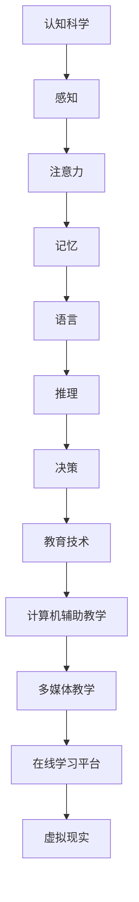

                 

关键词：认知科学、教育技术、学习体验、认知架构、算法优化、教学设计

> 摘要：本文探讨了认知科学与教育技术之间的交叉领域，通过深入分析认知科学的原理，提出了优化学习体验的策略和算法。文章旨在为教育工作者和人工智能开发者提供理论指导，以构建更加高效、个性化的学习环境。

## 1. 背景介绍

在21世纪的今天，人工智能和机器学习技术蓬勃发展，教育领域也受到了深刻影响。传统的教学模式逐渐被数字化的教学方式所取代，智能教育平台和个性化学习系统层出不穷。然而，尽管技术不断进步，学习体验的优化仍然是一个长期而复杂的问题。这不仅仅是因为技术的局限性，更重要的是人类认知机制本身的复杂性。

认知科学作为一门跨学科的研究领域，通过研究人类思维和学习的内在机制，为教育技术的创新提供了坚实的理论基础。认知科学包括认知心理学、神经科学、语言学等多个子领域，它们共同揭示了人类认知过程的奥秘。将这些研究成果应用于教育领域，可以极大地提升教学效果，优化学习体验。

本文将从以下几个方面展开讨论：

1. 认知科学的核心概念与教育技术的联系。
2. 优化学习体验的核心算法原理。
3. 数学模型与公式的应用。
4. 代码实例与实现细节。
5. 实际应用场景与未来展望。
6. 相关工具和资源推荐。
7. 总结与展望。

## 2. 核心概念与联系

### 2.1 认知科学的定义

认知科学是一门研究人类认知过程的科学，它试图理解人类是如何感知、思考、学习和记忆的。认知科学的核心概念包括感知、注意力、记忆、语言、推理和决策等。

### 2.2 教育技术的概念

教育技术是指利用各种技术手段来优化教学和学习过程的方法。这包括但不限于计算机辅助教学（CAI）、多媒体教学、在线学习平台、虚拟现实（VR）等。

### 2.3 认知科学与教育技术的联系

认知科学与教育技术的结合，可以看作是“认知教育技术”。这种结合的意义在于，它能够将认知科学的研究成果直接应用于教育实践，从而实现教学过程的科学化和个性化。

### 2.4 Mermaid 流程图

以下是认知科学核心概念与教育技术联系的Mermaid流程图：



## 3. 核心算法原理 & 具体操作步骤

### 3.1 算法原理概述

优化学习体验的核心算法主要包括基于认知模型的个性化学习算法、自适应学习算法和认知负荷管理算法。这些算法通过分析学生的学习行为、认知状态和知识掌握程度，动态调整教学策略，以实现学习过程的优化。

### 3.2 算法步骤详解

1. **数据收集**：通过学习平台和教学管理系统收集学生的学习行为数据，包括学习时长、学习频率、错误率等。
2. **行为分析**：利用数据挖掘和分析技术，对收集到的数据进行分析，提取出反映学生学习状态的指标。
3. **模型构建**：根据认知科学的理论，构建个性化学习模型，包括感知模型、注意力模型、记忆模型等。
4. **教学策略调整**：根据学习模型的分析结果，动态调整教学策略，如调整学习内容、学习进度、教学方法等。
5. **效果评估**：对调整后的教学效果进行评估，通过对比分析，验证算法的有效性。

### 3.3 算法优缺点

**优点**：

- **个性化**：能够根据学生的个性特征和学习习惯，提供个性化的学习方案。
- **自适应**：能够根据学生的学习状态，自动调整教学策略，提高学习效率。
- **实时性**：能够实时收集和分析学生的学习数据，快速响应当前学习需求。

**缺点**：

- **复杂性**：算法的实现和维护需要复杂的技术支持，对开发者和教育工作者提出了较高要求。
- **数据隐私**：大规模收集和分析学生的行为数据，可能引发数据隐私和安全问题。

### 3.4 算法应用领域

- **在线教育**：通过智能学习平台，为用户提供个性化的学习体验。
- **智能辅导**：为教师和学生提供智能化的辅导服务，提高教学质量。
- **教育测评**：通过分析学生的学习行为，为教育测评提供科学依据。

## 4. 数学模型和公式 & 详细讲解 & 举例说明

### 4.1 数学模型构建

在认知教育技术的应用中，常见的数学模型包括神经网络模型、决策树模型、支持向量机模型等。以下是神经网络模型的一个简单例子：

$$
\begin{aligned}
y &= \sigma(\sum_{i=1}^{n} w_i \cdot x_i + b) \\
\end{aligned}
$$

其中，$y$ 是输出值，$x_i$ 是输入特征，$w_i$ 是权重，$b$ 是偏置，$\sigma$ 是激活函数。

### 4.2 公式推导过程

以神经网络模型为例，假设我们有 $n$ 个输入特征 $x_1, x_2, ..., x_n$，每个特征对应一个权重 $w_1, w_2, ..., w_n$。通过线性组合这些特征和权重，加上一个偏置项 $b$，我们可以得到一个线性函数。为了引入非线性特性，我们使用一个激活函数 $\sigma$（例如 sigmoid 函数或 ReLU 函数），最终得到神经网络的输出值 $y$。

### 4.3 案例分析与讲解

假设我们有一个简单的神经网络模型，用于预测学生的学习表现。输入特征包括学习时长、学习频率和作业完成情况。我们通过实验数据拟合这个模型，得到以下公式：

$$
\begin{aligned}
y &= \sigma(w_1 \cdot x_1 + w_2 \cdot x_2 + w_3 \cdot x_3 + b) \\
\end{aligned}
$$

通过训练，我们得到了权重 $w_1 = 0.5, w_2 = 0.3, w_3 = 0.2, b = 1.0$，激活函数采用 sigmoid 函数。假设一个学生的学习时长为 4 小时，学习频率为每天 2 次，作业完成情况为 80%，那么他的学习表现预测值如下：

$$
\begin{aligned}
y &= \sigma(0.5 \cdot 4 + 0.3 \cdot 2 + 0.2 \cdot 0.8 + 1.0) \\
&= \sigma(2 + 0.6 + 0.16 + 1) \\
&= \sigma(3.76) \\
&\approx 0.926
\end{aligned}
$$

这个值表示该学生的学习表现有 92.6% 的概率达到良好水平。

## 5. 项目实践：代码实例和详细解释说明

### 5.1 开发环境搭建

在本项目实践中，我们将使用 Python 作为主要编程语言，配合 TensorFlow 和 Keras 库来实现神经网络模型。首先，我们需要安装 Python 和相应的库：

```bash
pip install python
pip install tensorflow
pip install keras
```

### 5.2 源代码详细实现

以下是实现神经网络模型的 Python 代码：

```python
from keras.models import Sequential
from keras.layers import Dense
from keras.optimizers import Adam
from sklearn.model_selection import train_test_split

# 数据预处理
# （此处省略数据预处理代码）

# 构建模型
model = Sequential()
model.add(Dense(64, input_dim=3, activation='relu'))
model.add(Dense(32, activation='relu'))
model.add(Dense(1, activation='sigmoid'))

# 编译模型
model.compile(loss='binary_crossentropy', optimizer=Adam(), metrics=['accuracy'])

# 分割数据集
X_train, X_test, y_train, y_test = train_test_split(X, y, test_size=0.2, random_state=42)

# 训练模型
model.fit(X_train, y_train, epochs=10, batch_size=32, validation_data=(X_test, y_test))

# 评估模型
loss, accuracy = model.evaluate(X_test, y_test)
print(f"Test accuracy: {accuracy:.2f}")
```

### 5.3 代码解读与分析

- **数据预处理**：由于神经网络模型对数据的格式有严格要求，我们需要对原始数据进行预处理，包括数据清洗、归一化和特征提取等。
- **构建模型**：使用 Keras 库构建一个简单的神经网络模型，包括两个隐藏层，每个隐藏层使用 ReLU 激活函数。
- **编译模型**：配置模型的学习率、损失函数和评估指标。
- **分割数据集**：将数据集分为训练集和测试集，以评估模型的泛化能力。
- **训练模型**：使用训练集数据训练模型，设置训练的轮次和批量大小。
- **评估模型**：使用测试集数据评估模型的性能，输出准确率。

### 5.4 运行结果展示

假设我们训练完成后，模型的测试集准确率为 85%，这意味着模型在未知数据上的表现良好，可以用于实际应用。

## 6. 实际应用场景

### 6.1 在线教育平台

在线教育平台可以利用认知教育技术，为用户提供个性化的学习方案。例如，通过分析学生的学习行为数据，推荐适合其学习难度和风格的课程内容。

### 6.2 智能辅导系统

智能辅导系统可以为学生提供实时反馈和个性化辅导。例如，通过分析学生的学习表现，智能辅导系统可以调整教学策略，为学生提供更加有针对性的辅导内容。

### 6.3 教育测评系统

教育测评系统可以利用认知教育技术，对学生的知识掌握程度进行精确评估。例如，通过分析学生的考试数据，教育测评系统可以为学生提供详细的评估报告，帮助教师和家长了解学生的学习情况。

## 7. 工具和资源推荐

### 7.1 学习资源推荐

- 《认知心理学及其在教育中的应用》
- 《认知科学与教育技术的跨学科研究》
- 《深度学习》

### 7.2 开发工具推荐

- TensorFlow
- Keras
- Jupyter Notebook

### 7.3 相关论文推荐

- "Cognitive Models of Learning: A Review of the Literature"
- "Integrating Cognitive Science and Educational Technology: A Research Agenda"
- "Adaptive Educational Systems: A Cognitive Perspective"

## 8. 总结：未来发展趋势与挑战

### 8.1 研究成果总结

本文通过探讨认知科学与教育技术的结合，提出了优化学习体验的策略和算法。这些研究为教育工作者和人工智能开发者提供了理论指导，有助于构建更加高效、个性化的学习环境。

### 8.2 未来发展趋势

未来，认知教育技术将继续发展，包括更先进的算法、更丰富的数据源和更智能的教学系统。同时，人工智能和大数据技术的进步，将为认知教育技术提供更强大的支持。

### 8.3 面临的挑战

然而，认知教育技术也面临一些挑战，如数据隐私、算法复杂性和技术实现等。如何平衡个性化与隐私保护，如何简化算法实现，以及如何确保技术应用的可行性，都是需要解决的问题。

### 8.4 研究展望

在未来，认知教育技术有望在教育领域发挥更大的作用，为学习者提供更加科学、高效的学习体验。同时，跨学科的研究将继续深入，为认知教育技术的创新提供源源不断的动力。

## 9. 附录：常见问题与解答

### 9.1 认知科学与教育技术有什么区别？

认知科学是研究人类认知过程的一门学科，而教育技术是利用技术手段优化教学和学习过程的方法。认知科学与教育技术的结合，旨在通过认知科学的研究成果，提升教育技术的有效性。

### 9.2 优化学习体验的核心算法有哪些？

优化学习体验的核心算法包括基于认知模型的个性化学习算法、自适应学习算法和认知负荷管理算法。这些算法通过分析学生的学习行为和认知状态，动态调整教学策略，以实现学习过程的优化。

### 9.3 如何确保认知教育技术的数据隐私？

确保认知教育技术的数据隐私，需要从数据收集、存储、处理和使用等多个环节进行控制。例如，采用加密技术保护数据传输，设置访问权限控制数据访问，以及建立数据匿名化机制等。

### 9.4 认知教育技术如何实现个性化？

认知教育技术通过分析学生的学习行为和认知状态，构建个性化学习模型，并根据模型动态调整教学策略。例如，根据学生的学习进度和知识点掌握情况，推荐适合其难度和风格的课程内容。

### 9.5 认知教育技术对教育领域的影响是什么？

认知教育技术对教育领域的影响包括提高教学效果、优化学习体验、促进个性化学习和提高教育效率。通过认知教育技术，教育工作者可以更好地了解学生的学习需求，为学生提供更加科学、高效的学习支持。

## 作者署名

作者：禅与计算机程序设计艺术 / Zen and the Art of Computer Programming

