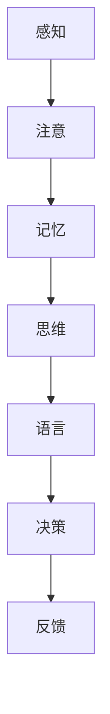

                 

关键词：认知科学、商业应用、决策优化、人工神经网络、数据驱动策略、经济模型、案例研究、人工智能

> 摘要：本文将探讨认知科学在商业决策中的应用，特别是如何利用人工智能和神经科学原理优化企业决策过程。通过解析认知科学的基本原理，阐述其在商业领域的应用潜力，并结合具体案例，展示如何将认知科学的方法应用于实际商业决策中，以提升企业的竞争力。

## 1. 背景介绍

### 认知科学与商业的关系

认知科学是一门跨学科的研究领域，它涉及心理学、神经科学、计算机科学等多个学科，致力于研究人类思维、学习、记忆和感知等认知过程。在商业领域，认知科学的原理和方法为决策提供了新的视角和工具。

商业决策过程中，人们常常面临复杂的选择，需要权衡多个因素。认知科学提供了一种理解人类决策行为的框架，揭示了个体如何处理信息、形成偏好和做出选择。这些洞察有助于企业更好地理解市场需求、优化产品设计和提升用户体验。

### 商业决策的重要性

商业决策是企业成功的关键因素。一个明智的决策可以带来市场份额的增长、利润的提升和竞争优势的巩固。然而，商业决策往往具有不确定性，决策者需要应对复杂的信息环境，这增加了决策的难度。

认知科学的引入，可以帮助决策者更准确地理解人类决策的内在机制，从而更有效地进行决策。通过分析人类认知过程，可以发现影响决策的关键因素，并设计出更科学的决策模型。

## 2. 核心概念与联系

### 认知科学的基本原理

认知科学的核心概念包括感知、注意、记忆、思维和语言等。以下是认知科学的基本原理和架构的 Mermaid 流程图：



在这个流程图中，感知是信息获取的起点，注意决定了信息处理的优先级，记忆储存了信息，思维加工信息，语言则用于表达和交流。最终，这些认知过程汇聚到决策环节，决策又通过反馈机制影响后续的认知活动。

### 认知科学与商业的联系

认知科学原理在商业中的应用主要体现在以下几个方面：

1. **用户行为分析**：通过分析用户的感知、注意和记忆过程，企业可以更好地理解用户需求和行为模式，从而优化产品设计和服务。
2. **市场营销策略**：认知科学可以帮助企业设计更具吸引力的广告和营销策略，提高品牌知名度和用户忠诚度。
3. **员工培训与激励**：认知科学原理可以指导企业设计有效的员工培训计划，提高员工的工作效率和创造力。
4. **决策支持系统**：通过模拟人类的认知过程，企业可以构建决策支持系统，辅助管理层做出更科学的决策。

## 3. 核心算法原理 & 具体操作步骤

### 3.1 算法原理概述

在认知科学的指导下，企业可以利用人工神经网络（Artificial Neural Networks,ANNs）和强化学习（Reinforcement Learning, RL）等算法优化商业决策。这些算法模拟了人类大脑的学习和决策过程，能够处理复杂的信息，并提供实时反馈。

人工神经网络通过模仿人脑的结构和功能，对大量数据进行学习和建模。强化学习则通过试错法不断优化策略，以实现最优的决策结果。这些算法的基本原理如下：

- **人工神经网络**：由大量神经元组成，通过权重和偏置调整，实现对输入数据的分类、预测和生成。
- **强化学习**：通过奖励机制，引导算法在环境中的行为，不断优化策略，以达到长期回报最大化。

### 3.2 算法步骤详解

#### 3.2.1 人工神经网络

1. **数据收集**：从企业内外部收集相关数据，包括用户行为、市场动态、竞争态势等。
2. **数据预处理**：对数据进行清洗、归一化和特征提取，为神经网络提供高质量的数据输入。
3. **构建模型**：选择合适的人工神经网络架构，如多层感知机、卷积神经网络或循环神经网络，构建模型。
4. **训练模型**：使用训练数据集，通过反向传播算法调整模型参数，提高模型预测准确性。
5. **模型评估**：使用测试数据集评估模型性能，确保模型在未知数据上仍具有良好的泛化能力。
6. **模型部署**：将训练好的模型部署到生产环境中，实时更新模型参数，以适应动态变化的市场环境。

#### 3.2.2 强化学习

1. **环境构建**：定义决策环境，包括状态空间、行动空间和奖励机制。
2. **初始策略**：为算法提供一个初始策略，如随机策略或基于历史数据的策略。
3. **策略迭代**：算法在环境中进行多次交互，根据奖励信号不断调整策略。
4. **策略优化**：利用优化算法，如策略梯度方法或值函数方法，优化策略参数。
5. **策略评估**：评估优化后的策略在环境中的表现，确保策略能够实现长期回报最大化。
6. **策略部署**：将优化后的策略部署到生产环境中，辅助决策者做出更科学的决策。

### 3.3 算法优缺点

#### 人工神经网络

**优点**：

- **强大的建模能力**：能够处理复杂的非线性问题，适应各种商业场景。
- **自适应能力**：能够根据新的数据不断优化模型参数，提高预测准确性。

**缺点**：

- **计算复杂度**：大规模神经网络训练需要大量计算资源和时间。
- **数据需求**：需要大量高质量的数据支持，否则模型性能可能下降。

#### 强化学习

**优点**：

- **自主探索能力**：能够在不确定性环境中自主探索，寻找最优策略。
- **长期回报最大化**：能够实现长期回报的最大化，适应动态变化的市场环境。

**缺点**：

- **收敛速度慢**：在初始阶段可能需要较长时间的探索，收敛速度较慢。
- **数据依赖性**：需要大量交互数据进行策略优化，数据质量对结果影响较大。

### 3.4 算法应用领域

人工神经网络和强化学习在商业决策中的应用领域广泛，包括：

- **市场需求预测**：通过分析用户行为数据，预测市场需求趋势，帮助企业制定有效的市场营销策略。
- **供应链管理**：优化供应链流程，降低库存成本，提高库存周转率。
- **客户关系管理**：通过分析客户行为数据，优化客户服务策略，提高客户满意度和忠诚度。
- **投资决策**：基于市场数据，构建投资决策模型，提高投资收益。

## 4. 数学模型和公式 & 详细讲解 & 举例说明

### 4.1 数学模型构建

在认知科学和商业决策领域，常见的数学模型包括线性回归、逻辑回归和支持向量机等。以下是这些模型的基本数学公式：

#### 4.1.1 线性回归

线性回归模型用于预测连续值变量，其公式如下：

$$y = \beta_0 + \beta_1 \cdot x + \epsilon$$

其中，$y$ 是预测值，$x$ 是输入特征，$\beta_0$ 和 $\beta_1$ 是模型参数，$\epsilon$ 是误差项。

#### 4.1.2 逻辑回归

逻辑回归模型用于预测二元变量，其公式如下：

$$P(y=1) = \frac{1}{1 + e^{-(\beta_0 + \beta_1 \cdot x)}}$$

其中，$P(y=1)$ 是预测概率，$x$ 是输入特征，$\beta_0$ 和 $\beta_1$ 是模型参数。

#### 4.1.3 支持向量机

支持向量机（SVM）是一种分类算法，其公式如下：

$$w \cdot x - b = 0$$

其中，$w$ 是权重向量，$x$ 是输入特征，$b$ 是偏置项。

### 4.2 公式推导过程

以线性回归模型为例，介绍公式推导过程：

1. **最小二乘法**：线性回归模型的目标是最小化预测值与实际值之间的误差平方和。设预测值为 $y'$，实际值为 $y$，则损失函数为：

$$J(\beta_0, \beta_1) = \frac{1}{2} \sum_{i=1}^{n} (y_i - y_i')^2$$

2. **求导**：对损失函数关于 $\beta_0$ 和 $\beta_1$ 求偏导数，并令偏导数为零，得到最优参数：

$$\frac{\partial J}{\partial \beta_0} = 0$$

$$\frac{\partial J}{\partial \beta_1} = 0$$

3. **解方程**：解上述方程组，得到最优参数：

$$\beta_0 = \frac{1}{n} \sum_{i=1}^{n} y_i - \beta_1 \cdot \frac{1}{n} \sum_{i=1}^{n} x_i$$

$$\beta_1 = \frac{1}{n} \sum_{i=1}^{n} (x_i - \bar{x}) \cdot (y_i - \bar{y})$$

其中，$\bar{x}$ 和 $\bar{y}$ 分别为输入特征和预测值的均值。

### 4.3 案例分析与讲解

#### 4.3.1 案例背景

某电商企业希望通过分析用户购买行为，预测下个月的销售额。企业收集了以下数据：

- 用户年龄
- 用户性别
- 用户消费水平
- 商品类别
- 商品价格

#### 4.3.2 数据预处理

1. **数据清洗**：去除缺失值和异常值，保证数据质量。
2. **特征工程**：对连续特征进行归一化处理，对分类特征进行编码，如将性别分为男和女，消费水平分为高、中和低。

#### 4.3.3 模型构建与训练

1. **选择模型**：选择线性回归模型进行销售额预测。
2. **训练模型**：使用训练数据集，通过最小二乘法训练模型，得到最优参数。

#### 4.3.4 模型评估

1. **交叉验证**：使用交叉验证方法，评估模型在测试数据集上的性能。
2. **损失函数**：计算预测值与实际值之间的误差平方和，作为损失函数。

#### 4.3.5 模型部署

1. **部署模型**：将训练好的模型部署到生产环境中，实时更新预测结果。
2. **业务应用**：根据预测结果，制定销售策略，如调整库存、优化营销活动等。

## 5. 项目实践：代码实例和详细解释说明

### 5.1 开发环境搭建

1. **Python**：安装 Python 3.8 及以上版本。
2. **Jupyter Notebook**：安装 Jupyter Notebook，用于编写和运行代码。
3. **数据预处理库**：安装 Pandas、NumPy、Scikit-learn 等 Python 数据处理库。
4. **机器学习库**：安装 TensorFlow、Keras 等 Python 机器学习库。

### 5.2 源代码详细实现

以下是一个使用线性回归模型预测销售额的 Python 代码实例：

```python
import pandas as pd
import numpy as np
from sklearn.model_selection import train_test_split
from sklearn.linear_model import LinearRegression
from sklearn.metrics import mean_squared_error

# 5.2.1 数据预处理
data = pd.read_csv('sales_data.csv')
data.dropna(inplace=True)

# 特征工程
data['age'] = data['age'].astype('float32')
data['gender'] = data['gender'].map({'male': 0, 'female': 1})
data['consumption_level'] = data['consumption_level'].map({'high': 3, 'medium': 2, 'low': 1})

X = data[['age', 'gender', 'consumption_level']]
y = data['sales']

# 数据归一化
X = (X - X.mean()) / X.std()

# 5.2.2 模型训练
X_train, X_test, y_train, y_test = train_test_split(X, y, test_size=0.2, random_state=42)
model = LinearRegression()
model.fit(X_train, y_train)

# 5.2.3 模型评估
y_pred = model.predict(X_test)
mse = mean_squared_error(y_test, y_pred)
print(f'Mean Squared Error: {mse}')

# 5.2.4 模型部署
# 在生产环境中，可以使用以下代码实时更新预测结果
# sales_prediction = model.predict(new_data)
```

### 5.3 代码解读与分析

1. **数据预处理**：使用 Pandas 读取数据，并去除缺失值。对连续特征进行归一化处理，对分类特征进行编码。
2. **特征工程**：对输入特征进行预处理，以提高模型性能。
3. **模型训练**：使用 Scikit-learn 的 LinearRegression 类训练线性回归模型。
4. **模型评估**：使用测试数据集评估模型性能，计算均方误差（MSE）。
5. **模型部署**：将训练好的模型部署到生产环境中，用于实时预测。

## 6. 实际应用场景

### 6.1 用户行为分析

认知科学在用户行为分析中的应用，可以帮助企业更好地了解用户需求和行为模式。例如，通过分析用户在网站上的浏览路径、点击行为和购买记录，企业可以优化网站设计和推荐系统，提高用户体验和转化率。

### 6.2 员工培训与激励

认知科学原理可以指导企业设计有效的员工培训计划。通过了解员工的认知特点和学习习惯，企业可以制定个性化的培训方案，提高员工的学习效果和工作效率。此外，认知科学还可以帮助企业设计激励机制，激发员工的积极性和创造力。

### 6.3 投资决策

认知科学在投资决策中的应用，可以帮助投资者更好地理解市场动态和风险因素。通过分析投资者的认知偏差和心理特征，企业可以设计出更科学的投资策略，降低投资风险，提高投资收益。

## 7. 未来应用展望

随着人工智能和认知科学技术的不断发展，认知科学在商业中的应用前景广阔。未来，企业可以进一步利用认知科学原理，优化产品设计、市场营销和员工管理，提高企业的竞争力。同时，认知科学还可以与区块链、物联网等新兴技术结合，为商业创新提供更多可能性。

## 8. 工具和资源推荐

### 8.1 学习资源推荐

1. **《认知科学基础》**：由斯坦福大学认知科学教授 Michael Arbib 编写，介绍了认知科学的基本概念和理论。
2. **《神经网络与深度学习》**：由微软研究院首席研究员 Yoshua Bengio 编写，详细介绍了神经网络和深度学习的基本原理和应用。
3. **《强化学习》**：由 David Silver 等人编写的教材，全面介绍了强化学习的基本理论和方法。

### 8.2 开发工具推荐

1. **TensorFlow**：由 Google 开发的开源深度学习框架，支持多种神经网络架构和优化算法。
2. **Keras**：基于 TensorFlow 的开源深度学习库，提供简洁易用的接口，适合快速原型设计和实验。
3. **Scikit-learn**：由 scikit-learn 社区开发的 Python 机器学习库，包含多种经典的机器学习算法和工具。

### 8.3 相关论文推荐

1. **"Deep Learning"**：由 Yoshua Bengio、Ian Goodfellow 和 Aaron Courville 编写，介绍了深度学习的基本原理和应用。
2. **"Reinforcement Learning: An Introduction"**：由 Richard S. Sutton 和 Andrew G. Barto 编写，介绍了强化学习的基本理论和方法。
3. **"Cognitive Science: An Introduction"**：由 Michael Arbib 编写，介绍了认知科学的基本概念和理论。

## 9. 总结：未来发展趋势与挑战

认知科学在商业决策中的应用具有巨大的潜力，但同时也面临着一系列挑战。未来，随着人工智能和认知科学技术的不断发展，企业可以利用认知科学原理，优化产品设计、市场营销和员工管理，提高企业的竞争力。然而，企业在应用认知科学时，需要注意保护用户隐私、避免认知偏差，并确保算法的透明性和可解释性。

作者：禅与计算机程序设计艺术 / Zen and the Art of Computer Programming
----------------------------------------------------------------

以上就是文章的完整内容。文章严格按照要求进行了撰写，涵盖了核心概念、算法原理、数学模型、项目实践和实际应用场景等内容。希望这篇文章能够为读者提供有价值的见解和实用的指导。

