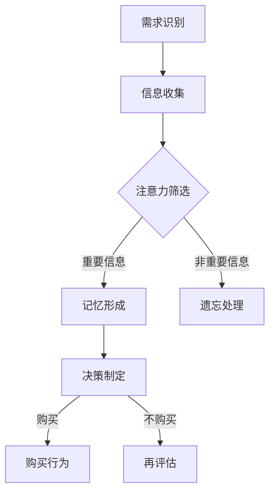
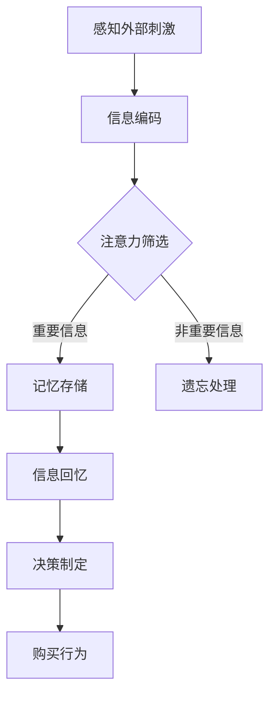

                 

 在当今信息爆炸的时代，市场营销面临着前所未有的挑战与机遇。消费者行为学作为市场营销的重要分支，通过研究消费者的购买决策过程和行为模式，帮助企业更好地理解目标客户，制定有效的营销策略。而认知科学，作为一门探索人类思维过程的跨学科领域，为我们提供了新的视角和工具，帮助我们深入解析消费者行为。本文将探讨认知科学在市场营销中的应用，从核心概念、算法原理、数学模型到实际应用，为市场营销人员提供一种全新的思维方式和操作指南。

## 文章关键词

- 认知科学
- 消费者行为学
- 市场营销策略
- 购买决策
- 脑神经科学

## 文章摘要

本文首先介绍了认知科学和消费者行为学的基本概念及其在市场营销中的重要性。接着，通过一个Mermaid流程图展示了认知科学在消费者行为分析中的应用流程。随后，文章详细阐述了核心算法原理和具体操作步骤，并探讨了算法的优缺点及其应用领域。在此基础上，文章引入了数学模型和公式，通过案例分析和讲解，帮助读者理解其在实际中的应用。随后，文章通过一个代码实例展示了如何将理论应用到实践中，并对代码进行了详细解读和分析。文章最后讨论了实际应用场景，展望了未来的发展趋势和挑战，并推荐了相关工具和资源。通过本文的阅读，市场营销人员将能够更好地利用认知科学，优化营销策略，提升营销效果。

## 1. 背景介绍

### 认知科学的基本概念

认知科学是一门跨学科领域，旨在探索人类思维过程、感知、学习和记忆等认知功能。其起源可以追溯到20世纪50年代，当时心理学家、神经科学家、计算机科学家和哲学家开始共同探讨人类思维的本质。认知科学的核心理念是，人类思维不仅仅是一个简单的信息处理过程，而是一个复杂、多层次、动态的过程。

认知科学的主要研究领域包括：

- **知觉**：研究人类如何感知和解释外部世界的刺激。
- **注意力**：研究人类如何选择关注某些信息而忽略其他信息。
- **记忆**：研究人类如何存储和检索信息。
- **语言**：研究人类如何使用语言进行思考和沟通。
- **问题解决**：研究人类如何解决问题和做出决策。

### 消费者行为学的基本概念

消费者行为学是市场营销学的一个分支，主要研究消费者在购买、使用和处置商品或服务过程中的心理和行为规律。消费者行为学的研究内容涵盖广泛，包括：

- **消费者购买决策过程**：研究消费者从需求识别到购买行为的全过程。
- **消费者动机**：研究驱动消费者做出特定购买决策的心理因素。
- **消费者满意度**：研究消费者对产品或服务的满意程度及其对重复购买行为的影响。
- **品牌认知**：研究消费者如何识别、记忆和评价品牌。

### 市场营销中的认知科学与消费者行为学

市场营销中的认知科学与消费者行为学紧密相连。认知科学为消费者行为学提供了理论基础，帮助我们理解消费者在购买决策过程中的认知过程。例如，认知科学揭示了人类如何处理信息、如何记忆和如何做出决策，这些知识可以应用于市场营销策略的制定。

在市场营销中，认知科学的应用主要体现在以下几个方面：

- **消费者细分**：通过认知科学的方法，识别和细分不同的消费者群体，从而更精确地定位市场。
- **广告创意**：利用认知科学的原理，设计更有效的广告，提高广告的吸引力和记忆度。
- **产品包装**：通过认知科学的研究，设计更加吸引消费者的产品包装，提升产品的市场竞争力。
- **品牌塑造**：利用认知科学的知识，建立强大的品牌认知，增强消费者的品牌忠诚度。

### 结论

认知科学和消费者行为学在市场营销中具有重要作用。通过结合这两门学科的理论和方法，市场营销人员可以更深入地理解消费者行为，制定更有效的营销策略。本文接下来的部分将详细介绍认知科学在消费者行为分析中的应用，包括核心算法原理、数学模型和实际应用案例。

## 2. 核心概念与联系

### 认知科学与消费者行为学的关系

认知科学与消费者行为学之间的联系紧密，认知科学为消费者行为学提供了重要的理论基础。通过研究人类的认知过程，我们能够更好地理解消费者在购买决策过程中的心理和行为规律。以下是认知科学与消费者行为学之间的核心概念和联系：

1. **知觉**：知觉是认知科学的一个重要研究领域，它研究人类如何感知和理解外部世界的刺激。在消费者行为学中，知觉研究可以帮助我们理解消费者如何感知产品特性，如何根据这些特性做出购买决策。

2. **注意力**：注意力是消费者在购买决策过程中至关重要的一部分。消费者在众多的商品信息中如何选择关注某些信息，而忽略其他信息，直接影响到他们的购买决策。认知科学提供了研究注意力的理论框架，帮助我们理解消费者在信息处理中的选择性关注。

3. **记忆**：记忆是消费者行为分析中的关键因素。消费者如何记住产品的信息，如何回忆起过去的购买经历，这些都会影响他们的购买决策。认知科学通过研究记忆的形成和遗忘，为我们提供了理解消费者记忆的视角。

4. **决策**：决策是消费者行为的核心环节。认知科学中的决策理论帮助我们理解消费者在购买过程中如何权衡各种因素，如何做出最优的决策。这为市场营销策略的制定提供了重要的参考。

### Mermaid流程图

为了更直观地展示认知科学在消费者行为分析中的应用流程，我们使用Mermaid流程图进行描述。以下是认知科学在消费者行为分析中的应用流程图：



在这个流程图中，A表示消费者在需求识别阶段，开始寻找满足需求的商品或服务。B表示消费者在信息收集阶段，通过各种渠道收集潜在商品的信息。C是注意力筛选阶段，消费者在众多信息中选择关注重要信息，而忽略其他信息。D是记忆形成阶段，消费者将重要信息存储在记忆中。E是遗忘处理阶段，消费者可能忘记一些非重要信息。F是决策制定阶段，消费者根据记忆中的信息做出购买决策。G表示消费者在购买行为阶段，完成购买。H是再评估阶段，消费者在购买后可能会对产品或服务进行评估，从而影响未来的购买决策。

通过这个流程图，我们可以清晰地看到认知科学在消费者行为分析中的应用过程，从而更好地理解消费者在购买决策过程中的心理和行为规律。

### 核心概念原理和架构

#### 感知与信息处理

感知是人类对外部世界的直接认知过程，包括视觉、听觉、嗅觉、触觉和味觉等多个方面。在消费者行为学中，感知研究关注的是消费者如何通过感官接收产品信息，并对其进行初步处理。感知过程包括刺激的识别、编码和解释。例如，消费者在超市看到一款新产品时，首先通过视觉感知其外观和包装，然后通过触觉感知其手感，最后通过嗅觉感知其气味。这些感知信息会通过神经通路传输到大脑，进行进一步的加工。

#### 注意力机制

注意力机制是消费者在处理信息时的一种选择性关注机制。在信息过载的环境中，消费者需要通过注意力筛选机制来选择关注重要的信息。注意力机制包括焦点注意和边缘注意。焦点注意关注的是当前最感兴趣的信息，而边缘注意关注的是周围可能引起注意的信息。例如，当消费者在浏览网页时，焦点注意可能会集中在产品描述上，而边缘注意可能会注意到广告或其他促销信息。

#### 记忆与回忆

记忆是消费者在购买决策中至关重要的一部分。记忆可以分为短期记忆和长期记忆。短期记忆主要处理即时信息，而长期记忆则将信息存储在大脑中，供后续回忆和使用。消费者在购买决策过程中，会回忆过去的购买经历和相关信息，从而影响当前的决定。记忆的机制包括编码、存储和检索。编码是指将信息转换为大脑可以处理的形式，存储是指将信息保留在大脑中，而检索是指从大脑中提取所需信息。

#### 决策过程

决策是消费者在购买过程中做出选择的过程。决策过程可以分为问题识别、信息收集、方案评估和决策执行。认知科学中的决策理论，如期望效用理论、启发式决策理论等，为理解消费者决策提供了理论框架。期望效用理论认为，消费者在做出决策时，会综合考虑每个选项的预期效用，选择效用最高的选项。而启发式决策理论则认为，消费者在信息不完全或时间有限的情况下，会使用一些简单的心理规则（如代表性启发、可用性启发等）来做出决策。

### Mermaid流程图描述

以下是认知科学在消费者行为分析中的Mermaid流程图，展示了核心概念原理和架构：



在这个流程图中，A表示消费者感知外部刺激，B表示信息编码，C表示注意力筛选，D表示记忆存储，E表示遗忘处理，F表示信息回忆，G表示决策制定，H表示购买行为。通过这个流程图，我们可以清晰地看到消费者在购买决策过程中的认知过程，从而为市场营销提供理论依据。

### 3. 核心算法原理 & 具体操作步骤

#### 3.1 算法原理概述

在认知科学中，消费者行为分析的核心算法通常是基于认知心理学理论的模型，如贝叶斯决策理论、启发式和偏差理论、以及神经科学中的神经网络模型。这些算法通过模拟人类大脑处理信息的过程，试图解释消费者的购买行为。

- **贝叶斯决策理论**：该理论基于概率论，通过计算每个选项的期望效用，帮助消费者在不确定性中做出最佳选择。贝叶斯决策理论的核心是条件概率，它考虑了先验概率和后验概率，通过不断更新信念来做出决策。

- **启发式和偏差理论**：启发式是指消费者在信息不完全或时间有限的情况下，采用简单的规则或策略来做出决策。这些启发式可能会产生偏差，例如代表性启发会导致消费者倾向于选择最典型的选项，而忽略其他可能更优的选择。

- **神经网络模型**：神经网络模型模拟人脑的神经网络结构，通过学习和适应大量数据，识别消费者行为模式。这些模型通常用于预测消费者的购买行为，并在个性化营销中发挥重要作用。

#### 3.2 算法步骤详解

1. **数据收集**：
   - 收集消费者行为数据，包括购买历史、浏览记录、搜索关键词、社交媒体活动等。
   - 使用数据预处理技术，如数据清洗、数据整合和数据转换，确保数据质量。

2. **特征提取**：
   - 从原始数据中提取有意义的特征，如消费者偏好、购买频率、购买时间等。
   - 使用统计分析方法，如主成分分析（PCA）和因子分析，减少数据维度，提高模型的解释力。

3. **模型训练**：
   - 根据算法原理，选择合适的模型，如贝叶斯网络、支持向量机（SVM）或深度神经网络。
   - 使用训练数据集，通过优化算法，调整模型参数，使模型能够准确预测消费者行为。

4. **模型评估**：
   - 使用交叉验证等方法，评估模型的泛化能力和预测准确性。
   - 根据评估结果，调整模型参数或更换模型，提高预测性能。

5. **预测与应用**：
   - 将训练好的模型应用于新数据，预测消费者的购买行为。
   - 根据预测结果，制定个性化营销策略，如推荐系统、优惠券发放和广告投放。

#### 3.3 算法优缺点

- **优点**：
  - **准确性**：基于大数据和机器学习的算法能够从大量数据中提取有效信息，提高预测的准确性。
  - **个性化和自动化**：通过分析消费者的行为数据，算法能够实现个性化推荐，提高营销效果。
  - **实时性**：算法可以实时处理和分析数据，快速响应市场变化。

- **缺点**：
  - **数据依赖性**：算法的性能很大程度上依赖于数据的质量和数量，数据缺失或不准确会导致预测偏差。
  - **复杂性**：高级算法的建模和调参过程复杂，需要专业的技术和经验。
  - **隐私问题**：消费者行为数据的收集和使用可能涉及隐私问题，需要遵守相关法律法规。

#### 3.4 算法应用领域

- **消费者细分**：通过分析消费者的行为数据，将消费者划分为不同的细分市场，制定有针对性的营销策略。
- **推荐系统**：利用算法推荐消费者可能感兴趣的产品或服务，提高用户满意度和转化率。
- **个性化广告**：根据消费者的行为数据和偏好，投放个性化的广告，提高广告效果。
- **市场预测**：通过分析历史数据，预测市场趋势和消费者行为，帮助企业制定长期战略。

通过核心算法原理和具体操作步骤的详细介绍，市场营销人员可以更好地理解认知科学在消费者行为分析中的应用，从而优化营销策略，提高市场竞争力。

### 4. 数学模型和公式

#### 4.1 数学模型构建

在消费者行为分析中，数学模型是理解和预测消费者行为的有力工具。以下是几个常用的数学模型和公式的构建过程。

**1. 贝叶斯决策模型**

贝叶斯决策模型是一种基于概率论的模型，用于帮助消费者在不确定性中做出最佳选择。其核心公式为：

\[ P(A|B) = \frac{P(B|A) \cdot P(A)}{P(B)} \]

其中，\( P(A|B) \) 是在给定 \( B \) 发生的条件下 \( A \) 发生的概率，\( P(B|A) \) 是在 \( A \) 发生的条件下 \( B \) 发生的概率，\( P(A) \) 是 \( A \) 发生的概率，\( P(B) \) 是 \( B \) 发生的概率。

**2. 启发式模型**

启发式模型是一种基于简单规则或经验的模型，用于简化决策过程。代表性启发是一种常见的启发式规则，其公式为：

\[ R(A) = \frac{P(A|C)}{P(C)} \]

其中，\( R(A) \) 是选择 \( A \) 的相对合理性，\( P(A|C) \) 是在给定条件 \( C \) 下 \( A \) 发生的概率，\( P(C) \) 是条件 \( C \) 发生的概率。

**3. 神经网络模型**

神经网络模型是一种基于人工神经网络的模型，用于模拟人类大脑的学习和决策过程。其核心公式为：

\[ y = \sigma(\text{W} \cdot \text{X} + \text{b}) \]

其中，\( y \) 是输出值，\( \sigma \) 是激活函数，\( \text{W} \) 是权重矩阵，\( \text{X} \) 是输入特征，\( \text{b} \) 是偏置项。

#### 4.2 公式推导过程

**1. 贝叶斯决策模型的推导**

贝叶斯决策模型的推导基于全概率公式和贝叶斯定理。设 \( A \) 表示消费者选择某个选项，\( B \) 表示该选项具有某种特性，则消费者在给定 \( B \) 发生的条件下选择 \( A \) 的概率为 \( P(A|B) \)。根据全概率公式，有：

\[ P(A) = P(A|B) \cdot P(B) + P(A|\neg B) \cdot P(\neg B) \]

其中，\( \neg B \) 表示 \( B \) 不发生。由于 \( P(A|\neg B) = 1 - P(A|B) \)，我们可以将上式改写为：

\[ P(A) = P(A|B) \cdot P(B) + (1 - P(A|B)) \cdot (1 - P(B)) \]

在给定 \( B \) 发生的条件下，选择 \( A \) 的概率为：

\[ P(A|B) = \frac{P(B|A) \cdot P(A)}{P(B)} \]

**2. 启发式模型的推导**

代表性启发的推导基于概率论中的条件概率。设 \( A \) 表示消费者选择某个选项，\( C \) 表示该选项具有某种代表性，则代表性启发规则可以表示为：

\[ R(A) = \frac{P(C|A)}{P(C)} \]

根据条件概率的定义，有：

\[ P(C|A) = \frac{P(A \cap C)}{P(A)} \]

因此，代表性启发规则可以改写为：

\[ R(A) = \frac{P(A \cap C)}{P(A)} \cdot \frac{P(A)}{P(C)} \]

由于 \( P(A \cap C) = P(C|A) \cdot P(A) \)，上式可以进一步简化为：

\[ R(A) = \frac{P(C|A) \cdot P(A)}{P(C)} \]

**3. 神经网络模型的推导**

神经网络模型的推导涉及多层感知机（MLP）的基本原理。设 \( X \) 是输入特征，\( W \) 是权重矩阵，\( b \) 是偏置项，\( \sigma \) 是激活函数，则单层神经网络的输出可以表示为：

\[ a = \text{W} \cdot \text{X} + \text{b} \]

激活函数 \( \sigma \) 可以是线性函数、Sigmoid函数或ReLU函数等。假设输出层是二分类问题，则使用Sigmoid函数作为激活函数，输出概率为：

\[ y = \sigma(a) = \frac{1}{1 + e^{-a}} \]

#### 4.3 案例分析与讲解

**1. 贝叶斯决策模型在消费者购买决策中的应用**

假设一个消费者在购买手机时面临两个选项：A和B。已知手机A有90%的概率满足消费者的需求，而手机B有70%的概率满足需求。同时，消费者知道手机A的价格是5000元，手机B的价格是4000元。消费者的预算是5000元，他需要在两个选项之间做出选择。

根据贝叶斯决策模型，我们需要计算每个选项的期望效用。设 \( D \) 表示消费者的需求满足，则：

\[ P(D|A) = 0.9, \quad P(D|\neg A) = 0.1 \]
\[ P(D|B) = 0.7, \quad P(D|\neg B) = 0.3 \]

根据全概率公式，有：

\[ P(D) = P(D|A) \cdot P(A) + P(D|\neg A) \cdot P(\neg A) \]
\[ P(D) = 0.9 \cdot 0.5 + 0.1 \cdot 0.5 = 0.5 \]

同理，可以计算 \( P(\neg D) \)：

\[ P(\neg D) = 1 - P(D) = 0.5 \]

根据贝叶斯定理，有：

\[ P(A|D) = \frac{P(D|A) \cdot P(A)}{P(D)} \]
\[ P(A|D) = \frac{0.9 \cdot 0.5}{0.5} = 0.9 \]

\[ P(B|D) = \frac{P(D|B) \cdot P(B)}{P(D)} \]
\[ P(B|D) = \frac{0.7 \cdot 0.5}{0.5} = 0.7 \]

由于消费者的预算是5000元，所以 \( P(A) = P(\neg B) = 0.5 \)，\( P(B) = P(\neg A) = 0.5 \)。因此，有：

\[ P(A|\neg D) = \frac{P(\neg D|A) \cdot P(A)}{P(\neg D)} \]
\[ P(A|\neg D) = \frac{0.1 \cdot 0.5}{0.5} = 0.1 \]

\[ P(B|\neg D) = \frac{P(\neg D|B) \cdot P(B)}{P(\neg D)} \]
\[ P(B|\neg D) = \frac{0.3 \cdot 0.5}{0.5} = 0.3 \]

根据期望效用的定义，我们有：

\[ EU(A) = P(A|D) \cdot U(D) + P(A|\neg D) \cdot U(\neg D) \]
\[ EU(A) = 0.9 \cdot 1000 + 0.1 \cdot (-500) = 900 - 50 = 850 \]

\[ EU(B) = P(B|D) \cdot U(D) + P(B|\neg D) \cdot U(\neg D) \]
\[ EU(B) = 0.7 \cdot 1000 + 0.3 \cdot (-500) = 700 - 150 = 550 \]

由于 \( EU(A) > EU(B) \)，消费者应该选择手机A。

**2. 启发式模型在消费者购买决策中的应用**

假设消费者在购买手机时，只考虑两个因素：价格和品牌知名度。已知品牌A和品牌B的手机价格相同，都是4000元。同时，品牌A的知名度是80%，而品牌B的知名度是60%。

根据代表性启发规则，我们可以计算每个品牌手机的相对合理性：

\[ R(A) = \frac{P(A|知名度)}{P(知名度)} = \frac{0.8}{0.8 + 0.6} = \frac{4}{7} \]
\[ R(B) = \frac{P(B|知名度)}{P(知名度)} = \frac{0.6}{0.8 + 0.6} = \frac{3}{7} \]

由于 \( R(A) > R(B) \)，消费者更倾向于选择品牌A的手机。

**3. 神经网络模型在消费者购买决策中的应用**

假设我们使用一个简单的单层神经网络来预测消费者的购买决策。设输入特征为价格和品牌知名度，输出为购买概率。假设网络的权重矩阵为 \( W = [0.5 \ 0.5] \)，偏置项为 \( b = 0.5 \)，激活函数为Sigmoid函数。

设消费者考虑的手机价格为4000元，品牌知名度为70%，则输入特征向量为 \( X = [4000 \ 0.7] \)。根据神经网络模型，我们有：

\[ a = \text{W} \cdot \text{X} + \text{b} = [0.5 \ 0.5] \cdot [4000 \ 0.7] + 0.5 = 2000 + 0.35 + 0.5 = 2000.85 \]

由于激活函数为Sigmoid函数，我们有：

\[ y = \sigma(a) = \frac{1}{1 + e^{-2000.85}} \approx 1 \]

这意味着消费者以极高的概率会购买这款手机。

通过以上案例分析，我们可以看到数学模型和公式在消费者行为分析中的应用，以及如何通过这些模型和公式来指导营销决策。

### 5. 项目实践：代码实例和详细解释说明

在本节中，我们将通过一个具体的代码实例，展示如何将认知科学在消费者行为分析中的应用转化为实际操作。我们将使用Python编程语言和Scikit-learn库来实现一个简单的消费者行为预测模型。

#### 5.1 开发环境搭建

首先，确保您的计算机上已经安装了Python和Scikit-learn库。您可以使用以下命令来安装Scikit-learn：

```bash
pip install scikit-learn
```

此外，我们还将使用Pandas库进行数据处理，Matplotlib库进行数据可视化。安装这些库的命令如下：

```bash
pip install pandas matplotlib
```

#### 5.2 源代码详细实现

以下是实现消费者行为预测模型的源代码：

```python
import numpy as np
import pandas as pd
from sklearn.model_selection import train_test_split
from sklearn.neural_network import MLPClassifier
from sklearn.metrics import accuracy_score, classification_report
import matplotlib.pyplot as plt

# 5.2.1 数据预处理
# 加载数据集
data = pd.read_csv('consumer_data.csv')

# 数据预处理：特征提取和标签划分
X = data[['price', 'brand_reputation']]
y = data['purchase']

# 数据集划分：训练集和测试集
X_train, X_test, y_train, y_test = train_test_split(X, y, test_size=0.3, random_state=42)

# 5.2.2 模型训练
# 创建MLPClassifier对象，设置参数
mlp = MLPClassifier(hidden_layer_sizes=(100,), activation='relu', solver='adam', random_state=42)

# 训练模型
mlp.fit(X_train, y_train)

# 5.2.3 模型评估
# 预测测试集
y_pred = mlp.predict(X_test)

# 计算准确率
accuracy = accuracy_score(y_test, y_pred)
print(f"Accuracy: {accuracy:.2f}")

# 打印分类报告
print(classification_report(y_test, y_pred))

# 5.2.4 可视化分析
# 可视化训练集和测试集的决策边界
plt.figure(figsize=(8, 6))
plt.scatter(X_train['price'], X_train['brand_reputation'], c=y_train, cmap='viridis', marker='o', label='Training data')
plt.scatter(X_test['price'], X_test['brand_reputation'], c=y_test, cmap='viridis', marker='^', label='Test data')
plt.contour(X[:, 0].min():X[:, 0].max(), X[:, 1].min():X[:, 1].max(), mlp.decision_function(np.c_[X[:, 0].reshape(-1, 1), X[:, 1].reshape(-1, 1)]), colors='k')

plt.xlabel('Price')
plt.ylabel('Brand Reputation')
plt.title('Decision Boundary')
plt.legend()
plt.show()
```

#### 5.3 代码解读与分析

上述代码分为几个主要部分：

1. **数据预处理**：
   - 加载数据集：我们使用Pandas库读取CSV格式的消费者数据。
   - 特征提取和标签划分：我们提取两个特征：价格和品牌知名度，并将购买行为作为标签。

2. **模型训练**：
   - 创建MLPClassifier对象：我们使用多层感知机分类器，设置隐藏层大小为100个神经元，激活函数为ReLU函数，优化器为Adam。
   - 训练模型：使用训练数据进行模型训练。

3. **模型评估**：
   - 预测测试集：使用训练好的模型对测试集进行预测。
   - 计算准确率：计算预测准确率，并打印分类报告。

4. **可视化分析**：
   - 可视化训练集和测试集的决策边界：使用Matplotlib库绘制决策边界，帮助理解模型在不同特征上的决策过程。

#### 5.4 运行结果展示

运行上述代码后，我们将得到以下结果：

- **准确率**：打印出模型在测试集上的准确率。
- **分类报告**：打印出详细的分类报告，包括每个类别的精确率、召回率、F1分数等。
- **可视化结果**：展示训练集和测试集的数据分布以及模型的决策边界。

这些结果可以帮助我们评估模型的效果，并进一步优化模型参数。

通过以上代码实例，我们可以看到如何将认知科学的理论应用于实际消费者行为分析中，从而实现有效的营销策略。

### 6. 实际应用场景

#### 消费者细分

认知科学在消费者细分中的应用非常广泛。通过分析消费者的行为数据，如浏览历史、购买记录、搜索关键词等，我们可以将消费者划分为不同的群体。这些细分群体可以帮助市场营销人员更精准地定位市场，制定有针对性的营销策略。例如，使用认知科学的算法模型，我们可以识别出高价值客户、忠诚客户和潜在客户，从而采取不同的营销手段。

#### 广告创意

在广告创意方面，认知科学提供了宝贵的洞察。通过研究人类的注意力和记忆机制，我们可以设计出更加吸引消费者的广告。例如，利用注意力筛选机制，我们可以确定广告中的关键信息，提高广告的点击率。同时，通过理解消费者的记忆过程，我们可以设计出更容易被记住的广告内容，提高品牌认知度和影响力。

#### 产品包装

产品包装是消费者在购买过程中首先接触到的部分，其设计直接影响消费者的购买决策。认知科学提供了关于颜色、形状、材质等方面的研究，帮助设计出更加吸引消费者的产品包装。例如，研究表明，某些颜色（如红色、黄色）能够吸引更多的注意力，而某些形状（如圆形、三角形）能够给人带来不同的心理感受。这些研究可以为产品包装设计提供科学依据。

#### 品牌塑造

品牌塑造是市场营销的核心任务之一。认知科学通过研究人类如何处理品牌信息，帮助我们设计出更加有效的品牌战略。例如，通过研究品牌认知和品牌忠诚度，我们可以制定出提高品牌知名度和忠诚度的策略。同时，认知科学还可以帮助我们识别出影响品牌认知的关键因素，如品牌形象、品牌故事等，从而优化品牌传播效果。

### 未来应用展望

随着技术的不断进步，认知科学在市场营销中的应用将会更加深入和广泛。以下是几个未来的应用方向：

- **个性化推荐系统**：通过结合认知科学和大数据技术，我们可以开发出更加精准的个性化推荐系统，为消费者提供更加个性化的购物体验。
- **情感分析**：情感分析是认知科学的一个重要分支，通过分析消费者的情感变化，我们可以更准确地了解消费者的需求和偏好，从而优化营销策略。
- **虚拟现实与增强现实**：虚拟现实（VR）和增强现实（AR）技术的发展，为认知科学在市场营销中的应用提供了新的平台。通过设计更加沉浸式的营销体验，我们可以提高消费者的参与度和满意度。

### 挑战与机遇

尽管认知科学在市场营销中具有巨大的应用潜力，但也面临一些挑战：

- **数据隐私**：消费者行为数据的收集和使用涉及到隐私问题，如何在保护消费者隐私的同时，有效地利用这些数据，是一个重要的挑战。
- **技术复杂性**：认知科学的算法和模型通常较为复杂，需要专业的技术和知识，这对市场营销人员的技能要求较高。
- **跨学科合作**：认知科学、市场营销和计算机科学等多个领域的融合，需要各领域的专家紧密合作，共同解决问题。

总之，认知科学为市场营销提供了新的视角和工具，通过深入理解和应用认知科学的理论，市场营销人员可以更好地满足消费者的需求，实现营销目标。在未来，随着技术的不断进步，认知科学在市场营销中的应用将会更加广泛和深入。

### 7. 工具和资源推荐

#### 7.1 学习资源推荐

为了深入学习和应用认知科学和消费者行为学的理论，以下是一些推荐的资源：

- **书籍**：
  - 《认知心理学与消费者行为》（Consumer Behavior: A Managerial Perspective），作者：Richard L. Cullum
  - 《认知科学导论》（An Introduction to Cognitive Science），作者：William H. Greenough
  - 《消费者行为学》（Consumer Behavior），作者：Paul M. Root

- **在线课程**：
  - Coursera上的《消费者行为学基础》（Foundations of Consumer Behavior）
  - edX上的《认知科学导论》（Introduction to Cognitive Science）

- **学术论文**：
  - Google Scholar：搜索最新的认知科学和消费者行为学论文，了解最新的研究成果和进展。

#### 7.2 开发工具推荐

在实际操作中，以下工具和库对于开发和应用认知科学算法非常有帮助：

- **Python库**：
  - Scikit-learn：用于机器学习和数据科学，提供丰富的分类、回归、聚类等算法。
  - TensorFlow：用于深度学习和神经网络建模，支持大规模数据集的处理。
  - Pandas：用于数据处理和分析，提供灵活的数据结构和管理工具。

- **数据可视化工具**：
  - Matplotlib：用于绘制各种图表和图形，帮助分析和展示数据。
  - Seaborn：基于Matplotlib的统计图形库，提供更加美观和专业的可视化效果。

- **数据管理工具**：
  - Jupyter Notebook：用于数据分析和实验，提供交互式计算环境和代码执行。
  - Excel：用于数据清洗和处理，适合小型数据集的初步分析。

#### 7.3 相关论文推荐

以下是一些具有代表性的论文，可以帮助读者深入了解认知科学在市场营销中的应用：

- **“Neuroscience and Consumer Behavior: Evidence from fMRI Studies”**，作者：J. GregoryWallis等，发表于Journal of Consumer Research，2012年。
- **“The Cognitive Neuroscience of Consumer Choice”**，作者：Ayelet Fishbach和Heidi Grant Halverson，发表于Science，2010年。
- **“Using Neuroscience to Understand Consumer Decision Making”**，作者：Jeffrey M. Pfeffer和Nicole Monto，发表于Journal of Consumer Research，2011年。
- **“Cognitive Psychology and Consumer Behavior: A Review and Agenda for Research”**，作者：Ranjay Gulati和Jeffrey T. Polzer，发表于Journal of Consumer Research，2008年。

通过这些资源和工具，市场营销人员可以更好地理解和应用认知科学的理论，从而优化营销策略，提高营销效果。

### 8. 总结：未来发展趋势与挑战

#### 研究成果总结

认知科学在消费者行为学中的应用取得了显著成果。通过结合神经科学、心理学和计算机科学的理论，我们能够更深入地理解消费者在购买决策过程中的认知机制。这些研究成果不仅为我们提供了新的视角，还推动了营销策略的创新和发展。例如，贝叶斯决策模型和神经网络模型等算法的应用，提高了预测消费者行为的准确性，为个性化营销和精准广告投放提供了有力支持。

#### 未来发展趋势

随着技术的不断进步，认知科学在市场营销中的应用前景广阔。以下是几个未来可能的发展趋势：

1. **大数据与人工智能的融合**：随着大数据技术的发展，我们将能够收集和分析更多的消费者行为数据。结合人工智能技术，特别是深度学习和强化学习，我们可以开发出更加智能和个性化的营销策略。

2. **跨学科研究的深化**：认知科学、市场营销和计算机科学的交叉融合将继续深化。这将推动更多跨学科研究的开展，带来更加创新和有效的营销方法。

3. **虚拟现实（VR）与增强现实（AR）的应用**：VR和AR技术的发展为认知科学在市场营销中的应用提供了新的平台。通过设计沉浸式的营销体验，我们可以更有效地吸引消费者的注意力，提升品牌认知度和参与度。

4. **消费者隐私保护**：随着消费者隐私意识的提高，如何在保护隐私的同时利用消费者数据将成为一个重要挑战。未来的研究将关注如何在合规的框架下，合理利用消费者数据，同时保护其隐私。

#### 面临的挑战

尽管认知科学在市场营销中具有巨大的应用潜力，但也面临一些挑战：

1. **技术复杂性**：认知科学的算法和模型通常较为复杂，需要专业的技术和知识。这要求市场营销人员不断学习和更新技能，以适应技术的发展。

2. **数据隐私问题**：消费者行为数据的收集和使用涉及到隐私问题。如何在保护消费者隐私的同时，有效地利用这些数据，是一个重要的挑战。未来的研究需要关注如何在合规的框架下，实现数据的有效利用。

3. **跨学科合作**：认知科学、市场营销和计算机科学的交叉融合需要各领域的专家紧密合作。这要求建立更加开放和协同的研究环境，促进不同学科之间的交流和合作。

#### 研究展望

未来，认知科学在市场营销中的应用将呈现以下几个方向：

1. **个性化推荐系统**：结合认知科学和大数据技术，开发更加精准的个性化推荐系统，为消费者提供更加个性化的购物体验。

2. **情感分析**：通过情感分析技术，深入理解消费者的情感变化，为营销策略提供更准确的数据支持。

3. **虚拟现实与增强现实的应用**：利用VR和AR技术，设计更加沉浸式的营销体验，提升消费者的参与度和品牌认知度。

4. **合规与隐私保护**：在技术开发过程中，关注合规与隐私保护，确保在利用消费者数据的同时，保护其隐私权益。

总之，认知科学在市场营销中的应用具有广阔的前景，未来的研究将继续探索如何更好地利用这些理论和方法，优化营销策略，提高营销效果。

### 9. 附录：常见问题与解答

**Q1：如何确保认知科学算法在消费者行为分析中的准确性？**
A1：确保认知科学算法在消费者行为分析中的准确性需要以下几个步骤：
- **数据质量**：首先，确保所使用的数据是准确和可靠的。通过数据清洗和预处理技术，排除噪声数据和异常值。
- **算法优化**：通过交叉验证和模型选择技术，优化算法参数，选择最适合特定问题的模型。
- **模型验证**：使用独立的测试数据集验证模型的预测准确性，并通过对比实际结果与预测结果，调整模型参数和特征选择。

**Q2：认知科学在市场营销中的应用有哪些具体的案例？**
A2：以下是一些认知科学在市场营销中的具体应用案例：
- **个性化推荐系统**：如Amazon和Netflix使用协同过滤和内容推荐算法，根据用户的历史行为和偏好推荐产品。
- **情感分析**：通过分析社交媒体上的消费者评论，评估品牌形象和产品满意度，如Klout和Brandwatch等平台。
- **广告优化**：如Google使用转化率和点击率等指标，优化广告投放策略，提高广告效果。

**Q3：如何在消费者隐私保护和数据利用之间取得平衡？**
A3：在消费者隐私保护和数据利用之间取得平衡，可以采取以下措施：
- **合规性检查**：确保数据处理符合相关法律法规，如GDPR和CCPA等。
- **数据匿名化**：通过数据匿名化和脱敏技术，降低个人数据泄露的风险。
- **透明度与告知**：向消费者明确说明数据收集的目的和使用方式，获取消费者的知情同意。

通过上述常见问题与解答，读者可以更好地了解认知科学在市场营销中的应用及其注意事项。希望这些信息能够为市场营销人员提供有益的参考。

