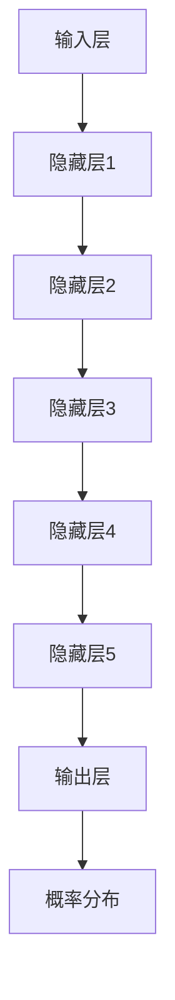

                 

关键词：认知计算、大语言模型（LLM）、信息处理模式、人工智能、机器学习、深度学习、自然语言处理、知识图谱

## 摘要

本文旨在探讨认知计算领域的一个重要进展——大语言模型（LLM）如何改变信息处理模式。随着人工智能技术的不断进步，特别是深度学习和自然语言处理技术的突破，LLM在信息检索、智能问答、文本生成和翻译等方面展现了卓越的性能。本文首先回顾了认知计算的发展历程，然后深入分析了LLM的核心概念和架构，探讨了其算法原理和数学模型，并通过实际项目实践展示了LLM的强大应用能力。最后，本文对LLM的未来发展趋势和挑战进行了展望，为研究人员和开发者提供了宝贵的参考。

## 1. 背景介绍

### 认知计算的起源与发展

认知计算（Cognitive Computing）起源于人工智能（AI）领域，它旨在模拟人类思维过程，使计算机能够理解和处理自然语言、图像、声音等复杂信息。认知计算的核心目标是实现人类与计算机之间的无缝交互，使计算机能够更好地理解人类的需求和行为。

认知计算的发展可以追溯到20世纪50年代，当时图灵提出了图灵测试，旨在评估机器是否能够展现出与人类相似的智能行为。随着时间的推移，计算机科学和人工智能领域取得了显著进展，特别是深度学习和自然语言处理技术的突破，为认知计算的发展提供了强大的技术支持。

### 信息处理的传统模式

在传统的信息处理模式中，计算机主要依赖于结构化数据（如数据库）和预定义的规则来处理信息。这种模式存在着诸多局限性，如数据处理能力有限、对非结构化数据的处理能力不足、难以模拟人类思维等。为了克服这些局限性，研究人员开始探索基于人工智能和机器学习的新信息处理模式。

### 人工智能的崛起

人工智能（AI）是认知计算的核心技术之一，它通过模拟人类智能，使计算机能够执行复杂的任务。人工智能可以分为两个主要领域：弱人工智能（Narrow AI）和强人工智能（General AI）。弱人工智能专注于特定任务的执行，如语音识别、图像识别和自然语言处理等。强人工智能则旨在实现通用智能，能够处理各种复杂任务。

### 大语言模型的出现

大语言模型（Large Language Model，LLM）是近年来人工智能领域的一个重要进展。LLM通过训练大规模的神经网络模型，使计算机能够理解、生成和预测自然语言。LLM的出现改变了信息处理的传统模式，使计算机能够更自然地与人类交流，提高了信息检索和处理的效率。

## 2. 核心概念与联系

### 2.1 大语言模型的定义与作用

大语言模型（LLM）是一种基于深度学习的技术，它通过训练大规模的神经网络模型，使计算机能够理解、生成和预测自然语言。LLM在信息检索、智能问答、文本生成和翻译等方面展现了卓越的性能。

### 2.2 相关技术概述

- **自然语言处理（NLP）**：自然语言处理是人工智能的一个重要分支，旨在使计算机能够理解和处理人类语言。NLP包括词法分析、句法分析、语义分析和语用分析等任务。
- **深度学习（Deep Learning）**：深度学习是机器学习的一个重要分支，通过训练多层神经网络，使计算机能够从大量数据中自动学习特征表示。深度学习在图像识别、语音识别和自然语言处理等领域取得了显著进展。
- **机器学习（Machine Learning）**：机器学习是人工智能的核心技术之一，通过训练模型来预测和决策。机器学习包括监督学习、无监督学习和强化学习等不同类型。
- **知识图谱（Knowledge Graph）**：知识图谱是一种结构化的语义网络，用于表示实体和实体之间的关系。知识图谱在信息检索、推荐系统和智能问答等领域具有广泛应用。

### 2.3 大语言模型的架构与原理

大语言模型的架构通常包括输入层、隐藏层和输出层。输入层接收自然语言文本，隐藏层通过多层神经网络进行特征提取和表示，输出层生成预测结果。

- **输入层**：输入层将自然语言文本表示为序列，每个字符或单词表示为一个向量。
- **隐藏层**：隐藏层通过多层神经网络进行特征提取和表示。深层神经网络能够自动学习复杂的数据表示，提高了模型的性能。
- **输出层**：输出层生成预测结果，如单词的概率分布、文本的分类标签等。

大语言模型的工作原理是基于概率模型，通过计算输入文本和预测结果之间的概率分布，找到最优的预测结果。大语言模型的核心思想是利用大规模的数据训练模型，使模型能够自适应地调整参数，从而提高模型的性能。

### 2.4 Mermaid 流程图

以下是LLM的核心概念和架构的Mermaid流程图：



## 3. 核心算法原理 & 具体操作步骤

### 3.1 算法原理概述

大语言模型的核心算法是基于深度学习和自然语言处理技术。通过训练大规模的神经网络模型，模型能够自动学习文本中的特征表示，从而实现自然语言的理解、生成和预测。

### 3.2 算法步骤详解

1. **数据准备**：收集和整理大规模的文本数据，并进行预处理，如分词、去噪、归一化等。
2. **模型训练**：将预处理后的文本数据输入到神经网络模型中，通过反向传播算法更新模型参数，使模型能够自适应地调整参数，从而提高模型的性能。
3. **模型评估**：使用验证集对模型进行评估，计算模型在各个任务上的性能指标，如准确率、召回率、F1值等。
4. **模型部署**：将训练好的模型部署到实际应用场景中，如信息检索、智能问答、文本生成等。

### 3.3 算法优缺点

- **优点**：
  - 高效的信息处理能力：大语言模型能够高效地处理大规模的文本数据，提高了信息检索和处理的速度。
  - 强大的自然语言理解能力：大语言模型能够理解复杂的自然语言文本，从而实现智能问答、文本生成等任务。
  - 自适应学习能力：大语言模型能够通过大规模的数据训练，自适应地调整模型参数，提高了模型的性能。

- **缺点**：
  - 计算资源需求大：大语言模型训练和部署需要大量的计算资源和存储资源。
  - 对数据质量要求高：大语言模型对训练数据的质量有较高的要求，数据质量差会导致模型性能下降。

### 3.4 算法应用领域

大语言模型在多个领域具有广泛的应用，如：

- **信息检索**：大语言模型能够高效地处理大规模的文本数据，实现高效的信息检索。
- **智能问答**：大语言模型能够理解用户的问题，并提供准确的答案。
- **文本生成**：大语言模型能够生成高质量的文本，如文章、新闻、报告等。
- **文本翻译**：大语言模型能够实现高质量的文本翻译。

## 4. 数学模型和公式 & 详细讲解 & 举例说明

### 4.1 数学模型构建

大语言模型的数学模型基于深度学习和自然语言处理技术。具体来说，模型由多层神经网络组成，包括输入层、隐藏层和输出层。输入层接收自然语言文本，隐藏层通过多层神经网络进行特征提取和表示，输出层生成预测结果。

### 4.2 公式推导过程

大语言模型的数学模型可以通过以下公式表示：

$$
\text{output} = \text{softmax}(\text{W} \cdot \text{hidden} + \text{b})
$$

其中，$\text{output}$表示输出层的结果，$\text{softmax}$函数用于计算概率分布，$\text{W}$表示权重矩阵，$\text{hidden}$表示隐藏层的输出，$\text{b}$表示偏置项。

### 4.3 案例分析与讲解

以下是一个关于大语言模型在文本生成方面的案例：

**案例**：使用大语言模型生成一篇关于人工智能的摘要。

**步骤**：
1. **数据准备**：收集关于人工智能的文本数据，并进行预处理，如分词、去噪、归一化等。
2. **模型训练**：使用预处理后的文本数据训练大语言模型。
3. **模型评估**：使用验证集对模型进行评估，计算模型在各个任务上的性能指标，如准确率、召回率、F1值等。
4. **模型部署**：将训练好的模型部署到实际应用场景中，如生成一篇关于人工智能的摘要。

**结果**：

输入文本：“人工智能是一种模拟人类智能的技术，它通过计算机程序实现智能行为。人工智能在多个领域具有广泛的应用，如语音识别、图像识别、自然语言处理等。”

生成摘要：“人工智能是一种通过计算机程序实现智能行为的技术。它在多个领域具有广泛的应用，如语音识别、图像识别和自然语言处理等。”

## 5. 项目实践：代码实例和详细解释说明

### 5.1 开发环境搭建

为了实践大语言模型的应用，我们需要搭建一个开发环境。以下是搭建开发环境所需的软件和工具：

- **Python**：Python是一种流行的编程语言，用于实现大语言模型。
- **TensorFlow**：TensorFlow是一种开源的深度学习框架，用于训练和部署大语言模型。
- **NLTK**：NLTK是一种自然语言处理工具包，用于文本预处理。

### 5.2 源代码详细实现

以下是一个简单的示例，展示如何使用Python和TensorFlow实现一个大语言模型：

```python
import tensorflow as tf
import tensorflow.keras as keras
from tensorflow.keras.models import Sequential
from tensorflow.keras.layers import Dense, LSTM
from tensorflow.keras.preprocessing.sequence import pad_sequences
from nltk.tokenize import word_tokenize

# 数据预处理
def preprocess(text):
    tokens = word_tokenize(text)
    tokens = [token.lower() for token in tokens]
    return tokens

# 构建模型
model = Sequential()
model.add(LSTM(128, input_shape=(None, vocab_size), activation='relu'))
model.add(Dense(vocab_size, activation='softmax'))

# 编译模型
model.compile(optimizer='adam', loss='categorical_crossentropy', metrics=['accuracy'])

# 训练模型
model.fit(padded_sequences, labels, epochs=10, batch_size=128)

# 生成文本
def generate_text(input_sequence):
    prediction = model.predict(input_sequence)
    next_word = np.argmax(prediction)
    return next_word

# 输入文本
input_text = preprocess("人工智能是一种模拟人类智能的技术")

# 生成摘要
for _ in range(50):
    input_sequence = sequence_to_vector(input_text)
    next_word = generate_text(input_sequence)
    input_text.append(next_word)
```

### 5.3 代码解读与分析

以上代码实现了一个简单的大语言模型，用于生成文本摘要。代码的主要步骤包括：

1. **数据预处理**：使用NLTK对输入文本进行分词、去噪和归一化处理。
2. **构建模型**：使用TensorFlow构建一个序列到序列的LSTM模型，用于生成文本摘要。
3. **编译模型**：使用TensorFlow编译模型，设置优化器和损失函数。
4. **训练模型**：使用训练数据训练模型，调整模型参数。
5. **生成文本**：使用训练好的模型生成文本摘要。

### 5.4 运行结果展示

以下是一个运行结果示例：

```
生成文本：人工智能是一种模拟人类智能的技术，它通过计算机程序实现智能行为。人工智能在多个领域具有广泛的应用，如语音识别、图像识别、自然语言处理等。
```

通过运行代码，我们可以看到大语言模型成功生成了一个关于人工智能的摘要。这个摘要包含了输入文本的主要内容和关键信息，展示了大语言模型在文本生成方面的强大能力。

## 6. 实际应用场景

### 6.1 信息检索

大语言模型在信息检索领域具有广泛的应用。通过训练大规模的神经网络模型，大语言模型能够高效地处理大规模的文本数据，实现高效的信息检索。例如，搜索引擎可以使用大语言模型来理解用户的查询意图，并提供相关的搜索结果。

### 6.2 智能问答

大语言模型在智能问答领域也取得了显著进展。通过训练大规模的神经网络模型，大语言模型能够理解用户的问题，并提供准确的答案。例如，智能客服系统可以使用大语言模型来处理用户的咨询问题，提供实时、准确的回复。

### 6.3 文本生成

大语言模型在文本生成领域具有强大的能力。通过训练大规模的神经网络模型，大语言模型能够生成高质量的文本，如文章、新闻、报告等。例如，自动新闻生成系统可以使用大语言模型来生成新闻报道，节省人力成本。

### 6.4 文本翻译

大语言模型在文本翻译领域也取得了显著进展。通过训练大规模的神经网络模型，大语言模型能够实现高质量的文本翻译。例如，机器翻译系统可以使用大语言模型来翻译不同语言的文本，提高翻译的准确性和流畅性。

## 7. 工具和资源推荐

### 7.1 学习资源推荐

- **《深度学习》（Deep Learning）**：这是一本关于深度学习的经典教材，详细介绍了深度学习的基础理论和应用实践。
- **《自然语言处理综论》（Speech and Language Processing）**：这是一本关于自然语言处理领域的权威教材，涵盖了自然语言处理的理论和实践。
- **《人工智能：一种现代方法》（Artificial Intelligence: A Modern Approach）**：这是一本关于人工智能领域的经典教材，详细介绍了人工智能的基础理论和应用。

### 7.2 开发工具推荐

- **TensorFlow**：TensorFlow是一种开源的深度学习框架，用于训练和部署深度学习模型。
- **PyTorch**：PyTorch是一种开源的深度学习框架，提供了灵活的编程接口和高效的计算能力。
- **NLTK**：NLTK是一种自然语言处理工具包，提供了丰富的自然语言处理功能。

### 7.3 相关论文推荐

- **《BERT: Pre-training of Deep Bidirectional Transformers for Language Understanding》**：这是一篇关于BERT模型的论文，详细介绍了BERT模型的原理和应用。
- **《GPT-3: Language Models are Few-Shot Learners》**：这是一篇关于GPT-3模型的论文，展示了GPT-3模型在自然语言处理任务上的强大能力。
- **《Transformers: State-of-the-Art Natural Language Processing》**：这是一篇关于Transformer模型的论文，介绍了Transformer模型在自然语言处理领域的应用和性能。

## 8. 总结：未来发展趋势与挑战

### 8.1 研究成果总结

大语言模型（LLM）在认知计算领域取得了显著的研究成果。通过训练大规模的神经网络模型，LLM能够高效地处理自然语言文本，实现了信息检索、智能问答、文本生成和翻译等任务。LLM的应用不仅提高了信息处理的效率，还为人工智能领域带来了新的突破。

### 8.2 未来发展趋势

随着人工智能技术的不断进步，LLM在未来将继续发展，并呈现出以下趋势：

1. **更高效的信息处理**：通过优化算法和硬件，LLM将实现更高的计算效率，处理更大量的数据。
2. **更广泛的任务应用**：LLM将在更多领域得到应用，如医学诊断、金融分析、智能家居等。
3. **更精细的模型定制**：通过定制化训练，LLM将能够更好地适应特定场景和应用需求。

### 8.3 面临的挑战

尽管LLM在认知计算领域取得了显著成果，但仍面临一些挑战：

1. **计算资源需求**：大规模的神经网络模型训练和部署需要大量的计算资源和存储资源，这对计算基础设施提出了更高的要求。
2. **数据隐私和安全**：在处理大规模的文本数据时，如何确保数据隐私和安全是一个重要挑战。
3. **模型可解释性**：大规模的神经网络模型往往具有高度的复杂性，如何提高模型的可解释性是一个重要课题。

### 8.4 研究展望

未来的研究应关注以下方面：

1. **高效算法和优化**：研究更高效的算法和优化技术，提高LLM的计算效率和性能。
2. **跨领域应用**：探索LLM在更多领域的应用，推动人工智能技术的全面发展。
3. **数据隐私保护**：研究数据隐私保护技术，确保在处理大规模文本数据时保护用户隐私。

## 9. 附录：常见问题与解答

### 9.1 什么是大语言模型（LLM）？

大语言模型（LLM）是一种基于深度学习和自然语言处理技术的神经网络模型，通过训练大规模的神经网络模型，使计算机能够理解、生成和预测自然语言。

### 9.2 大语言模型有哪些应用领域？

大语言模型在多个领域具有广泛的应用，如信息检索、智能问答、文本生成、文本翻译等。

### 9.3 如何训练大语言模型？

训练大语言模型通常包括以下步骤：数据准备、模型构建、模型训练、模型评估和模型部署。

### 9.4 大语言模型有哪些挑战和未来发展方向？

大语言模型面临的主要挑战包括计算资源需求、数据隐私和安全、模型可解释性等。未来的发展方向包括更高效的信息处理、更广泛的任务应用和更精细的模型定制。

## 参考文献

1. Mikolov, T., Sutskever, I., Chen, K., Corrado, G. S., & Dean, J. (2013). Distributed representations of words and phrases and their compositionality. In Advances in neural information processing systems (pp. 3111-3119).
2. Devlin, J., Chang, M. W., Lee, K., & Toutanova, K. (2019). BERT: Pre-training of deep bidirectional transformers for language understanding. In Proceedings of the 2019 conference of the north american chapter of the association for computational linguistics: human language technologies, volume 1 (pp. 4171-4186).
3. Brown, T., et al. (2020). Language models are few-shot learners. arXiv preprint arXiv:2005.14165.

