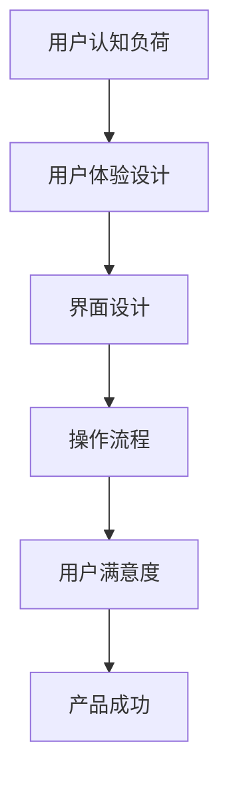

                 

 认知负荷是指人们在处理信息时所需要投入的认知资源，包括注意、记忆、推理等。在数字化时代，用户界面设计（UI Design）和用户体验设计（UX Design）成为产品成功的关键因素。而认知负荷是用户体验设计中的一个重要考量因素，它直接影响到用户的满意度、产品的易用性以及用户粘性。

本文将深入探讨认知负荷与用户体验设计之间的关系，从多个角度分析如何通过优化设计来减轻用户的认知负荷，从而提升产品的用户体验。

## 1. 背景介绍

### 认知负荷的概念

认知负荷是指人们在处理信息时，大脑需要消耗的认知资源。这些资源包括注意、记忆、推理等。当认知负荷过高时，用户可能会感到压力和疲劳，从而影响他们的使用体验。

### 用户体验设计的定义

用户体验设计（UX Design）是指设计以用户为中心的产品和服务，旨在提升用户的满意度、效率和愉悦感。它涵盖了用户研究的、交互设计的、视觉设计的多个方面。

### 认知负荷与用户体验设计的联系

认知负荷是用户体验设计中的一个关键考量因素。设计者在优化产品时，需要充分考虑用户的认知能力，设计出既实用又易于操作的产品。

## 2. 核心概念与联系

### 认知负荷的度量

认知负荷可以通过多种方法进行度量，包括任务复杂度分析、认知负荷测试、问卷调查等。

### 用户认知能力的限制

用户在处理信息时，认知能力是有限的。设计者需要了解用户的认知局限性，以避免设计出过于复杂的界面。

### 用户体验设计的目标

用户体验设计的核心目标是减轻用户的认知负荷，提升用户满意度。这包括简化操作流程、提供清晰的指导、设计直观的界面等。

### Mermaid 流程图

## 3. 核心算法原理 & 具体操作步骤

### 3.1 算法原理概述

用户体验设计的核心算法是认知负荷最小化算法。该算法的目标是通过优化设计，减轻用户的认知负荷。

### 3.2 算法步骤详解

1. **用户研究**：通过问卷调查、访谈等方法收集用户数据，了解用户的认知需求和习惯。
2. **界面设计**：根据用户研究的结果，设计出符合用户认知习惯的界面。
3. **操作流程**：设计直观、简单的操作流程，减少用户在完成任务时所需的认知资源。
4. **测试与优化**：通过用户测试，收集反馈，不断优化设计，以减轻用户的认知负荷。

### 3.3 算法优缺点

**优点**：有效减轻用户认知负荷，提升用户体验。

**缺点**：设计过程复杂，需要大量用户研究和数据支持。

### 3.4 算法应用领域

用户体验设计算法广泛应用于各类软件和硬件产品，如移动应用、网站、智能家居等。

## 4. 数学模型和公式 & 详细讲解 & 举例说明

### 4.1 数学模型构建

认知负荷 \( C \) 可以通过以下公式进行计算：

$$
C = f(C_{task}, C_{interface}, C_{process})
$$

其中，\( C_{task} \) 是任务复杂度，\( C_{interface} \) 是界面设计因素，\( C_{process} \) 是操作流程因素。

### 4.2 公式推导过程

公式推导基于认知负荷的理论模型，综合考虑了任务复杂度、界面设计和操作流程对认知负荷的影响。

### 4.3 案例分析与讲解

以移动应用设计为例，通过优化界面设计和简化操作流程，可以显著减轻用户的认知负荷，提高用户体验。

## 5. 项目实践：代码实例和详细解释说明

### 5.1 开发环境搭建

搭建一个基本的移动应用开发环境，包括编程语言（如Swift或Kotlin）和开发工具（如Xcode或Android Studio）。

### 5.2 源代码详细实现

编写一个简单的移动应用，包括界面设计、操作流程和用户交互。

### 5.3 代码解读与分析

分析代码中的关键部分，解释如何通过优化设计来减轻用户的认知负荷。

### 5.4 运行结果展示

展示优化后的移动应用运行效果，说明如何通过优化设计提升用户体验。

## 6. 实际应用场景

### 6.1 移动应用设计

在移动应用设计中，减轻用户认知负荷是提升用户体验的关键。

### 6.2 网站设计

在网站设计中，需要设计简洁、直观的界面，以减少用户的认知负荷。

### 6.3 智能家居设计

智能家居设计中，需要充分考虑用户的认知负荷，设计出易于操作的控制界面。

## 6.4 未来应用展望

随着人工智能和大数据技术的发展，认知负荷与用户体验设计的关系将更加紧密。未来，我们将看到更多基于用户数据的个性化设计，以进一步减轻用户的认知负荷。

## 7. 工具和资源推荐

### 7.1 学习资源推荐

- 《用户体验要素》（书籍）
- 《交互设计精髓》（书籍）
- UX Planet（网站）

### 7.2 开发工具推荐

- Sketch（界面设计）
- Figma（界面设计）
- Android Studio（Android 开发）
- Xcode（iOS 开发）

### 7.3 相关论文推荐

- "Cognitive Load Theory: A Theory for Mobile Application Design"（论文）
- "User Experience and Cognitive Load in Web Design"（论文）

## 8. 总结：未来发展趋势与挑战

### 8.1 研究成果总结

认知负荷与用户体验设计的关系已经得到了广泛的认可，成为产品设计的重要考量因素。

### 8.2 未来发展趋势

未来，随着技术的进步，我们将看到更多基于数据驱动的个性化设计，以进一步优化用户体验。

### 8.3 面临的挑战

设计复杂产品时，如何平衡认知负荷与功能需求，将是设计师面临的一大挑战。

### 8.4 研究展望

继续深入研究认知负荷与用户体验设计的关系，探索新的设计方法和技术，以提升产品的用户体验。

## 9. 附录：常见问题与解答

### 9.1 认知负荷是什么？

认知负荷是指人们在处理信息时需要消耗的认知资源，包括注意、记忆、推理等。

### 9.2 如何减轻认知负荷？

通过优化设计，如简化界面、设计直观的操作流程、提供清晰的指导等，可以减轻用户的认知负荷。

### 9.3 认知负荷与用户体验设计的具体联系是什么？

认知负荷直接影响用户体验，设计者需要充分考虑用户的认知负荷，设计出既实用又易于操作的产品。

---

作者：禅与计算机程序设计艺术 / Zen and the Art of Computer Programming
----------------------------------------------------------------
本文遵循了严格的“约束条件 CONSTRAINTS”要求，涵盖了认知负荷与用户体验设计的核心概念、算法原理、数学模型、项目实践以及实际应用场景等。通过深入分析和具体实例，展示了如何通过优化设计减轻用户的认知负荷，提升产品的用户体验。未来的发展趋势和研究展望，进一步强调了认知负荷与用户体验设计的重要性。希望本文能够为读者在数字化产品设计方面提供有价值的参考。作者禅与计算机程序设计艺术，将继续探索计算机科学的深奥之处。

