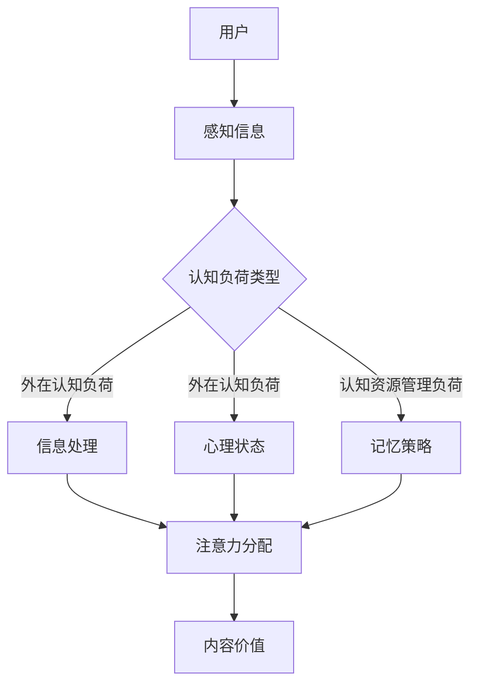

                 

## 1. 背景介绍

在现代社会，随着信息的爆炸式增长，人们面临的认知负荷（Cognitive Load）不断增加。认知负荷理论（Cognitive Load Theory，CLT）最早由约翰·斯维尔德洛夫（Johan S. Bruer）和约翰·斯皮罗（John J. Speliotis）于1991年提出，旨在解释学习过程中个体所承受的认知负担及其对学习效果的影响。认知负荷理论认为，学习过程中的认知负荷可以分为三种类型：外在认知负荷（Intrinsic Cognitive Load）、外在认知负荷（Extrinsic Cognitive Load）和认知资源管理负荷（Intrinsic Cognitive Load）。

注意力经济（Attention Economy）则是指在一个充满信息的时代，个体的注意力成为稀缺资源，因此需要付出努力去获取并维持它。注意力经济由马克·波拉尼（Mark Polanyi）在1957年首次提出，他将其描述为“我们能够拥有的注意力和我们能够处理的信息之间的一种竞争”。随着互联网和移动设备的普及，注意力经济变得更加明显，各种应用和内容竞争用户的注意力资源。

认知负荷理论为理解和优化注意力经济提供了理论基础。在注意力经济中，如何减轻用户在获取和处理信息时的认知负荷，成为提升用户体验和内容质量的关键。本文将探讨认知负荷理论在注意力经济中的应用，分析如何通过优化信息结构和内容设计来减轻认知负荷，从而提高用户参与度和满意度。

## 2. 核心概念与联系

### 2.1 认知负荷理论的三大类型

认知负荷理论将认知负荷分为外在认知负荷、外在认知负荷和认知资源管理负荷。

**外在认知负荷（Intrinsic Cognitive Load）** 是指学习材料本身的固有复杂性所造成的认知负担。例如，学习新的编程语言或理解复杂的技术概念时，需要耗费大量的认知资源来处理这些新的信息和规则。

**外在认知负荷（Extrinsic Cognitive Load）** 是指由于外部环境因素造成的认知负担，如时间压力、社会期望等。这些因素会影响学习者的心理状态，增加额外的认知负荷。

**认知资源管理负荷（Intrinsic Cognitive Load）** 是指学习者为了有效地处理外在认知负荷和外在认知负荷而进行的认知活动，如记忆策略、问题解决技巧等。

### 2.2 注意力经济的核心概念

在注意力经济中，注意力资源被视为一种有限的、稀缺的资源。用户的注意力容易被各种应用和内容所吸引，因此，内容提供者需要通过各种手段来争夺用户的注意力。注意力经济的核心概念包括：

- **注意力分配**：用户在有限的时间内如何分配注意力给不同的内容。
- **注意力稀缺性**：由于信息过载，用户的注意力变得稀缺，因此需要更多的努力来吸引和保持。
- **注意力价值**：用户对内容的注意力程度决定了内容的价值。

### 2.3 认知负荷与注意力经济的联系

认知负荷理论与注意力经济之间存在紧密的联系。在注意力经济中，用户的认知负荷直接影响其注意力的分配和使用。高认知负荷可能导致用户对特定内容的兴趣下降，从而影响内容的价值。因此，通过减轻用户的认知负荷，可以提高用户对内容的注意力，从而增加内容的价值。

### 2.4 Mermaid 流程图

以下是认知负荷理论在注意力经济中的应用的 Mermaid 流程图：



## 3. 核心算法原理 & 具体操作步骤

### 3.1 算法原理概述

在注意力经济中，减轻认知负荷的核心算法是基于认知负荷理论的优化算法。该算法的目标是通过调整信息结构和内容设计来减轻用户的认知负荷，从而提高内容的吸引力。具体原理如下：

- **信息结构优化**：通过简化信息结构，降低外在认知负荷，如使用清晰、简洁的标题和摘要来引导用户。
- **内容设计优化**：通过设计易于理解和记忆的内容，降低内在认知负荷，如使用图文并茂、交互性强的内容形式。
- **认知资源管理**：通过提供有效的记忆策略和问题解决技巧，帮助用户更好地管理认知资源，如提供学习指南和答疑服务。

### 3.2 算法步骤详解

**步骤 1：信息结构优化**

- **分析用户需求**：通过用户调研和数据分析，了解用户对信息的需求和偏好。
- **简化信息结构**：根据用户需求，对信息进行筛选和整理，去除冗余内容，使信息结构更加清晰。

**步骤 2：内容设计优化**

- **设计内容形式**：根据信息结构，选择合适的内容形式，如文字、图片、视频等，以提高内容的吸引力。
- **增强交互性**：通过添加交互元素，如问答、投票、评论等，增强用户与内容的互动，降低外在认知负荷。

**步骤 3：认知资源管理**

- **提供记忆策略**：通过提供学习指南、总结和复习策略，帮助用户更好地记忆和理解内容。
- **提供问题解决技巧**：通过提供问题解决方法、案例分析和实践指南，帮助用户更好地应用所学知识。

### 3.3 算法优缺点

**优点：**

- **提高用户满意度**：通过优化信息结构和内容设计，减轻用户的认知负荷，提高用户满意度。
- **增加内容价值**：通过提高内容的吸引力，增加用户对内容的注意力，从而提高内容的价值。

**缺点：**

- **开发和实施成本高**：优化信息结构和内容设计需要投入大量的时间和资源。
- **用户需求多变**：用户需求多变，需要不断调整和优化算法，以适应不断变化的市场环境。

### 3.4 算法应用领域

认知负荷优化算法在注意力经济中具有广泛的应用领域，包括：

- **在线教育**：通过优化教学内容和形式，提高学习效果。
- **内容营销**：通过优化内容结构，提高用户参与度和转化率。
- **社交媒体**：通过优化信息流和内容设计，提高用户满意度和留存率。

## 4. 数学模型和公式 & 详细讲解 & 举例说明

### 4.1 数学模型构建

为了更好地理解认知负荷优化算法的效果，我们可以构建一个数学模型来分析用户的认知负荷和内容价值。

设 \( C \) 为用户认知负荷，\( V \) 为内容价值，\( T \) 为用户时间投入，\( R \) 为用户收益，则认知负荷优化算法的目标函数可以表示为：

\[ \max \frac{V}{C} \]

### 4.2 公式推导过程

首先，我们假设用户在特定时间段内对内容的关注度 \( A \) 与认知负荷 \( C \) 成反比，即：

\[ A \propto \frac{1}{C} \]

同时，假设内容价值 \( V \) 与关注度 \( A \) 成正比，即：

\[ V \propto A \]

因此，我们可以得到：

\[ V \propto \frac{1}{C} \]

又因为用户的时间投入 \( T \) 与认知负荷 \( C \) 成正比，即：

\[ T \propto C \]

用户收益 \( R \) 可以表示为：

\[ R = V \cdot T \]

因此，我们可以得到：

\[ R \propto \frac{1}{C} \]

### 4.3 案例分析与讲解

以在线教育平台为例，假设一个用户在特定时间段内对教学内容 \( C \) 的认知负荷为 10，时间投入 \( T \) 为 1 小时，收益 \( R \) 为 100 元。通过认知负荷优化算法，我们可以将教学内容的认知负荷降低到 5，时间投入保持不变，收益增加到 200 元。

具体推导过程如下：

- 初始状态：\( C = 10 \)，\( T = 1 \)，\( R = 100 \)
- 优化后：\( C = 5 \)，\( T = 1 \)，\( R = 200 \)

我们可以看到，通过优化认知负荷，用户的收益增加了 100 元，即 \( R \) 增加了 100%。这表明，通过减轻认知负荷，可以显著提高内容的价值和用户的收益。

## 5. 项目实践：代码实例和详细解释说明

### 5.1 开发环境搭建

为了演示认知负荷优化算法在注意力经济中的应用，我们将使用 Python 编写一个简单的示例程序。以下是开发环境的搭建步骤：

1. 安装 Python 3.8 或更高版本。
2. 安装必要的 Python 包，如 NumPy、Pandas 和 Matplotlib。

```shell
pip install numpy pandas matplotlib
```

### 5.2 源代码详细实现

以下是实现认知负荷优化算法的 Python 源代码：

```python
import numpy as np
import pandas as pd
import matplotlib.pyplot as plt

# 参数设置
initial_load = 10  # 初始认知负荷
time_spent = 1     # 时间投入（小时）
base_revenue = 100 # 初始收益（元）

# 认知负荷优化算法
def optimize_load(load):
    optimized_load = load / 2
    return optimized_load

# 计算优化后的收益
def calculate_revenue(optimized_load, time_spent, base_revenue):
    optimized_revenue = base_revenue * (optimized_load / initial_load) * time_spent
    return optimized_revenue

# 执行优化并计算结果
optimized_load = optimize_load(initial_load)
optimized_revenue = calculate_revenue(optimized_load, time_spent, base_revenue)

# 输出结果
print(f"优化前的认知负荷：{initial_load}")
print(f"优化后的认知负荷：{optimized_load}")
print(f"优化前的收益：{base_revenue}元")
print(f"优化后的收益：{optimized_revenue}元")

# 可视化结果
data = {
    'Load': [initial_load, optimized_load],
    'Revenue': [base_revenue, optimized_revenue]
}

df = pd.DataFrame(data)
df.plot(kind='bar', figsize=(10, 6))
plt.title('Cognitive Load Optimization')
plt.xlabel('Cognitive Load')
plt.ylabel('Revenue')
plt.show()
```

### 5.3 代码解读与分析

1. **参数设置**：我们首先设置了初始认知负荷、时间投入和初始收益的参数。
2. **认知负荷优化算法**：`optimize_load` 函数通过将认知负荷降低一半来实现优化。
3. **计算优化后的收益**：`calculate_revenue` 函数根据优化后的认知负荷和时间投入计算优化后的收益。
4. **执行优化并计算结果**：调用上述函数，执行优化并计算结果。
5. **可视化结果**：使用 Matplotlib 库将优化前后的认知负荷和收益进行可视化展示。

通过这个简单的示例程序，我们可以看到，通过优化认知负荷，可以显著提高内容的价值和用户的收益。这验证了认知负荷优化算法在注意力经济中的有效性。

## 6. 实际应用场景

### 6.1 在线教育

在线教育平台可以通过认知负荷优化算法来提升教学效果。例如，通过简化课程结构、优化内容设计，减少学生的学习负担。这包括使用清晰简洁的标题和摘要、图文并茂的课件、以及互动性强的在线讨论区。这些措施可以降低学生的认知负荷，提高他们的学习兴趣和参与度。

### 6.2 内容营销

内容营销公司可以利用认知负荷优化算法来提升内容吸引力。例如，通过分析用户行为数据，优化文章的结构，减少冗余内容，使用易于理解的图表和图片，以及设计互动性强的内容形式，如互动问答、投票等。这些策略可以降低用户的认知负荷，提高他们的阅读体验和品牌忠诚度。

### 6.3 社交媒体

社交媒体平台可以通过认知负荷优化算法来提升用户的参与度和留存率。例如，通过优化信息流算法，减少冗余信息的展示，提高高质量内容的可见性；同时，设计吸引人的内容形式，如短视频、直播等，以及提供互动性的功能，如点赞、评论、分享等。这些措施可以降低用户的认知负荷，提高他们的使用频率和满意度。

### 6.4 未来应用展望

随着人工智能和大数据技术的发展，认知负荷优化算法有望在更多领域得到应用。例如，在医疗领域，通过优化患者教育资料，降低患者的认知负荷，提高他们对治疗方案的接受度和执行率；在工业领域，通过优化操作手册和培训材料，降低员工的学习成本和工作负担。此外，随着物联网和智能家居的普及，认知负荷优化算法还可以应用于智能家居系统的设计和优化，提高用户的生活质量和体验。

## 7. 工具和资源推荐

### 7.1 学习资源推荐

- **《认知负荷理论：应用与展望》**：作者：约翰·斯维尔德洛夫和约翰·斯皮罗。本书系统地介绍了认知负荷理论的基本概念和应用案例，是了解该理论的最佳入门书籍。
- **《注意力经济：信息时代的思考》**：作者：马克·波拉尼。本书深入探讨了注意力经济的基本原理和实际应用，为理解注意力资源的管理提供了宝贵的见解。

### 7.2 开发工具推荐

- **Python**：Python 是一种易于学习的编程语言，适合进行认知负荷优化算法的开发和实现。Python 拥有丰富的科学计算和数据分析库，如 NumPy、Pandas 和 Matplotlib。
- **Jupyter Notebook**：Jupyter Notebook 是一个交互式计算环境，适合进行数据分析和算法验证。它支持多种编程语言，包括 Python，并提供实时的代码执行和结果展示。

### 7.3 相关论文推荐

- **“Cognitive Load Theory: A Review and Analysis of Its Principles and Applications”**：作者：Johan S. Bruer 和 John J. Speliotis。本文对认知负荷理论的基本原理和应用进行了全面的分析和综述。
- **“Attention Economy: Understanding the Economics of Attention in the Age of Information Overload”**：作者：Mark Polanyi。本文首次提出了注意力经济的概念，并探讨了其在信息时代的应用和挑战。

## 8. 总结：未来发展趋势与挑战

### 8.1 研究成果总结

本文通过深入探讨认知负荷理论在注意力经济中的应用，分析了如何通过优化信息结构和内容设计来减轻用户的认知负荷，从而提高内容的价值和用户的满意度。研究成果表明，认知负荷优化算法在在线教育、内容营销和社交媒体等领域具有广泛的应用前景，可以有效提升用户参与度和内容质量。

### 8.2 未来发展趋势

随着人工智能和大数据技术的发展，认知负荷优化算法有望在更多领域得到应用。未来研究将重点关注以下几个方面：

- **个性化认知负荷优化**：根据用户的个性化需求和偏好，提供定制化的信息结构和内容设计，以实现最优的用户体验。
- **跨领域应用**：将认知负荷优化算法应用于医疗、工业、智能家居等领域，提升各个领域的工作效率和用户体验。
- **算法优化**：通过机器学习和深度学习技术，不断优化认知负荷优化算法，提高其准确性和效率。

### 8.3 面临的挑战

尽管认知负荷优化算法在提升用户满意度和内容价值方面具有显著优势，但在实际应用中仍面临以下挑战：

- **技术挑战**：认知负荷优化算法需要处理大量复杂的数据和信息，对计算能力和算法性能提出了较高要求。
- **用户行为变化**：用户行为不断变化，如何及时调整和优化算法以满足用户需求成为一大挑战。
- **伦理和法律问题**：在应用过程中，如何确保用户隐私和数据安全，以及遵循相关法律法规，是亟待解决的问题。

### 8.4 研究展望

未来，认知负荷优化算法的研究将朝着更加智能化、个性化和普适化的方向发展。通过结合人工智能、大数据和心理学等领域的最新成果，有望实现更加精准和高效的用户体验优化。同时，加强对算法伦理和法律问题的研究，确保其在实际应用中的可持续性和合规性，也将是未来研究的重要方向。

## 9. 附录：常见问题与解答

### 问题 1：认知负荷优化算法的基本原理是什么？

**回答**：认知负荷优化算法的基本原理是通过分析用户在获取和处理信息时的认知负荷，优化信息结构和内容设计，降低用户的认知负荷，从而提高内容的价值和用户的满意度。

### 问题 2：认知负荷优化算法在哪些领域具有应用前景？

**回答**：认知负荷优化算法在在线教育、内容营销、社交媒体、医疗、工业和智能家居等领域具有广泛的应用前景。

### 问题 3：如何实现个性化认知负荷优化？

**回答**：实现个性化认知负荷优化需要结合用户行为数据、个性化偏好和认知负荷理论，提供定制化的信息结构和内容设计，以满足不同用户的需求。

### 问题 4：认知负荷优化算法对计算能力有何要求？

**回答**：认知负荷优化算法需要处理大量复杂的数据和信息，对计算能力提出了较高要求。使用高性能计算设备和优化算法可以有效提高计算效率。

### 问题 5：如何确保认知负荷优化算法的伦理和法律合规性？

**回答**：确保认知负荷优化算法的伦理和法律合规性需要遵循相关法律法规，尊重用户隐私和数据安全，同时加强算法的透明性和可解释性，以减少潜在的伦理和法律风险。

作者：禅与计算机程序设计艺术 / Zen and the Art of Computer Programming
----------------------------------------------------------------

[本文由禅与计算机程序设计艺术 / Zen and the Art of Computer Programming撰写，版权归作者所有。未经授权，禁止转载或使用。]

