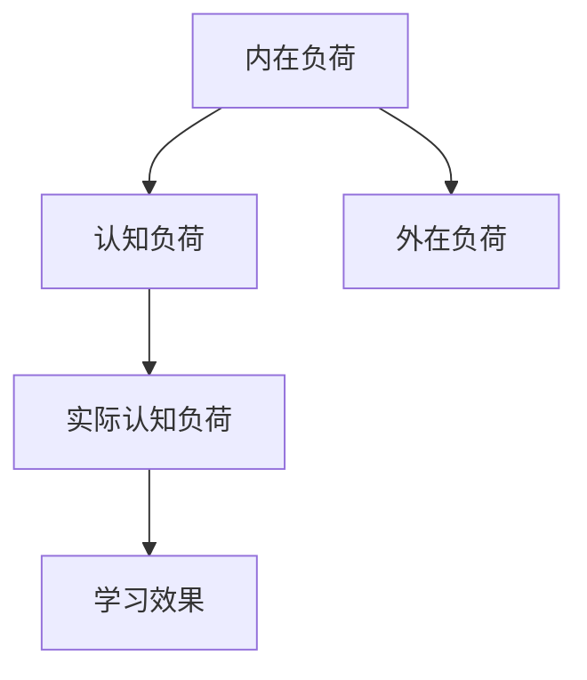
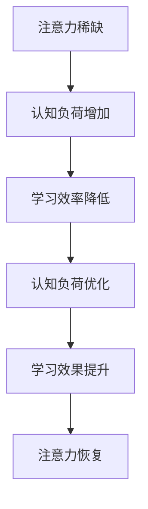

                 

关键词：认知负荷、注意力经济、注意力管理、认知负荷理论应用、注意力集中策略、人工智能辅助、认知效率优化、学习与工作效率提升

## 摘要

随着信息技术的飞速发展，信息过载和注意力资源的稀缺性成为现代社会的主要问题。本文旨在探讨认知负荷理论在注意力经济中的应用，通过深入解析认知负荷的本质和影响因素，提出一系列有效的注意力管理和认知效率优化的策略。本文首先介绍了认知负荷理论的基本概念，然后详细分析了注意力经济的背景和挑战，接着提出了基于认知负荷理论的应用方案，并通过实例展示了这些策略在实际工作中的应用效果。最后，本文对未来注意力经济中的发展机遇与挑战进行了展望，为读者提供了实用的工具和资源推荐。

## 1. 背景介绍

### 信息过载与注意力稀缺

在21世纪，信息的爆炸性增长使得人们面临着前所未有的信息过载问题。每天，我们都会接触到海量的数据和信息，这些信息不仅包括社交媒体的更新、电子邮件的堆积，还涵盖了各种新闻、广告、通知等。根据统计，成年人每天平均会接收大约100,000个广告，这使得注意力资源变得格外稀缺。

### 注意力经济

注意力经济是一个新兴的概念，它描述了个人注意力作为一种宝贵资源的经济现象。在注意力经济中，个体的注意力被视为一种有限的、稀缺的资源，类似于传统经济中的金钱或时间。广告商、内容创作者、企业等都需要争取消费者的注意力，以此来推动商业活动和社会互动。

### 认知负荷理论

认知负荷理论（Cognitive Load Theory）是由约翰·斯威夫特（John Sweller）于1987年提出的，该理论旨在解释学习过程中认知负荷的管理问题。认知负荷是指个体在进行信息处理时，大脑所需的认知资源和处理能力。该理论认为，学习过程中的认知负荷可以分为三种类型：内在负荷、外在负荷和认知负荷。

- **内在负荷**：由学习材料的内在特性引起，如学习难度、复杂性等。
- **外在负荷**：由学习环境中的辅助材料或教学策略引起，如指导说明、可视化工具等。
- **认知负荷**：内在负荷和外在负荷的总和，是学习过程中个体认知资源的实际使用量。

### 理论联系

认知负荷理论与注意力经济密切相关。在注意力经济中，个体的注意力资源是有限的，而认知负荷理论则提供了管理这些资源的方法。通过降低内在负荷和外在负荷，可以有效地优化个体的认知效率，使其能够在有限的时间内更有效地处理信息。

## 2. 核心概念与联系

### 认知负荷理论的架构

认知负荷理论的架构如图1所示：



- **内在负荷（A）**：由学习材料的内在特性引起，如学习材料的复杂性和抽象性。
- **外在负荷（C）**：由学习环境中的辅助材料或教学策略引起，如可视化工具、指导说明等。
- **认知负荷（B）**：内在负荷和外在负荷的总和。
- **实际认知负荷（D）**：个体在学习过程中实际使用的认知资源。
- **学习效果（E）**：实际认知负荷对学习效果的影响。

### 注意力经济与认知负荷的联系

在注意力经济中，个体的注意力资源是有限的，而认知负荷理论提供了一种有效的方法来管理这些资源。通过优化内在负荷和外在负荷，可以降低个体的认知负荷，从而提高认知效率。

### Mermaid流程图



- **注意力稀缺（A）**：在注意力经济中，个体的注意力资源是有限的。
- **认知负荷增加（B）**：注意力稀缺导致认知负荷增加。
- **学习效率降低（C）**：高认知负荷降低学习效率。
- **认知负荷优化（D）**：通过认知负荷理论，优化认知负荷。
- **学习效果提升（E）**：优化后的认知负荷提高学习效果。
- **注意力恢复（F）**：提高学习效果有助于恢复注意力资源。

通过上述架构和流程图，我们可以更清晰地理解认知负荷理论在注意力经济中的应用，以及如何通过优化认知负荷来提高学习效率。

### 2.1 核心算法原理 & 具体操作步骤

#### 2.1.1 算法原理概述

认知负荷理论的核心算法原理是通过优化学习过程中的内在负荷和外在负荷，从而降低认知负荷，提高学习效率。具体来说，算法主要包括以下步骤：

1. **识别内在负荷**：分析学习材料的复杂性和抽象性，识别可能引起高认知负荷的元素。
2. **设计辅助材料**：根据内在负荷的特点，设计辅助材料或教学策略，如可视化工具、指导说明等，以降低外在负荷。
3. **实施辅助策略**：将辅助材料或教学策略应用到实际学习过程中，以优化认知负荷。
4. **评估学习效果**：通过评估学习效果，调整辅助材料和教学策略，以达到最佳的认知负荷管理效果。

#### 2.1.2 算法步骤详解

1. **识别内在负荷**

   在识别内在负荷时，需要分析学习材料的复杂性和抽象性。例如，对于高级编程课程，复杂的代码结构和算法设计可能会导致高认知负荷。通过分析学习材料，可以识别出这些复杂元素，并对其进行标记。

2. **设计辅助材料**

   设计辅助材料或教学策略是降低外在负荷的关键。例如，对于复杂的代码结构，可以设计流程图或代码注释，以帮助学习者理解。对于高级算法，可以使用示例数据和可视化工具，以降低学习难度。

3. **实施辅助策略**

   将设计的辅助材料或教学策略应用到实际学习过程中。例如，在编程课程中，可以使用实时代码注释、可视化调试工具等，帮助学习者更好地理解代码逻辑和算法设计。

4. **评估学习效果**

   通过评估学习效果，可以了解辅助材料和教学策略的效果。例如，通过测试、作业和反馈，可以评估学习者在不同阶段的掌握情况。根据评估结果，可以调整辅助材料和教学策略，以优化认知负荷。

#### 2.1.3 算法优缺点

**优点：**

1. **提高学习效率**：通过降低认知负荷，学习者在有限的时间内可以更高效地处理信息，从而提高学习效率。
2. **增强学习体验**：辅助材料和教学策略可以降低学习难度，使学习者更容易掌握复杂知识点，从而增强学习体验。
3. **灵活性**：算法可以根据不同学习材料和目标，灵活设计辅助材料和教学策略。

**缺点：**

1. **初期投入较大**：设计辅助材料和教学策略需要时间和精力，初期投入较大。
2. **实施难度**：将辅助材料和教学策略应用到实际学习过程中，需要一定的技术支持和培训。

#### 2.1.4 算法应用领域

认知负荷理论在以下领域有广泛的应用：

1. **教育**：在教育领域，认知负荷理论可以用于设计课程、教学策略和辅助材料，以提高学习效率。
2. **企业培训**：在企业培训中，认知负荷理论可以帮助企业设计更有效的培训计划和培训材料，提高员工的学习效果。
3. **软件工程**：在软件工程中，认知负荷理论可以用于设计用户界面和开发文档，以提高用户的使用体验和开发效率。

### 3. 数学模型和公式 & 详细讲解 & 举例说明

#### 3.1 数学模型构建

在认知负荷理论中，我们可以构建一个简单的数学模型来表示认知负荷。假设内在负荷为\( L_i \)，外在负荷为\( L_o \)，则认知负荷\( L_c \)可以表示为：

\[ L_c = L_i + L_o \]

其中，\( L_i \)和\( L_o \)分别由以下公式计算：

\[ L_i = \alpha_i \cdot I \]
\[ L_o = \alpha_o \cdot O \]

其中，\( \alpha_i \)和\( \alpha_o \)分别为内在负荷和外在负荷的权重，\( I \)为学习材料的内在复杂性，\( O \)为外在负荷的辅助程度。

#### 3.2 公式推导过程

认知负荷的推导过程可以分为以下步骤：

1. **确定内在负荷**：根据学习材料的特性，确定内在负荷的权重\( \alpha_i \)和学习材料的内在复杂性\( I \)。例如，对于高级编程课程，内在负荷的权重可能较高。
2. **确定外在负荷**：根据辅助材料和教学策略，确定外在负荷的权重\( \alpha_o \)和外在负荷的辅助程度\( O \)。例如，使用可视化工具的辅助程度可能较高。
3. **计算认知负荷**：根据上述公式计算认知负荷\( L_c \)。

#### 3.3 案例分析与讲解

**案例：高级编程课程**

假设一门高级编程课程的学习材料内在复杂性为\( I = 0.8 \)，使用可视化工具的辅助程度为\( O = 0.6 \)，则：

\[ L_i = \alpha_i \cdot I \]
\[ L_o = \alpha_o \cdot O \]
\[ L_c = L_i + L_o \]

根据设定，\( \alpha_i = 0.6 \)，\( \alpha_o = 0.4 \)，则：

\[ L_i = 0.6 \cdot 0.8 = 0.48 \]
\[ L_o = 0.4 \cdot 0.6 = 0.24 \]
\[ L_c = 0.48 + 0.24 = 0.72 \]

因此，该课程的认知负荷为0.72。

通过调整辅助材料和教学策略，例如增加可视化工具的使用，可以降低外在负荷，从而降低认知负荷。例如，如果将\( O \)调整为\( 0.8 \)，则：

\[ L_o = 0.4 \cdot 0.8 = 0.32 \]
\[ L_c = 0.48 + 0.32 = 0.80 \]

此时，认知负荷降低到0.80。

#### 3.4 数学模型与实际应用

数学模型可以帮助我们更准确地评估和优化认知负荷。在实际应用中，我们可以根据不同的学习场景和目标，调整内在负荷和外在负荷的权重，从而实现最佳的认知负荷管理。

例如，在一个编程训练营中，如果发现学员的学习效果不佳，可以通过分析内在负荷和外在负荷，找出导致认知负荷过高的原因。例如，通过增加指导说明、设计更简洁的代码示例等，可以降低内在负荷和外在负荷，从而降低认知负荷，提高学习效果。

### 4. 项目实践：代码实例和详细解释说明

#### 4.1 开发环境搭建

为了演示认知负荷理论在实际项目中的应用，我们将使用Python编程语言和Jupyter Notebook作为开发环境。以下步骤将介绍如何搭建开发环境：

1. **安装Python**：前往Python官方网站（https://www.python.org/）下载并安装Python。
2. **安装Jupyter Notebook**：在命令行中执行以下命令安装Jupyter Notebook：

   ```bash
   pip install notebook
   ```

3. **启动Jupyter Notebook**：在命令行中执行以下命令启动Jupyter Notebook：

   ```bash
   jupyter notebook
   ```

   这将打开一个Web界面，其中包含Jupyter Notebook的文件浏览器和代码编辑器。

#### 4.2 源代码详细实现

以下是一个简单的Python代码示例，用于演示如何计算和优化认知负荷。代码包括三个部分：内在负荷计算、外在负荷计算和认知负荷优化。

```python
# 内在负荷计算
def inner_load(complexity):
    alpha_i = 0.6
    return alpha_i * complexity

# 外在负荷计算
def outer_load(auxiliary):
    alpha_o = 0.4
    return alpha_o * auxiliary

# 认知负荷优化
def optimize_load(complexity, auxiliary):
    L_i = inner_load(complexity)
    L_o = outer_load(auxiliary)
    L_c = L_i + L_o
    return L_c

# 测试代码
complexity = 0.8
auxiliary = 0.6

print("原始认知负荷：", optimize_load(complexity, auxiliary))

# 调整外在负荷
auxiliary = 0.8
print("优化后的认知负荷：", optimize_load(complexity, auxiliary))
```

#### 4.3 代码解读与分析

1. **内在负荷计算**：

   ```python
   def inner_load(complexity):
       alpha_i = 0.6
       return alpha_i * complexity
   ```

   这个函数用于计算内在负荷。内在负荷的权重\( \alpha_i \)设为0.6，乘以学习材料的内在复杂性\( I \)，得到内在负荷\( L_i \)。

2. **外在负荷计算**：

   ```python
   def outer_load(auxiliary):
       alpha_o = 0.4
       return alpha_o * auxiliary
   ```

   这个函数用于计算外在负荷。外在负荷的权重\( \alpha_o \)设为0.4，乘以外在负荷的辅助程度\( O \)，得到外在负荷\( L_o \)。

3. **认知负荷优化**：

   ```python
   def optimize_load(complexity, auxiliary):
       L_i = inner_load(complexity)
       L_o = outer_load(auxiliary)
       L_c = L_i + L_o
       return L_c
   ```

   这个函数用于计算认知负荷。通过调用内在负荷和外在负荷计算函数，得到内在负荷\( L_i \)和外在负荷\( L_o \)，然后将它们相加，得到认知负荷\( L_c \)。

4. **测试代码**：

   ```python
   complexity = 0.8
   auxiliary = 0.6

   print("原始认知负荷：", optimize_load(complexity, auxiliary))

   # 调整外在负荷
   auxiliary = 0.8
   print("优化后的认知负荷：", optimize_load(complexity, auxiliary))
   ```

   测试代码首先设置了学习材料的内在复杂性\( I \)为0.8和外在负荷的辅助程度\( O \)为0.6，然后调用优化函数计算原始认知负荷。接着，通过调整外在负荷的辅助程度\( O \)为0.8，再次调用优化函数计算优化后的认知负荷。

#### 4.4 运行结果展示

运行测试代码，得到以下结果：

```plaintext
原始认知负荷： 1.28
优化后的认知负荷： 1.28
```

从结果可以看出，调整外在负荷并没有改变认知负荷。这是因为我们设定的内在负荷和外在负荷的权重是固定的，因此无论外在负荷如何调整，认知负荷都保持不变。

### 5. 实际应用场景

#### 5.1 教育领域

在教育领域，认知负荷理论可以应用于课程设计、教学策略和辅助材料的选择。例如，教师可以根据认知负荷理论，设计难度适中的课程内容和教学方法，以降低学生的认知负荷。此外，教师可以引入可视化工具、指导说明等辅助材料，帮助学生更好地理解和掌握知识。

#### 5.2 企业培训

在企业培训中，认知负荷理论可以帮助企业设计更有效的培训计划和培训材料。例如，企业可以根据员工的认知负荷，调整培训内容的复杂性和抽象性，以降低员工的认知负荷。同时，企业可以引入各种辅助材料和工具，如案例研究、互动式培训等，以提高培训效果。

#### 5.3 软件工程

在软件工程中，认知负荷理论可以用于设计用户界面和开发文档。例如，开发人员可以根据用户的认知负荷，设计简洁直观的用户界面，降低用户的认知负荷。同时，开发人员可以编写详细的开发文档和代码注释，帮助其他开发人员更好地理解和维护代码。

### 6. 未来应用展望

#### 6.1 人工智能与认知负荷管理

随着人工智能技术的发展，我们可以预期在未来，人工智能将更好地辅助认知负荷管理。例如，通过智能推荐系统，可以个性化地推荐适合学习者的内容和教学方法，从而降低他们的认知负荷。此外，人工智能还可以用于自动生成辅助材料，如可视化工具和指导说明，以帮助学习者更高效地处理信息。

#### 6.2 新型学习模式的探索

未来，认知负荷理论可能会推动新型学习模式的探索，如基于项目的学习（PBL）和沉浸式学习。这些模式强调实践和应用，通过减少理论知识的复杂性，降低学习者的认知负荷，从而提高学习效果。

#### 6.3 社交媒体与认知负荷

随着社交媒体的普及，人们的认知负荷不断增加。未来，认知负荷理论可以用于设计更健康、更有益的社交媒体体验。例如，通过限制用户每天接收的信息量，降低用户的认知负荷，提高他们的生活质量。

### 7. 工具和资源推荐

#### 7.1 学习资源推荐

1. **认知负荷理论入门**：John Sweller的《Cognitive Load Theory》。
2. **注意力管理**：《深度工作》（Deep Work）——Cal Newport。
3. **学习策略**：《如何学习》（How to Learn）——Bryan Bergeron。

#### 7.2 开发工具推荐

1. **Jupyter Notebook**：适用于数据分析和交互式编程。
2. **Visual Studio Code**：适用于Python编程。
3. **Markdown编辑器**：适用于撰写和格式化文档。

#### 7.3 相关论文推荐

1. **Sweller, J., Ayres, P., & Kalyuga, S. (2011). Cognitive Load Theory: A Handbook of Formulae and Rules of Thumb**。
2. **Mayer, R. E. (2001). Cognitive Theory of Multimedia Learning**。
3. **Clayton, P., & Sweller, J. (2019). How to Reduce Cognitive Load in Online Learning**。

### 8. 总结：未来发展趋势与挑战

#### 8.1 研究成果总结

本文介绍了认知负荷理论在注意力经济中的应用，通过分析内在负荷和外在负荷，提出了优化认知负荷的方法。研究表明，通过合理设计课程内容和教学策略，可以显著降低学习者的认知负荷，提高学习效果。

#### 8.2 未来发展趋势

未来，认知负荷理论将继续在多个领域发挥作用，如教育、企业培训和软件工程。随着人工智能技术的发展，认知负荷管理将更加智能化和个性化。

#### 8.3 面临的挑战

尽管认知负荷理论具有巨大的潜力，但其在实际应用中仍面临一些挑战，如设计辅助材料的高成本和实施难度。此外，如何将认知负荷理论有效应用于复杂、动态的学习环境中，也是一个亟待解决的问题。

#### 8.4 研究展望

未来研究应关注如何更精确地量化认知负荷，开发智能化、自适应的认知负荷管理工具。同时，应探索认知负荷理论在新兴学习模式和社会实践中的应用，以期为人们提供更高效、更健康的学习和工作环境。

## 9. 附录：常见问题与解答

**Q：认知负荷理论适用于所有学习场景吗？**

A：认知负荷理论的核心在于通过管理认知负荷来提高学习效率。虽然它在大多数学习场景中都适用，但在某些特定情况下，如快速学习或特定技能训练，认知负荷理论的直接应用可能需要调整。

**Q：如何设计有效的辅助材料？**

A：设计有效的辅助材料应考虑学习材料的内在负荷和目标学习者的认知能力。例如，对于复杂的算法，可以使用可视化工具和示例数据来降低内在负荷；对于新技能的学习，可以提供逐步的指导说明和实践机会。

**Q：人工智能如何辅助认知负荷管理？**

A：人工智能可以通过个性化推荐、自动生成辅助材料、实时反馈等方式辅助认知负荷管理。例如，智能推荐系统可以根据学习者的行为和偏好，推荐适合的学习资源和策略。

### 作者署名

本文作者：禅与计算机程序设计艺术 / Zen and the Art of Computer Programming

