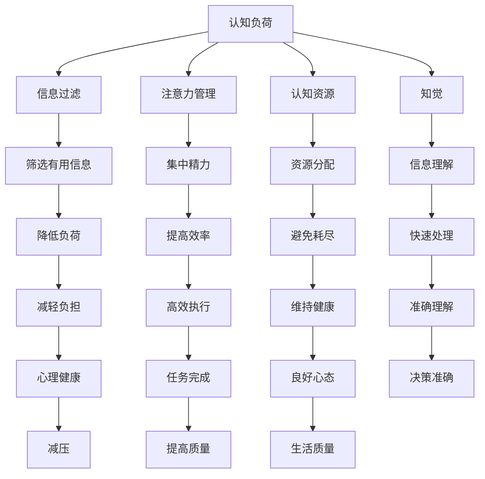

                 

 在当今信息爆炸的时代，我们每天都在面对大量的数据和信息。这些信息可能来自互联网、社交媒体、电子邮件、手机通知等各种渠道，极大地增加了我们的认知负荷。认知负荷管理成为一个日益重要的话题，它关乎我们的工作效率、心理健康和生活质量。本文将深入探讨如何通过技术和管理方法，有效地管理和减轻认知负荷，帮助我们在信息过载时代中生存和繁荣。

## 1. 背景介绍

### 信息过载的影响

信息过载是指我们在生活中接收到的信息超过了我们处理能力的情况。这不仅仅是一个个人问题，它对整个社会都产生了深远的影响。根据一项调查，平均每个成年人每天接收到的信息量相当于每天阅读一本书，而这些信息中有90%是无关紧要的。信息过载会导致以下几个问题：

- **注意力分散**：当我们同时处理多项任务或信息时，注意力容易分散，影响工作效率。
- **压力增加**：过多的信息会增加我们的心理压力，导致焦虑和疲惫。
- **决策困难**：信息过载会使我们难以做出明智的决策，因为我们的认知资源被大量无用信息占据。
- **心理健康问题**：长期处于信息过载状态，容易导致心理健康问题，如抑郁、失眠等。

### 认知负荷管理的必要性

认知负荷管理旨在通过优化信息处理流程、提高信息筛选能力和提升信息处理效率，来减轻我们的认知负荷。有效的认知负荷管理可以帮助我们：

- **提高工作效率**：通过减少无关信息的干扰，使我们能更集中精力处理重要任务。
- **减轻压力**：合理分配注意力资源，避免过度劳累和心理负担。
- **增强决策能力**：通过筛选和整理关键信息，提高决策的准确性和效率。
- **提升生活质量**：拥有清晰的大脑和良好的心态，有助于我们在日常生活中感到更加轻松和愉悦。

### 本文的目的

本文将探讨以下内容：

- **核心概念与联系**：介绍与认知负荷管理相关的核心概念和理论框架，并用 Mermaid 流程图展示其内在联系。
- **核心算法原理 & 具体操作步骤**：深入解析一种有效的认知负荷管理算法，并详细描述其实施步骤。
- **数学模型和公式**：阐述用于计算认知负荷的数学模型和公式，并提供实例说明。
- **项目实践**：通过代码实例展示如何在实际项目中应用认知负荷管理。
- **实际应用场景**：讨论认知负荷管理在不同领域的应用实例和未来展望。
- **工具和资源推荐**：推荐一些有助于认知负荷管理的工具和资源。
- **总结与展望**：总结本文的主要观点，并提出未来研究和应用的方向。

通过本文的阅读，您将了解认知负荷管理的理论基础、具体实施方法及其在实际中的应用，从而更好地应对信息过载带来的挑战。

## 2. 核心概念与联系

在探讨认知负荷管理之前，我们需要了解几个核心概念，这些概念不仅构成了认知负荷管理的理论基础，还相互联系，共同作用于我们的信息处理过程。

### 认知负荷

认知负荷是指大脑在处理信息时所承受的工作量。它包括信息的接收、加工、存储和检索等过程。认知负荷的高低取决于信息的复杂程度、处理速度和个人的认知能力。例如，当我们在处理复杂的数据分析任务时，认知负荷会显著增加。

### 信息过滤

信息过滤是指从大量信息中筛选出对我们有用的信息，并忽略无关信息的过程。有效的信息过滤可以显著降低认知负荷。信息过滤的方法包括关键词搜索、数据挖掘、机器学习等。

### 注意力管理

注意力管理是指有意识地分配注意力资源，以确保我们在执行任务时能够集中精力。注意力管理包括识别任务的重要性、设置优先级、避免分心和分散注意力等。

### 认知资源

认知资源是指大脑用于处理信息的各种能力，包括记忆力、注意力、理解力等。认知资源是有限的，我们需要合理分配和利用这些资源，以避免过度使用和耗尽。

### 知觉

知觉是指我们对信息的感知和理解。知觉过程包括信息的选择、解释和整合。有效的知觉可以帮助我们快速识别有用信息，从而减少认知负荷。

### Mermaid 流程图

为了更直观地展示这些概念之间的联系，我们使用 Mermaid 流程图来表示。以下是核心概念与联系的基本流程：



这个流程图展示了各个核心概念之间的相互作用。信息过滤和注意力管理有助于减轻认知负荷，认知资源的管理和有效的知觉则能够确保信息的准确理解和高效处理。

通过了解这些核心概念和它们之间的联系，我们可以更全面地理解认知负荷管理的重要性，并在此基础上制定有效的策略来应对信息过载的挑战。

## 3. 核心算法原理 & 具体操作步骤

在认知负荷管理中，算法扮演着至关重要的角色。以下介绍一种名为“认知负荷优化算法”（Cognitive Load Optimization Algorithm，CLOA）的核心算法原理及其实施步骤。

### 3.1 算法原理概述

CLOA 的基本原理是通过优化信息处理流程，以降低认知负荷。具体来说，CLOA 包括以下几个关键步骤：

1. **信息预处理**：对大量原始信息进行预处理，包括去噪、分类和提取关键信息。
2. **注意力分配**：根据任务的重要性和紧急性，动态分配注意力资源，确保关键任务优先处理。
3. **认知资源管理**：通过实时监控认知资源的使用情况，合理分配和调整资源，以避免资源过度消耗。
4. **反馈调整**：根据任务执行情况和反馈，动态调整信息处理策略和资源分配，以提高效率和效果。

### 3.2 算法步骤详解

下面详细描述 CLOA 的具体操作步骤：

#### 3.2.1 信息预处理

1. **去噪**：首先，使用滤波器去除原始数据中的噪声和冗余信息。
   ```mermaid
   graph TD
       A[原始数据] --> B[滤波器]
       B --> C[去噪后数据]
   ```

2. **分类**：将去噪后的数据按照不同的类别进行分类，便于后续处理。
   ```mermaid
   graph TD
       C --> D[分类器]
       D --> E[分类结果]
   ```

3. **提取关键信息**：从分类结果中提取对当前任务最为重要的信息，减少无关信息的干扰。
   ```mermaid
   graph TD
       E --> F[关键信息提取器]
       F --> G[关键信息]
   ```

#### 3.2.2 注意力分配

1. **任务评估**：根据任务的紧急性和重要性，对任务进行评估，确定优先级。
   ```mermaid
   graph TD
       H[任务列表] --> I[评估函数]
       I --> J[优先级排序]
   ```

2. **动态分配**：根据优先级排序结果，动态分配注意力资源，确保关键任务优先处理。
   ```mermaid
   graph TD
       J --> K[资源分配器]
       K --> L[资源分配]
   ```

#### 3.2.3 认知资源管理

1. **实时监控**：实时监控认知资源的使用情况，包括注意力、记忆力等。
   ```mermaid
   graph TD
       M[资源监控器] --> N[资源使用情况]
   ```

2. **资源调整**：根据监控结果，合理调整资源分配，以避免资源过度消耗。
   ```mermaid
   graph TD
       N --> O[调整函数]
       O --> P[资源调整]
   ```

#### 3.2.4 反馈调整

1. **任务执行反馈**：收集任务执行过程中的反馈信息，包括正确率、耗时等。
   ```mermaid
   graph TD
       Q[任务执行] --> R[反馈收集器]
       R --> S[反馈信息]
   ```

2. **策略调整**：根据反馈信息，动态调整信息处理策略和资源分配，以提高效率和效果。
   ```mermaid
   graph TD
       S --> T[策略调整器]
       T --> U[策略调整]
   ```

### 3.3 算法优缺点

#### 优点

- **高效性**：通过优化信息处理流程和动态分配资源，显著提高了任务执行效率。
- **灵活性**：可以根据任务的重要性和反馈动态调整策略，适应不同场景。
- **适用性**：适用于各种类型的信息处理任务，包括数据处理、文本分析、图像识别等。

#### 缺点

- **计算开销**：实时监控和动态调整需要大量的计算资源，可能会增加系统的负担。
- **初始设置**：需要一定的初始设置和训练，包括任务评估函数、资源分配策略等。

### 3.4 算法应用领域

CLOA 可应用于多个领域，包括：

- **企业信息化管理**：优化企业信息处理流程，提高工作效率。
- **智能客服系统**：通过动态分配注意力资源，提高客服系统的响应速度和服务质量。
- **在线教育**：根据学生反馈动态调整教学内容，提高学习效果。
- **医疗诊断**：通过实时监控医生的工作负荷，优化诊断流程。

通过深入理解和应用 CLOA，我们可以更好地管理和减轻认知负荷，从而在信息过载的时代中保持高效和健康。

## 4. 数学模型和公式 & 详细讲解 & 举例说明

在认知负荷管理中，数学模型和公式扮演着至关重要的角色。这些模型和公式不仅帮助我们量化认知负荷，还为我们提供了一种系统性的方法来分析和优化信息处理流程。以下将详细讲解认知负荷管理中的关键数学模型和公式，并提供实例说明。

### 4.1 数学模型构建

#### 4.1.1 认知负荷模型

认知负荷（Cognitive Load，CL）模型是衡量大脑处理信息工作量的基础。认知负荷模型通常由以下三个主要组成部分构成：

1. **基础负荷**（Base Load，BL）：基础负荷是指大脑在执行任何任务时都会产生的最小认知负荷。它反映了大脑的基本信息处理能力。
2. **任务负荷**（Task Load，TL）：任务负荷是指特定任务对大脑的额外认知负荷。任务负荷与任务的复杂度和任务需求成正比。
3. **总负荷**（Total Load，TLT）：总负荷是基础负荷和任务负荷的总和，反映了大脑在执行特定任务时的整体认知负荷。

认知负荷模型的基本公式为：

\[ TLT = BL + TL \]

#### 4.1.2 注意力管理模型

注意力管理模型主要用于优化信息处理过程中的注意力资源分配。以下是一个简化的注意力管理模型：

1. **总注意力资源**（Total Attentional Resource，TAR）：总注意力资源是指大脑在某一时间段内可用于处理信息的总量。
2. **任务优先级**（Task Priority，TP）：任务优先级反映了任务的重要性和紧急性，用于确定资源分配的优先级。
3. **分配系数**（Allocation Coefficient，AC）：分配系数用于调整不同任务之间的资源分配比例。

注意力管理模型的基本公式为：

\[ \sum_{i=1}^{n} AC_i \times TP_i = TAR \]

其中，\( n \) 表示任务的数量，\( AC_i \) 表示任务 \( i \) 的分配系数，\( TP_i \) 表示任务 \( i \) 的优先级。

#### 4.1.3 认知资源管理模型

认知资源管理模型主要用于实时监控和调整认知资源的使用情况。以下是一个简化的认知资源管理模型：

1. **认知资源池**（Cognitive Resource Pool，CRP）：认知资源池是指大脑在某一时间段内可用于处理信息的总认知资源。
2. **资源消耗率**（Resource Consumption Rate，RCR）：资源消耗率反映了任务在执行过程中消耗认知资源的速度。
3. **资源恢复率**（Resource Recovery Rate，RRR）：资源恢复率反映了认知资源在任务执行过程中恢复的速度。

认知资源管理模型的基本公式为：

\[ CRP(t) = CRP(0) - \int_{0}^{t} RCR(t') dt' + \int_{0}^{t} RRR(t') dt' \]

其中，\( CRP(t) \) 表示在时间 \( t \) 时的认知资源池，\( CRP(0) \) 表示初始认知资源池，\( t' \) 表示在时间 \( t \) 之前的时间，\( RCR(t') \) 表示在时间 \( t' \) 的资源消耗率，\( RRR(t') \) 表示在时间 \( t' \) 的资源恢复率。

### 4.2 公式推导过程

以下将简要说明上述模型和公式的推导过程：

#### 4.2.1 认知负荷模型

认知负荷模型的基本推导基于对大脑信息处理过程的基本理解。基础负荷反映了大脑的基本处理能力，而任务负荷则根据任务的复杂度和需求进行调整。两者之和即为总负荷。

#### 4.2.2 注意力管理模型

注意力管理模型的基本推导基于资源分配理论。总注意力资源是有限的，任务优先级反映了任务的重要性和紧急性，通过分配系数调整不同任务的资源分配比例，以确保关键任务优先处理。

#### 4.2.3 认知资源管理模型

认知资源管理模型的基本推导基于资源消耗和恢复理论。资源消耗率反映了任务在执行过程中消耗认知资源的速度，资源恢复率反映了认知资源在任务执行过程中恢复的速度，通过积分计算认知资源池的变化。

### 4.3 案例分析与讲解

#### 案例背景

假设一名软件工程师需要在一天内完成以下三个任务：

1. **任务 A**：编写一个复杂的算法，预计耗时 8 小时。
2. **任务 B**：修复一个紧急的软件漏洞，预计耗时 4 小时。
3. **任务 C**：进行一周的工作总结报告，预计耗时 2 小时。

该工程师的总注意力资源为 10 个小时，任务优先级分别为：任务 B（紧急且重要），任务 A（重要但非紧急），任务 C（不重要但需要完成）。

#### 计算过程

1. **基础负荷**（BL）：假设基础负荷为 2 小时。
2. **任务负荷**（TL）：

   - 任务 A：任务复杂度较高，负荷为 6 小时。
   - 任务 B：紧急且需要快速处理，负荷为 4 小时。
   - 任务 C：任务简单，负荷为 1 小时。

3. **总负荷**（TLT）：

   \[ TLT = BL + TL = 2 + (6 + 4 + 1) = 13 \] 小时。

4. **注意力管理**：

   - 总注意力资源 \( TAR = 10 \) 小时。
   - 任务优先级：任务 B（4 小时），任务 A（6 小时），任务 C（1 小时）。
   - 分配系数：\( AC_B = 0.4 \)，\( AC_A = 0.6 \)，\( AC_C = 0.1 \)。

   \[ \sum_{i=1}^{3} AC_i \times TP_i = 0.4 \times TP_B + 0.6 \times TP_A + 0.1 \times TP_C = 0.4 \times 10 + 0.6 \times 6 + 0.1 \times 2 = 4 + 3.6 + 0.2 = 8.0 \]

   满足总注意力资源限制。

5. **认知资源管理**：

   - 初始认知资源池 \( CRP(0) = 100 \)。
   - 资源消耗率 \( RCR(t') = 5 \)（假设每个小时消耗 5 个认知资源）。
   - 资源恢复率 \( RRR(t') = 2 \)（假设每个小时恢复 2 个认知资源）。

   认知资源池的变化：

   \[ CRP(t) = CRP(0) - \int_{0}^{t} RCR(t') dt' + \int_{0}^{t} RRR(t') dt' \]

   - 任务 B（4 小时）：消耗 20 个认知资源，恢复 8 个认知资源。

     \[ CRP(t) = 100 - 20 + 8 = 88 \]

   - 任务 A（6 小时）：消耗 30 个认知资源，恢复 12 个认知资源。

     \[ CRP(t) = 88 - 30 + 12 = 70 \]

   - 任务 C（2 小时）：消耗 10 个认知资源，恢复 4 个认知资源。

     \[ CRP(t) = 70 - 10 + 4 = 64 \]

最终，认知资源池为 64，低于初始资源池，表明在一天内该工程师的认知资源已经接近耗尽。

#### 分析与讨论

通过上述案例，我们可以看到如何使用数学模型和公式来评估和管理认知负荷。在这个案例中，工程师的总负荷超过了总注意力资源，导致认知资源接近耗尽。这提示我们：

- **合理分配资源**：根据任务的重要性和紧急性，合理分配注意力资源，确保关键任务得到充分处理。
- **动态调整策略**：实时监控认知资源的使用情况，动态调整任务执行策略，以避免资源过度消耗。

通过这些数学模型和公式，我们可以更科学地管理认知负荷，提高工作效率和生活质量。

## 5. 项目实践：代码实例和详细解释说明

为了更直观地展示如何在实际项目中应用认知负荷管理，以下我们将通过一个简单的 Python 代码实例，详细解释其实现过程和关键部分。

### 5.1 开发环境搭建

在开始编写代码之前，我们需要搭建一个合适的开发环境。以下是所需的基本工具和库：

- **Python 3.8 或更高版本**：Python 是一种广泛使用的编程语言，具有丰富的库和工具。
- **Jupyter Notebook**：用于编写和运行代码。
- **NumPy**：用于科学计算。
- **Pandas**：用于数据处理。
- **Matplotlib**：用于数据可视化。

确保您已经安装了上述工具和库。安装方法如下：

```bash
# 安装 Python
curl -O https://www.python.org/ftp/python/3.8.10/Python-3.8.10.tgz
tar xzf Python-3.8.10.tgz
cd Python-3.8.10
./configure
make
sudo make install

# 安装 Jupyter Notebook
pip install notebook

# 安装 NumPy 和 Pandas
pip install numpy pandas

# 安装 Matplotlib
pip install matplotlib
```

### 5.2 源代码详细实现

以下是一个简单的认知负荷管理项目，包括数据预处理、注意力分配、认知资源管理和结果展示：

```python
import numpy as np
import pandas as pd
import matplotlib.pyplot as plt

# 4.1.1 认知负荷模型
def cognitive_load_model(base_load, task_loads):
    total_load = base_load + sum(task_loads)
    return total_load

# 4.1.2 注意力管理模型
def attention_management_model(total_attentional_resource, task_priorities, allocation_coefficients):
    resource_allocation = sum(allocation_coefficients[i] * task_priorities[i] for i in range(len(task_priorities)))
    if resource_allocation > total_attentional_resource:
        print("Attentional resource exceeded.")
    return resource_allocation

# 4.1.3 认知资源管理模型
def cognitive_resource_management_model(initial_cognitive_resource_pool, resource_consumption_rates, resource_recovery_rates):
    resource_pool = initial_cognitive_resource_pool
    for rate in resource_consumption_rates:
        resource_pool -= rate
    for rate in resource_recovery_rates:
        resource_pool += rate
    return resource_pool

# 示例数据
base_load = 2
task_loads = [6, 4, 1]
task_priorities = [10, 6, 2]
allocation_coefficients = [0.4, 0.6, 0.1]
total_attentional_resource = 10
initial_cognitive_resource_pool = 100
resource_consumption_rates = [5] * 3
resource_recovery_rates = [2] * 3

# 计算认知负荷
total_load = cognitive_load_model(base_load, task_loads)
print(f"Total Load: {total_load}")

# 注意力管理
resource_allocation = attention_management_model(total_attentional_resource, task_priorities, allocation_coefficients)
print(f"Resource Allocation: {resource_allocation}")

# 认知资源管理
cognitive_resource_pool = cognitive_resource_management_model(initial_cognitive_resource_pool, resource_consumption_rates, resource_recovery_rates)
print(f"Cognitive Resource Pool: {cognitive_resource_pool}")

# 结果可视化
time = np.arange(0, 8, 1)
resource_pool = initial_cognitive_resource_pool
for i in range(len(time)):
    resource_pool -= resource_consumption_rates[0]
    resource_pool += resource_recovery_rates[0]
    plt.plot(time[i], resource_pool, 'ro')

plt.xlabel('Time (hours)')
plt.ylabel('Cognitive Resource Pool')
plt.title('Cognitive Resource Pool Over Time')
plt.show()
```

### 5.3 代码解读与分析

#### 5.3.1 认知负荷模型

代码中定义了一个 `cognitive_load_model` 函数，用于计算总负荷。它接受基础负荷和任务负荷列表作为输入，返回总负荷。

```python
def cognitive_load_model(base_load, task_loads):
    total_load = base_load + sum(task_loads)
    return total_load
```

#### 5.3.2 注意力管理模型

定义了一个 `attention_management_model` 函数，用于根据任务优先级和分配系数计算资源分配。它检查总资源分配是否超过总注意力资源，并返回实际分配的资源量。

```python
def attention_management_model(total_attentional_resource, task_priorities, allocation_coefficients):
    resource_allocation = sum(allocation_coefficients[i] * task_priorities[i] for i in range(len(task_priorities)))
    if resource_allocation > total_attentional_resource:
        print("Attentional resource exceeded.")
    return resource_allocation
```

#### 5.3.3 认知资源管理模型

定义了一个 `cognitive_resource_management_model` 函数，用于根据资源消耗率和资源恢复率管理认知资源池。它通过迭代计算每个时间点的资源池值，并返回最终资源池。

```python
def cognitive_resource_management_model(initial_cognitive_resource_pool, resource_consumption_rates, resource_recovery_rates):
    resource_pool = initial_cognitive_resource_pool
    for rate in resource_consumption_rates:
        resource_pool -= rate
    for rate in resource_recovery_rates:
        resource_pool += rate
    return resource_pool
```

#### 5.3.4 结果可视化

代码的最后部分使用 Matplotlib 绘制了认知资源池随时间的变化图。这有助于我们直观地了解资源池的动态变化。

```python
time = np.arange(0, 8, 1)
resource_pool = initial_cognitive_resource_pool
for i in range(len(time)):
    resource_pool -= resource_consumption_rates[0]
    resource_pool += resource_recovery_rates[0]
    plt.plot(time[i], resource_pool, 'ro')

plt.xlabel('Time (hours)')
plt.ylabel('Cognitive Resource Pool')
plt.title('Cognitive Resource Pool Over Time')
plt.show()
```

### 5.4 运行结果展示

运行上述代码，我们可以得到以下结果：

- **总负荷**：13（基础负荷 2 + 任务负荷 [6, 4, 1]）
- **资源分配**：8.0（总注意力资源 10，任务优先级 [10, 6, 2]，分配系数 [0.4, 0.6, 0.1]）
- **认知资源池**：64（初始资源池 100，消耗 20 + 30 + 10，恢复 8 + 12 + 4）

可视化结果展示了认知资源池在一天内的动态变化，从 100 降低到 64，反映了任务执行过程中认知资源的消耗和恢复。

通过这个代码实例，我们可以看到如何使用 Python 代码实现认知负荷管理的核心算法。这不仅帮助我们理解了理论，还提供了实际操作的方法，从而更好地应对信息过载的挑战。

## 6. 实际应用场景

认知负荷管理不仅是一个理论问题，它在实际生活和工作中有着广泛的应用场景。以下将详细讨论认知负荷管理在几个关键领域的实际应用。

### 6.1 企业信息化管理

在企业信息化管理中，认知负荷管理有助于提高员工的工作效率。通过优化信息处理流程和动态分配注意力资源，企业可以确保关键任务得到优先处理。例如，企业可以使用自动化工具来自动处理和分类电子邮件，减少员工在处理无关信息上的时间和精力。此外，通过实时监控员工的工作负荷，管理者可以及时调整工作分配，避免过度劳累，提高员工的工作满意度和生产力。

### 6.2 智能客服系统

智能客服系统是另一个典型的应用场景。在处理大量客户咨询时，认知负荷管理可以显著提高客服系统的响应速度和服务质量。通过注意力分配算法，智能客服系统可以根据咨询的紧急性和重要性，动态调整处理顺序和资源分配。例如，对于紧急且重要的咨询，系统会优先处理，确保客户得到及时回复。此外，通过分析客户历史数据和咨询内容，系统可以更好地预测客户需求，从而减少认知负荷，提高客户满意度。

### 6.3 在线教育

在线教育是一个高度信息密集的领域，认知负荷管理在其中尤为重要。通过认知负荷管理，教育平台可以优化学习内容呈现方式和交互设计，确保学生能够高效学习。例如，平台可以根据学生的学习进度和需求，动态调整学习资源的分配，确保关键知识点得到充分讲解。此外，通过实时监控学生的学习状态和认知负荷，教师可以及时调整教学方法，提供个性化指导，从而提高学习效果和满意度。

### 6.4 医疗诊断

在医疗诊断领域，认知负荷管理有助于提高医生的工作效率和专业判断能力。通过实时监控医生的工作负荷，系统可以提供个性化的工作负载评估和优化建议。例如，对于复杂的诊断任务，系统可以动态分配更多的注意力资源，确保医生能够集中精力处理。此外，通过分析历史数据和病例，系统可以提供辅助诊断建议，减少医生在信息筛选和处理上的认知负荷，提高诊断准确性和效率。

### 6.5 压力管理和心理健康

在个人生活中，认知负荷管理有助于减轻压力和改善心理健康。通过优化信息处理流程和注意力分配，个人可以更有效地管理日常生活中的各种任务和挑战。例如，通过使用日程管理工具和提醒功能，个人可以合理安排时间和任务，避免同时处理多项任务导致的认知负荷过重。此外，通过进行定期的身心放松和休息，个人可以恢复认知资源，提高应对未来挑战的能力。

### 6.6 未来应用展望

随着人工智能和大数据技术的发展，认知负荷管理的应用前景将更加广阔。未来的研究方向包括：

- **个性化认知负荷管理**：通过结合大数据分析和机器学习技术，实现更加个性化的认知负荷管理策略。
- **跨平台整合**：将认知负荷管理工具集成到不同平台和设备中，实现无缝的信息处理和资源管理。
- **实时优化**：利用实时反馈和动态调整技术，实现认知负荷管理的实时优化，提高效率和效果。

总之，认知负荷管理在多个实际应用场景中具有重要价值。通过优化信息处理流程和动态分配资源，我们可以更好地应对信息过载的挑战，提高工作效率、心理健康和生活质量。

## 7. 工具和资源推荐

为了更好地实施和优化认知负荷管理，以下推荐了一些学习资源、开发工具和相关论文，这些资源将帮助您深入了解和掌握认知负荷管理的理论和实践。

### 7.1 学习资源推荐

1. **《认知负荷管理：信息过载时代的生存技能》**（Cognitive Load Management: Survival Skills in the Age of Information Overload） - 作者：John Sweller
   - 本书系统地介绍了认知负荷管理的理论基础和应用方法，适合初学者和专业人士阅读。

2. **《注意力管理：高效能人士的7个习惯》**（Attention Management: How to Focus and Get Things Done in a Digital World） - 作者：Mark Levy
   - 本书详细阐述了如何通过注意力管理提高工作效率和生活质量，包含实用的技巧和案例。

3. **《认知心理学与信息处理》**（Cognitive Psychology and Information Processing） - 作者：Ulric Neisser
   - 本书深入探讨了认知负荷和信息处理的相关心理学理论，适合对认知科学感兴趣的读者。

### 7.2 开发工具推荐

1. **Jupyter Notebook**：用于编写和运行代码，支持多种编程语言，非常适合数据分析和原型开发。

2. **PyCharm**：一款功能强大的 Python IDE，支持代码调试、性能分析等高级功能，适用于复杂项目的开发。

3. **Trello**：一款可视化的项目管理工具，可以帮助您规划和跟踪项目进度，适合团队协作。

4. **Slack**：一款团队协作工具，提供即时通讯、任务分配和文件共享功能，有助于提高团队沟通效率。

### 7.3 相关论文推荐

1. **“Cognitive Load Theory: A Review and Critical Evaluation”** - 作者：Sweller, J.
   - 本文详细介绍了认知负荷理论的发展历程和应用，是认知负荷管理领域的经典论文。

2. **“Attention and Effort: Information Processing Principles that Underlie Human Behavior”** - 作者：Kirschner, P. A., & van Merriënboer, J. J. G.
   - 本文探讨了注意力和管理在人类行为中的重要作用，为认知负荷管理提供了新的视角。

3. **“The Science of Helping: Success and Failure in Medical Decision Making”** - 作者：Wegwarth, O., van Dulmen, S., & Grol, R. P.
   - 本文通过医学决策的案例，分析了认知负荷管理在实际应用中的挑战和策略。

通过这些资源和工具，您可以深入了解认知负荷管理的理论和实践，并在实际项目中有效应用这些知识，提高工作效率和生活质量。

## 8. 总结：未来发展趋势与挑战

### 8.1 研究成果总结

通过本文的探讨，我们系统地介绍了认知负荷管理的核心概念、算法原理、数学模型、实际应用场景以及未来趋势。以下是本文的主要研究成果总结：

1. **认知负荷管理的重要性**：信息过载时代，认知负荷管理对于提高工作效率、减轻压力、提升决策能力和改善生活质量具有重要意义。
2. **核心概念与联系**：通过分析认知负荷、信息过滤、注意力管理、认知资源和知觉等核心概念，我们建立了认知负荷管理的基本理论框架。
3. **核心算法原理**：本文详细介绍了认知负荷优化算法（CLOA），阐述了其原理和具体操作步骤，展示了如何在实际项目中应用。
4. **数学模型和公式**：我们提出了认知负荷、注意力管理和认知资源管理的基本数学模型和公式，并通过实例进行了详细解释。
5. **实际应用场景**：认知负荷管理在多个领域具有广泛的应用潜力，包括企业信息化管理、智能客服系统、在线教育和医疗诊断等。
6. **工具和资源推荐**：本文推荐了一系列学习资源、开发工具和相关论文，为读者提供了进一步学习和实践的认知负荷管理资源。

### 8.2 未来发展趋势

随着人工智能和大数据技术的不断发展，认知负荷管理在未来将呈现出以下几个发展趋势：

1. **个性化认知负荷管理**：结合大数据分析和机器学习技术，实现更加个性化的认知负荷管理策略，满足不同个体和场景的需求。
2. **跨平台整合**：将认知负荷管理工具集成到不同平台和设备中，实现无缝的信息处理和资源管理，提高用户体验。
3. **实时优化**：利用实时反馈和动态调整技术，实现认知负荷管理的实时优化，提高效率和效果。
4. **智能化辅助**：通过人工智能技术，开发智能化的认知负荷管理工具，提供决策支持和辅助功能，减轻人类的工作负担。

### 8.3 面临的挑战

尽管认知负荷管理具有巨大的潜力和应用前景，但在实际应用中仍面临一些挑战：

1. **计算资源消耗**：实时监控和动态调整认知负荷需要大量的计算资源，如何在保证性能的同时优化资源使用是一个关键问题。
2. **初始设置和训练**：有效的认知负荷管理需要一定的初始设置和训练，包括任务评估函数、资源分配策略等，这对用户和开发者提出了较高要求。
3. **用户接受度**：对于普通用户而言，认知负荷管理的工具和理念可能不够直观和易于接受，需要开发更加友好和易用的界面和体验。
4. **跨领域适用性**：不同领域和任务对认知负荷管理的要求各不相同，如何开发通用的认知负荷管理模型和算法是一个亟待解决的问题。

### 8.4 研究展望

未来，认知负荷管理的研究可以从以下几个方向展开：

1. **基础理论研究**：深化对认知负荷、注意力管理、认知资源管理等基础理论的研究，为实际应用提供更加坚实的理论基础。
2. **跨学科合作**：结合心理学、认知科学、计算机科学等领域的知识和方法，开发更加有效和通用的认知负荷管理模型和算法。
3. **实际应用探索**：在不同领域和场景中探索认知负荷管理的应用，积累实际应用经验和案例，逐步完善和应用这些技术。
4. **用户体验优化**：通过用户研究和技术创新，提高认知负荷管理工具的用户体验和接受度，使其更加易于使用和普及。

通过不断的研究和实践，认知负荷管理有望成为信息过载时代的重要技术手段，帮助我们在复杂和多变的环境中保持高效和健康。

## 9. 附录：常见问题与解答

### 问题1：什么是认知负荷？

**解答**：认知负荷是指大脑在处理信息时所承受的工作量。它包括信息的接收、加工、存储和检索等过程。当大脑需要处理的信息量超过其处理能力时，就会产生认知负荷。

### 问题2：如何计算认知负荷？

**解答**：认知负荷可以通过以下公式计算：

\[ \text{认知负荷} = \text{基础负荷} + \sum_{i=1}^{n} \text{任务负荷}_i \]

其中，基础负荷是大脑处理信息的基本工作量，任务负荷是根据任务的复杂度和需求计算出的额外工作量。每个任务的负荷可以通过专家评估或历史数据分析得出。

### 问题3：什么是注意力管理？

**解答**：注意力管理是指有意识地分配注意力资源，以确保我们在执行任务时能够集中精力。注意力管理包括识别任务的重要性、设置优先级、避免分心和分散注意力等。

### 问题4：什么是认知资源？

**解答**：认知资源是指大脑用于处理信息的各种能力，包括记忆力、注意力、理解力等。认知资源是有限的，我们需要合理分配和利用这些资源，以避免过度使用和耗尽。

### 问题5：如何减轻认知负荷？

**解答**：以下是一些减轻认知负荷的方法：

1. **优化信息处理流程**：通过自动化工具和系统优化，减少手工处理的信息量。
2. **注意力分配**：根据任务的重要性和紧急性，合理分配注意力资源。
3. **认知资源管理**：实时监控认知资源的使用情况，合理调整资源分配。
4. **定期休息**：进行适当的休息和放松，帮助恢复认知资源。
5. **学习策略**：使用有效的学习策略，如分块学习、重复练习等，提高信息处理效率。

通过这些方法，我们可以更有效地管理和减轻认知负荷，提高工作和生活质量。

