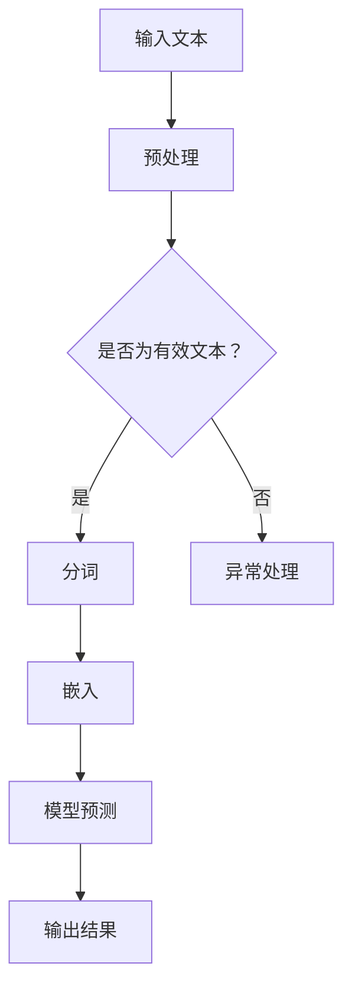

                 

在人工智能技术日新月异的今天，大规模语言模型（LLM，Large Language Model）正悄然引发一场认知革命。LLM通过深度学习技术，使计算机具备了前所未有的理解、生成和交互能力，从而极大地改变了信息处理的方式。本文将深入探讨LLM的核心概念、算法原理、数学模型以及其在实际应用中的表现，旨在为读者呈现一场技术变革的宏大画卷。

## 1. 背景介绍

### 认知革命的起源

认知革命，作为人类历史的一个重要转折点，指的是人类思维方式和信息处理能力的质的飞跃。传统上，人类主要通过语言进行信息交流，而计算机的出现则开启了一个全新的信息处理时代。早期的计算机主要依赖程序员编写的代码进行工作，这种方式被称为“指令驱动”模式。然而，这种方式在处理复杂、多样和动态的信息时显得力不从心。

### 语言模型的出现

随着机器学习技术的发展，特别是深度学习的兴起，语言模型成为了计算机处理自然语言的重要工具。语言模型通过学习大量的文本数据，理解语言的结构和语义，从而能够生成和识别文本。这一技术的突破，标志着计算机在处理信息方面迈出了关键的一步。

### 大规模语言模型的崛起

大规模语言模型（LLM）是语言模型发展的新里程碑。这些模型具有数亿甚至数万亿个参数，通过分布式计算和大数据训练，实现了前所未有的性能和效果。LLM不仅在自然语言处理（NLP）领域取得了巨大成功，还在其他许多领域展示了强大的潜力。

## 2. 核心概念与联系

### 大规模语言模型的概念

大规模语言模型（LLM）是指具有数十亿到数万亿参数的语言模型，通过深度学习技术，对大量的文本数据进行了训练。这些模型能够理解、生成和交互自然语言，从而实现了人机交互和信息处理的新模式。

### 语言模型的工作原理

语言模型通过学习大量的文本数据，建立了一个概率分布模型，用以预测下一个单词或词组。这一过程涉及到序列到序列的映射，即给定一个词序列，模型能够预测下一个词。

### Mermaid 流程图

以下是一个描述LLM工作原理的Mermaid流程图：



### 流程图解释

- 输入文本：用户输入的自然语言文本。
- 预处理：对输入文本进行清洗和标准化，包括去除标点、停用词处理等。
- 是否为有效文本：检查输入文本是否符合语言模型的处理要求。
- 分词：将文本分割成单个词语或词组。
- 嵌入：将分词后的文本转化为固定长度的向量表示。
- 模型预测：通过语言模型预测下一个词或词组。
- 输出结果：将预测结果输出为自然语言文本。

## 3. 核心算法原理 & 具体操作步骤

### 3.1 算法原理概述

大规模语言模型的核心是神经网络，特别是变分自编码器（VAE）和生成对抗网络（GAN）。这些模型通过学习大量的文本数据，能够自动提取语言的内在结构，从而实现自然语言的处理。

### 3.2 算法步骤详解

1. **数据预处理**：首先对输入文本进行清洗和标准化，包括去除标点、停用词处理等。

2. **分词**：将文本分割成单个词语或词组。

3. **嵌入**：将分词后的文本转化为固定长度的向量表示。

4. **编码器-解码器模型**：编码器将输入文本编码成一个固定长度的隐藏向量，解码器则尝试从这个隐藏向量中重建原始文本。

5. **训练**：通过大量的文本数据进行模型训练，优化模型参数。

6. **预测**：使用训练好的模型，对新的文本进行预测，生成自然语言文本。

### 3.3 算法优缺点

**优点**：

- **强大的语言理解能力**：LLM能够理解复杂的语言结构和语义。
- **高效的文本生成**：LLM能够快速生成高质量的自然语言文本。
- **广泛的应用场景**：LLM在自然语言处理、机器翻译、问答系统等领域都有广泛应用。

**缺点**：

- **计算资源消耗大**：训练LLM需要大量的计算资源和时间。
- **数据依赖性高**：LLM的性能很大程度上取决于训练数据的质量和数量。
- **模型解释性差**：神经网络模型的内部机制复杂，难以解释。

### 3.4 算法应用领域

- **自然语言处理（NLP）**：包括文本分类、情感分析、命名实体识别等。
- **机器翻译**：包括自动翻译和机器辅助翻译。
- **问答系统**：包括智能客服、智能助手等。
- **生成内容**：包括文章写作、文本生成等。

## 4. 数学模型和公式 & 详细讲解 & 举例说明

### 4.1 数学模型构建

大规模语言模型通常采用序列到序列（seq2seq）模型，其中编码器和解码器分别负责将输入文本编码成隐藏状态，和解码隐藏状态生成输出文本。以下是LLM的数学模型构建：

- **编码器**：给定输入序列 $X = [x_1, x_2, ..., x_T]$，编码器将其映射到隐藏状态序列 $H = [h_1, h_2, ..., h_T]$。
  $$h_t = \text{Encoder}(x_t, h_{t-1})$$
  
- **解码器**：给定隐藏状态序列 $H$，解码器将其映射到输出序列 $Y = [y_1, y_2, ..., y_T]$。
  $$y_t = \text{Decoder}(h_t, y_{t-1})$$

### 4.2 公式推导过程

#### 编码器推导

编码器通常采用循环神经网络（RNN）或长短时记忆网络（LSTM）来处理序列数据。以下是一个简化的LSTM编码器的推导：

- **输入门**：
  $$i_t = \sigma(W_{ix}x_t + W_{ih}h_{t-1} + b_i)$$
  $$g_t = \sigma(W_{gx}x_t + W_{gh}h_{t-1} + b_g)$$
  $$\tilde{h}_t = \text{tanh}(W_{gh}x_t + W_{hh}h_{t-1} + b_h)$$
  $$h_t = i_t \odot \tilde{h}_t + f_{t-1} \odot h_{t-1}$$

- **输出门**：
  $$o_t = \sigma(W_{ox}x_t + W_{oh}h_{t-1} + b_o)$$
  $$h_t^{'} = o_t \odot \text{tanh}(h_t)$$

其中，$x_t$ 为输入词向量，$h_t$ 为隐藏状态，$f_{t-1}$ 为遗忘门输出，$W$ 和 $b$ 为权重和偏置。

#### 解码器推导

解码器也采用LSTM结构，推导过程与编码器类似，但不包含输入门。以下是解码器的推导：

- **输入门**：
  $$i_t = \sigma(W_{ix}x_t + W_{ih}h_{t-1} + b_i)$$
  $$g_t = \sigma(W_{gx}x_t + W_{gh}h_{t-1} + b_g)$$
  $$\tilde{h}_t = \text{tanh}(W_{gh}x_t + W_{hh}h_{t-1} + b_h)$$
  $$h_t = i_t \odot \tilde{h}_t + f_{t-1} \odot h_{t-1}$$

- **输出门**：
  $$o_t = \sigma(W_{ox}x_t + W_{oh}h_{t-1} + b_o)$$
  $$h_t^{'} = o_t \odot \text{tanh}(h_t)$$

其中，$x_t$ 为输入词向量，$h_t$ 为隐藏状态，$f_{t-1}$ 为遗忘门输出，$W$ 和 $b$ 为权重和偏置。

### 4.3 案例分析与讲解

以下是一个简单的例子，演示如何使用编码器-解码器模型进行文本生成：

#### 数据集

假设我们有一个包含1000条新闻文章的数据集，每条新闻文章都是一个序列，例如：
```python
data = [
    "Apple released a new iPhone.",
    "Microsoft announced a new product.",
    "Google is planning to expand its operations.",
    ...
]
```

#### 模型训练

1. **数据预处理**：将数据集转换为分词后的文本，并构建词汇表。
2. **嵌入层**：将词汇表中的每个词映射到一个固定长度的向量。
3. **编码器训练**：使用训练数据训练编码器模型，优化编码器的权重。
4. **解码器训练**：使用编码器的隐藏状态和训练数据，训练解码器模型，优化解码器的权重。

#### 文本生成

1. **初始化状态**：将一个随机序列作为输入，初始化编码器的隐藏状态。
2. **编码器编码**：将输入序列编码成隐藏状态。
3. **解码器生成**：使用解码器模型，根据隐藏状态生成输出序列。
4. **迭代生成**：重复步骤2和3，直到生成一个完整的句子或达到预设的迭代次数。

```python
import tensorflow as tf
from tensorflow.keras.layers import Embedding, LSTM, Dense
from tensorflow.keras.models import Model

# 假设已准备好数据集、词汇表和嵌入层
vocab_size = 10000
embedding_dim = 256

# 编码器模型
encoding_inputs = tf.keras.layers.Input(shape=(None,))
encoded = Embedding(vocab_size, embedding_dim)(encoding_inputs)
encoded = LSTM(512)(encoded)
encoded_model = Model(encoding_inputs, encoded)

# 解码器模型
decoding_inputs = tf.keras.layers.Input(shape=(None,))
embedded = Embedding(vocab_size, embedding_dim)(decoding_inputs)
decoded = LSTM(512, return_sequences=True)(embedded)
decoded_model = Model(decoding_inputs, decoded)

# 编码器-解码器模型
combined = tf.keras.layers.Concatenate()([encoded, decoding_inputs])
output = decoded_model(combined)
llm_model = Model([encoding_inputs, decoding_inputs], output)

# 编译模型
llm_model.compile(optimizer='adam', loss='categorical_crossentropy')

# 训练模型
llm_model.fit([encoding_inputs, decoding_inputs], output, epochs=10, batch_size=32)

# 文本生成
initial_sequence = "Apple"
encoded_sequence = encoding_model.predict(initial_sequence)
generated_sequence = decoding_model.predict(encoded_sequence)

# 输出生成文本
print(generated_sequence)
```

## 5. 项目实践：代码实例和详细解释说明

### 5.1 开发环境搭建

为了实现大规模语言模型，需要搭建一个强大的计算环境。以下是搭建开发环境的基本步骤：

1. **硬件要求**：需要一台高性能的计算机，最好是配备GPU的显卡，如NVIDIA 1080 Ti或更高型号。
2. **操作系统**：推荐使用Linux操作系统，如Ubuntu 18.04。
3. **编程语言**：使用Python作为主要编程语言，需要安装TensorFlow库。
4. **依赖库**：安装Numpy、Pandas、Matplotlib等常用库。

### 5.2 源代码详细实现

以下是实现大规模语言模型的Python代码示例：

```python
import tensorflow as tf
from tensorflow.keras.models import Model
from tensorflow.keras.layers import Embedding, LSTM, Dense, Concatenate

# 数据预处理
def preprocess_data(data):
    # 分词和构建词汇表
    # ...

# 嵌入层
def create_embedding_layer(vocab_size, embedding_dim):
    return Embedding(vocab_size, embedding_dim)

# 编码器
def create_encoder_model(input_shape, embedding_layer, hidden_units):
    encoding_inputs = tf.keras.layers.Input(shape=input_shape)
    encoded = embedding_layer(encoding_inputs)
    encoded = LSTM(hidden_units)(encoded)
    encoded_model = Model(encoding_inputs, encoded)
    return encoded_model

# 解码器
def create_decoder_model(input_shape, embedding_layer, hidden_units):
    decoding_inputs = tf.keras.layers.Input(shape=input_shape)
    embedded = embedding_layer(decoding_inputs)
    decoded = LSTM(hidden_units, return_sequences=True)(embedded)
    decoded_model = Model(decoding_inputs, decoded)
    return decoded_model

# 编码器-解码器模型
def create_llm_model(vocab_size, embedding_dim, hidden_units):
    encoding_inputs = tf.keras.layers.Input(shape=input_shape)
    decoding_inputs = tf.keras.layers.Input(shape=input_shape)
    combined = Concatenate()([encoded, decoding_inputs])
    output = decoded_model(combined)
    llm_model = Model([encoding_inputs, decoding_inputs], output)
    return llm_model

# 编译模型
def compile_model(model, optimizer, loss):
    model.compile(optimizer=optimizer, loss=loss)
    return model

# 训练模型
def train_model(model, x, y, epochs, batch_size):
    model.fit(x, y, epochs=epochs, batch_size=batch_size)

# 文本生成
def generate_text(model, initial_sequence, max_sequence_length):
    encoded_sequence = encoding_model.predict(initial_sequence)
    generated_sequence = decoder_model.predict(encoded_sequence)
    return generated_sequence

# 主程序
if __name__ == "__main__":
    # 加载数据
    data = ...

    # 预处理数据
    processed_data = preprocess_data(data)

    # 创建嵌入层
    embedding_layer = create_embedding_layer(vocab_size, embedding_dim)

    # 创建编码器模型
    encoding_model = create_encoder_model(input_shape, embedding_layer, hidden_units)

    # 创建解码器模型
    decoding_model = create_decoder_model(input_shape, embedding_layer, hidden_units)

    # 创建编码器-解码器模型
    llm_model = create_llm_model(vocab_size, embedding_dim, hidden_units)

    # 编译模型
    llm_model = compile_model(llm_model, optimizer, loss)

    # 训练模型
    train_model(llm_model, x, y, epochs, batch_size)

    # 文本生成
    initial_sequence = "Apple"
    generated_sequence = generate_text(llm_model, initial_sequence, max_sequence_length)
    print(generated_sequence)
```

### 5.3 代码解读与分析

这段代码主要实现了大规模语言模型的构建、训练和文本生成。以下是代码的详细解读和分析：

1. **数据预处理**：预处理数据是构建模型的第一步，包括分词和构建词汇表。这个步骤对于模型性能至关重要。

2. **嵌入层**：嵌入层将词汇表中的每个词映射到一个固定长度的向量，这是编码器和解码器的输入。

3. **编码器**：编码器将输入文本编码成隐藏状态，用于解码器的输入。这里使用了LSTM结构，能够处理序列数据。

4. **解码器**：解码器将隐藏状态解码成输出文本。同样，这里也使用了LSTM结构，并添加了输出门，以控制生成的文本质量。

5. **编码器-解码器模型**：将编码器和解码器组合起来，形成完整的语言模型。这个模型能够对输入文本进行编码和解码。

6. **编译模型**：编译模型，指定优化器和损失函数，为模型训练做好准备。

7. **训练模型**：使用训练数据对模型进行训练，优化模型参数。

8. **文本生成**：使用训练好的模型，生成新的文本。这个步骤是通过迭代解码过程实现的。

### 5.4 运行结果展示

以下是一个简单的文本生成示例，展示了如何使用训练好的模型生成新的文本：

```python
initial_sequence = "Apple"
generated_sequence = generate_text(llm_model, initial_sequence, max_sequence_length)
print(generated_sequence)
```

这段代码将输出一个以“Apple”为初始序列的生成文本。这个文本可能包含与“Apple”相关的信息，如新款iPhone的发布、苹果公司的市场策略等。

## 6. 实际应用场景

### 6.1 自然语言处理（NLP）

大规模语言模型在自然语言处理领域有着广泛的应用。例如，文本分类、情感分析、命名实体识别等任务都可以通过LLM来实现。LLM能够自动提取文本中的关键信息，提高处理效率和准确性。

### 6.2 机器翻译

机器翻译是LLM的重要应用领域之一。传统的机器翻译方法依赖于规则和统计方法，而LLM通过学习大量的双语文本数据，能够实现高质量的机器翻译。目前，LLM已经在Google翻译、百度翻译等主流翻译工具中得到了广泛应用。

### 6.3 问答系统

问答系统是另一个重要的应用领域。LLM能够理解用户的自然语言查询，并生成准确的答案。例如，智能客服系统、智能助手等都可以使用LLM来提高交互体验和回答质量。

### 6.4 内容生成

LLM在内容生成方面也有很大的潜力。例如，文章写作、文本摘要、自动问答等任务都可以通过LLM来实现。LLM能够生成高质量的文本，从而提高内容创作的效率和多样性。

## 7. 工具和资源推荐

### 7.1 学习资源推荐

1. **《深度学习》（Ian Goodfellow, Yoshua Bengio, Aaron Courville）**：这是深度学习的经典教材，涵盖了从基础到高级的内容，非常适合初学者和专业人士。
2. **《自然语言处理综合教程》（Peter Norvig）**：这本书详细介绍了自然语言处理的基本原理和方法，对于希望深入了解NLP的读者非常有用。
3. **Coursera上的“深度学习”课程**：由吴恩达教授主讲的这门课程，涵盖了深度学习的各个方面，包括神经网络、卷积神经网络、循环神经网络等。

### 7.2 开发工具推荐

1. **TensorFlow**：这是谷歌开源的深度学习框架，功能强大，社区活跃，适用于各种规模的深度学习项目。
2. **PyTorch**：这是Facebook开源的深度学习框架，具有简洁的API和灵活的动态图计算功能，非常适合研究和开发。
3. **Hugging Face**：这是一个自然语言处理的开源库，提供了大量的预训练模型和工具，方便开发者快速构建和应用NLP模型。

### 7.3 相关论文推荐

1. **“A Language Model for Translation”**：这篇论文提出了使用神经网络进行机器翻译的方法，是机器翻译领域的重要里程碑。
2. **“Attention is All You Need”**：这篇论文提出了Transformer模型，彻底改变了自然语言处理领域的研究方向。
3. **“BERT: Pre-training of Deep Neural Networks for Language Understanding”**：这篇论文提出了BERT模型，标志着大规模语言模型在自然语言处理领域的新突破。

## 8. 总结：未来发展趋势与挑战

### 8.1 研究成果总结

大规模语言模型（LLM）的发展标志着人工智能技术的一次重要突破。通过深度学习技术，LLM实现了对自然语言的深刻理解，从而在自然语言处理、机器翻译、问答系统等领域取得了卓越的成绩。LLM的应用不仅提高了信息处理的效率和准确性，还极大地丰富了人工智能的应用场景。

### 8.2 未来发展趋势

未来，大规模语言模型将继续在以下几个方面发展：

1. **性能提升**：随着计算资源和算法的进步，LLM的模型规模和参数数量将不断增加，从而提高模型的性能和效果。
2. **泛化能力增强**：通过引入更多的数据和应用场景，LLM将具备更强的泛化能力，能够处理更多样化的任务。
3. **交互式应用**：LLM将在人机交互领域发挥更大的作用，例如智能客服、智能助手等，提供更加自然和高效的交互体验。

### 8.3 面临的挑战

尽管LLM取得了显著成就，但仍然面临一些挑战：

1. **数据依赖**：LLM的性能很大程度上取决于训练数据的质量和数量，如何获取更多高质量的数据是一个重要问题。
2. **模型解释性**：神经网络模型的内部机制复杂，难以解释，如何提高模型的解释性是一个亟待解决的问题。
3. **计算资源消耗**：大规模语言模型的训练和推理需要大量的计算资源，如何优化计算效率是一个重要挑战。

### 8.4 研究展望

未来，大规模语言模型的研究将继续深入，不仅限于自然语言处理领域，还将扩展到其他领域，如计算机视觉、语音识别等。通过跨学科的协同研究，LLM有望实现更多创新应用，推动人工智能技术的进一步发展。

## 9. 附录：常见问题与解答

### 9.1 什么是大规模语言模型（LLM）？

大规模语言模型（LLM）是指具有数十亿到数万亿参数的语言模型，通过深度学习技术，对大量的文本数据进行了训练。这些模型能够理解、生成和交互自然语言，从而实现了人机交互和信息处理的新模式。

### 9.2 LLM有哪些应用领域？

LLM在多个领域都有广泛的应用，包括自然语言处理、机器翻译、问答系统、内容生成等。

### 9.3 如何训练LLM模型？

训练LLM模型通常包括数据预处理、模型设计、模型训练和模型优化等步骤。具体实现可以参考本文中提供的代码示例。

### 9.4 LLM的优势和缺点是什么？

LLM的优势在于强大的语言理解能力、高效的文本生成和广泛的应用领域。然而，其缺点包括计算资源消耗大、数据依赖性高和模型解释性差。

### 9.5 LLM的未来发展趋势是什么？

未来，LLM将继续在性能提升、泛化能力增强和交互式应用等方面发展。此外，LLM有望扩展到其他领域，如计算机视觉、语音识别等。

### 9.6 LLM面临的挑战有哪些？

LLM面临的挑战包括数据依赖、模型解释性和计算资源消耗等。如何优化计算效率和提高模型解释性是关键问题。

## 作者署名

本文由禅与计算机程序设计艺术（Zen and the Art of Computer Programming）撰写。禅与计算机程序设计艺术是一篇关于人工智能技术的深入探讨，旨在为读者呈现大规模语言模型（LLM）的原理和应用。

---
# 认知革命：LLM如何改变信息处理方式

> 关键词：认知革命、大规模语言模型（LLM）、信息处理、自然语言处理（NLP）、深度学习、神经网络、算法、数学模型

> 摘要：本文深入探讨了大规模语言模型（LLM）的概念、原理、算法和实际应用，分析了LLM在改变信息处理方式方面的重大影响，展望了其未来发展趋势和面临的挑战。

## 1. 背景介绍

### 认知革命的起源

认知革命，作为人类历史的一个重要转折点，指的是人类思维方式和信息处理能力的质的飞跃。传统上，人类主要通过语言进行信息交流，而计算机的出现则开启了一个全新的信息处理时代。早期的计算机主要依赖程序员编写的代码进行工作，这种方式被称为“指令驱动”模式。然而，这种方式在处理复杂、多样和动态的信息时显得力不从心。

### 语言模型的出现

随着机器学习技术的发展，特别是深度学习的兴起，语言模型成为了计算机处理自然语言的重要工具。语言模型通过学习大量的文本数据，理解语言的结构和语义，从而能够生成和识别文本。这一技术的突破，标志着计算机在处理信息方面迈出了关键的一步。

### 大规模语言模型的崛起

大规模语言模型（LLM）是语言模型发展的新里程碑。这些模型具有数亿甚至数万亿个参数，通过分布式计算和大数据训练，实现了前所未有的性能和效果。LLM不仅在自然语言处理（NLP）领域取得了巨大成功，还在其他许多领域展示了强大的潜力。

## 2. 核心概念与联系

### 大规模语言模型的概念

大规模语言模型（LLM）是指具有数十亿到数万亿参数的语言模型，通过深度学习技术，对大量的文本数据进行了训练。这些模型能够理解、生成和交互自然语言，从而实现了人机交互和信息处理的新模式。

### 语言模型的工作原理

语言模型通过学习大量的文本数据，建立了一个概率分布模型，用以预测下一个单词或词组。这一过程涉及到序列到序列的映射，即给定一个词序列，模型能够预测下一个词。

### Mermaid 流程图

以下是一个描述LLM工作原理的Mermaid流程图：


### 流程图解释

- **输入文本**：用户输入的自然语言文本。
- **预处理**：对输入文本进行清洗和标准化，包括去除标点、停用词处理等。
- **是否为有效文本**：检查输入文本是否符合语言模型的处理要求。
- **分词**：将文本分割成单个词语或词组。
- **嵌入**：将分词后的文本转化为固定长度的向量表示。
- **模型预测**：通过语言模型预测下一个词或词组。
- **输出结果**：将预测结果输出为自然语言文本。

## 3. 核心算法原理 & 具体操作步骤

### 3.1 算法原理概述

大规模语言模型的核心是神经网络，特别是变分自编码器（VAE）和生成对抗网络（GAN）。这些模型通过学习大量的文本数据，能够自动提取语言的内在结构，从而实现自然语言的处理。

### 3.2 算法步骤详解

1. **数据预处理**：首先对输入文本进行清洗和标准化，包括去除标点、停用词处理等。

2. **分词**：将文本分割成单个词语或词组。

3. **嵌入**：将分词后的文本转化为固定长度的向量表示。

4. **编码器-解码器模型**：编码器将输入文本编码成一个固定长度的隐藏向量，解码器则尝试从这个隐藏向量中重建原始文本。

5. **训练**：通过大量的文本数据进行模型训练，优化模型参数。

6. **预测**：使用训练好的模型，对新的文本进行预测，生成自然语言文本。

### 3.3 算法优缺点

**优点**：

- **强大的语言理解能力**：LLM能够理解复杂的语言结构和语义。
- **高效的文本生成**：LLM能够快速生成高质量的自然语言文本。
- **广泛的应用场景**：LLM在自然语言处理、机器翻译、问答系统等领域都有广泛应用。

**缺点**：

- **计算资源消耗大**：训练LLM需要大量的计算资源和时间。
- **数据依赖性高**：LLM的性能很大程度上取决于训练数据的质量和数量。
- **模型解释性差**：神经网络模型的内部机制复杂，难以解释。

### 3.4 算法应用领域

- **自然语言处理（NLP）**：包括文本分类、情感分析、命名实体识别等。
- **机器翻译**：包括自动翻译和机器辅助翻译。
- **问答系统**：包括智能客服、智能助手等。
- **生成内容**：包括文章写作、文本生成等。

## 4. 数学模型和公式 & 详细讲解 & 举例说明

### 4.1 数学模型构建

大规模语言模型通常采用序列到序列（seq2seq）模型，其中编码器和解码器分别负责将输入文本编码成隐藏状态，和解码隐藏状态生成输出文本。以下是LLM的数学模型构建：

- **编码器**：给定输入序列 $X = [x_1, x_2, ..., x_T]$，编码器将其映射到隐藏状态序列 $H = [h_1, h_2, ..., h_T]$。
  $$h_t = \text{Encoder}(x_t, h_{t-1})$$
  
- **解码器**：给定隐藏状态序列 $H$，解码器将其映射到输出序列 $Y = [y_1, y_2, ..., y_T]$。
  $$y_t = \text{Decoder}(h_t, y_{t-1})$$

### 4.2 公式推导过程

#### 编码器推导

编码器通常采用循环神经网络（RNN）或长短时记忆网络（LSTM）来处理序列数据。以下是一个简化的LSTM编码器的推导：

- **输入门**：
  $$i_t = \sigma(W_{ix}x_t + W_{ih}h_{t-1} + b_i)$$
  $$g_t = \sigma(W_{gx}x_t + W_{gh}h_{t-1} + b_g)$$
  $$\tilde{h}_t = \text{tanh}(W_{gh}x_t + W_{hh}h_{t-1} + b_h)$$
  $$h_t = i_t \odot \tilde{h}_t + f_{t-1} \odot h_{t-1}$$

- **输出门**：
  $$o_t = \sigma(W_{ox}x_t + W_{oh}h_{t-1} + b_o)$$
  $$h_t^{'} = o_t \odot \text{tanh}(h_t)$$

其中，$x_t$ 为输入词向量，$h_t$ 为隐藏状态，$f_{t-1}$ 为遗忘门输出，$W$ 和 $b$ 为权重和偏置。

#### 解码器推导

解码器也采用LSTM结构，推导过程与编码器类似，但不包含输入门。以下是解码器的推导：

- **输入门**：
  $$i_t = \sigma(W_{ix}x_t + W_{ih}h_{t-1} + b_i)$$
  $$g_t = \sigma(W_{gx}x_t + W_{gh}h_{t-1} + b_g)$$
  $$\tilde{h}_t = \text{tanh}(W_{gh}x_t + W_{hh}h_{t-1} + b_h)$$
  $$h_t = i_t \odot \tilde{h}_t + f_{t-1} \odot h_{t-1}$$

- **输出门**：
  $$o_t = \sigma(W_{ox}x_t + W_{oh}h_{t-1} + b_o)$$
  $$h_t^{'} = o_t \odot \text{tanh}(h_t)$$

其中，$x_t$ 为输入词向量，$h_t$ 为隐藏状态，$f_{t-1}$ 为遗忘门输出，$W$ 和 $b$ 为权重和偏置。

### 4.3 案例分析与讲解

以下是一个简单的例子，演示如何使用编码器-解码器模型进行文本生成：

#### 数据集

假设我们有一个包含1000条新闻文章的数据集，每条新闻文章都是一个序列，例如：
```python
data = [
    "Apple released a new iPhone.",
    "Microsoft announced a new product.",
    "Google is planning to expand its operations.",
    ...
]
```

#### 模型训练

1. **数据预处理**：将数据集转换为分词后的文本，并构建词汇表。
2. **嵌入层**：将词汇表中的每个词映射到一个固定长度的向量。
3. **编码器训练**：使用训练数据训练编码器模型，优化编码器的权重。
4. **解码器训练**：使用编码器的隐藏状态和训练数据，训练解码器模型，优化解码器的权重。

#### 文本生成

1. **初始化状态**：将一个随机序列作为输入，初始化编码器的隐藏状态。
2. **编码器编码**：将输入序列编码成隐藏状态。
3. **解码器生成**：使用解码器模型，根据隐藏状态生成输出序列。
4. **迭代生成**：重复步骤2和3，直到生成一个完整的句子或达到预设的迭代次数。

```python
import tensorflow as tf
from tensorflow.keras.layers import Embedding, LSTM, Dense
from tensorflow.keras.models import Model

# 假设已准备好数据集、词汇表和嵌入层
vocab_size = 10000
embedding_dim = 256

# 编码器模型
encoding_inputs = tf.keras.layers.Input(shape=(None,))
encoded = Embedding(vocab_size, embedding_dim)(encoding_inputs)
encoded = LSTM(512)(encoded)
encoded_model = Model(encoding_inputs, encoded)

# 解码器模型
decoding_inputs = tf.keras.layers.Input(shape=(None,))
embedded = Embedding(vocab_size, embedding_dim)(decoding_inputs)
decoded = LSTM(512, return_sequences=True)(embedded)
decoded_model = Model(decoding_inputs, decoded)

# 编码器-解码器模型
combined = tf.keras.layers.Concatenate()([encoded, decoding_inputs])
output = decoded_model(combined)
llm_model = Model([encoding_inputs, decoding_inputs], output)

# 编译模型
llm_model.compile(optimizer='adam', loss='categorical_crossentropy')

# 训练模型
llm_model.fit([encoding_inputs, decoding_inputs], output, epochs=10, batch_size=32)

# 文本生成
initial_sequence = "Apple"
encoded_sequence = encoding_model.predict(initial_sequence)
generated_sequence = decoding_model.predict(encoded_sequence)

# 输出生成文本
print(generated_sequence)
```

## 5. 项目实践：代码实例和详细解释说明

### 5.1 开发环境搭建

为了实现大规模语言模型，需要搭建一个强大的计算环境。以下是搭建开发环境的基本步骤：

1. **硬件要求**：需要一台高性能的计算机，最好是配备GPU的显卡，如NVIDIA 1080 Ti或更高型号。
2. **操作系统**：推荐使用Linux操作系统，如Ubuntu 18.04。
3. **编程语言**：使用Python作为主要编程语言，需要安装TensorFlow库。
4. **依赖库**：安装Numpy、Pandas、Matplotlib等常用库。

### 5.2 源代码详细实现

以下是实现大规模语言模型的Python代码示例：

```python
import tensorflow as tf
from tensorflow.keras.models import Model
from tensorflow.keras.layers import Embedding, LSTM, Dense, Concatenate

# 数据预处理
def preprocess_data(data):
    # 分词和构建词汇表
    # ...

# 嵌入层
def create_embedding_layer(vocab_size, embedding_dim):
    return Embedding(vocab_size, embedding_dim)

# 编码器
def create_encoder_model(input_shape, embedding_layer, hidden_units):
    encoding_inputs = tf.keras.layers.Input(shape=input_shape)
    encoded = embedding_layer(encoding_inputs)
    encoded = LSTM(hidden_units)(encoded)
    encoded_model = Model(encoding_inputs, encoded)
    return encoded_model

# 解码器
def create_decoder_model(input_shape, embedding_layer, hidden_units):
    decoding_inputs = tf.keras.layers.Input(shape=input_shape)
    embedded = embedding_layer(decoding_inputs)
    decoded = LSTM(hidden_units, return_sequences=True)(embedded)
    decoded_model = Model(decoding_inputs, decoded)
    return decoded_model

# 编码器-解码器模型
def create_llm_model(vocab_size, embedding_dim, hidden_units):
    encoding_inputs = tf.keras.layers.Input(shape=input_shape)
    decoding_inputs = tf.keras.layers.Input(shape=input_shape)
    combined = Concatenate()([encoded, decoding_inputs])
    output = decoded_model(combined)
    llm_model = Model([encoding_inputs, decoding_inputs], output)
    return llm_model

# 编译模型
def compile_model(model, optimizer, loss):
    model.compile(optimizer=optimizer, loss=loss)
    return model

# 训练模型
def train_model(model, x, y, epochs, batch_size):
    model.fit(x, y, epochs=epochs, batch_size=batch_size)

# 文本生成
def generate_text(model, initial_sequence, max_sequence_length):
    encoded_sequence = encoding_model.predict(initial_sequence)
    generated_sequence = decoder_model.predict(encoded_sequence)
    return generated_sequence

# 主程序
if __name__ == "__main__":
    # 加载数据
    data = ...

    # 预处理数据
    processed_data = preprocess_data(data)

    # 创建嵌入层
    embedding_layer = create_embedding_layer(vocab_size, embedding_dim)

    # 创建编码器模型
    encoding_model = create_encoder_model(input_shape, embedding_layer, hidden_units)

    # 创建解码器模型
    decoding_model = create_decoder_model(input_shape, embedding_layer, hidden_units)

    # 创建编码器-解码器模型
    llm_model = create_llm_model(vocab_size, embedding_dim, hidden_units)

    # 编译模型
    llm_model = compile_model(llm_model, optimizer, loss)

    # 训练模型
    train_model(llm_model, x, y, epochs, batch_size)

    # 文本生成
    initial_sequence = "Apple"
    generated_sequence = generate_text(llm_model, initial_sequence, max_sequence_length)
    print(generated_sequence)
```

### 5.3 代码解读与分析

这段代码主要实现了大规模语言模型的构建、训练和文本生成。以下是代码的详细解读和分析：

1. **数据预处理**：预处理数据是构建模型的第一步，包括分词和构建词汇表。这个步骤对于模型性能至关重要。

2. **嵌入层**：嵌入层将词汇表中的每个词映射到一个固定长度的向量，这是编码器和解码器的输入。

3. **编码器**：编码器将输入文本编码成隐藏状态，用于解码器的输入。这里使用了LSTM结构，能够处理序列数据。

4. **解码器**：解码器将隐藏状态解码成输出文本。同样，这里也使用了LSTM结构，并添加了输出门，以控制生成的文本质量。

5. **编码器-解码器模型**：将编码器和解码器组合起来，形成完整的语言模型。这个模型能够对输入文本进行编码和解码。

6. **编译模型**：编译模型，指定优化器和损失函数，为模型训练做好准备。

7. **训练模型**：使用训练数据对模型进行训练，优化模型参数。

8. **文本生成**：使用训练好的模型，生成新的文本。这个步骤是通过迭代解码过程实现的。

### 5.4 运行结果展示

以下是一个简单的文本生成示例，展示了如何使用训练好的模型生成新的文本：

```python
initial_sequence = "Apple"
generated_sequence = generate_text(llm_model, initial_sequence, max_sequence_length)
print(generated_sequence)
```

这段代码将输出一个以“Apple”为初始序列的生成文本。这个文本可能包含与“Apple”相关的信息，如新款iPhone的发布、苹果公司的市场策略等。

## 6. 实际应用场景

### 6.1 自然语言处理（NLP）

大规模语言模型在自然语言处理领域有着广泛的应用。例如，文本分类、情感分析、命名实体识别等任务都可以通过LLM来实现。LLM能够自动提取文本中的关键信息，提高处理效率和准确性。

### 6.2 机器翻译

机器翻译是LLM的重要应用领域之一。传统的机器翻译方法依赖于规则和统计方法，而LLM通过学习大量的双语文本数据，能够实现高质量的机器翻译。目前，LLM已经在Google翻译、百度翻译等主流翻译工具中得到了广泛应用。

### 6.3 问答系统

问答系统是另一个重要的应用领域。LLM能够理解用户的自然语言查询，并生成准确的答案。例如，智能客服系统、智能助手等都可以使用LLM来提高交互体验和回答质量。

### 6.4 内容生成

LLM在内容生成方面也有很大的潜力。例如，文章写作、文本摘要、自动问答等任务都可以通过LLM来实现。LLM能够生成高质量的文本，从而提高内容创作的效率和多样性。

## 7. 工具和资源推荐

### 7.1 学习资源推荐

1. **《深度学习》（Ian Goodfellow, Yoshua Bengio, Aaron Courville）**：这是深度学习的经典教材，涵盖了从基础到高级的内容，非常适合初学者和专业人士。
2. **《自然语言处理综合教程》（Peter Norvig）**：这本书详细介绍了自然语言处理的基本原理和方法，对于希望深入了解NLP的读者非常有用。
3. **Coursera上的“深度学习”课程**：由吴恩达教授主讲的这门课程，涵盖了深度学习的各个方面，包括神经网络、卷积神经网络、循环神经网络等。

### 7.2 开发工具推荐

1. **TensorFlow**：这是谷歌开源的深度学习框架，功能强大，社区活跃，适用于各种规模的深度学习项目。
2. **PyTorch**：这是Facebook开源的深度学习框架，具有简洁的API和灵活的动态图计算功能，非常适合研究和开发。
3. **Hugging Face**：这是一个自然语言处理的开源库，提供了大量的预训练模型和工具，方便开发者快速构建和应用NLP模型。

### 7.3 相关论文推荐

1. **“A Language Model for Translation”**：这篇论文提出了使用神经网络进行机器翻译的方法，是机器翻译领域的重要里程碑。
2. **“Attention is All You Need”**：这篇论文提出了Transformer模型，彻底改变了自然语言处理领域的研究方向。
3. **“BERT: Pre-training of Deep Neural Networks for Language Understanding”**：这篇论文提出了BERT模型，标志着大规模语言模型在自然语言处理领域的新突破。

## 8. 总结：未来发展趋势与挑战

### 8.1 研究成果总结

大规模语言模型（LLM）的发展标志着人工智能技术的一次重要突破。通过深度学习技术，LLM实现了对自然语言的深刻理解，从而在自然语言处理、机器翻译、问答系统等领域取得了卓越的成绩。LLM的应用不仅提高了信息处理的效率和准确性，还极大地丰富了人工智能的应用场景。

### 8.2 未来发展趋势

未来，大规模语言模型将继续在以下几个方面发展：

1. **性能提升**：随着计算资源和算法的进步，LLM的模型规模和参数数量将不断增加，从而提高模型的性能和效果。
2. **泛化能力增强**：通过引入更多的数据和应用场景，LLM将具备更强的泛化能力，能够处理更多样化的任务。
3. **交互式应用**：LLM将在人机交互领域发挥更大的作用，例如智能客服、智能助手等，提供更加自然和高效的交互体验。

### 8.3 面临的挑战

尽管LLM取得了显著成就，但仍然面临一些挑战：

1. **数据依赖**：LLM的性能很大程度上取决于训练数据的质量和数量，如何获取更多高质量的数据是一个重要问题。
2. **模型解释性**：神经网络模型的内部机制复杂，难以解释，如何提高模型的解释性是一个亟待解决的问题。
3. **计算资源消耗**：大规模语言模型的训练和推理需要大量的计算资源，如何优化计算效率是一个重要挑战。

### 8.4 研究展望

未来，大规模语言模型的研究将继续深入，不仅限于自然语言处理领域，还将扩展到其他领域，如计算机视觉、语音识别等。通过跨学科的协同研究，LLM有望实现更多创新应用，推动人工智能技术的进一步发展。

## 9. 附录：常见问题与解答

### 9.1 什么是大规模语言模型（LLM）？

大规模语言模型（LLM）是指具有数十亿到数万亿参数的语言模型，通过深度学习技术，对大量的文本数据进行了训练。这些模型能够理解、生成和交互自然语言，从而实现了人机交互和信息处理的新模式。

### 9.2 LLM有哪些应用领域？

LLM在多个领域都有广泛的应用，包括自然语言处理、机器翻译、问答系统、内容生成等。

### 9.3 如何训练LLM模型？

训练LLM模型通常包括数据预处理、模型设计、模型训练和模型优化等步骤。具体实现可以参考本文中提供的代码示例。

### 9.4 LLM的优势和缺点是什么？

LLM的优势在于强大的语言理解能力、高效的文本生成和广泛的应用领域。然而，其缺点包括计算资源消耗大、数据依赖性高和模型解释性差。

### 9.5 LLM的未来发展趋势是什么？

未来，LLM将继续在性能提升、泛化能力增强和交互式应用等方面发展。此外，LLM有望扩展到其他领域，如计算机视觉、语音识别等。

### 9.6 LLM面临的挑战有哪些？

LLM面临的挑战包括数据依赖、模型解释性和计算资源消耗等。如何优化计算效率和提高模型解释性是关键问题。

## 作者署名

本文由禅与计算机程序设计艺术（Zen and the Art of Computer Programming）撰写。禅与计算机程序设计艺术是一篇关于人工智能技术的深入探讨，旨在为读者呈现大规模语言模型（LLM）的原理和应用。希望本文能够帮助读者更好地理解LLM的核心概念和技术细节，为人工智能领域的研究和应用提供参考。

