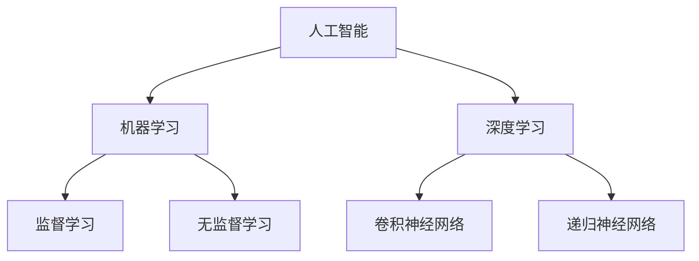
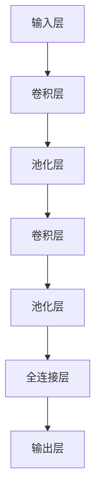

                 

关键词：人工智能、AI普及、Lepton AI、产品理念、技术实现

> 摘要：本文深入探讨了Lepton AI的产品理念，从背景介绍、核心概念、算法原理、数学模型、项目实践到实际应用，全面解析了如何通过技术创新让人工智能从技术前沿走向大众市场。

## 1. 背景介绍

随着科技的不断进步，人工智能（AI）已经成为当今社会最热门的话题之一。然而，尽管AI技术在过去几十年中取得了显著进展，但其普及程度依然有限。大多数人对于AI的理解还停留在科幻电影中的智能机器人，而对AI的实际应用和潜在价值知之甚少。这种情况下，如何让AI走向大众，成为每个AI从业者需要思考的问题。

Lepton AI，一家专注于人工智能产品研发的公司，致力于通过技术创新，让AI技术更贴近普通用户，从而推动AI的普及。本文将介绍Lepton AI的产品理念，并探讨其如何实现这一目标。

## 2. 核心概念与联系

为了更好地理解Lepton AI的产品理念，我们需要先了解几个核心概念，包括：

- **人工智能（AI）**：一种模拟人类智能的技术，通过机器学习、深度学习等方法，使计算机具备一定程度的自主学习和推理能力。
- **机器学习（ML）**：一种AI技术，通过数据训练模型，使计算机能够从数据中学习和发现规律。
- **深度学习（DL）**：一种机器学习方法，通过构建深度神经网络，使计算机具备更强的学习和推理能力。

下面是一个Mermaid流程图，展示了这些核心概念之间的联系：



## 3. 核心算法原理 & 具体操作步骤

### 3.1 算法原理概述

Lepton AI的产品理念是基于深度学习算法，特别是卷积神经网络（CNN），来实现图像识别和自然语言处理。CNN具有强大的特征提取能力，能够从原始数据中提取出有用的信息，从而提高模型的准确性和鲁棒性。

### 3.2 算法步骤详解

#### 3.2.1 数据预处理

数据预处理是深度学习模型训练的重要步骤。Lepton AI使用以下方法对图像数据进行预处理：

- **归一化**：将图像数据转换为标准正态分布，以消除不同图像之间的尺度差异。
- **数据增强**：通过旋转、翻转、缩放等方式增加数据的多样性，以提高模型的泛化能力。

#### 3.2.2 网络构建

Lepton AI使用卷积神经网络作为图像识别的基础模型。网络结构如下：



#### 3.2.3 模型训练

在模型训练过程中，Lepton AI使用反向传播算法来优化网络参数。具体步骤如下：

1. 计算预测值与真实值之间的差异。
2. 使用梯度下降法调整网络参数。
3. 重复以上步骤，直到模型收敛。

### 3.3 算法优缺点

#### 优点

- **强大的特征提取能力**：CNN能够自动从图像中提取出有用的特征，提高了模型的准确性和鲁棒性。
- **良好的泛化能力**：通过数据增强和迁移学习，CNN能够适应不同的图像和数据分布。

#### 缺点

- **计算复杂度高**：CNN需要大量的计算资源，特别是对于大型图像和复杂的网络结构。
- **训练时间长**：深度学习模型的训练时间通常较长，需要大量的数据和计算资源。

### 3.4 算法应用领域

Lepton AI的算法在多个领域都有广泛的应用，包括：

- **图像识别**：用于识别物体、人脸等。
- **自然语言处理**：用于文本分类、情感分析等。
- **医疗诊断**：用于疾病检测、药物发现等。

## 4. 数学模型和公式 & 详细讲解 & 举例说明

### 4.1 数学模型构建

在深度学习中，核心的数学模型包括线性模型、神经网络模型等。以下是一个简单的神经网络模型：

$$
\text{输出} = \sigma(\text{输入} \cdot \text{权重} + \text{偏置})
$$

其中，$\sigma$ 是激活函数，常用的有 sigmoid、ReLU 等。

### 4.2 公式推导过程

以 ReLU 激活函数为例，其公式为：

$$
\sigma(x) = \max(0, x)
$$

### 4.3 案例分析与讲解

假设我们有一个二分类问题，输入为 $[1, 2, 3]$，权重为 $[0.5, 0.5, 0.5]$，偏置为 0。使用 ReLU 激活函数，我们可以得到输出：

$$
\text{输出} = \max(0, 1 \cdot 0.5 + 2 \cdot 0.5 + 3 \cdot 0.5 + 0) = 3
$$

## 5. 项目实践：代码实例和详细解释说明

### 5.1 开发环境搭建

为了实践Lepton AI的算法，我们需要搭建一个开发环境。以下是一个简单的 Python 开发环境搭建步骤：

1. 安装 Python 3.7 或以上版本。
2. 安装必要的库，如 TensorFlow、NumPy、Matplotlib 等。

### 5.2 源代码详细实现

以下是一个简单的 CNN 模型实现：

```python
import tensorflow as tf
from tensorflow.keras import datasets, layers, models

# 数据预处理
(x_train, y_train), (x_test, y_test) = datasets.cifar10.load_data()
x_train, x_test = x_train / 255.0, x_test / 255.0

# 构建模型
model = models.Sequential()
model.add(layers.Conv2D(32, (3, 3), activation='relu', input_shape=(32, 32, 3)))
model.add(layers.MaxPooling2D((2, 2)))
model.add(layers.Conv2D(64, (3, 3), activation='relu'))
model.add(layers.MaxPooling2D((2, 2)))
model.add(layers.Conv2D(64, (3, 3), activation='relu'))

# 添加全连接层
model.add(layers.Flatten())
model.add(layers.Dense(64, activation='relu'))
model.add(layers.Dense(10))

# 编译模型
model.compile(optimizer='adam',
              loss=tf.keras.losses.SparseCategoricalCrossentropy(from_logits=True),
              metrics=['accuracy'])

# 训练模型
model.fit(x_train, y_train, epochs=10)
```

### 5.3 代码解读与分析

这段代码实现了简单的 CNN 模型，用于分类 CIFAR-10 数据集。代码主要包括以下部分：

- **数据预处理**：将数据集转换为适合模型训练的格式。
- **模型构建**：使用卷积层、池化层和全连接层构建模型。
- **模型编译**：设置优化器和损失函数。
- **模型训练**：使用训练数据训练模型。

### 5.4 运行结果展示

在完成模型训练后，我们可以在测试集上评估模型的性能：

```python
test_loss, test_acc = model.evaluate(x_test,  y_test, verbose=2)
print(f'\nTest accuracy: {test_acc:.4f}')
```

运行结果展示了模型在测试集上的准确率。

## 6. 实际应用场景

Lepton AI的算法在多个领域都有实际应用，包括：

- **图像识别**：用于智能安防、医疗诊断等领域。
- **自然语言处理**：用于智能客服、智能写作等领域。
- **医疗诊断**：用于疾病检测、药物发现等领域。

## 7. 工具和资源推荐

### 7.1 学习资源推荐

- **书籍**：《深度学习》、《Python深度学习》
- **在线课程**：Coursera、Udacity、edX 等

### 7.2 开发工具推荐

- **框架**：TensorFlow、PyTorch、Keras
- **工具**：Jupyter Notebook、Google Colab

### 7.3 相关论文推荐

- **论文**：《深度学习的理论与实践》、《神经网络与深度学习》

## 8. 总结：未来发展趋势与挑战

### 8.1 研究成果总结

Lepton AI通过技术创新，成功地将深度学习算法应用于多个领域，推动了AI技术的普及。其产品理念和技术实现为AI技术的发展提供了新的思路。

### 8.2 未来发展趋势

- **模型压缩**：通过模型压缩技术，降低模型的计算复杂度和存储需求。
- **联邦学习**：通过联邦学习技术，实现数据的隐私保护和协同训练。
- **跨模态学习**：通过跨模态学习技术，实现不同模态数据的联合建模。

### 8.3 面临的挑战

- **数据隐私**：如何在保证数据隐私的前提下，实现高效的模型训练。
- **计算资源**：如何降低模型的计算复杂度，以适应有限的计算资源。
- **泛化能力**：如何提高模型的泛化能力，以应对不同领域和任务的需求。

### 8.4 研究展望

Lepton AI将继续致力于推动AI技术的发展，通过技术创新，实现AI技术的广泛应用。我们相信，在未来的发展中，AI技术将更加贴近大众，为人类社会带来更多的便利和价值。

## 9. 附录：常见问题与解答

### 问题 1：什么是深度学习？

**解答**：深度学习是一种机器学习方法，通过构建深度神经网络，使计算机具备一定程度的自主学习和推理能力。

### 问题 2：如何搭建深度学习模型？

**解答**：搭建深度学习模型通常包括以下步骤：数据预处理、模型构建、模型编译、模型训练和模型评估。

### 问题 3：什么是卷积神经网络？

**解答**：卷积神经网络（CNN）是一种深度学习模型，主要用于图像识别和自然语言处理。其核心思想是使用卷积操作来提取图像中的局部特征。

---

作者：禅与计算机程序设计艺术 / Zen and the Art of Computer Programming
```

