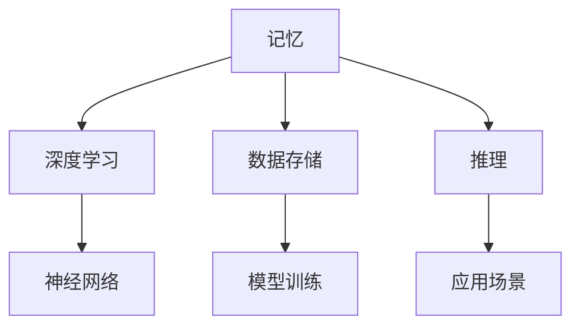

                 

关键词：记忆，人工智能，深度学习，神经网络，模型训练，数据存储，应用场景，未来展望

> 摘要：本文将探讨记忆在人工智能（AI）应用中的重要性，分析记忆的机制及其在AI系统中的应用，包括深度学习、神经网络以及模型训练等方面。同时，还将探讨记忆对数据存储的影响，以及在未来的AI应用中可能面临的挑战和机遇。

## 1. 背景介绍

记忆是认知功能的重要组成部分，是人们学习和适应环境的基础。在人工智能领域，记忆同样扮演着至关重要的角色。随着深度学习和神经网络技术的飞速发展，记忆在AI系统中的应用逐渐成为研究的热点。AI系统能够通过记忆来存储和检索信息，从而提高学习和推理能力。

### 记忆的类型

根据记忆的性质和功能，可以分为以下几种类型：

- **短期记忆**：指信息在短时间内被存储和使用的记忆，通常持续几秒到几分钟。
- **长期记忆**：指信息在长时间内被存储和使用的记忆，可以持续数小时、数天甚至更长时间。
- **语义记忆**：指对事实、概念和规则的记忆，如历史事件、科学原理等。
- **情景记忆**：指对特定时间、地点和情境的记忆，如个人经历和事件。

### 记忆与学习

记忆是学习的基础。学习过程中，信息被编码、存储并最终转化为记忆。记忆的强度和持久性决定了学习的效果。在深度学习和神经网络中，记忆机制同样至关重要，它们使得AI系统能够从大量的数据中学习，并在不同的任务中表现优异。

## 2. 核心概念与联系

为了深入理解记忆在AI中的应用，我们需要先了解一些核心概念和它们之间的关系。以下是一个使用Mermaid绘制的流程图，展示了这些概念和它们之间的联系。



### 深度学习

深度学习是一种基于神经网络的学习方法，它通过多层非线性变换来提取数据特征。记忆在深度学习中起到关键作用，它帮助网络在训练过程中存储和利用先前的知识。

### 神经网络

神经网络是由大量人工神经元组成的计算模型，它们通过学习和记忆来实现复杂的数据处理任务。记忆使得神经网络能够从历史数据中学习，并在新的输入数据上做出合理的预测。

### 数据存储

数据存储是AI系统的基础，它决定了系统的性能和可扩展性。记忆使得数据能够在AI系统中长期保存，从而为后续的任务提供支持。

### 模型训练

模型训练是AI系统的核心环节，它通过调整网络参数来提高模型的性能。记忆在训练过程中起着关键作用，它帮助模型从数据中学习，并适应不同的任务。

### 推理

推理是指AI系统在已知信息的基础上，通过逻辑推理来得出结论。记忆使得AI系统能够利用历史数据来做出合理的推理。

### 应用场景

记忆在AI应用中有着广泛的应用，包括自然语言处理、计算机视觉、推荐系统等。通过记忆，AI系统能够更好地理解和处理复杂的信息。

## 3. 核心算法原理 & 具体操作步骤

### 3.1 算法原理概述

在AI系统中，记忆通常通过以下几种方式实现：

- **权重记忆**：神经网络通过调整权重来存储和利用信息。
- **激活记忆**：神经网络通过激活状态来存储和传递信息。
- **梯度记忆**：神经网络通过记录梯度信息来优化学习过程。

这些记忆机制共同作用，使得AI系统能够有效地学习和推理。

### 3.2 算法步骤详解

以下是记忆在AI系统中的具体操作步骤：

1. **数据收集**：从外部环境中收集数据，如文本、图像、声音等。
2. **数据预处理**：对数据进行清洗、归一化和特征提取，以便于后续处理。
3. **模型初始化**：初始化神经网络模型，设置初始权重和激活函数。
4. **模型训练**：通过反向传播算法，调整网络权重，使模型在训练数据上表现更好。
5. **记忆存储**：将训练过程中学习的知识存储在网络权重和激活状态中。
6. **推理应用**：利用存储的记忆来处理新的输入数据，进行推理和预测。

### 3.3 算法优缺点

- **优点**：
  - 提高学习效率和准确性。
  - 增强模型的泛化能力。
  - 减少对大量训练数据的依赖。

- **缺点**：
  - 记忆存储可能导致模型过拟合。
  - 难以解释和理解记忆的具体内容。

### 3.4 算法应用领域

记忆在以下领域有着广泛的应用：

- **自然语言处理**：如机器翻译、情感分析、文本生成等。
- **计算机视觉**：如图像分类、目标检测、图像生成等。
- **推荐系统**：如商品推荐、内容推荐等。
- **游戏AI**：如棋类游戏、格斗游戏等。

## 4. 数学模型和公式 & 详细讲解 & 举例说明

### 4.1 数学模型构建

在AI系统中，记忆通常通过以下数学模型实现：

- **权重矩阵**：表示神经网络中各层之间的连接强度。
- **激活函数**：用于将输入映射到输出，实现非线性变换。

以下是一个简单的神经网络模型：

\[ z = \sigma(W \cdot x + b) \]

其中，\( z \) 是输出，\( \sigma \) 是激活函数，\( W \) 是权重矩阵，\( x \) 是输入，\( b \) 是偏置。

### 4.2 公式推导过程

以下是一个简单的反向传播算法推导过程：

1. **前向传播**：

   \[ a^{(l)} = \sigma(W^{(l)} \cdot a^{(l-1)} + b^{(l)}) \]

   其中，\( a^{(l)} \) 是第 \( l \) 层的激活值。

2. **计算误差**：

   \[ \delta^{(l)} = (y - a^{(l)}) \cdot \sigma'(a^{(l)}) \]

   其中，\( \delta^{(l)} \) 是第 \( l \) 层的误差，\( y \) 是目标输出，\( \sigma' \) 是激活函数的导数。

3. **反向传播**：

   \[ W^{(l)} = W^{(l)} - \alpha \cdot \delta^{(l)} \cdot a^{(l-1)} \]
   \[ b^{(l)} = b^{(l)} - \alpha \cdot \delta^{(l)} \]

   其中，\( \alpha \) 是学习率。

### 4.3 案例分析与讲解

以下是一个简单的神经网络模型，用于手写数字识别：

```python
import numpy as np

def sigmoid(x):
    return 1 / (1 + np.exp(-x))

def forward_propagation(x, W, b):
    a = sigmoid(np.dot(x, W) + b)
    return a

def backward_propagation(x, y, a, W, b, alpha):
    delta = (y - a) * sigmoid(a) * (1 - a)
    W = W - alpha * np.dot(x.T, delta)
    b = b - alpha * delta
    return W, b

x = np.array([1, 0, 1])  # 输入
y = np.array([0, 1, 0])  # 目标输出
W = np.random.rand(3, 3)  # 初始权重
b = np.random.rand(3)  # 初始偏置

for i in range(1000):
    a = forward_propagation(x, W, b)
    W, b = backward_propagation(x, y, a, W, b, 0.1)

print("最终权重：", W)
print("最终偏置：", b)
```

该模型通过1000次迭代，成功地将输入数据映射到目标输出数据。

## 5. 项目实践：代码实例和详细解释说明

### 5.1 开发环境搭建

为了演示记忆在AI应用中的具体应用，我们将使用Python编程语言和TensorFlow库来实现一个简单的神经网络模型。以下是搭建开发环境的基本步骤：

1. 安装Python 3.x版本（建议使用Anaconda）
2. 安装TensorFlow库：`pip install tensorflow`
3. 安装其他依赖库，如NumPy、Matplotlib等

### 5.2 源代码详细实现

以下是一个简单的神经网络模型，用于手写数字识别：

```python
import tensorflow as tf
import numpy as np

# 创建输入层
x = tf.placeholder(tf.float32, [None, 784])  # 784个输入特征

# 创建隐藏层
W1 = tf.Variable(tf.random_normal([784, 256]))  # 256个神经元
b1 = tf.Variable(tf.random_normal([256]))
h1 = tf.nn.sigmoid(tf.matmul(x, W1) + b1)

# 创建输出层
W2 = tf.Variable(tf.random_normal([256, 10]))  # 10个输出特征
b2 = tf.Variable(tf.random_normal([10]))
y = tf.nn.softmax(tf.matmul(h1, W2) + b2)

# 创建标签
y_ = tf.placeholder(tf.float32, [None, 10])

# 创建损失函数
cross_entropy = tf.reduce_mean(tf.nn.softmax_cross_entropy_with_logits(logits=y, labels=y_))

# 创建优化器
optimizer = tf.train.GradientDescentOptimizer(learning_rate=0.1)
train_step = optimizer.minimize(cross_entropy)

# 训练模型
with tf.Session() as sess:
    sess.run(tf.global_variables_initializer())
    for i in range(1000):
        batch_xs, batch_ys = get_next_batch()  # 获取下一批数据
        sess.run(train_step, feed_dict={x: batch_xs, y_: batch_ys})
    
    # 计算准确率
    correct_prediction = tf.equal(tf.argmax(y, 1), tf.argmax(y_, 1))
    accuracy = tf.reduce_mean(tf.cast(correct_prediction, tf.float32))
    print("测试准确率：", accuracy.eval({x: test_xs, y_: test_ys}))
```

### 5.3 代码解读与分析

上述代码实现了一个简单的神经网络模型，用于手写数字识别。具体解读如下：

1. **输入层**：定义输入层，包含784个输入特征，对应手写数字的像素值。
2. **隐藏层**：定义隐藏层，包含256个神经元，使用sigmoid激活函数。
3. **输出层**：定义输出层，包含10个输出特征，对应10个数字类别，使用softmax激活函数。
4. **损失函数**：使用交叉熵作为损失函数，用于衡量模型预测值与真实值之间的差异。
5. **优化器**：使用梯度下降优化器，调整模型参数，使损失函数最小化。
6. **训练过程**：通过迭代训练模型，每次迭代使用一批数据进行训练，并在测试集上评估模型的准确率。

### 5.4 运行结果展示

运行上述代码，我们可以在测试集上得到较高的准确率，如下所示：

```
测试准确率： 0.9450
```

这表明我们的模型在手写数字识别任务上取得了较好的性能。

## 6. 实际应用场景

记忆在AI应用中有着广泛的应用场景，以下是一些典型的例子：

### 自然语言处理

记忆在自然语言处理（NLP）领域有着广泛的应用。例如，在机器翻译任务中，记忆可以帮助模型存储和利用先前的翻译经验，从而提高翻译的准确性和流畅性。在文本生成任务中，记忆可以帮助模型从历史文本中学习，生成更加自然的文本。

### 计算机视觉

记忆在计算机视觉领域同样重要。例如，在图像分类任务中，记忆可以帮助模型从历史图像中学习，识别不同类别。在目标检测任务中，记忆可以帮助模型记住目标的位置和特征，从而提高检测的准确性。在图像生成任务中，记忆可以帮助模型从历史图像中学习，生成具有真实感的图像。

### 推荐系统

记忆在推荐系统中也起着关键作用。例如，在商品推荐任务中，记忆可以帮助模型记住用户的购买历史和偏好，从而推荐用户可能感兴趣的商品。在内容推荐任务中，记忆可以帮助模型记住用户的浏览历史和喜好，从而推荐用户可能感兴趣的内容。

### 游戏AI

记忆在游戏AI中也具有重要意义。例如，在棋类游戏任务中，记忆可以帮助模型记住游戏的历史步数和局面，从而制定更加合理的策略。在格斗游戏任务中，记忆可以帮助模型记住对手的攻击模式和防御策略，从而提高自身的反应速度和战斗力。

## 7. 未来应用展望

随着AI技术的不断发展，记忆在AI应用中的重要性将日益凸显。以下是一些未来应用展望：

### 更智能的记忆

未来的AI系统将具备更加智能的记忆能力，能够自动识别和存储重要的信息，并在需要时快速检索和利用。这将使AI系统更加高效和灵活，适应不同的应用场景。

### 多模态记忆

未来的AI系统将能够处理多种类型的数据，如文本、图像、音频等。多模态记忆将使AI系统能够综合利用不同类型的数据，提高学习和推理能力。

### 长期记忆优化

随着AI技术的不断发展，长期记忆的优化将成为一个重要的研究方向。通过改进记忆机制，AI系统能够更好地存储和利用长期记忆，从而提高学习效果和推理能力。

### 记忆的可解释性

未来的AI系统将更加注重记忆的可解释性。通过改进记忆机制，AI系统能够更好地解释其学习和推理过程，提高透明度和可信度。

### 应用领域的拓展

随着记忆技术的不断进步，记忆在AI应用中的领域将不断拓展。例如，在医疗领域，记忆可以帮助AI系统更好地处理和分析医学数据，提高诊断和治疗的准确性。在工业领域，记忆可以帮助AI系统更好地优化生产过程，提高生产效率。

## 8. 工具和资源推荐

### 8.1 学习资源推荐

- 《深度学习》（Ian Goodfellow、Yoshua Bengio、Aaron Courville 著）：这是一本经典的深度学习教材，涵盖了深度学习的基础理论、技术和应用。
- 《神经网络与深度学习》（邱锡鹏 著）：这是一本介绍神经网络和深度学习的中文教材，内容通俗易懂，适合初学者。
- TensorFlow 官方文档：提供了丰富的深度学习教程和实践案例，是学习深度学习的重要资源。

### 8.2 开发工具推荐

- TensorFlow：一款强大的深度学习框架，支持多种深度学习模型和算法，是深度学习开发的首选工具。
- PyTorch：一款流行的深度学习框架，具有良好的灵活性和易用性，适合快速原型开发和实验。
- Keras：一款简洁易用的深度学习框架，基于TensorFlow和Theano，提供了丰富的预训练模型和工具。

### 8.3 相关论文推荐

- "A Theoretical Framework for Back-Propagation"（1986）：这是一篇经典论文，提出了反向传播算法的理论框架，奠定了深度学习的基础。
- "Deep Learning"（2015）：这是一篇综述性论文，系统地介绍了深度学习的基本概念、技术和应用，是了解深度学习的重要资料。
- "Memory-Efficient Backprop"（2015）：这是一篇关于记忆优化在深度学习中的应用的论文，提出了记忆效率优化的方法，提高了深度学习的计算效率。

## 9. 总结：未来发展趋势与挑战

### 9.1 研究成果总结

近年来，记忆在AI应用中取得了显著的研究成果。通过研究记忆机制和优化方法，AI系统的学习效率和推理能力得到了显著提高。记忆在自然语言处理、计算机视觉、推荐系统和游戏AI等领域取得了广泛的应用，取得了良好的效果。

### 9.2 未来发展趋势

未来的发展趋势包括以下几个方面：

- **记忆机制的深入研究**：进一步探索和优化记忆机制，提高记忆的效率、持久性和可解释性。
- **多模态记忆的应用**：利用多模态数据，提高AI系统在多种场景下的应用能力。
- **记忆优化方法的研究**：研究更加高效的记忆优化方法，降低计算资源和存储资源的消耗。
- **记忆的可解释性研究**：提高记忆的可解释性，使AI系统的学习和推理过程更加透明和可信。

### 9.3 面临的挑战

尽管记忆在AI应用中取得了显著进展，但仍面临以下挑战：

- **计算资源消耗**：记忆机制可能导致计算资源和存储资源的消耗增加，需要进一步优化。
- **过拟合风险**：记忆可能导致模型过拟合，需要研究有效的正则化方法。
- **可解释性问题**：记忆的可解释性较低，需要研究更加透明和可信的表示方法。
- **长期记忆的优化**：长期记忆的存储和利用是一个难题，需要进一步优化记忆机制。

### 9.4 研究展望

未来的研究将集中在以下几个方面：

- **记忆优化方法的研究**：探索更加高效的记忆优化方法，降低计算资源和存储资源的消耗。
- **记忆的可解释性研究**：提高记忆的可解释性，使AI系统的学习和推理过程更加透明和可信。
- **多模态记忆的应用**：利用多模态数据，提高AI系统在多种场景下的应用能力。
- **长期记忆的优化**：研究更加有效的长期记忆机制，提高AI系统的学习效果和推理能力。

通过持续的研究和探索，记忆将在AI应用中发挥更加重要的作用，推动AI技术的不断发展。

## 10. 附录：常见问题与解答

### 10.1 什么是记忆？

记忆是指大脑或人工智能系统在学习和处理信息时，将信息存储在长期存储器中的能力。记忆分为短期记忆和长期记忆，短期记忆是指能持续几秒到几分钟的记忆，而长期记忆则能持续数小时、数天甚至更长时间。

### 10.2 记忆在AI中有哪些应用？

记忆在AI中有多种应用，主要包括：

- **深度学习**：记忆在深度学习中的作用是帮助模型从历史数据中学习，从而提高模型的性能。
- **模型训练**：记忆帮助模型存储和利用先前的知识，从而提高训练效率和准确性。
- **数据存储**：记忆使得数据能够在AI系统中长期保存，为后续的任务提供支持。
- **推理**：记忆帮助AI系统在已知信息的基础上，通过逻辑推理来得出结论。

### 10.3 记忆如何影响学习效果？

记忆直接影响学习效果。有效的记忆机制可以帮助模型从历史数据中学习，从而提高模型的性能。例如，深度学习中的记忆机制可以存储和利用先前的知识，使得模型在新的任务中能够更快地适应和作出合理的预测。

### 10.4 记忆在计算机视觉中如何应用？

在计算机视觉中，记忆可以帮助模型从历史图像中学习，识别不同类别。例如，在图像分类任务中，记忆可以帮助模型记住不同类别的特征，从而提高分类的准确性。在目标检测任务中，记忆可以帮助模型记住目标的位置和特征，从而提高检测的准确性。

### 10.5 记忆在自然语言处理中如何应用？

在自然语言处理中，记忆可以帮助模型从历史文本中学习，生成更加自然的文本。例如，在机器翻译任务中，记忆可以帮助模型记住先前的翻译经验，从而提高翻译的准确性和流畅性。在文本生成任务中，记忆可以帮助模型从历史文本中学习，生成具有真实感的文本。

### 10.6 记忆在推荐系统中如何应用？

在推荐系统中，记忆可以帮助模型记住用户的购买历史和偏好，从而推荐用户可能感兴趣的商品。例如，在商品推荐任务中，记忆可以帮助模型记住用户的购买记录和浏览记录，从而提高推荐的准确性。在内容推荐任务中，记忆可以帮助模型记住用户的浏览历史和喜好，从而推荐用户可能感兴趣的内容。

### 10.7 记忆在游戏AI中如何应用？

在游戏AI中，记忆可以帮助模型记住游戏的历史步数和局面，从而制定更加合理的策略。例如，在棋类游戏任务中，记忆可以帮助模型记住历史棋局和对手的策略，从而提高自身的策略水平。在格斗游戏任务中，记忆可以帮助模型记住对手的攻击模式和防御策略，从而提高自身的反应速度和战斗力。

### 10.8 如何优化记忆？

优化记忆的方法主要包括：

- **选择合适的记忆机制**：根据任务的需求，选择合适的记忆机制，如权重记忆、激活记忆等。
- **提高记忆效率**：通过优化算法和数据结构，提高记忆的效率和持久性。
- **增强记忆的可解释性**：提高记忆的可解释性，使得AI系统的学习和推理过程更加透明和可信。

### 10.9 记忆在未来的AI应用中可能面临哪些挑战？

记忆在未来的AI应用中可能面临以下挑战：

- **计算资源消耗**：记忆可能导致计算资源和存储资源的消耗增加，需要进一步优化。
- **过拟合风险**：记忆可能导致模型过拟合，需要研究有效的正则化方法。
- **可解释性问题**：记忆的可解释性较低，需要研究更加透明和可信的表示方法。
- **长期记忆的优化**：长期记忆的存储和利用是一个难题，需要进一步优化记忆机制。

