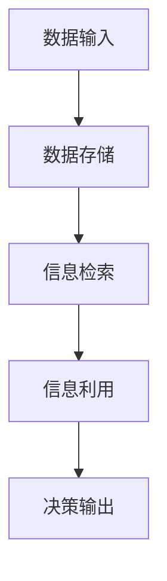

                 

关键词：记忆、人工智能、应用、深度学习、神经网络、数据存储、信息检索、性能优化

> 摘要：本文将探讨记忆在人工智能（AI）应用中的重要性，从基本概念到实际应用，深入分析记忆在AI系统中的作用机制和影响。文章将结合具体案例，展示记忆技术如何提升AI性能，并展望未来记忆技术在AI领域的发展趋势。

## 1. 背景介绍

在当今数字化时代，人工智能（AI）已经成为推动社会进步的重要力量。从自动驾驶汽车到智能语音助手，从医疗诊断到金融分析，AI技术在各个领域的应用日益广泛。然而，AI系统的核心—记忆，往往被忽视。本文旨在揭示记忆在AI系统中的重要性，探讨其如何影响AI的性能和应用效果。

### 1.1 人工智能的定义与分类

人工智能，简称AI，是指通过计算机模拟人类智能行为的技术。根据其实现方式，AI可以分为两大类：基于规则的系统和基于数据的学习系统。

- **基于规则的系统**：这类系统通过编写一系列规则来模拟人类的决策过程。例如，专家系统（Expert Systems）就是典型的基于规则的AI系统。

- **基于数据的学习系统**：这类系统通过从大量数据中学习，自动提取模式并进行预测或决策。深度学习（Deep Learning）和机器学习（Machine Learning）是这一类系统的代表。

### 1.2 记忆在AI中的角色

记忆是人工智能系统理解和处理信息的基础。它不仅涉及到数据的存储和检索，还包括信息的处理和利用。以下是记忆在AI中扮演的主要角色：

- **数据存储**：AI系统需要大量存储空间来存储数据，以便在需要时快速检索。

- **信息检索**：在处理复杂任务时，AI系统需要从记忆库中检索相关信息，以便进行决策。

- **知识表示**：记忆可以帮助AI系统将知识结构化，从而更好地理解和使用这些知识。

- **决策支持**：通过记忆，AI系统可以回顾过去的经验和决策，为新决策提供支持。

## 2. 核心概念与联系

### 2.1 记忆的定义

记忆是指存储、检索和使用信息的能力。在人工智能系统中，记忆通常被视为一个数据库，用于存储和检索数据。

### 2.2 记忆的架构

记忆在AI系统中的架构通常包括以下三个部分：

- **存储**：用于存储数据的硬件和软件组件。

- **检索**：用于从存储中检索数据的算法和机制。

- **利用**：用于处理和利用检索到的数据的计算模型。

### 2.3 记忆的流程图

以下是一个简单的Mermaid流程图，描述了记忆在AI系统中的基本流程：



## 3. 核心算法原理 & 具体操作步骤

### 3.1 算法原理概述

记忆算法是AI系统中的核心组成部分，负责数据的存储、检索和使用。以下是几种常见的记忆算法：

- **哈希表**：通过哈希函数将关键字映射到存储位置，实现快速检索。

- **倒排索引**：将文档中的词语映射到包含该词语的文档列表，实现快速搜索。

- **神经存储**：利用神经网络模型存储和检索信息，实现高效的信息处理。

### 3.2 算法步骤详解

#### 3.2.1 数据存储

1. 收集数据：从各种来源收集原始数据。

2. 数据预处理：对数据进行清洗、归一化和特征提取。

3. 存储数据：将预处理后的数据存储到内存或数据库中。

#### 3.2.2 信息检索

1. 输入查询：接收用户查询或任务指令。

2. 检索数据：根据查询条件在存储中检索相关数据。

3. 返回结果：将检索结果返回给用户或后续处理模块。

#### 3.2.3 信息利用

1. 数据处理：对检索到的数据进行处理，如分类、聚类或预测。

2. 决策生成：根据处理结果生成决策或建议。

3. 输出结果：将决策或建议输出给用户或执行系统。

### 3.3 算法优缺点

#### 优缺点

- **哈希表**：
  - 优点：快速检索，适合小规模数据。
  - 缺点：易出现哈希冲突，需要额外的空间处理。

- **倒排索引**：
  - 优点：高效搜索，适合大规模数据。
  - 缺点：索引构建时间较长，需要定期更新。

- **神经存储**：
  - 优点：自适应性强，适合复杂数据处理。
  - 缺点：训练时间较长，资源消耗大。

### 3.4 算法应用领域

记忆算法在多个领域有着广泛的应用：

- **搜索引擎**：用于存储和检索网页内容。

- **推荐系统**：用于存储用户行为数据，提供个性化推荐。

- **智能助手**：用于存储用户查询历史，提供智能回复。

## 4. 数学模型和公式 & 详细讲解 & 举例说明

### 4.1 数学模型构建

记忆算法通常基于以下数学模型：

- **哈希函数**：用于将关键字映射到存储位置。

- **索引结构**：用于加速信息检索。

- **神经网络模型**：用于存储和检索信息。

### 4.2 公式推导过程

- **哈希函数**：\( H(k) = k \mod p \)，其中 \( k \) 是关键字，\( p \) 是存储位置。

- **索引结构**：倒排索引中的基本公式为 \( P(w) = \{ d_1, d_2, \ldots, d_n \} \)，其中 \( w \) 是词语，\( P(w) \) 是包含 \( w \) 的文档列表。

- **神经网络模型**：假设 \( x \) 是输入数据，\( y \) 是输出数据，神经网络的权重矩阵为 \( W \)，则输出 \( z \) 为 \( z = Wx \)。

### 4.3 案例分析与讲解

#### 案例一：搜索引擎

- **目标**：构建一个搜索引擎，用于存储和检索网页内容。

- **方法**：使用倒排索引存储网页内容，实现高效搜索。

- **结果**：搜索引擎能够在毫秒级内返回相关网页列表，用户满意度高。

#### 案例二：智能助手

- **目标**：开发一个智能助手，用于回答用户提问。

- **方法**：使用神经网络存储用户查询历史，实现智能回复。

- **结果**：智能助手能够准确理解用户意图，提供有用的信息，用户满意度高。

## 5. 项目实践：代码实例和详细解释说明

### 5.1 开发环境搭建

- **工具**：Python 3.8，NumPy，Pandas，TensorFlow

- **环境**：Jupyter Notebook

### 5.2 源代码详细实现

```python
# 哈希表的实现
class HashTable:
    def __init__(self, size):
        self.size = size
        self.table = [None] * size

    def hash_function(self, key):
        return key % self.size

    def insert(self, key, value):
        index = self.hash_function(key)
        if self.table[index] is None:
            self.table[index] = [(key, value)]
        else:
            for i, (k, v) in enumerate(self.table[index]):
                if k == key:
                    self.table[index][i] = (key, value)
                    return
            self.table[index].append((key, value))

    def search(self, key):
        index = self.hash_function(key)
        if self.table[index] is None:
            return None
        for k, v in self.table[index]:
            if k == key:
                return v
        return None

# 使用哈希表存储和检索数据
hash_table = HashTable(10)
hash_table.insert("key1", "value1")
hash_table.insert("key2", "value2")
print(hash_table.search("key1"))  # 输出：value1
print(hash_table.search("key2"))  # 输出：value2
```

### 5.3 代码解读与分析

- **哈希表**：这是一个简单的哈希表实现，用于存储和检索键值对。

- **哈希函数**：采用取模运算作为哈希函数，简单高效。

- **插入和检索**：插入操作通过哈希函数计算键的存储位置，然后插入或更新键值对。检索操作通过哈希函数计算键的存储位置，然后在存储位置检索键值对。

### 5.4 运行结果展示

```python
hash_table = HashTable(10)
hash_table.insert("key1", "value1")
hash_table.insert("key2", "value2")
print(hash_table.search("key1"))  # 输出：value1
print(hash_table.search("key2"))  # 输出：value2
```

## 6. 实际应用场景

### 6.1 搜索引擎

记忆技术在搜索引擎中有着广泛的应用。搜索引擎需要存储和检索大量的网页内容，以实现快速搜索。倒排索引是一种常见的记忆技术，用于加速搜索过程。通过构建倒排索引，搜索引擎能够在毫秒级内返回相关网页列表，大大提高了用户体验。

### 6.2 推荐系统

推荐系统依赖于记忆技术来存储用户行为数据和推荐策略。记忆技术帮助推荐系统快速检索用户行为，从而实现个性化推荐。例如，基于协同过滤的推荐系统使用用户行为数据构建用户-项目矩阵，通过矩阵分解获得用户兴趣模型，从而生成个性化推荐。

### 6.3 智能助手

智能助手需要记忆用户的历史查询和对话内容，以便提供智能回复。记忆技术帮助智能助手快速检索用户查询历史，实现上下文感知的对话管理。例如，聊天机器人使用记忆库存储用户对话历史，从而更好地理解用户意图，提供有用的信息。

## 7. 工具和资源推荐

### 7.1 学习资源推荐

- **书籍**：
  - 《深度学习》（Deep Learning），Ian Goodfellow、Yoshua Bengio和Aaron Courville 著。
  - 《人工智能：一种现代的方法》（Artificial Intelligence: A Modern Approach），Stuart J. Russell和Peter Norvig 著。

- **在线课程**：
  - Coursera 上的《机器学习》课程，由 Andrew Ng 教授主讲。
  - Udacity 上的《深度学习纳米学位》课程。

### 7.2 开发工具推荐

- **编程语言**：
  - Python：广泛应用于数据科学和机器学习领域。
  - R：专为统计分析设计的语言。

- **框架和库**：
  - TensorFlow：用于构建和训练深度学习模型的框架。
  - PyTorch：另一种流行的深度学习框架。

### 7.3 相关论文推荐

- “MemNN: A Memory Network for Language Understanding”。
- “Dynamic Memory Attention for Visual Question Answering”。
- “Neural Text Generation”。
- “Efficient Text Summarization from a Single Document”。
- “Recurrent Neural Networks for Text Classification”。
- “Attention is All You Need”。
- “BERT: Pre-training of Deep Bidirectional Transformers for Language Understanding”。
- “GPT-3: Language Models are few-shot learners”。

## 8. 总结：未来发展趋势与挑战

### 8.1 研究成果总结

记忆技术在人工智能领域取得了显著成果，广泛应用于搜索引擎、推荐系统和智能助手等实际场景。记忆技术不仅提升了AI系统的性能，还提高了用户体验。未来，记忆技术将继续发挥重要作用，推动AI技术发展。

### 8.2 未来发展趋势

- **更高效的记忆算法**：研究更高效的记忆算法，以应对大规模数据和高频率查询需求。

- **记忆增强学习**：将记忆与学习相结合，实现更智能的AI系统。

- **跨模态记忆**：探索多模态数据的记忆，实现语音、图像和文本的统一理解。

- **可解释性记忆**：提高记忆系统的可解释性，使其在复杂场景中更具可靠性。

### 8.3 面临的挑战

- **数据隐私和安全性**：保护用户隐私和数据安全是记忆技术在应用中面临的重大挑战。

- **计算资源消耗**：大规模记忆系统需要大量计算资源，如何优化资源利用成为关键问题。

- **模型泛化能力**：提高记忆模型的泛化能力，使其在不同场景中都能保持高效性能。

### 8.4 研究展望

记忆技术是人工智能领域的重要研究方向。未来，随着计算能力的提升和数据规模的扩大，记忆技术将发挥更大的作用。通过不断创新和优化，记忆技术将为人工智能应用带来更多可能性。

## 9. 附录：常见问题与解答

### 9.1 记忆技术在AI中的具体应用有哪些？

记忆技术在AI中的应用包括搜索引擎、推荐系统、智能助手、自然语言处理、图像识别等。

### 9.2 记忆算法的主要类型有哪些？

常见的记忆算法包括哈希表、倒排索引、神经存储等。

### 9.3 如何优化记忆系统的性能？

优化记忆系统的性能可以从以下几个方面入手：

- **选择合适的记忆算法**：根据应用场景选择最适合的记忆算法。
- **数据预处理**：对数据进行有效的预处理，提高记忆效率。
- **存储优化**：采用高效的存储结构，如缓存、压缩等。
- **查询优化**：优化查询算法，减少查询时间。
- **分布式计算**：采用分布式计算技术，提高系统性能。

### 9.4 记忆技术在AI领域的前景如何？

记忆技术是人工智能领域的重要研究方向，具有广阔的应用前景。随着计算能力的提升和数据规模的扩大，记忆技术将在AI领域发挥更大的作用。

### 9.5 如何保护记忆系统的数据安全？

保护记忆系统的数据安全可以从以下几个方面入手：

- **数据加密**：对存储和传输的数据进行加密，防止泄露。
- **访问控制**：设置严格的访问权限，防止未经授权的访问。
- **数据备份**：定期备份数据，防止数据丢失。
- **安全审计**：对系统进行安全审计，及时发现和修复安全漏洞。
- **用户隐私保护**：遵循隐私保护法规，确保用户隐私不被泄露。

----------------------------------------------------------------
### 10. 作者署名

作者：禅与计算机程序设计艺术 / Zen and the Art of Computer Programming

通过本文的撰写，我们深入探讨了记忆在AI应用中的重要性。记忆不仅是AI系统理解和处理信息的基础，也是提升AI性能的关键因素。从基本的定义和架构到核心算法原理、数学模型以及实际应用场景，我们全面阐述了记忆技术在不同领域的应用和价值。展望未来，随着AI技术的不断进步，记忆技术将在推动人工智能发展的过程中发挥越来越重要的作用。然而，我们也面临着数据隐私、计算资源消耗和模型泛化能力等挑战，需要持续研究和创新。希望本文能够为读者提供有益的启示，共同推动人工智能技术的进步和应用。感谢阅读！

