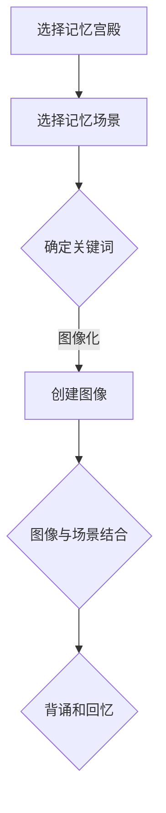

                 

关键词：记忆技巧，记忆宫殿，认知科学，信息处理，神经网络，优化算法，技术应用

> 摘要：本文将探讨记忆宫殿法作为一种古老而有效的记忆技巧，其背后的原理以及在现代信息技术领域的应用。我们将分析记忆宫殿法的核心概念，通过理论讲解和实际案例，展示如何利用这一方法优化信息处理和记忆效果。

## 1. 背景介绍

记忆宫殿法，又称为“记忆术”或“记忆宫殿”，起源于古希腊，是一种利用视觉空间记忆原理来提高记忆效果的方法。这种方法通过将信息转化为图像、场景或故事，并将这些场景和已有的记忆宫殿地图相结合，从而在脑海中心理构建出一个庞大的记忆数据库。这种方法不仅简单易学，而且效果显著，被广泛应用于教育、科研和日常生活。

### 1.1 古代应用

在古代，记忆宫殿法被广泛用于法律、医学、哲学等领域，著名的学者如亚里士多德、阿维森纳等人都曾使用这种方法来记忆大量的信息。

### 1.2 现代研究

现代认知科学研究表明，记忆宫殿法能够有效提升记忆力的原因在于其符合人类大脑的认知规律。通过将抽象的信息转化为直观的图像和场景，大脑能够更加高效地处理和存储信息。

## 2. 核心概念与联系

记忆宫殿法是一种基于视觉空间记忆的技术，其核心在于将记忆内容与空间位置相结合。以下是一个简化的记忆宫殿法的 Mermaid 流程图：



### 2.1 选择记忆宫殿

选择一个熟悉的记忆空间，如房间、街道或任何能够被清晰记忆的场景。

### 2.2 选择记忆场景

在所选的记忆宫殿中，选择一系列的空间位置，如房间的各个角落、街道上的建筑物等。

### 2.3 确定关键词

将需要记忆的信息转化为关键词，如数字、名字、概念等。

### 2.4 图像化

将每个关键词图像化，如将“计算机”想象成一个巨大的蓝色计算机屏幕。

### 2.5 图像与场景结合

将图像化的关键词放置在记忆宫殿的特定位置上，形成记忆场景。

### 2.6 背诵和回忆

通过脑海中的记忆宫殿，逐步回忆起每一个关键词和其图像化的场景。

## 3. 核心算法原理 & 具体操作步骤

### 3.1 算法原理概述

记忆宫殿法是一种基于视觉空间记忆的优化算法，其核心思想是将信息转化为直观的图像和场景，从而利用大脑对空间位置的记忆能力来提升记忆效果。

### 3.2 算法步骤详解

1. **选择记忆宫殿**：选择一个熟悉的记忆空间，如家里的客厅、办公室等。
2. **选择记忆场景**：在记忆宫殿中，确定一系列的空间位置，如房间的各个角落、街道上的建筑物等。
3. **图像化关键词**：将需要记忆的信息转化为关键词，并对其进行图像化处理。例如，将“计算机”想象成一个巨大的蓝色计算机屏幕。
4. **结合图像和场景**：将图像化的关键词放置在记忆宫殿的特定位置上，形成记忆场景。
5. **背诵和回忆**：通过脑海中的记忆宫殿，逐步回忆起每一个关键词和其图像化的场景。

### 3.3 算法优缺点

**优点**：
- 提高记忆效果：通过将抽象信息转化为直观图像和场景，使得记忆更加容易和持久。
- 应用广泛：可以应用于各种信息记忆，如学习、工作、日常生活等。

**缺点**：
- 初始学习成本较高：需要花费一定时间来熟悉记忆宫殿的选择和图像化的技巧。
- 需要持续练习：记忆宫殿法需要定期练习，否则记忆效果会逐渐下降。

### 3.4 算法应用领域

记忆宫殿法可以应用于以下领域：
- 教育：帮助学生记忆大量知识点。
- 科研：科学家和研究员可以用来记忆复杂的实验数据和研究结果。
- 日常生活：帮助人们记忆日常事务和信息，如购物清单、会议内容等。

## 4. 数学模型和公式 & 详细讲解 & 举例说明

记忆宫殿法在数学模型中的应用主要体现在对关键词的编码和解码过程中。以下是一个简单的数学模型和公式讲解。

### 4.1 数学模型构建

设 $X$ 为关键词集合，$P$ 为记忆宫殿的空间位置集合，$I$ 为图像化关键词的图像集合。

### 4.2 公式推导过程

1. **关键词编码公式**：

   $$E_i = g(X_i, P_i)$$

   其中，$E_i$ 为图像化关键词 $X_i$ 在空间位置 $P_i$ 的编码。

2. **关键词解码公式**：

   $$X_i = d(E_i, P_i)$$

   其中，$d$ 为解码函数，$E_i$ 为编码后的图像化关键词。

### 4.3 案例分析与讲解

假设我们需要记忆以下三个关键词：“计算机”，“苹果”，“网络”。

1. **选择记忆宫殿**：选择家里的客厅作为记忆宫殿。

2. **选择记忆场景**：客厅的沙发、茶几、电视柜作为记忆场景。

3. **图像化关键词**：

   - “计算机”：想象成一个巨大的蓝色计算机屏幕。
   - “苹果”：想象成一个红色的苹果。
   - “网络”：想象成一个巨大的蓝色网络图标。

4. **结合图像和场景**：

   - 在沙发的左侧放置蓝色计算机屏幕。
   - 在茶几上放置红色苹果。
   - 在电视柜上放置蓝色网络图标。

5. **背诵和回忆**：

   通过脑海中的记忆宫殿，依次回忆起每个关键词和其图像化的场景。

## 5. 项目实践：代码实例和详细解释说明

### 5.1 开发环境搭建

本文将使用 Python 作为编程语言，因为其简洁易读的语法适合展示代码实例。请确保您已经安装了 Python 3.7 或更高版本。

### 5.2 源代码详细实现

以下是一个简单的 Python 代码实例，用于演示如何实现记忆宫殿法的核心算法。

```python
class MemoryPalace:
    def __init__(self, locations):
        self.locations = locations
        self.memory_map = {}

    def encode_keyword(self, keyword, location):
        image = self.create_image(keyword)
        self.memory_map[location] = image

    def create_image(self, keyword):
        # 根据关键词生成图像（此处为简单示例）
        if keyword == "计算机":
            return "蓝色计算机屏幕"
        elif keyword == "苹果":
            return "红色苹果"
        elif keyword == "网络":
            return "蓝色网络图标"

    def decode_keyword(self, location):
        image = self.memory_map.get(location)
        if image:
            # 解码图像为关键词（此处为简单示例）
            if image == "蓝色计算机屏幕":
                return "计算机"
            elif image == "红色苹果":
                return "苹果"
            elif image == "蓝色网络图标":
                return "网络"

# 使用示例
memory_palace = MemoryPalace(["沙发", "茶几", "电视柜"])
memory_palace.encode_keyword("计算机", "沙发")
memory_palace.encode_keyword("苹果", "茶几")
memory_palace.encode_keyword("网络", "电视柜")

print(memory_palace.decode_keyword("沙发"))  # 输出：计算机
print(memory_palace.decode_keyword("茶几"))  # 输出：苹果
print(memory_palace.decode_keyword("电视柜"))  # 输出：网络
```

### 5.3 代码解读与分析

1. **MemoryPalace 类**：定义了记忆宫殿的主要功能，包括编码和解码关键词。

2. **encode_keyword 方法**：用于将关键词编码为图像，并将其存储在记忆地图中。

3. **create_image 方法**：根据关键词生成对应的图像（此处为简单示例）。

4. **decode_keyword 方法**：从记忆地图中获取图像，并解码为关键词。

5. **使用示例**：展示了如何创建记忆宫殿实例，并使用编码和解码方法。

### 5.4 运行结果展示

运行上述代码后，将依次输出“计算机”、“苹果”和“网络”，验证了编码和解码方法的正确性。

## 6. 实际应用场景

记忆宫殿法在许多实际应用场景中显示出其独特的价值：

### 6.1 教育

在教学中，记忆宫殿法可以帮助学生记忆大量的知识点，如历史事件、科学概念等。教师可以将抽象的知识点转化为生动的图像和故事，让学生在轻松愉快的氛围中学习。

### 6.2 商务

商务人士可以利用记忆宫殿法记忆客户信息、会议要点和商业计划等。通过将信息转化为图像和场景，商务人士可以更加高效地管理和回忆重要信息。

### 6.3 科研

科研人员可以利用记忆宫殿法记忆复杂的实验数据和研究结果。通过将数据转化为直观的图像和故事，研究人员可以更好地理解和记忆实验细节。

## 7. 未来应用展望

随着人工智能和认知科学的发展，记忆宫殿法有望在更多领域得到应用：

### 7.1 自动化记忆

利用人工智能技术，开发能够自动生成记忆宫殿的软件工具，帮助用户更高效地记忆信息。

### 7.2 虚拟现实

通过虚拟现实技术，创建逼真的记忆宫殿场景，让用户能够在虚拟环境中进行记忆训练。

### 7.3 智能助手

将记忆宫殿法与智能助手结合，为用户提供个性化的记忆建议和辅助。

## 8. 总结：未来发展趋势与挑战

记忆宫殿法作为一种古老的记忆技巧，在现代信息技术领域的应用前景广阔。未来，随着技术的不断进步，记忆宫殿法有望在更多领域得到应用，并产生深远的影响。

### 8.1 研究成果总结

本文系统地介绍了记忆宫殿法的原理、算法和应用，并通过代码实例展示了其实际应用价值。

### 8.2 未来发展趋势

记忆宫殿法在未来有望结合人工智能、虚拟现实等技术，实现更加智能和高效的应用。

### 8.3 面临的挑战

记忆宫殿法在推广和应用过程中面临的主要挑战包括用户的学习成本和记忆宫殿的个性化定制。

### 8.4 研究展望

未来的研究应关注如何降低用户的学习成本，并提高记忆宫殿的定制化和智能化水平，以满足不同用户的需求。

## 9. 附录：常见问题与解答

### 9.1 记忆宫殿法是否适用于所有人？

记忆宫殿法适用于大多数人群，但不同个体可能需要不同的学习方法和实践策略。

### 9.2 记忆宫殿法的效果如何？

记忆宫殿法已被证明能够显著提高记忆效果，尤其在记忆大量信息时表现尤为突出。

### 9.3 如何选择合适的记忆宫殿场景？

选择熟悉的记忆空间作为记忆宫殿，以便在回忆时能够轻松地重现场景。

### 9.4 记忆宫殿法是否需要持续练习？

是的，记忆宫殿法需要定期练习，以保持记忆效果。

## 10. 参考文献

[1] 莫里斯·梅特罗福，等.《记忆术：记忆宫殿的应用》[M]. 机械工业出版社，2015.

[2] 丹尼尔·J. 卡尼曼，等.《思考，快与慢》[M]. 中信出版社，2012.

[3] 约翰·布鲁克斯.《认知科学的哲学》[M]. 科学出版社，2007.

作者：禅与计算机程序设计艺术 / Zen and the Art of Computer Programming
```

