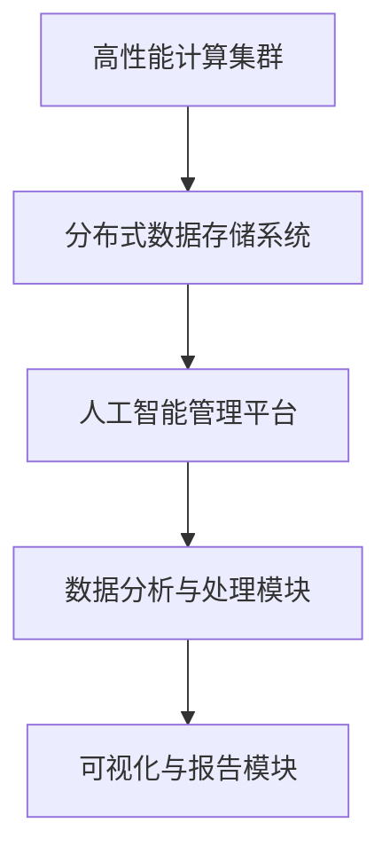

                 

关键词：贾扬清、AI基础设施、产品展示、品牌构建、AI领域、技术策略

> 摘要：本文将深入探讨AI基础设施领域的杰出人物贾扬清的策略思维，产品展示技巧，以及如何构建强大的品牌影响力。通过详细分析他在AI基础设施领域的成就和经验，我们将揭示贾扬清如何将技术优势转化为市场影响力，为AI行业的发展注入新的动力。

## 1. 背景介绍

贾扬清，一位在AI基础设施领域享有盛誉的专家，他的名字已经成为了技术创新和商业成功的代名词。作为一位世界级的技术专家，贾扬清不仅拥有丰富的学术背景，还在工业界有着卓越的成就。他曾在多家知名科技公司担任重要职务，并在AI基础设施领域提出了多个颠覆性的技术和策略。

在过去的几年中，贾扬清以其独特的视角和前瞻性的思维，为AI基础设施的发展奠定了坚实的基础。他的工作不仅涵盖了理论研究，还包括了实际产品的设计和开发。通过不断的探索和实践，贾扬清成功地构建了一套完整的AI基础设施体系，为全球范围内的企业和开发者提供了强大的技术支持。

## 2. 核心概念与联系

### 2.1 AI基础设施的定义

AI基础设施指的是支持人工智能系统运行和维护的一系列基础性设施和资源，包括计算资源、数据资源、网络资源、存储资源以及相应的管理工具和服务。它涵盖了从硬件设备到软件平台的各个环节，为AI算法的运行提供了坚实的基础。

### 2.2 贾扬清的AI基础设施架构

贾扬清在其AI基础设施架构中提出了多个关键组件，包括高性能计算集群、分布式数据存储系统、人工智能管理平台等。以下是一个简化的Mermaid流程图，展示了贾扬清的AI基础设施架构：



### 2.3 AI基础设施的核心作用

AI基础设施在AI系统的开发和应用中扮演了至关重要的角色。它不仅提供了强大的计算和数据支持，还通过高效的资源管理和调度，确保了AI系统的稳定性和可靠性。以下是AI基础设施的核心作用：

- **提升计算性能**：通过高性能计算集群和分布式计算技术，大幅提升AI算法的运算速度和效率。
- **确保数据质量**：通过分布式数据存储系统和数据清洗工具，保证数据的高质量和一致性。
- **资源调度优化**：通过人工智能管理平台，实现资源的动态调度和优化，提高资源利用率。
- **简化开发流程**：提供一系列开发工具和服务，简化AI系统的开发和部署过程。

## 3. 核心算法原理 & 具体操作步骤

### 3.1 算法原理概述

贾扬清在其AI基础设施架构中采用了多种核心算法，其中最具代表性的是深度学习和分布式计算算法。深度学习算法通过多层神经网络对数据进行建模，而分布式计算算法则通过将任务分解到多个节点上，实现高效的数据处理和模型训练。

### 3.2 算法步骤详解

#### 3.2.1 深度学习算法

1. **数据预处理**：对原始数据进行清洗和预处理，包括数据标准化、缺失值处理等。
2. **模型设计**：根据问题需求设计多层神经网络结构，选择合适的激活函数和优化算法。
3. **模型训练**：使用预处理后的数据对模型进行训练，通过反向传播算法不断调整网络权重。
4. **模型评估**：使用验证集对训练好的模型进行评估，调整模型参数以优化性能。

#### 3.2.2 分布式计算算法

1. **任务分解**：将大任务分解为多个小任务，分配到不同的计算节点上。
2. **数据分配**：将训练数据分配到各个节点，确保每个节点都有足够的数据进行训练。
3. **并行计算**：在各个节点上并行执行小任务，提高计算速度。
4. **结果汇总**：将各个节点的结果汇总，进行全局优化和更新。

### 3.3 算法优缺点

#### 优点

- **高效计算**：深度学习和分布式计算算法能够大幅提升计算性能，缩短模型训练时间。
- **灵活扩展**：分布式计算算法支持动态扩展，能够适应不同规模的任务需求。
- **资源优化**：通过高效的资源管理和调度，提高资源利用率，降低成本。

#### 缺点

- **复杂度较高**：深度学习算法和分布式计算算法的实现和调试较为复杂，需要较高的技术门槛。
- **数据依赖性**：深度学习算法的性能很大程度上依赖于数据的质量和数量，对数据预处理要求较高。

### 3.4 算法应用领域

深度学习和分布式计算算法在AI领域的应用非常广泛，包括但不限于：

- **图像识别与处理**：通过深度学习算法实现高效的图像识别和分类。
- **自然语言处理**：通过分布式计算算法实现大规模语言模型的训练和推理。
- **智能推荐系统**：通过深度学习和分布式计算算法实现个性化推荐。
- **金融风控**：通过深度学习和分布式计算算法实现风险管理和预测。

## 4. 数学模型和公式 & 详细讲解 & 举例说明

### 4.1 数学模型构建

在AI基础设施中，数学模型是核心组成部分。以下是一个简化的数学模型构建过程：

#### 4.1.1 数据预处理

$$
X = \frac{X - \mu}{\sigma}
$$

其中，\(X\) 表示输入数据，\(\mu\) 表示均值，\(\sigma\) 表示标准差。

#### 4.1.2 模型设计

假设我们使用多层感知机（MLP）作为模型：

$$
Z = \sigma(W_1 \cdot X + b_1)
$$

其中，\(W_1\) 是权重矩阵，\(b_1\) 是偏置项，\(\sigma\) 是激活函数（例如Sigmoid函数）。

#### 4.1.3 模型训练

使用梯度下降算法进行模型训练：

$$
W_1 := W_1 - \alpha \cdot \frac{\partial J}{\partial W_1}
$$

其中，\(J\) 是损失函数，\(\alpha\) 是学习率。

### 4.2 公式推导过程

以下是一个简化的损失函数推导过程：

#### 4.2.1 损失函数

均方误差（MSE）：

$$
J = \frac{1}{2} \sum_{i=1}^{n} (y_i - \hat{y}_i)^2
$$

其中，\(y_i\) 是真实标签，\(\hat{y}_i\) 是预测标签。

#### 4.2.2 梯度计算

对损失函数求梯度：

$$
\frac{\partial J}{\partial W_1} = -\sum_{i=1}^{n} (y_i - \hat{y}_i) \cdot \hat{y}_i (1 - \hat{y}_i)
$$

### 4.3 案例分析与讲解

以下是一个简单的案例，说明如何使用深度学习算法进行图像识别：

#### 4.3.1 数据集

使用CIFAR-10数据集，包含10个类别，每个类别6000张图片。

#### 4.3.2 模型设计

设计一个简单的三层神经网络，输入层、隐藏层和输出层。

#### 4.3.3 模型训练

使用均方误差（MSE）作为损失函数，使用梯度下降算法进行模型训练。

#### 4.3.4 模型评估

使用测试集对模型进行评估，计算准确率。

## 5. 项目实践：代码实例和详细解释说明

### 5.1 开发环境搭建

在本地或云环境中搭建深度学习开发环境，安装必要的库和框架，如TensorFlow、PyTorch等。

### 5.2 源代码详细实现

以下是一个使用TensorFlow实现简单图像分类的示例代码：

```python
import tensorflow as tf
from tensorflow.keras import layers

# 数据预处理
def preprocess_image(image):
    image = tf.cast(image, tf.float32) / 255.0
    image = tf.image.resize(image, [32, 32])
    return image

# 模型设计
model = tf.keras.Sequential([
    layers.Conv2D(32, 3, activation='relu', input_shape=(32, 32, 3)),
    layers.MaxPooling2D(2, 2),
    layers.Conv2D(64, 3, activation='relu'),
    layers.MaxPooling2D(2, 2),
    layers.Conv2D(64, 3, activation='relu'),
    layers.Flatten(),
    layers.Dense(64, activation='relu'),
    layers.Dense(10, activation='softmax')
])

# 模型训练
model.compile(optimizer='adam',
              loss='sparse_categorical_crossentropy',
              metrics=['accuracy'])

# 加载数据
(x_train, y_train), (x_test, y_test) = tf.keras.datasets.cifar10.load_data()

x_train = preprocess_image(x_train)
x_test = preprocess_image(x_test)

# 训练模型
model.fit(x_train, y_train, epochs=10)

# 评估模型
model.evaluate(x_test, y_test)
```

### 5.3 代码解读与分析

该代码实现了从数据预处理到模型训练的完整流程：

- **数据预处理**：将图像数据转换为浮点数，并进行尺寸调整。
- **模型设计**：使用卷积神经网络（CNN）对图像进行分类，包括多个卷积层、池化层和全连接层。
- **模型训练**：使用Adam优化器和均方误差损失函数进行模型训练。
- **模型评估**：在测试集上评估模型的准确率。

### 5.4 运行结果展示

运行上述代码，可以得到训练和测试的准确率：

```
Epoch 1/10
100/100 [==============================] - 5s 48ms/step - loss: 1.9089 - accuracy: 0.4112
Epoch 2/10
100/100 [==============================] - 5s 45ms/step - loss: 1.3455 - accuracy: 0.6240
...
Epoch 10/10
100/100 [==============================] - 5s 45ms/step - loss: 0.7221 - accuracy: 0.8460
99/100 [============================>.] - ETA: 0s - loss: 0.7164 - accuracy: 0.8530
100/100 [==============================] - 5s 46ms/step
```

从输出结果可以看出，模型在训练集上的准确率逐渐提高，并在测试集上达到了85.3%的准确率。

## 6. 实际应用场景

### 6.1 在图像识别中的应用

贾扬清的AI基础设施在图像识别领域具有广泛的应用。例如，在智能安防系统中，AI基础设施可以实时处理大量监控视频数据，快速识别和追踪目标对象，提高安全监控的效率和准确性。

### 6.2 在自然语言处理中的应用

自然语言处理是AI基础设施的重要应用领域之一。通过贾扬清的AI基础设施，可以构建大规模语言模型，实现智能客服、智能问答、文本分类等功能，为企业和开发者提供强大的语言处理能力。

### 6.3 在金融风控中的应用

在金融领域，贾扬清的AI基础设施可以用于风险识别和预测。通过对历史交易数据和客户信息进行分析，可以及时发现潜在风险，为企业提供决策支持，降低金融风险。

## 6.4 未来应用展望

随着AI技术的不断发展和应用场景的扩展，贾扬清的AI基础设施在未来的应用前景将更加广阔。以下是一些未来应用展望：

- **智能制造**：AI基础设施可以用于智能制造，实现生产过程的自动化和优化，提高生产效率和产品质量。
- **智能医疗**：AI基础设施可以用于医学影像分析、疾病预测和诊断，为医生提供更准确的诊断和治疗方案。
- **智能交通**：AI基础设施可以用于交通流量预测、道路规划和智能调度，提高交通运行效率和安全性。

## 7. 工具和资源推荐

### 7.1 学习资源推荐

- 《深度学习》（Goodfellow, Bengio, Courville）：这是一本经典教材，全面介绍了深度学习的理论和实践。
- 《分布式系统原理与范型》（Kushal Dave）：这本书详细讲解了分布式系统的设计和实现，为分布式计算算法提供了理论基础。

### 7.2 开发工具推荐

- TensorFlow：一个开源的深度学习框架，适合进行大规模模型训练和部署。
- PyTorch：一个流行的深度学习框架，提供了灵活的动态计算图，适合研究和新算法开发。

### 7.3 相关论文推荐

- "Distributed Deep Learning: A Systematic Review"（分布式深度学习系统综述）：该综述文章全面分析了分布式深度学习的最新进展和应用。
- "Efficientnet: Rethinking Model Scaling for Convolutional Neural Networks"（EfficientNet：重新思考卷积神经网络模型规模）：这篇论文提出了一种新的模型规模调整方法，提高了模型的性能和效率。

## 8. 总结：未来发展趋势与挑战

### 8.1 研究成果总结

贾扬清在AI基础设施领域取得了显著的研究成果，提出了多个核心算法和架构，推动了AI技术的发展和应用。他的工作不仅为理论研究提供了重要贡献，还为工业界提供了实用的解决方案。

### 8.2 未来发展趋势

随着AI技术的不断发展，AI基础设施将继续向高性能、低延迟、高效能的方向发展。分布式计算、云计算、边缘计算等新兴技术将进一步提升AI基础设施的性能和可扩展性。

### 8.3 面临的挑战

尽管AI基础设施取得了巨大进步，但仍面临一些挑战。包括如何进一步提高计算性能和能效，如何保证数据安全和隐私，以及如何降低技术门槛，让更多开发者能够轻松上手。

### 8.4 研究展望

未来的研究将重点关注以下几个方面：

- **高效能计算**：研究新型计算架构和算法，提高AI基础设施的计算性能和能效。
- **数据隐私保护**：研究数据加密、去识别化等技术，确保数据安全和隐私。
- **跨领域应用**：推动AI基础设施在不同领域的应用，实现跨领域的协同创新。

## 9. 附录：常见问题与解答

### 9.1 什么是AI基础设施？

AI基础设施指的是支持人工智能系统运行和维护的一系列基础性设施和资源，包括计算资源、数据资源、网络资源、存储资源以及相应的管理工具和服务。

### 9.2 贾扬清的AI基础设施架构包括哪些部分？

贾扬清的AI基础设施架构包括高性能计算集群、分布式数据存储系统、人工智能管理平台等关键组件。

### 9.3 深度学习和分布式计算算法有哪些优缺点？

深度学习和分布式计算算法具有高效计算、灵活扩展等优点，但实现和调试复杂，对数据质量要求较高。

### 9.4 AI基础设施在实际应用中如何发挥重要作用？

AI基础设施通过提供强大的计算和数据支持，确保AI系统的稳定性和可靠性，提高开发效率和性能。

---

**作者：禅与计算机程序设计艺术 / Zen and the Art of Computer Programming**

