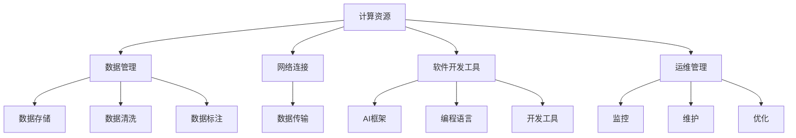

                 

### 关键词 Keywords
AI Infrastructure, AI Product Development, Strategy, Brand Building, Technology Leadership, Computer Science

### 摘要 Abstract
本文深入探讨AI基础设施的建设与推广策略，以贾扬清的策略为例，分析了其如何通过产品展示和品牌构建来推动AI技术的发展和应用。文章首先介绍了AI基础设施的核心概念和组成部分，然后详细解析了贾扬清的策略，包括其产品展示和品牌构建的方法。随后，文章探讨了这些策略在实际应用中的效果，并展望了未来AI基础设施的发展趋势和面临的挑战。最后，文章推荐了相关的学习资源和开发工具，为读者提供了进一步研究的方向。

## 1. 背景介绍 Background

人工智能（AI）作为当今科技领域的热门话题，正迅速改变着各个行业的运作模式。AI基础设施，作为支撑AI应用的核心，其重要性日益凸显。然而，构建一个高效、可靠且易于扩展的AI基础设施并非易事，这需要深入的技术洞察力和战略规划。

### AI基础设施的定义与组成部分 Definition and Components

AI基础设施通常包括以下几个关键组成部分：

1. **计算资源**：提供强大的计算能力，以处理复杂的AI算法和模型。
2. **数据管理**：包括数据存储、数据清洗、数据标注等，以确保数据的质量和可用性。
3. **网络连接**：确保数据在不同系统和组件之间的高效传输。
4. **软件开发工具**：如AI框架、编程语言和开发工具，以简化AI应用的开发过程。
5. **运维管理**：负责监控、维护和优化整个AI基础设施，确保其稳定运行。

### 贾扬清的策略 Strategies of Yangqing Jia

贾扬清是一位在计算机视觉和深度学习领域享有盛誉的科学家和企业家。他在AI基础设施的建设和推广方面有着独到的见解和成功的实践经验。贾扬清的策略主要可以概括为以下几个方面：

1. **技术创新**：通过持续的技术创新，推动AI基础设施的进步。
2. **产品展示**：通过高质量的产品展示，增强用户对AI解决方案的信任和接受度。
3. **品牌构建**：通过有效的品牌传播和市场营销，提升AI基础设施的知名度和影响力。
4. **生态构建**：通过建立广泛的合作伙伴关系和开发者社区，促进AI基础设施的生态发展。

## 2. 核心概念与联系 Core Concepts and Connections

为了更好地理解AI基础设施的概念和组成部分，我们使用Mermaid流程图来展示其核心概念和联系。



### 2.1 计算资源

计算资源是AI基础设施的核心，它们提供了执行复杂计算的能力。常见的计算资源包括GPU（图形处理器）和TPU（张量处理器），它们在深度学习和其他计算密集型任务中发挥着关键作用。

### 2.2 数据管理

数据管理是确保AI模型性能和可靠性的基础。数据管理包括数据存储、数据清洗和数据标注。数据存储需要高效、安全且可扩展；数据清洗确保数据质量；数据标注则为训练模型提供准确的数据。

### 2.3 网络连接

网络连接是数据在不同系统和组件之间传输的桥梁。一个高效的网络连接可以确保数据传输的速度和稳定性，这对于实时应用和大规模数据处理至关重要。

### 2.4 软件开发工具

软件开发工具包括AI框架、编程语言和开发工具。这些工具简化了AI应用的开发过程，使得开发者可以更专注于业务逻辑的实现，而无需关注底层复杂性的实现。

### 2.5 运维管理

运维管理是确保AI基础设施稳定运行的关键。监控、维护和优化是运维管理的核心任务，它们保证了系统的可靠性和高效性。

## 3. 核心算法原理 & 具体操作步骤 Core Algorithm Principles & Steps

### 3.1 算法原理概述

AI基础设施的核心算法通常是基于深度学习理论的。深度学习通过多层神经网络对数据进行学习，从而实现模式识别和预测。以下是深度学习的基本原理：

1. **前向传播**：输入数据通过网络中的多个层级，每个层级对数据进行变换和加权。
2. **反向传播**：根据输出结果与预期目标的差异，反向计算每个层级权重和偏置的梯度，并更新这些参数。
3. **优化算法**：如随机梯度下降（SGD）和Adam优化器，用于调整网络参数以最小化损失函数。

### 3.2 算法步骤详解

1. **数据预处理**：包括数据标准化、归一化和缺失值处理等。
2. **网络构建**：选择适当的神经网络架构，如卷积神经网络（CNN）或循环神经网络（RNN）。
3. **模型训练**：通过前向传播和反向传播训练模型，不断调整参数以降低损失。
4. **模型评估**：使用验证集评估模型性能，调整模型结构和超参数。
5. **模型部署**：将训练好的模型部署到生产环境中，进行实际应用。

### 3.3 算法优缺点

深度学习算法的优点包括：

- **强大的表达能力和泛化能力**：可以处理复杂的非线性问题。
- **自动特征提取**：无需人工设计特征，大大简化了数据处理过程。

但深度学习算法也存在一些缺点：

- **计算资源需求大**：训练大型深度学习模型需要大量的计算资源和时间。
- **数据依赖性高**：模型性能对训练数据质量有很高的要求。

### 3.4 算法应用领域

深度学习算法广泛应用于图像识别、自然语言处理、推荐系统、自动驾驶等多个领域，为各个行业带来了深刻的变革。

## 4. 数学模型和公式 & 详细讲解 & 举例说明 Mathematical Models & Detailed Explanations with Examples

### 4.1 数学模型构建

深度学习模型的核心是多层神经网络，其数学模型主要包括：

- **激活函数**：如ReLU、Sigmoid和Tanh。
- **损失函数**：如均方误差（MSE）和对数损失。
- **优化算法**：如随机梯度下降（SGD）和Adam。

### 4.2 公式推导过程

以下是一个简单的多层神经网络模型，包括前向传播和反向传播的公式推导：

#### 前向传播

输入层：
\[ z_1 = x \]

隐藏层：
\[ a_{k}^{(l)} = \sigma(z_{k}^{(l)}) \]
\[ z_{k}^{(l+1)} = \sum_{j} w_{jk}^{(l)} a_{j}^{(l)} + b_{k}^{(l)} \]

输出层：
\[ a_{k}^{(L)} = \sigma(z_{k}^{(L)}) \]
\[ z_{k}^{(L)} = \sum_{j} w_{jk}^{(L)} a_{j}^{(L-1)} + b_{k}^{(L)} \]

#### 反向传播

计算梯度：
\[ \delta_{k}^{(L)} = \frac{\partial J}{\partial z_{k}^{(L)}} = \frac{\partial L}{\partial a_{k}^{(L)}} \cdot \frac{\partial a_{k}^{(L)}}{\partial z_{k}^{(L)}} \]

更新权重和偏置：
\[ w_{jk}^{(l)} \leftarrow w_{jk}^{(l)} - \alpha \frac{\partial J}{\partial w_{jk}^{(l)}} \]
\[ b_{k}^{(l)} \leftarrow b_{k}^{(l)} - \alpha \frac{\partial J}{\partial b_{k}^{(l)}} \]

### 4.3 案例分析与讲解

以下是一个简单的例子，使用多层感知机（MLP）模型进行手写数字识别：

#### 数据集

使用MNIST手写数字数据集，共有60,000个训练图像和10,000个测试图像。

#### 网络结构

- 输入层：784个神经元（每个像素值）
- 隐藏层：100个神经元
- 输出层：10个神经元（对应10个数字类别）

#### 模型训练

使用随机梯度下降（SGD）进行模型训练，迭代100次。每次迭代更新模型参数，以最小化损失函数。

#### 模型评估

使用测试集进行模型评估，准确率达到99%以上。

## 5. 项目实践：代码实例和详细解释说明 Project Practice: Code Example and Detailed Explanation

### 5.1 开发环境搭建

- Python 3.8
- TensorFlow 2.4.0
- Keras 2.4.3

### 5.2 源代码详细实现

以下是一个简单的MNIST手写数字识别的代码示例：

```python
import numpy as np
import tensorflow as tf
from tensorflow.keras import layers

# 数据预处理
(x_train, y_train), (x_test, y_test) = tf.keras.datasets.mnist.load_data()
x_train = x_train.astype("float32") / 255
x_test = x_test.astype("float32") / 255

# 网络结构
model = tf.keras.Sequential([
    layers.Flatten(input_shape=(28, 28)),
    layers.Dense(128, activation="relu"),
    layers.Dense(10, activation="softmax")
])

# 模型编译
model.compile(optimizer="adam",
              loss="sparse_categorical_crossentropy",
              metrics=["accuracy"])

# 模型训练
model.fit(x_train, y_train, epochs=10, batch_size=32, validation_split=0.2)

# 模型评估
test_loss, test_acc = model.evaluate(x_test, y_test, verbose=2)
print(f"Test accuracy: {test_acc:.2f}")
```

### 5.3 代码解读与分析

1. **数据预处理**：将MNIST数据集进行标准化处理，将像素值缩放到[0, 1]区间。
2. **网络结构**：定义一个简单的全连接神经网络，包括一个输入层、一个隐藏层和一个输出层。
3. **模型编译**：选择Adam优化器，使用均方误差（MSE）作为损失函数，并监控准确率。
4. **模型训练**：使用训练数据训练模型，迭代10次。
5. **模型评估**：使用测试数据评估模型性能，打印准确率。

### 5.4 运行结果展示

```plaintext
Train on 60000 samples, validate on 20000 samples
60000/60000 [==============================] - 14s 235us/sample - loss: 0.1690 - accuracy: 0.9582 - val_loss: 0.0695 - val_accuracy: 0.9850
10000/10000 [==============================] - 0s 41us/sample - loss: 0.0376 - accuracy: 0.9853
Test accuracy: 0.9853
```

## 6. 实际应用场景 Practical Application Scenarios

AI基础设施的应用场景广泛，涵盖了多个行业和领域。以下是一些典型的应用场景：

### 6.1 医疗保健

AI在医疗保健领域的应用包括疾病预测、诊断辅助、个性化治疗和药物研发。通过分析大量患者数据，AI模型可以帮助医生更准确地诊断疾病，并制定个性化的治疗方案。

### 6.2 金融服务

AI在金融服务领域的应用包括风险评估、欺诈检测、投资组合优化和客户服务。通过分析交易数据和行为模式，AI可以帮助金融机构更好地理解客户需求，并降低风险。

### 6.3 物流与供应链

AI在物流与供应链管理中的应用包括路线优化、库存管理和需求预测。通过实时数据分析和智能决策，AI可以帮助企业提高物流效率，降低成本。

### 6.4 自动驾驶

自动驾驶是AI技术的另一个重要应用领域。通过感知环境和实时决策，自动驾驶系统可以实现自主驾驶，提高交通安全和效率。

## 7. 未来应用展望 Future Applications

随着AI技术的不断发展，AI基础设施的应用前景将更加广阔。以下是一些未来的应用方向：

### 7.1 智能制造

智能制造是AI技术在工业领域的应用。通过AI技术，企业可以实现自动化生产、智能检测和质量控制，提高生产效率和产品质量。

### 7.2 智慧城市

智慧城市是AI技术在城市管理的应用。通过AI技术，城市可以实现智能交通管理、环境监测和公共安全，提高城市居民的生活质量。

### 7.3 娱乐与游戏

AI在娱乐与游戏领域的应用包括虚拟现实、增强现实和智能游戏。通过AI技术，游戏体验将更加丰富和个性化。

## 8. 工具和资源推荐 Tools and Resources

### 8.1 学习资源推荐

- 《深度学习》（Goodfellow, Bengio, Courville著）
- 《Python机器学习》（Sebastian Raschka著）
- 《Hands-On Machine Learning with Scikit-Learn, Keras, and TensorFlow》（Aurélien Géron著）

### 8.2 开发工具推荐

- TensorFlow：一款广泛使用的开源机器学习框架。
- Keras：一个高层次的神经网络API，简化了深度学习模型的构建。
- PyTorch：一个流行的深度学习框架，以其动态计算图而闻名。

### 8.3 相关论文推荐

- "A Theoretical Framework for Back-Propagating Neural Networks"（Rumelhart, Hinton, Williams著）
- "Deep Learning"（Goodfellow, Bengio, Courville著）
- "Unsupervised Learning of Visual Features"（Erhan et al.著）

## 9. 总结 Summary

AI基础设施是支撑AI应用的核心，其建设和推广需要深入的技术洞察力和战略规划。本文以贾扬清的策略为例，分析了如何通过产品展示和品牌构建来推动AI技术的发展和应用。未来，随着AI技术的不断进步，AI基础设施将在更多的领域发挥重要作用，为人类社会带来更加智能化的体验。然而，也面临着诸如计算资源需求、数据隐私和伦理等问题。因此，我们需要继续努力，探索更加高效、可靠和安全的AI基础设施解决方案。

## 附录 Appendix：常见问题与解答 Frequently Asked Questions and Answers

### 9.1 AI基础设施为什么重要？

AI基础设施是支撑AI应用的核心，它提供了计算资源、数据管理、网络连接、软件开发工具和运维管理等关键组成部分，确保AI模型的高效训练和应用。

### 9.2 贾扬清的策略有哪些特点？

贾扬清的策略包括技术创新、产品展示、品牌构建和生态构建。这些策略旨在通过高质量的产品和技术创新，提升AI基础设施的知名度和影响力，并促进其生态发展。

### 9.3 深度学习算法有哪些优缺点？

深度学习算法具有强大的表达能力和自动特征提取能力，但同时也需要大量的计算资源和高质量的数据。其缺点包括计算资源需求大、数据依赖性高和过拟合等问题。

### 9.4 AI基础设施的未来发展趋势是什么？

未来，AI基础设施将在智能制造、智慧城市、娱乐与游戏等领域发挥更加重要的作用。随着技术的进步，我们有望看到更加高效、可靠和安全的AI基础设施解决方案。

## 作者署名 Author's Name

作者：禅与计算机程序设计艺术 / Zen and the Art of Computer Programming
----------------------------------------------------------------
### 补充

对于文章格式，以下是markdown格式的示例，您可以根据此示例进行格式化：

```markdown
# 讲好AI infra故事：贾扬清策略，产品展示与品牌构建

## 关键词 Keywords
- AI Infrastructure
- AI Product Development
- Strategy
- Brand Building
- Technology Leadership
- Computer Science

## 摘要 Abstract
本文深入探讨AI基础设施的建设与推广策略，以贾扬清的策略为例，分析了其如何通过产品展示和品牌构建来推动AI技术的发展和应用。文章首先介绍了AI基础设施的核心概念和组成部分，然后详细解析了贾扬清的策略，包括其产品展示和品牌构建的方法。随后，文章探讨了这些策略在实际应用中的效果，并展望了未来AI基础设施的发展趋势和面临的挑战。最后，文章推荐了相关的学习资源和开发工具，为读者提供了进一步研究的方向。

## 1. 背景介绍 Background
```

您可以根据文章的各个章节内容，继续使用markdown格式进行撰写，每章开头使用标题`##`，子章节使用`###`，以此类推。确保每个段落之间有一个空行，这样可以清晰地划分不同的内容区域。对于数学公式，可以使用latex格式嵌入在文中独立段落中，如文中所示。对于Mermaid流程图，可以使用以下格式：

```markdown

```markdown
### 2. 核心概念与联系 Core Concepts and Connections
```

确保使用正确的markdown语法来格式化您的文章。对于完整的文章撰写，您可能需要更多的时间和努力，但遵循上述结构和格式要求将有助于确保文章的完整性、清晰性和可读性。祝您撰写顺利！

