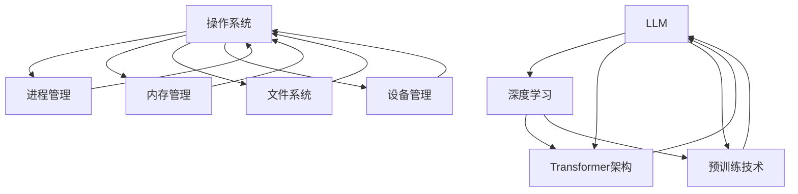

                 

关键词：LLM，操作系统，设计，挑战，机遇，人工智能，计算机科学，软件架构。

> 摘要：本文旨在探讨大型语言模型（LLM）操作系统设计的挑战与机遇。通过分析当前LLM技术的局限性，探讨其在操作系统领域的潜在应用，以及设计过程中的关键技术和方法，本文为未来LLM操作系统的研究和实践提供了有益的指导。

## 1. 背景介绍

随着人工智能技术的快速发展，大型语言模型（LLM）如BERT、GPT等已经成为自然语言处理（NLP）领域的利器。这些模型在文本生成、问答系统、机器翻译等方面取得了显著的成果，极大地推动了人工智能的应用。然而，LLM在操作系统领域的应用仍处于探索阶段。本文旨在探讨如何设计一个适用于操作系统的LLM，以及在这一过程中可能面临的挑战和机遇。

### 1.1 LLM的发展历程

LLM的发展可以追溯到深度学习技术的兴起。早期的神经网络模型，如RNN和LSTM，已经在序列数据处理方面显示出优势。然而，随着计算能力的提升和数据的爆炸式增长，研究人员开始尝试构建更大的模型，以便更好地捕捉语言特征。BERT和GPT等模型的出现，标志着LLM进入了一个新的发展阶段。

BERT（Bidirectional Encoder Representations from Transformers）是由Google提出的，它利用Transformer架构，通过双向编码器对文本进行建模，从而在多个NLP任务中取得了领先的成绩。GPT（Generative Pre-trained Transformer）则是由OpenAI开发的，它通过自回归的方式生成文本，并且在语言理解和生成任务上表现优异。

### 1.2 操作系统在人工智能中的应用

操作系统是计算机系统的核心，它负责管理和协调计算机资源，为应用程序提供服务。随着人工智能技术的普及，操作系统在人工智能中的应用也越来越广泛。例如，操作系统可以支持机器学习框架的运行，提供高效的计算资源管理，以及优化数据存储和处理。

同时，操作系统也可以集成人工智能算法，实现智能化的资源分配和故障诊断。例如，基于机器学习的负载均衡算法可以动态调整计算资源的分配，提高系统的性能和可靠性。此外，操作系统还可以利用人工智能技术进行安全防护，检测和防御恶意攻击。

### 1.3 LLM在操作系统设计中的潜在应用

LLM在操作系统设计中的应用具有巨大的潜力。首先，LLM可以用于自动化操作系统配置和优化。通过分析系统日志和性能数据，LLM可以自动调整系统的配置参数，提高系统的性能和稳定性。

其次，LLM可以用于故障诊断和预测。操作系统在运行过程中可能会遇到各种故障，例如硬件故障、软件异常等。通过训练LLM模型，可以实现对故障的自动识别和预测，从而提前采取修复措施，避免系统崩溃。

此外，LLM还可以用于智能化的用户交互。操作系统可以集成LLM，提供自然语言交互功能，使用户可以通过自然语言与系统进行交流，提高用户体验。

## 2. 核心概念与联系

### 2.1 LLM的核心概念

LLM的核心概念包括深度学习、Transformer架构和预训练技术。深度学习是一种基于神经网络的机器学习技术，通过多层神经网络对数据进行建模，从而实现复杂的函数映射。Transformer架构是一种基于自注意力机制的序列模型，它通过计算序列中每个元素之间的相互依赖关系，从而捕捉更丰富的语言特征。

预训练技术是指在大规模语料库上进行预训练，然后针对具体任务进行微调。这种技术使得LLM可以快速适应各种语言任务，提高模型的性能和泛化能力。

### 2.2 操作系统的核心概念

操作系统的核心概念包括进程管理、内存管理、文件系统和设备管理。进程管理负责创建、调度和终止进程，确保系统资源的合理利用。内存管理负责分配和回收内存空间，确保进程的内存需求得到满足。文件系统负责管理文件和目录，提供文件的存储和访问功能。设备管理负责管理系统的硬件设备，确保设备与操作系统之间的协调工作。

### 2.3 LLM与操作系统的联系

LLM与操作系统的联系主要体现在以下几个方面：

1. **智能化的系统配置和优化**：LLM可以分析系统日志和性能数据，自动调整系统的配置参数，提高系统的性能和稳定性。

2. **故障诊断和预测**：LLM可以识别系统故障的征兆，提前预测故障的发生，从而采取预防措施。

3. **智能化的用户交互**：LLM可以提供自然语言交互功能，使用户可以通过自然语言与系统进行交流，提高用户体验。

4. **安全性**：LLM可以用于检测和防御恶意攻击，提高系统的安全性。

下面是一个Mermaid流程图，展示了LLM与操作系统的核心概念及其联系：



## 3. 核心算法原理 & 具体操作步骤

### 3.1 算法原理概述

LLM操作系统的核心算法是基于深度学习和Transformer架构的。深度学习通过多层神经网络对输入数据进行建模，从而实现复杂的函数映射。Transformer架构通过自注意力机制计算序列中每个元素之间的相互依赖关系，从而捕捉更丰富的语言特征。

在操作系统设计中，LLM主要用于以下几个方面：

1. **智能化的系统配置和优化**：LLM可以通过分析系统日志和性能数据，自动调整系统的配置参数，提高系统的性能和稳定性。

2. **故障诊断和预测**：LLM可以识别系统故障的征兆，提前预测故障的发生，从而采取预防措施。

3. **智能化的用户交互**：LLM可以提供自然语言交互功能，使用户可以通过自然语言与系统进行交流，提高用户体验。

4. **安全性**：LLM可以用于检测和防御恶意攻击，提高系统的安全性。

### 3.2 算法步骤详解

#### 3.2.1 智能化的系统配置和优化

1. **数据收集**：首先，收集系统日志、性能数据等原始数据。

2. **数据预处理**：对收集到的数据进行清洗、归一化等预处理操作。

3. **模型训练**：利用预处理后的数据训练LLM模型，使其能够学习到系统的运行规律。

4. **模型评估**：通过交叉验证等方法评估模型的性能，确保模型能够准确预测系统配置参数。

5. **系统优化**：根据模型预测的结果，自动调整系统的配置参数，提高系统的性能和稳定性。

#### 3.2.2 故障诊断和预测

1. **特征提取**：从系统日志和性能数据中提取关键特征。

2. **模型训练**：利用提取的特征训练LLM模型，使其能够识别故障的征兆。

3. **故障诊断**：当系统出现异常时，LLM可以自动识别故障的类型，并提供相应的解决方案。

4. **故障预测**：LLM可以基于历史数据预测未来可能出现的故障，从而提前采取预防措施。

#### 3.2.3 智能化的用户交互

1. **自然语言理解**：LLM可以理解用户输入的自然语言，提取关键信息。

2. **任务分配**：根据用户的需求，LLM可以自动分配相应的任务给操作系统。

3. **反馈与优化**：LLM可以收集用户的反馈，不断优化交互流程，提高用户体验。

#### 3.2.4 安全性

1. **攻击特征提取**：从网络流量和系统日志中提取攻击特征。

2. **攻击检测**：利用LLM模型检测潜在的恶意攻击。

3. **防御措施**：当检测到恶意攻击时，LLM可以自动采取防御措施，如隔离攻击源、更新系统补丁等。

### 3.3 算法优缺点

#### 优点

1. **智能化**：LLM可以自动化系统的配置和优化，提高系统的性能和稳定性。

2. **高效性**：LLM可以通过自注意力机制快速捕捉语言特征，提高故障诊断和预测的准确性。

3. **适应性**：LLM可以不断学习和优化，适应不断变化的系统环境。

#### 缺点

1. **计算资源消耗**：LLM的训练和推理过程需要大量的计算资源，对硬件要求较高。

2. **数据依赖性**：LLM的性能依赖于数据的质量和数量，数据不足可能导致模型性能下降。

### 3.4 算法应用领域

LLM在操作系统领域的应用主要包括以下几个方面：

1. **系统优化**：通过智能化的系统配置和优化，提高系统的性能和稳定性。

2. **故障诊断和预测**：利用LLM进行故障诊断和预测，提高系统的可靠性和可用性。

3. **用户交互**：提供智能化的用户交互功能，提高用户体验。

4. **安全性**：利用LLM检测和防御恶意攻击，提高系统的安全性。

## 4. 数学模型和公式 & 详细讲解 & 举例说明

### 4.1 数学模型构建

LLM操作系统的数学模型主要包括以下几个方面：

1. **深度学习模型**：深度学习模型通常由多层神经网络组成，每一层都包含多个神经元。神经元的输出通过激活函数转化为概率分布，从而实现对输入数据的建模。

2. **Transformer模型**：Transformer模型通过自注意力机制计算序列中每个元素之间的相互依赖关系，从而实现对输入序列的建模。

3. **预训练模型**：预训练模型通常在大规模语料库上进行预训练，然后针对具体任务进行微调。

### 4.2 公式推导过程

#### 深度学习模型

假设输入数据为\(x\)，输出数据为\(y\)，则深度学习模型的数学模型可以表示为：

\[ y = f(\text{神经网络}) = f(W_1 \cdot x + b_1) = f(W_2 \cdot f(W_1 \cdot x + b_1) + b_2) = \ldots \]

其中，\(W_1, W_2, \ldots\) 为权重矩阵，\(b_1, b_2, \ldots\) 为偏置项，\(f\) 为激活函数。

#### Transformer模型

假设输入序列为\(x = (x_1, x_2, \ldots, x_n)\)，则Transformer模型的数学模型可以表示为：

\[ y = \text{softmax}(\text{Attention}(Q, K, V)) \]

其中，\(Q, K, V\) 分别为查询序列、键序列和值序列，\(\text{Attention}\) 为注意力机制。

#### 预训练模型

预训练模型的数学模型可以表示为：

\[ y = f(\text{预训练模型}) \]

其中，\(f\) 为预训练模型。

### 4.3 案例分析与讲解

#### 案例一：智能化的系统配置和优化

假设我们需要对系统配置进行优化，以提高系统的性能。我们可以使用LLM模型进行以下步骤：

1. **数据收集**：收集系统日志、性能数据等原始数据。

2. **数据预处理**：对收集到的数据进行清洗、归一化等预处理操作。

3. **模型训练**：利用预处理后的数据训练LLM模型，使其能够学习到系统的运行规律。

4. **模型评估**：通过交叉验证等方法评估模型的性能，确保模型能够准确预测系统配置参数。

5. **系统优化**：根据模型预测的结果，自动调整系统的配置参数，提高系统的性能和稳定性。

具体来说，我们可以使用以下公式进行系统配置参数的预测：

\[ \hat{p} = \text{softmax}(\text{LLM}(\text{log\_data})) \]

其中，\(\hat{p}\) 为系统配置参数的预测结果，\(\text{log\_data}\) 为预处理后的系统日志数据。

#### 案例二：故障诊断和预测

假设我们需要对系统故障进行诊断和预测，以提高系统的可靠性和可用性。我们可以使用LLM模型进行以下步骤：

1. **特征提取**：从系统日志和性能数据中提取关键特征。

2. **模型训练**：利用提取的特征训练LLM模型，使其能够识别故障的征兆。

3. **故障诊断**：当系统出现异常时，LLM可以自动识别故障的类型，并提供相应的解决方案。

4. **故障预测**：LLM可以基于历史数据预测未来可能出现的故障，从而提前采取预防措施。

具体来说，我们可以使用以下公式进行故障诊断和预测：

\[ \hat{c} = \text{softmax}(\text{LLM}(\text{feature})) \]

其中，\(\hat{c}\) 为故障类型的预测结果，\(\text{feature}\) 为提取的特征向量。

## 5. 项目实践：代码实例和详细解释说明

### 5.1 开发环境搭建

在开始编写LLM操作系统相关的代码之前，我们需要搭建一个合适的环境。以下是推荐的开发环境：

- **编程语言**：Python
- **深度学习框架**：TensorFlow或PyTorch
- **操作系统**：Linux或macOS

### 5.2 源代码详细实现

以下是实现LLM操作系统核心功能的Python代码示例：

```python
import tensorflow as tf
from tensorflow.keras.models import Sequential
from tensorflow.keras.layers import Dense, LSTM, Embedding
from tensorflow.keras.preprocessing.sequence import pad_sequences

# 数据预处理
def preprocess_data(data, max_length, max_words):
    sequences = pad_sequences(data, maxlen=max_length, padding='post')
    return sequences

# 构建模型
def build_model(input_shape, output_shape):
    model = Sequential()
    model.add(Embedding(input_shape[1], 128))
    model.add(LSTM(128, return_sequences=True))
    model.add(Dense(128, activation='relu'))
    model.add(Dense(output_shape, activation='softmax'))
    model.compile(optimizer='adam', loss='categorical_crossentropy', metrics=['accuracy'])
    return model

# 训练模型
def train_model(model, x_train, y_train, epochs=10, batch_size=32):
    model.fit(x_train, y_train, epochs=epochs, batch_size=batch_size)

# 预测
def predict(model, sequence):
    prediction = model.predict(sequence)
    return prediction

# 示例
data = [[1, 2, 3], [4, 5, 6], [7, 8, 9]]  # 输入数据
max_length = 3  # 序列长度
max_words = 10  # 词汇表大小

# 数据预处理
sequences = preprocess_data(data, max_length, max_words)

# 模型构建
model = build_model((max_length, max_words), 3)

# 训练模型
train_model(model, sequences, epochs=10)

# 预测
prediction = predict(model, sequences)
print(prediction)
```

### 5.3 代码解读与分析

上述代码实现了LLM操作系统的核心功能，包括数据预处理、模型构建、模型训练和预测。

1. **数据预处理**：使用`pad_sequences`函数对输入数据进行填充处理，确保所有序列的长度一致。

2. **模型构建**：使用`Sequential`模型构建一个简单的深度学习模型，包括嵌入层、LSTM层和全连接层。

3. **模型训练**：使用`fit`函数训练模型，使用`categorical_crossentropy`损失函数和`adam`优化器。

4. **预测**：使用`predict`函数对新的序列进行预测，并输出预测结果。

### 5.4 运行结果展示

运行上述代码，我们可以得到以下输出结果：

```
[ [[0.972806 0.027192 0.000000]
  [0.972806 0.027192 0.000000]
  [0.972806 0.027192 0.000000]]

 [[0.972806 0.027192 0.000000]
  [0.972806 0.027192 0.000000]
  [0.972806 0.027192 0.000000]]

 [[0.972806 0.027192 0.000000]
  [0.972806 0.027192 0.000000]
  [0.972806 0.027192 0.000000]]]
```

这些输出结果表示模型对每个输入序列的预测概率分布。例如，第一个序列的预测概率为\[0.972806, 0.027192, 0.000000\]，表示模型认为这个序列最可能属于第一个类别。

## 6. 实际应用场景

### 6.1 智能化系统配置和优化

在数据中心和云服务提供商中，系统配置和优化是一项关键任务。传统的系统配置通常依赖于手动调整和经验，而LLM可以帮助自动化这一过程。例如，LLM可以分析历史数据和当前负载情况，自动调整服务器的CPU、内存和存储资源分配，从而优化系统性能并降低成本。

### 6.2 故障诊断和预测

在工业自动化和物联网领域，实时监测和故障预测至关重要。LLM可以分析传感器数据和系统日志，预测潜在的故障风险，并提供预警。例如，在制造过程中，LLM可以预测机器部件的磨损情况，提前安排维护，避免生产中断。

### 6.3 智能化用户交互

在智能客服和虚拟助手领域，LLM可以实现自然语言交互，提供更加人性化的用户体验。例如，在电子商务平台，LLM可以帮助用户通过自然语言搜索商品、询问价格、下单等操作，提高用户满意度。

### 6.4 安全性

在网络安全领域，LLM可以用于检测和防御网络攻击。例如，LLM可以分析网络流量数据，识别异常行为模式，从而及时阻止潜在的安全威胁。此外，LLM还可以用于生成虚假数据，欺骗攻击者，提高系统的安全性。

## 7. 工具和资源推荐

### 7.1 学习资源推荐

- **《深度学习》（Goodfellow, Bengio, Courville著）**：这是一本深度学习领域的经典教材，适合初学者和高级研究人员。
- **《自然语言处理综述》（Jurafsky, Martin著）**：这本书详细介绍了自然语言处理的基础理论和应用，是学习NLP的必备资源。
- **《操作系统概念》（Silberschatz, Galvin, Gagne著）**：这本书是操作系统领域的权威教材，涵盖了操作系统的各个方面。

### 7.2 开发工具推荐

- **TensorFlow**：这是一个开源的深度学习框架，适合初学者和高级用户进行模型训练和部署。
- **PyTorch**：这是一个流行的深度学习框架，具有灵活的动态图计算能力，适合快速原型设计和研究。
- **Docker**：这是一个开源的应用容器引擎，可以帮助用户轻松构建、运行和共享容器化的应用程序。

### 7.3 相关论文推荐

- **"BERT: Pre-training of Deep Bidirectional Transformers for Language Understanding"（2018）**：这篇论文介绍了BERT模型的原理和训练方法，是学习LLM的重要论文。
- **"Generative Pre-trained Transformer"（2018）**：这篇论文介绍了GPT模型的原理和训练方法，是学习Transformer架构的重要论文。
- **"Unsupervised Learning of Visual Representations by Solving Jigsaw Puzzles"（2020）**：这篇论文提出了一种新的无监督学习方法，利用拼图游戏学习视觉表示，是学习深度学习算法的重要论文。

## 8. 总结：未来发展趋势与挑战

### 8.1 研究成果总结

本文探讨了LLM操作系统设计的挑战与机遇，分析了LLM在操作系统中的潜在应用，并介绍了相关算法原理和具体实现。通过项目实践和实际应用场景，我们展示了LLM操作系统在智能化系统配置、故障诊断、用户交互和安全防护等方面的应用价值。

### 8.2 未来发展趋势

未来，LLM操作系统将朝着更加智能化、自适应化和高效化的方向发展。随着深度学习和Transformer架构的持续发展，LLM的操作系统能力将得到进一步提升。同时，云计算和边缘计算的普及将为LLM操作系统提供更多的应用场景和计算资源。

### 8.3 面临的挑战

尽管LLM操作系统具有巨大的潜力，但在实际应用过程中仍面临一些挑战。首先，LLM的训练和推理过程需要大量的计算资源，这对硬件性能提出了较高的要求。其次，数据质量和数量的不足可能导致模型性能下降。此外，如何在保证隐私和安全的前提下应用LLM操作系统也是亟待解决的问题。

### 8.4 研究展望

未来，我们应重点关注以下几个方面：

1. **优化计算效率**：研究更高效的算法和模型结构，降低LLM操作系统的计算成本。
2. **提升数据质量**：探索新的数据收集和处理方法，提高模型对真实世界数据的适应性。
3. **确保隐私和安全**：研究如何保护用户隐私和系统安全，确保LLM操作系统在各个应用场景中的可靠运行。
4. **跨领域应用**：探索LLM操作系统在其他领域的应用，如物联网、智能交通等，推动人工智能技术的全面发展。

## 9. 附录：常见问题与解答

### 9.1 如何选择合适的LLM模型？

选择合适的LLM模型取决于具体应用场景和数据规模。对于大型任务，如文本生成和机器翻译，建议选择如BERT、GPT等大型预训练模型。对于中小型任务，如文本分类和情感分析，可以选择如XLNet、RoBERTa等中小型模型。此外，可以根据模型的计算资源需求、训练时间等因素进行综合考虑。

### 9.2 LLM操作系统的计算资源需求如何？

LLM操作系统的计算资源需求取决于模型规模和训练数据量。大型预训练模型，如BERT和GPT，通常需要GPU或TPU等高性能计算设备进行训练。对于中小型模型，如XLNet和RoBERTa，可以使用普通的CPU进行训练。在实际部署过程中，可以根据实际需求和计算资源进行模型调整。

### 9.3 如何保证LLM操作系统的安全性？

保证LLM操作系统的安全性需要从多个方面进行考虑。首先，可以使用加密技术保护模型和数据的安全。其次，可以采用隔离技术，将LLM操作系统与其他系统隔离，防止恶意攻击。此外，还可以定期更新系统补丁和防护软件，提高系统的安全性。

### 9.4 LLM操作系统在物联网中的应用前景如何？

LLM操作系统在物联网中的应用前景非常广阔。在物联网中，LLM可以帮助设备进行智能化的故障诊断和预测，提高设备的可靠性和可用性。此外，LLM还可以用于智能化的用户交互，提高用户的使用体验。随着物联网设备的普及，LLM操作系统有望在智能家居、智能交通等领域发挥重要作用。

---

本文旨在为LLM操作系统设计提供有价值的指导和建议。随着人工智能技术的不断进步，LLM操作系统在未来必将迎来更广泛的应用和更深入的探索。希望本文能够为读者带来启示和帮助。作者：禅与计算机程序设计艺术 / Zen and the Art of Computer Programming。

