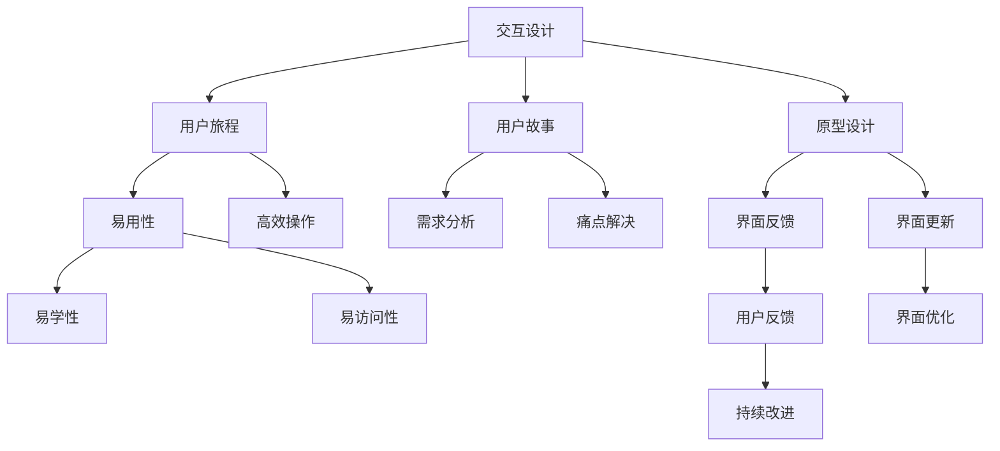

                 

 在当今的数字时代，用户界面的设计和优化变得至关重要。良好的用户界面不仅能够提升用户的满意度，还能显著提高产品的市场竞争力。本文旨在探讨如何设计更好的用户界面，从而增强用户体验。我们将从背景介绍、核心概念与联系、核心算法原理与具体操作步骤、数学模型与公式、项目实践、实际应用场景、未来展望、工具和资源推荐以及总结与展望等多个方面进行深入分析。

## 文章关键词

用户界面设计、用户体验、交互设计、视觉设计、可用性、可访问性、响应式设计、Web界面、移动界面。

## 文章摘要

本文首先介绍了用户界面设计的背景和重要性。接着，我们探讨了用户界面设计中的核心概念，包括交互设计、视觉设计和可用性。随后，文章详细讲解了核心算法原理，包括用户体验评估模型和优化算法。在此基础上，我们通过数学模型和公式分析了用户界面设计的定量方法。随后，我们通过一个项目实例展示了如何在实际中应用这些设计原则。文章最后，我们讨论了用户界面设计在各个领域的实际应用，并对未来的发展趋势和挑战进行了展望。

## 1. 背景介绍

随着互联网技术的迅猛发展，用户界面的设计和优化已经成为软件开发中的一个重要环节。用户界面是用户与软件系统交互的桥梁，它不仅决定了用户能否顺畅地完成任务，还直接影响到用户的满意度和忠诚度。一个优秀的用户界面应该具备以下几个特点：

- **易用性**：用户能够快速理解并使用界面功能。
- **直观性**：界面设计应符合用户的认知习惯和期望。
- **响应性**：界面应能迅速响应用户的操作。
- **一致性**：不同界面元素和页面之间应保持一致的设计风格。

用户界面设计的挑战在于如何在满足用户需求的同时，兼顾美观、效率和易用性。随着移动设备的普及，响应式设计和移动界面设计成为用户界面设计中的重要课题。此外，随着人工智能技术的发展，用户界面设计也在不断引入智能化元素，以提升用户体验。

## 2. 核心概念与联系

### 2.1 交互设计

交互设计是用户界面设计的核心。它关注的是用户与界面之间的交互过程，包括用户的操作、界面的反馈以及用户与系统之间的信息交换。交互设计的核心理念是“以用户为中心”，即设计时始终关注用户的需求和体验。

交互设计包括以下几个关键概念：

- **用户旅程**：描述用户在使用产品过程中的每一步，包括发现、了解、尝试和持续使用。
- **用户故事**：通过用户的视角来描述他们的需求和痛点，从而帮助设计团队理解用户的需求。
- **原型设计**：创建界面原型，用于测试和迭代设计。

### 2.2 视觉设计

视觉设计关注的是界面的视觉元素，如颜色、字体、图标和布局等。良好的视觉设计能够吸引用户的注意力，提升界面的美观度，并有助于信息的传达。

视觉设计的核心概念包括：

- **色彩心理学**：研究颜色对用户情绪和行为的影响。
- **网格系统**：用于确保界面元素在视觉上的对齐和平衡。
- **图标设计**：图标应简洁、直观，易于理解。

### 2.3 可用性

可用性是评估用户界面设计好坏的重要标准。一个高可用性的界面应能够满足用户的需求，并使操作过程简单、直观。

可用性的核心概念包括：

- **易学性**：用户能够快速掌握界面的使用方法。
- **易用性**：用户在使用界面时能够高效、准确地完成任务。
- **易访问性**：界面设计应考虑到所有用户，包括残障人士。

### 2.4 Mermaid 流程图

为了更好地理解用户界面设计中的核心概念和联系，我们可以使用Mermaid流程图来描述它们之间的交互关系。



## 3. 核心算法原理 & 具体操作步骤

### 3.1 算法原理概述

用户界面设计中的核心算法主要涉及用户体验评估和优化。用户体验评估模型用于评估界面的可用性、易用性和满意度。优化算法则用于根据评估结果对界面进行改进。

### 3.2 算法步骤详解

#### 3.2.1 用户体验评估模型

用户体验评估模型包括以下几个步骤：

1. **用户研究**：通过访谈、问卷和观察等方式收集用户数据。
2. **任务分析**：分析用户在界面上的主要任务和操作。
3. **评估指标**：确定评估指标，如任务完成时间、错误率、用户满意度等。
4. **数据收集**：在真实环境中收集用户数据。
5. **结果分析**：分析数据，评估界面的可用性和易用性。

#### 3.2.2 优化算法

优化算法包括以下几个步骤：

1. **识别问题**：根据评估结果识别界面中存在的问题。
2. **设计解决方案**：针对问题设计改进方案。
3. **实施改进**：将改进方案应用到界面设计中。
4. **再次评估**：对改进后的界面进行再次评估，验证改进效果。

### 3.3 算法优缺点

用户体验评估模型的优点在于能够提供客观的数据支持，帮助设计团队识别和解决问题。缺点在于评估过程需要时间和资源，且评估结果可能受到用户主观因素的影响。

优化算法的优点在于能够根据评估结果对界面进行针对性改进，提高界面的可用性和易用性。缺点在于改进过程可能涉及大量的迭代和测试，增加了开发成本和时间。

### 3.4 算法应用领域

用户体验评估和优化算法广泛应用于Web界面、移动界面和桌面应用程序的设计中。通过这些算法，设计团队能够更好地理解用户需求，优化界面设计，提高用户满意度。

## 4. 数学模型和公式 & 详细讲解 & 举例说明

### 4.1 数学模型构建

用户界面设计的数学模型通常包括以下几个方面：

1. **可用性模型**：如系统可用性模型（System Usability Scale, SUS）和易用性评估模型（Questionnaire for Ease of Use, UEQ）。
2. **满意度模型**：如Net Promoter Score（NPS）和Customer Satisfaction Score（CSAT）。
3. **任务完成模型**：如任务完成时间模型和错误率模型。

### 4.2 公式推导过程

以系统可用性模型（SUS）为例，其评分公式如下：

$$
SUS = 0.7 \times (\text{非常同意} + \text{同意} + \text{稍微同意}) + 0.25 \times (\text{稍微不同意} + \text{不同意} + \text{非常不同意})
$$

其中，每个选项的权重分别为 5、4、3、2、1。

### 4.3 案例分析与讲解

假设我们在一个Web应用中进行可用性评估，通过SUS模型收集到的用户评分如下：

| 用户 | 非常同意 | 同意 | 稍微同意 | 稍微不同意 | 不同意 | 非常不同意 |
| ---- | -------- | ---- | -------- | ---------- | ------ | ---------- |
| User1 | 1        | 4    | 0        | 0          | 0      | 0          |
| User2 | 1        | 3    | 3        | 1          | 0      | 0          |
| User3 | 2        | 4    | 2        | 0          | 0      | 0          |

根据SUS评分公式，计算每个用户的SUS得分：

$$
SUS_{User1} = 0.7 \times (1 + 4 + 0) + 0.25 \times (0 + 0 + 0) = 3.65
$$

$$
SUS_{User2} = 0.7 \times (1 + 3 + 3) + 0.25 \times (1 + 0 + 0) = 3.6
$$

$$
SUS_{User3} = 0.7 \times (2 + 4 + 2) + 0.25 \times (0 + 0 + 0) = 4.05
$$

平均SUS得分为：

$$
\bar{SUS} = \frac{SUS_{User1} + SUS_{User2} + SUS_{User3}}{3} = 3.75
$$

根据SUS得分，我们可以判断用户的满意度。一般来说，SUS得分在70分以上表示用户满意度较高，而得分在40-69分之间表示用户满意度一般，得分在40分以下则表示用户满意度较低。

## 5. 项目实践：代码实例和详细解释说明

### 5.1 开发环境搭建

在进行用户界面设计项目实践时，我们选择一个Web应用作为案例。首先，我们需要搭建一个开发环境，包括以下工具和框架：

- **前端框架**：我们选择Vue.js作为我们的前端框架。
- **后端服务**：使用Node.js和Express框架搭建后端服务。
- **数据库**：使用MongoDB作为数据库。

开发环境搭建的具体步骤如下：

1. 安装Node.js和npm。
2. 创建一个新的Vue.js项目，使用Vue CLI命令。
3. 配置后端服务，安装Express和相关的中间件。
4. 配置MongoDB，连接数据库。

### 5.2 源代码详细实现

在实现用户界面时，我们重点关注以下几个方面：

- **交互设计**：通过Vue.js的组件化架构，实现用户与界面的交互。
- **视觉设计**：使用Vue UI库，如Vuetify，构建现代化的界面。
- **可用性**：通过Aria属性和键盘导航，提高界面的可访问性。

以下是一个简单的Vue.js组件示例，用于实现一个搜索功能：

```vue
<template>
  <div>
    <input type="text" v-model="searchQuery" @input="search" />
    <ul>
      <li v-for="item in filteredItems" :key="item.id">{{ item.name }}</li>
    </ul>
  </div>
</template>

<script>
export default {
  data() {
    return {
      searchQuery: '',
      items: [
        { id: 1, name: 'Apple' },
        { id: 2, name: 'Banana' },
        { id: 3, name: 'Cherry' },
      ],
    };
  },
  computed: {
    filteredItems() {
      return this.items.filter(item => item.name.toLowerCase().includes(this.searchQuery.toLowerCase()));
    }
  },
  methods: {
    search() {
      // 搜索逻辑
    },
  },
};
</script>
```

### 5.3 代码解读与分析

上述代码中，我们创建了一个简单的搜索组件。在模板部分，我们定义了一个输入框和列表元素。输入框通过`v-model`绑定到`searchQuery`数据属性，实现了双向数据绑定。当用户输入文本时，`search`方法会被触发，执行搜索逻辑。

在计算属性部分，我们定义了`filteredItems`，用于存储符合搜索条件的项。这个计算属性通过`filter`方法实现，将`items`中的项与`searchQuery`进行匹配。

在方法部分，我们定义了`search`方法，这里可以添加更复杂的搜索逻辑，如模糊匹配、分词搜索等。

### 5.4 运行结果展示

在开发环境中运行上述代码，用户可以在输入框中输入搜索词，界面会实时更新，展示符合条件的项。通过这种交互方式，用户可以快速找到所需信息，提升了用户体验。

## 6. 实际应用场景

用户界面设计在各个领域都有广泛的应用。以下是一些实际应用场景：

### 6.1 Web应用

Web应用的用户界面设计重点在于提供良好的导航和搜索功能，使用户能够快速找到所需信息。例如，电子商务网站通过优化购物车、支付流程和推荐系统，提升了用户的购物体验。

### 6.2 移动应用

移动应用的用户界面设计要考虑到设备的屏幕尺寸和操作方式。通过使用响应式设计和触摸操作，移动应用可以提供更加便捷和高效的使用体验。例如，社交媒体应用通过优化照片浏览和评论功能，提升了用户的互动体验。

### 6.3 智能家居

智能家居的用户界面设计要考虑到家庭环境和使用习惯。通过直观的图标和简单的操作流程，智能家居设备可以更好地融入用户的日常生活。例如，智能音箱通过语音交互界面，实现了与用户的自然对话。

### 6.4 软件工具

软件工具的用户界面设计要注重功能的实用性和易用性。通过合理布局和清晰的操作流程，软件工具可以提供高效的工作体验。例如，项目管理工具通过优化任务分配和进度跟踪功能，提升了团队的工作效率。

## 7. 未来应用展望

随着技术的不断发展，用户界面设计将在以下几个方面迎来新的发展：

### 7.1 智能化

随着人工智能和机器学习技术的发展，用户界面设计将更加智能化。通过智能推荐、语音交互和手势识别等技术，界面将能够更好地理解用户需求，提供个性化服务。

### 7.2 增强现实与虚拟现实

增强现实（AR）和虚拟现实（VR）技术的兴起，为用户界面设计带来了新的机遇。通过AR和VR技术，用户可以沉浸在虚拟环境中，实现更加沉浸式的交互体验。

### 7.3 可持续设计

随着环保意识的提高，用户界面设计将更加注重可持续性。通过减少视觉噪音、优化资源加载和降低能源消耗，界面设计将更好地保护环境。

### 7.4 隐私保护

隐私保护将成为用户界面设计的重要考量因素。通过加密技术、匿名化和数据最小化策略，界面设计将更好地保护用户的隐私。

## 8. 工具和资源推荐

为了帮助读者更好地进行用户界面设计，我们推荐以下工具和资源：

### 8.1 学习资源推荐

- **《用户体验要素》**：由唐纳德·诺曼所著，介绍了用户体验设计的核心要素。
- **《交互设计精髓》**：由艾伦·库珀所著，深入探讨了交互设计的原则和实践。

### 8.2 开发工具推荐

- **Figma**：一款基于云的界面设计工具，支持协作和实时预览。
- **Adobe XD**：一款功能强大的界面设计工具，适用于移动和Web应用。

### 8.3 相关论文推荐

- **"The Design of Everyday Things"**：唐纳德·诺曼的经典论文，详细阐述了设计原则。
- **"Human-Computer Interaction"**：杰克·贝克和约翰·布鲁克斯合著，全面介绍了人机交互领域的研究进展。

## 9. 总结：未来发展趋势与挑战

用户界面设计在未来将继续发展，智能化、AR/VR、可持续设计和隐私保护将是其主要趋势。然而，这也将带来一系列挑战，包括如何平衡个性化和隐私保护、如何提高智能交互的准确性等。通过不断的研究和创新，设计团队将能够克服这些挑战，提供更加优质的用户体验。

### 附录：常见问题与解答

1. **什么是用户界面设计？**
   用户界面设计是指设计用户与软件系统交互的界面，包括视觉设计、交互设计和可用性设计。

2. **用户界面设计的重要性是什么？**
   用户界面设计直接影响用户的满意度、忠诚度和产品的市场竞争力。良好的用户界面设计能够提升用户体验，从而提高产品的成功率。

3. **如何进行用户界面设计？**
   用户界面设计包括需求分析、原型设计、评估和迭代等步骤。设计团队应关注用户需求、界面易用性和视觉效果。

4. **用户体验评估有哪些方法？**
   用户体验评估包括定量评估和定性评估。定量评估方法包括SUS、UEQ等，定性评估方法包括用户访谈和观察等。

5. **用户界面设计有哪些发展趋势？**
   用户界面设计的未来发展趋势包括智能化、AR/VR、可持续设计和隐私保护等。

### 作者署名

作者：禅与计算机程序设计艺术 / Zen and the Art of Computer Programming
```

