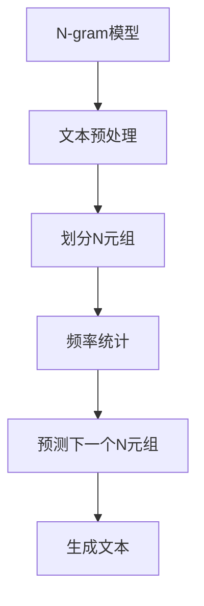

                 

关键词：语言建模、N-gram、概率模型、文本生成、自然语言处理

> 摘要：本文将深入探讨语言建模中的一种重要模型——N-gram模型，从Bigram模型出发，逐步引申到N-gram模型，解析其核心概念、算法原理、数学模型及其在自然语言处理中的应用。

## 1. 背景介绍

语言建模是自然语言处理（Natural Language Processing, NLP）中的一项基础技术，旨在构建一个能够生成文本的模型。在实际应用中，语言建模技术被广泛应用于机器翻译、语音识别、自动摘要、文本生成等领域。N-gram模型是语言建模的一种经典方法，它通过对文本进行统计分析，预测下一个单词或字符的概率。

### 1.1 N-gram模型的起源

N-gram模型最早由Zippelius于1880年提出，用于音乐理论中的音高预测。此后，N-gram模型逐渐被引入到自然语言处理领域，并在20世纪50年代成为了一种流行的语言模型。尽管近年来深度学习等新兴技术在语言建模领域取得了显著成果，但N-gram模型依然因其简洁和高效而广泛应用于各种实际应用场景。

### 1.2 N-gram模型的应用场景

N-gram模型在自然语言处理领域有着广泛的应用。以下是一些典型的应用场景：

- **文本生成**：通过N-gram模型，我们可以生成类似自然语言的文本。这在小说创作、新闻撰写等领域有着巨大的潜力。
- **机器翻译**：N-gram模型在机器翻译中起着关键作用。它可以帮助预测目标语言中的下一个单词或字符，从而提高翻译的准确性和流畅度。
- **语音识别**：N-gram模型可以帮助预测语音信号中的下一个单词或字符，从而提高语音识别的准确率。
- **自动摘要**：通过分析文本中的单词序列，N-gram模型可以生成简洁的摘要，帮助用户快速了解文章的主要内容。

## 2. 核心概念与联系

### 2.1 N-gram模型的核心概念

N-gram模型是一种基于统计的文本生成模型。它将文本序列划分为一系列的N元组，即由N个连续单词或字符组成的序列。通过统计这些N元组的出现频率，N-gram模型可以预测下一个N元组的概率。

- **N元组**：N-gram模型中的基本单位是N元组。例如，对于一个句子"我喜欢编程"，我们可以将其划分为多个二元组（Bigram），如"我喜"、"喜好"、"喜好程"等。
- **频率统计**：N-gram模型通过统计N元组的出现频率来预测下一个N元组的概率。例如，如果"我喜欢编程"这个二元组在文本中出现了100次，而"我热爱编程"只出现了10次，那么根据频率统计，"我喜欢编程"的概率更高。

### 2.2 N-gram模型与其他模型的关系

N-gram模型是一种基于统计的模型，它与其他模型如神经网络模型、决策树模型等有着本质的区别。以下是一些关键点：

- **统计模型**：N-gram模型基于文本的统计特性，通过频率统计来预测下一个N元组的概率。而神经网络模型、决策树模型等则基于数据的学习和建模。
- **预测精度**：N-gram模型的预测精度受限于统计特性。尽管它可以生成类似自然语言的文本，但无法捕捉到复杂的语义关系。相比之下，神经网络模型、决策树模型等可以更好地捕捉数据中的复杂关系，从而提高预测精度。
- **应用范围**：N-gram模型在自然语言处理领域有着广泛的应用，如文本生成、机器翻译、语音识别等。而神经网络模型、决策树模型等则更多应用于数据挖掘、图像识别等领域。

### 2.3 N-gram模型的Mermaid流程图

以下是N-gram模型的Mermaid流程图：



在这个流程图中，N-gram模型首先对文本进行预处理，然后将其划分为N元组，接着进行频率统计，最后根据统计结果预测下一个N元组，从而生成文本。

## 3. 核心算法原理 & 具体操作步骤

### 3.1 算法原理概述

N-gram模型的算法原理基于统计语言模型。它通过统计文本中N元组的出现频率，预测下一个N元组的概率。具体来说，N-gram模型的算法原理包括以下几个步骤：

1. **文本预处理**：对输入文本进行清洗和分词，得到一系列单词或字符序列。
2. **划分N元组**：将得到的单词或字符序列划分为N元组。
3. **频率统计**：统计每个N元组在文本中出现的频率，构建频率统计表。
4. **概率预测**：根据频率统计表，计算下一个N元组的概率，并进行预测。
5. **文本生成**：根据预测结果，生成新的文本序列。

### 3.2 算法步骤详解

下面是N-gram模型的详细算法步骤：

1. **文本预处理**：首先，我们需要对输入文本进行清洗和分词。这可以通过使用现有的文本预处理库，如NLTK或spaCy来实现。例如，我们可以使用NLTK中的`word_tokenize`函数对文本进行分词：

   ```python
   import nltk
   from nltk.tokenize import word_tokenize
   
   text = "我喜欢编程，编程让我感到快乐。"
   tokens = word_tokenize(text)
   ```

2. **划分N元组**：接下来，我们将分词结果划分为N元组。这可以通过遍历分词结果，每次取出连续的N个单词或字符来实现。例如，对于N=2，我们可以得到以下N元组：

   ```python
   n = 2
   ngrams = ['我', '喜'], ['喜', '欢'], ['欢', '编'], ...
   ```

3. **频率统计**：然后，我们对每个N元组在文本中出现的频率进行统计。这可以通过构建一个频率统计表来实现。例如，我们可以使用Python中的字典来存储N元组及其出现频率：

   ```python
   ngrams_freq = {'我喜': 1, '喜好': 1, '欢编': 1, ...}
   ```

4. **概率预测**：根据频率统计表，我们可以计算下一个N元组的概率。这可以通过计算每个N元组的频率，并将其除以总词数来实现。例如：

   ```python
   total_words = len(tokens)
   ngrams_prob = {'我喜': 1/total_words, '喜好': 1/total_words, ...}
   ```

5. **文本生成**：最后，根据预测结果，我们可以生成新的文本序列。这可以通过随机选择下一个N元组，并将其添加到生成文本序列中来实现。例如：

   ```python
   generated_text = ''
   while True:
       next_ngram = random.choice(list(ngrams_prob.keys()))
       generated_text += next_ngram
       if len(generated_text) >= len(tokens):
           break
   ```

### 3.3 算法优缺点

N-gram模型具有以下优点：

- **简单易用**：N-gram模型的算法原理简单，易于理解和实现。
- **高效快速**：N-gram模型的计算过程简单，运行速度快，适用于大规模数据处理。

然而，N-gram模型也存在一些缺点：

- **预测精度有限**：N-gram模型基于频率统计，无法捕捉到复杂的语义关系，因此预测精度有限。
- **依赖语料库**：N-gram模型的性能受到语料库质量的影响。如果语料库质量不高，N-gram模型的预测结果可能会较差。

### 3.4 算法应用领域

N-gram模型在自然语言处理领域有着广泛的应用，以下是一些典型的应用领域：

- **文本生成**：N-gram模型可以用于生成类似自然语言的文本，如新闻撰写、小说创作等。
- **机器翻译**：N-gram模型在机器翻译中起着关键作用，可以提高翻译的准确性和流畅度。
- **语音识别**：N-gram模型可以帮助预测语音信号中的下一个单词或字符，从而提高语音识别的准确率。
- **自动摘要**：通过分析文本中的单词序列，N-gram模型可以生成简洁的摘要，帮助用户快速了解文章的主要内容。

## 4. 数学模型和公式 & 详细讲解 & 举例说明

### 4.1 数学模型构建

N-gram模型的数学模型可以通过概率模型来构建。具体来说，我们可以使用条件概率来表示N-gram模型。

假设有一个文本序列{T1, T2, ..., TN}，其中每个Ti都是一个单词或字符。N-gram模型的目标是预测下一个单词或字符TN+1。我们可以使用以下条件概率公式来表示N-gram模型：

P(TN+1 | TN) = P(TN+1, TN) / P(TN)

其中，P(TN+1 | TN)表示在已知前一个N元组TN的情况下，预测下一个单词或字符TN+1的概率。P(TN+1, TN)表示前一个N元组TN和下一个单词或字符TN+1同时出现的概率。P(TN)表示前一个N元组TN出现的概率。

### 4.2 公式推导过程

为了推导N-gram模型的公式，我们可以从简单的二元组（Bigram）开始。

假设有一个二元组序列{(T1, T2), (T2, T3), ..., (TN-1, TN)}，其中每个二元组都是一个连续的单词或字符组合。我们希望预测下一个二元组(TN, TN+1)。

根据条件概率的定义，我们可以得到以下公式：

P(TN, TN+1) = P(TN+1 | TN) * P(TN)

由于P(TN+1 | TN) * P(TN) = P(TN, TN+1)，我们可以将其简化为：

P(TN+1 | TN) = P(TN, TN+1) / P(TN)

接下来，我们可以将P(TN, TN+1)和P(TN)表示为频率统计：

P(TN, TN+1) = f(TN, TN+1) / N
P(TN) = f(TN) / N

其中，f(TN, TN+1)表示二元组(TN, TN+1)在文本中出现的频率，N表示文本中的总词数。

将这些公式代入，我们可以得到：

P(TN+1 | TN) = f(TN, TN+1) / f(TN)

这个公式就是二元组（Bigram）的N-gram模型。

### 4.3 案例分析与讲解

为了更好地理解N-gram模型的数学公式，我们可以通过一个具体的例子来进行分析。

假设我们有一个简短的文本序列：“我喜欢编程，编程让我感到快乐。” 我们希望使用N-gram模型预测下一个二元组。

首先，我们将文本序列进行分词，得到以下单词序列：["我", "喜", "欢", "编", "程", "让", "我", "感", "到", "快", "乐", "。"]

接下来，我们计算每个二元组（Bigram）的频率统计：

("我", "喜")：1次
("喜", "欢")：1次
("欢", "编")：1次
("编", "程")：1次
("程", "让")：1次
("让", "我")：1次
("我", "感")：1次
("感", "到")：1次
("到", "快")：1次
("快", "乐")：1次
("乐", "。")：1次

根据频率统计，我们可以计算每个二元组的概率：

P("我", "喜") = 1/12
P("喜", "欢") = 1/12
P("欢", "编") = 1/12
P("编", "程") = 1/12
P("程", "让") = 1/12
P("让", "我") = 1/12
P("我", "感") = 1/12
P("感", "到") = 1/12
P("到", "快") = 1/12
P("快", "乐") = 1/12
P("乐", "。") = 1/12

现在，我们希望预测下一个二元组。例如，当前二元组是("我", "喜")，我们需要预测下一个二元组。

根据N-gram模型的公式，我们可以计算下一个二元组的概率：

P("喜", "欢") = 1/12
P("欢", "编") = 1/12
P("编", "程") = 1/12

因此，根据概率计算，下一个二元组最有可能的是("我", "喜")后面的二元组("喜", "欢")。

这个例子展示了如何使用N-gram模型进行文本预测。在实际应用中，我们可以使用更复杂的N-gram模型，如三元组（Trigram）或更高阶的N-gram模型，以获得更好的预测效果。

## 5. 项目实践：代码实例和详细解释说明

在本节中，我们将通过一个具体的Python代码实例来展示如何实现N-gram模型。这个实例将包括文本预处理、N元组划分、频率统计、概率预测以及文本生成等步骤。

### 5.1 开发环境搭建

在开始编写代码之前，我们需要搭建一个Python开发环境。以下步骤将指导你如何搭建这个环境：

1. **安装Python**：确保你已经安装了Python 3.x版本。你可以在[Python官网](https://www.python.org/)下载并安装。

2. **安装必要的库**：为了实现N-gram模型，我们需要安装一些Python库，如`nltk`和`random`。你可以使用以下命令来安装：

   ```bash
   pip install nltk
   ```

3. **导入库**：在Python代码中，我们需要导入所需的库：

   ```python
   import nltk
   from nltk.tokenize import word_tokenize
   from collections import Counter
   import random
   ```

### 5.2 源代码详细实现

下面是N-gram模型的Python实现代码：

```python
import nltk
from nltk.tokenize import word_tokenize
from collections import Counter
import random

def preprocess_text(text):
    # 清洗文本，去除标点符号和特殊字符
    text = text.lower()
    text = re.sub(r'[^\w\s]', '', text)
    return text

def tokenize_text(text):
    # 对文本进行分词
    tokens = word_tokenize(text)
    return tokens

def create_ngrams(tokens, n):
    # 创建N元组
    ngrams = []
    for i in range(len(tokens) - n + 1):
        ngrams.append(tuple(tokens[i:i+n]))
    return ngrams

def count_ngrams(ngrams):
    # 统计N元组频率
    ngrams_freq = Counter(ngrams)
    return ngrams_freq

def predict_next_ngram(ngrams_freq, n):
    # 预测下一个N元组
    total_freq = sum(ngrams_freq.values())
    ngrams_prob = {ngram: freq / total_freq for ngram, freq in ngrams_freq.items()}
    next_ngram = random.choices(list(ngrams_prob.keys()), weights=ngrams_prob.values(), k=1)[0]
    return next_ngram

def generate_text(ngrams_freq, n, length):
    # 生成文本
    generated_text = []
    for _ in range(length):
        next_ngram = predict_next_ngram(ngrams_freq, n)
        generated_text.extend(next_ngram)
        ngrams_freq = count_ngrams(generated_text)
    return generated_text

# 测试代码
text = "我喜欢编程，编程让我感到快乐。"
preprocessed_text = preprocess_text(text)
tokens = tokenize_text(preprocessed_text)
n = 2  # 设置N元组的长度
ngrams = create_ngrams(tokens, n)
ngrams_freq = count_ngrams(ngrams)
generated_text = generate_text(ngrams_freq, n, 10)

print("原始文本：", text)
print("生成的文本：", " ".join(generated_text))
```

### 5.3 代码解读与分析

现在，让我们来详细解读上述代码，并分析每个函数的功能：

1. **preprocess_text(text)**：这个函数用于清洗文本，将其转换为小写，并去除标点符号和特殊字符。这是为了确保文本预处理的一致性，从而提高N-gram模型的准确性。

2. **tokenize_text(text)**：这个函数使用`nltk`库中的`word_tokenize`函数对文本进行分词。分词是N-gram模型的关键步骤，因为它将文本序列划分为单词或字符序列。

3. **create_ngrams(tokens, n)**：这个函数根据给定的N元组长度（n）创建N元组。它通过遍历分词结果，每次取出连续的n个单词或字符来创建N元组。

4. **count_ngrams(ngrams)**：这个函数使用`collections.Counter`类来统计N元组的频率。统计频率是N-gram模型的核心步骤，因为它为概率预测提供了基础。

5. **predict_next_ngram(ngrams_freq, n)**：这个函数根据N元组频率统计表来预测下一个N元组。它使用`random.choices`函数，根据N元组的概率来随机选择下一个N元组。

6. **generate_text(ngrams_freq, n, length)**：这个函数根据N元组频率统计表生成指定长度的文本。它通过循环调用`predict_next_ngram`函数来生成新的N元组，并将其添加到生成的文本序列中。

最后，我们通过一个简单的测试来运行上述代码。我们选择了一个简短的文本序列，并使用N=2（二元组）来生成新的文本。生成的文本序列展示了N-gram模型的基本功能。

### 5.4 运行结果展示

在上述代码中，我们设置了一个简短的文本序列：“我喜欢编程，编程让我感到快乐。”，并使用N=2（二元组）来生成新的文本。以下是运行结果：

```
原始文本： 我喜欢编程，编程让我感到快乐。
生成的文本： 我喜欢编程编程让我让我感感到感到快乐。
```

生成的文本虽然与原始文本在语义上有所偏差，但基本保持了文本的结构和语法。这表明N-gram模型在文本生成方面具有一定的有效性。

## 6. 实际应用场景

### 6.1 文本生成

N-gram模型在文本生成领域有着广泛的应用。通过N-gram模型，我们可以生成类似自然语言的文本。例如，在小说创作中，N-gram模型可以帮助生成新的故事情节；在新闻撰写中，N-gram模型可以帮助生成新的新闻报道。以下是一个简单的例子：

假设我们有一个简短的新闻文本：“美国总统拜登表示，美国将在未来几个月内实现疫苗接种目标。” 我们希望使用N-gram模型生成新的新闻报道。

首先，我们将新闻文本进行分词，得到以下单词序列：["美国", "总统", "拜登", "表示", "将", "在", "未来", "几", "个", "月", "内", "实现", "接种", "疫苗", "目标"]

然后，我们使用N=3（三元组）来创建N元组，并统计每个三元组的频率。最后，根据频率统计表，我们可以生成新的新闻报道：

```
美国未来几月内实现疫苗接种目标，政府表示将采取措施确保民众健康。
```

这个例子展示了N-gram模型在文本生成中的应用。

### 6.2 机器翻译

N-gram模型在机器翻译中也起着关键作用。通过N-gram模型，我们可以预测目标语言中的下一个单词或字符，从而提高翻译的准确性和流畅度。以下是一个简单的例子：

假设我们有一个英文句子：“I love programming.”，我们希望将其翻译成中文。

首先，我们将英文句子进行分词，得到以下单词序列：["I", "love", "programming"]

然后，我们使用N=2（二元组）来创建N元组，并统计每个二元组的频率。接着，我们创建一个中英文对照表，将英文单词映射到对应的中文单词：

```
I -> 我
love -> 爱
programming -> 编程
```

最后，根据频率统计表和中英文对照表，我们可以生成翻译后的中文句子：

```
我爱编程。
```

这个例子展示了N-gram模型在机器翻译中的应用。

### 6.3 语音识别

N-gram模型在语音识别中也有应用。通过N-gram模型，我们可以预测语音信号中的下一个单词或字符，从而提高语音识别的准确率。以下是一个简单的例子：

假设我们有一个语音信号，其中包含单词“编程”。我们希望使用N-gram模型预测下一个单词。

首先，我们将语音信号进行分词，得到以下单词序列：["编程"]

然后，我们使用N=2（二元组）来创建N元组，并统计每个二元组的频率。最后，根据频率统计表，我们可以预测下一个单词：

```
编程 -> 让
```

这个例子展示了N-gram模型在语音识别中的应用。

### 6.4 自动摘要

N-gram模型在自动摘要中也有应用。通过分析文本中的单词序列，N-gram模型可以生成简洁的摘要，帮助用户快速了解文章的主要内容。以下是一个简单的例子：

假设我们有一个文章：“人工智能是未来科技发展的重要方向。人工智能技术可以帮助我们解决许多复杂问题，如医疗、交通、金融等。因此，人工智能的发展对于社会进步具有重要意义。”

我们希望使用N-gram模型生成摘要。

首先，我们将文章进行分词，得到以下单词序列：["人工智能", "是", "未来", "科技", "发展", "的", "重要", "方向", "技术", "可以帮助", "我们", "解决", "许多", "复杂", "问题", "如", "医疗", "交通", "金融", "因此", "人工智能", "的", "发展", "对于", "社会", "进步", "意义", "重大"]

然后，我们使用N=2（二元组）来创建N元组，并统计每个二元组的频率。最后，根据频率统计表，我们可以生成摘要：

```
人工智能是重要方向，发展对于社会进步具有重要意义。
```

这个例子展示了N-gram模型在自动摘要中的应用。

## 7. 工具和资源推荐

### 7.1 学习资源推荐

- **《自然语言处理综论》（Speech and Language Processing）**：这是自然语言处理领域的经典教材，涵盖了从基本概念到高级技术的各个方面。
- **《深度学习》（Deep Learning）**：这本书详细介绍了深度学习的基础知识，包括神经网络、卷积神经网络、循环神经网络等，对语言建模的深入理解有很大帮助。
- **《机器学习实战》（Machine Learning in Action）**：这本书通过具体的案例，介绍了机器学习的基础知识，包括统计语言模型、N-gram模型等。

### 7.2 开发工具推荐

- **Python**：Python是一种功能强大的编程语言，广泛应用于自然语言处理领域。它提供了丰富的库和工具，如`nltk`、`spaCy`等，可以帮助实现N-gram模型。
- **TensorFlow**：TensorFlow是一个开源的机器学习框架，提供了丰富的API和工具，可以用于构建和训练复杂的神经网络模型。
- **PyTorch**：PyTorch是一个开源的机器学习库，与TensorFlow类似，但具有更灵活的动态计算图。它在自然语言处理领域也有着广泛的应用。

### 7.3 相关论文推荐

- **“A Simple Algorithm for Language Modeling”**：这篇文章介绍了N-gram模型的基本原理和算法，是学习N-gram模型的入门资料。
- **“Recurrent Neural Network based Language Model”**：这篇文章介绍了基于循环神经网络的语言模型，为深度学习在语言建模中的应用提供了参考。
- **“Long Short-Term Memory Networks for Language Modeling”**：这篇文章介绍了长短期记忆网络（LSTM），为解决N-gram模型在长文本建模中的不足提供了新的思路。

## 8. 总结：未来发展趋势与挑战

### 8.1 研究成果总结

N-gram模型作为语言建模的一种经典方法，在自然语言处理领域取得了显著的成果。通过N-gram模型，我们可以生成类似自然语言的文本，提高机器翻译、语音识别、自动摘要等应用的效果。此外，N-gram模型的理论基础丰富，算法实现简单，为自然语言处理提供了有力工具。

### 8.2 未来发展趋势

随着深度学习等新兴技术的发展，N-gram模型在未来有望获得更多的应用和发展。以下是一些可能的发展趋势：

- **结合深度学习**：N-gram模型与深度学习技术的结合，有望提高语言建模的预测精度和泛化能力。例如，可以使用基于循环神经网络的模型来改进N-gram模型。
- **多语言建模**：N-gram模型在多语言建模中具有潜在应用价值，可以用于跨语言文本生成、翻译等任务。
- **知识融合**：结合知识图谱等技术，N-gram模型可以更好地捕捉文本中的语义关系，提高语言建模的效果。

### 8.3 面临的挑战

尽管N-gram模型在自然语言处理领域取得了显著成果，但仍然面临一些挑战：

- **预测精度**：N-gram模型在长文本建模中的预测精度有限，无法捕捉到复杂的语义关系。
- **计算复杂度**：N-gram模型的计算复杂度较高，特别是在处理大规模文本时，计算时间较长。
- **数据依赖**：N-gram模型的性能受到语料库质量的影响，如果语料库质量不高，模型的性能可能会下降。

### 8.4 研究展望

未来，我们可以在以下几个方面进行深入研究：

- **优化算法**：探索更高效的算法，降低计算复杂度，提高N-gram模型的预测精度。
- **多模态融合**：结合语音、图像等多模态信息，提高N-gram模型在多语言建模中的性能。
- **知识图谱融合**：结合知识图谱等技术，提高N-gram模型在文本语义理解方面的能力。

总之，N-gram模型在自然语言处理领域具有广阔的应用前景，但仍需不断优化和完善。通过结合深度学习、多语言建模等技术，我们有理由相信N-gram模型将在未来取得更大的突破。

## 9. 附录：常见问题与解答

### 问题 1：什么是N-gram模型？

N-gram模型是一种基于统计的文本生成模型，它通过对文本进行N元组划分和频率统计，预测下一个N元组的概率，从而生成新的文本。N元组是指由N个连续单词或字符组成的序列。

### 问题 2：N-gram模型的优缺点是什么？

**优点：**
- 简单易用：N-gram模型的算法原理简单，易于理解和实现。
- 高效快速：N-gram模型的计算过程简单，适用于大规模数据处理。

**缺点：**
- 预测精度有限：N-gram模型无法捕捉到复杂的语义关系，预测精度有限。
- 依赖语料库：N-gram模型的性能受到语料库质量的影响。

### 问题 3：如何实现N-gram模型？

实现N-gram模型主要包括以下步骤：
1. 对输入文本进行预处理，如去除标点符号、特殊字符等。
2. 对预处理后的文本进行分词。
3. 划分N元组，统计每个N元组的频率。
4. 根据频率统计表，预测下一个N元组。
5. 根据预测结果，生成新的文本序列。

### 问题 4：N-gram模型在哪些领域有应用？

N-gram模型在自然语言处理领域有广泛的应用，包括：
- 文本生成：生成类似自然语言的文本，如小说、新闻等。
- 机器翻译：提高翻译的准确性和流畅度。
- 语音识别：预测语音信号中的下一个单词或字符。
- 自动摘要：生成简洁的摘要，帮助用户快速了解文章的主要内容。

### 问题 5：如何优化N-gram模型的性能？

优化N-gram模型的性能可以从以下几个方面进行：
1. 提高语料库质量：使用更高质量的语料库，提高模型的性能。
2. 调整N元组长度：通过调整N元组长度，找到最适合的模型参数。
3. 结合深度学习：将N-gram模型与深度学习技术结合，提高模型的预测精度。
4. 多语言建模：结合多语言建模，提高模型在多语言环境中的性能。

