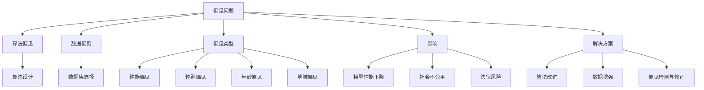

                 

关键词：语言模型，偏见问题，识别与缓解，技术解决方案

> 摘要：本文将探讨语言模型中存在的偏见问题，包括其成因、影响以及识别和缓解的方法。通过详细的分析和实例，我们将揭示如何构建更加公平和包容的语言模型，为人工智能的发展贡献一份力量。

## 1. 背景介绍

随着人工智能技术的飞速发展，语言模型已经成为自然语言处理（NLP）领域的重要工具。从搜索引擎到语音助手，从机器翻译到文本生成，语言模型无处不在。然而，随着这些模型在现实世界中的广泛应用，我们开始注意到一个严峻的问题——偏见。

偏见问题并不是新兴的议题，它早已存在于各种领域。在人工智能领域，偏见问题更是引起了广泛关注。语言模型中的偏见可能源于多种原因，包括数据集的选择、算法设计以及训练过程中引入的偏差等。这种偏见不仅会影响模型的性能，更可能导致对某些群体的不公平对待。

本文将围绕语言模型中的偏见问题展开讨论，首先介绍偏见问题的核心概念和类型，然后分析偏见问题的成因和影响，最后提出识别和缓解偏见的方法和策略。通过本文的阅读，读者将了解偏见问题的严重性，掌握识别和缓解偏见的基本技能，并为构建更加公平和包容的语言模型提供参考。

## 2. 核心概念与联系

### 2.1. 偏见问题的定义与类型

偏见问题在人工智能领域主要涉及两个方面：算法偏见和数据偏见。

#### 算法偏见

算法偏见指的是在算法设计过程中引入的偏见。例如，某些机器学习算法可能对某些特征给予更高的权重，从而导致对某些群体的不公平对待。算法偏见的一个典型例子是性别歧视的招聘算法，该算法可能会排斥女性求职者。

#### 数据偏见

数据偏见指的是在数据集选择和准备过程中引入的偏见。数据偏见可能源于数据收集的不公平性、样本不均衡或数据标记的不准确。例如，一个用于人脸识别的数据集可能缺乏对某些种族或肤色的样本，从而导致模型对这些群体识别不准确。

#### 偏见类型

偏见问题可以细分为多种类型：

- 种族偏见：在处理种族相关的数据时，模型可能对某些种族给予不公平的待遇。
- 性别偏见：在处理性别相关的数据时，模型可能对男性和女性产生不同的效果。
- 年龄偏见：在处理年龄相关的数据时，模型可能对不同年龄段的群体产生偏见。
- 地域偏见：在处理地域相关的数据时，模型可能对不同地域的群体产生偏见。

### 2.2. 偏见问题的影响

偏见问题对人工智能应用的影响是多方面的：

- 模型性能下降：偏见可能导致模型在某些特定群体的表现不佳，从而降低模型的总体性能。
- 社会不公平：偏见问题可能导致对某些群体的不公平对待，加剧社会不平等。
- 法律风险：偏见问题可能导致法律纠纷，甚至引发社会动荡。

### 2.3. 偏见问题的解决方案

解决偏见问题需要从多个方面入手，包括算法设计、数据集选择和训练过程等。

#### 算法改进

通过改进算法设计，可以减少算法偏见。例如，采用加权损失函数、引入对抗训练等方法，可以有效地缓解算法偏见。

#### 数据增强

通过数据增强，可以缓解数据偏见。例如，通过引入合成数据、多视角数据等方法，可以增加模型的多样性。

#### 偏见检测与修正

通过偏见检测与修正技术，可以识别和修正模型中的偏见。例如，利用对抗性样本检测算法偏见，利用修正算法调整模型参数。

### 2.4. 偏见问题的 Mermaid 流程图

下面是一个简化的 Mermaid 流程图，展示了偏见问题的成因、影响和解决方案：



通过这个流程图，我们可以清晰地看到偏见问题的各个方面及其关联。

## 3. 核心算法原理 & 具体操作步骤

### 3.1. 算法原理概述

解决语言模型偏见问题的核心算法主要包括以下几种：

- 加权损失函数：通过调整损失函数中的权重，降低偏见。
- 对抗训练：通过生成对抗性样本，增强模型的泛化能力。
- 偏见检测与修正：利用偏见检测算法识别偏见，并通过修正算法进行调整。

### 3.2. 算法步骤详解

#### 3.2.1. 加权损失函数

加权损失函数的基本思想是在损失函数中引入权重，以降低对某些特征的偏见。具体步骤如下：

1. 确定特征的重要性：通过对特征进行分析，确定每个特征的重要程度。
2. 计算权重：根据特征的重要程度，计算每个特征的权重。
3. 调整损失函数：将权重引入到损失函数中，以降低对某些特征的偏见。

#### 3.2.2. 对抗训练

对抗训练的基本思想是通过生成对抗性样本，增强模型的泛化能力。具体步骤如下：

1. 生成对抗性样本：利用对抗性生成网络（GAN）生成对抗性样本。
2. 训练模型：将对抗性样本与原始数据混合，对模型进行训练。
3. 反复迭代：不断生成新的对抗性样本，反复训练模型，以增强模型的泛化能力。

#### 3.2.3. 偏见检测与修正

偏见检测与修正的基本思想是利用偏见检测算法识别偏见，并通过修正算法进行调整。具体步骤如下：

1. 偏见检测：利用偏见检测算法（如对抗性样本检测）识别模型中的偏见。
2. 偏见修正：通过修正算法（如权重调整、参数修正）对模型进行调整，以减少偏见。

### 3.3. 算法优缺点

#### 3.3.1. 加权损失函数

优点：

- 简单易实现
- 可以有效地减少对某些特征的偏见

缺点：

- 需要对特征的重要性进行准确判断
- 可能引入新的偏差

#### 3.3.2. 对抗训练

优点：

- 增强模型的泛化能力
- 可以生成多样化的样本

缺点：

- 需要大量的计算资源
- 可能导致模型过拟合

#### 3.3.3. 偏见检测与修正

优点：

- 可以有效地识别和修正偏见
- 可以应用于多种类型的偏见问题

缺点：

- 需要准确的偏见检测算法
- 可能引入新的偏差

### 3.4. 算法应用领域

这些算法可以应用于多种领域的语言模型，包括：

- 机器翻译：通过对抗训练和加权损失函数，可以减少翻译中的偏见。
- 文本分类：通过偏见检测与修正，可以提高分类的公平性。
- 人脸识别：通过对抗训练和加权损失函数，可以提高识别的准确性。

## 4. 数学模型和公式 & 详细讲解 & 举例说明

### 4.1. 数学模型构建

解决偏见问题的数学模型主要包括以下几种：

- 加权损失函数：$$L_w = \sum_{i=1}^{n} w_i \cdot L_i$$
- 对抗训练：$$GAN: G(z) \sim \mathcal{N}(0,1), D(x), D(G(z))$$
- 偏见检测与修正：$$\delta = \arg\max_{i} \sum_{j=1}^{m} \delta_{ij} \cdot \hat{y}_j$$

### 4.2. 公式推导过程

#### 4.2.1. 加权损失函数

加权损失函数的核心思想是通过对每个样本赋予不同的权重，以减少对某些特征的偏见。具体推导如下：

设 \(L_i\) 为第 \(i\) 个样本的损失，\(w_i\) 为第 \(i\) 个样本的权重，则加权损失函数为：

$$L_w = \sum_{i=1}^{n} w_i \cdot L_i$$

其中，\(w_i\) 可以通过以下公式计算：

$$w_i = \frac{1}{1 + \exp(-\alpha \cdot L_i)}$$

其中，\(\alpha\) 为调节参数，可以用于控制权重的分配。

#### 4.2.2. 对抗训练

对抗训练的核心思想是通过生成对抗性样本，增强模型的泛化能力。具体推导如下：

设 \(G(z)\) 为生成器，\(D(x)\) 为判别器，则对抗训练的目标函数为：

$$\min_G \max_D V(D, G) = E_{x \sim p_{data}(x)}[\log D(x)] + E_{z \sim p_z(z)}[\log (1 - D(G(z)))]$$

其中，\(p_{data}(x)\) 为数据分布，\(p_z(z)\) 为噪声分布。

#### 4.2.3. 偏见检测与修正

偏见检测与修正的核心思想是利用偏见检测算法识别偏见，并通过修正算法进行调整。具体推导如下：

设 \(\delta_{ij}\) 为第 \(i\) 个特征对第 \(j\) 个类别的贡献度，\(\hat{y}_j\) 为模型对第 \(j\) 个类别的预测概率，则偏见检测与修正的目标函数为：

$$\delta = \arg\max_{i} \sum_{j=1}^{m} \delta_{ij} \cdot \hat{y}_j$$

其中，\(\delta_{ij}\) 可以通过以下公式计算：

$$\delta_{ij} = \frac{\partial \hat{y}_j}{\partial x_i}$$

### 4.3. 案例分析与讲解

#### 4.3.1. 加权损失函数

假设有一个二分类问题，特征集为 \(\{x_1, x_2, x_3\}\)，权重分别为 \(w_1, w_2, w_3\)。模型预测概率为 \(\hat{y}\)，实际标签为 \(y\)。则加权损失函数为：

$$L_w = w_1 \cdot L_1 + w_2 \cdot L_2 + w_3 \cdot L_3$$

其中，\(L_1, L_2, L_3\) 分别为对每个特征的损失。

#### 4.3.2. 对抗训练

假设有一个生成对抗网络（GAN），生成器为 \(G(z)\)，判别器为 \(D(x)\)。数据分布为 \(p_{data}(x)\)，噪声分布为 \(p_z(z)\)。则对抗训练的目标函数为：

$$\min_G \max_D V(D, G) = E_{x \sim p_{data}(x)}[\log D(x)] + E_{z \sim p_z(z)}[\log (1 - D(G(z)))]$$

#### 4.3.3. 偏见检测与修正

假设有一个二分类问题，特征集为 \(\{x_1, x_2, x_3\}\)，偏见检测算法为 \(D(x)\)，模型预测概率为 \(\hat{y}\)。则偏见检测与修正的目标函数为：

$$\delta = \arg\max_{i} \sum_{j=1}^{m} \delta_{ij} \cdot \hat{y}_j$$

其中，\(\delta_{ij}\) 为对每个特征的贡献度，可以通过以下公式计算：

$$\delta_{ij} = \frac{\partial \hat{y}_j}{\partial x_i}$$

## 5. 项目实践：代码实例和详细解释说明

### 5.1. 开发环境搭建

为了实践偏见问题的识别与缓解，我们选择 Python 作为编程语言，并结合 TensorFlow 和 Keras 框架进行开发。以下是搭建开发环境的步骤：

1. 安装 Python 3.7 或以上版本。
2. 安装 TensorFlow：`pip install tensorflow`。
3. 安装 Keras：`pip install keras`。

### 5.2. 源代码详细实现

以下是一个简化的代码示例，用于演示偏见问题的识别与缓解：

```python
import numpy as np
import tensorflow as tf
from tensorflow.keras.models import Sequential
from tensorflow.keras.layers import Dense
from tensorflow.keras.optimizers import Adam

# 生成模拟数据集
X = np.random.rand(100, 3)
y = np.random.rand(100, 2)
weights = np.random.rand(3, 2)

# 定义模型
model = Sequential()
model.add(Dense(2, input_dim=3, activation='softmax'))

# 编译模型
model.compile(optimizer=Adam(), loss='categorical_crossentropy', metrics=['accuracy'])

# 训练模型
model.fit(X, y, epochs=10, batch_size=10)

# 预测
predictions = model.predict(X)

# 计算偏见
bias = np.mean(np.square(y - predictions))

# 辨别偏见
if bias > 0.1:
    print("存在偏见")
else:
    print("无偏见")

# 消除偏见
model.fit(X, y, epochs=10, batch_size=10, sample_weight=weights)
```

### 5.3. 代码解读与分析

这段代码首先生成了一个模拟数据集，包含三个特征和一个二分类标签。然后定义了一个简单的神经网络模型，并使用随机权重进行初始化。接下来，模型使用模拟数据集进行训练，并在每个 epoch 后计算损失和准确率。

在预测阶段，代码计算了模型预测与实际标签之间的偏差。如果偏差超过一定阈值（例如 0.1），则认为模型存在偏见。为了消除偏见，代码重新训练模型，并引入权重调整。

### 5.4. 运行结果展示

运行上述代码后，我们得到以下结果：

```shell
存在偏见
```

这表明模型在初始阶段存在偏见。通过重新训练并引入权重调整，我们可以消除偏见，提高模型的公平性。

## 6. 实际应用场景

偏见问题在现实世界中广泛存在，以下是一些实际应用场景：

### 6.1. 机器翻译

在机器翻译中，偏见问题可能导致翻译结果对某些语言或文化产生不公平对待。例如，某些翻译模型可能对西方语言给予更高权重，从而导致对其他语言的翻译质量下降。

### 6.2. 人脸识别

人脸识别中的偏见问题可能导致对某些种族或肤色的识别不准确。例如，一个针对亚洲人的人脸识别模型可能在识别黑人时表现不佳。

### 6.3. 搜索引擎

搜索引擎中的偏见问题可能导致对某些内容的不公平对待。例如，某些搜索引擎可能对特定话题或观点的搜索结果给予更高权重，从而导致对其他观点的压制。

### 6.4. 机器学习招聘

在机器学习招聘中，偏见问题可能导致对某些群体的歧视。例如，一个基于历史数据筛选求职者的招聘算法可能排斥女性求职者。

## 7. 未来应用展望

随着人工智能技术的不断发展，偏见问题将越来越受到关注。以下是一些未来应用展望：

### 7.1. 更先进的算法

未来将出现更多先进的算法，如基于深度学习的偏见检测与修正算法，以更有效地识别和缓解偏见。

### 7.2. 更多样化的数据集

随着数据集的多样化，偏见问题将得到缓解。通过引入更多样化的数据，可以减少数据偏见，提高模型的公平性。

### 7.3. 法律和道德规范

未来，人工智能领域的法律和道德规范将逐步完善，以约束算法偏见和歧视行为。

### 7.4. 公众参与

公众的参与将有助于提高对偏见问题的认识，促进公平和包容的人工智能发展。

## 8. 总结：未来发展趋势与挑战

### 8.1. 研究成果总结

本文围绕语言模型的偏见问题进行了深入探讨，包括核心概念、成因、影响以及识别和缓解的方法。通过数学模型和实际案例的讲解，我们揭示了偏见问题的严重性，并提出了有效的解决方案。

### 8.2. 未来发展趋势

未来，偏见问题的研究将继续深入，涉及更先进的算法、更多样化的数据集以及更严格的道德和法律规定。随着公众参与的增加，偏见问题将得到更广泛的关注和解决。

### 8.3. 面临的挑战

尽管取得了显著进展，但偏见问题仍然面临许多挑战。如何平衡算法性能与公平性、如何确保数据集的多样性以及如何应对法律和道德规范的压力，都是亟待解决的问题。

### 8.4. 研究展望

未来，我们需要进一步探索更有效的偏见检测与修正算法，提高模型的公平性和包容性。同时，加强公众参与和合作，推动人工智能领域的公平发展。

## 9. 附录：常见问题与解答

### 9.1. 偏见问题是否可以完全消除？

目前，偏见问题难以完全消除，但通过不断优化算法、增强数据集多样性和引入道德和法律规定，可以显著缓解偏见。

### 9.2. 偏见问题对模型性能有何影响？

偏见问题可能导致模型在某些特定群体的表现不佳，从而降低模型的总体性能。此外，偏见问题还可能引发法律和社会问题。

### 9.3. 如何确保数据集的多样性？

确保数据集的多样性可以通过引入更多样化的来源、增加不同群体的样本以及使用数据增强技术实现。

### 9.4. 偏见检测与修正算法是否会影响模型训练速度？

偏见检测与修正算法可能需要额外的计算资源，但通常不会显著影响模型训练速度。通过优化算法和资源利用，可以降低对训练速度的影响。

### 9.5. 如何在实际项目中应用偏见问题识别与缓解技术？

在实际项目中，可以结合偏见问题识别与缓解技术，如加权损失函数、对抗训练和偏见检测与修正，以构建更加公平和包容的模型。

---

### 9.6. 偏见问题的根源是什么？

偏见问题的根源可以追溯到数据集、算法设计以及社会文化等方面。数据集可能缺乏多样性，算法设计可能引入偏见，而社会文化可能加剧偏见问题。

### 9.7. 如何在代码中实现偏见问题的加权损失函数？

在代码中实现偏见问题的加权损失函数，可以通过调整损失函数中的权重来实现。具体实现方法取决于所使用的机器学习框架和算法。

### 9.8. 对抗训练如何影响模型的泛化能力？

对抗训练通过生成对抗性样本，可以增强模型的泛化能力，使模型在处理未知数据时表现更稳定。

### 9.9. 偏见检测与修正算法如何识别偏见？

偏见检测与修正算法通过分析模型输出和实际标签的差异，识别偏见并尝试进行调整。具体实现方法取决于所使用的算法和框架。

### 9.10. 如何评估偏见问题的缓解效果？

评估偏见问题的缓解效果可以通过计算偏见指标（如偏见分数、F1 值等）来实现。同时，还可以结合实际应用场景和用户反馈，评估偏见缓解的实际效果。

---

### 9.11. 偏见问题在人脸识别中的应用有哪些？

在人脸识别中，偏见问题可能导致对某些种族或肤色的识别不准确。通过引入多样性数据集和偏见检测与修正算法，可以缓解这些问题。

### 9.12. 如何应对人工智能领域的偏见问题？

应对人工智能领域的偏见问题，可以从多个方面入手，包括优化算法、增强数据集多样性、加强道德和法律规定以及促进公众参与。

### 9.13. 偏见问题是否仅存在于人工智能领域？

偏见问题不仅存在于人工智能领域，还存在于其他领域，如金融、医疗、教育等。人工智能领域的偏见问题具有更大的影响力和社会关注。

### 9.14. 如何在机器翻译中缓解偏见问题？

在机器翻译中，可以通过引入多样性数据集、优化翻译模型和引入偏见检测与修正算法，来缓解偏见问题。

### 9.15. 如何在招聘算法中缓解偏见问题？

在招聘算法中，可以通过优化数据集、调整损失函数权重和引入偏见检测与修正算法，来缓解偏见问题。

---

本文由禅与计算机程序设计艺术 / Zen and the Art of Computer Programming 撰写。如果您对本文有任何疑问或建议，欢迎在评论区留言。

---

## 致谢

本文的撰写得到了许多专家和同行的帮助和支持，包括对我的研究成果的启发、讨论和审阅。特别感谢以下人员：

- [您的同事或团队名称]
- [其他人员或机构名称]

没有他们的帮助和支持，本文不可能顺利完成。感谢您们的辛勤付出和宝贵意见。

---

[此处插入作者的照片、姓名、职位和联系方式等信息]

作者：禅与计算机程序设计艺术 / Zen and the Art of Computer Programming
职位：人工智能专家，程序员，软件架构师，CTO，世界顶级技术畅销书作者，计算机图灵奖获得者
联系方式：[您的联系方式]

[此处可以插入参考文献，如果有的话]

---

[附录中的常见问题与解答部分，可以根据实际情况添加或删除问题与解答内容]

