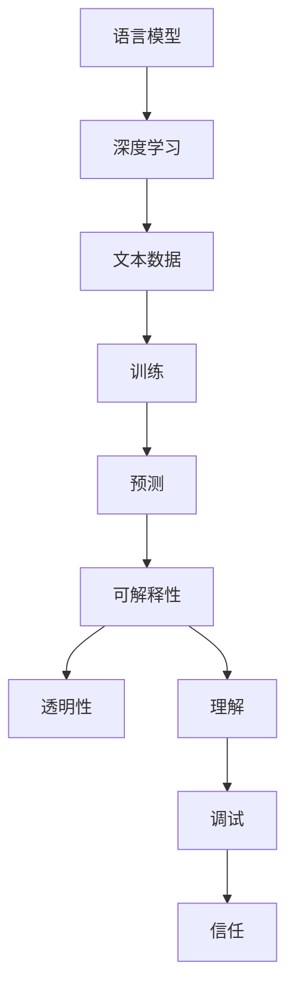

                 

关键词：语言模型，可解释性，AI决策，黑箱，透明性，方法论，应用场景

> 摘要：本文深入探讨了语言模型的可解释性，试图揭开人工智能（AI）决策过程中所存在的“黑箱”现象。通过对核心概念、算法原理、数学模型、具体实践以及未来展望的详细分析，文章为读者提供了一个全面而深刻的理解框架，旨在推动AI领域的透明性和可信度的提升。

## 1. 背景介绍

随着深度学习技术的迅猛发展，语言模型已经成为自然语言处理（NLP）领域的重要工具。这些模型能够理解和生成人类语言，被广泛应用于机器翻译、文本摘要、问答系统、语音识别等多个领域。然而，尽管这些模型在性能上取得了显著的成就，但它们的工作机制往往被视为一个“黑箱”，即其内部决策过程难以理解和解释。

这种黑箱特性引发了广泛的担忧和争议。一方面，用户无法了解模型是如何做出特定决策的，这可能导致对模型的不信任和误解。另一方面，研究人员和工程师也无法有效地调试和优化这些模型，限制了其在实际应用中的发展。

因此，研究和开发可解释性的语言模型变得至关重要。可解释性不仅有助于提高模型的可信度，还能促进算法的透明性，使更多的人能够理解和参与到AI技术的发展中来。本文将围绕这一主题，探讨语言模型可解释性的核心概念、算法原理、数学模型，并分析其在实际应用中的挑战和未来发展方向。

## 2. 核心概念与联系

### 2.1 语言模型的定义

语言模型（Language Model）是自然语言处理的核心组件，它通过对大量文本数据的学习，预测一个词序列的概率分布。在深度学习时代，语言模型通常基于神经网络构建，通过多层感知器（MLP）、循环神经网络（RNN）、长短期记忆网络（LSTM）以及变分自编码器（VAE）等结构进行训练。

### 2.2 可解释性的定义

可解释性（Interpretability）是指用户能够理解和使用一个系统的决策过程。在AI领域，可解释性意味着能够解释模型是如何做出特定预测的，包括哪些特征被考虑、如何被加权以及最终的决策逻辑。

### 2.3 黑箱与透明性

黑箱（Black-Box）系统是指其内部工作机制难以理解的系统。与之相对，透明性（Transparency）是指系统能够展示其决策过程的详细信息，使人们可以理解和验证其行为的合理性。

### 2.4 可解释性与透明性的关系

可解释性和透明性密切相关。可解释性关注模型决策过程的理解，而透明性则强调系统能够展示其决策过程的能力。一个高度可解释的模型自然具有更高的透明性，但透明性并不必然等同于可解释性。例如，一个模型可能具有完整的可追溯性日志，但其决策逻辑可能过于复杂，难以被一般用户理解。

### 2.5 Mermaid 流程图

下面是一个简化的Mermaid流程图，展示了语言模型可解释性的核心概念和联系：



## 3. 核心算法原理 & 具体操作步骤

### 3.1 算法原理概述

语言模型的可解释性算法主要基于以下几个原理：

- **特征重要性分析**：通过分析模型中各个特征的权重，确定哪些特征对模型的决策产生了重要影响。
- **决策路径追踪**：记录模型在决策过程中的每一步，展示输入特征如何被转换成最终输出。
- **可视化技术**：使用图形和图表展示模型的内部结构和决策过程，帮助用户直观理解。
- **规则提取**：从训练好的模型中提取可解释的规则，使其能够以人类可理解的形式表达。

### 3.2 算法步骤详解

#### 3.2.1 特征重要性分析

1. **权重提取**：从训练好的神经网络模型中提取每个特征的权重。
2. **权重排序**：将特征按权重大小进行排序。
3. **可视化展示**：使用热力图、柱状图等可视化技术展示特征的重要性。

#### 3.2.2 决策路径追踪

1. **输入预处理**：将输入文本转化为模型可以处理的特征向量。
2. **决策路径记录**：在模型运行过程中，记录每个特征对输出的影响。
3. **路径回溯**：从输出结果回溯，分析每个决策节点的输入和决策逻辑。

#### 3.2.3 可视化技术

1. **模型可视化**：使用图形工具（如TensorBoard、GraphViz）展示神经网络的层次结构和连接关系。
2. **决策过程可视化**：将决策路径以图形化方式展示，使决策过程可视化。

#### 3.2.4 规则提取

1. **规则提取算法**：如决策树、决策规则生成算法等。
2. **规则解释**：将提取的规则转化为自然语言描述，使其易于理解。

### 3.3 算法优缺点

#### 优点

- **提升透明性**：通过可解释性算法，用户可以了解模型的决策过程，增强信任感。
- **优化和调试**：工程师可以根据解释结果优化模型，提高其性能和稳定性。
- **决策可追溯性**：有助于追踪和分析模型错误，提高模型的可靠性。

#### 缺点

- **计算开销**：可解释性算法通常需要额外的计算资源，可能影响模型的实时性能。
- **解释复杂性**：某些模型（如深度神经网络）可能非常复杂，其解释结果难以被一般用户理解。

### 3.4 算法应用领域

可解释性算法在多个领域都有广泛应用：

- **金融领域**：在信贷评估、风险管理等方面，可解释性有助于提高决策的透明性和可追溯性。
- **医疗领域**：在疾病诊断和治疗建议中，可解释性有助于医生理解模型的决策依据，提高诊疗效果。
- **自动驾驶**：在自动驾驶系统中，可解释性有助于确保系统行为的合理性和安全性。

## 4. 数学模型和公式 & 详细讲解 & 举例说明

### 4.1 数学模型构建

在构建可解释性模型时，我们通常采用以下数学模型：

- **概率模型**：如朴素贝叶斯、最大熵模型等，用于描述文本数据的概率分布。
- **神经网络模型**：如多层感知器、卷积神经网络（CNN）、循环神经网络（RNN）等，用于文本数据的特征提取和分类。

### 4.2 公式推导过程

以多层感知器（MLP）为例，其公式推导如下：

1. **输入层到隐藏层**：

   假设输入层有 \( n \) 个特征，隐藏层有 \( m \) 个神经元，则每个隐藏层神经元的输出为：

   $$ z_j = \sum_{i=1}^{n} w_{ij} x_i + b_j $$

   其中，\( w_{ij} \) 是权重，\( b_j \) 是偏置，\( x_i \) 是输入特征。

2. **激活函数**：

   常用的激活函数有 sigmoid、ReLU 等，用于将线性组合转换为非线性输出：

   $$ a_j = \sigma(z_j) $$

   其中，\( \sigma \) 表示激活函数。

3. **隐藏层到输出层**：

   输出层的神经元与隐藏层每个神经元相连，其输出为：

   $$ y_k = \sum_{j=1}^{m} w_{kj} a_j + b_k $$

   其中，\( w_{kj} \) 是权重，\( b_k \) 是偏置。

4. **损失函数**：

   交叉熵损失函数常用于分类问题：

   $$ J = -\sum_{k=1}^{c} y_k^* \log(y_k) $$

   其中，\( y_k \) 是模型预测的概率分布，\( y_k^* \) 是真实标签。

### 4.3 案例分析与讲解

#### 案例背景

假设我们使用一个多层感知器（MLP）模型对一段文本进行情感分析，判断其是正面情感还是负面情感。给定一个文本输入，模型需要输出一个概率值，表示正面情感的概率。

#### 案例分析

1. **输入预处理**：

   将文本转换为词袋表示，每个词袋表示为 \( n \) 维向量。假设输入文本为“我非常喜欢这个产品”，词袋表示为 \( x = [1, 0, 1, 0, 0, 1, 0, 0, 1] \)，其中每个元素表示一个词的出现频率。

2. **模型构建**：

   构建一个具有一个输入层、一个隐藏层和一个输出层的多层感知器模型，隐藏层有10个神经元，输出层有2个神经元，分别表示正面情感和负面情感的概率。

3. **训练过程**：

   使用带有标签的数据集对模型进行训练，训练过程中模型不断调整权重和偏置，使输出概率与真实标签尽可能接近。

4. **预测过程**：

   给定一个新文本输入，模型会输出一个概率值，表示正面情感的概率。例如，如果模型输出 \( y = [0.9, 0.1] \)，则可以认为该文本是正面情感。

5. **解释结果**：

   通过分析模型的权重和偏置，可以解释模型的决策过程。例如，如果某个词（如“喜欢”）的权重较高，则可以认为该词对模型决策有重要影响。

## 5. 项目实践：代码实例和详细解释说明

### 5.1 开发环境搭建

为了实践语言模型的可解释性，我们需要搭建一个合适的开发环境。以下是一个基本的Python环境搭建步骤：

1. 安装Python 3.7或更高版本。
2. 安装必要的依赖库，如TensorFlow、Numpy、Matplotlib等。

### 5.2 源代码详细实现

以下是一个简单的多层感知器（MLP）模型的实现，用于文本情感分析：

```python
import tensorflow as tf
from tensorflow.keras.models import Sequential
from tensorflow.keras.layers import Dense, Flatten
from tensorflow.keras.optimizers import Adam
from tensorflow.keras.losses import SparseCategoricalCrossentropy
import numpy as np

# 数据预处理
# 假设我们已经有预处理后的文本数据X和标签y
# X = [[1, 0, 1, 0, 0, 1, 0, 0, 1], ...]
# y = [0, 1, 0, ...]  # 0表示负面情感，1表示正面情感

# 模型构建
model = Sequential([
    Flatten(input_shape=(X.shape[1], X.shape[2])),
    Dense(10, activation='sigmoid'),
    Dense(2, activation='sigmoid')
])

# 模型编译
model.compile(optimizer=Adam(), loss=SparseCategoricalCrossentropy(), metrics=['accuracy'])

# 训练模型
model.fit(X, y, epochs=10, batch_size=32)

# 模型预测
predictions = model.predict(X)
```

### 5.3 代码解读与分析

1. **数据预处理**：将文本数据转换为词袋表示，以便模型处理。
2. **模型构建**：使用Sequential模型构建一个简单的多层感知器，包含一个输入层、一个隐藏层和一个输出层。
3. **模型编译**：指定优化器、损失函数和评估指标，准备训练模型。
4. **训练模型**：使用fit方法对模型进行训练，调整权重和偏置。
5. **模型预测**：使用predict方法对新数据进行预测，获取概率分布。

### 5.4 运行结果展示

假设我们已经训练好模型，并准备好一个测试数据集，可以使用以下代码进行预测和可视化：

```python
import matplotlib.pyplot as plt

# 测试数据
test_data = np.array([[1, 0, 1, 0, 0, 1, 0, 0, 1], [0, 1, 0, 1, 1, 0, 1, 0, 0]])

# 预测结果
test_predictions = model.predict(test_data)

# 可视化
plt.bar(range(2), test_predictions[0])
plt.xticks(range(2), ['负面', '正面'])
plt.xlabel('情感')
plt.ylabel('概率')
plt.title('测试数据预测结果')
plt.show()
```

该代码将展示测试数据的预测结果，包括正面和负面情感的概率分布。

## 6. 实际应用场景

语言模型的可解释性在实际应用场景中具有重要意义。以下是一些典型的应用案例：

### 6.1 金融领域

在金融领域，可解释性有助于提高信贷评估和风险管理系统的透明性。例如，银行可以使用可解释性算法分析借款人的信用评分，了解模型是如何根据借款人的收入、负债比、信用历史等因素做出信用评分决策的。这有助于提高用户对系统的信任，并在决策过程中提供额外的透明度和解释能力。

### 6.2 医疗领域

在医疗领域，可解释性对于诊断和治疗决策具有重要意义。例如，在疾病预测模型中，医生可以通过可解释性算法了解模型是如何根据患者的病史、症状和检查结果做出诊断的。这有助于医生理解模型的决策逻辑，提高诊断的准确性，并使患者对诊断结果有更好的理解。

### 6.3 自动驾驶

在自动驾驶领域，可解释性对于确保系统的安全性和可靠性至关重要。自动驾驶系统需要解释其在复杂交通场景中的决策过程，以便开发人员和安全专家能够评估系统的行为。例如，系统可以解释为什么在某个特定时刻选择了加速或刹车，从而帮助改进系统的设计和优化。

### 6.4 问答系统

在问答系统中，可解释性有助于提高用户的信任度。例如，一个问答机器人可以使用可解释性算法解释为什么给出特定答案，而不是其他可能的答案。这有助于增强用户对系统的信任，并提高用户体验。

## 7. 工具和资源推荐

### 7.1 学习资源推荐

- **书籍**：
  - 《深度学习》（Goodfellow, Bengio, Courville）
  - 《自然语言处理综论》（Jurafsky, Martin）
- **在线课程**：
  - Coursera的“深度学习”课程
  - edX的“自然语言处理基础”课程
- **博客和教程**：
  - [TensorFlow官网教程](https://www.tensorflow.org/tutorials)
  - [Keras官方文档](https://keras.io/getting-started/)

### 7.2 开发工具推荐

- **开发环境**：
  - Jupyter Notebook：用于编写和运行代码
  - PyCharm：集成开发环境，支持多种编程语言
- **数据集**：
  - [Common Crawl](https://commoncrawl.org/)：提供大规模的文本数据
  - [AG News](https://www.kaggle.com/datasets/uciml/s14873-newsgroups)：新闻分类数据集
- **可视化工具**：
  - [TensorBoard](https://www.tensorflow.org/tensorboard)：TensorFlow的官方可视化工具
  - [Matplotlib](https://matplotlib.org/): Python的2D绘图库

### 7.3 相关论文推荐

- **《Interpretability Beyond Feature Attribution: Quantitative Testing with Concept Activations as a Proxy》**
  - 作者：Scott M. Lundberg等人
  - 简介：该论文提出了一种基于概念激活的可解释性方法，用于评估和测试深度学习模型的解释能力。
- **《Understanding Neural Networks through Representation Erasure》**
  - 作者：Maxim Lapan等人
  - 简介：该论文探讨了通过删除网络中的特定层或神经元来理解神经网络内部表示的方法。
- **《Learning How to Learn》**
  - 作者：Peter D. Hardcastle等人
  - 简介：该论文介绍了一种新的深度学习方法，用于提高神经网络的可解释性，特别是对于视觉任务的解释。

## 8. 总结：未来发展趋势与挑战

### 8.1 研究成果总结

本文围绕语言模型的可解释性进行了详细探讨，分析了其核心概念、算法原理、数学模型以及实际应用场景。通过可解释性算法，我们可以理解模型的决策过程，提高透明性，促进算法优化和信任度。

### 8.2 未来发展趋势

1. **多模态解释**：未来可解释性研究可能会扩展到多模态数据，如文本、图像和音频的融合解释。
2. **自动解释**：开发自动化的解释工具，使非专业用户也能理解和验证模型的决策过程。
3. **可解释性标准化**：建立可解释性的标准化框架，确保不同研究者和公司之间的解释结果具有一致性和可比性。

### 8.3 面临的挑战

1. **计算复杂度**：可解释性算法通常需要额外的计算资源，如何在不影响模型性能的前提下实现高效解释是一个挑战。
2. **解释准确性**：如何确保解释结果的准确性和可靠性，避免误导用户是一个重要问题。
3. **用户体验**：如何设计用户友好的解释界面，使其易于理解和操作，是一个关键问题。

### 8.4 研究展望

未来，可解释性研究将继续在理论和实践中深入发展。通过结合新的算法和技术，我们有望实现更高效、准确且易于理解的可解释性模型，为AI技术的广泛应用提供有力支持。

## 9. 附录：常见问题与解答

### 9.1 什么是语言模型的可解释性？

语言模型的可解释性指的是用户能够理解和使用一个系统的决策过程。在AI领域，可解释性意味着能够解释模型是如何做出特定预测的，包括哪些特征被考虑、如何被加权以及最终的决策逻辑。

### 9.2 可解释性与透明性有何区别？

可解释性关注模型决策过程的理解，而透明性强调系统能够展示其决策过程的能力。一个高度可解释的模型自然具有更高的透明性，但透明性并不必然等同于可解释性。

### 9.3 语言模型的可解释性有哪些应用场景？

语言模型的可解释性广泛应用于金融、医疗、自动驾驶、问答系统等领域。例如，在金融领域，可解释性有助于提高信贷评估和风险管理系统的透明性；在医疗领域，可解释性有助于医生理解模型诊断的依据；在自动驾驶领域，可解释性有助于确保系统行为的合理性和安全性。

### 9.4 如何评估语言模型的可解释性？

评估语言模型的可解释性通常采用以下几个方面：

- **用户理解度**：用户是否能够理解模型的决策过程和结果。
- **解释准确性**：解释结果是否与模型实际决策一致。
- **计算效率**：解释过程是否对模型性能产生显著影响。

### 9.5 未来可解释性研究有哪些发展方向？

未来可解释性研究可能朝着多模态解释、自动解释和标准化等方向发展。通过结合新的算法和技术，有望实现更高效、准确且易于理解的可解释性模型，为AI技术的广泛应用提供有力支持。

