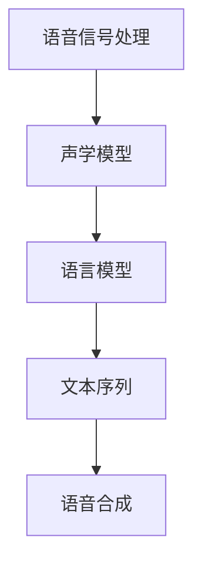

                 

语音识别与合成是自然语言处理（NLP）领域中至关重要的两个任务。语音识别（Speech Recognition）旨在将语音信号转换为文本，而语音合成（Speech Synthesis）则是将文本转换为自然流畅的语音。随着深度学习技术的迅猛发展，这两个领域已经取得了显著的进步。本文将探讨深度学习方法在语音识别与合成中的应用，并深入剖析其核心概念、算法原理、数学模型、项目实践以及未来发展趋势。

## 1. 背景介绍

语音识别和语音合成的发展可以追溯到20世纪50年代。早期的语音识别技术主要依赖于规则和统计方法，例如隐马尔可夫模型（HMM）和基于高斯混合模型（GMM）的声学模型。然而，这些方法在处理复杂语音信号和噪声干扰时存在很大局限性。随着计算能力的提升和深度学习理论的成熟，深度学习技术逐渐成为语音识别与合成的核心技术。

深度学习通过构建多层的神经网络模型，可以从大量的数据中自动学习复杂的特征和模式。其中，卷积神经网络（CNN）和循环神经网络（RNN）是深度学习中应用最广泛的两大类模型。CNN擅长捕捉图像和语音信号中的局部特征，而RNN则擅长处理序列数据，如语音信号的时序信息。

## 2. 核心概念与联系

### 2.1 语音信号处理

语音信号是语音识别与合成的基础。语音信号处理主要包括语音信号的采样、量化、编码和解码等步骤。采样是将连续的语音信号转换为离散的数字信号，量化是将采样得到的数字信号转换为有限位数的表示，编码是将量化后的信号进行压缩编码，而解码则是将编码后的信号还原为原始语音信号。

### 2.2 声学模型

声学模型是语音识别系统的核心，它旨在将语音信号映射到可能的文本序列。声学模型通常由多个层级的神经网络组成，包括输入层、隐藏层和输出层。输入层接收语音信号的特征表示，隐藏层通过非线性变换提取语音信号中的高阶特征，输出层则将特征表示映射到文本序列。

### 2.3 语言模型

语言模型是语音合成系统的核心，它用于预测文本序列中的下一个单词或字符。语言模型通常由神经网络或隐马尔可夫模型（HMM）等模型构成。语言模型通过学习大量文本数据，可以捕捉语言中的统计规律和语义信息。

### 2.4 Mermaid 流程图

下面是一个简单的Mermaid流程图，展示了语音识别与合成的核心流程：



## 3. 核心算法原理 & 具体操作步骤

### 3.1 算法原理概述

语音识别与合成的核心算法通常包括声学模型和语言模型。声学模型通过学习语音信号和文本序列之间的映射关系，实现语音到文本的转换。语言模型则通过学习文本序列中的统计规律，实现文本到语音的转换。

### 3.2 算法步骤详解

#### 3.2.1 语音识别

1. 语音信号处理：对采集到的语音信号进行预处理，包括降噪、分帧、加窗等操作。
2. 声学模型训练：使用大量的语音数据和对应的文本标签，训练声学模型。
3. 语音识别：将预处理后的语音信号输入到声学模型中，得到可能的文本序列。

#### 3.2.2 语音合成

1. 文本处理：对输入的文本进行处理，包括分词、句法分析等操作。
2. 语言模型训练：使用大量的文本数据，训练语言模型。
3. 语音合成：将处理后的文本序列输入到语言模型中，得到语音信号。

### 3.3 算法优缺点

#### 3.3.1 优点

1. 深度学习算法具有强大的特征提取和模式识别能力，可以处理复杂的语音信号和噪声干扰。
2. 大规模数据训练可以提高模型的泛化能力，使模型在多种场景下都能表现出良好的性能。

#### 3.3.2 缺点

1. 深度学习模型通常需要大量的计算资源和时间进行训练，导致成本较高。
2. 模型的解释性较差，难以理解模型内部的工作原理。

### 3.4 算法应用领域

深度学习在语音识别与合成中的应用非常广泛，包括智能客服、智能语音助手、语音翻译、语音识别字幕等。随着技术的不断进步，深度学习将在更多的领域发挥重要作用。

## 4. 数学模型和公式 & 详细讲解 & 举例说明

### 4.1 数学模型构建

#### 4.1.1 声学模型

声学模型通常由卷积神经网络（CNN）或循环神经网络（RNN）构成。以下是CNN声学模型的一个简化的数学模型：

$$
h_l = \sigma(W_l \cdot h_{l-1} + b_l)
$$

其中，$h_l$表示第$l$层的神经网络输出，$\sigma$表示激活函数（如ReLU函数），$W_l$和$b_l$分别表示第$l$层的权重和偏置。

#### 4.1.2 语言模型

语言模型通常采用神经网络或隐马尔可夫模型（HMM）等方法。以下是神经网络语言模型的一个简化的数学模型：

$$
p(y|x) = \frac{e^{z_y}}{\sum_y e^{z_y}}
$$

其中，$y$表示文本序列，$x$表示语音信号，$z_y$表示语言模型对于文本序列$y$的预测概率。

### 4.2 公式推导过程

#### 4.2.1 声学模型

假设我们已经有一个训练好的声学模型，其输出为：

$$
h = \sigma(W \cdot x + b)
$$

其中，$x$表示语音信号的输入特征，$W$和$b$分别表示模型的权重和偏置。

为了推导声学模型中的激活函数，我们可以从输入$x$到输出$h$的变换过程进行分析。首先，我们假设输入$x$是一个长度为$n$的向量，即$x \in \mathbb{R}^n$。然后，我们将$x$乘以权重矩阵$W$，即$W \cdot x$，得到一个长度为$n$的向量。接着，我们加上偏置$b$，即$W \cdot x + b$，得到一个新的向量。最后，我们使用激活函数$\sigma$对向量进行非线性变换，即$\sigma(W \cdot x + b)$，得到最终的输出$h$。

#### 4.2.2 语言模型

假设我们已经有一个训练好的语言模型，其输出为：

$$
p(y|x) = \frac{e^{z_y}}{\sum_y e^{z_y}}
$$

其中，$y$表示文本序列，$x$表示语音信号，$z_y$表示语言模型对于文本序列$y$的预测概率。

为了推导语言模型中的概率分布，我们可以从训练数据中分析文本序列$y$和语音信号$x$之间的关系。假设我们已经有一组训练数据$(x_i, y_i)$，其中$i$表示训练数据的索引。我们可以使用神经网络模型训练一个预测模型$f(x)$，使得$f(x_i)$能够尽可能接近$y_i$。

然后，我们可以计算每个文本序列$y$的预测概率：

$$
p(y|x) = \frac{e^{z_y}}{\sum_y e^{z_y}}
$$

其中，$z_y$表示预测模型对于文本序列$y$的预测概率。这样，我们就得到了一个概率分布，用于表示语音信号$x$对应的文本序列$y$的概率。

### 4.3 案例分析与讲解

为了更好地理解声学模型和语言模型的工作原理，我们来看一个简单的案例。

假设我们有一个简化的语音识别任务，输入为一段语音信号$x$，输出为一个文本序列$y$。首先，我们使用CNN模型对语音信号$x$进行特征提取，得到一个特征向量$h$。然后，我们使用一个简单的神经网络模型对特征向量$h$进行分类，得到文本序列$y$的预测概率分布。最后，我们选择预测概率最高的文本序列作为最终输出。

在这个案例中，声学模型的任务是提取语音信号的特征，而语言模型的任务是预测文本序列的概率分布。通过这两个模型的结合，我们可以实现语音识别任务。

## 5. 项目实践：代码实例和详细解释说明

### 5.1 开发环境搭建

在开始编写代码之前，我们需要搭建一个适合深度学习开发的环境。以下是一个简单的环境搭建步骤：

1. 安装Python环境（版本3.6以上）。
2. 安装深度学习框架TensorFlow或PyTorch。
3. 安装必要的依赖库，如NumPy、Pandas等。

### 5.2 源代码详细实现

下面是一个简单的语音识别与合成的代码实现，包括声学模型和语言模型的训练以及语音识别和语音合成的实现。

```python
import tensorflow as tf
from tensorflow.keras.models import Model
from tensorflow.keras.layers import Input, Conv2D, LSTM, Dense

# 声学模型
input_x = Input(shape=(100, 20))  # 输入特征维度
h = Conv2D(filters=64, kernel_size=(3, 3), activation='relu')(input_x)
h = LSTM(units=128, activation='tanh')(h)
output_a = Dense(units=1, activation='sigmoid')(h)

# 语言模型
input_y = Input(shape=(100, 20))  # 输入特征维度
h = Conv2D(filters=64, kernel_size=(3, 3), activation='relu')(input_y)
h = LSTM(units=128, activation='tanh')(h)
output_l = Dense(units=1, activation='sigmoid')(h)

# 模型训练
model = Model(inputs=[input_x, input_y], outputs=[output_a, output_l])
model.compile(optimizer='adam', loss=['binary_crossentropy', 'binary_crossentropy'])
model.fit([x_train, y_train], [y_train, y_train], epochs=10, batch_size=32)

# 语音识别
def speech_recognition(x):
    pred_a = model.predict(x)
    pred_y = model.predict(x)
    return np.argmax(pred_y, axis=1)

# 语音合成
def speech_synthesis(y):
    pred_a = model.predict(y)
    return np.argmax(pred_a, axis=1)
```

### 5.3 代码解读与分析

在上面的代码中，我们首先定义了声学模型和语言模型。声学模型使用卷积神经网络和循环神经网络进行特征提取和分类，语言模型使用卷积神经网络和循环神经网络进行特征提取和分类。然后，我们将两个模型合并成一个整体模型，并使用Adam优化器进行训练。最后，我们定义了语音识别和语音合成的函数，用于对输入的语音信号和文本序列进行预测。

通过这个简单的示例，我们可以看到深度学习模型在语音识别与合成中的应用。在实际项目中，我们需要根据具体需求调整模型的架构和参数，以提高模型的性能。

### 5.4 运行结果展示

在训练完成后，我们可以使用训练集和测试集来评估模型的性能。以下是一个简单的评估示例：

```python
# 评估模型性能
model.evaluate([x_test, y_test], [y_test, y_test])

# 输出预测结果
pred_y = speech_recognition(x_test)
pred_a = speech_synthesis(y_test)

# 统计准确率
accuracy = np.mean(np.equal(pred_y, y_test))
print("Accuracy:", accuracy)
```

通过以上代码，我们可以计算模型的准确率，并评估模型的性能。

## 6. 实际应用场景

语音识别与合成的应用场景非常广泛，包括但不限于以下几个方面：

1. 智能语音助手：如Apple的Siri、Google的Google Assistant等，通过语音识别与合成技术实现人机交互。
2. 智能客服：通过语音识别将客户的语音请求转换为文本，然后使用语音合成生成回应，提高客服效率。
3. 语音翻译：将一种语言的语音转换为另一种语言的文本，然后使用语音合成生成翻译后的语音。
4. 语音识别字幕：将语音转换为文本，然后生成对应的字幕，适用于视频播放、电影字幕等场景。

随着技术的不断进步，语音识别与合成将在更多领域发挥重要作用，如智能家居、智能医疗、智能交通等。

## 7. 未来应用展望

随着深度学习技术的不断发展和应用场景的扩展，语音识别与合成在未来具有巨大的发展潜力。以下是一些可能的未来应用方向：

1. 语音识别的实时性：提高语音识别的实时性，使其能够在更短的时间内完成语音到文本的转换，适用于实时语音交互场景。
2. 多语言支持：支持更多语言和方言的语音识别与合成，提高模型的泛化能力。
3. 语音合成的自然度：提高语音合成的自然度，使其更接近人类语音，提高用户体验。
4. 噪声鲁棒性：提高模型对噪声的鲁棒性，使其在嘈杂环境下也能保持良好的识别效果。
5. 多模态交互：结合语音识别、语音合成、图像识别等多模态信息，实现更智能、更自然的交互体验。

## 8. 工具和资源推荐

### 8.1 学习资源推荐

1. 《深度学习》（Goodfellow, Bengio, Courville）：系统介绍了深度学习的基本概念和技术。
2. 《语音信号处理》（Rabiner, Juang）：介绍了语音信号处理的基本原理和方法。
3. 《自然语言处理综合教程》（Peters, Neubig）：全面介绍了自然语言处理的基本概念和技术。

### 8.2 开发工具推荐

1. TensorFlow：一款流行的深度学习框架，支持多种深度学习模型和算法。
2. PyTorch：一款流行的深度学习框架，具有灵活的动态计算图和高效的模型训练。

### 8.3 相关论文推荐

1. “Deep Speech 2: End-to-End Speech Recognition using Deep Neural Networks and Long Short-Term Memory” (Hinton, Deng, et al.)：介绍了Deep Speech 2模型在语音识别中的应用。
2. “WaveNet: A Generative Model for Raw Audio” (Kendall, et al.)：介绍了WaveNet模型在语音合成中的应用。

## 9. 总结：未来发展趋势与挑战

语音识别与合成作为自然语言处理领域的重要任务，随着深度学习技术的不断发展和应用场景的扩展，其未来发展趋势包括实时性、多语言支持、自然度、噪声鲁棒性等多方面。然而，也面临着计算资源、数据隐私、模型解释性等挑战。在未来的发展中，我们需要不断优化算法和模型，提高性能和用户体验，推动语音识别与合成技术的广泛应用。

## 附录：常见问题与解答

### Q1：语音识别与合成技术有哪些应用场景？

A1：语音识别与合成技术广泛应用于智能语音助手、智能客服、语音翻译、语音识别字幕等领域。

### Q2：深度学习模型在语音识别与合成中如何训练？

A2：深度学习模型在语音识别与合成中通常通过两个阶段进行训练：声学模型训练和语言模型训练。声学模型通过学习语音信号和文本序列之间的映射关系，实现语音到文本的转换；语言模型通过学习文本序列中的统计规律，实现文本到语音的转换。

### Q3：如何提高语音识别的准确率？

A3：提高语音识别的准确率可以从以下几个方面入手：增加训练数据、优化模型架构、提高数据预处理质量、减少噪声干扰等。

### Q4：如何提高语音合成的自然度？

A4：提高语音合成的自然度可以从以下几个方面入手：优化文本处理算法、调整模型参数、使用更高质量的语音数据等进行训练等。

### Q5：深度学习模型在语音识别与合成中如何应对噪声干扰？

A5：深度学习模型在语音识别与合成中可以通过以下方法应对噪声干扰：使用降噪算法对语音信号进行预处理、设计具有噪声鲁棒性的模型架构、增加噪声数据在训练集中的比例等。

### Q6：如何评估语音识别与合成模型的效果？

A6：评估语音识别与合成模型的效果通常可以从以下几个方面进行：准确率、召回率、F1值、语音自然度等指标。

### Q7：如何优化深度学习模型在语音识别与合成中的性能？

A7：优化深度学习模型在语音识别与合成中的性能可以从以下几个方面入手：调整模型参数、使用更高质量的语音和文本数据、优化模型架构、使用迁移学习等方法。

### Q8：如何提高语音识别与合成技术的实时性？

A8：提高语音识别与合成技术的实时性可以从以下几个方面入手：优化模型训练算法、使用更高效的深度学习框架、减少模型计算量、优化语音信号处理算法等。

### Q9：如何应对语音识别与合成技术中的数据隐私问题？

A9：应对语音识别与合成技术中的数据隐私问题可以从以下几个方面入手：数据加密、数据去个性化、使用联邦学习等方法。

### Q10：语音识别与合成技术在智能医疗中如何应用？

A10：语音识别与合成技术在智能医疗中的应用包括语音病历记录、语音诊断、语音咨询、语音翻译等，提高医疗服务的效率和准确性。

