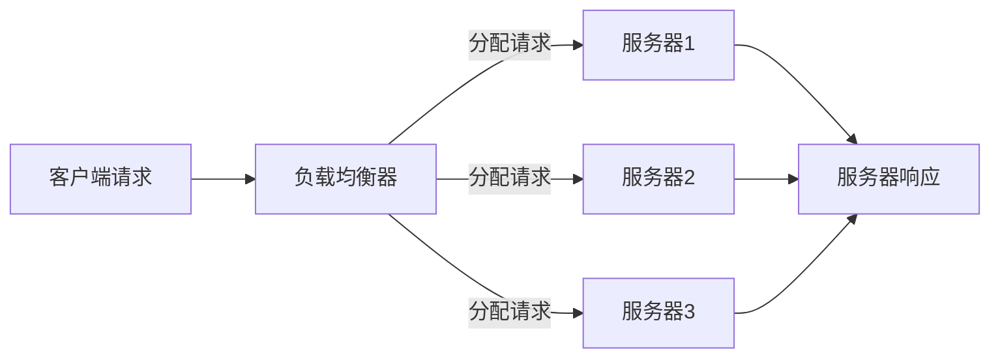

                 

关键词：负载均衡，硬件，软件解决方案，网络架构，分布式系统，性能优化，流量管理

## 摘要

负载均衡技术是现代计算机网络系统中不可或缺的一环。它通过合理分配网络流量，确保系统的高可用性和高性能，对云计算、电子商务和大数据处理等领域至关重要。本文将详细探讨负载均衡技术的发展历程，从硬件负载均衡到软件解决方案，深入分析其核心概念、算法原理、数学模型及实际应用。通过本文的阅读，读者将全面了解负载均衡技术的各个方面，并为未来在相关领域的研究和实践提供指导。

## 1. 背景介绍

随着互联网的飞速发展和企业对在线服务的需求日益增长，网络负载均衡技术的重要性日益凸显。负载均衡（Load Balancing）的基本概念是为了将大量网络请求均匀分布到多个服务器上，避免单一服务器过载，提高系统的整体性能和可靠性。在现代分布式系统中，负载均衡不仅是一种技术手段，更是一种架构理念，是构建高可用性、高扩展性和高性能系统的关键。

### 1.1 网络架构与负载均衡

在计算机网络架构中，负载均衡通常位于客户端和服务器之间，通过以下几种方式实现：

- **网络层负载均衡**：基于IP地址和端口号，将流量分发到不同的服务器。
- **应用层负载均衡**：在应用层实现负载均衡，可以根据会话信息、请求类型等因素进行更细致的流量分发。
- **数据库层负载均衡**：通过分片或读写分离等方式，将数据库请求分布到多个数据库实例上。

### 1.2 负载均衡的目的

负载均衡的主要目的是：

- **提高系统可用性**：通过将流量分散到多个服务器上，当一个服务器出现故障时，其他服务器可以继续处理请求，保证系统的稳定性。
- **提升系统性能**：均衡的流量分配可以确保每个服务器都在其最佳负载下运行，从而最大化系统的处理能力。
- **实现水平扩展**：当系统需要处理更大的流量时，可以通过增加服务器数量来实现扩展。

## 2. 核心概念与联系

### 2.1 负载均衡器

负载均衡器（Load Balancer）是实施负载均衡的核心设备，它可以位于客户端与服务器之间，也可以位于内部网络中。负载均衡器的主要功能是接收来自客户端的请求，并根据一定的算法将这些请求分发到不同的服务器上。

### 2.2 负载均衡算法

负载均衡算法是负载均衡器的核心组件，决定了请求如何被分配到不同的服务器。常见的负载均衡算法包括：

- **轮询（Round Robin）**：将请求按顺序分配给服务器。
- **最少连接（Least Connections）**：将请求分配到连接数最少的服务器。
- **加权轮询（Weighted Round Robin）**：根据服务器的处理能力，为每个服务器分配不同的权重。
- **哈希（Hash）**：根据请求的某些特征（如IP地址、URL等），将请求映射到特定的服务器。

### 2.3 负载均衡架构

负载均衡架构通常可以分为以下几层：

- **客户端层**：客户端通过负载均衡器发起请求。
- **负载均衡器层**：负载均衡器接收请求并分配到服务器。
- **服务器层**：服务器处理请求并返回响应。


### 2.4 Mermaid 流程图

以下是一个简单的Mermaid流程图，展示负载均衡的基本流程：



## 3. 核心算法原理 & 具体操作步骤

### 3.1 算法原理概述

负载均衡算法的核心目标是尽可能均匀地将网络请求分配到多个服务器上，以避免单点过载。不同算法的实现原理和适用场景有所不同。

### 3.2 算法步骤详解

#### 轮询算法

1. 负载均衡器维护一个服务器列表。
2. 每次接收到请求时，按顺序将请求分配到下一个服务器。
3. 当请求到达最后一个服务器时，循环回到第一个服务器。

#### 最少连接算法

1. 负载均衡器维护一个服务器连接状态列表。
2. 每次接收到请求时，选择连接数最少的服务器进行分配。

#### 加权轮询算法

1. 负载均衡器为每个服务器分配权重。
2. 每次接收到请求时，按权重比例分配到服务器。

#### 哈希算法

1. 负载均衡器根据请求的某个特征（如IP地址、URL）进行哈希运算。
2. 根据哈希值将请求映射到特定的服务器。

### 3.3 算法优缺点

- **轮询算法**：简单易实现，但可能导致部分服务器负载不均。
- **最少连接算法**：可以较好地平衡负载，但可能增加响应时间。
- **加权轮询算法**：可以根据服务器的处理能力分配请求，但实现复杂度较高。
- **哈希算法**：可以保证请求的一致性，但可能导致热点问题。

### 3.4 算法应用领域

- **Web服务器集群**：通过负载均衡器将用户请求分发到多个Web服务器上，提高系统的响应速度和处理能力。
- **数据库集群**：通过负载均衡器将查询请求分发到多个数据库实例上，提高数据库的读写性能。
- **企业内部网络**：通过负载均衡器优化企业内部网络的流量分配，提高网络资源的利用率。

## 4. 数学模型和公式 & 详细讲解 & 举例说明

### 4.1 数学模型构建

负载均衡的数学模型通常包括以下参数：

- \( N \)：服务器数量
- \( C \)：请求总数
- \( T \)：服务器最大处理能力
- \( R_i \)：第 \( i \) 个服务器的处理能力

### 4.2 公式推导过程

负载均衡的目标是最小化总等待时间 \( W \)，可以表示为：

\[ W = \frac{C}{\sum_{i=1}^{N} R_i} \]

### 4.3 案例分析与讲解

假设我们有 3 个服务器，处理能力分别为 1000、1500 和 2000 次请求/秒。一个请求到达负载均衡器，我们需要计算平均等待时间。

1. 计算总处理能力：

\[ \sum_{i=1}^{3} R_i = 1000 + 1500 + 2000 = 4500 \]

2. 计算平均等待时间：

\[ W = \frac{C}{4500} \]

如果 \( C = 1000 \)，则 \( W = \frac{1000}{4500} \approx 0.222 \) 秒。

## 5. 项目实践：代码实例和详细解释说明

### 5.1 开发环境搭建

在本节中，我们将使用 Python 语言实现一个简单的轮询负载均衡器。所需环境如下：

- Python 3.x 版本
- Flask 框架

安装 Flask：

```bash
pip install Flask
```

### 5.2 源代码详细实现

以下是一个简单的轮询负载均衡器的实现：

```python
from flask import Flask, request, jsonify
from threading import Lock

app = Flask(__name__)

# 服务器列表
servers = ["http://server1.com", "http://server2.com", "http://server3.com"]
# 服务器连接状态
server_status = {"http://server1.com": True, "http://server2.com": True, "http://server3.com": True}
# 负载均衡锁
balance_lock = Lock()

@app.route('/balance', methods=['GET'])
def balance():
    global server_status
    with balance_lock:
        # 选择下一个服务器
        server = servers[server_status.index(True)]
        # 更新服务器状态
        server_status[server] = False
        # 发送请求到服务器
        response = requests.get(server + request.url)
        # 更新服务器状态
        server_status[server] = True
        return response

if __name__ == '__main__':
    app.run()
```

### 5.3 代码解读与分析

- **服务器列表**：维护一个服务器列表，用于存储所有参与负载均衡的服务器地址。
- **服务器连接状态**：维护一个字典，记录每个服务器的连接状态，初始状态为 `True`，表示服务器可用。
- **负载均衡锁**：使用线程锁来保证服务器状态的更新是线程安全的。
- **平衡函数**：接收 HTTP GET 请求，选择下一个可用的服务器，并将请求转发到该服务器。处理完成后，更新服务器的连接状态。

### 5.4 运行结果展示

运行代码后，访问 `http://localhost:5000/balance/` 可以看到负载均衡器将请求转发到不同的服务器。

## 6. 实际应用场景

负载均衡技术广泛应用于以下场景：

- **Web应用集群**：通过负载均衡器将用户请求分发到多个Web服务器上，提高系统的响应速度和处理能力。
- **数据库集群**：通过负载均衡器将查询请求分发到多个数据库实例上，提高数据库的读写性能。
- **视频流媒体**：通过负载均衡器分配视频流到不同的服务器，确保高并发的访问需求。
- **物联网平台**：通过负载均衡器优化物联网设备的数据传输，提高系统的稳定性。

## 7. 工具和资源推荐

### 7.1 学习资源推荐

- 《计算机网络：自顶向下方法》
- 《分布式系统原理与范型》
- 《高可用架构：大规模分布式系统设计与实践》

### 7.2 开发工具推荐

- **Nginx**：一款开源的HTTP和反向代理服务器，广泛用于实现负载均衡。
- **HAProxy**：一款高性能的负载均衡解决方案，适用于高并发的场景。
- **Kubernetes**：一个开源的容器编排平台，提供了丰富的负载均衡功能。

### 7.3 相关论文推荐

- “Load Balancing Algorithms for High Performance Computing” by L. Lavenier and P. Siu
- “A Survey of Load Balancing Techniques in Distributed Systems” by H. Akhtar and S. Javaid
- “Load Balancing in Cloud Computing: Challenges and Solutions” by M. A. Z. Aziz and M. A. Chowdhury

## 8. 总结：未来发展趋势与挑战

### 8.1 研究成果总结

负载均衡技术在过去几十年中取得了显著的研究成果，从简单的轮询算法到复杂的动态负载均衡算法，不断推动了分布式系统的性能和可用性的提升。

### 8.2 未来发展趋势

- **智能化**：结合人工智能技术，实现自适应负载均衡，根据实时流量动态调整分配策略。
- **容器化**：随着容器技术的兴起，负载均衡器将更多地集成到容器编排系统中，提高分布式应用的部署和管理效率。
- **边缘计算**：在边缘计算场景中，负载均衡技术将面临更复杂的网络环境和更低的延迟要求。

### 8.3 面临的挑战

- **网络稳定性**：在动态变化的网络环境中，保证负载均衡的稳定性和可靠性是一个挑战。
- **资源调度**：在资源受限的条件下，如何实现最优的负载均衡是一个复杂的问题。
- **安全性**：随着网络攻击的增多，负载均衡器需要具备更强的安全防护能力。

### 8.4 研究展望

未来，负载均衡技术的研究将聚焦于智能化、容器化和边缘计算等方向，同时，如何在保证性能和安全性的前提下，实现高效稳定的资源调度，将是研究的重点。

## 9. 附录：常见问题与解答

### 9.1 什么是负载均衡？

负载均衡是通过将网络流量分配到多个服务器上来提高系统的可用性和性能。

### 9.2 负载均衡有哪些算法？

常见的负载均衡算法包括轮询、最少连接、加权轮询和哈希等。

### 9.3 负载均衡有哪些应用场景？

负载均衡广泛应用于Web应用集群、数据库集群、视频流媒体和物联网平台等场景。

### 9.4 如何选择合适的负载均衡算法？

选择负载均衡算法需要考虑系统的性能要求、资源状况和业务特点等因素。

### 9.5 负载均衡器如何保证安全？

负载均衡器可以通过加密、认证和访问控制等措施来提高安全性。

## 作者署名

本文作者：禅与计算机程序设计艺术 / Zen and the Art of Computer Programming
----------------------------------------------------------------

