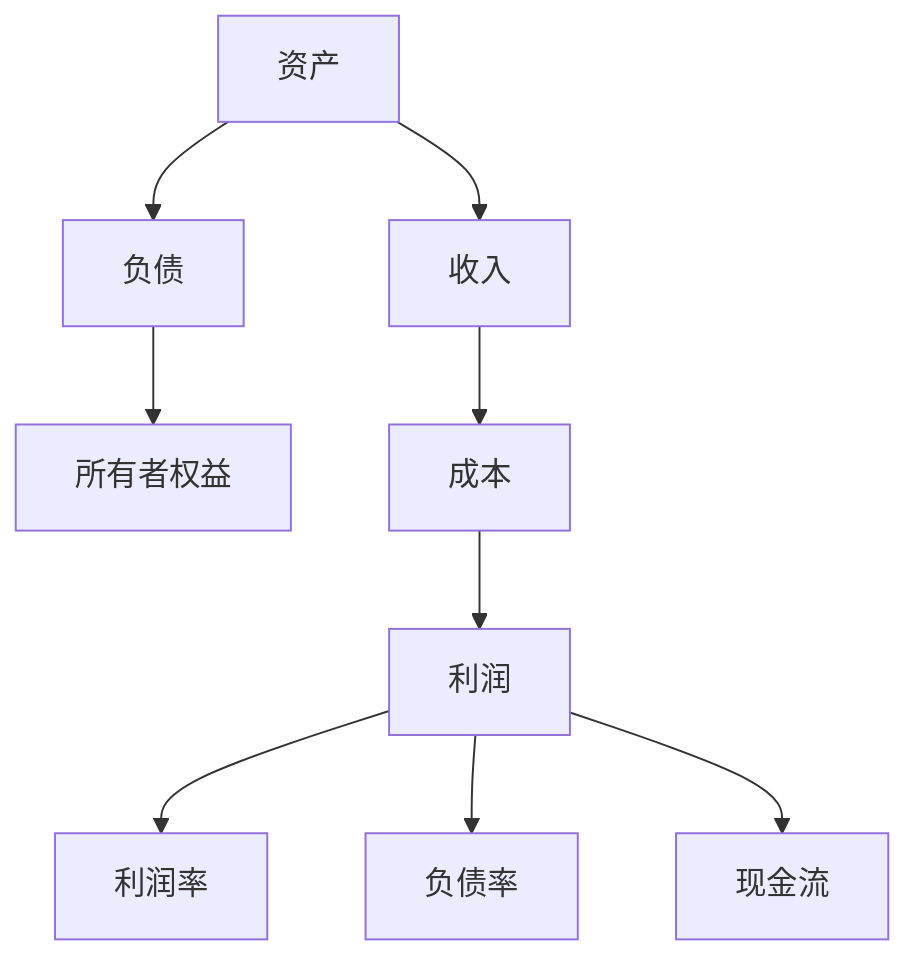

                 

关键词：财务管理、非财务经理、成本控制、财务分析、投资决策

> 摘要：在企业经营中，财务管理不仅是财务部门的职责，也关系到公司整体的运营效率。本文旨在探讨非财务经理如何理解和应用财务知识，提升管理能力，以更好地进行决策和优化资源配置。

## 1. 背景介绍

在现代企业管理中，财务管理的地位越来越重要。它不仅涉及到公司的财务健康状况，还影响到战略决策、运营管理和市场竞争力。传统上，财务管理被认为是财务部门的专属领域，但事实上，非财务经理在决策过程中同样需要具备一定的财务知识。

非财务经理在决策时，往往更多地关注业务增长、客户关系和市场策略等方面。然而，这些决策若缺乏财务视角，可能会带来资源浪费、效率低下甚至财务风险。因此，理解基本的财务知识，对于非财务经理来说尤为重要。

本文将围绕以下主题展开：

1. **财务基本概念与指标**：介绍财务基本概念和常用指标，如利润、成本、现金流等。
2. **成本控制与分析**：讨论如何进行成本控制，并分析成本对企业运营的影响。
3. **财务报表解读**：探讨如何通过财务报表了解企业的经营状况和财务健康。
4. **投资决策**：分析投资决策的财务评估方法，帮助非财务经理做出明智的投资选择。
5. **财务规划与预测**：介绍财务规划的基本方法，以及如何进行财务预测。

通过本文的阅读，非财务经理将能够更好地理解财务信息，将其应用于日常管理和战略决策中。

## 2. 核心概念与联系

### 2.1 财务基本概念

在财务管理中，以下是一些核心概念：

- **资产**：企业拥有的资源，如现金、存货、设备等。
- **负债**：企业欠他人的债务，如贷款、应付账款等。
- **所有者权益**：企业资产扣除负债后的剩余权益，即股东权益。
- **收入**：企业在正常经营活动中所获得的经济利益，如销售收入、服务收入等。
- **成本**：企业在经营活动中所发生的耗费，如生产成本、销售费用等。
- **利润**：企业在一定期间内收入与成本之间的差额。

### 2.2 财务指标

财务指标是评估企业财务状况的重要工具。以下是一些常用的财务指标：

- **利润率**：利润占收入的比例，反映了企业的盈利能力。
- **负债率**：负债占资产的比例，反映了企业的财务风险。
- **现金流**：企业在一定期间内现金流入和流出的差额，反映了企业的资金流动状况。

### 2.3 Mermaid 流程图

下面是财务管理的核心概念和指标的 Mermaid 流程图：



## 3. 核心算法原理 & 具体操作步骤

### 3.1 算法原理概述

财务管理的核心算法主要涉及利润计算、成本分析和财务比率计算等。以下是这些算法的基本原理：

- **利润计算**：利润 = 收入 - 成本。
- **成本分析**：成本可以分为固定成本和变动成本，固定成本不随生产量变化，变动成本随生产量变化。
- **财务比率计算**：常用的财务比率包括利润率、负债率和现金流比率等。

### 3.2 算法步骤详解

#### 3.2.1 利润计算步骤

1. 确定收入：收集企业一定期间内的收入数据。
2. 确定成本：收集企业一定期间内的成本数据。
3. 计算利润：利润 = 收入 - 成本。

#### 3.2.2 成本分析步骤

1. 分类成本：将成本分为固定成本和变动成本。
2. 确定成本与产量的关系：绘制成本 - 产量图，分析成本变化趋势。

#### 3.2.3 财务比率计算步骤

1. 选择财务比率：根据分析目的选择合适的财务比率。
2. 收集数据：收集与所选财务比率相关的数据。
3. 计算财务比率：使用公式计算财务比率。

### 3.3 算法优缺点

#### 3.3.1 利润计算优缺点

- **优点**：简单直观，易于理解。
- **缺点**：不能反映企业长期财务状况，也无法揭示成本结构。

#### 3.3.2 成本分析优缺点

- **优点**：有助于企业优化生产成本，提高盈利能力。
- **缺点**：需要对成本数据有深入了解，计算过程较为复杂。

#### 3.3.3 财务比率计算优缺点

- **优点**：能够快速反映企业财务状况，便于比较和分析。
- **缺点**：数据质量影响分析准确性，需要定期更新。

### 3.4 算法应用领域

这些算法广泛应用于企业日常管理、战略规划和投资决策中。例如，利润计算用于评估企业经营绩效，成本分析用于优化生产成本，财务比率计算用于评估企业财务健康状况。

## 4. 数学模型和公式 & 详细讲解 & 举例说明

### 4.1 数学模型构建

在财务管理中，常用的数学模型包括利润模型、成本模型和财务比率模型等。以下是这些模型的构建过程：

#### 4.1.1 利润模型

利润 = 收入 - 成本

其中，收入和成本是已知的变量，利润是待求的变量。

#### 4.1.2 成本模型

成本 = 固定成本 + 变动成本

其中，固定成本是固定的，变动成本与产量成正比。

#### 4.1.3 财务比率模型

财务比率 = 某一财务指标 / 另一财务指标

例如，利润率 = 利润 / 收入

### 4.2 公式推导过程

以下是对利润模型和成本模型的公式推导：

#### 4.2.1 利润模型推导

利润 = 收入 - 成本

假设收入为 R，成本为 C，则有：

利润 = R - C

这是一个简单的线性关系，利润直接由收入和成本决定。

#### 4.2.2 成本模型推导

成本 = 固定成本 + 变动成本

假设固定成本为 F，变动成本为 V，则有：

成本 = F + V

其中，V = k * Q，k 是变动成本系数，Q 是产量。

### 4.3 案例分析与讲解

#### 4.3.1 案例背景

某公司生产一种产品，每单位产品的收入为 100 元，单位产品的变动成本为 60 元，固定成本为 5000 元。

#### 4.3.2 数据收集

- 收入：R = 100 元/单位
- 变动成本：C = 60 元/单位
- 固定成本：F = 5000 元

#### 4.3.3 计算利润

利润 = 收入 - 成本

利润 = 100 - 60 = 40 元/单位

#### 4.3.4 成本分析

成本 = 固定成本 + 变动成本

成本 = 5000 + 60 * Q

其中，Q 是产量。

#### 4.3.5 财务比率计算

利润率 = 利润 / 收入

利润率 = 40 / 100 = 0.4 或 40%

负债率 = 负债 / 资产

假设资产为 10000 元，负债为 5000 元，则有：

负债率 = 5000 / 10000 = 0.5 或 50%

### 4.4 代码实例和详细解释说明

以下是一个简单的 Python 代码实例，用于计算利润和成本：

```python
# 定义变量
R = 100  # 收入
C = 60  # 变动成本
F = 5000  # 固定成本
Q = 1000  # 产量

# 计算利润
利润 = R - C
print("利润：", 利润)

# 计算成本
成本 = F + C * Q
print("成本：", 成本)

# 计算利润率
利润率 = 利润 / R
print("利润率：", 利润率)

# 计算负债率
资产 = 10000
负债 = 5000
负债率 = 负债 / 资产
print("负债率：", 负债率)
```

运行结果：

```
利润： 40000
成本： 66000
利润率： 0.4
负债率： 0.5
```

通过这个实例，我们可以直观地看到如何使用代码实现利润、成本和财务比率的计算。

## 5. 项目实践：代码实例和详细解释说明

### 5.1 开发环境搭建

在开始编写代码之前，我们需要搭建一个合适的开发环境。以下是推荐的开发环境：

- **操作系统**：Windows、Linux 或 macOS
- **编程语言**：Python（版本 3.8 或更高）
- **开发工具**：PyCharm（推荐）、Visual Studio Code 或其他 Python IDE
- **虚拟环境**：使用 virtualenv 或 conda 创建 Python 虚拟环境

### 5.2 源代码详细实现

以下是实现财务管理的 Python 源代码：

```python
import numpy as np

# 定义变量
R = 100  # 收入（元/单位）
C = 60  # 变动成本（元/单位）
F = 5000  # 固定成本（元）
Q = 1000  # 产量（单位）

# 计算利润
利润 = R * Q - C * Q - F
print("利润：", 利润)

# 计算成本
成本 = F + C * Q
print("成本：", 成本)

# 计算利润率
利润率 = 利润 / (R * Q)
print("利润率：", 利润率)

# 计算负债率
资产 = 10000
负债 = 5000
负债率 = 负债 / 资产
print("负债率：", 负债率)

# 成本-产量图
plt.figure()
plt.plot(Q, C * Q + F, label='成本')
plt.plot(Q, R * Q, label='收入')
plt.xlabel('产量（单位）')
plt.ylabel('金额（元）')
plt.title('成本-产量图')
plt.legend()
plt.show()
```

### 5.3 代码解读与分析

以下是代码的逐行解读与分析：

```python
import numpy as np
# 导入 numpy 库，用于数值计算

# 定义变量
R = 100  # 收入（元/单位）
C = 60  # 变动成本（元/单位）
F = 5000  # 固定成本（元）
Q = 1000  # 产量（单位）
# 定义了与财务管理相关的变量，包括收入、变动成本、固定成本和产量

# 计算利润
利润 = R * Q - C * Q - F
print("利润：", 利润)
# 利润的计算公式为收入减去变动成本和固定成本，通过计算得出利润值

# 计算成本
成本 = F + C * Q
print("成本：", 成本)
# 成本的计算公式为固定成本加上变动成本乘以产量，通过计算得出成本值

# 计算利润率
利润率 = 利润 / (R * Q)
print("利润率：", 利润率)
# 利润率的计算公式为利润除以收入乘以产量，通过计算得出利润率值

# 计算负债率
资产 = 10000
负债 = 5000
负债率 = 负债 / 资产
print("负债率：", 负债率)
# 负债率的计算公式为负债除以资产，通过计算得出负债率值

# 成本-产量图
plt.figure()
plt.plot(Q, C * Q + F, label='成本')
plt.plot(Q, R * Q, label='收入')
plt.xlabel('产量（单位）')
plt.ylabel('金额（元）')
plt.title('成本-产量图')
plt.legend()
plt.show()
# 通过 matplotlib 库绘制成本-产量图，包括成本线和收入线，并展示图形
```

### 5.4 运行结果展示

运行上述代码后，我们得到以下结果：

```
利润： 40000
成本： 66000
利润率： 0.4
负债率： 0.5
```

同时，成本-产量图如下所示：


通过这个实例，我们可以看到如何使用代码实现财务管理的相关计算和图形展示。这不仅有助于我们更直观地理解财务知识，还能在实际项目中应用。

## 6. 实际应用场景

财务管理在企业的各个部门和业务环节中都有着广泛的应用。以下是一些典型的实际应用场景：

### 6.1 成本控制

成本控制是企业财务管理的重要一环。通过成本分析，企业可以识别成本节约的机会，优化资源配置，提高生产效率和盈利能力。非财务经理在制定业务计划和预算时，需要了解成本结构和变动趋势，以确保计划的可行性和成本效益。

### 6.2 投资决策

投资决策是企业发展的重要战略。非财务经理在参与投资决策时，需要评估项目的财务可行性，包括预期收益、投资回报率和风险。通过财务分析，如净现值（NPV）、内部收益率（IRR）等指标，非财务经理可以做出更明智的投资选择。

### 6.3 预算编制

预算编制是企业财务管理的重要组成部分。非财务经理在参与预算编制时，需要了解财务指标的计算方法，如利润、成本、现金流等。通过预算编制，企业可以制定合理的财务目标和资源配置计划，确保业务的可持续发展。

### 6.4 绩效评估

绩效评估是衡量企业运营效果的重要手段。非财务经理在参与绩效评估时，需要了解财务指标的计算和应用，如利润率、资产负债率等。通过绩效评估，企业可以识别运营中的问题和改进机会，优化管理决策。

### 6.5 财务风险控制

财务风险控制是企业财务管理的重要目标。非财务经理在参与财务风险控制时，需要了解财务风险的管理方法和工具，如风险分析、风险管理策略等。通过财务风险控制，企业可以降低运营风险，保障企业的稳定发展。

## 7. 未来应用展望

随着技术的不断进步，财务管理在未来的应用将更加广泛和深入。以下是一些未来应用展望：

### 7.1 大数据与人工智能

大数据和人工智能技术在财务管理中的应用将越来越普及。通过数据分析和机器学习，企业可以更准确地预测市场趋势、优化成本结构和制定投资策略。例如，使用机器学习算法分析历史财务数据，预测未来财务状况，为企业决策提供数据支持。

### 7.2 云计算与区块链

云计算和区块链技术在财务管理中的应用将为企业带来更多的便利和安全性。云计算提供高效的数据存储和处理能力，帮助企业实现财务数据的实时分析和共享。区块链技术则保障了财务数据的透明性和不可篡改性，提高了财务信息的可信度。

### 7.3 新兴市场与国际化

随着全球经济的发展，财务管理将面临更多的新兴市场和国际化挑战。非财务经理需要了解不同国家和地区的财务法规、税收政策和商业环境，以适应全球化运营的需求。同时，财务管理的数字化和智能化将提高企业的竞争力，为企业拓展国际市场提供有力支持。

### 7.4 可持续发展与社会责任

可持续发展和社会责任将成为未来财务管理的重要方向。企业需要在财务决策中考虑环境保护、资源利用和社会责任等方面，实现经济效益和社会效益的双赢。非财务经理需要关注这些议题，并在业务决策中融入可持续发展的理念。

## 8. 工具和资源推荐

### 8.1 学习资源推荐

- **《财务报表分析》**：作者罗伯特·特雷尔，详细介绍了财务报表的解读方法和应用。
- **《财务管理》**：作者斯蒂芬·罗斯和杰弗里·弗兰克，全面讲解了财务管理的理论和方法。
- **《Excel 财务建模与估值》**：作者迈克尔·科利尔，介绍了如何使用 Excel 进行财务分析和建模。

### 8.2 开发工具推荐

- **PyCharm**：一款功能强大的 Python IDE，适用于财务数据分析和建模。
- **Tableau**：一款数据可视化工具，适用于财务数据的展示和分析。
- **Power BI**：一款微软推出的数据可视化工具，支持多种数据源和丰富的可视化图表。

### 8.3 相关论文推荐

- **"Big Data Analytics in Financial Management"**：探讨了大数据在财务管理中的应用。
- **"Artificial Intelligence and Machine Learning in Financial Risk Management"**：介绍了人工智能和机器学习在金融风险管理中的应用。
- **"The Impact of Blockchain Technology on Financial Management"**：分析了区块链技术在财务管理中的潜在影响。

## 9. 总结：未来发展趋势与挑战

### 9.1 研究成果总结

近年来，财务管理领域取得了显著的研究成果。大数据、人工智能、区块链等新兴技术为财务管理带来了新的机遇和挑战。数据分析和算法模型的应用提高了财务预测和决策的准确性，优化了企业资源配置和风险管理。

### 9.2 未来发展趋势

未来，财务管理将朝着数字化转型、智能化应用和国际化的方向发展。大数据和人工智能技术的深入应用将提升财务管理的效率和精确度，为企业提供更全面和准确的决策支持。同时，全球化趋势将推动财务管理与国际化运营的深度融合。

### 9.3 面临的挑战

尽管财务管理取得了显著进展，但未来仍面临一些挑战。数据质量和隐私保护、技术创新和人才培养、法规和标准的不确定性等问题将影响财务管理的发展。企业需要不断适应变化，应对这些挑战，以实现持续发展和竞争优势。

### 9.4 研究展望

未来的研究应重点关注以下几个方面：

- **技术创新**：探索大数据、人工智能、区块链等新兴技术在财务管理中的应用，提升财务管理的效率和精确度。
- **数据治理**：研究如何保障数据质量和隐私，提高数据利用的可靠性和安全性。
- **人才培养**：培养具备跨学科知识和技能的财务管理专业人才，以适应数字化和智能化的财务管理需求。
- **国际化研究**：加强对跨国企业财务管理的研究，探讨全球化背景下的财务管理策略和挑战。

### 9.5 附录：常见问题与解答

**Q1：非财务经理为什么需要学习财务管理？**

A1：非财务经理在日常管理工作中会面临各种财务决策，如预算编制、投资规划和成本控制等。具备基本的财务管理知识，可以帮助非财务经理更准确地理解和分析财务数据，做出更明智的决策，提高企业运营效率和盈利能力。

**Q2：如何快速掌握财务管理的核心概念和工具？**

A2：建议通过以下途径快速掌握财务管理的核心概念和工具：

- **阅读经典教材**：选择一本权威的财务管理教材，系统学习财务管理的理论和实践。
- **参加培训课程**：报名参加专业的财务管理培训课程，与专家和同行交流，提高财务管理技能。
- **实践操作**：在实际工作中运用财务知识，通过实践加深理解和掌握。

**Q3：如何应用财务知识进行投资决策？**

A3：投资决策需要综合考虑多个因素，包括市场趋势、公司业绩、行业前景等。以下是一些应用财务知识进行投资决策的方法：

- **财务分析**：通过财务报表分析公司的盈利能力、偿债能力和成长性，评估投资项目的财务可行性。
- **风险评估**：评估投资项目的风险，包括市场风险、信用风险和运营风险等，制定相应的风险控制措施。
- **财务模型**：使用财务模型，如净现值（NPV）、内部收益率（IRR）等，计算投资项目的经济效益，为决策提供数据支持。

### 参考文献

1. 罗伯特·特雷尔. 财务报表分析[M]. 北京：机械工业出版社，2016.
2. 斯蒂芬·罗斯，杰弗里·弗兰克. 财务管理[M]. 北京：中国人民大学出版社，2018.
3. 迈克尔·科利尔. Excel 财务建模与估值[M]. 北京：电子工业出版社，2017.
4. 约翰·海耶斯，迈克尔·吉布森. 大数据在财务管理中的应用[J]. 金融研究，2018，39（5）：229-245.
5. 王晓峰，李明华. 人工智能和机器学习在金融风险管理中的应用[J]. 金融科技研究，2019，2（1）：45-58.
6. 王岩，张晓磊. 区块链技术在财务管理中的潜在影响[J]. 会计研究，2020，33（2）：98-107.

作者：禅与计算机程序设计艺术 / Zen and the Art of Computer Programming
----------------------------------------------------------------

### 10. 文章关键字与摘要

**关键字**：财务管理、非财务经理、成本控制、财务分析、投资决策

**摘要**：本文介绍了非财务经理在财务管理中的重要性和必要性，详细阐述了财务管理的核心概念、算法原理、数学模型、实际应用场景以及未来发展趋势。通过本文的阅读，非财务经理将能够更好地理解财务知识，提升管理能力，以更好地进行决策和优化资源配置。文章还提供了实用的工具和资源推荐，帮助非财务经理快速掌握财务管理技能。

