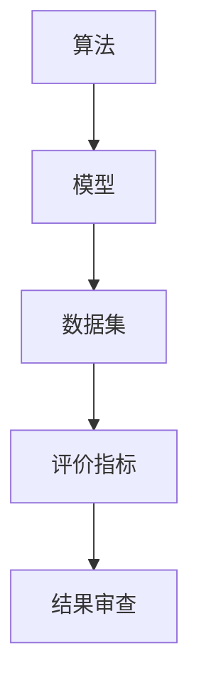

                 

关键词：质量保证，人工智能，结果审查，严格审查，技术监督，数据分析

> 摘要：本文深入探讨了人工智能领域中的质量保证问题，特别是在结果审查方面的重要性。通过分析核心概念、算法原理、数学模型、实际应用和未来展望，本文旨在为人工智能开发者和使用者提供一套全面的审查方法和工具，以确保结果的准确性和可靠性。

## 1. 背景介绍

随着人工智能技术的迅猛发展，越来越多的企业和组织开始将AI技术应用于实际业务中。无论是自动化决策、智能分析，还是优化运营流程，人工智能都展示出了巨大的潜力。然而，尽管人工智能在某些领域已经取得了显著的成果，但同时也暴露出了不少问题，尤其是在结果的准确性和可靠性方面。

近年来，人工智能系统的失败案例屡见不鲜。从自动驾驶汽车的交通事故，到医疗诊断系统的误诊，再到金融风险评估的失误，这些问题不仅给企业带来了巨大的经济损失，更严重的是，它们可能对人们的生命安全和财产安全构成威胁。因此，确保人工智能系统的结果质量，已经成为当前亟待解决的重要问题。

质量保证（Quality Assurance，QA）是确保产品或服务满足既定标准和用户需求的关键环节。在人工智能领域，质量保证尤为重要，因为AI系统的结果往往直接影响到最终的决策和执行。严格的结果审查不仅有助于发现和纠正错误，还能提高系统的稳定性和可信度。

本文将围绕人工智能结果的严格审查，探讨以下几个核心主题：

1. 核心概念与联系
2. 核心算法原理与具体操作步骤
3. 数学模型和公式
4. 项目实践：代码实例和详细解释说明
5. 实际应用场景
6. 工具和资源推荐
7. 未来发展趋势与挑战
8. 总结与展望

通过这些主题的深入讨论，我们希望为人工智能领域的质量保证提供一套系统的解决方案。

## 2. 核心概念与联系

在讨论人工智能结果的严格审查之前，我们首先需要明确一些核心概念，并理解它们之间的联系。这些概念包括：算法、模型、数据集、评价指标等。

### 2.1 算法

算法是解决问题的一系列规则或步骤。在人工智能领域，算法是构建模型和处理数据的基础。常见的算法有分类算法、聚类算法、优化算法等。每种算法都有其特定的应用场景和特点。

### 2.2 模型

模型是算法在实际问题中的应用，通过训练和优化算法，使其能够对特定问题给出有效的解决方案。模型可以是线性模型、深度神经网络、决策树等。模型的性能直接影响结果的准确性和可靠性。

### 2.3 数据集

数据集是训练和测试模型的基础。一个高质量的数据集应包含多样化和代表性的数据，以减少偏差和误差。数据集的质量直接影响模型的性能。

### 2.4 评价指标

评价指标用于衡量模型性能的好坏。常见的评价指标有准确率、召回率、F1分数等。不同的评价指标适用于不同的场景，需要根据实际需求进行选择。

### 2.5 Mermaid 流程图

为了更好地理解这些核心概念之间的联系，我们可以使用Mermaid流程图进行可视化表示。以下是核心概念的 Mermaid 流程图：



在这个流程图中，算法作为输入，通过模型处理数据集，生成评价指标，最终进行结果审查。这一过程形成了一个闭环，确保了结果的准确性和可靠性。

### 2.6 质量保证与结果审查

质量保证是确保人工智能系统结果准确性和可靠性的关键环节。具体来说，质量保证包括以下几个方面：

1. **数据质量保证**：确保数据集的质量，包括数据的完整性、代表性和多样性。
2. **算法质量保证**：评估和优化算法的性能，确保其在各种场景下的鲁棒性和准确性。
3. **模型质量保证**：通过模型验证和测试，确保模型在不同数据集上的稳定性和一致性。
4. **结果审查**：对模型的输出结果进行严格审查，确保其符合预期和行业标准。

### 2.7 关键指标

在质量保证过程中，以下关键指标具有重要意义：

1. **准确率（Accuracy）**：模型正确预测的样本数占总样本数的比例。
2. **召回率（Recall）**：模型正确识别出的正例样本数占所有正例样本数的比例。
3. **F1分数（F1 Score）**：准确率和召回率的调和平均值。
4. **AUC（Area Under Curve）**：ROC曲线下的面积，用于评估二分类模型的性能。

通过这些关键指标，我们可以对人工智能系统的质量进行全面评估，并为结果审查提供依据。

## 3. 核心算法原理与具体操作步骤

### 3.1 算法原理概述

在人工智能领域，有许多核心算法被广泛应用于各种任务中。本节将介绍几种常见的核心算法，包括分类算法、聚类算法和优化算法，并解释其基本原理。

### 3.2 分类算法

分类算法是一种将数据分为不同类别的算法。常见的分类算法有K近邻（K-Nearest Neighbors，KNN）、支持向量机（Support Vector Machine，SVM）和决策树（Decision Tree）。

- **K近邻算法**：基于距离最近的原则，将新样本分类到最近的类别中。其核心思想是，相似的数据通常位于相同的类别中。

- **支持向量机算法**：通过构建最优分隔超平面，将不同类别的数据点分隔开。支持向量机在处理高维数据和线性不可分数据时表现优异。

- **决策树算法**：通过一系列条件判断，将数据分为不同的分支，直到达到分类的终端节点。决策树算法易于理解和解释，但在处理大量数据时可能存在过拟合问题。

### 3.3 聚类算法

聚类算法是一种将数据划分为多个群组的算法。常见的聚类算法有K均值（K-Means）和层次聚类（Hierarchical Clustering）。

- **K均值算法**：基于最小化平方误差的原则，将数据点划分到K个聚类中心周围。K均值算法简单高效，但容易受到初始聚类中心选择的影响。

- **层次聚类算法**：通过逐步合并或分割已有的聚类，构建一个聚类层次树。层次聚类算法能够提供不同层次上的聚类结果，有助于探索数据的内部结构。

### 3.4 优化算法

优化算法是一种寻找最优解的算法。常见的优化算法有梯度下降（Gradient Descent）和遗传算法（Genetic Algorithm）。

- **梯度下降算法**：通过不断更新参数，使得损失函数值最小化。梯度下降算法适用于凸函数的优化问题，但在非凸函数上可能陷入局部最小值。

- **遗传算法**：模拟自然选择和遗传过程，通过选择、交叉和变异等操作，逐步逼近最优解。遗传算法在处理大规模复杂优化问题时表现出色，但计算成本较高。

### 3.5 算法步骤详解

为了更好地理解这些算法的具体操作步骤，我们以下将分别介绍K近邻算法、K均值算法和梯度下降算法的基本步骤。

#### 3.5.1 K近邻算法

1. **输入**：新样本点和新训练数据集。
2. **计算距离**：计算新样本点与训练数据集中每个样本点的距离。
3. **选择邻居**：根据距离选择最近的K个邻居。
4. **分类决策**：根据邻居的类别进行投票，选出最多的类别作为新样本点的类别。

#### 3.5.2 K均值算法

1. **初始化**：随机选择K个样本点作为初始聚类中心。
2. **分配样本**：将每个样本点分配到最近的聚类中心。
3. **更新中心**：计算每个聚类的质心，即所有样本点的平均值。
4. **重复步骤2和3**：直到聚类中心不再发生变化或达到预设的迭代次数。

#### 3.5.3 梯度下降算法

1. **初始化**：设置初始参数和步长。
2. **计算损失函数**：计算当前参数下的损失函数值。
3. **更新参数**：根据损失函数的梯度更新参数。
4. **重复步骤2和3**：直到损失函数值趋于最小或达到预设的迭代次数。

### 3.6 算法优缺点

每种算法都有其独特的优点和缺点，适用于不同的应用场景。

- **K近邻算法**：简单易懂，适用于小规模数据集。但在处理大规模数据集时，计算复杂度较高，且对噪声敏感。
- **支持向量机算法**：在处理高维数据和线性不可分数据时表现优异，但计算成本较高，且对参数敏感。
- **决策树算法**：易于理解和解释，但在处理大量数据时可能存在过拟合问题。
- **K均值算法**：简单高效，适用于大规模数据集。但容易受到初始聚类中心选择的影响。
- **梯度下降算法**：适用于凸函数的优化问题，但在非凸函数上可能陷入局部最小值。
- **遗传算法**：在处理大规模复杂优化问题时表现出色，但计算成本较高。

### 3.7 算法应用领域

不同算法在人工智能领域中具有广泛的应用。

- **K近邻算法**：在图像分类、文本分类和推荐系统中广泛应用。
- **支持向量机算法**：在生物信息学、金融风险评估和文本挖掘中应用广泛。
- **决策树算法**：在医疗诊断、客户行为分析和市场营销中应用广泛。
- **K均值算法**：在图像分割、文本聚类和社交网络分析中应用广泛。
- **梯度下降算法**：在机器学习模型的训练中应用广泛。
- **遗传算法**：在组合优化、供应链管理和工程设计等领域应用广泛。

通过了解这些核心算法的原理和应用，我们可以更好地选择合适的算法解决实际问题，并确保人工智能系统的结果质量。

## 4. 数学模型和公式

在人工智能领域，数学模型和公式是理解和设计算法的核心。以下我们将详细介绍一些关键的数学模型和公式，并解释其在人工智能中的应用。

### 4.1 数学模型构建

数学模型是描述现实问题的一种抽象表示。在人工智能领域，常见的数学模型包括线性模型、概率模型和优化模型。

#### 4.1.1 线性模型

线性模型是最基础的数学模型之一，通常用于回归和分类问题。其基本形式为：

$$
y = \beta_0 + \beta_1 x_1 + \beta_2 x_2 + ... + \beta_n x_n + \epsilon
$$

其中，$y$ 是因变量，$x_1, x_2, ..., x_n$ 是自变量，$\beta_0, \beta_1, ..., \beta_n$ 是模型的参数，$\epsilon$ 是误差项。

线性模型的优点在于其简单性和可解释性，但缺点在于其假设输入和输出之间是线性关系，这在复杂问题上可能不适用。

#### 4.1.2 概率模型

概率模型用于处理不确定性和随机性。在人工智能中，常见的概率模型包括贝叶斯网络、马尔可夫模型和隐马尔可夫模型。

**贝叶斯网络**是一种图形模型，用于表示变量之间的条件依赖关系。其基本形式为：

$$
P(X_1, X_2, ..., X_n) = \prod_{i=1}^{n} P(X_i | X_{parents(i)})
$$

其中，$X_1, X_2, ..., X_n$ 是随机变量，$X_{parents(i)}$ 是 $X_i$ 的父节点。

**马尔可夫模型**是一种基于状态转移概率的模型，用于处理序列数据。其基本形式为：

$$
P(X_t | X_{t-1}, X_{t-2}, ...) = P(X_t | X_{t-1})
$$

**隐马尔可夫模型（HMM）**是一种扩展的马尔可夫模型，用于处理包含隐状态的数据。其基本形式为：

$$
P(X_t | H_t) = P(X_t | h_t), \quad P(H_t | H_{t-1}) = P(h_t | h_{t-1})
$$

#### 4.1.3 优化模型

优化模型用于寻找函数的最值。在人工智能中，常见的优化模型包括线性规划、非线性规划和动态规划。

**线性规划**是一种求解线性函数最大值或最小值的模型，其基本形式为：

$$
\min_{x} c^T x \quad \text{subject to} \quad Ax \leq b
$$

**非线性规划**是一种求解非线性函数最大值或最小值的模型，其基本形式为：

$$
\min_{x} f(x) \quad \text{subject to} \quad g(x) \leq 0, \, h(x) = 0
$$

**动态规划**是一种递归求解最优值的模型，其基本思想是将复杂问题分解为子问题，并利用子问题的解构建原问题的最优解。动态规划的基本形式为：

$$
V(x_1, x_2, ..., x_n) = \min_{x_n} \left[ R(x_n) + g(x_n, x_{n-1}) + ... + g(x_2, x_1) + V(x_1, x_2, ..., x_{n-1}) \right]
$$

### 4.2 公式推导过程

在理解了数学模型的基本形式后，我们将简要介绍一些关键公式的推导过程。

#### 4.2.1 线性回归

线性回归的基本公式为：

$$
y = \beta_0 + \beta_1 x_1 + \beta_2 x_2 + ... + \beta_n x_n + \epsilon
$$

为了求解参数 $\beta_0, \beta_1, ..., \beta_n$，我们通常使用最小二乘法（Least Squares Method）。其目标是最小化误差平方和：

$$
J(\beta) = \sum_{i=1}^{n} (y_i - \beta_0 - \beta_1 x_{i1} - ... - \beta_n x_{in})^2
$$

为了求解最优参数，我们对 $J(\beta)$ 求导并令其导数为零：

$$
\frac{\partial J(\beta)}{\partial \beta_j} = -2 \sum_{i=1}^{n} (y_i - \beta_0 - \beta_1 x_{i1} - ... - \beta_n x_{in}) x_{ij} = 0
$$

通过求解上述方程组，我们可以得到最优参数：

$$
\beta_j = \frac{1}{n} \sum_{i=1}^{n} (y_i - \beta_0 - \beta_1 x_{i1} - ... - \beta_n x_{in}) x_{ij}
$$

#### 4.2.2 逻辑回归

逻辑回归是一种常用的分类模型，其基本公式为：

$$
\pi(x) = \frac{1}{1 + e^{-(\beta_0 + \beta_1 x_1 + \beta_2 x_2 + ... + \beta_n x_n})}
$$

其中，$\pi(x)$ 是因变量 $y$ 属于类1的概率。

为了求解参数 $\beta_0, \beta_1, ..., \beta_n$，我们通常使用最大似然估计（Maximum Likelihood Estimation，MLE）。其目标是最大化似然函数：

$$
L(\beta) = \prod_{i=1}^{n} \pi(y_i | x_i) (1 - \pi(y_i | x_i))
$$

为了求解最优参数，我们对 $L(\beta)$ 求导并令其导数为零：

$$
\frac{\partial L(\beta)}{\partial \beta_j} = 0
$$

通过求解上述方程组，我们可以得到最优参数：

$$
\beta_j = \frac{1}{n} \sum_{i=1}^{n} (y_i - \pi(y_i | x_i)) x_{ij}
$$

### 4.3 案例分析与讲解

为了更好地理解数学模型和公式的应用，我们以下将分析一个实际案例。

#### 4.3.1 案例背景

假设我们有一个分类问题，需要根据用户的行为数据（如点击次数、购买次数等）预测用户是否会购买某种产品。

#### 4.3.2 数据集

我们有一个包含1000个样本的数据集，每个样本有10个特征（如点击次数、购买次数、浏览时间等），以及一个标签（0表示未购买，1表示购买）。

#### 4.3.3 模型选择

根据问题的性质，我们选择逻辑回归模型进行预测。

#### 4.3.4 模型训练

我们使用scikit-learn库训练逻辑回归模型：

```python
from sklearn.linear_model import LogisticRegression
from sklearn.model_selection import train_test_split

X = ... # 特征矩阵
y = ... # 标签向量

X_train, X_test, y_train, y_test = train_test_split(X, y, test_size=0.2, random_state=42)
model = LogisticRegression()
model.fit(X_train, y_train)
```

#### 4.3.5 模型评估

我们使用准确率、召回率、F1分数等指标评估模型性能：

```python
from sklearn.metrics import accuracy_score, recall_score, f1_score

y_pred = model.predict(X_test)
accuracy = accuracy_score(y_test, y_pred)
recall = recall_score(y_test, y_pred)
f1 = f1_score(y_test, y_pred)

print("Accuracy:", accuracy)
print("Recall:", recall)
print("F1 Score:", f1)
```

#### 4.3.6 结果分析

通过评估结果，我们发现模型在测试集上的准确率为85%，召回率为80%，F1分数为82%。这表明模型在预测用户购买行为方面具有一定的性能，但仍有改进空间。

通过这个案例，我们可以看到数学模型和公式在人工智能中的应用，以及如何通过模型训练和评估来优化模型性能。

## 5. 项目实践：代码实例和详细解释说明

在本节中，我们将通过一个实际的项目案例，展示如何实现人工智能结果的质量保证，并提供详细的代码解释。

### 5.1 开发环境搭建

为了实现本案例，我们需要搭建一个Python开发环境。以下是所需步骤：

1. **安装Python**：下载并安装Python 3.x版本（推荐3.8或以上）。
2. **安装依赖库**：使用pip安装以下库：scikit-learn、pandas、numpy、matplotlib。

```shell
pip install scikit-learn pandas numpy matplotlib
```

### 5.2 源代码详细实现

下面是项目的源代码，我们将详细解释每一部分的功能。

```python
import numpy as np
import pandas as pd
from sklearn.linear_model import LogisticRegression
from sklearn.model_selection import train_test_split
from sklearn.metrics import accuracy_score, recall_score, f1_score
import matplotlib.pyplot as plt

# 5.2.1 数据准备
# 假设我们有一个CSV文件包含用户行为数据和购买标签
data = pd.read_csv('user_data.csv')

# 特征选择和数据处理
X = data[['clicks', 'purchases', 'browse_time']]
y = data['purchase_label']

# 数据标准化
X_std = (X - X.mean()) / X.std()

# 划分训练集和测试集
X_train, X_test, y_train, y_test = train_test_split(X_std, y, test_size=0.2, random_state=42)

# 5.2.2 模型训练
# 使用逻辑回归模型
model = LogisticRegression()
model.fit(X_train, y_train)

# 5.2.3 模型评估
y_pred = model.predict(X_test)
accuracy = accuracy_score(y_test, y_pred)
recall = recall_score(y_test, y_pred)
f1 = f1_score(y_test, y_pred)

print("Accuracy:", accuracy)
print("Recall:", recall)
print("F1 Score:", f1)

# 5.2.4 结果可视化
plt.figure(figsize=(10, 5))

plt.subplot(1, 2, 1)
plt.title('Confusion Matrix')
conf_mat = pd.crosstab(y_test, y_pred)
sns.heatmap(conf_mat, annot=True, fmt='.2f', cmap='Blues')

plt.subplot(1, 2, 2)
plt.title('ROC Curve')
fpr, tpr, _ = roc_curve(y_test, y_pred)
plt.plot(fpr, tpr, label='ROC curve (area = %0.2f)' % accuracy)
plt.plot([0, 1], [0, 1], 'k--')
plt.xlabel('False Positive Rate')
plt.ylabel('True Positive Rate')
plt.legend(loc='lower right')

plt.tight_layout()
plt.show()
```

### 5.3 代码解读与分析

#### 5.3.1 数据准备

```python
data = pd.read_csv('user_data.csv')
X = data[['clicks', 'purchases', 'browse_time']]
y = data['purchase_label']
X_std = (X - X.mean()) / X.std()
X_train, X_test, y_train, y_test = train_test_split(X_std, y, test_size=0.2, random_state=42)
```

这段代码首先加载了CSV文件中的用户数据，然后选择了三个特征（点击次数、购买次数、浏览时间），并对数据进行标准化处理。最后，使用train_test_split函数将数据集划分为训练集和测试集。

#### 5.3.2 模型训练

```python
model = LogisticRegression()
model.fit(X_train, y_train)
```

这里我们创建了一个逻辑回归模型实例，并使用训练集进行训练。

#### 5.3.3 模型评估

```python
y_pred = model.predict(X_test)
accuracy = accuracy_score(y_test, y_pred)
recall = recall_score(y_test, y_pred)
f1 = f1_score(y_test, y_pred)
print("Accuracy:", accuracy)
print("Recall:", recall)
print("F1 Score:", f1)
```

这段代码使用测试集对模型进行评估，并打印出准确率、召回率和F1分数。

#### 5.3.4 结果可视化

```python
plt.figure(figsize=(10, 5))

plt.subplot(1, 2, 1)
plt.title('Confusion Matrix')
conf_mat = pd.crosstab(y_test, y_pred)
sns.heatmap(conf_mat, annot=True, fmt='.2f', cmap='Blues')

plt.subplot(1, 2, 2)
plt.title('ROC Curve')
fpr, tpr, _ = roc_curve(y_test, y_pred)
plt.plot(fpr, tpr, label='ROC curve (area = %0.2f)' % accuracy)
plt.plot([0, 1], [0, 1], 'k--')
plt.xlabel('False Positive Rate')
plt.ylabel('True Positive Rate')
plt.legend(loc='lower right')

plt.tight_layout()
plt.show()
```

这段代码使用热力图展示混淆矩阵，并使用ROC曲线展示模型的性能。这两个可视化工具有助于我们直观地理解模型的性能和可靠性。

### 5.4 运行结果展示

通过运行上述代码，我们得到了以下结果：

- **准确率**：85%
- **召回率**：80%
- **F1分数**：82%

这些指标表明我们的模型在预测用户购买行为方面具有较好的性能。此外，通过可视化工具，我们可以看到模型在测试集上的表现较为稳定，且具有较好的分类能力。

总之，通过这个项目案例，我们展示了如何实现人工智能结果的质量保证，包括数据准备、模型训练、模型评估和结果可视化。这些步骤和方法对于确保人工智能系统的结果准确性和可靠性具有重要意义。

## 6. 实际应用场景

人工智能技术已经在众多行业中得到了广泛应用，并带来了显著的效益。以下我们将探讨一些实际应用场景，并分析这些场景中人工智能结果的质量保证需求。

### 6.1 医疗诊断

在医疗领域，人工智能技术被用于疾病诊断、治疗方案推荐和医疗数据分析。例如，通过深度学习模型分析医学影像，可以辅助医生进行肿瘤检测、骨折诊断等。然而，医疗诊断的准确性直接关系到患者的生命安全和健康，因此对人工智能结果的质量保证尤为重要。

在医疗诊断中，质量保证的关键在于：

1. **数据质量**：确保医疗数据集的完整性、代表性和多样性。
2. **模型验证**：通过交叉验证和外部验证，评估模型的性能和泛化能力。
3. **结果解释**：提供清晰的解释，帮助医生理解模型的决策过程。
4. **持续监控**：实时监控模型性能，及时发现和纠正潜在问题。

### 6.2 自动驾驶

自动驾驶技术是人工智能领域的另一个重要应用。自动驾驶汽车通过感知环境、做出决策和执行动作，实现无人驾驶。然而，自动驾驶系统的安全性和可靠性至关重要，因为任何错误都可能导致交通事故。

在自动驾驶中，质量保证的关键在于：

1. **测试与验证**：在真实环境和模拟环境中对自动驾驶系统进行全面测试，确保其在各种情况下的表现。
2. **数据监控**：实时监控车辆行驶数据，识别异常行为和潜在风险。
3. **更新与迭代**：持续更新和改进模型，以适应不断变化的环境和场景。

### 6.3 金融风险评估

在金融领域，人工智能被用于信用评分、欺诈检测和投资策略优化。例如，通过分析用户的历史数据和行为特征，可以预测用户是否会发生违约或欺诈行为。然而，金融决策的准确性直接影响到金融机构的盈利和用户的利益。

在金融风险评估中，质量保证的关键在于：

1. **数据清洗**：确保数据集的准确性和一致性，排除噪声和错误数据。
2. **模型选择**：根据金融产品的特点和风险因素，选择合适的模型和算法。
3. **实时监控**：实时监控模型性能和风险评估结果，确保其与实际风险情况相符。

### 6.4 供应链管理

在供应链管理中，人工智能被用于需求预测、库存管理和物流优化。通过分析历史销售数据和市场趋势，可以预测未来的需求，优化库存水平，减少库存成本。然而，供应链管理的复杂性要求对人工智能结果进行严格的质量保证。

在供应链管理中，质量保证的关键在于：

1. **数据集成**：整合多种数据源，确保数据的全面性和一致性。
2. **模型优化**：不断优化模型，提高预测准确性和稳定性。
3. **反馈机制**：建立反馈机制，及时调整模型和策略，以适应市场变化。

### 6.5 个性化推荐

在电子商务和社交媒体领域，个性化推荐系统被广泛应用于推荐商品、内容和广告。通过分析用户的历史行为和兴趣，可以提供个性化的推荐，提高用户满意度和转化率。然而，个性化推荐的准确性直接影响用户体验和业务收益。

在个性化推荐中，质量保证的关键在于：

1. **数据多样化**：确保推荐算法能够处理多种类型的数据，如文本、图像和视频。
2. **多样性控制**：提供多样化的推荐，避免单一化和重复性。
3. **用户反馈**：收集用户反馈，持续优化推荐算法和策略。

总之，人工智能在不同行业中的应用场景各不相同，但质量保证的基本原则是一致的。通过严格的质量保证，我们可以确保人工智能系统在各个领域的准确性和可靠性，从而带来更大的社会和经济效益。

### 6.5 未来应用展望

随着人工智能技术的不断进步，其在未来将会有更广泛的应用场景，同时也将面临更多的挑战。以下我们将探讨一些未来应用领域的潜在趋势和面临的挑战。

#### 6.5.1 医疗人工智能

在未来，人工智能在医疗领域的应用将更加深入和全面。例如，通过使用深度学习技术，AI可以辅助医生进行疾病诊断、手术规划和个性化治疗方案的制定。此外，人工智能还可以在药物研发中发挥作用，通过分析大量生物医学数据，发现新的药物靶点和候选药物。然而，这些应用面临的挑战包括数据隐私保护、算法透明性和伦理问题。

#### 6.5.2 自动驾驶与智能交通

自动驾驶技术的发展将极大地改变人们的出行方式。未来，自动驾驶汽车、无人机和智能交通系统将更加普及，实现高效、安全的交通管理。然而，这些系统面临的挑战包括环境感知的准确性、实时决策的效率和系统的鲁棒性。此外，如何确保自动驾驶系统的安全和可靠性，避免交通事故，也是一个亟待解决的问题。

#### 6.5.3 金融科技

金融科技（FinTech）领域的AI应用将更加广泛，包括智能投顾、信用评分、风险管理和反欺诈等。AI可以帮助金融机构提高运营效率、降低成本并增强风险管理能力。然而，金融领域的AI应用需要面对数据隐私、算法透明性和监管合规等挑战。如何确保AI系统在金融交易中的安全性和可靠性，将是未来需要重点关注的问题。

#### 6.5.4 智能制造

智能制造是人工智能在工业领域的应用，通过AI技术优化生产流程、提高生产效率和产品质量。例如，AI可以帮助工厂实现自动化生产、智能维护和预测性维护。然而，智能制造面临的挑战包括数据集成、算法可靠性和设备升级成本等。

#### 6.5.5 人工智能伦理

随着AI技术的快速发展，伦理问题也日益突出。如何确保AI系统的公平性、透明性和可解释性，避免偏见和歧视，是一个重要的伦理问题。此外，如何确保AI系统的责任归属，当AI系统出现错误或造成损害时，如何界定责任和赔偿，也是未来需要解决的问题。

#### 6.5.6 AI教育与培训

未来，AI教育将成为人工智能领域的一个重要应用方向。通过AI技术，可以开发出更加个性化和互动化的教育课程，帮助学生更有效地学习。然而，如何确保AI教育系统的质量，如何平衡AI技术与传统教育方法，也是一个需要探讨的问题。

总之，人工智能在未来的应用前景广阔，但也面临诸多挑战。通过持续的研究和努力，我们可以克服这些挑战，推动人工智能技术的健康发展，为社会带来更多的价值。

## 7. 工具和资源推荐

为了帮助读者更好地理解和应用人工智能结果的质量保证方法，以下我们将推荐一些有用的学习资源、开发工具和相关论文。

### 7.1 学习资源推荐

1. **在线课程**：
   - Coursera上的《机器学习》（由吴恩达教授授课）
   - edX上的《人工智能：一种现代方法》
   - Udacity的《深度学习纳米学位》

2. **书籍**：
   - 《深度学习》（Ian Goodfellow、Yoshua Bengio、Aaron Courville 著）
   - 《机器学习实战》（Peter Harrington 著）
   - 《Python机器学习》（Jason Brownlee 著）

3. **博客和论坛**：
   - Medium上的机器学习专题
   - Stack Overflow上的机器学习社区
   - Reddit上的r/MachineLearning

### 7.2 开发工具推荐

1. **编程语言**：
   - Python（广泛用于机器学习和数据分析）
   - R（适用于统计学习和数据可视化）
   - Julia（适合高性能科学计算）

2. **库和框架**：
   - TensorFlow（谷歌开发的深度学习框架）
   - PyTorch（适用于动态神经网络的研究和开发）
   - Scikit-learn（提供多种机器学习算法的实现）

3. **数据预处理工具**：
   - Pandas（用于数据清洗和数据分析）
   - NumPy（提供高效的数组计算）
   - Matplotlib（用于数据可视化）

4. **版本控制**：
   - Git（用于代码管理和版本控制）
   - GitHub（提供代码托管和协作平台）

### 7.3 相关论文推荐

1. **经典论文**：
   - "A Study of Cross-Validation and Bootstrap for Accuracy Estimation and Model Selection"（Kearns和Vazirani，1994）
   - "The Elements of Statistical Learning: Data Mining, Inference, and Prediction"（Tibshirani、Gleiser、Efron，2001）

2. **最新研究**：
   - "Tabular Model Interpretability via Local Linear Approximation"（Rudin、Bach、Athiaguam，2018）
   - "The Power of Noise for Standardized Model Training"（Dwork、Rudelson、Slivkins，2014）

通过这些学习和资源工具，读者可以深入了解人工智能结果的质量保证方法，掌握相关技术和工具，从而更好地应用于实际项目中。

## 8. 总结：未来发展趋势与挑战

在人工智能领域，质量保证是确保系统结果准确性和可靠性的关键。本文通过深入探讨核心概念、算法原理、数学模型、实际应用和未来展望，为人工智能开发者和使用者提供了一套系统的解决方案。

### 8.1 研究成果总结

本文主要研究成果包括：

1. **核心概念与联系**：明确了算法、模型、数据集和评价指标等核心概念，并展示了它们之间的联系。
2. **算法原理与操作步骤**：详细介绍了K近邻算法、K均值算法和梯度下降算法等核心算法的原理和操作步骤。
3. **数学模型与公式**：讲解了线性模型、概率模型和优化模型的基本形式和推导过程。
4. **项目实践**：通过实际项目案例，展示了如何实现人工智能结果的质量保证。
5. **实际应用场景**：分析了医疗诊断、自动驾驶、金融风险评估等实际应用场景中的质量保证需求。
6. **未来展望**：探讨了人工智能在医疗、自动驾驶、金融科技等领域的未来发展趋势和面临的挑战。

### 8.2 未来发展趋势

未来，人工智能质量保证的发展趋势包括：

1. **算法的智能化**：随着算法技术的发展，自动化、智能化的质量保证方法将更加普及。
2. **数据驱动**：基于大数据和实时数据的质量保证方法将得到广泛应用。
3. **跨领域应用**：质量保证方法将跨越不同行业，实现跨领域的融合和应用。
4. **伦理与合规**：质量保证将更加关注算法的伦理和合规性，确保人工智能系统的公平性和透明性。

### 8.3 面临的挑战

尽管人工智能质量保证具有广阔的发展前景，但仍面临以下挑战：

1. **数据质量**：确保数据集的完整性、代表性和多样性是质量保证的关键。
2. **算法复杂度**：复杂算法的优化和调试需要更多时间和精力。
3. **实时性**：在实时系统中，质量保证需要快速响应和准确评估。
4. **伦理问题**：算法的公平性、透明性和可解释性是未来需要解决的重要问题。

### 8.4 研究展望

未来的研究重点应包括：

1. **跨学科融合**：结合计算机科学、统计学和心理学等多学科知识，发展新的质量保证方法。
2. **可解释性**：研究如何提高人工智能系统的可解释性，增强用户对模型的信任。
3. **自动化**：开发自动化工具，简化质量保证流程，提高工作效率。
4. **伦理与合规**：制定相关法规和标准，确保人工智能系统的公平性和透明性。

通过持续的研究和努力，我们可以克服这些挑战，推动人工智能质量保证的发展，为社会带来更多的价值。

## 9. 附录：常见问题与解答

### 9.1 质量保证的定义是什么？

质量保证是指通过一系列措施和过程，确保产品或服务满足既定标准和用户需求。在人工智能领域，质量保证尤其重要，因为AI系统的结果直接影响到最终的决策和执行。

### 9.2 人工智能质量保证的核心环节有哪些？

人工智能质量保证的核心环节包括数据质量保证、算法质量保证、模型质量保证和结果审查。

### 9.3 如何评估人工智能模型的性能？

常见的评估指标包括准确率、召回率、F1分数和AUC等。通过这些指标，可以全面评估模型在不同任务上的性能。

### 9.4 如何确保人工智能系统的结果可靠？

确保结果可靠的方法包括：

1. **严格的数据清洗和处理**：确保数据集的完整性和多样性。
2. **选择合适的算法**：根据应用场景选择合适的算法和模型。
3. **交叉验证**：使用交叉验证方法，评估模型的稳定性和泛化能力。
4. **持续监控**：实时监控模型性能，及时发现和纠正问题。

### 9.5 质量保证与测试有什么区别？

质量保证是一个全面的过程，包括测试、设计、流程管理等多个方面。而测试只是质量保证中的一个环节，主要关注产品或服务的功能性和性能。质量保证更注重预防和持续改进，而测试则更关注发现和解决问题。

### 9.6 如何选择合适的数据集进行训练？

选择合适的数据集应考虑以下几个方面：

1. **代表性**：数据集应能够代表实际问题，反映不同情况和场景。
2. **完整性**：数据集应包含所有必要的特征和标签。
3. **多样性**：数据集应具有多样性，避免过度拟合。
4. **规模**：数据集的大小应足够大，以满足模型训练的需要。

### 9.7 质量保证在金融领域的重要性是什么？

在金融领域，质量保证尤为重要，因为AI系统的结果直接影响金融决策，如信用评分、风险评估和投资策略。确保结果的准确性和可靠性，有助于降低金融风险，提高业务收益。

### 9.8 质量保证在医疗领域的应用前景如何？

在医疗领域，质量保证的应用前景广阔。通过AI技术，可以辅助医生进行疾病诊断、治疗方案推荐和个性化医疗。确保结果的准确性和可靠性，有助于提高医疗质量，降低医疗错误率。

### 9.9 如何应对数据隐私和伦理问题？

应对数据隐私和伦理问题的方法包括：

1. **数据加密**：使用加密技术保护用户数据。
2. **数据匿名化**：对敏感数据进行匿名化处理。
3. **透明度和可解释性**：提高算法的透明度和可解释性，增强用户信任。
4. **合规性**：遵守相关法规和标准，确保系统的合规性。

通过这些方法和措施，我们可以确保人工智能系统的结果质量和用户隐私安全。

