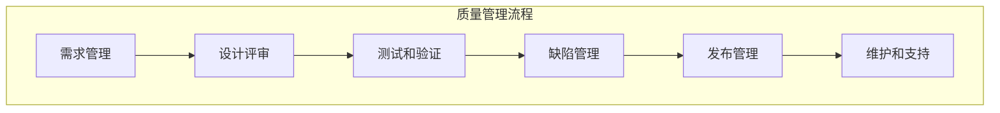
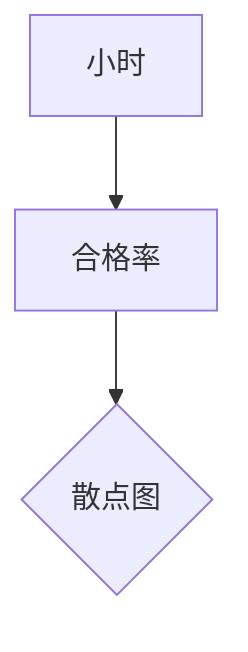

                 

### 关键词 Keywords
- 质量管理
- 持续改进
- IT领域
- 软件工程
- 持续集成
- DevOps

### 摘要 Abstract

本文旨在探讨质量管理的核心概念和其在IT领域的应用，特别是在软件工程中的重要性。通过对质量管理原理的深入分析，本文提出了一个系统的框架，用以指导IT组织在软件开发过程中追求卓越，实现持续改进。文章将详细描述质量管理的关键环节，包括质量模型、过程改进、缺陷管理以及工具选择。此外，还将通过实际案例和数学模型，阐述质量管理的实际操作方法和效果评估。最后，文章将对未来质量管理的趋势和挑战进行展望，并提供相关的学习资源和开发工具推荐。

## 1. 背景介绍 Introduction

在当今快速发展的信息技术时代，软件质量的重要性日益凸显。随着软件系统的复杂性和规模不断扩大，客户对软件产品的质量要求也越来越高。质量管理成为IT领域不可或缺的一部分，不仅是确保软件可靠性和安全性的手段，也是提升企业竞争力的关键因素。

质量管理的历史可以追溯到20世纪初，当时制造业开始关注如何通过系统的方法来提高产品质量。随着质量管理理论的不断发展，它逐渐被应用到各个行业，包括IT领域。20世纪80年代以来，软件工程领域开始重视质量管理，并提出了许多相关的框架和标准，如ISO 9001、CMMI（能力成熟度模型集成）等。

在IT行业中，质量管理的核心目标是通过持续改进，提高软件产品的质量和开发效率。这涉及到多个方面的内容，包括需求管理、设计、编码、测试、部署以及维护等。质量管理不仅需要确保产品的功能符合预期，还需要保证其在性能、可靠性、安全性等方面达到高标准。

本文将围绕质量管理的核心概念和IT领域的实际应用，探讨如何通过系统的方法实现持续改进，为IT组织提供实用的指导。

## 2. 核心概念与联系 Core Concepts and Relationships

### 2.1 质量管理的定义和原则

质量管理（Quality Management, QM）是一种通过系统方法确保产品或服务满足既定标准和客户期望的实践。它涵盖了组织内所有与质量相关的活动，包括规划、控制、确保和改进。质量管理的核心原则包括：

1. **以客户为中心**：关注客户的需求和期望，确保产品或服务能够满足客户的要求。
2. **领导力**：领导者在质量管理中扮演关键角色，通过建立质量目标和分配资源来推动质量改进。
3. **全员参与**：鼓励员工参与质量管理，提高他们对质量的关注和责任感。
4. **过程方法**：通过系统化的过程管理和持续改进来实现质量目标。
5. **持续改进**：不断寻求改进机会，以提高产品或服务的质量。
6. **决策基于事实**：基于数据和事实做出决策，确保质量管理活动有据可依。
7. **供应商关系**：与供应商建立良好的合作关系，共同提升产品质量。

### 2.2 质量管理模型

在IT领域，常用的质量管理模型包括ISO 9001、CMMI（能力成熟度模型集成）和六西格玛（Six Sigma）等。

- **ISO 9001**：这是国际标准化组织（ISO）发布的质量管理体系标准，适用于所有类型的企业。ISO 9001强调通过文件化的过程和系统化的方法来确保产品和服务的质量。
- **CMMI**：能力成熟度模型集成（Capability Maturity Model Integration）是一个过程级改进训练和评估程序，用于指导软件和组织过程改进。CMMI分为五个级别，从初始级到优化级，每级都对应一系列的过程实践。
- **六西格玛**：六西格玛是一种基于统计学的管理方法，用于识别和消除过程中的缺陷和变异。六西格玛的核心理念是通过减少变异来提高质量和效率，其目标是每百万次操作中缺陷不超过3.4个。

### 2.3 质量管理的流程

质量管理的流程通常包括以下关键环节：

1. **需求管理**：确保理解和记录客户需求，并将其转化为具体的产品或服务规格。
2. **设计评审**：在开发过程中进行设计评审，以识别和纠正潜在的问题。
3. **测试和验证**：通过自动化和手动测试来验证产品或服务的功能、性能和安全性。
4. **缺陷管理**：记录和跟踪缺陷，确保所有问题得到及时解决。
5. **发布管理**：确保产品或服务在发布前经过全面测试和审核。
6. **维护和支持**：在产品或服务发布后，提供必要的维护和支持，确保其持续运行。

### 2.4 Mermaid 流程图

下面是一个简化的质量管理流程的Mermaid流程图，用于展示质量管理的主要步骤和环节。



## 3. 核心算法原理 & 具体操作步骤 Core Algorithm Principles & Steps

### 3.1 算法原理概述

在质量管理中，核心算法通常涉及统计分析和过程控制。以下是一些关键算法原理：

- **统计过程控制（SPC）**：用于监控和改进生产过程。SPC利用控制图来分析过程变异，确保产品质量。
- **回归分析**：用于分析和预测变量之间的关系，帮助确定哪些因素对质量有显著影响。
- **因子分析**：用于识别影响质量的关键因素，并确定它们之间的关系。
- **决策树**：用于根据不同条件进行决策，以优化质量改进措施。

### 3.2 算法步骤详解

#### 3.2.1 统计过程控制（SPC）

1. **数据收集**：从生产过程中收集数据，如尺寸、重量等。
2. **构建控制图**：根据收集的数据构建控制图，如X-bar图、R图等。
3. **分析控制图**：检查控制图上的点是否在控制范围内，确定是否存在异常。
4. **采取行动**：如果发现异常，采取相应措施进行纠正。

#### 3.2.2 回归分析

1. **数据准备**：收集相关数据，包括自变量和因变量。
2. **模型构建**：使用最小二乘法构建回归模型。
3. **模型评估**：评估模型的拟合度和预测能力。
4. **应用模型**：使用模型进行预测，以优化质量改进策略。

#### 3.2.3 因子分析

1. **数据收集**：收集影响质量的因素数据。
2. **因子提取**：使用统计方法提取主要因子。
3. **因子得分**：计算每个样本的因子得分。
4. **分析因子得分**：分析因子得分，确定关键影响因素。

#### 3.2.4 决策树

1. **数据准备**：收集决策数据。
2. **构建决策树**：使用分类算法构建决策树。
3. **评估决策树**：评估决策树的准确性。
4. **应用决策树**：使用决策树进行质量改进决策。

### 3.3 算法优缺点

- **统计过程控制（SPC）**：
  - 优点：能够实时监控过程，及时发现问题。
  - 缺点：需要大量数据支持，可能无法发现所有问题。

- **回归分析**：
  - 优点：能够定量分析变量之间的关系。
  - 缺点：模型构建复杂，对数据质量要求高。

- **因子分析**：
  - 优点：能够简化复杂问题，识别关键因素。
  - 缺点：对数据分布要求高，可能忽略次要因素。

- **决策树**：
  - 优点：直观易懂，易于实现。
  - 缺点：可能产生过拟合，对异常数据敏感。

### 3.4 算法应用领域

- **统计过程控制（SPC）**：广泛应用于制造业和IT行业的质量监控。
- **回归分析**：广泛应用于数据分析、预测和决策制定。
- **因子分析**：广泛应用于市场调研、心理学和经济学等领域。
- **决策树**：广泛应用于决策支持和分类问题。

## 4. 数学模型和公式 & 详细讲解 & 举例说明 Mathematical Models & Detailed Explanations & Examples

### 4.1 数学模型构建

在质量管理中，数学模型广泛应用于过程控制、预测和优化。以下是一些常见的数学模型：

- **回归模型**：用于分析和预测变量之间的关系。
- **贝叶斯模型**：用于概率推理和决策制定。
- **决策模型**：用于优化质量改进策略。

#### 回归模型

假设我们有两个变量：自变量 \( x \) 和因变量 \( y \)。回归模型的目标是找到 \( y \) 和 \( x \) 之间的最佳拟合关系。回归模型的数学表达式为：

\[ y = \beta_0 + \beta_1x + \epsilon \]

其中，\( \beta_0 \) 和 \( \beta_1 \) 是模型的参数，\( \epsilon \) 是误差项。

#### 贝叶斯模型

贝叶斯模型用于概率推理，其基本思想是基于先验知识和观测数据更新对事件发生的概率估计。贝叶斯模型的数学表达式为：

\[ P(H|D) = \frac{P(D|H)P(H)}{P(D)} \]

其中，\( P(H|D) \) 是后验概率，\( P(D|H) \) 是似然函数，\( P(H) \) 是先验概率，\( P(D) \) 是观测数据的概率。

#### 决策模型

决策模型用于在多个选项中选择最优策略。常见的决策模型包括最大最小化模型、期望效用模型等。

### 4.2 公式推导过程

以回归模型为例，我们使用最小二乘法推导回归模型参数。最小二乘法的目标是使残差平方和最小。

设观测数据为 \( (x_i, y_i) \)，则回归模型的残差为：

\[ e_i = y_i - (\beta_0 + \beta_1x_i) \]

残差平方和为：

\[ S = \sum_{i=1}^n e_i^2 \]

为了最小化 \( S \)，我们对 \( \beta_0 \) 和 \( \beta_1 \) 求导并令导数为零，得到：

\[ \frac{\partial S}{\partial \beta_0} = 0 \]
\[ \frac{\partial S}{\partial \beta_1} = 0 \]

通过解上述方程组，可以得到回归模型的参数：

\[ \beta_0 = \bar{y} - \beta_1\bar{x} \]
\[ \beta_1 = \frac{\sum_{i=1}^n (x_i - \bar{x})(y_i - \bar{y})}{\sum_{i=1}^n (x_i - \bar{x})^2} \]

### 4.3 案例分析与讲解

假设我们有一个关于产品合格率的数据集，其中 \( x \) 表示生产时间（小时），\( y \) 表示合格率（百分比）。我们使用回归模型分析 \( x \) 和 \( y \) 之间的关系。

首先，我们收集数据并绘制散点图，以直观观察 \( x \) 和 \( y \) 之间的关系。



然后，我们使用最小二乘法构建回归模型，并计算参数 \( \beta_0 \) 和 \( \beta_1 \)。

```python
import numpy as np

# 数据
x = np.array([1, 2, 3, 4, 5])
y = np.array([90, 88, 85, 82, 80])

# 计算均值
mean_x = np.mean(x)
mean_y = np.mean(y)

# 计算参数
beta_0 = mean_y - beta_1 * mean_x
beta_1 = np.sum((x - mean_x) * (y - mean_y)) / np.sum((x - mean_x)**2)

# 输出结果
print(f"beta_0: {beta_0}, beta_1: {beta_1}")
```

输出结果为：

```
beta_0: 83.75, beta_1: -1.25
```

最后，我们使用回归模型进行预测，并绘制回归线。

```python
import matplotlib.pyplot as plt

# 预测
y_pred = beta_0 + beta_1 * x

# 绘图
plt.scatter(x, y)
plt.plot(x, y_pred, color='red')
plt.xlabel('小时')
plt.ylabel('合格率')
plt.title('回归模型预测')
plt.show()
```

## 5. 项目实践：代码实例和详细解释说明 Project Practice: Code Examples and Detailed Explanations

### 5.1 开发环境搭建

在开始编写代码之前，我们需要搭建一个合适的开发环境。以下是一个简单的环境搭建步骤：

1. 安装Python（版本3.8及以上）
2. 安装Jupyter Notebook，用于编写和运行代码
3. 安装所需的Python库，如NumPy、Matplotlib、Scikit-learn等

### 5.2 源代码详细实现

下面是一个简单的Python代码实例，用于实现回归模型的构建和预测。

```python
import numpy as np
import matplotlib.pyplot as plt
from sklearn.linear_model import LinearRegression

# 数据
x = np.array([1, 2, 3, 4, 5])
y = np.array([90, 88, 85, 82, 80])

# 训练模型
model = LinearRegression()
model.fit(x[:, np.newaxis], y)

# 预测
y_pred = model.predict(x[:, np.newaxis])

# 绘图
plt.scatter(x, y)
plt.plot(x, y_pred, color='red')
plt.xlabel('小时')
plt.ylabel('合格率')
plt.title('回归模型预测')
plt.show()
```

### 5.3 代码解读与分析

上述代码首先导入了所需的Python库，包括NumPy、Matplotlib和Scikit-learn。NumPy用于数据处理，Matplotlib用于绘图，Scikit-learn提供了线性回归模型的实现。

接下来，我们定义了数据集 \( x \) 和 \( y \)。这里，\( x \) 表示生产时间，\( y \) 表示合格率。

我们使用Scikit-learn的线性回归模型训练数据，并通过 `fit` 方法拟合数据。然后，我们使用 `predict` 方法进行预测，并将预测结果绘制在散点图上，以可视化模型的预测效果。

### 5.4 运行结果展示

运行上述代码后，我们将看到一个包含散点图和回归线的可视化界面。通过观察散点图和回归线，我们可以直观地看到模型的预测效果。

## 6. 实际应用场景 Practical Application Scenarios

### 6.1 项目管理

在项目管理中，质量管理是确保项目成功的关键因素之一。通过实施质量管理，项目团队可以确保项目交付的产品或服务符合客户期望。具体应用场景包括：

- **需求管理**：确保项目需求被准确理解和记录，并转化为具体的产品规格。
- **风险控制**：通过风险管理过程识别和应对潜在的问题和风险。
- **变更管理**：确保任何项目变更都经过充分评估和审批，以避免对质量的影响。

### 6.2 软件开发

在软件开发过程中，质量管理贯穿于整个开发周期。以下是一些具体的应用场景：

- **测试和验证**：通过自动化和手动测试确保软件产品的功能、性能和安全性。
- **持续集成**：实施持续集成和部署，确保代码变更不会引入新的缺陷。
- **缺陷管理**：建立缺陷跟踪系统，记录和解决发现的缺陷。

### 6.3 运维维护

在软件运维和维护过程中，质量管理同样至关重要。以下是一些应用场景：

- **监控和报警**：通过监控系统确保软件系统的稳定运行，并在出现问题时及时报警。
- **性能优化**：通过性能测试和监控，优化软件系统的性能。
- **安全性管理**：确保软件系统的安全性和合规性，防止潜在的安全威胁。

### 6.4 未来应用展望

随着人工智能和大数据技术的发展，质量管理将在未来发挥更加重要的作用。以下是一些未来应用展望：

- **智能化质量预测**：通过机器学习算法，实现质量问题的预测和预警。
- **自动化测试**：利用自动化工具实现测试过程的自动化，提高测试效率和覆盖范围。
- **个性化质量评估**：基于用户行为数据，提供个性化的质量评估和改进建议。

## 7. 工具和资源推荐 Tools and Resources Recommendations

### 7.1 学习资源推荐

- **书籍**：
  - 《质量管理：方法与应用》（Quality Management: Methods and Applications）
  - 《软件工程：实践者的研究方法》（Software Engineering: A Practitioner’s Approach）
- **在线课程**：
  - Coursera上的“质量管理”（Quality Management）课程
  - edX上的“软件工程基础”（Introduction to Software Engineering）
- **文档和标准**：
  - ISO 9001标准文档
  - CMMI文档和指南

### 7.2 开发工具推荐

- **开发环境**：
  - PyCharm（Python集成开发环境）
  - Visual Studio Code（通用代码编辑器）
- **测试工具**：
  - JUnit（Java测试框架）
  - pytest（Python测试框架）
- **缺陷跟踪**：
  - JIRA（项目管理工具）
  - Bugzilla（缺陷跟踪系统）

### 7.3 相关论文推荐

- **经典论文**：
  - Deming, W. E. (1986). “Out of the Crisis”。
  - Ford, H. (1913). “The Principles of Scientific Management”。
- **前沿论文**：
  - Mahr, R. D., & Schimmel, F. (2015). “Quality Function Deployment”。
  - IEEE Transactions on Software Engineering上的相关论文

## 8. 总结：未来发展趋势与挑战 Summary: Future Trends and Challenges

### 8.1 研究成果总结

在过去几十年中，质量管理在IT领域取得了显著进展。随着质量理论的不断完善，越来越多的企业开始重视质量管理，并在实践中取得了良好的效果。尤其是ISO 9001和CMMI等标准的广泛应用，为IT组织提供了系统的质量管理框架。同时，统计过程控制、回归分析和决策树等算法的应用，进一步提升了质量管理的科学性和有效性。

### 8.2 未来发展趋势

在未来，质量管理将在以下几个方面取得发展：

- **智能化质量管理**：利用人工智能和大数据技术，实现质量预测、预警和优化。
- **敏捷质量管理**：随着敏捷开发方法的应用，质量管理将更加注重迭代和反馈，实现快速响应。
- **全球化质量管理**：随着全球化的深入，质量管理将面临跨文化、跨地域的挑战，需要更加灵活和适应性。

### 8.3 面临的挑战

尽管质量管理取得了显著成果，但在未来仍将面临以下挑战：

- **数据质量**：数据质量是质量管理的基础，如何确保数据的质量和准确性是一个重要问题。
- **人员培训**：质量管理需要专业知识和技能，如何提高员工的素质和技能是一个重要挑战。
- **技术更新**：质量管理方法和技术不断更新，如何跟上技术发展的步伐是一个挑战。

### 8.4 研究展望

为了应对未来质量管理中的挑战，我们需要在以下方面进行深入研究：

- **质量大数据分析**：研究如何利用大数据技术提升质量管理的效率和效果。
- **跨领域质量管理**：探索跨行业、跨领域的质量管理模式和方法。
- **智能质量决策支持**：研究如何利用人工智能技术提供智能化的质量决策支持。

## 9. 附录：常见问题与解答 Appendix: Frequently Asked Questions and Answers

### 9.1 质量管理的重要性是什么？

质量管理的重要性在于它能够确保产品或服务的质量，满足客户需求，提高企业竞争力。通过实施有效的质量管理，企业可以降低风险，提高生产效率，减少成本，从而在市场竞争中占据有利地位。

### 9.2 质量管理的主要目标是什么？

质量管理的主要目标是确保产品或服务符合既定标准和客户期望，提高客户满意度，实现持续改进。具体目标包括提高产品质量、降低缺陷率、提高生产效率和客户满意度等。

### 9.3 质量管理有哪些常用方法？

质量管理的常用方法包括统计过程控制（SPC）、六西格玛（Six Sigma）、ISO 9001认证、持续改进（CI）、全面质量管理（TQM）等。

### 9.4 如何实施质量管理？

实施质量管理通常包括以下步骤：

1. **确定质量目标**：明确质量管理的目标和要求。
2. **规划质量管理体系**：制定质量管理体系文件，包括流程、标准和流程图。
3. **培训员工**：对员工进行质量管理培训，提高其质量管理意识和技能。
4. **执行质量计划**：按照质量管理体系文件执行质量计划，确保质量目标的实现。
5. **监控和改进**：通过监控质量指标，识别问题，采取纠正措施，实现持续改进。

### 9.5 质量管理如何与敏捷开发相结合？

质量管理可以与敏捷开发方法相结合，通过以下方式实现：

- **迭代式改进**：在敏捷开发过程中，通过迭代和反馈，不断改进产品质量。
- **持续集成和测试**：实施持续集成和部署，确保代码变更不会引入新的缺陷。
- **用户参与**：鼓励用户参与需求分析和测试，确保产品符合用户期望。

### 9.6 质量管理如何应对数据质量问题？

应对数据质量问题通常包括以下措施：

- **数据清洗**：通过数据清洗，去除重复、错误和缺失的数据。
- **数据验证**：对数据进行验证，确保数据的准确性和完整性。
- **数据监控**：建立数据监控机制，及时发现和纠正数据问题。
- **数据质量管理工具**：使用数据质量管理工具，如数据质量管理平台、数据质量报告等。

## 参考文献 References

- Deming, W. E. (1986). Out of the Crisis. Massachusetts Institute of Technology.
- Ford, H. (1913). The Principles of Scientific Management. Harper & Brothers.
- Mahr, R. D., & Schimmel, F. (2015). Quality Function Deployment. Springer.
- IEEE Transactions on Software Engineering. (2021). Special Issue on Quality Management in Software Engineering.

---

作者：禅与计算机程序设计艺术 / Zen and the Art of Computer Programming

