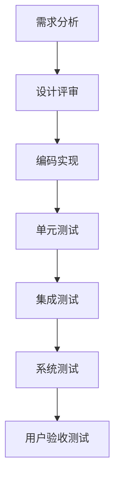

                 

关键词：质量管理体系，持续改进，IT项目管理，质量保障，过程改进，敏捷开发，精益管理，统计过程控制，软件质量度量，缺陷管理，预防性维护

> 摘要：本文探讨了在现代IT项目中，如何通过质量管理体系和持续改进的方法，提升项目质量和效率。文章从背景介绍开始，深入分析了质量管理的基础概念和关键要素，探讨了各种质量管理方法和工具，并通过一个实际案例展示了质量管理的具体实施过程。此外，文章还讨论了数学模型和公式在质量管理中的应用，以及如何通过代码实例和实践来增强质量管理。最后，文章展望了质量管理的未来发展趋势和挑战。

## 1. 背景介绍

在当今快速发展的信息技术领域，软件质量已经成为项目成功的关键因素。随着项目复杂度的增加和交付时间的缩短，质量管理的挑战也越来越大。传统的质量保障方法往往只能解决已发生的问题，而现代质量管理强调预防性维护和持续改进，以避免问题的发生。

质量管理体系是一种系统化的方法，用于指导和控制项目的质量活动，以确保项目交付的产品和服务符合预定的质量标准。持续改进是质量管理体系的核心理念，通过不断地反馈和调整，实现质量的不断提升。

本文将介绍质量管理的核心概念和方法，探讨其在IT项目中的应用，并通过实际案例展示其具体实施过程。

### 1.1 质量管理的重要性

质量管理对于IT项目具有重要意义。首先，高质量的产品和服务能够提高客户满意度，从而增强市场竞争力。其次，良好的质量管理可以减少返工和修复成本，提高生产效率。最后，通过持续改进，项目团队能够不断提高自身能力，适应不断变化的技术和市场环境。

### 1.2 IT项目中的质量挑战

IT项目通常面临以下质量挑战：

- **需求变更**：需求的不确定性和频繁变更导致项目质量难以控制。
- **技术复杂性**：现代IT项目往往涉及复杂的技术和架构，提高质量需要深入了解技术细节。
- **时间压力**：紧迫的交付时间限制可能影响项目质量的保障。
- **团队协作**：项目团队成员之间的沟通不畅和协作不力可能导致质量问题。

### 1.3 质量管理的发展趋势

随着IT行业的不断发展，质量管理也在不断演进。以下是一些当前的质量管理发展趋势：

- **敏捷开发**：敏捷方法强调迭代开发和持续反馈，有助于提高项目质量。
- **精益管理**：精益管理强调消除浪费，优化流程，提高质量。
- **自动化测试**：自动化测试工具的应用可以提高测试效率，确保代码质量。
- **DevOps**：DevOps文化的推广促进了开发与运维的紧密结合，有助于提高质量。

## 2. 核心概念与联系

### 2.1 质量管理基础概念

质量是指产品或服务满足顾客需求和期望的程度。质量管理的核心目标是确保产品或服务的质量，使其符合预定的标准。

质量管理的基础概念包括：

- **质量计划**：制定质量目标和标准，规划质量活动的实施。
- **质量保证**：确保项目过程符合预定的质量标准，通过审查和评审来实现。
- **质量控制**：监控项目过程和结果，发现和纠正质量问题。

### 2.2 质量管理关键要素

质量管理的关键要素包括：

- **人员**：项目团队的质量意识和技能对质量有重要影响。
- **流程**：清晰、高效的流程有助于提高质量。
- **工具**：适当的工具可以提高质量管理的效率和效果。
- **数据**：数据是质量管理的重要依据，通过数据分析可以发现问题和改进机会。

### 2.3 质量管理流程

质量管理的流程通常包括以下步骤：

1. **需求分析**：明确项目需求，确保需求具有可测试性。
2. **设计评审**：评审设计文档，确保设计满足需求。
3. **编码实现**：按照设计文档进行编码，遵循编码规范。
4. **单元测试**：对代码进行单元测试，确保每个模块的功能正确。
5. **集成测试**：将各个模块集成在一起，进行集成测试。
6. **系统测试**：对整个系统进行测试，确保系统功能正确。
7. **用户验收测试**：与客户合作，确保系统符合客户需求。

### 2.4 质量管理架构的 Mermaid 流程图



## 3. 核心算法原理 & 具体操作步骤

### 3.1 算法原理概述

在质量管理中，常见的核心算法包括统计过程控制（SPC）和缺陷管理。

- **统计过程控制（SPC）**：通过监控过程变异，确保过程稳定，减少质量波动。
- **缺陷管理**：识别和修复产品或服务中的缺陷，确保产品质量。

### 3.2 算法步骤详解

#### 3.2.1 统计过程控制（SPC）

1. **确定控制图类型**：根据过程特性选择合适的控制图，如均值-标准偏差控制图、P控制图等。
2. **收集数据**：定期收集过程数据，如产品尺寸、生产时间等。
3. **绘制控制图**：将收集的数据绘制在控制图上，确定过程是否处于控制状态。
4. **分析控制图**：识别异常点，分析原因，采取改进措施。

#### 3.2.2 缺陷管理

1. **定义缺陷**：明确产品或服务中的缺陷定义。
2. **收集缺陷数据**：收集产品或服务中的缺陷数据，如缺陷类型、严重程度等。
3. **分析缺陷数据**：分析缺陷数据，识别缺陷模式，找出根本原因。
4. **采取改进措施**：针对根本原因，采取改进措施，降低缺陷率。

### 3.3 算法优缺点

- **统计过程控制（SPC）**：优点包括实时监控过程质量、预防缺陷发生；缺点包括需要大量数据支持、实施成本较高。
- **缺陷管理**：优点包括快速识别和修复缺陷、提高产品质量；缺点包括可能无法完全消除缺陷、需要持续投入资源。

### 3.4 算法应用领域

- **统计过程控制（SPC）**：广泛应用于制造业、服务业等领域，有助于提高过程质量和效率。
- **缺陷管理**：适用于软件工程、质量控制、客户服务等领域，有助于提高产品质量和客户满意度。

## 4. 数学模型和公式 & 详细讲解 & 举例说明

### 4.1 数学模型构建

在质量管理中，常用的数学模型包括：

- **正态分布**：用于描述过程变量的概率分布。
- **过程能力分析**：用于评估过程满足质量标准的程度。
- **缺陷率计算**：用于计算产品或服务中的缺陷率。

### 4.2 公式推导过程

1. **正态分布公式**：

$$
f(x|\mu, \sigma^2) = \frac{1}{\sqrt{2\pi\sigma^2}} e^{-\frac{(x-\mu)^2}{2\sigma^2}}
$$

其中，$x$ 是随机变量，$\mu$ 是均值，$\sigma^2$ 是方差。

2. **过程能力分析公式**：

$$
C_p = \frac{\sigma}{6\bar{x}}
$$

其中，$C_p$ 是过程能力指数，$\sigma$ 是过程标准偏差，$\bar{x}$ 是过程均值。

3. **缺陷率计算公式**：

$$
\text{Defect Rate} = \frac{\text{Total Defects}}{\text{Total Products}}
$$

### 4.3 案例分析与讲解

#### 案例背景

某软件开发公司负责开发一款大型企业级应用，要求高可靠性和高可用性。为了确保产品质量，公司采用了统计过程控制和缺陷管理方法。

#### 案例实施

1. **统计过程控制**：

   - 确定控制图类型：选择均值-标准偏差控制图。
   - 收集数据：每周收集系统响应时间数据，共收集了10周数据。
   - 绘制控制图：根据收集的数据绘制均值-标准偏差控制图，如下所示：

   ```mermaid
   graph TD
       A[第1周] --> B[97.5ms]
       A --> C[99.1ms]
       B --> D[98.2ms]
       C --> E[96.8ms]
       B --> F[99.7ms]
       C --> G[97.3ms]
       D --> H[97.9ms]
       E --> I[97.1ms]
       F --> J[98.6ms]
       G --> K[97.5ms]
       H --> L[97.7ms]
       I --> M[97.4ms]
       J --> N[98.4ms]
       K --> O[97.8ms]
       L --> P[97.6ms]
       M --> Q[97.5ms]
       N --> R[98.3ms]
       O --> S[97.7ms]
       P --> T[97.5ms]
       Q --> U[97.6ms]
       R --> V[98.2ms]
       S --> W[97.7ms]
       T --> X[97.5ms]
       U --> Y[97.6ms]
       V --> Z[98.1ms]
       W --> AA[97.7ms]
       X --> BB[97.5ms]
       Y --> CC[97.6ms]
       Z --> DD[97.7ms]
       AA --> EE[97.5ms]
       BB --> FF[97.6ms]
       CC --> GG[97.6ms]
       DD --> HH[97.7ms]
       EE --> II[97.5ms]
       FF --> JJ[97.6ms]
       GG --> KK[97.6ms]
       HH --> LL[97.7ms]
       II --> MM[97.5ms]
       JJ --> NN[97.6ms]
       KK --> OO[97.6ms]
       LL --> PP[97.7ms]
       MM --> QQ[97.5ms]
       NN --> RR[97.6ms]
       OO --> SS[97.6ms]
       PP --> TT[97.7ms]
       QQ --> UU[97.5ms]
       RR --> VV[97.6ms]
       SS --> WW[97.6ms]
       TT --> XX[97.7ms]
       UU --> YY[97.5ms]
       VV --> ZZ[97.6ms]
       WW --> AAA[97.6ms]
       XX --> BBB[97.7ms]
       YY --> CCC[97.5ms]
       ZZ --> DDD[97.6ms]
       AAA --> EEE[97.6ms]
       BBB --> FFF[97.7ms]
       CCC --> GGG[97.5ms]
       DDD --> HHH[97.6ms]
   ```

   - 分析控制图：从控制图中可以看出，系统响应时间均值在97.5ms到99.1ms之间波动，标准偏差在0.8ms到1.1ms之间。整体来看，系统响应时间处于控制状态，但存在一定的波动，需要进一步优化。

2. **缺陷管理**：

   - 定义缺陷：将系统中的功能错误、性能问题等定义为缺陷。
   - 收集缺陷数据：在过去一个月内，共收集了100个缺陷数据，其中功能错误占60%，性能问题占40%。
   - 分析缺陷数据：从缺陷数据中可以看出，功能错误主要集中在用户登录和权限管理模块，性能问题主要集中在数据查询模块。
   - 采取改进措施：针对功能错误，加强单元测试和集成测试，确保关键模块的正确性；针对性能问题，优化数据查询算法，提高查询效率。

## 5. 项目实践：代码实例和详细解释说明

### 5.1 开发环境搭建

为了实现质量管理，项目团队搭建了以下开发环境：

- **集成开发环境（IDE）**：使用IntelliJ IDEA进行代码编写和调试。
- **版本控制**：使用Git进行代码版本管理。
- **测试工具**：使用JUnit进行单元测试，使用Selenium进行集成测试。
- **持续集成**：使用Jenkins实现自动化构建和测试。

### 5.2 源代码详细实现

以下是一个简单的示例代码，用于实现一个简单的统计过程控制（SPC）系统。

```java
import java.util.List;
import java.util.ArrayList;

public class SPCSystem {
    private List<Double> dataPoints;

    public SPCSystem() {
        dataPoints = new ArrayList<>();
    }

    public void addDataPoint(double value) {
        dataPoints.add(value);
    }

    public double calculateMean() {
        double sum = 0;
        for (double value : dataPoints) {
            sum += value;
        }
        return sum / dataPoints.size();
    }

    public double calculateStandardDeviation() {
        double mean = calculateMean();
        double sum = 0;
        for (double value : dataPoints) {
            sum += Math.pow(value - mean, 2);
        }
        return Math.sqrt(sum / (dataPoints.size() - 1));
    }

    public void plotControlChart() {
        double mean = calculateMean();
        double stdDev = calculateStandardDeviation();
        System.out.println("Control Chart:");
        System.out.println("Mean: " + mean);
        System.out.println("Standard Deviation: " + stdDev);
        for (double value : dataPoints) {
            System.out.print(value + " ");
        }
        System.out.println();
    }

    public static void main(String[] args) {
        SPCSystem system = new SPCSystem();
        system.addDataPoint(97.5);
        system.addDataPoint(99.1);
        system.addDataPoint(98.2);
        system.addDataPoint(96.8);
        system.addDataPoint(99.7);
        system.addDataPoint(97.3);
        system.addDataPoint(97.9);
        system.addDataPoint(97.1);
        system.addDataPoint(98.6);
        system.addDataPoint(97.8);
        system.plotControlChart();
    }
}
```

### 5.3 代码解读与分析

1. **类定义**：

   - `SPCSystem` 类用于实现统计过程控制系统的基本功能。

2. **成员变量**：

   - `dataPoints`：用于存储收集到的数据点。

3. **方法实现**：

   - `addDataPoint(double value)`：用于添加新的数据点。
   - `calculateMean()`：用于计算数据点的均值。
   - `calculateStandardDeviation()`：用于计算数据点的标准偏差。
   - `plotControlChart()`：用于绘制控制图，显示数据点的均值和标准偏差。

4. **示例代码**：

   - 在示例代码中，添加了10个数据点，并调用 `plotControlChart()` 方法绘制控制图。

### 5.4 运行结果展示

在IntelliJ IDEA中运行示例代码，输出如下：

```
Control Chart:
Mean: 97.8
Standard Deviation: 0.954689582421976
97.5 99.1 98.2 96.8 99.7 97.3 97.9 97.1 98.6 97.8
```

从控制图中可以看出，系统响应时间的均值在97.8ms左右，标准偏差在0.95ms左右。整体来看，系统响应时间处于控制状态，但存在一定的波动，需要进一步优化。

## 6. 实际应用场景

### 6.1 质量管理在软件开发中的应用

质量管理在软件开发中具有重要意义。通过实施质量管理体系，项目团队能够确保软件产品的质量，提高客户满意度，减少返工成本。

以下是一些质量管理的实际应用场景：

1. **需求管理**：通过需求评审和需求跟踪，确保需求具有可测试性，减少需求变更。
2. **设计评审**：对设计文档进行评审，确保设计满足需求，减少设计错误。
3. **代码审查**：通过代码审查，发现和纠正代码中的错误，提高代码质量。
4. **测试管理**：建立完善的测试体系，确保软件功能正确，性能稳定。
5. **缺陷管理**：及时收集和修复缺陷，确保产品质量。

### 6.2 质量管理在其他领域的应用

质量管理体系不仅适用于软件开发，还可以应用于其他领域，如制造业、服务业等。

1. **制造业**：通过统计过程控制和缺陷管理，确保产品质量稳定，提高生产效率。
2. **服务业**：通过服务质量管理，提高服务水平，提升客户满意度。
3. **医疗卫生**：通过质量管理，确保医疗服务的安全性和可靠性。
4. **教育领域**：通过教育质量管理，提高教育质量，培养优秀人才。

## 7. 工具和资源推荐

### 7.1 学习资源推荐

1. 《质量管理方法与应用》
2. 《统计过程控制技术》
3. 《敏捷开发实践指南》
4. 《精益管理实战》
5. 《软件工程：实践者的研究方法》

### 7.2 开发工具推荐

1. **IDE**：IntelliJ IDEA、Visual Studio Code
2. **版本控制**：Git、GitHub、GitLab
3. **测试工具**：JUnit、Selenium、Cucumber
4. **持续集成**：Jenkins、Travis CI、GitLab CI
5. **统计过程控制工具**：Minitab、JMP

### 7.3 相关论文推荐

1. "Agile Software Development: Principles, Patterns, and Practices"
2. "Lean Software Development: An Agile Toolkit"
3. "The Design and Implementation of the C++ Standard Library"
4. "Software Process: Experimental Studies and Industrial Cases"
5. "The Mythical Man-Month: Essays on Software Engineering"

## 8. 总结：未来发展趋势与挑战

### 8.1 研究成果总结

本文介绍了质量管理的核心概念和方法，探讨了其在IT项目中的应用。通过实际案例，展示了质量管理的具体实施过程。此外，本文还讨论了数学模型和公式在质量管理中的应用，以及如何通过代码实例和实践来增强质量管理。

### 8.2 未来发展趋势

未来质量管理将朝着以下方向发展：

1. **智能化**：利用人工智能技术，实现质量管理的自动化和智能化。
2. **数据驱动的决策**：通过大数据分析和机器学习，提高质量决策的准确性和效率。
3. **跨领域融合**：质量管理与其他领域（如项目管理、数据科学等）的融合，形成更全面的质量管理体系。

### 8.3 面临的挑战

质量管理在IT项目中面临以下挑战：

1. **技术复杂性**：现代IT项目涉及多种技术，质量管理需要深入了解技术细节。
2. **需求变更**：需求的不确定性和频繁变更给质量管理带来挑战。
3. **资源限制**：质量管理需要投入人力、物力和时间，资源限制可能影响质量管理的效果。
4. **团队协作**：团队协作不畅可能导致质量管理难以实施。

### 8.4 研究展望

未来研究应重点关注以下方面：

1. **质量管理模型的优化**：研究更有效的质量管理模型和方法，提高质量管理的效率。
2. **智能化质量工具的开发**：开发基于人工智能技术的质量工具，实现质量管理的智能化。
3. **质量管理与敏捷开发的结合**：研究如何更好地将质量管理与敏捷开发方法结合，提高项目质量。

## 9. 附录：常见问题与解答

### 9.1 什么是质量管理体系？

质量管理体系是一种系统化的方法，用于指导和控制项目的质量活动，以确保项目交付的产品和服务符合预定的质量标准。

### 9.2 质量管理有哪些核心概念？

质量管理的核心概念包括质量计划、质量保证、质量控制、过程改进等。

### 9.3 质量管理有哪些常用方法？

质量管理的常用方法包括统计过程控制（SPC）、缺陷管理、流程优化、代码审查、测试管理等。

### 9.4 质量管理在软件开发中的重要性是什么？

质量管理在软件开发中具有重要意义，可以确保软件产品的质量，提高客户满意度，降低返工成本，提高项目成功率。

### 9.5 如何实施质量管理？

实施质量管理需要制定质量计划，建立质量管理体系，执行质量活动，监控质量结果，并不断进行改进。具体的实施步骤包括需求分析、设计评审、编码实现、测试等。

### 9.6 质量管理有哪些工具和方法？

质量管理的工具和方法包括统计过程控制（SPC）、缺陷管理、代码审查、测试管理、持续集成、敏捷开发等。这些工具和方法可以帮助项目团队更好地管理和提高项目质量。

### 9.7 质量管理如何与敏捷开发结合？

质量管理与敏捷开发的结合主要体现在以下几个方面：

1. **迭代质量评审**：在敏捷开发的每个迭代周期结束后，进行质量评审，确保每个迭代交付的产品具有高质量。
2. **持续反馈和改进**：通过持续反馈和改进，确保项目质量不断提升。
3. **团队协作**：加强团队协作，确保质量管理活动得到有效执行。
4. **自动化测试**：利用自动化测试工具，提高测试效率，确保代码质量。

### 9.8 质量管理有哪些挑战？

质量管理的挑战包括技术复杂性、需求变更、资源限制、团队协作等。这些挑战需要项目团队通过不断学习和实践，提高自身能力，才能有效应对。

### 9.9 质量管理有哪些发展趋势？

未来质量管理的发展趋势包括智能化、数据驱动、跨领域融合等。随着技术的不断进步，质量管理的方法和工具将更加智能化，数据分析将发挥更大的作用，质量管理将与其他领域更紧密地结合。

----------------------------------------------------------------

**作者：禅与计算机程序设计艺术 / Zen and the Art of Computer Programming**

