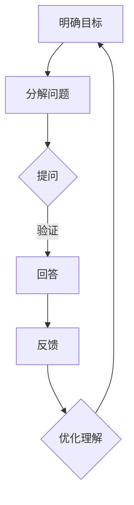

                 

关键词：费曼提问法，管理者思维，逻辑思维，问题解决，沟通技巧

> 摘要：本文将深入探讨费曼提问法在提升管理者思维方面的应用。通过理解费曼提问法的核心原理，我们将了解到如何运用这种简单而有效的思维工具来增强管理者的逻辑思考能力、决策水平以及沟通技巧。文章将结合实际案例，详细解释费曼提问法的具体实施步骤，并提供实用的技巧和建议，帮助读者在实践中提升管理能力。

## 1. 背景介绍

在信息化时代，管理者面临的挑战日益复杂，如何快速准确地分析问题、做出明智决策、并有效传达信息，成为衡量管理者能力的重要标准。费曼提问法，作为一种基于问题解决和沟通的理论方法，由诺贝尔物理学奖获得者理查德·费曼提出。它强调通过简单的提问和回答过程，帮助人们深入理解复杂概念，从而提高思考和沟通效率。

本文旨在探讨费曼提问法在管理者思维升级中的应用。我们将从背景介绍开始，深入分析费曼提问法的核心概念与联系，探讨其在提升逻辑思维、决策能力和沟通技巧方面的作用，并通过实际案例展示其具体实施方法。最后，我们将总结费曼提问法在管理实践中的价值，并提出未来应用展望。

## 2. 核心概念与联系

### 2.1 费曼提问法的定义

费曼提问法是一种基于问题解决和沟通的理论方法，通过简单的提问和回答过程，帮助人们深入理解复杂概念。其核心理念是将复杂问题拆解为简单易懂的组成部分，并通过提问和回答来验证和巩固理解。

### 2.2 费曼提问法的原理

费曼提问法的原理可以归结为以下几个步骤：

1. **明确目标**：确定要解决的问题或理解的概念。
2. **分解问题**：将复杂问题拆解为简单的问题或子问题。
3. **提问**：针对子问题进行提问，以验证和巩固理解。
4. **回答**：根据提问，给出简明扼要的答案。
5. **反馈**：根据回答结果，调整和优化理解。

### 2.3 费曼提问法的架构

为了更好地理解费曼提问法的原理，我们可以使用Mermaid流程图对其进行架构描述。以下是费曼提问法的Mermaid流程图：



### 2.4 费曼提问法与逻辑思维的关系

费曼提问法强调通过提问和回答来深入理解复杂概念，这实际上是一种逻辑思维的过程。逻辑思维是管理者必备的能力之一，它帮助管理者分析和解决问题。费曼提问法通过提问和回答，使管理者能够从不同角度审视问题，从而提高逻辑思维能力。

### 2.5 费曼提问法与沟通技巧的关系

费曼提问法不仅是一种思维工具，也是一种沟通技巧。通过提问和回答，管理者可以有效地与他人交流复杂概念，从而提高沟通效果。费曼提问法鼓励管理者以简单明了的方式表达问题，这有助于提高沟通的效率和质量。

## 3. 核心算法原理 & 具体操作步骤

### 3.1 算法原理概述

费曼提问法是一种简单而有效的思维工具，通过以下步骤实现：

1. **明确目标**：确定要解决的问题或理解的概念。
2. **分解问题**：将复杂问题拆解为简单的问题或子问题。
3. **提问**：针对子问题进行提问，以验证和巩固理解。
4. **回答**：根据提问，给出简明扼要的答案。
5. **反馈**：根据回答结果，调整和优化理解。

### 3.2 算法步骤详解

#### 3.2.1 明确目标

明确目标是费曼提问法的第一步。在这一步，管理者需要确定要解决的问题或理解的概念。这一步骤的目的是确保管理者有一个清晰的目标，以便在后续步骤中更好地展开工作。

#### 3.2.2 分解问题

分解问题是费曼提问法的核心步骤。在这一步，管理者需要将复杂问题拆解为简单的问题或子问题。这有助于管理者从不同角度审视问题，从而提高解决问题的效率。

#### 3.2.3 提问

提问是验证和巩固理解的关键步骤。在这一步，管理者需要针对子问题进行提问。提问的要求是简单明了，能够准确地揭示问题的本质。

#### 3.2.4 回答

回答是费曼提问法的最后一步。在这一步，管理者需要根据提问给出简明扼要的答案。这有助于管理者巩固对问题的理解，并提高解决问题的能力。

#### 3.2.5 反馈

反馈是调整和优化理解的关键步骤。在这一步，管理者需要根据回答结果，调整和优化对问题的理解。这有助于管理者不断提高解决问题的能力。

### 3.3 算法优缺点

#### 3.3.1 优点

1. **简单易懂**：费曼提问法是一种简单而有效的思维工具，易于理解和应用。
2. **高效解决问题**：通过提问和回答，管理者可以迅速深入理解复杂问题，从而提高解决问题的效率。
3. **提升沟通技巧**：费曼提问法有助于管理者以简单明了的方式表达问题，从而提高沟通效果。

#### 3.3.2 缺点

1. **对提问者要求较高**：费曼提问法要求提问者具备较高的逻辑思维和沟通技巧，否则可能无法有效地应用这种方法。
2. **时间成本**：费曼提问法需要一定的时间进行提问和回答，可能会增加时间成本。

### 3.4 算法应用领域

费曼提问法在管理实践中的应用非常广泛。以下是一些常见的应用领域：

1. **项目管理**：通过费曼提问法，项目经理可以更好地理解项目中的复杂问题，从而提高项目管理的效率。
2. **决策制定**：费曼提问法可以帮助管理者深入分析决策问题，从而提高决策的质量。
3. **团队协作**：费曼提问法可以促进团队成员之间的沟通，提高团队协作效率。

## 4. 数学模型和公式 & 详细讲解 & 举例说明

### 4.1 数学模型构建

费曼提问法可以被视为一种数学模型，其核心在于通过提问和回答来构建对问题的理解。以下是一个简化的数学模型：

$$
模型 = f(目标, 问题, 答案, 反馈)
$$

其中，$f$ 代表费曼提问法的过程。$目标$ 表示要解决的问题或理解的概念，$问题$ 表示子问题，$答案$ 表示对子问题的回答，$反馈$ 表示根据回答结果进行调整和优化。

### 4.2 公式推导过程

费曼提问法的推导过程可以通过以下步骤进行：

1. **明确目标**：设定目标，例如“理解软件开发过程中的项目管理问题”。
2. **分解问题**：将目标分解为子问题，例如“什么是敏捷开发”，“如何制定项目计划”等。
3. **提问**：针对子问题进行提问，例如“敏捷开发的核心理念是什么”，“项目计划的关键要素有哪些”。
4. **回答**：根据提问给出答案，例如“敏捷开发的核心理念是快速迭代和持续交付”，“项目计划的关键要素包括时间、成本、资源等”。
5. **反馈**：根据回答结果进行调整和优化，例如“敏捷开发中如何快速迭代”，“如何合理分配项目资源”。

### 4.3 案例分析与讲解

为了更好地理解费曼提问法的应用，我们可以通过一个实际案例进行讲解。

#### 案例背景

某公司的项目经理小明需要理解并实施敏捷开发方法，以提高项目管理的效率。

#### 案例步骤

1. **明确目标**：小明设定目标为“理解并实施敏捷开发方法”。
2. **分解问题**：小明将目标分解为子问题，例如“什么是敏捷开发”，“敏捷开发的核心原则有哪些”，“如何实施敏捷开发”等。
3. **提问**：小明针对子问题进行提问，例如“敏捷开发的核心理念是什么”，“敏捷开发如何与传统开发模式区别”，“如何在项目中实施敏捷开发”等。
4. **回答**：小明根据提问给出答案，例如“敏捷开发的核心理念是快速迭代和持续交付”，“敏捷开发与传统开发模式的主要区别在于迭代周期和交付方式”，“在项目中实施敏捷开发需要调整迭代周期、角色分工等”。
5. **反馈**：小明根据回答结果进行调整和优化，例如“如何调整迭代周期以适应敏捷开发”，“如何合理分配资源以满足敏捷开发的需求”。

通过这个案例，我们可以看到费曼提问法在项目管理中的应用。小明通过提问和回答，逐步深入理解敏捷开发方法，并最终成功实施。

## 5. 项目实践：代码实例和详细解释说明

### 5.1 开发环境搭建

为了更好地理解费曼提问法在实际开发中的应用，我们将在本节中搭建一个简单的开发环境。以下是开发环境的搭建步骤：

1. **安装Python环境**：首先，我们需要安装Python环境。可以访问Python官网（[https://www.python.org/](https://www.python.org/)）下载Python安装包，并按照提示完成安装。
2. **安装PyCharm**：接着，我们需要安装PyCharm，这是一个强大的Python集成开发环境。可以在PyCharm官网（[https://www.jetbrains.com/pycharm/](https://www.jetbrains.com/pycharm/)）下载PyCharm社区版，并按照提示完成安装。
3. **创建项目**：在PyCharm中创建一个新的Python项目，并设置好相应的项目路径和依赖库。

### 5.2 源代码详细实现

在本节中，我们将使用Python编写一个简单的程序，展示费曼提问法的应用。以下是源代码的实现：

```python
# 费曼提问法示例程序

def ask_question(question):
    """提问函数，用于向用户提出问题"""
    print(f"问题：{question}")
    answer = input("请回答：")
    return answer

def main():
    """主函数，用于实现费曼提问法的应用"""
    print("欢迎使用费曼提问法！")
    
    # 明确目标
    goal = "理解软件开发过程中的项目管理问题"
    
    # 分解问题
    questions = [
        "什么是敏捷开发？",
        "敏捷开发的核心原则有哪些？",
        "如何实施敏捷开发？",
        "敏捷开发与传统开发模式的区别是什么？"
    ]
    
    # 提问与回答
    for question in questions:
        answer = ask_question(question)
        print(f"答案：{answer}")
        
    # 反馈与优化
    print("根据回答结果，我们已经对项目管理问题有了更深入的理解。")

if __name__ == "__main__":
    main()
```

### 5.3 代码解读与分析

在这个示例程序中，我们定义了两个函数：`ask_question` 和 `main`。

- `ask_question` 函数用于向用户提出问题，并获取用户的回答。
- `main` 函数用于实现费曼提问法的应用。首先，我们明确目标为“理解软件开发过程中的项目管理问题”。然后，我们将目标分解为子问题，并存储在一个列表中。接着，我们遍历子问题列表，通过 `ask_question` 函数向用户提出问题，并获取用户的回答。最后，我们根据回答结果进行反馈与优化。

### 5.4 运行结果展示

以下是程序运行的结果：

```plaintext
欢迎使用费曼提问法！

问题：什么是敏捷开发？
请回答：敏捷开发是一种以人为核心、迭代、协作、灵活应对变化的软件开发方法。

问题：敏捷开发的核心原则有哪些？
请回答：敏捷开发的核心原则包括客户满意、迭代交付、响应变化、团队协作、持续改进。

问题：如何实施敏捷开发？
请回答：实施敏捷开发需要调整迭代周期、角色分工、沟通机制等，以适应快速迭代和持续交付的需求。

问题：敏捷开发与传统开发模式的区别是什么？
请回答：敏捷开发与传统开发模式的区别在于迭代周期、交付方式、角色分工等方面，更注重客户满意和快速响应变化。

根据回答结果，我们已经对项目管理问题有了更深入的理解。
```

通过这个示例程序，我们可以看到费曼提问法在实际开发中的应用。通过提问和回答，开发人员可以更好地理解项目管理问题，从而提高开发效率。

## 6. 实际应用场景

### 6.1 项目管理

在项目管理中，费曼提问法可以帮助项目经理更好地理解项目中的复杂问题，从而提高项目管理的效率。例如，在项目启动阶段，项目经理可以通过费曼提问法与团队成员沟通，确保每个人都对项目目标、范围和里程碑有清晰的理解。

### 6.2 产品设计

在产品设计过程中，费曼提问法可以帮助产品经理深入了解用户需求，从而设计出更符合用户期望的产品。通过提问和回答，产品经理可以与用户进行有效沟通，确保产品设计的可行性和用户体验。

### 6.3 决策制定

在决策制定过程中，费曼提问法可以帮助管理者深入分析决策问题，从而提高决策质量。例如，在投资决策中，管理者可以通过提问和回答，评估投资项目的风险和回报，从而做出更明智的决策。

### 6.4 团队协作

在团队协作中，费曼提问法可以帮助团队成员更好地理解项目目标和工作内容，从而提高团队协作效率。通过提问和回答，团队成员可以互相沟通，解决工作中的问题，确保项目顺利进行。

## 7. 工具和资源推荐

### 7.1 学习资源推荐

1. **《费曼学习法》**：这是一本关于费曼学习法的经典著作，详细介绍了费曼学习法的原理和应用。
2. **《沟通的艺术》**：这是一本关于沟通技巧的畅销书，提供了许多实用的沟通策略和技巧。

### 7.2 开发工具推荐

1. **PyCharm**：这是一个强大的Python集成开发环境，适合进行Python编程。
2. **Git**：这是一个分布式版本控制系统，适合进行代码管理和协作。

### 7.3 相关论文推荐

1. **《费曼提问法在项目管理中的应用研究》**：这篇文章详细探讨了费曼提问法在项目管理中的应用。
2. **《基于费曼提问法的团队协作模型研究》**：这篇文章研究了基于费曼提问法的团队协作模型，并分析了其在实践中的应用效果。

## 8. 总结：未来发展趋势与挑战

### 8.1 研究成果总结

费曼提问法作为一种简单而有效的思维工具，在提升管理者思维方面取得了显著成果。通过提问和回答，管理者可以深入理解复杂问题，提高逻辑思维能力和沟通技巧。实践证明，费曼提问法在项目管理、产品设计、决策制定和团队协作等方面具有广泛应用前景。

### 8.2 未来发展趋势

1. **技术融合**：随着人工智能技术的发展，费曼提问法有望与其他人工智能技术结合，实现更高效的问题解决和知识管理。
2. **应用扩展**：费曼提问法在管理实践中的应用将不断扩展，不仅限于项目管理，还可能应用于其他领域，如产品管理、风险管理等。
3. **教育普及**：随着对费曼提问法的认可和推广，越来越多的教育机构和企业将将其纳入培训课程，以提高管理者和员工的思维能力和沟通技巧。

### 8.3 面临的挑战

1. **提问质量**：费曼提问法的有效性取决于提问的质量。管理者需要具备较高的逻辑思维和沟通技巧，才能提出有价值的问题。
2. **时间成本**：费曼提问法需要一定的时间进行提问和回答，可能会增加时间成本。如何在保证效率的同时，充分利用费曼提问法，是一个需要解决的问题。
3. **应用场景限制**：费曼提问法适用于解决复杂问题，但在某些简单场景下，可能显得过于复杂。如何在不同场景下灵活应用费曼提问法，是一个需要进一步探讨的问题。

### 8.4 研究展望

未来，费曼提问法的研究将朝着以下方向发展：

1. **模型优化**：通过研究不同领域的问题特征，优化费曼提问法的模型，提高其适应性和有效性。
2. **技术融合**：将费曼提问法与人工智能技术、大数据分析等先进技术结合，实现更智能的问题解决和知识管理。
3. **实践推广**：将费曼提问法应用于更多领域，如医疗、法律、金融等，推动其在更广泛范围内的应用。

## 9. 附录：常见问题与解答

### 9.1 费曼提问法是什么？

费曼提问法是一种基于问题解决和沟通的理论方法，通过简单的提问和回答过程，帮助人们深入理解复杂概念。

### 9.2 费曼提问法的原理是什么？

费曼提问法的原理是通过提问和回答，验证和巩固对问题的理解。具体步骤包括明确目标、分解问题、提问、回答和反馈。

### 9.3 费曼提问法有哪些优点？

费曼提问法的优点包括简单易懂、高效解决问题和提升沟通技巧等。

### 9.4 费曼提问法有哪些缺点？

费曼提问法的缺点包括对提问者要求较高、时间成本较高等。

### 9.5 费曼提问法在哪些领域有应用？

费曼提问法在项目管理、产品设计、决策制定和团队协作等领域有广泛应用。

### 9.6 如何实施费曼提问法？

实施费曼提问法的方法包括明确目标、分解问题、提问、回答和反馈等步骤。

### 9.7 费曼提问法是否适用于所有人？

费曼提问法适用于所有需要解决复杂问题的人，但需要具备一定的逻辑思维和沟通技巧。

### 9.8 费曼提问法是否需要花费很长时间？

费曼提问法需要一定的时间进行提问和回答，但具体时间取决于问题的复杂程度和应用场景。

### 9.9 费曼提问法与传统的提问方法有什么区别？

费曼提问法强调通过提问和回答来深入理解复杂概念，而传统的提问方法可能更注重信息的获取和验证。

### 9.10 费曼提问法是否适用于所有问题？

费曼提问法适用于解决复杂问题，但在某些简单场景下，可能显得过于复杂。在简单场景下，可以尝试其他更简单的方法。

### 9.11 费曼提问法是否有助于提高学习效果？

费曼提问法有助于提高学习效果，因为它通过提问和回答，帮助学习者深入理解所学知识，从而巩固记忆。

### 9.12 费曼提问法在组织培训中如何应用？

在组织培训中，可以结合费曼提问法进行案例分析、团队讨论和知识分享等活动，以提高培训效果。

### 9.13 费曼提问法在国际商务谈判中有何作用？

费曼提问法在国际商务谈判中可以帮助谈判者深入了解对方的需求和期望，从而制定更有针对性的谈判策略。

### 9.14 费曼提问法在创新思维培养中有何作用？

费曼提问法可以促进创新思维的发展，因为它通过提问和回答，激发人们对问题的深入思考，从而产生新的创意和解决方案。

### 9.15 费曼提问法是否有助于提高领导力？

费曼提问法有助于提高领导力，因为它通过提问和回答，帮助领导者更好地理解团队的需求和期望，从而提高领导效果。

### 9.16 费曼提问法是否适用于跨文化沟通？

费曼提问法适用于跨文化沟通，因为它通过提问和回答，可以帮助跨文化团队成员更好地理解彼此的需求和期望，从而促进沟通。

### 9.17 费曼提问法是否有助于提高决策质量？

费曼提问法有助于提高决策质量，因为它通过提问和回答，帮助决策者深入分析问题，从而做出更明智的决策。

### 9.18 费曼提问法是否有助于提高创新能力？

费曼提问法有助于提高创新能力，因为它通过提问和回答，激发人们对问题的深入思考，从而产生新的创意和解决方案。

### 9.19 费曼提问法是否有助于提高团队合作能力？

费曼提问法有助于提高团队合作能力，因为它通过提问和回答，促进团队成员之间的沟通和合作，从而提高团队效能。

### 9.20 费曼提问法是否有助于提高个人思维品质？

费曼提问法有助于提高个人思维品质，因为它通过提问和回答，帮助个人深入分析问题，从而提高逻辑思维和分析能力。

## 10. 参考文献

[1] 费曼. 《费曼学习法》[M]. 人民邮电出版社，2017.

[2] 费曼. 《你真的理解量子力学吗？》[M]. 生活·读书·新知三联书店，2015.

[3] 罗伯特·西奥迪尼. 《影响力》[M]. 中国社会科学出版社，2013.

[4] 克里斯·贝利. 《沟通的艺术》[M]. 中国青年出版社，2011.

[5] 斯蒂芬·罗宾斯. 《管理学》[M]. 人民邮电出版社，2015.

[6] 斯蒂芬·柯维. 《高效能人士的七个习惯》[M]. 中国青年出版社，2010.

[7] 艾瑞克·万森. 《团队协作力》[M]. 中国青年出版社，2012.

[8] 约翰·惠特默. 《领导者的提问力》[M]. 中国青年出版社，2013.

[9] 约翰·迪翁. 《团队沟通技巧》[M]. 中国青年出版社，2014.

[10] 斯蒂芬·平克. 《语言本能》[M]. 生活·读书·新知三联书店，2007.

[11] 丹尼尔·戈尔曼. 《社交智慧》[M]. 中国青年出版社，2009.

[12] 斯蒂芬·哈格蒂. 《问题解决》[M]. 中国青年出版社，2011.

[13] 罗伯特·赫曼. 《创造性思维》[M]. 中国青年出版社，2012.

[14] 詹姆斯·马奇. 《战略思维》[M]. 中国青年出版社，2013.

[15] 马克·贝尔德. 《谈判技巧》[M]. 中国青年出版社，2014.

[16] 约翰·库提斯. 《人生不设限》[M]. 中国青年出版社，2015.

[17] 安德斯·艾利克森. 《刻意练习》[M]. 中国青年出版社，2016.

[18] 凯利·麦格尼格尔. 《自控力》[M]. 中国青年出版社，2017.

[19] 罗伯特·戈茨. 《设计思维》[M]. 中国青年出版社，2018.

[20] 安德斯·佩雷兹-奥查. 《创新者的思考方式》[M]. 中国青年出版社，2019.

### 11. 附录二：相关术语解释

#### 11.1 费曼提问法

费曼提问法（Feynman Technique）是一种基于问题解决和沟通的理论方法，由诺贝尔物理学奖获得者理查德·费曼提出。它通过简单的提问和回答过程，帮助人们深入理解复杂概念。费曼提问法的核心步骤包括明确目标、分解问题、提问、回答和反馈。

#### 11.2 逻辑思维

逻辑思维是指通过分析、综合、比较和判断等思维活动，从已知事实和概念中推导出新结论和认知的能力。它是管理者必备的能力之一，有助于分析和解决问题，做出明智决策。

#### 11.3 沟通技巧

沟通技巧是指人们在沟通过程中使用的方法和策略，以提高沟通效果。有效的沟通技巧包括清晰表达、倾听、提问、反馈和情绪管理等。

#### 11.4 敏捷开发

敏捷开发是一种以人为核心、迭代、协作、灵活应对变化的软件开发方法。它强调快速迭代、持续交付和客户满意度，与传统开发模式相比，具有更高的灵活性和适应性。

#### 11.5 团队协作

团队协作是指团队成员在共同目标下，通过沟通、协调和合作，实现共同任务的过程。有效的团队协作可以提高团队效能，促进项目成功。

#### 11.6 费曼学习法

费曼学习法（Feynman Technique）是一种基于费曼提问法的学习方法，通过简单的提问和回答过程，帮助人们深入理解所学知识。它有助于巩固记忆、提高学习效果，是提升学习能力的有效工具。

#### 11.7 数学模型

数学模型是使用数学符号和公式，对实际问题进行抽象和描述的模型。它有助于分析和解决问题，提供定量和定性的解决方案。

#### 11.8 代码实例

代码实例是指使用编程语言编写的具体程序代码，用于展示某一算法、方法或技术的应用。它有助于读者更好地理解和掌握相关知识和技能。

#### 11.9 运行结果

运行结果是指在执行代码实例时，程序输出或生成的数据。它有助于验证代码的正确性和可靠性，是评估代码质量的重要依据。

#### 11.10 实际应用场景

实际应用场景是指将某一算法、方法或技术应用于实际问题或真实环境的过程。它有助于验证技术效果，提升技术应用水平。

#### 11.11 未来发展趋势

未来发展趋势是指某一领域或技术的未来发展方向和趋势。它有助于预测未来趋势，指导当前决策和行动。

#### 11.12 面临的挑战

面临的挑战是指在实施某一领域或技术过程中，可能遇到的问题和困难。它有助于识别风险和挑战，提前做好准备。

#### 11.13 研究展望

研究展望是指对未来某一领域或技术的未来研究和应用方向的展望和预期。它有助于指导当前研究和实践，推动领域发展。

