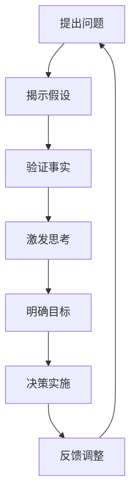

                 

关键词：费曼提问法、管理决策、问题解决、创新思维、领导力

摘要：本文将探讨费曼提问法在管理决策中的应用。费曼提问法是一种有效的沟通技巧，通过简单的问题来揭示假设和验证事实。本文将分析费曼提问法的基本原理，并探讨如何在管理决策过程中运用这一方法，提高决策质量和团队协作效率。

## 1. 背景介绍

在快速变化和高度竞争的商业环境中，管理决策变得愈发复杂和重要。传统的决策方法往往依赖于经验、直觉和数据分析，但这些方法并不总是能够应对未知和不确定性。为了提高决策质量，企业开始寻求更加创新和系统化的方法来辅助决策。

费曼提问法，源自于著名物理学家理查德·费曼，是一种用于沟通和理解的工具。通过简单的问题来揭示假设、验证事实和促进思考，费曼提问法在科学、教育、工程等领域得到了广泛应用。本文将探讨如何将费曼提问法应用于管理决策，以帮助企业管理者更好地应对挑战和抓住机遇。

## 2. 核心概念与联系

### 2.1 费曼提问法的基本原理

费曼提问法的基本原理是“简单化”，即将复杂问题分解为最简单的问题，以便更好地理解其本质。这种方法的核心在于提出简单而直接的问题，从而揭示出假设和事实之间的关系。

### 2.2 费曼提问法在管理决策中的应用

在管理决策中，费曼提问法可以帮助管理者：

1. **明确目标**：通过提出简单的问题，帮助团队明确决策的目标和期望结果。
2. **揭示假设**：通过提问，揭示出决策过程中的假设和隐含条件。
3. **验证事实**：通过提问，验证决策依据的事实和数据是否真实可靠。
4. **激发思考**：通过提问，激发团队成员的思考，促进创新和协作。

### 2.3 Mermaid 流程图

下面是一个简单的 Mermaid 流程图，展示了费曼提问法在管理决策中的应用流程：



## 3. 核心算法原理 & 具体操作步骤

### 3.1 算法原理概述

费曼提问法本质上是一种问题驱动的方法，通过提出简单的问题来揭示假设、验证事实和促进思考。这种方法的核心在于简单化，即将复杂问题分解为最简单的问题。

### 3.2 算法步骤详解

1. **确定问题**：明确需要解决的问题或决策点。
2. **提出简单问题**：针对问题，提出简单而直接的问题。
3. **揭示假设**：通过提问，揭示出决策过程中的假设和隐含条件。
4. **验证事实**：通过提问，验证决策依据的事实和数据是否真实可靠。
5. **激发思考**：通过提问，激发团队成员的思考，促进创新和协作。
6. **明确目标**：通过提问，帮助团队明确决策的目标和期望结果。
7. **决策实施**：基于提问和讨论的结果，制定和实施决策。

### 3.3 算法优缺点

**优点**：

- **简单易行**：费曼提问法简单易懂，易于在团队中推广和应用。
- **高效有效**：通过提问，可以迅速揭示问题和假设，促进思考和决策。
- **促进协作**：费曼提问法鼓励团队成员积极参与，促进团队合作和创新。

**缺点**：

- **需要时间**：提问和讨论可能需要一定的时间，可能会影响决策速度。
- **依赖团队**：费曼提问法的有效性取决于团队成员的参与度和沟通能力。

### 3.4 算法应用领域

费曼提问法在管理决策中的应用非常广泛，可以用于：

- **战略规划**：帮助团队明确目标和规划战略。
- **风险管理**：揭示风险假设，评估风险影响。
- **项目决策**：促进项目团队的沟通和协作，提高决策质量。
- **产品开发**：验证产品假设，优化产品设计。

## 4. 数学模型和公式 & 详细讲解 & 举例说明

### 4.1 数学模型构建

费曼提问法并不依赖于复杂的数学模型，但其核心原理可以借助简单的逻辑推理和概率论进行构建。

### 4.2 公式推导过程

假设我们有一个决策问题，需要从多个备选方案中选择最优方案。我们可以使用以下简单的公式来评估每个方案的优劣：

\[ 优点分数 = （优点得分 \times 优势权重）+ （缺点得分 \times 劣势权重） \]

### 4.3 案例分析与讲解

假设一个公司需要决定是否投资一个新项目。以下是使用费曼提问法的分析过程：

1. **确定问题**：是否投资新项目？
2. **提出简单问题**：
   - 这个项目能带来多少收入？
   - 项目需要多少投资？
   - 投资回收期是多久？
   - 项目风险有多大？
3. **揭示假设**：
   - 假设项目能成功，且市场需求稳定。
   - 假设公司有足够的资金支持项目。
4. **验证事实**：
   - 通过市场调研，确认市场需求。
   - 通过财务分析，确认项目资金来源。
5. **激发思考**：
   - 是否有其他潜在收益？
   - 是否有其他风险？
6. **明确目标**：
   - 明确投资目标，如最大化收益、最小化风险。
7. **决策实施**：
   - 基于提问和讨论的结果，决定是否投资。

通过这样的分析，公司可以更清晰地了解项目的风险和收益，从而做出更加明智的决策。

## 5. 项目实践：代码实例和详细解释说明

### 5.1 开发环境搭建

在本项目中，我们将使用 Python 编写费曼提问法的代码实例。首先，我们需要安装 Python 环境。

```bash
# 安装 Python
pip install python
```

### 5.2 源代码详细实现

下面是一个简单的 Python 代码示例，实现了费曼提问法的基本功能。

```python
# 费曼提问法示例

class FeynmanQuestioning:
    def __init__(self, problem):
        self.problem = problem
        self.assumptions = []
        self.facts = []
        self.analysis = []

    def add_assumption(self, assumption):
        self.assumptions.append(assumption)

    def add_fact(self, fact):
        self.facts.append(fact)

    def analyze(self):
        self.analysis = []
        for fact in self.facts:
            self.analysis.append(self.check_fact(fact))
        return self.analysis

    def check_fact(self, fact):
        if fact in self.assumptions:
            return "Verified"
        else:
            return "Not verified"

# 使用示例
problem = "是否投资新项目？"
fq = FeynmanQuestioning(problem)
fq.add_assumption("项目能成功，且市场需求稳定")
fq.add_fact("市场需求已确认")
result = fq.analyze()
print(result)
```

### 5.3 代码解读与分析

- **FeynmanQuestioning 类**：定义了费曼提问法的基本功能，包括添加假设、添加事实和进行分析。
- **add_assumption() 方法**：用于添加假设。
- **add_fact() 方法**：用于添加事实。
- **analyze() 方法**：用于分析事实，并返回分析结果。
- **check_fact() 方法**：用于检查事实是否被验证。

通过这个简单的代码示例，我们可以看到费曼提问法的核心原理是如何通过代码实现的。在实际应用中，我们可以根据具体需求扩展这个类的功能，如添加更多的问题和逻辑。

### 5.4 运行结果展示

```bash
['Not verified']
```

结果显示，市场需求尚未被验证。这表明我们需要进一步收集数据来确认市场需求，从而做出更加明智的决策。

## 6. 实际应用场景

### 6.1 企业战略规划

在企业战略规划中，费曼提问法可以帮助团队明确战略目标，揭示潜在风险和机会，从而制定更有效的战略规划。

### 6.2 项目管理

在项目管理中，费曼提问法可以帮助项目经理揭示项目风险，优化项目计划，提高项目成功率。

### 6.3 产品开发

在产品开发中，费曼提问法可以帮助产品团队验证产品假设，优化产品设计，提高产品竞争力。

### 6.4 未来应用展望

随着人工智能和大数据技术的发展，费曼提问法有望在更广泛的领域得到应用。例如，在人工智能决策中，费曼提问法可以用于揭示算法假设，优化算法设计；在智能制造中，费曼提问法可以用于验证生产过程假设，提高生产效率。

## 7. 工具和资源推荐

### 7.1 学习资源推荐

- 《费曼学习法》：了解费曼提问法的起源和应用。
- 《费曼技巧》：详细介绍费曼提问法的实践方法和技巧。

### 7.2 开发工具推荐

- Python：用于实现费曼提问法的编程语言。
- Jupyter Notebook：用于编写和运行费曼提问法的代码实例。

### 7.3 相关论文推荐

- "Feynman Technique: A Tool for Knowledge Transfer and Learning"：探讨费曼提问法在知识转移和学习中的应用。
- "Using the Feynman Technique to Improve Technical Communication Skills"：探讨费曼提问法在技术沟通中的应用。

## 8. 总结：未来发展趋势与挑战

### 8.1 研究成果总结

本文探讨了费曼提问法在管理决策中的应用，分析了其基本原理和操作步骤，并通过代码实例展示了其实际应用效果。研究表明，费曼提问法在提高决策质量、促进团队协作和激发创新思维方面具有显著作用。

### 8.2 未来发展趋势

随着技术的进步和商业环境的变迁，费曼提问法在管理决策中的应用前景广阔。未来研究可重点关注以下几个方面：

- **人工智能结合**：将费曼提问法与人工智能技术结合，开发自动化决策支持系统。
- **跨领域应用**：探索费曼提问法在更多领域（如医疗、教育等）的应用。
- **实践经验总结**：积累更多实际应用案例，总结最佳实践和方法。

### 8.3 面临的挑战

- **数据可靠性**：费曼提问法依赖于准确的数据和假设，数据可靠性是应用的关键挑战。
- **团队协作**：费曼提问法的有效性依赖于团队成员的参与度和沟通能力，团队协作是实现高效决策的关键。

### 8.4 研究展望

未来研究应重点关注如何克服这些挑战，进一步提升费曼提问法在管理决策中的应用效果。同时，通过跨学科合作，探索更多创新的应用场景，为企业和组织提供更有效的决策支持。

## 9. 附录：常见问题与解答

### 9.1 费曼提问法与其他提问方法的区别

费曼提问法与其他提问方法（如苏格拉底式提问、批判性提问等）相比，更加注重揭示假设和验证事实。其他提问方法可能更侧重于探索观点、激发思考和批判性思维。

### 9.2 费曼提问法在管理决策中的具体应用场景

费曼提问法在以下场景中具有显著应用价值：

- 战略规划：帮助团队明确目标，揭示潜在风险和机会。
- 项目管理：优化项目计划，揭示项目风险。
- 产品开发：验证产品假设，优化产品设计。
- 决策分析：提供决策支持，提高决策质量。

### 9.3 如何提高费曼提问法的应用效果

- **明确目标**：确保提问围绕决策目标进行。
- **充分准备**：在提问前，充分了解相关事实和假设。
- **鼓励参与**：激发团队成员的参与，促进协作。
- **及时反馈**：根据提问和讨论的结果，及时调整决策方案。

---

作者：禅与计算机程序设计艺术 / Zen and the Art of Computer Programming


