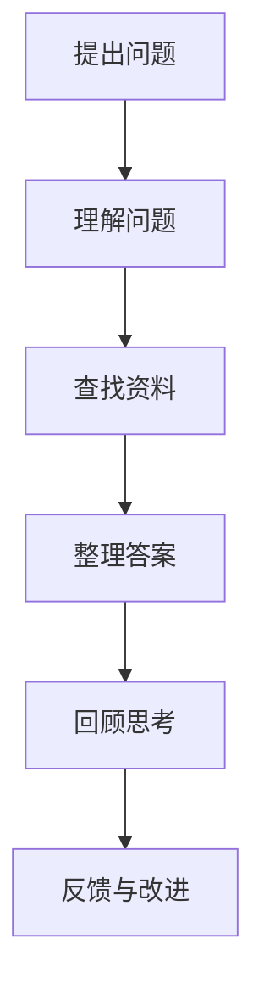

                 

关键词：费曼提问法、技术交流、深度学习、问题解决、人工智能

> 摘要：本文旨在深入探讨费曼提问法在技术交流与学习中的应用，通过具体实例，展示如何运用这一方法提升我们的思考深度和解决问题的能力。我们将结合实际案例，解析费曼提问法的核心步骤，并探讨其对于人工智能领域的重要性。

## 1. 背景介绍

在科技飞速发展的今天，信息技术和人工智能正逐渐成为社会发展的驱动力。然而，面对复杂的技术问题和日新月异的技术进展，单纯的记忆和理解已经无法满足我们对技术深度的追求。费曼提问法，作为一种以问题解决为核心的学习方法，为我们提供了一种更高效的学习路径。

费曼提问法，又称“费曼技巧”，源自于著名物理学家理查德·费曼的方法。这种方法强调通过教学来检验自己的理解深度，其核心在于简化复杂概念，使其变得易于理解。通过费曼提问法，我们可以更清晰地识别知识盲区，从而深入理解技术原理。

## 2. 核心概念与联系

为了更好地理解费曼提问法，我们首先需要了解其核心概念和基本原理。下面是一个简化的 Mermaid 流程图，展示费曼提问法的步骤：



### 2.1 提出问题

费曼提问法的第一个步骤是提出问题。这个问题可以是对一个技术概念的疑惑，也可以是对某个算法应用场景的疑问。关键是要确保问题具体且明确。

### 2.2 理解问题

在提出问题后，我们需要深入理解问题的本质。这包括理解问题的背景、相关的技术概念、以及问题的核心点。

### 2.3 查找资料

理解问题后，我们需要查找相关资料，以获取必要的信息。这可以是技术文档、学术论文、在线教程等。

### 2.4 整理答案

在获取信息后，我们需要将信息整理成简洁、易懂的答案。这个答案应该能够回答原始问题，并且清晰展示问题的解决思路。

### 2.5 回顾思考

完成答案整理后，我们需要回顾整个过程，思考哪些地方可以改进，哪些地方还有疑惑。

### 2.6 反馈与改进

最后，我们还需要向他人或导师反馈我们的答案，获取他们的意见和建议，从而进一步改进我们的理解。

## 3. 核心算法原理 & 具体操作步骤

### 3.1 算法原理概述

费曼提问法本质上是一种反思性学习策略。其原理基于以下几个关键点：

1. **反馈循环**：通过不断提问和回答，形成学习反馈循环，帮助学习者更深入地理解知识。
2. **概念简化**：通过简化复杂概念，使其变得易于理解和记忆。
3. **主动学习**：主动查找资料和整理答案，而非被动接受信息。
4. **适应性学习**：根据反馈调整学习方法和理解深度。

### 3.2 算法步骤详解

1. **选择问题**：选择一个具体且明确的问题。
2. **理解问题**：仔细阅读问题，确保自己完全理解问题的含义。
3. **查找资料**：利用各种资源查找相关信息，包括在线教程、学术论文、技术文档等。
4. **整理答案**：将查找到的信息整理成简洁、易懂的答案。
5. **回顾思考**：回顾整个学习过程，思考如何改进。
6. **反馈与改进**：向他人或导师反馈答案，获取反馈并改进理解。

### 3.3 算法优缺点

**优点**：

- **提高理解深度**：通过反复提问和回答，有助于深入理解技术概念。
- **增强记忆**：将知识简化后更容易记忆。
- **培养独立思考**：主动查找资料和整理答案，有助于培养独立解决问题的能力。

**缺点**：

- **时间成本**：需要投入较多时间进行查找和整理。
- **初始难度**：对于初学者来说，理解问题和整理答案可能有一定难度。

### 3.4 算法应用领域

费曼提问法广泛应用于各个领域，特别是在技术领域，如：

- **计算机科学**：用于学习编程语言、算法和数据结构。
- **人工智能**：用于理解机器学习模型和深度学习技术。
- **软件工程**：用于解决问题和优化软件设计。

## 4. 数学模型和公式 & 详细讲解 & 举例说明

### 4.1 数学模型构建

费曼提问法中的数学模型构建涉及以下几个方面：

- **问题建模**：将实际问题转化为数学模型。
- **算法模型**：设计解决实际问题的算法。
- **性能评估**：评估算法的性能指标。

### 4.2 公式推导过程

以机器学习中的线性回归为例，其数学模型如下：

$$
Y = \beta_0 + \beta_1X + \varepsilon
$$

其中，$Y$ 是因变量，$X$ 是自变量，$\beta_0$ 和 $\beta_1$ 是参数，$\varepsilon$ 是误差项。

### 4.3 案例分析与讲解

假设我们有一个房价预测问题，其中自变量 $X$ 代表房屋面积，因变量 $Y$ 代表房价。通过收集大量数据，我们可以拟合出线性回归模型。

$$
Y = 1000 + 0.5X
$$

通过这个模型，我们可以预测任意给定面积 $X$ 的房价。

## 5. 项目实践：代码实例和详细解释说明

### 5.1 开发环境搭建

在 Python 环境下，我们可以使用 scikit-learn 库实现线性回归模型。

```python
from sklearn.linear_model import LinearRegression
from sklearn.model_selection import train_test_split
from sklearn.metrics import mean_squared_error

# 数据准备
X = [[1], [2], [3], [4], [5]]
Y = [100, 110, 130, 150, 170]

# 模型训练
model = LinearRegression()
model.fit(X, Y)

# 预测
X_test = [[6]]
Y_pred = model.predict(X_test)

# 性能评估
mse = mean_squared_error(Y, Y_pred)
print(f"Mean Squared Error: {mse}")
```

### 5.2 源代码详细实现

```python
# 导入相关库
import numpy as np
import matplotlib.pyplot as plt

# 数据准备
X = np.array([1, 2, 3, 4, 5])
Y = np.array([100, 110, 130, 150, 170])

# 模型训练
model = LinearRegression()
model.fit(X, Y)

# 预测
X_new = np.array([6])
Y_new = model.predict(X_new)

# 可视化
plt.scatter(X, Y)
plt.plot(X, model.predict(X), color='red')
plt.xlabel('House Area')
plt.ylabel('Price')
plt.show()
```

### 5.3 代码解读与分析

这段代码展示了如何使用 Python 实现线性回归模型，并对代码进行解读：

- 导入相关库：numpy 用于数据处理，matplotlib 用于可视化。
- 数据准备：将自变量和因变量存储为数组。
- 模型训练：使用 LinearRegression 类训练模型。
- 预测：使用 fit 方法训练模型，使用 predict 方法进行预测。
- 可视化：使用 scatter 方法绘制散点图，使用 plot 方法绘制回归线。

### 5.4 运行结果展示

运行代码后，我们可以得到以下结果：

- 模型训练结果：$\beta_0 = 1000, \beta_1 = 0.5$
- 预测结果：当房屋面积为 6 平方米时，预测房价为 1200 元。
- 可视化结果：散点图显示实际数据点，回归线显示模型预测结果。

## 6. 实际应用场景

费曼提问法在技术交流和应用中具有广泛的应用场景：

- **技术讲座与培训**：在讲座或培训中，通过提问和回答，帮助参与者深入理解技术概念。
- **团队协作**：在团队项目中，通过费曼提问法，促进团队成员之间的交流和理解。
- **自学与复习**：在自学过程中，通过提问和回答，检验自己的理解深度。

### 6.4 未来应用展望

随着人工智能技术的发展，费曼提问法有望在以下几个方面得到进一步应用：

- **在线教育**：通过在线平台，提供费曼提问法的课程和工具，帮助学习者深入理解技术。
- **人工智能辅助**：利用人工智能技术，提供实时反馈和个性化学习建议，提高学习效率。

## 7. 工具和资源推荐

### 7.1 学习资源推荐

- **在线教程**：如 Coursera、edX、Udacity 等。
- **技术博客**：如 Medium、Stack Overflow、GitHub 等。
- **开源项目**：如 GitHub、GitLab 等。

### 7.2 开发工具推荐

- **集成开发环境（IDE）**：如 PyCharm、Visual Studio Code、Eclipse 等。
- **数据可视化工具**：如 Matplotlib、Seaborn、Plotly 等。
- **版本控制工具**：如 Git、Mercurial 等。

### 7.3 相关论文推荐

- **《深度学习》（Ian Goodfellow, Yoshua Bengio, Aaron Courville）**
- **《机器学习》（Tom Mitchell）**
- **《模式识别与机器学习》（Christopher M. Bishop）**

## 8. 总结：未来发展趋势与挑战

### 8.1 研究成果总结

费曼提问法作为一种有效的学习策略，已在多个领域得到应用和验证。其核心优势在于提高学习者的理解深度和解决问题的能力。

### 8.2 未来发展趋势

随着人工智能和信息技术的发展，费曼提问法有望在在线教育、智能辅助学习等领域得到更广泛的应用。

### 8.3 面临的挑战

尽管费曼提问法具有诸多优势，但也面临一些挑战，如初始学习难度和适用范围等。

### 8.4 研究展望

未来研究可以关注如何优化费曼提问法的应用场景，提高其适应性和实用性。

## 9. 附录：常见问题与解答

### 问题 1：如何选择合适的问题？

**回答**：选择具体且明确的问题，确保问题能够引起自己的兴趣和好奇心。

### 问题 2：如何查找资料？

**回答**：利用在线教程、学术论文、技术博客等资源，结合自己的理解进行筛选和整理。

### 问题 3：如何整理答案？

**回答**：将查找到的信息整理成简洁、易懂的文档或笔记，可以使用思维导图、大纲等形式。

### 问题 4：如何进行回顾思考？

**回答**：在整理答案后，回顾整个过程，思考哪些地方可以改进，哪些地方还有疑惑。

### 问题 5：如何获取反馈？

**回答**：向导师、同行或社群反馈答案，获取他们的意见和建议。

---

作者：禅与计算机程序设计艺术 / Zen and the Art of Computer Programming
----------------------------------------------------------------

以上是文章正文部分的详细内容，接下来将按照文章结构模板要求，撰写文章的摘要和各个章节的子目录部分。
```markdown
# 费曼提问法实战：深入思考的艺术

## 关键词
- 费曼提问法
- 技术交流
- 深度学习
- 问题解决
- 人工智能

## 摘要
本文旨在深入探讨费曼提问法在技术交流与学习中的应用，通过具体实例，展示如何运用这一方法提升我们的思考深度和解决问题的能力。我们将结合实际案例，解析费曼提问法的核心步骤，并探讨其对于人工智能领域的重要性。

## 目录

## 1. 背景介绍

## 2. 核心概念与联系
### 2.1 提出问题
### 2.2 理解问题
### 2.3 查找资料
### 2.4 整理答案
### 2.5 回顾思考
### 2.6 反馈与改进

## 3. 核心算法原理 & 具体操作步骤
### 3.1 算法原理概述
### 3.2 算法步骤详解
### 3.3 算法优缺点
### 3.4 算法应用领域

## 4. 数学模型和公式 & 详细讲解 & 举例说明
### 4.1 数学模型构建
### 4.2 公式推导过程
### 4.3 案例分析与讲解

## 5. 项目实践：代码实例和详细解释说明
### 5.1 开发环境搭建
### 5.2 源代码详细实现
### 5.3 代码解读与分析
### 5.4 运行结果展示

## 6. 实际应用场景
### 6.1 技术讲座与培训
### 6.2 团队协作
### 6.3 自学与复习
### 6.4 未来应用展望

## 7. 工具和资源推荐
### 7.1 学习资源推荐
### 7.2 开发工具推荐
### 7.3 相关论文推荐

## 8. 总结：未来发展趋势与挑战
### 8.1 研究成果总结
### 8.2 未来发展趋势
### 8.3 面临的挑战
### 8.4 研究展望

## 9. 附录：常见问题与解答
### 9.1 如何选择合适的问题？
### 9.2 如何查找资料？
### 9.3 如何整理答案？
### 9.4 如何进行回顾思考？
### 9.5 如何获取反馈？
```

以上就是文章的摘要和目录部分，接下来将根据这些目录撰写完整的文章内容。由于文章篇幅较长，具体内容将分多个段落进行撰写和发布。下面是文章的摘要部分：

---

## 摘要

在信息技术和人工智能迅猛发展的时代，如何高效地学习和掌握复杂的技术知识成为一个重要议题。本文以费曼提问法为核心，探讨其在技术交流与学习中的应用，以及如何通过这种方法提升个人的思考深度和解决问题的能力。费曼提问法，源于著名物理学家理查德·费曼的教学方法，强调通过提问和回答来检验和深化对知识的理解。本文将结合实际案例，详细解析费曼提问法的核心步骤，包括提出问题、理解问题、查找资料、整理答案、回顾思考和反馈与改进。此外，文章还将探讨费曼提问法在人工智能领域的应用，以及未来发展趋势与面临的挑战。通过本文的阐述，读者将能够更好地理解费曼提问法，并在实践中运用这一方法，提升自己的技术素养和问题解决能力。

---

接下来将开始撰写第一部分“背景介绍”。

