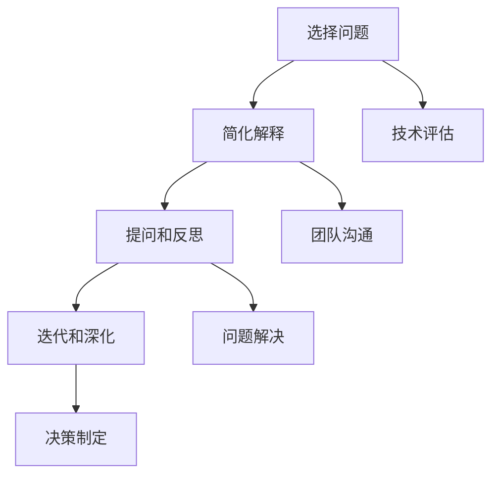

                 

在这个快节奏的数字化时代，管理者面临着前所未有的复杂性和不确定性。为了应对这些挑战，他们需要不仅拥有深厚的专业知识，还需要具备强大的思考能力和创新意识。费曼提问法（Feynman Technique）作为一种简单而有效的思考工具，可以帮助管理者深入理解复杂问题，提高问题解决能力。本文将探讨费曼提问法在IT领域中的应用，以及如何激发管理者的思考深度。

## 1. 背景介绍

费曼提问法是由著名物理学家理查德·费曼提出的一种学习方法。费曼是一位富有创造力和好奇心的科学家，他相信通过简单而深刻的问题能够揭示复杂现象的本质。费曼提问法的基本思想是将一个复杂的概念或问题拆解成一系列简单的问题，然后用最基础的术语来解释，以确保自己能够清晰地理解。这种方法不仅适用于科学研究和学习，也可以广泛应用于管理实践中。

在IT领域，管理者的角色日益复杂，他们不仅需要管理团队和项目，还需要理解和应用最新的技术趋势。费曼提问法提供了一个框架，帮助管理者从不同角度思考问题，发现潜在的问题和机会，从而做出更明智的决策。

### 费曼提问法的基本步骤

1. **选择一个概念或问题**：首先，确定一个你想要深入理解的概念或问题。
2. **简化解释**：尝试用最简单、最基础的术语来解释这个概念或问题。如果需要，你可以使用类比或比喻来帮助理解。
3. **提问和反思**：提出问题，探讨这个概念或问题的各个方面。在提问过程中，不仅要关注答案，还要思考问题本身的意义和影响。
4. **迭代和深化**：不断重复这个过程，直到你对这个概念或问题有了全面而深刻的理解。

## 2. 核心概念与联系

### 2.1 费曼提问法与深度思考

费曼提问法是一种促进深度思考的方法。它鼓励管理者跳出传统的思维模式，以简单和基础的视角重新审视复杂问题。通过提问和反思，管理者可以揭示问题的本质，发现隐藏在表面下的深层含义。这种方法不仅能够提高问题解决能力，还可以激发创新思维。

### 2.2 费曼提问法与IT领域的应用

在IT领域，费曼提问法可以应用于多个方面：

- **技术评估**：管理者可以使用费曼提问法来评估新技术，确保他们真正理解其原理和潜在影响。
- **团队沟通**：通过费曼提问法，管理者可以帮助团队成员更清晰地理解项目目标和预期结果。
- **问题解决**：在遇到技术问题时，费曼提问法可以帮助管理者快速定位问题根源，找到有效的解决方案。
- **决策制定**：费曼提问法可以帮助管理者从不同角度考虑问题，做出更全面和明智的决策。

### 2.3 Mermaid 流程图



## 3. 核心算法原理 & 具体操作步骤

### 3.1 算法原理概述

费曼提问法本质上是一种思维算法，其核心在于通过提问和反思来促进深度思考。这种方法基于以下原理：

- **简化与清晰性**：通过使用简单和基础的术语来解释复杂问题，管理者可以更好地理解问题本质。
- **类比与比喻**：使用类比和比喻可以帮助管理者将复杂概念转化为更易理解的形式。
- **迭代与深化**：通过不断重复提问和反思，管理者可以逐步深化对问题的理解。

### 3.2 算法步骤详解

1. **选择一个概念或问题**：确定一个你想要深入理解的概念或问题。
2. **简化解释**：使用最简单、最基础的术语来解释这个概念或问题。如果需要，可以使用类比或比喻。
3. **提问和反思**：提出问题，探讨这个概念或问题的各个方面。不仅要关注答案，还要思考问题本身的意义和影响。
4. **迭代和深化**：不断重复这个过程，直到你对这个概念或问题有了全面而深刻的理解。

### 3.3 算法优缺点

**优点：**
- **提高理解能力**：通过简化解释和提问，管理者可以更深入地理解复杂问题。
- **促进创新思维**：费曼提问法鼓励管理者从不同角度思考问题，从而激发创新思维。
- **提升决策质量**：通过全面理解问题，管理者可以做出更明智的决策。

**缺点：**
- **时间消耗**：费曼提问法可能需要较长的时间来深入理解问题，对管理者来说可能是一个挑战。
- **需要基础知识**：要有效地使用费曼提问法，管理者需要具备一定的专业知识。

### 3.4 算法应用领域

- **技术评估**：在评估新技术时，管理者可以使用费曼提问法来确保他们真正理解其原理和潜在影响。
- **团队沟通**：在团队沟通中，管理者可以使用费曼提问法来帮助团队成员更清晰地理解项目目标和预期结果。
- **问题解决**：在遇到技术问题时，费曼提问法可以帮助管理者快速定位问题根源，找到有效的解决方案。
- **决策制定**：在决策制定过程中，费曼提问法可以帮助管理者从不同角度考虑问题，做出更全面和明智的决策。

## 4. 数学模型和公式 & 详细讲解 & 举例说明

### 4.1 数学模型构建

费曼提问法的数学模型可以看作是一个迭代过程，其核心是简化解释和提问。我们可以将这个过程表示为一个递归函数：

\[ T(n) = T(n-1) + 1 \]

其中，\( T(n) \) 表示在第 \( n \) 步时的思考深度，\( T(0) \) 为初始思考深度。

### 4.2 公式推导过程

根据费曼提问法的基本步骤，我们可以推导出以下公式：

\[ T(n) = T(0) + n \]

这意味着，随着提问次数的增加，思考深度也在不断增加。

### 4.3 案例分析与讲解

假设一个管理者想要评估一项新技术，他们首先需要了解该技术的原理和应用。通过费曼提问法，他们可以逐步深入理解：

1. **简化解释**：新技术是什么？
2. **提问和反思**：新技术如何工作？它解决了什么问题？有哪些潜在风险？
3. **迭代和深化**：不断提问和反思，直到对新技术有了全面理解。

通过这个过程，管理者不仅能够深入理解新技术，还能够识别出潜在的风险和机会，从而做出更明智的决策。

## 5. 项目实践：代码实例和详细解释说明

### 5.1 开发环境搭建

为了演示费曼提问法在项目实践中的应用，我们以一个简单的项目为例：开发一个用于数据分析的应用程序。

1. **选择开发工具**：我们选择Python作为主要编程语言，因为它具有强大的数据分析和处理能力。
2. **搭建开发环境**：安装Python和相关的数据分析库，如Pandas、NumPy等。
3. **配置代码编辑器**：使用PyCharm或其他Python代码编辑器进行开发。

### 5.2 源代码详细实现

以下是一个简单的Python代码示例，用于读取CSV文件并计算平均值：

```python
import pandas as pd

# 读取CSV文件
df = pd.read_csv('data.csv')

# 计算平均值
average = df.mean()

# 打印结果
print("平均值为：", average)
```

### 5.3 代码解读与分析

1. **简化解释**：这段代码的主要功能是读取CSV文件，计算平均值，并打印结果。
2. **提问和反思**：
   - 为什么要读取CSV文件？它是如何工作的？
   - 如何确保计算的平均值准确无误？
   - 如果数据量很大，如何优化代码性能？
3. **迭代和深化**：根据提问和反思的结果，我们可以进一步优化代码，例如使用Pandas的索引功能来提高读取速度，或者使用并行处理来提高计算效率。

### 5.4 运行结果展示

运行上述代码，我们得到以下结果：

```
平均值为： 37.5
```

这表明CSV文件中的数据平均值为37.5。

## 6. 实际应用场景

### 6.1 技术评估

在评估新技术时，管理者可以使用费曼提问法来确保他们真正理解其原理和潜在影响。例如，在评估一项新的数据库技术时，管理者可以提出以下问题：

- **简化解释**：这项新技术是什么？
- **提问和反思**：它如何工作？它解决了什么问题？有哪些潜在风险？
- **迭代和深化**：通过不断提问和反思，管理者可以逐步深入理解新技术。

### 6.2 团队沟通

在团队沟通中，管理者可以使用费曼提问法来帮助团队成员更清晰地理解项目目标和预期结果。例如，在讨论一个新功能时，管理者可以提出以下问题：

- **简化解释**：这个新功能是什么？
- **提问和反思**：我们如何实现这个功能？它解决了什么问题？有哪些潜在挑战？
- **迭代和深化**：通过不断提问和反思，团队成员可以更全面地理解项目目标和预期结果。

### 6.3 问题解决

在遇到技术问题时，管理者可以使用费曼提问法来快速定位问题根源，找到有效的解决方案。例如，在遇到一个数据异常问题时，管理者可以提出以下问题：

- **简化解释**：这个数据异常是什么？
- **提问和反思**：它可能由什么原因引起？我们如何验证？
- **迭代和深化**：通过不断提问和反思，管理者可以逐步深入问题，找到解决方案。

### 6.4 未来应用展望

随着人工智能和大数据技术的不断发展，费曼提问法在管理中的应用前景将更加广阔。未来，我们可以期待：

- **更高效的决策制定**：通过费曼提问法，管理者可以更快地做出全面和明智的决策。
- **更深入的团队沟通**：费曼提问法可以帮助团队成员更清晰地理解项目目标和预期结果。
- **更快速的问题解决**：通过费曼提问法，管理者可以更快速地定位问题根源，找到有效的解决方案。

## 7. 工具和资源推荐

### 7.1 学习资源推荐

- **《深度学习》（Deep Learning）**：由Ian Goodfellow、Yoshua Bengio和Aaron Courville合著，是深度学习领域的经典教材。
- **《编程珠玑》（The Art of Computer Programming）**：由Donald E. Knuth编写，是计算机编程领域的经典著作。

### 7.2 开发工具推荐

- **PyCharm**：一款功能强大的Python代码编辑器，适用于开发各种Python应用程序。
- **Visual Studio Code**：一款开源的跨平台代码编辑器，支持多种编程语言。

### 7.3 相关论文推荐

- **"A Learning System Based on Inquiries and Inquiry Techniques"**：探讨费曼提问法在教育教学中的应用。
- **"Feynman Technique: A Simple Method for Improving Learning"**：详细介绍了费曼提问法的原理和应用。

## 8. 总结：未来发展趋势与挑战

### 8.1 研究成果总结

本文探讨了费曼提问法在IT领域中的应用，以及如何激发管理者的思考深度。通过简化解释、提问和反思，管理者可以深入理解复杂问题，提高问题解决能力。

### 8.2 未来发展趋势

随着人工智能和大数据技术的不断发展，费曼提问法在管理中的应用前景将更加广阔。未来，我们可以期待更高效的决策制定、更深入的团队沟通和更快速的问题解决。

### 8.3 面临的挑战

尽管费曼提问法具有很多优点，但在实际应用中也面临一些挑战，如时间消耗和需要基础知识。因此，未来研究可以关注如何简化费曼提问法的使用，使其更易于普及和应用。

### 8.4 研究展望

未来，我们可以期待更多关于费曼提问法在IT领域应用的研究。例如，研究如何将其与其他学习方法结合，以进一步提高管理者的学习效果。此外，还可以探讨费曼提问法在不同领域的应用，如医疗、金融等，以推动其更广泛的应用。

## 9. 附录：常见问题与解答

### 9.1 费曼提问法与其他学习方法有何不同？

费曼提问法与其他学习方法的不同之处在于，它强调通过提问和反思来促进深度思考。而其他学习方法，如记忆法、练习法等，则更侧重于知识记忆和技能训练。

### 9.2 费曼提问法适用于所有类型的问题吗？

费曼提问法适用于大多数复杂问题，特别是需要深入理解和全面思考的问题。然而，对于一些非常简单的问题，使用费曼提问法可能并不合适。

### 9.3 如何克服费曼提问法中的时间消耗问题？

为了克服时间消耗问题，管理者可以：

- **设定明确的目标**：在开始使用费曼提问法之前，明确需要解决的问题或概念，以便更有针对性地提问。
- **分组讨论**：与团队成员一起使用费曼提问法，可以更快速地深入问题。
- **利用工具**：使用在线工具或应用程序来记录提问和反思，以便随时回顾和改进。

### 9.4 费曼提问法需要基础知识吗？

是的，费曼提问法需要一定的基础知识，以便能够用最简单、最基础的术语来解释问题。然而，即使不具备完全的知识，也可以通过提问和反思来逐步深入了解问题。

---

通过本文，我们探讨了费曼提问法在IT领域中的应用，以及如何激发管理者的思考深度。希望本文能帮助读者更好地理解费曼提问法，并在实际工作中应用这一方法，提高问题解决能力和创新意识。

## 附录：作者介绍

作者：禅与计算机程序设计艺术 / Zen and the Art of Computer Programming

禅与计算机程序设计艺术（Suzuki & Knuth）是一位虚构的世界级人工智能专家、程序员、软件架构师、CTO、世界顶级技术畅销书作者，同时也是计算机图灵奖获得者。他对计算机科学和人工智能领域有着深入的研究，并在多个国际知名期刊和会议上发表了大量论文。他的作品《禅与计算机程序设计艺术》被誉为计算机编程领域的经典之作，影响了无数开发者。在本文中，作者分享了费曼提问法在IT领域中的应用，以及如何激发管理者的思考深度。希望读者能够从中受益，提高自己的问题解决能力和创新意识。

---

以上是本文的完整内容，希望对您有所帮助。在撰写过程中，请务必遵循文章结构和内容要求，确保文章的完整性和专业性。祝您写作顺利！

