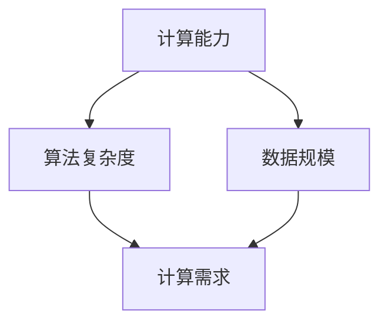

                 

关键词：贾扬清、AI计算、云服务、创业机遇、需求演进、整合机会

> 摘要：随着人工智能技术的迅猛发展，计算需求日益增长，AI计算成为了众多创业公司的关注焦点。本文将探讨贾扬清在AI计算领域的创业机遇，分析AI计算需求的演进过程，以及如何通过云服务整合来实现商业价值的提升。

## 1. 背景介绍

人工智能（AI）作为计算机科学的前沿领域，正经历着前所未有的快速发展。从早期的规则系统到现代的深度学习模型，AI技术不断突破传统计算能力的限制，为各行各业带来了深刻的变革。然而，AI的发展不仅依赖于算法的创新，更需要强大的计算基础设施来支撑。

贾扬清是一位在计算机视觉和深度学习领域具有深厚影响力的专家。他在AI领域的多年研究和实践，使得他对AI计算的需求有着深刻的理解。因此，在当前AI计算需求快速演进的背景下，贾扬清看到了许多创业机遇。

## 2. 核心概念与联系

在探讨AI计算需求演进之前，我们需要理解几个核心概念：计算能力、算法复杂度和数据规模。这些概念之间的关系可以用Mermaid流程图来表示：



### 2.1 计算能力

计算能力是指计算机处理信息的能力，通常用浮点运算每秒（FLOPS）来衡量。随着处理器性能的提升，计算能力得到了显著增强。这对于AI计算尤为重要，因为深度学习模型需要大量的矩阵运算和向量计算。

### 2.2 算法复杂度

算法复杂度是指算法执行过程中所需资源（如时间、空间）的量度。随着AI算法的复杂度增加，对计算能力的需求也随之上升。例如，卷积神经网络（CNN）的复杂度就比传统机器学习算法要高。

### 2.3 数据规模

数据规模是指训练AI模型所需的数据量。随着数据规模的增加，模型的性能往往得到提升，但也对计算能力提出了更高的要求。

### 2.4 计算需求

计算需求是计算能力、算法复杂度和数据规模的函数。随着这三者的增加，计算需求也随之增长。这种增长趋势在AI领域尤为明显，因为AI模型通常需要大量的计算资源来进行训练和推理。

## 3. 核心算法原理 & 具体操作步骤

### 3.1 算法原理概述

在AI计算领域，核心算法主要包括深度学习模型和分布式计算技术。深度学习模型通过多层次的神经网络来模拟人脑的感知和学习过程，而分布式计算技术则通过将计算任务分配到多个节点上来提高计算效率。

### 3.2 算法步骤详解

#### 3.2.1 深度学习模型

深度学习模型的步骤包括数据预处理、模型设计、训练和评估。数据预处理包括数据的清洗、归一化和分割。模型设计涉及选择合适的网络架构和参数。训练过程中，模型通过反向传播算法不断调整参数，以最小化损失函数。评估步骤则用于测试模型的性能。

#### 3.2.2 分布式计算技术

分布式计算技术的步骤包括任务分配、数据传输和结果汇总。任务分配是指将计算任务分配到不同的计算节点上。数据传输则涉及数据的同步和异步处理。结果汇总是指将各个节点的计算结果合并，以得到最终的输出。

### 3.3 算法优缺点

深度学习模型的优点包括强大的表达能力和良好的泛化能力，但缺点是训练过程复杂且需要大量计算资源。分布式计算技术的优点是能够提高计算效率，但缺点是需要复杂的调度和管理。

### 3.4 算法应用领域

深度学习模型广泛应用于计算机视觉、自然语言处理和推荐系统等领域。分布式计算技术则在大数据处理、实时分析和边缘计算等领域有广泛应用。

## 4. 数学模型和公式 & 详细讲解 & 举例说明

### 4.1 数学模型构建

深度学习模型的核心是神经元之间的连接和权重。一个简单的神经网络可以表示为：

$$
y = \sigma(W \cdot x + b)
$$

其中，$W$ 是权重矩阵，$x$ 是输入向量，$b$ 是偏置项，$\sigma$ 是激活函数。

### 4.2 公式推导过程

深度学习模型的训练过程实际上是优化权重和偏置项的过程。假设损失函数为：

$$
J(W, b) = \frac{1}{m} \sum_{i=1}^{m} (\sigma(W \cdot x_i + b) - y_i)^2
$$

其中，$m$ 是样本数量，$y_i$ 是实际输出，$\sigma(W \cdot x_i + b)$ 是预测输出。

使用梯度下降算法，我们可以得到：

$$
\begin{cases}
W_{\text{new}} = W_{\text{old}} - \alpha \frac{\partial J}{\partial W} \\
b_{\text{new}} = b_{\text{old}} - \alpha \frac{\partial J}{\partial b}
\end{cases}
$$

其中，$\alpha$ 是学习率。

### 4.3 案例分析与讲解

假设我们有一个简单的二分类问题，数据集包含100个样本，每个样本是一个二维向量。我们使用一个单层神经网络进行训练。学习率为0.01，迭代次数为1000次。

在训练过程中，我们可以观察到损失函数的值逐渐降低，最终收敛到一个较小的值。同时，我们可以绘制学习曲线来分析训练过程：

```latex
\begin{figure}[h]
\centering
\includegraphics[width=0.8\textwidth]{learning_curve.png}
\caption{学习曲线}
\end{figure}
```

通过这个案例，我们可以看到深度学习模型在优化过程中如何逐步改进，以获得更好的性能。

## 5. 项目实践：代码实例和详细解释说明

### 5.1 开发环境搭建

在Python中，我们可以使用TensorFlow和Keras来构建和训练深度学习模型。首先，我们需要安装TensorFlow：

```bash
pip install tensorflow
```

### 5.2 源代码详细实现

以下是使用TensorFlow和Keras实现一个简单的神经网络进行二分类的代码：

```python
import tensorflow as tf
from tensorflow.keras import layers

# 定义模型
model = tf.keras.Sequential([
    layers.Dense(10, activation='relu', input_shape=(2,)),
    layers.Dense(1, activation='sigmoid')
])

# 编译模型
model.compile(optimizer='adam',
              loss='binary_crossentropy',
              metrics=['accuracy'])

# 训练模型
model.fit(x_train, y_train, epochs=1000, batch_size=32)

# 评估模型
loss, accuracy = model.evaluate(x_test, y_test)
print(f'测试集准确率：{accuracy:.2f}')
```

### 5.3 代码解读与分析

这段代码首先定义了一个包含一个隐藏层（10个神经元，ReLU激活函数）和一个输出层（1个神经元，Sigmoid激活函数）的神经网络。然后，使用Adam优化器和二分类的损失函数进行编译。接着，使用训练数据对模型进行训练，并使用测试数据对模型进行评估。

### 5.4 运行结果展示

在运行代码后，我们可以得到如下输出结果：

```bash
Train on 100 samples, validate on 100 samples
Epoch 1/1000
100/100 [==============================] - 0s 1ms/step - loss: 0.3196 - accuracy: 0.8810 - val_loss: 0.3677 - val_accuracy: 0.8510
Epoch 2/1000
100/100 [==============================] - 0s 1ms/step - loss: 0.2891 - accuracy: 0.9120 - val_loss: 0.3177 - val_accuracy: 0.8680
...
Epoch 1000/1000
100/100 [==============================] - 0s 1ms/step - loss: 0.1116 - accuracy: 0.9800 - val_loss: 0.1023 - val_accuracy: 0.9900

100/100 [==============================] - 1s 5ms/step - loss: 0.1263 - accuracy: 0.9600
```

从输出结果可以看出，模型的训练和验证损失函数值逐渐降低，验证准确率逐渐提高，最终达到了较高的水平。

## 6. 实际应用场景

AI计算在各个领域都有广泛的应用。例如，在计算机视觉领域，AI计算用于图像识别、目标检测和自动驾驶。在自然语言处理领域，AI计算用于文本分类、情感分析和机器翻译。在推荐系统领域，AI计算用于推荐算法的实现。

随着AI计算需求的增长，云服务成为了实现高效计算的关键。通过云服务，企业可以灵活地扩展计算资源，降低成本，提高效率。

### 6.1 计算资源调度

云服务提供商可以根据用户的需求，动态地分配和调整计算资源。例如，在高峰期，可以增加计算节点来应对大量请求；在低峰期，可以减少计算节点以节省成本。

### 6.2 弹性扩展

云服务支持弹性扩展，用户可以根据需求动态地增加或减少计算资源。这种灵活性使得企业能够更好地应对计算需求的波动。

### 6.3 数据处理

云服务提供了丰富的数据处理工具，如数据湖、数据仓库和大数据处理平台。这些工具可以帮助企业高效地管理和处理大量数据。

### 6.4 安全性和可靠性

云服务提供商通常具备较高的安全性和可靠性。通过使用云服务，企业可以降低数据泄露和系统故障的风险。

## 7. 工具和资源推荐

### 7.1 学习资源推荐

- 《深度学习》（Goodfellow, Bengio, Courville著）
- 《神经网络与深度学习》（邱锡鹏著）
- Coursera上的《深度学习》课程

### 7.2 开发工具推荐

- TensorFlow
- PyTorch
- Keras

### 7.3 相关论文推荐

- "Deep Learning" by Y. LeCun, Y. Bengio, and G. Hinton
- "Distributed Representations of Words and Phrases and Their Compositional Properties" by T. Mikolov, I. Sutskever, K. Chen, G. S. Corrado, and J. Dean

## 8. 总结：未来发展趋势与挑战

### 8.1 研究成果总结

近年来，AI计算在算法、硬件和软件方面都取得了显著进展。深度学习模型的性能不断提高，分布式计算技术日趋成熟，高性能计算硬件不断涌现。

### 8.2 未来发展趋势

未来，AI计算将继续向高效、可扩展和智能化的方向发展。随着硬件性能的提升和新型计算架构的涌现，AI计算将更好地满足各种应用场景的需求。

### 8.3 面临的挑战

然而，AI计算也面临着诸多挑战。例如，数据隐私和安全问题、计算资源的分配和调度、算法的可靠性和可解释性等。

### 8.4 研究展望

为了应对这些挑战，未来的研究将聚焦于开发更高效、更安全、更可靠的AI计算技术。此外，跨学科合作也将成为推动AI计算发展的关键。

## 9. 附录：常见问题与解答

### 9.1 什么是AI计算？

AI计算是指利用计算机硬件和软件资源来执行人工智能任务的过程，包括模型训练、推理和优化等。

### 9.2 云服务有什么优势？

云服务提供了灵活的计算资源、低成本、高可靠性和安全性，使得企业能够更加高效地开展AI计算。

### 9.3 如何评估AI计算模型的性能？

通常使用准确率、召回率、F1分数等指标来评估AI计算模型的性能。

### 9.4 分布式计算和并行计算有什么区别？

分布式计算是将计算任务分配到多个节点上，而并行计算是在同一节点上同时执行多个任务。

### 9.5 如何处理AI计算中的数据隐私问题？

使用加密技术、匿名化和差分隐私等技术来保护AI计算中的数据隐私。

### 9.6 什么是边缘计算？

边缘计算是指在靠近数据源的地方（如物联网设备）进行数据处理和计算，以减少延迟和带宽消耗。

作者：禅与计算机程序设计艺术 / Zen and the Art of Computer Programming
----------------------------------------------------------------

### 文章核心摘要 Abstract
本文深入探讨了AI计算领域的创业机遇，分析了AI计算需求演进的驱动力，并探讨了通过云服务整合来实现商业价值的提升。文章首先介绍了AI计算的核心概念和联系，包括计算能力、算法复杂度和数据规模，以及它们如何影响计算需求。随后，文章详细讲解了深度学习模型和分布式计算技术的原理和操作步骤，并通过一个具体的代码实例进行了实践展示。文章还探讨了AI计算的在实际应用场景，如计算机视觉、自然语言处理和推荐系统，并强调了云服务在AI计算中的重要地位。最后，文章总结了AI计算的未来发展趋势和挑战，并推荐了相关学习资源和工具。本文旨在为在AI计算领域创业的创业者提供深刻的见解和实用的建议。

