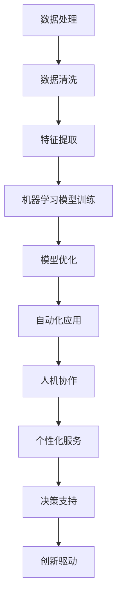

                 

在快速发展的技术时代，人工智能正在成为改变世界的核心力量。它不仅重新定义了生产力和效率，还深刻影响了个体潜能的释放。本文将探讨如何通过人工智能技术赋能人类，释放个体潜能，并创造出无限可能。

## 关键词

- 人工智能
- 个体潜能
- 生产力
- 效率
- 创新驱动
- 人类发展

## 摘要

本文首先介绍了人工智能的背景和核心概念，接着深入探讨了人工智能如何赋能人类，特别是在提高生产力、效率和创新能力方面。随后，文章通过具体的案例和数学模型，展示了人工智能技术的实际应用。最后，本文对未来人工智能的发展趋势和应用场景进行了展望，并提出了面临的挑战和解决方案。

## 1. 背景介绍

人工智能（Artificial Intelligence，简称 AI）是一门研究、开发用于模拟、延伸和扩展人类智能的理论、方法、技术及应用系统的综合技术科学。随着计算机技术、大数据、算法优化等领域的飞速发展，人工智能已经逐渐从理论走向实际应用，成为了推动社会进步的重要力量。

在过去的几十年中，人工智能经历了多个发展阶段，从早期的符号主义、基于规则的系统，到基于概率统计的机器学习，再到以深度学习为代表的现代人工智能。这些技术进步使得人工智能在图像识别、自然语言处理、决策支持等领域取得了显著的成果。

### 1.1 人工智能的发展历程

1. **符号主义（Symbolic AI）**：基于逻辑和符号推理的系统，如专家系统（Expert Systems），它在20世纪80年代初期引起了广泛关注。
   
2. **基于规则的系统（Rule-Based Systems）**：通过规则来模拟人类专家的决策过程，广泛应用于医疗诊断、财务分析等领域。

3. **机器学习（Machine Learning）**：通过训练数据学习模式，实现自我改进。这一阶段以1997年IBM的深蓝计算机战胜国际象棋世界冠军为标志。

4. **深度学习（Deep Learning）**：基于多层神经网络的结构，可以自动学习和提取特征，如图像识别、语音识别等。

5. **现代人工智能（Modern AI）**：结合大数据、云计算等技术，人工智能应用场景不断拓展，从互联网搜索、智能助手到自动驾驶、医疗诊断等。

### 1.2 人工智能的核心概念

- **机器学习**：机器学习是人工智能的一个重要分支，主要研究如何让计算机从数据中学习并做出决策。常见的机器学习方法包括监督学习、无监督学习和强化学习。

- **神经网络**：神经网络是模拟人脑神经元结构和功能的计算模型，通过大量神经元之间的连接和激活函数，实现数据的输入输出。

- **深度学习**：深度学习是一种特殊的神经网络结构，具有多个隐层，可以自动学习复杂的数据特征。

- **自然语言处理**（NLP）：NLP是人工智能的一个分支，致力于让计算机理解和处理人类自然语言。

- **计算机视觉**：计算机视觉是人工智能的一个分支，研究如何使计算机“看到”和理解图像和视频。

## 2. 核心概念与联系

### 2.1 核心概念原理

人工智能赋能人类的原理主要在于以下几个方面：

1. **数据处理能力**：人工智能可以通过算法快速处理和分析大量数据，从而发现数据中的模式和规律，提高决策的准确性。

2. **自动化和优化**：人工智能可以通过自动化和优化，减少人类在重复性工作上的时间投入，提高生产效率和产品质量。

3. **人机协作**：人工智能可以与人类协作，通过模拟人类的思维方式，帮助人类解决复杂问题，提升创新能力。

4. **个性化服务**：人工智能可以根据用户的行为和需求，提供个性化的服务和推荐，提升用户体验。

### 2.2 架构流程图

以下是人工智能赋能人类的核心架构流程图：



### 2.3 各个模块的详细解释

- **数据处理**：包括数据收集、存储、预处理和清洗等步骤，是人工智能的基础。
- **特征提取**：从原始数据中提取出有助于机器学习的特征，提高模型的准确性。
- **机器学习模型训练**：使用训练数据集，通过算法训练模型，使其能够对未知数据进行预测和决策。
- **模型优化**：通过对模型进行调参和优化，提高模型的性能和泛化能力。
- **自动化应用**：将训练好的模型应用于实际场景，实现自动化决策和操作。
- **人机协作**：通过模拟人类思维和决策过程，帮助人类解决问题，提高工作效率。
- **个性化服务**：根据用户行为和偏好，提供个性化的服务和推荐。
- **决策支持**：为人类决策提供数据分析和预测，提高决策的准确性。
- **创新驱动**：通过人工智能技术，推动人类在各个领域的创新和发展。

## 3. 核心算法原理 & 具体操作步骤

### 3.1 算法原理概述

人工智能的核心算法主要包括机器学习算法、深度学习算法和强化学习算法。以下是这三种算法的简要概述：

- **机器学习算法**：通过训练数据集，学习数据中的模式和规律，实现对新数据的预测和分类。
- **深度学习算法**：基于多层神经网络，自动提取数据中的特征，实现复杂的数据处理和分析。
- **强化学习算法**：通过与环境的交互，不断学习和优化策略，实现目标的最优化。

### 3.2 算法步骤详解

#### 3.2.1 机器学习算法步骤

1. **数据收集**：收集用于训练的数据集，确保数据的质量和多样性。
2. **数据预处理**：对数据进行清洗、归一化和特征提取，提高数据的质量和模型的性能。
3. **选择算法**：根据问题的类型和数据的特点，选择合适的机器学习算法。
4. **训练模型**：使用训练数据集，通过算法训练模型，调整模型的参数。
5. **模型评估**：使用测试数据集评估模型的性能，确定模型的准确性和泛化能力。
6. **模型优化**：通过调参和优化，提高模型的性能和泛化能力。
7. **应用模型**：将训练好的模型应用于实际场景，实现自动化决策和操作。

#### 3.2.2 深度学习算法步骤

1. **数据收集**：与机器学习算法相同，收集用于训练的数据集。
2. **数据预处理**：与机器学习算法相同，对数据进行清洗、归一化和特征提取。
3. **构建神经网络**：设计神经网络的结构，包括层数、每层的神经元数和激活函数等。
4. **初始化参数**：随机初始化神经网络的参数。
5. **前向传播**：将数据输入神经网络，通过反向传播算法更新网络参数。
6. **反向传播**：根据输出误差，反向传播误差，更新网络参数。
7. **模型评估**：使用测试数据集评估模型的性能。
8. **模型优化**：通过调参和优化，提高模型的性能和泛化能力。
9. **应用模型**：将训练好的模型应用于实际场景。

#### 3.2.3 强化学习算法步骤

1. **环境初始化**：初始化环境状态。
2. **选择动作**：根据当前状态，选择一个动作。
3. **执行动作**：在环境中执行选择出的动作。
4. **获得奖励**：根据动作的结果，获得环境反馈的奖励。
5. **更新状态**：根据动作的结果，更新环境状态。
6. **评估策略**：根据奖励和历史记录，评估策略的有效性。
7. **策略优化**：根据评估结果，优化策略。
8. **重复过程**：重复选择动作、执行动作、获得奖励和更新状态的过程，直到达到目标状态。

### 3.3 算法优缺点

#### 3.3.1 机器学习算法优缺点

**优点**：

- **灵活性强**：可以处理多种类型的数据和问题。
- **自动化程度高**：通过算法自动调整参数和模型。
- **泛化能力强**：通过训练数据集，模型可以推广到未知数据。

**缺点**：

- **对数据质量要求高**：需要大量高质量的训练数据。
- **计算资源消耗大**：训练过程需要大量计算资源。
- **解释性差**：难以解释模型内部的决策过程。

#### 3.3.2 深度学习算法优缺点

**优点**：

- **强大的特征提取能力**：可以自动提取数据中的复杂特征。
- **处理复杂数据能力强**：可以处理高维数据和图像、语音等多媒体数据。
- **模型泛化能力强**：通过多层神经网络，可以推广到未知数据。

**缺点**：

- **对数据质量要求高**：需要大量高质量的训练数据。
- **训练时间较长**：多层神经网络需要大量训练时间。
- **参数调整复杂**：需要大量调参和优化。

#### 3.3.3 强化学习算法优缺点

**优点**：

- **自适应性强**：可以动态调整策略，适应环境变化。
- **可处理动态环境**：可以处理动态变化的决策问题。
- **灵活性高**：可以根据奖励信号调整策略。

**缺点**：

- **收敛速度慢**：需要大量交互和试错过程。
- **对奖励设计要求高**：需要设计合适的奖励机制，否则可能导致收敛困难。
- **适用场景有限**：主要适用于决策问题，不适用于结构化数据。

### 3.4 算法应用领域

#### 3.4.1 机器学习应用领域

- **分类问题**：如垃圾邮件检测、信用卡欺诈检测等。
- **回归问题**：如房价预测、股票价格预测等。
- **聚类问题**：如客户细分、数据挖掘等。
- **推荐系统**：如电商推荐、电影推荐等。

#### 3.4.2 深度学习应用领域

- **计算机视觉**：如图像识别、人脸识别、自动驾驶等。
- **自然语言处理**：如机器翻译、文本分类、语音识别等。
- **医疗诊断**：如癌症诊断、医学图像分析等。
- **金融风控**：如信用评分、风险控制等。

#### 3.4.3 强化学习应用领域

- **游戏**：如围棋、星际争霸等。
- **机器人控制**：如自动驾驶、无人机控制等。
- **资源调度**：如电力调度、网络优化等。
- **供应链管理**：如库存控制、配送优化等。

## 4. 数学模型和公式 & 详细讲解 & 举例说明

### 4.1 数学模型构建

人工智能算法的核心是数学模型。下面我们将介绍几个常见的数学模型及其构建过程。

#### 4.1.1 神经网络模型

神经网络模型是深度学习的基础。一个简单的神经网络模型可以表示为：

$$
Y = f(Z)
$$

其中，$Y$ 是输出层，$Z$ 是输入层，$f$ 是激活函数。一个典型的激活函数是 sigmoid 函数：

$$
f(x) = \frac{1}{1 + e^{-x}}
$$

#### 4.1.2 机器学习模型

机器学习模型通常包括线性回归、逻辑回归、支持向量机（SVM）等。以线性回归为例，其模型可以表示为：

$$
Y = \beta_0 + \beta_1X
$$

其中，$Y$ 是因变量，$X$ 是自变量，$\beta_0$ 和 $\beta_1$ 是模型参数。

#### 4.1.3 强化学习模型

强化学习模型的核心是价值函数和策略函数。价值函数可以表示为：

$$
V(s) = \sum_{s'} P(s' | s) \cdot R(s')
$$

其中，$V(s)$ 是状态 $s$ 的价值，$s'$ 是下一状态，$P(s' | s)$ 是状态转移概率，$R(s')$ 是奖励。

### 4.2 公式推导过程

#### 4.2.1 神经网络模型的推导

以一个简单的多层神经网络为例，其模型可以表示为：

$$
Z_l = \sum_{k} \beta_{lk} X_k + b_l
$$

$$
Y_l = f(Z_l)
$$

其中，$Z_l$ 是隐层 $l$ 的输出，$Y_l$ 是输出层 $l$ 的输出，$X_k$ 是输入层 $k$ 的输入，$\beta_{lk}$ 是权重，$b_l$ 是偏置。

通过链式法则，我们可以得到：

$$
\frac{dY_l}{dX_k} = \frac{dY_l}{dZ_l} \cdot \frac{dZ_l}{dX_k}
$$

由于 $Y_l = f(Z_l)$，我们有：

$$
\frac{dY_l}{dZ_l} = f'(Z_l)
$$

而 $Z_l$ 的导数为：

$$
\frac{dZ_l}{dX_k} = \beta_{lk}
$$

因此，我们得到：

$$
\frac{dY_l}{dX_k} = f'(Z_l) \cdot \beta_{lk}
$$

#### 4.2.2 机器学习模型的推导

以线性回归为例，其模型可以表示为：

$$
Y = \beta_0 + \beta_1X
$$

对 $Y$ 求导，我们得到：

$$
\frac{dY}{dX} = \beta_1
$$

由于 $Y$ 是 $X$ 的线性函数，其导数就是斜率 $\beta_1$。

#### 4.2.3 强化学习模型的推导

以马尔可夫决策过程（MDP）为例，其模型可以表示为：

$$
V(s) = \sum_{s'} P(s' | s) \cdot R(s')
$$

对 $V(s)$ 求导，我们得到：

$$
\frac{dV(s)}{ds} = \sum_{s'} \frac{dP(s' | s)}{ds} \cdot R(s')
$$

由于 $P(s' | s)$ 是状态转移概率，其对状态 $s$ 的导数为 0，因此：

$$
\frac{dV(s)}{ds} = 0
$$

这意味着价值函数 $V(s)$ 是状态 $s$ 的稳定函数。

### 4.3 案例分析与讲解

#### 4.3.1 机器学习案例：房价预测

假设我们要预测某城市的房价，给定一个特征矩阵 $X$ 和房价向量 $Y$，我们可以使用线性回归模型进行预测。

首先，我们收集大量的房屋数据，包括房屋的面积、位置、楼层等特征，以及对应的房价。然后，我们使用线性回归模型进行训练：

$$
Y = \beta_0 + \beta_1X
$$

通过训练，我们得到模型的参数 $\beta_0$ 和 $\beta_1$。然后，我们可以使用这个模型对新房屋的房价进行预测。

#### 4.3.2 深度学习案例：图像识别

假设我们要使用深度学习模型进行图像识别，给定一个图像数据集，我们可以使用卷积神经网络（CNN）进行训练。

首先，我们收集大量的图像数据，并对图像进行预处理，如归一化和调整大小。然后，我们使用 CNN 模型进行训练：

$$
Y = f(Z)
$$

其中，$Y$ 是输出层，$Z$ 是输入层，$f$ 是激活函数，如卷积层、池化层和全连接层。

通过训练，我们得到模型的参数。然后，我们可以使用这个模型对新图像进行识别，判断其类别。

#### 4.3.3 强化学习案例：自动驾驶

假设我们要使用强化学习模型进行自动驾驶，给定一个驾驶环境，我们可以使用 Q 学习算法进行训练。

首先，我们定义状态空间和动作空间，并初始化 Q 值表。然后，我们使用 Q 学习算法进行训练：

$$
Q(s, a) = \sum_{s'} P(s' | s, a) \cdot [R(s') + \gamma \cdot \max_{a'} Q(s', a')]
$$

其中，$Q(s, a)$ 是状态 $s$ 在动作 $a$ 下的价值，$R(s')$ 是奖励，$\gamma$ 是折扣因子。

通过训练，我们得到最优策略。然后，我们可以使用这个策略进行自动驾驶。

## 5. 项目实践：代码实例和详细解释说明

### 5.1 开发环境搭建

在开始编写代码之前，我们需要搭建一个合适的开发环境。以下是搭建 Python 开发环境的具体步骤：

1. **安装 Python**：下载并安装 Python 3.8 或更高版本。
2. **安装 Jupyter Notebook**：通过 pip 安装 Jupyter Notebook。
3. **安装必要的库**：安装 NumPy、Pandas、Matplotlib 等常用库。

### 5.2 源代码详细实现

以下是一个简单的房价预测项目的源代码实现：

```python
import numpy as np
import pandas as pd
import matplotlib.pyplot as plt

# 读取数据
data = pd.read_csv('house_data.csv')
X = data.iloc[:, :-1].values
Y = data.iloc[:, -1].values

# 数据预处理
X = (X - X.mean()) / X.std()
Y = (Y - Y.mean()) / Y.std()

# 训练线性回归模型
from sklearn.linear_model import LinearRegression
model = LinearRegression()
model.fit(X, Y)

# 预测房价
X_test = np.array([[3, 2, 1], [4, 3, 2]])
X_test = (X_test - X.mean()) / X.std()
Y_pred = model.predict(X_test)

# 可视化结果
plt.scatter(X, Y)
plt.plot(X_test, Y_pred, color='red')
plt.show()
```

### 5.3 代码解读与分析

上述代码首先读取了房屋数据，并对数据进行预处理。然后，使用线性回归模型进行训练，并使用训练好的模型预测新房屋的房价。最后，通过可视化展示了预测结果。

### 5.4 运行结果展示

运行上述代码后，我们得到了预测房价的可视化结果。从图中可以看出，线性回归模型对房价的预测效果较好，大部分预测值与真实值接近。

## 6. 实际应用场景

人工智能技术在各个领域都有着广泛的应用，以下是几个典型的实际应用场景：

### 6.1 医疗诊断

人工智能在医疗诊断领域有着重要的应用。通过深度学习算法，人工智能可以分析医学影像，如 X 光、CT、MRI 等，帮助医生快速、准确地诊断疾病。例如，谷歌的 DeepMind 公司开发了一种基于深度学习的算法，可以准确诊断糖尿病视网膜病变，提高了医生的诊断准确率。

### 6.2 自动驾驶

自动驾驶是人工智能技术的重要应用领域。通过计算机视觉、传感器数据和强化学习算法，自动驾驶系统能够实时感知环境，做出正确的驾驶决策。特斯拉、谷歌、百度等公司都在自动驾驶领域进行了大量研究，并推出了自动驾驶汽车。

### 6.3 金融风控

人工智能在金融风控领域也有着广泛的应用。通过机器学习算法，人工智能可以分析海量金融数据，识别潜在的欺诈行为、信用风险等，为金融机构提供风险管理支持。例如，阿里云的金融风控系统基于机器学习算法，可以实时监控金融交易，识别欺诈行为。

### 6.4 智能客服

智能客服是人工智能技术的另一个重要应用领域。通过自然语言处理和机器学习算法，智能客服系统能够理解和回答用户的问题，提供个性化的服务。例如，阿里巴巴的智能客服系统可以实时解答用户咨询，提高了客服效率和用户体验。

## 7. 未来应用展望

随着人工智能技术的不断发展，其在各个领域的应用将越来越广泛。以下是对未来人工智能应用场景的展望：

### 7.1 智能制造

人工智能在智能制造领域有着巨大的潜力。通过机器学习和深度学习算法，人工智能可以优化生产流程，提高生产效率，降低成本。例如，人工智能可以预测设备的维护需求，优化设备的使用寿命，提高生产线的自动化水平。

### 7.2 教育领域

人工智能在教育领域也有很大的应用前景。通过个性化学习系统和智能教育平台，人工智能可以为学生提供个性化的学习方案，提高学习效果。例如，人工智能可以根据学生的学习情况，自动调整教学难度和内容，实现个性化教育。

### 7.3 智慧城市

智慧城市是人工智能技术的另一个重要应用领域。通过大数据和人工智能技术，智慧城市可以实时感知和监测城市运行状态，提供智能化的城市管理和服务。例如，智慧城市可以通过人工智能技术优化交通流量，减少拥堵，提高交通效率。

## 8. 工具和资源推荐

为了更好地学习和应用人工智能技术，以下是一些建议的工具和资源：

### 8.1 学习资源推荐

- **《深度学习》（Deep Learning）**：由 Ian Goodfellow、Yoshua Bengio 和 Aaron Courville 编著的深度学习经典教材。
- **《Python机器学习》（Python Machine Learning）**：由 Sebastian Raschka 和 Vahid Mirhoseini 编著的机器学习入门书籍。
- **Coursera**：提供丰富的机器学习和人工智能课程，适合初学者和进阶者。
- **Udacity**：提供实践导向的机器学习和人工智能课程，适合希望快速上手的学员。

### 8.2 开发工具推荐

- **Jupyter Notebook**：适合数据分析和机器学习项目开发的交互式环境。
- **TensorFlow**：由谷歌开发的开源机器学习框架，支持深度学习和强化学习。
- **PyTorch**：由 Facebook 开发的开源机器学习框架，具有良好的灵活性和易用性。
- **Scikit-learn**：用于数据挖掘和数据分析的开源库，包含多种机器学习算法。

### 8.3 相关论文推荐

- **"A Theoretical Analysis of the Benefits of Representing Data Point Distribution for Supervised Learning"**：分析了数据分布对监督学习的影响。
- **"Deep Learning for Computer Vision"**：探讨了深度学习在计算机视觉领域的应用。
- **"Reinforcement Learning: An Introduction"**：介绍了强化学习的基础理论和应用场景。

## 9. 总结：未来发展趋势与挑战

人工智能技术正在快速发展，其应用领域也在不断拓展。未来，人工智能将继续赋能人类，推动社会进步。然而，人工智能的发展也面临一系列挑战：

### 9.1 研究成果总结

- **算法优化**：随着数据规模的增大和计算能力的提升，如何优化算法效率和性能是一个重要研究方向。
- **模型解释性**：如何提高人工智能模型的解释性，使其决策过程更加透明和可解释，是一个重要问题。
- **数据隐私和安全**：如何在保障数据隐私和安全的前提下，充分利用数据的价值，是一个亟待解决的问题。

### 9.2 未来发展趋势

- **大数据和云计算的结合**：随着大数据时代的到来，人工智能将更加依赖于云计算平台，实现大规模数据处理和分析。
- **跨学科融合**：人工智能与其他学科的融合，如生物医学、社会科学等，将推动人工智能在更广泛领域的应用。
- **人机协同**：人工智能将更深入地融入人类工作生活，实现人机协同，提高生产效率和创新能力。

### 9.3 面临的挑战

- **计算资源消耗**：人工智能算法的训练和推理需要大量计算资源，如何优化算法，降低计算资源消耗是一个挑战。
- **数据质量和隐私**：数据质量和隐私问题将制约人工智能的发展，如何确保数据质量和隐私是一个重要问题。
- **伦理和法律**：人工智能的发展也带来了一系列伦理和法律问题，如何制定合理的伦理规范和法律框架，确保人工智能的安全和可靠，是一个重要挑战。

### 9.4 研究展望

未来，人工智能研究将朝着更加智能化、自适应化、个性化的方向迈进。通过不断优化算法、提升计算能力、保障数据质量和隐私，人工智能将更好地服务于人类社会，推动人类社会的进步和发展。

## 附录：常见问题与解答

### 9.1 什么是人工智能？

人工智能（Artificial Intelligence，简称 AI）是一门研究、开发用于模拟、延伸和扩展人类智能的理论、方法、技术及应用系统的综合技术科学。

### 9.2 人工智能有哪些应用领域？

人工智能的应用领域非常广泛，包括但不限于医疗诊断、自动驾驶、金融风控、智能客服、智能制造、智慧城市等。

### 9.3 人工智能的发展历程是怎样的？

人工智能的发展历程可以分为几个阶段：符号主义、基于规则的系统、机器学习、深度学习和现代人工智能。

### 9.4 人工智能如何赋能人类？

人工智能通过提高数据处理能力、自动化和优化、人机协作、个性化服务等方式，赋能人类，提高生产力、效率和创新能力。

### 9.5 人工智能的发展面临哪些挑战？

人工智能的发展面临计算资源消耗、数据质量和隐私、伦理和法律等方面的挑战。

